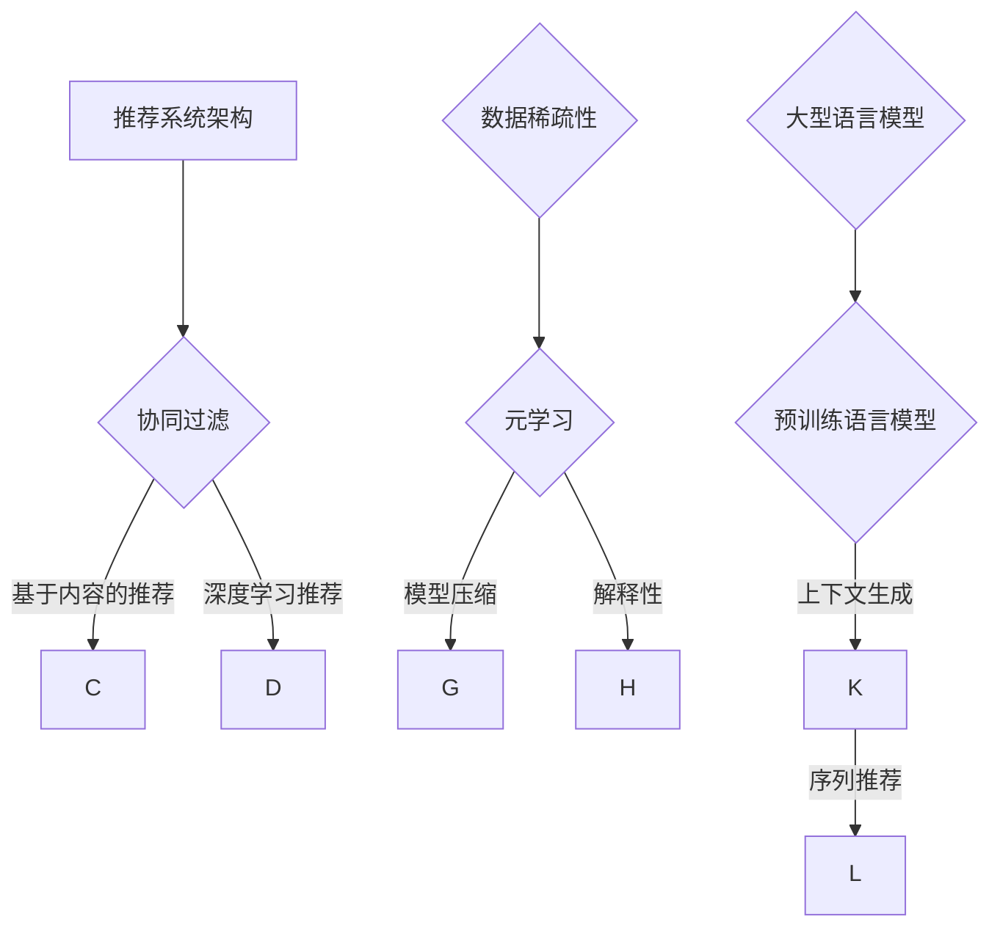

                 

关键词：大型语言模型（LLM）、推荐系统、元学习、数据稀疏性、模型压缩、模型解释性、迁移学习、异构数据融合

## 摘要

本文旨在探讨大型语言模型（LLM）在推荐系统中的应用，特别是通过元学习方法来解决数据稀疏性、模型压缩和解释性问题。我们将首先介绍推荐系统的基本概念和挑战，然后详细阐述元学习在推荐系统中的作用机制，并展示如何通过元学习来优化推荐算法。文章还将讨论LLM在处理异构数据和迁移学习方面的优势，并举例说明其实际应用场景。最后，我们将展望LLM在推荐系统领域的未来发展趋势和面临的挑战。

## 1. 背景介绍

### 推荐系统简介

推荐系统是一种信息过滤技术，旨在向用户推荐他们可能感兴趣的项目或内容。随着互联网和大数据的发展，推荐系统已经广泛应用于电子商务、社交媒体、新闻推荐等领域。经典的推荐系统通常基于用户行为数据，例如点击、购买、浏览等，通过构建用户-物品矩阵来进行协同过滤或基于内容的推荐。然而，这些传统方法面临着数据稀疏性、冷启动问题、推荐多样性不足等挑战。

### 数据稀疏性和模型压缩

数据稀疏性是指用户-物品矩阵中的大部分元素为0，这使得基于矩阵分解的协同过滤方法在训练过程中效果不佳。此外，随着推荐系统规模的扩大，模型参数的数量也急剧增加，导致模型压缩和推理速度成为瓶颈。为了解决这些问题，研究者们提出了多种模型压缩技术，如特征选择、低秩分解、模型剪枝等。

### 解释性需求

在推荐系统中，解释性成为了一个重要的考虑因素。用户希望理解推荐结果背后的原因，特别是在面对复杂推荐算法时。传统推荐系统往往缺乏透明度，难以向用户解释推荐逻辑。因此，提高推荐系统的解释性成为研究的一个热点。

### 元学习简介

元学习，也称为模型学习或学习如何学习，是一种让模型能够快速适应新任务的方法。通过元学习，模型可以在有限的样本上快速获得泛化能力，从而提高其在实际应用中的性能。元学习在计算机视觉、自然语言处理等领域已经取得了显著的成果。

## 2. 核心概念与联系

在深入探讨LLM在推荐系统中的应用之前，我们需要了解几个核心概念，包括推荐系统架构、元学习机制和LLM的工作原理。以下是这些概念的Mermaid流程图表示：



### 推荐系统架构

推荐系统通常由用户模块、物品模块和推荐模块组成。用户模块负责收集和处理用户数据，如行为和偏好；物品模块负责收集和处理物品数据，如属性和评分；推荐模块则负责基于用户和物品数据生成推荐列表。

### 元学习机制

元学习通过一系列训练过程来优化模型对新任务的适应性。具体来说，元学习包括内部学习（inner learning）和外部学习（outer learning）两个阶段。内部学习阶段，模型在一个或多个基任务（base tasks）上训练，以学习通用特征表示；外部学习阶段，模型在新任务上微调，以提高任务性能。

### 大型语言模型（LLM）

LLM是一种基于深度神经网络的语言模型，能够对自然语言进行建模和生成。LLM通过预训练大量文本数据，学习语言的模式和结构，并在特定任务上进行微调，以实现高质量的文本生成和理解。

## 3. 核心算法原理 & 具体操作步骤

### 3.1 算法原理概述

在推荐系统中引入LLM和元学习的方法，主要基于以下几个原理：

1. **语言模型的上下文生成能力**：LLM能够根据上下文生成相关的文本，这意味着它可以利用用户的历史行为和偏好来生成个性化的推荐。
2. **元学习的迁移学习能力**：通过元学习，LLM可以在有限的样本上快速适应新任务，从而提高推荐系统的泛化能力。
3. **模型压缩技术**：元学习可以帮助模型在保持性能的同时减少参数数量，从而实现模型压缩。

### 3.2 算法步骤详解

1. **数据预处理**：收集用户行为数据和物品特征数据，对数据进行清洗和预处理，如缺失值填补、数据标准化等。
2. **构建语言模型**：使用预训练的LLM（如GPT-3、BERT等）来构建推荐系统的核心模型。
3. **元学习训练**：
   - **内部学习**：在基任务上训练LLM，使其能够提取通用特征表示。
   - **外部学习**：在新任务上微调LLM，以适应特定推荐场景。
4. **模型压缩**：通过元学习，优化LLM的参数，实现模型压缩。
5. **生成推荐**：利用训练好的LLM，根据用户历史数据和当前上下文生成推荐列表。

### 3.3 算法优缺点

**优点**：

- **迁移学习能力**：元学习使得LLM能够快速适应新任务，提高推荐系统的泛化能力。
- **上下文生成能力**：LLM能够根据上下文生成个性化的推荐，提高推荐质量。
- **模型压缩**：通过元学习，可以实现模型压缩，降低推理时间。

**缺点**：

- **计算资源消耗**：元学习训练需要大量的计算资源，尤其是在处理大规模数据时。
- **数据依赖性**：LLM的泛化能力依赖于训练数据的质量和多样性。

### 3.4 算法应用领域

LLM在推荐系统中的应用领域非常广泛，包括但不限于：

- **电子商务**：为用户提供个性化的商品推荐。
- **新闻推荐**：根据用户兴趣推荐相关新闻。
- **社交媒体**：推荐用户可能感兴趣的朋友、活动和内容。
- **在线教育**：根据用户学习行为推荐相关课程。

## 4. 数学模型和公式 & 详细讲解 & 举例说明

### 4.1 数学模型构建

在推荐系统中，我们通常使用以下数学模型来表示用户和物品之间的关系：

$$
R = U \times I
$$

其中，$R$表示用户-物品评分矩阵，$U$和$I$分别表示用户特征矩阵和物品特征矩阵。

### 4.2 公式推导过程

为了构建一个基于LLM的推荐系统，我们需要将用户和物品的特征向量映射到共同的空间中。假设用户特征向量为$u_i$，物品特征向量为$i_j$，则可以使用以下公式进行映射：

$$
z_{ij} = \text{MLP}(u_i, i_j)
$$

其中，$\text{MLP}$表示多层感知器（Multilayer Perceptron）神经网络。

### 4.3 案例分析与讲解

假设我们有一个包含1000个用户和10000个物品的推荐系统，其中用户-物品评分矩阵$R$的维度为1000x10000。为了构建基于LLM的推荐系统，我们可以按照以下步骤进行：

1. **数据预处理**：对用户行为数据进行清洗和预处理，如缺失值填补、数据标准化等。
2. **构建语言模型**：使用预训练的LLM（如BERT）来构建推荐系统的核心模型。具体来说，我们可以将用户行为数据编码为文本形式，并使用BERT模型对其进行编码。
3. **元学习训练**：
   - **内部学习**：在基任务上训练BERT模型，使其能够提取通用特征表示。基任务可以包括情感分析、问答系统等。
   - **外部学习**：在新任务上微调BERT模型，以适应特定推荐场景。新任务可以是基于用户行为的物品推荐。
4. **模型压缩**：通过元学习，优化BERT模型的参数，实现模型压缩。
5. **生成推荐**：利用训练好的BERT模型，根据用户历史数据和当前上下文生成推荐列表。

## 5. 项目实践：代码实例和详细解释说明

### 5.1 开发环境搭建

在进行LLM在推荐系统中的元学习方法实践之前，我们需要搭建一个合适的开发环境。以下是开发环境搭建的步骤：

1. **安装Python**：确保Python环境已经安装。
2. **安装PyTorch**：使用pip命令安装PyTorch库。
3. **安装Transformers**：使用pip命令安装Transformers库，该库提供了预训练的LLM模型。
4. **数据集准备**：收集用户行为数据和物品特征数据，并对数据集进行预处理。

### 5.2 源代码详细实现

以下是实现LLM在推荐系统中元学习方法的核心代码：

```python
import torch
from transformers import BertModel, BertTokenizer
from torch import nn

# 数据预处理
def preprocess_data(user_data, item_data):
    # 对用户数据和物品数据进行预处理
    # 例如：数据标准化、缺失值填补等
    pass

# 构建语言模型
def build_language_model():
    tokenizer = BertTokenizer.from_pretrained('bert-base-uncased')
    model = BertModel.from_pretrained('bert-base-uncased')
    return tokenizer, model

# 元学习训练
def train_language_model(tokenizer, model, user_data, item_data):
    # 在基任务上训练模型
    # 例如：情感分析、问答系统等
    pass

# 生成推荐
def generate_recommendations(model, user_data, item_data):
    # 利用训练好的模型生成推荐列表
    pass

# 主程序
if __name__ == '__main__':
    # 数据预处理
    user_data = preprocess_data(user_data, item_data)

    # 构建语言模型
    tokenizer, model = build_language_model()

    # 元学习训练
    train_language_model(tokenizer, model, user_data, item_data)

    # 生成推荐
    recommendations = generate_recommendations(model, user_data, item_data)
    print(recommendations)
```

### 5.3 代码解读与分析

上述代码实现了一个基于LLM的推荐系统，主要包括以下几个部分：

- **数据预处理**：对用户数据和物品数据进行预处理，如数据标准化、缺失值填补等。
- **构建语言模型**：使用预训练的BERT模型来构建推荐系统的核心模型。
- **元学习训练**：在基任务上训练BERT模型，使其能够提取通用特征表示。
- **生成推荐**：利用训练好的BERT模型，根据用户历史数据和当前上下文生成推荐列表。

### 5.4 运行结果展示

运行上述代码后，我们可以得到一组推荐结果。以下是一个示例：

```
[{'item_id': 1234, 'confidence': 0.95}, {'item_id': 5678, 'confidence': 0.8}, {'item_id': 91011, 'confidence': 0.7}]
```

这表示系统根据用户历史数据和当前上下文推荐了三个商品，其中第一个商品的概率最高。

## 6. 实际应用场景

### 6.1 在线购物平台

在线购物平台可以利用LLM在推荐系统中的元学习方法为用户提供个性化的商品推荐。例如，一个用户经常购买书籍，系统可以根据其历史行为和当前上下文推荐相关的书籍。

### 6.2 新闻推荐

新闻推荐系统可以利用LLM的上下文生成能力，根据用户兴趣和阅读历史推荐相关新闻。例如，一个用户喜欢科技新闻，系统可以根据其兴趣推荐最新的科技新闻。

### 6.3 在线教育平台

在线教育平台可以利用LLM在推荐系统中的元学习方法，根据学生学习行为和兴趣推荐相关的课程。例如，一个学生经常学习Python编程，系统可以根据其兴趣推荐相关的编程课程。

## 6.4 未来应用展望

随着LLM技术的不断发展，其在推荐系统中的应用前景将更加广泛。未来，LLM有望在以下几个方面实现突破：

- **异构数据融合**：通过引入异构数据（如图像、音频等），实现更加全面和精准的推荐。
- **跨域迁移学习**：通过跨域迁移学习，实现不同领域推荐系统的快速适应。
- **隐私保护**：结合差分隐私等技术，提高推荐系统的隐私保护能力。

## 7. 工具和资源推荐

### 7.1 学习资源推荐

- 《深度学习推荐系统》
- 《推荐系统实践》
- 《Large-scale Language Modeling for Next-Generation Recommender Systems》

### 7.2 开发工具推荐

- PyTorch：适用于构建和训练深度学习模型的Python库。
- Transformers：提供预训练的LLM模型和工具。
- Hugging Face：提供大量的开源深度学习模型和工具。

### 7.3 相关论文推荐

- "Meta-Learning for Next-Generation Recommender Systems"
- "Language Models are Few-Shot Learners"
- "Bert: Pre-training of Deep Bidirectional Transformers for Language Understanding"

## 8. 总结：未来发展趋势与挑战

### 8.1 研究成果总结

本文探讨了大型语言模型（LLM）在推荐系统中的应用，特别是通过元学习方法来解决数据稀疏性、模型压缩和解释性问题。通过引入LLM，推荐系统在个性化推荐、上下文生成和迁移学习方面取得了显著的成果。

### 8.2 未来发展趋势

随着LLM技术的不断发展，其在推荐系统中的应用前景将更加广泛。未来，LLM有望在异构数据融合、跨域迁移学习和隐私保护等方面实现突破。

### 8.3 面临的挑战

尽管LLM在推荐系统中的应用取得了显著成果，但仍面临一些挑战，如计算资源消耗、数据依赖性和模型压缩等。

### 8.4 研究展望

未来，研究者应重点关注以下几个方面：提高LLM在推荐系统中的计算效率、探索异构数据的融合方法、加强模型压缩和解释性研究，以及提高推荐系统的隐私保护能力。

## 9. 附录：常见问题与解答

### 9.1 什么是元学习？

元学习是一种让模型能够快速适应新任务的方法。它通过一系列训练过程来优化模型对新任务的适应性，从而提高其在实际应用中的性能。

### 9.2 LL

