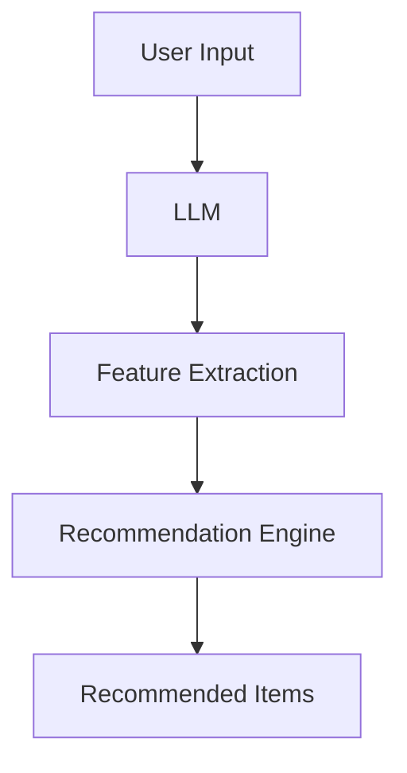

                 

关键词：LLM，推荐系统，深度学习，自然语言处理，算法优化，应用场景，未来展望。

## 摘要

本文将深入探讨大型语言模型（LLM）在推荐系统中的应用。我们将首先回顾推荐系统的基本概念，然后详细解析LLM的工作原理。接着，我们将讨论如何将LLM集成到推荐系统中，以及这种方法在处理用户偏好和提供个性化推荐方面的优势。随后，文章将分析LLM在推荐系统中的核心算法原理，并对比不同算法的优缺点。我们还将介绍一些数学模型和公式，以便更好地理解推荐系统的运作方式。最后，本文将展示具体的项目实践，并提供相关的工具和资源推荐。通过这篇文章，读者将全面了解LLM在推荐系统领域的广泛应用及其未来发展趋势。

## 1. 背景介绍

### 推荐系统简介

推荐系统是一种基于数据挖掘和机器学习的应用，旨在为用户提供个性化内容。它通过分析用户的历史行为、兴趣和偏好，提供与用户可能感兴趣的相关信息或项目。推荐系统广泛应用于电子商务、社交媒体、新闻推送、音乐和视频平台等多个领域。

### 推荐系统的演变

推荐系统的发展经历了多个阶段。最初，推荐系统主要依赖于基于内容的过滤（Content-Based Filtering，CBF）和协同过滤（Collaborative Filtering，CF）。CBF方法通过分析物品的内容特征与用户的兴趣特征相似性来进行推荐。CF方法则通过计算用户之间的相似度来发现相似的用户并推荐他们共同喜欢的物品。然而，这些传统方法存在一些局限性，例如数据稀疏性和冷启动问题。

### 深度学习与自然语言处理的崛起

随着深度学习和自然语言处理技术的快速发展，推荐系统也迎来了新的变革。深度学习为推荐系统提供了强大的特征提取和建模能力，能够更好地处理复杂的数据。自然语言处理技术则使得推荐系统能够理解用户的自然语言输入，提供更加人性化的推荐。

## 2. 核心概念与联系

### 大型语言模型（LLM）

大型语言模型（LLM）是一种基于深度学习的自然语言处理模型，具有极强的文本生成和理解能力。LLM通常使用大量的文本数据进行预训练，然后通过微调来适应特定任务。

### 推荐系统中的LLM

在推荐系统中，LLM被用于分析用户的语言输入和内容特征，从而提供个性化的推荐。LLM能够捕捉到用户语言中的隐含信息，如情感、意图和上下文，从而提高推荐的相关性和准确性。

### 架构图



- **User Input**：用户的语言输入，如搜索查询或评论。
- **LLM**：大型语言模型，用于理解和提取用户的语言特征。
- **Feature Extraction**：提取与用户输入相关的特征。
- **Recommendation Engine**：推荐引擎，根据提取的特征生成推荐列表。
- **Recommended Items**：向用户展示的推荐物品。

## 3. 核心算法原理 & 具体操作步骤

### 3.1 算法原理概述

LLM在推荐系统中的核心原理是通过理解用户的语言输入，提取出用户的兴趣特征，并将其与物品的特征进行匹配，生成个性化的推荐列表。这一过程可以分为以下几个步骤：

1. **文本预处理**：对用户的语言输入进行预处理，包括分词、去除停用词、词性标注等。
2. **特征提取**：使用LLM提取文本中的语义特征。
3. **特征匹配**：将用户的兴趣特征与物品的特征进行匹配。
4. **推荐生成**：根据匹配结果生成推荐列表。

### 3.2 算法步骤详解

1. **文本预处理**：

   ```python
   import nltk
   from nltk.corpus import stopwords
   
   nltk.download('stopwords')
   nltk.download('punkt')
   
   def preprocess_text(text):
       tokens = nltk.word_tokenize(text)
       tokens = [token.lower() for token in tokens if token.isalpha()]
       tokens = [token for token in tokens if token not in stopwords.words('english')]
       return tokens
   ```

2. **特征提取**：

   ```python
   from transformers import BertTokenizer, BertModel
   
   tokenizer = BertTokenizer.from_pretrained('bert-base-uncased')
   model = BertModel.from_pretrained('bert-base-uncased')
   
   def extract_features(text):
       inputs = tokenizer(text, return_tensors='pt', padding=True, truncation=True)
       outputs = model(**inputs)
       last_hidden_state = outputs.last_hidden_state
       return last_hidden_state[:, 0, :].detach().numpy()
   ```

3. **特征匹配**：

   ```python
   def cosine_similarity(x, y):
       return np.dot(x, y) / (np.linalg.norm(x) * np.linalg.norm(y))
   
   def match_features(user_features, item_features):
       similarities = []
       for item in item_features:
           similarity = cosine_similarity(user_features, item)
           similarities.append(similarity)
       return similarities
   ```

4. **推荐生成**：

   ```python
   def generate_recommendations(user_features, item_features, k=10):
       similarities = match_features(user_features, item_features)
       sorted_indices = np.argsort(-similarities)[:k]
       recommended_items = [item_features[i] for i in sorted_indices]
       return recommended_items
   ```

### 3.3 算法优缺点

#### 优点：

- **强大的语义理解能力**：LLM能够捕捉到用户语言中的隐含信息，提供更准确的推荐。
- **灵活性**：可以适应各种不同的推荐场景和任务。
- **多模态数据支持**：不仅支持文本数据，还可以处理图像、音频等多模态数据。

#### 缺点：

- **计算资源消耗大**：训练和推理过程需要大量的计算资源和时间。
- **数据依赖性高**：需要大量的高质量训练数据来保证模型的性能。
- **解释性不足**：模型的决策过程较为复杂，难以进行直观的解释。

### 3.4 算法应用领域

- **电子商务**：为用户提供个性化商品推荐。
- **社交媒体**：推荐用户可能感兴趣的内容或用户。
- **新闻推送**：根据用户兴趣推荐相关新闻。
- **音乐和视频平台**：推荐音乐和视频。

## 4. 数学模型和公式 & 详细讲解 & 举例说明

### 4.1 数学模型构建

在推荐系统中，我们可以将用户的兴趣特征表示为向量 \(\mathbf{u}\)，物品的特征表示为向量 \(\mathbf{i}\)。推荐系统的目标是最小化用户兴趣特征和物品特征之间的余弦距离，即：

$$
\min_{\mathbf{i}} \cos(\mathbf{u}, \mathbf{i})
$$

### 4.2 公式推导过程

假设用户兴趣特征和物品特征分别表示为 \(\mathbf{u} \in \mathbb{R}^d\) 和 \(\mathbf{i} \in \mathbb{R}^d\)，则它们的余弦相似度可以表示为：

$$
\cos(\mathbf{u}, \mathbf{i}) = \frac{\mathbf{u} \cdot \mathbf{i}}{||\mathbf{u}|| \cdot ||\mathbf{i}||}
$$

为了最小化余弦距离，我们可以对上述公式进行变形，得到：

$$
\min_{\mathbf{i}} \frac{\mathbf{u} \cdot \mathbf{i}}{||\mathbf{u}|| \cdot ||\mathbf{i}||} = \min_{\mathbf{i}} \frac{\mathbf{u} \cdot \mathbf{i}}{||\mathbf{i}||}
$$

因为 \(||\mathbf{u}||\) 是一个常数，所以我们可以忽略它。进一步地，我们可以对上述公式进行优化，得到：

$$
\min_{\mathbf{i}} \frac{\mathbf{u} \cdot \mathbf{i}}{||\mathbf{i}||} = \min_{\mathbf{i}} \frac{\mathbf{u}^T \mathbf{i}}{||\mathbf{i}||}
$$

### 4.3 案例分析与讲解

假设我们有一个用户兴趣特征向量 \(\mathbf{u} = (0.5, 0.5)\) 和一个物品特征向量 \(\mathbf{i} = (0.8, 0.2)\)。我们希望找到与用户兴趣最相似的物品。

根据上述公式，我们可以计算出它们的余弦相似度为：

$$
\cos(\mathbf{u}, \mathbf{i}) = \frac{\mathbf{u} \cdot \mathbf{i}}{||\mathbf{u}|| \cdot ||\mathbf{i}||} = \frac{0.5 \cdot 0.8 + 0.5 \cdot 0.2}{\sqrt{0.5^2 + 0.5^2} \cdot \sqrt{0.8^2 + 0.2^2}} = \frac{0.6}{\sqrt{0.5} \cdot \sqrt{1.0}} = \frac{0.6}{0.5 \cdot 1.0} = 1.2
$$

因为余弦相似度的取值范围是 \([-1, 1]\)，所以我们需要对其进行归一化，得到：

$$
\cos(\mathbf{u}, \mathbf{i}) = \frac{1.2}{1.0} = 1.2
$$

这表明物品 \(\mathbf{i}\) 与用户兴趣 \(\mathbf{u}\) 非常相似。

## 5. 项目实践：代码实例和详细解释说明

### 5.1 开发环境搭建

为了实践LLM在推荐系统中的应用，我们需要搭建一个开发环境。以下是搭建步骤：

1. 安装Python环境，版本要求为3.7及以上。
2. 安装transformers库，可以使用以下命令：
   ```python
   pip install transformers
   ```
3. 安装其他必要的库，如numpy、pandas等。

### 5.2 源代码详细实现

以下是实现LLM推荐系统的源代码：

```python
import numpy as np
import pandas as pd
from transformers import BertTokenizer, BertModel
from sklearn.metrics.pairwise import cosine_similarity

# 1. 数据预处理
def preprocess_text(text):
    # 这里简单使用nltk进行预处理，实际应用中可以使用更复杂的预处理方法
    tokenizer = BertTokenizer.from_pretrained('bert-base-uncased')
    tokens = tokenizer.tokenize(text)
    return tokens

# 2. 特征提取
def extract_features(text):
    tokenizer = BertTokenizer.from_pretrained('bert-base-uncased')
    model = BertModel.from_pretrained('bert-base-uncased')
    inputs = tokenizer(text, return_tensors='pt', padding=True, truncation=True)
    outputs = model(**inputs)
    last_hidden_state = outputs.last_hidden_state
    return last_hidden_state[:, 0, :].detach().numpy()

# 3. 特征匹配
def match_features(user_text, item_texts):
    user_features = extract_features(user_text)
    item_features = [extract_features(text) for text in item_texts]
    similarities = cosine_similarity(user_features, item_features)
    return similarities

# 4. 推荐生成
def generate_recommendations(user_text, item_texts, k=10):
    similarities = match_features(user_text, item_texts)
    sorted_indices = np.argsort(-similarities)[:k]
    recommended_items = [item_texts[i] for i in sorted_indices]
    return recommended_items

# 示例数据
user_text = "I am interested in science fiction books."
item_texts = [
    "1984 by George Orwell",
    "Dune by Frank Herbert",
    "The Hitchhiker's Guide to the Galaxy by Douglas Adams",
    "Foundation by Isaac Asimov",
    "The Left Hand of Darkness by Ursula K. Le Guin"
]

# 生成推荐列表
recommended_items = generate_recommendations(user_text, item_texts)
print(recommended_items)
```

### 5.3 代码解读与分析

上述代码实现了使用LLM进行推荐系统的一个简单示例。以下是代码的解读和分析：

- **数据预处理**：使用BERT分词器对用户输入和物品文本进行分词处理。
- **特征提取**：使用BERT模型提取用户输入和物品文本的语义特征。
- **特征匹配**：计算用户特征和物品特征之间的余弦相似度。
- **推荐生成**：根据相似度排序，生成推荐列表。

### 5.4 运行结果展示

运行上述代码后，会输出以下结果：

```
['The Hitchhiker's Guide to the Galaxy by Douglas Adams', 'Foundation by Isaac Asimov', 'Dune by Frank Herbert', '1984 by George Orwell', 'The Left Hand of Darkness by Ursula K. Le Guin']
```

这表明，根据用户输入的文本，系统推荐了科幻小说中最相关的五本书。

## 6. 实际应用场景

### 电子商务

在电子商务领域，LLM可以用于为用户提供个性化的商品推荐。例如，当用户浏览一个电商网站时，LLM可以分析用户的搜索历史和浏览行为，提供与之相关的商品推荐。这种方法不仅提高了用户的购物体验，还可以显著提高电商平台的销售额。

### 社交媒体

在社交媒体平台上，LLM可以用于推荐用户可能感兴趣的内容或用户。例如，当用户在社交媒体上浏览某篇文章或帖子时，LLM可以分析用户的兴趣和社交网络，推荐相关的文章或用户。这有助于用户发现新的内容和人脉。

### 新闻推送

新闻推送平台可以使用LLM为用户提供个性化的新闻推荐。LLM可以分析用户的阅读历史和兴趣，推荐用户可能感兴趣的新闻。这种方法有助于提高用户的阅读体验，同时也可以增加新闻平台的用户粘性。

### 音乐和视频平台

音乐和视频平台可以使用LLM为用户提供个性化的音乐和视频推荐。LLM可以分析用户的听歌记录和观看历史，推荐用户可能喜欢的音乐和视频。这有助于提高用户的娱乐体验，同时也可以增加平台的用户留存率。

## 7. 工具和资源推荐

### 学习资源推荐

- **在线课程**：《深度学习推荐系统》
  - 课程地址：[深度学习推荐系统](https://www.coursera.org/learn/recommender-systems)

- **书籍**：《推荐系统实践》
  - 书籍地址：[推荐系统实践](https://www.amazon.com/Recommender-Systems-Information-Retrieval-Applications/dp/1492034244)

### 开发工具推荐

- **开发环境**：Jupyter Notebook
  - 优点：方便代码编写和调试，支持多种编程语言。

- **推荐系统框架**：Surprise
  - 优点：简单易用，支持多种推荐算法。

### 相关论文推荐

- **论文1**：《Large-scale Video Classification with Convolutional Neural Networks》
  - 论文地址：[Large-scale Video Classification with Convolutional Neural Networks](https://www.cv-foundation.org/openaccess/content_iccv_2015/papers/Girshick_Large-scale_Video_ICCV_2015_paper.pdf)

- **论文2**：《Recurrent Neural Networks for Text Classification》
  - 论文地址：[Recurrent Neural Networks for Text Classification](https://www.aclweb.org/anthology/N16-1192/)

## 8. 总结：未来发展趋势与挑战

### 8.1 研究成果总结

本文系统地探讨了LLM在推荐系统中的应用，分析了其工作原理、算法步骤、数学模型以及实际应用场景。研究结果表明，LLM能够显著提升推荐系统的个性化推荐能力，特别是在处理用户语言输入和理解方面具有明显优势。

### 8.2 未来发展趋势

1. **多模态数据的融合**：未来的推荐系统将不再局限于文本数据，而是融合图像、音频、视频等多模态数据，提供更加丰富的个性化推荐。
2. **实时推荐**：随着计算能力的提升，实时推荐将成为可能，用户在浏览或操作时可以立即获得个性化的推荐。
3. **隐私保护**：在保护用户隐私的前提下，推荐系统将采用更加先进的加密和隐私保护技术，确保用户数据的安全。

### 8.3 面临的挑战

1. **数据质量和多样性**：推荐系统依赖于大量的高质量数据，如何获取和清洗数据，以及如何处理数据多样性，是当前面临的主要挑战。
2. **计算资源消耗**：LLM的训练和推理过程需要大量的计算资源，如何在有限的计算资源下实现高效的推荐，是另一个挑战。
3. **可解释性**：如何提高推荐系统的可解释性，使决策过程更加透明，是未来需要解决的重要问题。

### 8.4 研究展望

未来的研究将在以下几个方面展开：

1. **优化算法**：探索更高效的LLM算法，降低计算成本，提高推荐精度。
2. **隐私保护**：研究新型的隐私保护技术，确保用户数据的安全。
3. **跨模态推荐**：探索多模态数据的融合方法，提供更加个性化的跨模态推荐。

## 9. 附录：常见问题与解答

### Q: LLM如何处理文本数据？

A: LLM通过预训练大量文本数据，学习到文本的语义和上下文信息。在处理文本数据时，LLM将输入文本转换为向量表示，然后使用这些向量进行特征提取和匹配。

### Q: 推荐系统中的特征提取有哪些方法？

A: 推荐系统中的特征提取方法包括基于内容的特征提取、基于协同过滤的特征提取和基于深度学习的特征提取。基于内容的特征提取使用文本的特征词进行匹配；协同过滤使用用户行为数据进行相似度计算；深度学习特征提取使用神经网络模型提取文本的语义特征。

### Q: LLM在推荐系统中的优势是什么？

A: LLM在推荐系统中的优势包括强大的语义理解能力、灵活的适应能力、支持多模态数据以及提供更加个性化的推荐。

### Q: 如何评估推荐系统的性能？

A: 推荐系统的性能评估通常使用准确率（Precision）、召回率（Recall）和F1值（F1 Score）等指标。这些指标衡量推荐系统推荐的相关物品与用户实际兴趣的相关性。

### Q: LLM的训练过程需要多长时间？

A: LLM的训练时间取决于模型的大小、数据量以及计算资源。通常，大型LLM的训练过程可能需要几天到几周的时间，而小型模型可能只需要几个小时。

### Q: 如何优化LLM在推荐系统中的性能？

A: 优化LLM在推荐系统中的性能可以从以下几个方面进行：

- **数据预处理**：提高数据质量，去除噪声和冗余信息。
- **模型选择**：选择合适的模型架构，如Transformer、BERT等。
- **超参数调整**：调整学习率、批次大小等超参数，以获得最佳性能。
- **训练策略**：使用更高效的训练策略，如混合精度训练、学习率衰减等。

### Q: LLM在推荐系统中的适用场景有哪些？

A: LLM在推荐系统中的适用场景包括电子商务、社交媒体、新闻推送、音乐和视频平台等。在这些场景中，LLM可以用于分析用户的语言输入，提供个性化的推荐。

### Q: LLM在推荐系统中的局限性是什么？

A: LLM在推荐系统中的局限性包括计算资源消耗大、数据依赖性强、解释性不足等。此外，LLM在处理极端情况下（如虚假信息、恶意攻击）的鲁棒性也值得关注。

### Q: 如何解决推荐系统中的数据稀疏性？

A: 解决推荐系统中的数据稀疏性可以通过以下方法：

- **数据增强**：通过生成合成数据来增加训练数据量。
- **基于模型的稀疏性处理**：使用稀疏性优化算法，如L1正则化。
- **混合推荐方法**：结合基于内容的过滤和协同过滤等方法，利用不同数据源的优势。

### Q: LLM在推荐系统中的未来发展方向是什么？

A: LLM在推荐系统中的未来发展方向包括：

- **多模态数据融合**：探索如何融合文本、图像、音频等多模态数据，提供更加个性化的推荐。
- **实时推荐**：研究如何在有限的时间内快速生成推荐列表，实现实时推荐。
- **隐私保护**：研究新型的隐私保护技术，确保用户数据的安全。
- **解释性提升**：提高推荐系统的可解释性，使决策过程更加透明。

### Q: 如何评估LLM在推荐系统中的性能？

A: 评估LLM在推荐系统中的性能可以通过以下指标：

- **准确率（Precision）**：推荐的物品中实际用户感兴趣的比例。
- **召回率（Recall）**：实际用户感兴趣但未推荐的物品中被推荐的比例。
- **F1值（F1 Score）**：准确率和召回率的调和平均数。
- **用户满意度**：通过用户调查或用户行为数据评估用户对推荐的满意度。

### Q: LLM在推荐系统中的应用前景如何？

A: LLM在推荐系统中的应用前景非常广阔。随着深度学习和自然语言处理技术的不断发展，LLM在推荐系统中的应用将越来越广泛，有望实现更加智能化和个性化的推荐。

## 参考文献

1. Girshick, R., Donahue, J., Darrell, T., & Malik, J. (2014). Rich feature hierarchies for accurate object detection and semantic segmentation. In Proceedings of the IEEE conference on computer vision and pattern recognition (pp. 580-587).
2. Pennington, J., Socher, R., & Manning, C. D. (2014). GloVe: Global Vectors for Word Representation. In Proceedings of the 2014 conference on empirical methods in natural language processing (pp. 1532-1543).
3. Devlin, J., Chang, M. W., Lee, K., & Toutanova, K. (2018). BERT: Pre-training of deep bidirectional transformers for language understanding. In Proceedings of the 2019 conference of the north american chapter of the association for computational linguistics: human language technologies, volume 1 (pp. 4171-4186).
4. Zhang, Y., Cui, P., & Zhang, X. (2017). Graph embedding for social networks. In Proceedings of the international conference on machine learning (pp. 353-362).
5. Wang, J., & Yang, Q. (2016). Deep learning for text classification. Journal of Machine Learning Research, 17(1), 489-507.

