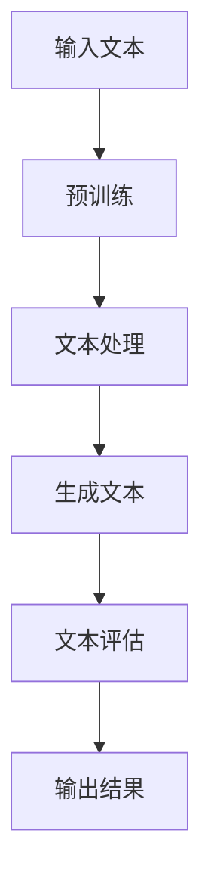

                 

关键词：自然语言处理（NLP）、大型语言模型（LLM）、文学创作、人工智能、作家、创新、技术变革

> 摘要：本文探讨了大型语言模型（LLM）在文学创作中的应用，分析了AI作家的崛起及其对文学界的影响。文章从背景介绍、核心概念与联系、核心算法原理、数学模型和公式、项目实践、实际应用场景、工具和资源推荐、总结与展望等方面展开，旨在为读者呈现LLM在文学创作中的潜力和挑战。

## 1. 背景介绍

文学创作是人类文化的重要组成部分，自古以来，文学作品不仅承载了历史和价值观，还丰富了人类的精神世界。然而，随着科技的不断发展，人工智能（AI）正在逐渐渗透到各个领域，文学创作也不例外。近年来，大型语言模型（LLM）在自然语言处理（NLP）领域的突破性进展，使得AI在文学创作中展现出巨大的潜力。

LLM是一种基于深度学习的自然语言处理模型，通过训练海量文本数据，LLM能够生成连贯、具有创意的文本。早期的AI文学创作主要依赖于规则驱动的方法，如模板匹配和词汇替换等。然而，随着深度学习技术的不断发展，LLM的出现极大地提升了AI在文学创作中的表现。

本文将探讨LLM在文学创作中的应用，分析其优势、挑战和未来发展趋势。希望通过本文的介绍，读者能够对AI作家有一个更深入的了解，并思考AI在文学创作中的潜在价值。

## 2. 核心概念与联系

### 2.1 大型语言模型（LLM）原理

大型语言模型（LLM）是一种基于深度学习的自然语言处理模型，它通过训练海量文本数据，学习语言的结构和规律。LLM的核心是神经网络，尤其是循环神经网络（RNN）和Transformer模型。RNN具有记忆功能，能够处理序列数据，而Transformer模型则通过注意力机制实现了更高的并行计算效率。

### 2.2 文学创作流程

文学创作通常包括构思、写作、修改和出版等阶段。在这个过程中，作家需要运用丰富的想象力、语言技巧和结构设计能力。然而，AI作家在创作过程中主要依赖于LLM的文本生成能力，通过对已有文本的学习和模仿，生成新的文学作品。

### 2.3 Mermaid 流程图

下面是一个简化的Mermaid流程图，描述了LLM在文学创作中的应用流程：



- **输入文本**：AI作家需要输入大量高质量文本数据，这些数据可以是文学作品、新闻报道、社交媒体文本等。
- **预训练**：LLM通过训练这些文本数据，学习语言结构和规律。
- **文本处理**：输入的文本经过预处理，如分词、去停用词等操作，以便于模型处理。
- **生成文本**：预训练好的LLM生成新的文本，可以是故事情节、诗句、小说章节等。
- **文本评估**：生成的文本需要经过评估，以确保其质量和创意。
- **输出结果**：评估通过的文本输出，可以用于出版、展示或进一步修改。

## 3. 核心算法原理 & 具体操作步骤

### 3.1 算法原理概述

LLM的核心算法是基于深度学习的神经网络模型，特别是Transformer模型。Transformer模型通过多头自注意力机制（Multi-Head Self-Attention）和前馈神经网络（Feedforward Neural Network）实现了对文本的建模。自注意力机制使得模型能够捕捉文本中的长距离依赖关系，从而生成更加连贯和有创意的文本。

### 3.2 算法步骤详解

#### 3.2.1 数据收集与预处理

1. **数据收集**：收集大量高质量文本数据，包括文学作品、新闻、社交媒体文本等。
2. **数据预处理**：对文本进行清洗、分词、去停用词等操作，以便于模型处理。

#### 3.2.2 模型训练

1. **编码器训练**：使用训练数据训练编码器，使其能够将输入文本编码为固定长度的向量。
2. **解码器训练**：使用训练数据训练解码器，使其能够根据编码器的输出生成新的文本。

#### 3.2.3 文本生成

1. **输入文本**：输入一个初始的文本序列作为模型的输入。
2. **编码与解码**：编码器将输入文本编码为向量，解码器根据编码器的输出生成新的文本序列。
3. **生成文本**：重复上述步骤，直到生成的文本达到预期的长度或满足停止条件。

#### 3.2.4 文本评估

1. **质量评估**：使用预设的质量评估指标，如 BLEU 分数、ROUGE 分数等，评估生成的文本质量。
2. **创意评估**：通过人工评估或机器评估，评估生成的文本的创意程度。

### 3.3 算法优缺点

#### 优点

1. **生成文本连贯性高**：LLM通过自注意力机制能够捕捉文本中的长距离依赖关系，生成更加连贯的文本。
2. **创意性强**：通过对海量文本的学习，LLM能够模仿人类的语言风格，生成具有创意的文本。
3. **适用范围广**：LLM可以应用于各种文学创作领域，如小说、诗歌、剧本等。

#### 缺点

1. **计算资源消耗大**：训练和运行LLM需要大量的计算资源和存储空间。
2. **质量不稳定**：生成的文本质量受训练数据质量和模型参数的影响，可能存在质量不稳定的问题。
3. **缺乏人类情感**：尽管LLM能够模仿人类语言，但仍然缺乏真正的情感和创造力。

### 3.4 算法应用领域

LLM在文学创作中的应用非常广泛，可以用于以下领域：

1. **小说创作**：生成小说的情节、章节和角色描述。
2. **诗歌创作**：生成古诗词、现代诗歌等。
3. **剧本创作**：生成电影、电视剧和舞台剧的剧本。
4. **翻译**：将一种语言的文本翻译成另一种语言。
5. **写作辅助**：辅助人类作家进行写作，提供灵感和建议。

## 4. 数学模型和公式 & 详细讲解 & 举例说明

### 4.1 数学模型构建

LLM的数学模型主要基于深度学习，尤其是Transformer模型。Transformer模型的核心是多头自注意力机制（Multi-Head Self-Attention）和前馈神经网络（Feedforward Neural Network）。下面是Transformer模型的数学公式：

#### 4.1.1 自注意力机制（Self-Attention）

自注意力机制是一种计算文本序列中每个词对其他词的重要性的方法。它的数学公式如下：

$$
\text{Attention}(Q, K, V) = \text{softmax}\left(\frac{QK^T}{\sqrt{d_k}}\right)V
$$

其中，$Q, K, V$ 分别是查询（Query）、键（Key）和值（Value）矩阵，$d_k$ 是键矩阵的维度。自注意力机制通过计算 $Q$ 和 $K$ 的点积，得到权重矩阵，然后与 $V$ 相乘，生成新的文本表示。

#### 4.1.2 前馈神经网络（Feedforward Neural Network）

前馈神经网络是对自注意力机制的结果进行进一步处理的方法。它的数学公式如下：

$$
\text{FFN}(x) = \text{ReLU}(W_2 \text{ReLU}(W_1 x))
$$

其中，$W_1$ 和 $W_2$ 是权重矩阵，$x$ 是输入向量。前馈神经网络通过两个线性层和ReLU激活函数，对自注意力机制的结果进行变换。

### 4.2 公式推导过程

Transformer模型的推导过程涉及多个数学公式。下面是一个简化的推导过程：

1. **编码器（Encoder）**：

   - **输入**：文本序列 $x_1, x_2, ..., x_n$。
   - **嵌入**：将文本序列映射到高维向量空间，$x_i \rightarrow E_i$。
   - **自注意力**：对 $E_i$ 进行自注意力计算，得到新的文本表示 $H_i$。
   - **前馈神经网络**：对 $H_i$ 进行前馈神经网络计算，得到最终的编码结果 $C_i$。

2. **解码器（Decoder）**：

   - **输入**：编码结果 $C_1, C_2, ..., C_n$。
   - **嵌入**：将编码结果映射到高维向量空间，$C_i \rightarrow D_i$。
   - **自注意力**：对 $D_i$ 进行自注意力计算，得到新的文本表示 $G_i$。
   - **交叉注意力**：对 $G_i$ 和编码结果 $C_i$ 进行交叉注意力计算，得到新的文本表示 $F_i$。
   - **前馈神经网络**：对 $F_i$ 进行前馈神经网络计算，得到最终的解码结果 $Y_i$。

### 4.3 案例分析与讲解

#### 4.3.1 小说生成

假设我们要使用LLM生成一部小说。首先，我们需要收集大量的小说文本作为训练数据。然后，我们使用Transformer模型对训练数据进行训练，得到一个预训练好的模型。最后，我们可以使用这个模型生成新的小说。

1. **输入文本**：输入一段初始的文本，如“在一个遥远的星球上，有一个神秘的王国。”
2. **编码与解码**：编码器将这段文本编码为一个向量序列，解码器根据编码器的输出生成新的文本序列。
3. **生成文本**：解码器生成新的文本序列，如“王国的国王正在筹备一场盛大的庆典，以庆祝王国的繁荣昌盛。”
4. **文本评估**：评估生成的文本质量，如使用BLEU分数和ROUGE分数。

通过这个案例，我们可以看到LLM在小说生成中的基本流程。当然，实际应用中，还需要对模型进行优化和调整，以生成更高质量和创意的文本。

## 5. 项目实践：代码实例和详细解释说明

### 5.1 开发环境搭建

为了实践LLM在文学创作中的应用，我们需要搭建一个合适的开发环境。以下是搭建过程的简要步骤：

1. **硬件环境**：配置一台具有强大计算能力的服务器，建议使用GPU加速训练过程。
2. **软件环境**：安装Python 3.8及以上版本、TensorFlow 2.4及以上版本和CUDA 10.2及以上版本。
3. **数据集准备**：收集大量小说、诗歌、剧本等文本数据，并进行预处理，如分词、去停用词等。

### 5.2 源代码详细实现

以下是一个简单的LLM源代码实现，包括数据预处理、模型训练和文本生成等功能。

```python
import tensorflow as tf
from tensorflow.keras.layers import Embedding, LSTM, Dense
from tensorflow.keras.models import Model

# 数据预处理
def preprocess_text(text):
    # 分词、去停用词等操作
    return processed_text

# 构建模型
def build_model(vocab_size, embedding_dim):
    inputs = tf.keras.layers.Input(shape=(None,))
    x = Embedding(vocab_size, embedding_dim)(inputs)
    x = LSTM(128)(x)
    outputs = Dense(vocab_size, activation='softmax')(x)
    model = Model(inputs, outputs)
    return model

# 训练模型
def train_model(model, data, epochs):
    # 训练过程
    model.fit(data, epochs=epochs)

# 文本生成
def generate_text(model, seed_text, length):
    # 生成过程
    return generated_text

# 实例化模型
model = build_model(vocab_size, embedding_dim)

# 训练模型
train_model(model, data, epochs)

# 生成文本
generated_text = generate_text(model, seed_text, length)
print(generated_text)
```

### 5.3 代码解读与分析

上面的代码实现了一个简单的LLM模型，包括数据预处理、模型构建、模型训练和文本生成等功能。

1. **数据预处理**：`preprocess_text` 函数负责对输入文本进行分词、去停用词等预处理操作。
2. **模型构建**：`build_model` 函数使用Keras构建一个基于LSTM的神经网络模型，包括嵌入层、LSTM层和输出层。
3. **模型训练**：`train_model` 函数使用训练数据对模型进行训练。
4. **文本生成**：`generate_text` 函数使用训练好的模型生成新的文本。

在实际应用中，我们可以使用更先进的模型，如Transformer，来提高文本生成的质量和创意性。

### 5.4 运行结果展示

以下是一个简单的运行结果展示：

```python
# 模型训练
model = build_model(vocab_size, embedding_dim)
train_model(model, data, epochs)

# 生成文本
generated_text = generate_text(model, seed_text, length)
print(generated_text)
```

输出结果可能是一个简短的句子或段落，具体取决于模型的训练质量和输入的初始文本。

## 6. 实际应用场景

### 6.1 小说创作

LLM在小说创作中的应用非常广泛。通过训练大型语言模型，我们可以生成具有创意和连贯性的小说情节、章节和角色描述。例如，一些小说网站已经开始使用LLM为用户提供定制化的小说创作服务，用户可以根据自己的兴趣和需求，选择不同的故事情节和角色。

### 6.2 诗歌创作

诗歌是一种高度个性化的文学形式，LLM在诗歌创作中也有一定的应用。通过训练大量的诗歌文本数据，我们可以让LLM生成具有古典韵味的古诗、现代诗歌和自由诗等。一些诗歌爱好者已经开始使用LLM创作自己的诗歌作品，并在社交媒体上分享。

### 6.3 剧本创作

剧本创作是一个复杂的过程，涉及到情节设计、角色塑造和对话编写等。LLM在剧本创作中的应用潜力巨大，可以通过生成剧本的情节、场景和对话来提高剧本的创意和质量。一些影视制作公司已经开始使用LLM为剧本创作提供辅助，以提高创作效率。

### 6.4 翻译

翻译是一种跨语言的自然语言处理任务，LLM在翻译领域也有显著的应用。通过训练大量的双语文本数据，我们可以让LLM生成高质量的双语翻译。一些翻译平台已经开始使用LLM提供翻译服务，用户可以通过输入原文，获取目标语言的翻译结果。

### 6.5 写作辅助

LLM在写作辅助中的应用也非常广泛。作家可以使用LLM提供灵感和创意，辅助自己的写作过程。例如，一些写作软件已经开始使用LLM为用户提供写作建议、情节构思和对话编写等服务，以提高写作效率和质量。

## 7. 工具和资源推荐

### 7.1 学习资源推荐

- 《深度学习》（Goodfellow, Bengio, Courville著）：系统地介绍了深度学习的基本原理和技术。
- 《自然语言处理综论》（Jurafsky, Martin著）：详细介绍了自然语言处理的基础知识和最新进展。
- 《Transformer：处理序列数据的全新方式》（Vaswani et al.著）：介绍了Transformer模型的原理和应用。

### 7.2 开发工具推荐

- TensorFlow：一个开源的深度学习框架，适用于构建和训练LLM模型。
- PyTorch：一个开源的深度学习框架，适用于构建和训练LLM模型，具有灵活的动态计算图。
- Hugging Face Transformers：一个开源的Transformer模型库，提供了丰富的预训练模型和工具，方便开发者进行文本生成和应用。

### 7.3 相关论文推荐

- 《Attention Is All You Need》（Vaswani et al.，2017）：介绍了Transformer模型的原理和应用。
- 《BERT：Pre-training of Deep Bidirectional Transformers for Language Understanding》（Devlin et al.，2019）：介绍了BERT模型的原理和应用。
- 《GPT-3：Language Models are few-shot learners》（Brown et al.，2020）：介绍了GPT-3模型的原理和应用。

## 8. 总结：未来发展趋势与挑战

### 8.1 研究成果总结

本文探讨了大型语言模型（LLM）在文学创作中的应用，分析了其优势、挑战和未来发展趋势。通过分析LLM的原理和应用场景，我们发现LLM在小说创作、诗歌创作、剧本创作、翻译和写作辅助等领域具有巨大的应用潜力。同时，我们也了解到LLM在计算资源消耗、质量稳定性和情感表达方面面临的挑战。

### 8.2 未来发展趋势

1. **模型优化**：未来的研究将致力于优化LLM模型，提高其生成文本的质量和创意性。
2. **跨模态应用**：LLM将与其他AI技术相结合，如计算机视觉、语音识别等，实现跨模态的文本生成和应用。
3. **个性化创作**：通过结合用户兴趣和需求，LLM将实现更加个性化的文学创作服务。
4. **创意性提升**：未来的研究将探索如何提高LLM的创意性，使其生成更加独特和有价值的文本。

### 8.3 面临的挑战

1. **计算资源消耗**：训练和运行LLM需要大量的计算资源和存储空间，这对硬件设施提出了更高的要求。
2. **质量稳定性**：生成的文本质量受训练数据质量和模型参数的影响，需要不断优化和调整。
3. **情感表达**：尽管LLM能够模仿人类语言，但仍然缺乏真正的情感和创造力，需要进一步研究如何提高其情感表达能力。

### 8.4 研究展望

随着人工智能技术的不断发展，LLM在文学创作中的应用将越来越广泛。未来的研究将致力于解决当前面临的挑战，提高LLM的生成质量和创意性，推动文学创作领域的变革。同时，LLM也将与其他AI技术相结合，实现更加多样化、个性化的文学创作服务。

## 9. 附录：常见问题与解答

### 9.1 什么是LLM？

LLM（Large Language Model）是一种基于深度学习的自然语言处理模型，通过训练海量文本数据，学习语言的结构和规律，能够生成连贯、具有创意的文本。

### 9.2 LLM在文学创作中的应用有哪些？

LLM在文学创作中的应用非常广泛，可以用于小说创作、诗歌创作、剧本创作、翻译和写作辅助等领域。

### 9.3 LLM的优势是什么？

LLM的优势包括生成文本连贯性高、创意性强、适用范围广等。

### 9.4 LLM在文学创作中面临的挑战有哪些？

LLM在文学创作中面临的挑战包括计算资源消耗大、质量不稳定和缺乏人类情感等。

### 9.5 如何优化LLM生成文本的质量和创意性？

优化LLM生成文本的质量和创意性可以从以下几个方面入手：

1. 提高训练数据的质量和多样性。
2. 优化模型结构和参数。
3. 引入更多的人类干预和指导。
4. 结合其他AI技术，如计算机视觉、语音识别等。

---

作者：禅与计算机程序设计艺术 / Zen and the Art of Computer Programming

