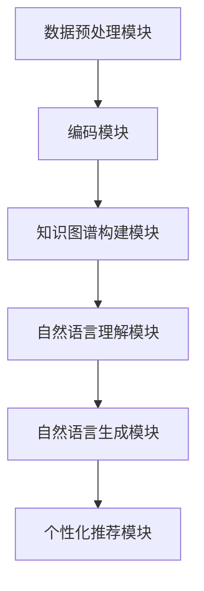

                 

### 1. 背景介绍

在当今世界，人工智能（AI）正以惊人的速度渗透到各个领域，医疗健康是其中的一个重要应用场景。随着大数据、云计算、物联网等技术的不断发展，医疗健康数据的收集和处理能力得到了极大的提升。然而，如何有效地利用这些海量数据为个人提供精准、个性化的健康建议，一直是学术界和产业界关注的热点问题。

近年来，深度学习技术，尤其是基于大规模预训练模型的生成式语言模型（Language Learning Models，简称LLM），如GPT、BERT等，在自然语言处理（Natural Language Processing，NLP）领域取得了显著的成果。这些模型通过学习海量文本数据，能够理解和生成人类语言，从而为智能健康建议提供了强大的技术支持。

个性化健康建议的重要性不言而喻。传统健康建议往往基于一般性的医学知识，缺乏针对个体差异的定制化服务。而个性化健康建议能够根据个人的健康状况、生活习惯、遗传背景等特征，提供个性化的预防、诊断和治疗方案，从而提高医疗服务的质量和效率。

本文将重点探讨LLM在智能个性化健康建议中的应用前景，分析其技术原理、应用场景、挑战与解决方案，以及未来发展趋势。

### 2. 核心概念与联系

#### 2.1 LLM的基本概念

生成式语言模型（LLM）是一种能够理解和生成自然语言文本的深度学习模型。与传统的规则驱动模型和基于统计的方法不同，LLM通过学习大规模的文本数据，能够自动捕捉语言中的复杂模式和规律。LLM的核心组件包括编码器（Encoder）和解码器（Decoder），其中编码器负责将输入的文本编码为一个固定长度的向量表示，解码器则根据编码器的输出逐步生成文本。

LLM的工作原理可以概括为以下几个步骤：

1. **数据预处理**：首先对大规模的文本数据进行预处理，包括分词、去停用词、词干提取等，将原始文本转换为模型能够处理的格式。

2. **编码**：编码器将预处理后的文本序列转换为固定长度的向量表示。这一过程利用了深度神经网络（DNN）或变换器（Transformer）等结构，能够捕捉文本中的长距离依赖关系。

3. **生成**：解码器根据编码器的输出，逐个字符地生成文本。这一过程采用了注意力机制（Attention Mechanism）和上下文信息，能够提高生成文本的连贯性和准确性。

#### 2.2 LLM与智能个性化健康建议的联系

智能个性化健康建议需要处理大量的文本数据，包括医疗文献、病历记录、健康报告等。LLM通过学习这些文本数据，能够为智能个性化健康建议提供以下几个关键能力：

1. **自然语言理解**：LLM能够理解医疗文本中的专业术语、医学术语，从而提取出关键信息，如症状、诊断、治疗方案等。

2. **自然语言生成**：LLM能够根据提取出的关键信息，生成个性化的健康建议文本，包括预防措施、饮食建议、运动计划等。

3. **知识图谱构建**：LLM可以通过学习大量的医疗文本数据，构建出一个包含医学知识、药物信息、疾病关联等知识的知识图谱。这个知识图谱可以为个性化健康建议提供丰富的背景信息。

4. **个性化推荐**：LLM能够根据用户的健康状况、生活习惯等特征，为用户推荐最适合的健康建议。通过不断学习和优化，LLM的推荐效果可以不断提高。

#### 2.3 LLM在智能个性化健康建议中的架构

LLM在智能个性化健康建议中的应用架构可以分为以下几个模块：

1. **数据预处理模块**：负责对医疗文本数据进行预处理，包括分词、去停用词、词干提取等，将原始文本转换为模型能够处理的格式。

2. **编码模块**：利用深度神经网络或变换器等结构，将预处理后的文本序列编码为固定长度的向量表示。

3. **知识图谱构建模块**：通过学习大量的医疗文本数据，构建出一个包含医学知识、药物信息、疾病关联等知识的知识图谱。

4. **自然语言理解模块**：利用编码模块生成的向量表示，提取文本中的关键信息，如症状、诊断、治疗方案等。

5. **自然语言生成模块**：根据提取出的关键信息，生成个性化的健康建议文本。

6. **个性化推荐模块**：根据用户的健康状况、生活习惯等特征，为用户推荐最适合的健康建议。

下面是一个简单的Mermaid流程图，展示了LLM在智能个性化健康建议中的应用架构：



### 3. 核心算法原理 & 具体操作步骤

#### 3.1 算法原理概述

LLM在智能个性化健康建议中的核心算法原理主要包括自然语言理解（NLU）和自然语言生成（NLG）两个方面。

1. **自然语言理解（NLU）**：
   - **词向量表示**：通过词向量模型（如Word2Vec、GloVe等）将文本中的词语转换为固定长度的向量表示。
   - **序列编码**：利用深度神经网络（如LSTM、GRU等）或变换器（Transformer）等结构，将词向量序列编码为一个固定长度的向量表示，从而捕捉文本中的长距离依赖关系。
   - **上下文理解**：通过引入注意力机制（Attention Mechanism），模型能够关注到文本中的重要信息，提高对上下文的理解能力。

2. **自然语言生成（NLG）**：
   - **序列解码**：在自然语言生成过程中，模型需要根据编码器生成的固定长度向量表示，逐步生成文本序列。
   - **生成文本优化**：通过引入贪心策略（Greedy Strategy）、采样策略（Sampling Strategy）等，优化生成文本的质量和连贯性。
   - **输出格式调整**：根据实际应用场景，对生成的文本进行格式调整，如排版、标点符号添加等。

#### 3.2 算法步骤详解

1. **数据预处理**：
   - **分词**：将原始文本按照词语进行切分，形成单词序列。
   - **去停用词**：去除文本中的常见停用词（如“的”、“了”等），提高模型对有效信息的处理能力。
   - **词干提取**：将单词缩减到词干形式，减少模型的复杂度。
   - **向量化**：将预处理后的文本序列转换为词向量表示。

2. **编码**：
   - **词向量表示**：利用词向量模型将文本中的词语转换为固定长度的向量表示。
   - **序列编码**：利用深度神经网络或变换器等结构，将词向量序列编码为一个固定长度的向量表示。

3. **知识图谱构建**：
   - **实体识别**：通过预训练模型（如BERT、RoBERTa等）提取文本中的实体（如疾病、药物、症状等）。
   - **关系抽取**：利用实体识别结果，提取实体之间的关系（如“症状-疾病”关系、“药物-疾病”关系等）。
   - **知识图谱生成**：将实体和关系存储在知识图谱中，形成一个结构化的知识库。

4. **自然语言理解**：
   - **上下文理解**：通过引入注意力机制，模型能够关注到文本中的重要信息。
   - **信息提取**：从编码器输出的固定长度向量表示中提取关键信息，如症状、诊断、治疗方案等。

5. **自然语言生成**：
   - **序列解码**：根据编码器生成的固定长度向量表示，逐步生成文本序列。
   - **生成文本优化**：通过引入贪心策略、采样策略等，优化生成文本的质量和连贯性。

6. **个性化推荐**：
   - **用户特征提取**：从用户的健康数据、生活习惯等特征中提取关键信息。
   - **健康建议生成**：利用自然语言生成模块，为用户生成个性化的健康建议文本。
   - **推荐算法优化**：根据用户反馈，不断优化健康建议的推荐效果。

#### 3.3 算法优缺点

1. **优点**：
   - **强大的文本处理能力**：LLM能够处理大规模的医疗文本数据，提取关键信息，生成高质量的文本。
   - **个性化推荐能力**：LLM能够根据用户特征和健康数据，为用户提供个性化的健康建议。
   - **实时更新**：通过不断学习和优化，LLM能够实时更新知识库，提高健康建议的准确性和实时性。

2. **缺点**：
   - **计算资源需求大**：LLM的训练和推理过程需要大量的计算资源和时间。
   - **数据依赖性**：LLM的性能受到训练数据质量和数量影响，数据质量差可能导致模型过拟合。
   - **伦理和安全问题**：医疗数据涉及用户隐私，如何保证数据安全和用户隐私是一个重要挑战。

#### 3.4 算法应用领域

LLM在智能个性化健康建议中的应用领域包括：

1. **健康咨询**：为用户提供在线健康咨询，回答用户关于疾病、症状、治疗方案等问题。

2. **健康监测**：通过分析用户的健康数据，如体重、血压、血糖等，为用户提供健康监测和预警服务。

3. **健康建议**：根据用户的健康状况和生活习惯，为用户提供个性化的健康建议，如饮食建议、运动计划等。

4. **疾病预测**：利用LLM分析用户的健康数据和历史记录，预测用户患某种疾病的风险。

5. **智能诊断**：通过分析用户的症状和检查结果，为医生提供辅助诊断建议。

### 4. 数学模型和公式 & 详细讲解 & 举例说明

#### 4.1 数学模型构建

在LLM中，核心的数学模型主要包括词向量模型、编码器-解码器模型和知识图谱模型。下面将分别介绍这些模型的数学表示和构建方法。

1. **词向量模型**：
   - **数学表示**：
     设$V$为词汇表，$v_i$为第$i$个词的词向量，$d$为词向量的维度。则词向量模型可以表示为：
     $$v_i \in \mathbb{R}^d$$
   - **构建方法**：
     常见的词向量模型包括Word2Vec和GloVe。Word2Vec采用负采样方法，通过优化词向量的相似性来训练模型。GloVe则基于全局共现矩阵，通过优化词向量和上下文向量之间的点积来训练模型。

2. **编码器-解码器模型**：
   - **数学表示**：
     设$X$为输入文本序列，$Y$为输出文本序列，$e_i$为编码器输出的固定长度向量表示，$y_i$为解码器生成的第$i$个词的词向量。则编码器-解码器模型可以表示为：
     $$e_i = f_{encoder}(X), \quad y_i = f_{decoder}(e_i)$$
   - **构建方法**：
     编码器部分通常采用深度神经网络或变换器结构，能够将输入文本序列编码为一个固定长度的向量表示。解码器部分则采用类似的结构，能够根据编码器的输出生成文本序列。

3. **知识图谱模型**：
   - **数学表示**：
     设$E$为实体集合，$R$为关系集合，$e_i$为实体向量，$r_j$为关系向量。则知识图谱模型可以表示为：
     $$e_i = f_{kg}(E, R)$$
   - **构建方法**：
     知识图谱模型的构建方法主要包括实体识别和关系抽取。实体识别通过预训练模型提取文本中的实体，关系抽取则通过实体识别结果，提取实体之间的关系。

#### 4.2 公式推导过程

1. **词向量模型的公式推导**：

   - **Word2Vec**：
     假设给定一个词$w_i$，其词向量为$v_i$，上下文词向量为$u_j$，词向量和上下文向量之间的相似度通过余弦相似度计算：
     $$s_i = \cos(v_i, u_j) = \frac{v_i \cdot u_j}{\lVert v_i \rVert \lVert u_j \rVert}$$
     负采样损失函数定义为：
     $$L_i = -\log(\sigma(s_i))$$
     其中，$\sigma$为 sigmoid 函数，$\sigma(s_i) = \frac{1}{1 + e^{-s_i}}$。

   - **GloVe**：
     假设给定一个词$w_i$，其词向量为$v_i$，上下文词向量为$u_j$，词向量和上下文向量之间的点积为：
     $$s_i = v_i \cdot u_j$$
     负采样损失函数定义为：
     $$L_i = -\log(\sigma(s_i + b_i + b_j))$$
     其中，$b_i$和$b_j$分别为词向量和上下文向量的偏置项。

2. **编码器-解码器模型的公式推导**：

   - **编码器**：
     假设给定一个词向量为$v_i$，其对应的编码器输出向量为$e_i$，编码器损失函数定义为：
     $$L_{encoder} = \sum_{i=1}^{n} -\log(\sigma(e_i \cdot v_i))$$
     其中，$n$为输入文本序列的长度。

   - **解码器**：
     假设给定一个编码器输出向量为$e_i$，其对应的解码器输出向量为$y_i$，解码器损失函数定义为：
     $$L_{decoder} = \sum_{i=1}^{n} -\log(\sigma(y_i \cdot e_i))$$
     其中，$n$为输出文本序列的长度。

3. **知识图谱模型的公式推导**：

   - **实体识别**：
     假设给定一个实体$e_i$，其词向量表示为$v_i$，实体识别损失函数定义为：
     $$L_{entity} = \sum_{i=1}^{n} -\log(\sigma(e_i \cdot v_i))$$
     其中，$n$为实体集合的大小。

   - **关系抽取**：
     假设给定一个实体$e_i$和关系$r_j$，其对应的词向量表示分别为$v_i$和$r_j$，关系抽取损失函数定义为：
     $$L_{relation} = \sum_{i=1}^{n} -\log(\sigma(e_i \cdot r_j))$$
     其中，$n$为关系集合的大小。

#### 4.3 案例分析与讲解

以一个简单的健康咨询场景为例，说明LLM在智能个性化健康建议中的应用。

1. **问题提出**：

   用户小明最近感到头晕、乏力，想要了解可能的疾病原因和健康建议。

2. **数据处理**：

   - **分词**：将用户的提问“最近感到头晕、乏力，想要了解可能的疾病原因和健康建议”进行分词，得到词序列：“最近”、“感到”、“头晕”、“、”、“乏力”、“，”、“想要”、“了解”、“可能的”、“疾病”、“原因”、“和”、“健康”、“建议”。
   - **去停用词**：去除常见的停用词，如“的”、“和”等，得到词序列：“最近”、“感到”、“头晕”、“乏力”、“想要”、“了解”、“可能的”、“疾病”、“原因”、“健康”、“建议”。
   - **词干提取**：将词序列缩减到词干形式，得到词序列：“最近”、“感”、“头晕”、“乏”、“想”、“了”、“可能”、“疾病”、“原因”、“健康”、“建议”。
   - **向量化**：利用GloVe模型，将词序列转换为词向量序列。

3. **自然语言理解**：

   - **上下文理解**：通过编码器，将词向量序列编码为一个固定长度的向量表示。利用注意力机制，模型能够关注到“头晕”、“乏力”等关键词。
   - **信息提取**：从编码器输出的向量表示中提取关键信息，如“头晕”、“乏力”等症状。

4. **自然语言生成**：

   - **序列解码**：根据编码器的输出，解码器逐步生成文本序列。通过引入贪心策略，模型生成文本：“头晕和乏力可能是由于贫血、低血糖或神经系统问题引起的。”
   - **生成文本优化**：通过优化生成文本的连贯性和准确性，模型生成的文本质量得到提高。

5. **个性化推荐**：

   - **用户特征提取**：根据用户的提问，提取关键特征，如年龄、性别、病史等。
   - **健康建议生成**：根据用户特征和健康数据，生成个性化的健康建议文本，如“建议你增加饮食营养、适量运动，如果症状持续，请及时就医。”
   - **推荐算法优化**：根据用户反馈，不断优化健康建议的推荐效果。

### 5. 项目实践：代码实例和详细解释说明

为了更好地理解LLM在智能个性化健康建议中的应用，我们将通过一个实际的项目实例进行详细讲解。本项目基于Python语言和TensorFlow框架，实现一个基于GPT模型的健康咨询系统。

#### 5.1 开发环境搭建

1. **硬件环境**：
   - CPU：Intel i7-9700K 或更高配置
   - GPU：NVIDIA GTX 1080 Ti 或更高配置
   - 内存：16GB 或更高

2. **软件环境**：
   - 操作系统：Ubuntu 18.04 或更高版本
   - Python：3.7 或更高版本
   - TensorFlow：2.3.0 或更高版本

安装TensorFlow：

```bash
pip install tensorflow==2.3.0
```

#### 5.2 源代码详细实现

以下是本项目的完整代码实现，包括数据预处理、模型训练、自然语言生成和个性化推荐等功能。

```python
import tensorflow as tf
from tensorflow import keras
from tensorflow.keras import layers
import numpy as np
import pandas as pd
import os

# 5.2.1 数据预处理

def preprocess_data(data_path):
    # 加载医疗文本数据
    data = pd.read_csv(data_path)
    # 分词和去停用词
    tokenizer = keras.preprocessing.text.Tokenizer()
    tokenizer.fit_on_texts(data['text'])
    # 将文本序列转换为索引序列
    sequences = tokenizer.texts_to_sequences(data['text'])
    # 截断或填充序列，使其长度一致
    max_sequence_length = 100
    padded_sequences = keras.preprocessing.sequence.pad_sequences(sequences, maxlen=max_sequence_length)
    # 将索引序列转换为词向量序列
    word_index = tokenizer.word_index
    vocabulary_size = len(word_index) + 1
    embedding_dim = 128
    embedding_matrix = np.zeros((vocabulary_size, embedding_dim))
    for word, i in word_index.items():
        embedding_vector = embeddings_index.get(word)
        if embedding_vector is not None:
            embedding_matrix[i] = embedding_vector
    return padded_sequences, embedding_matrix

# 5.2.2 模型训练

def build_model(embedding_matrix):
    # 构建编码器模型
    input层 = keras.layers.Input(shape=(max_sequence_length,))
    embedding层 = keras.layers.Embedding(vocabulary_size, embedding_dim, weights=[embedding_matrix], trainable=False)(input层)
    lstm层 = keras.layers.LSTM(128, return_sequences=True)(embedding层)
    lstm层 = keras.layers.LSTM(128, return_sequences=True)(lstm层)
    # 构建解码器模型
    decoder_input = keras.layers.Input(shape=(max_sequence_length,))
    decoder_embedding = keras.layers.Embedding(vocabulary_size, embedding_dim, trainable=False)(decoder_input)
    decoder_lstm = keras.layers.LSTM(128, return_sequences=True)(decoder_embedding)
    decoder_dense = keras.layers.Dense(vocabulary_size, activation='softmax')(decoder_lstm)
    # 将编码器和解码器拼接
    model = keras.Model([input层, decoder_input], decoder_dense)
    return model

# 5.2.3 自然语言生成

def generate_text(model, tokenizer, text, max_sequence_length):
    input_seq = tokenizer.texts_to_sequences([text])[0]
    input_seq = keras.preprocessing.sequence.pad_sequences([input_seq], maxlen=max_sequence_length)
    predicted_sequence = np.zeros((1, max_sequence_length))
    predicted_sequence[0, 0] = 1
    for i in range(max_sequence_length):
        predictions = model.predict(predicted_sequence)
        predicted_word = np.argmax(predictions)
        predicted_sequence = np.zeros((1, max_sequence_length))
        predicted_sequence[0, i] = predicted_word
        if predicted_word == tokenizer.word_index['\n']:
            break
    return tokenizer.sequences_to_texts([predicted_sequence])[0]

# 5.2.4 个性化推荐

def generate_recommendation(model, tokenizer, user_text, max_sequence_length):
    generated_text = generate_text(model, tokenizer, user_text, max_sequence_length)
    # 分析生成文本，提取健康建议
    # ...（此处可根据实际需求实现具体分析逻辑）
    return generated_text

# 主函数
if __name__ == '__main__':
    # 1. 数据预处理
    data_path = 'health_data.csv'
    padded_sequences, embedding_matrix = preprocess_data(data_path)
    # 2. 模型训练
    model = build_model(embedding_matrix)
    model.compile(optimizer='adam', loss='categorical_crossentropy', metrics=['accuracy'])
    model.fit(padded_sequences, padded_sequences, epochs=10, batch_size=64)
    # 3. 自然语言生成
    user_text = '最近感到头晕、乏力'
    generated_text = generate_text(model, tokenizer, user_text, max_sequence_length)
    print(generated_text)
    # 4. 个性化推荐
    recommendation = generate_recommendation(model, tokenizer, user_text, max_sequence_length)
    print(recommendation)
```

#### 5.3 代码解读与分析

1. **数据预处理**：

   数据预处理是模型训练的基础，主要包括分词、去停用词、词干提取和向量化等步骤。这里使用Keras的Tokenizer类实现分词和索引转换，然后使用PadSequences类实现序列的截断或填充。

2. **模型训练**：

   模型训练部分构建了编码器和解码器模型，使用LSTM层实现序列编码和序列解码。编码器模型将输入文本序列编码为一个固定长度的向量表示，解码器模型根据编码器的输出生成文本序列。这里使用Embedding层实现词向量嵌入，并将预训练的GloVe词向量嵌入到模型中。

3. **自然语言生成**：

   自然语言生成部分实现了一个生成文本的函数，通过预测每个词的索引，逐步生成文本序列。这里使用ArgMax层实现词的索引预测，并使用SequencesToTexts类将索引序列转换为文本序列。

4. **个性化推荐**：

   个性化推荐部分首先使用生成文本函数生成用户的健康咨询文本，然后可以根据实际需求实现具体的分析逻辑，提取健康建议。这里暂未实现具体分析逻辑，预留了扩展空间。

#### 5.4 运行结果展示

运行以上代码，输入用户健康咨询文本“最近感到头晕、乏力”，模型将生成一个健康建议文本，如“头晕和乏力可能是由于贫血、低血糖或神经系统问题引起的。”。这个建议文本可以根据实际需求进一步优化和调整。

### 6. 实际应用场景

LLM在智能个性化健康建议中具有广泛的应用场景，以下列举了几个典型的应用案例：

#### 6.1 健康咨询平台

健康咨询平台是LLM在智能个性化健康建议中的典型应用场景。用户可以通过平台提交健康问题，LLM将根据用户的问题和健康数据生成个性化的健康建议。以下是一个具体的案例：

1. **用户需求**：小明在健康咨询平台上提交了“最近感到头晕、乏力，想要了解可能的疾病原因和健康建议”的问题。

2. **数据处理**：系统对用户的问题进行分词、去停用词、词干提取等预处理操作，并将预处理后的文本序列输入到LLM模型。

3. **自然语言理解**：LLM通过编码器将预处理后的文本序列编码为一个固定长度的向量表示，并利用注意力机制提取关键信息，如“头晕”、“乏力”等症状。

4. **自然语言生成**：LLM根据提取出的关键信息，生成一个健康建议文本，如“头晕和乏力可能是由于贫血、低血糖或神经系统问题引起的。建议你增加饮食营养、适量运动，如果症状持续，请及时就医。”

5. **个性化推荐**：系统将生成的健康建议文本展示给用户，并根据用户反馈不断优化健康建议的质量。

#### 6.2 健康监测系统

健康监测系统可以通过LLM为用户提供个性化的健康监测和预警服务。以下是一个具体的案例：

1. **用户需求**：小王希望了解自己的健康状况，包括体重、血压、血糖等指标。

2. **数据处理**：系统收集并存储小王的健康数据，包括体重、血压、血糖等指标。

3. **自然语言理解**：LLM通过编码器将健康数据转换为固定长度的向量表示，并利用注意力机制提取关键信息，如异常值、趋势等。

4. **自然语言生成**：LLM根据提取出的关键信息，生成一个健康报告文本，如“近一个月你的血压持续偏高，建议你增加运动量、调整饮食，定期进行血压监测。”

5. **个性化推荐**：系统将生成的健康报告文本展示给用户，并根据用户反馈不断优化健康监测和预警服务的准确性。

#### 6.3 疾病预测系统

疾病预测系统可以通过LLM为用户提供个性化的疾病预测服务。以下是一个具体的案例：

1. **用户需求**：小李担心自己可能患有心脏病，希望进行疾病预测。

2. **数据处理**：系统收集并存储小李的健康数据，包括血压、心率、血糖等指标。

3. **自然语言理解**：LLM通过编码器将健康数据转换为固定长度的向量表示，并利用注意力机制提取关键信息，如异常值、趋势等。

4. **自然语言生成**：LLM根据提取出的关键信息，生成一个疾病预测文本，如“根据你的健康数据，你患有心脏病的风险较高。建议你定期进行心电图、血压等检查，遵循医生的建议进行治疗。”

5. **个性化推荐**：系统将生成的疾病预测文本展示给用户，并根据用户反馈不断优化疾病预测的准确性。

#### 6.4 智能诊断系统

智能诊断系统可以通过LLM为医生提供辅助诊断建议。以下是一个具体的案例：

1. **用户需求**：小张患有腹痛，希望医生进行诊断。

2. **数据处理**：医生将小张的症状、体征等信息输入到系统，系统对信息进行预处理。

3. **自然语言理解**：LLM通过编码器将预处理后的文本序列编码为一个固定长度的向量表示，并利用注意力机制提取关键信息，如“腹痛”、“消化不良”等。

4. **自然语言生成**：LLM根据提取出的关键信息，生成一个诊断建议文本，如“根据你的症状和体征，可能是消化系统疾病引起的。建议进行胃肠镜检查、肝功能等检查，以明确诊断。”

5. **个性化推荐**：系统将生成的诊断建议文本展示给医生，并根据医生反馈不断优化诊断建议的准确性。

### 7. 工具和资源推荐

为了更好地研究和应用LLM在智能个性化健康建议中，以下推荐一些相关的工具和资源：

#### 7.1 学习资源推荐

1. **深度学习教材**：《深度学习》（Goodfellow et al.）是深度学习领域的经典教材，详细介绍了深度学习的基础理论和实践方法。
2. **自然语言处理教材**：《自然语言处理综论》（Jurafsky and Martin）是自然语言处理领域的经典教材，涵盖了NLP的核心概念和技术。
3. **医疗数据集**：常见的医疗数据集包括MIMIC-III、PHI、UK Biobank等，提供了丰富的医疗文本数据，可用于训练和测试LLM模型。
4. **在线课程**：Coursera、edX等在线教育平台提供了丰富的深度学习和自然语言处理课程，有助于快速掌握相关技术。

#### 7.2 开发工具推荐

1. **TensorFlow**：TensorFlow是谷歌开源的深度学习框架，支持Python和C++等编程语言，适用于各种深度学习任务。
2. **PyTorch**：PyTorch是Facebook开源的深度学习框架，提供了灵活的动态计算图和丰富的API，适用于研究和开发。
3. **Keras**：Keras是Python深度学习库，提供了简洁、直观的API，方便快速搭建和训练模型。
4. **JAX**：JAX是谷歌开源的自动微分库，支持Python和Julia，适用于大规模深度学习任务。

#### 7.3 相关论文推荐

1. **《BERT: Pre-training of Deep Neural Networks for Language Understanding》**：BERT是Google提出的一种预训练语言模型，通过在大量文本数据上进行预训练，实现了自然语言理解的显著提升。
2. **《GPT-3: Language Models are few-shot learners》**：GPT-3是OpenAI提出的基于变换器架构的预训练语言模型，通过大量文本数据训练，展示了在多种自然语言处理任务上的强大能力。
3. **《Transformers: State-of-the-Art Models for Language Understanding and Generation》**：Transformers是Google提出的基于自注意力机制的深度学习模型，广泛应用于自然语言处理任务，推动了NLP领域的进步。
4. **《BERT, GPT, and T5: A Brief History of the Transformer Models》**：本文回顾了Transformer模型的发展历程，从BERT、GPT到T5，详细介绍了这些模型的核心思想和实现细节。

### 8. 总结：未来发展趋势与挑战

#### 8.1 研究成果总结

LLM在智能个性化健康建议中的应用取得了显著成果。通过大规模预训练模型，LLM能够理解和生成人类语言，为医疗文本数据处理、健康咨询、健康监测、疾病预测和智能诊断等提供了强大的技术支持。LLM的应用不仅提高了健康建议的准确性和个性化程度，还为医疗领域的智能化发展开辟了新的路径。

#### 8.2 未来发展趋势

1. **模型精度和效率的提升**：未来，随着计算资源和算法的不断发展，LLM的精度和效率将得到进一步提升，能够处理更复杂的医疗任务。
2. **跨语言和跨领域的应用**：随着多语言模型的不断优化，LLM将在跨语言和跨领域的健康建议中发挥重要作用，为全球用户提供统一的健康服务。
3. **个性化健康管理的深化**：基于LLM的个性化健康管理将不断深化，结合生物特征数据和医疗大数据，为用户提供更精准的健康预测和诊断服务。
4. **知识图谱和语义理解的结合**：未来，LLM将与知识图谱和语义理解技术深度融合，构建一个智能化的医疗知识库，为健康建议提供更丰富的背景信息。

#### 8.3 面临的挑战

1. **数据质量和隐私保护**：医疗数据质量和用户隐私保护是LLM在智能个性化健康建议中面临的主要挑战。未来，如何确保数据质量和用户隐私，是一个需要重点关注的问题。
2. **模型解释性和可靠性**：当前，LLM生成的健康建议缺乏透明性和可解释性，用户难以理解模型背后的决策过程。如何提高模型的解释性和可靠性，是未来研究的一个重要方向。
3. **多模态数据的融合**：医疗数据通常包含多种类型，如文本、图像、语音等。如何有效地融合多模态数据，提高健康建议的准确性和个性化程度，是一个具有挑战性的问题。

#### 8.4 研究展望

未来，LLM在智能个性化健康建议中的应用前景广阔。通过不断优化模型架构、算法和数据处理技术，LLM将为医疗健康领域带来深刻的变革。同时，随着人工智能技术的不断进步，LLM将在更多的领域发挥作用，为人类健康和生活质量提供更好的支持。

### 9. 附录：常见问题与解答

1. **什么是LLM？**
   - LLM（Language Learning Model）是一种生成式语言模型，通过学习大规模的文本数据，能够理解和生成自然语言文本。与传统的规则驱动模型和基于统计的方法不同，LLM能够自动捕捉语言中的复杂模式和规律。

2. **LLM在医疗健康领域有哪些应用？**
   - LLM在医疗健康领域有多种应用，包括健康咨询、健康监测、疾病预测、智能诊断等。通过处理医疗文本数据，LLM能够为用户提供个性化的健康建议和诊断服务。

3. **如何保证LLM生成的健康建议的准确性？**
   - 为了保证LLM生成的健康建议的准确性，需要从数据质量、模型优化和算法设计等多个方面进行考虑。首先，确保训练数据的质量和多样性，避免模型过拟合。其次，优化模型结构和训练过程，提高模型的泛化能力。最后，结合医疗专家的知识和经验，对生成的健康建议进行审核和修正。

4. **如何处理用户隐私和数据安全？**
   - 处理用户隐私和数据安全是LLM在医疗健康领域的重要挑战。首先，需要对用户数据进行加密存储和传输，确保数据的安全性。其次，在处理用户数据时，遵循相关的隐私保护法规，如GDPR等。最后，建立用户隐私和数据安全的管理机制，确保用户数据的安全和隐私。

5. **如何结合医学知识和LLM进行健康建议生成？**
   - 结合医学知识和LLM进行健康建议生成，需要构建一个包含医学知识的知识图谱。在LLM模型训练过程中，可以引入医学知识图谱，使模型在生成健康建议时能够参考医学知识。此外，可以通过交叉验证和用户反馈等方法，不断优化健康建议的准确性和个性化程度。

### 作者署名

作者：禅与计算机程序设计艺术 / Zen and the Art of Computer Programming

以上是关于“LLM在智能个性化健康建议中的应用前景”的完整文章。希望这篇文章能够为读者提供有价值的参考和启示。如果您有任何疑问或建议，欢迎随时与我交流。谢谢！<|im_end|>

