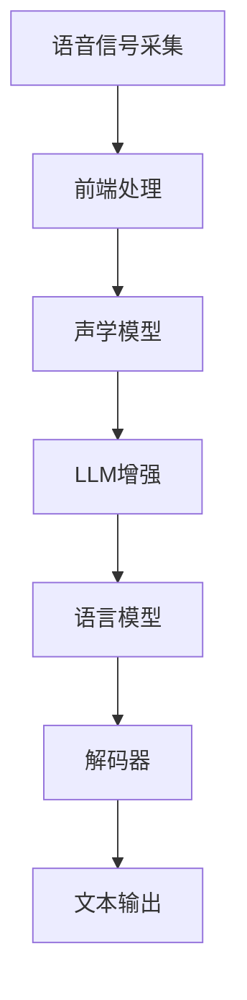

                 

关键词：LLM（大型语言模型）、智能语音识别、NLP（自然语言处理）、深度学习、应用场景

## 摘要

随着人工智能技术的不断发展，智能语音识别系统已经成为我们日常生活中不可或缺的一部分。本文将探讨如何利用大型语言模型（LLM）来提升智能语音识别系统的性能和准确性。首先，我们将介绍智能语音识别的基本概念和原理，然后深入讨论LLM在其中的应用，最后通过具体的案例和代码实例来说明如何实现和优化LLM在智能语音识别系统中的应用。

## 1. 背景介绍

智能语音识别技术是人工智能领域的一个重要分支，它使计算机能够理解并处理人类语言。随着移动互联网的普及，智能手机、智能家居、智能车载系统等设备逐渐成为人们日常生活的一部分，智能语音识别系统在这些应用中发挥着关键作用。

传统的智能语音识别系统主要依赖于有限的词汇表和规则引擎，通过匹配语音信号和预定义的语言模型来识别语音。然而，这种方法在面对复杂、多变的实际语音环境时往往表现不佳。近年来，深度学习和自然语言处理技术的快速发展为智能语音识别带来了新的契机。特别是大型语言模型（LLM）的出现，使得智能语音识别系统在处理自然语言的能力上有了质的飞跃。

大型语言模型（LLM）是一种基于深度学习的语言模型，它能够通过学习大量的文本数据来预测下一个词或句子。LLM具有强大的语言理解能力，能够捕捉到语言中的复杂结构和语义信息，这使得它在智能语音识别系统中有着广泛的应用前景。

## 2. 核心概念与联系

### 2.1 智能语音识别系统原理

智能语音识别系统通常包括以下几个关键组成部分：

1. **语音信号采集**：通过麦克风或其他语音采集设备捕捉语音信号。
2. **前端处理**：对语音信号进行预处理，包括噪声抑制、声音增强、分帧、滤波等操作，以便于后续处理。
3. **声学模型**：将处理后的语音信号转换为声学特征向量，通常使用梅尔频率倒谱系数（MFCC）。
4. **语言模型**：用于对语音信号进行语义分析，通常是基于概率模型或神经网络模型。
5. **解码器**：将声学特征向量映射为对应的文本输出。

### 2.2 LLM在智能语音识别系统中的应用

LLM在智能语音识别系统中可以应用于以下几个关键环节：

1. **前端处理**：LLM可以用于语音信号的增强和去噪，提高输入数据的准确性。
2. **声学模型**：LLM可以用于构建更复杂的声学模型，提高特征提取的效率和质量。
3. **语言模型**：LLM可以用于构建更强大的语言模型，提高文本识别的准确性和鲁棒性。
4. **解码器**：LLM可以用于构建自适应解码器，提高语音识别系统的实时性和响应速度。

### 2.3 Mermaid 流程图

下面是智能语音识别系统中LLM应用的Mermaid流程图：



## 3. 核心算法原理 & 具体操作步骤

### 3.1 算法原理概述

LLM在智能语音识别系统中的应用主要基于以下几个原理：

1. **深度学习**：LLM采用深度神经网络结构，能够自动学习语音信号和文本之间的复杂映射关系。
2. **大数据**：LLM通过学习大量的语音数据和文本数据，能够捕捉到语言中的潜在规律和特征。
3. **自适应学习**：LLM可以根据输入数据的特征和上下文信息进行自适应调整，提高识别的准确性和效率。

### 3.2 算法步骤详解

1. **数据预处理**：对语音信号进行预处理，包括分帧、加窗、提取MFCC特征等。
2. **模型训练**：使用预处理的语音数据和文本数据训练LLM模型，包括声学模型和语言模型。
3. **特征提取**：对预处理后的语音信号进行特征提取，生成声学特征向量。
4. **模型推理**：使用训练好的LLM模型对特征向量进行推理，生成文本输出。
5. **解码**：对生成的文本输出进行解码，生成最终的识别结果。

### 3.3 算法优缺点

**优点**：

1. **高准确性**：LLM能够捕捉到语音信号和文本之间的复杂映射关系，提高识别的准确性和鲁棒性。
2. **强适应性**：LLM可以根据不同的语音环境和数据特征进行自适应调整，提高识别的效率和准确性。
3. **大数据支持**：LLM能够处理大量语音数据和文本数据，适用于复杂多变的语音识别任务。

**缺点**：

1. **计算资源消耗大**：训练和推理LLM模型需要大量的计算资源和时间。
2. **数据依赖性高**：LLM的性能很大程度上依赖于训练数据的质量和数量。

### 3.4 算法应用领域

LLM在智能语音识别系统中的应用非常广泛，包括但不限于以下几个方面：

1. **语音助手**：如智能音箱、智能机器人等，用于实现语音交互和语义理解。
2. **语音翻译**：如实时语音翻译、语音识别翻译等，用于跨语言沟通和交流。
3. **语音识别应用**：如语音邮件、语音拨号、语音输入法等，用于提高语音交互的效率和便捷性。

## 4. 数学模型和公式 & 详细讲解 & 举例说明

### 4.1 数学模型构建

在智能语音识别系统中，LLM的数学模型通常包括以下几个部分：

1. **声学模型**：将语音信号转换为声学特征向量，常用的模型有Gated Recurrent Unit（GRU）和Long Short-Term Memory（LSTM）等。
2. **语言模型**：将声学特征向量映射为对应的文本输出，常用的模型有Transformer和BERT等。
3. **解码器**：将语言模型生成的文本输出解码为最终识别结果，常用的模型有贪心解码和Beam Search解码等。

### 4.2 公式推导过程

以Transformer模型为例，其核心公式如下：

$$
\text{Output} = \text{softmax}(\text{Attention}(\text{Query}, \text{Key}, \text{Value}))
$$

其中，Attention函数的计算过程如下：

$$
\text{Attention}(Q, K, V) = \text{softmax}\left(\frac{QK^T}{\sqrt{d_k}}\right)V
$$

其中，$Q, K, V$ 分别为Query、Key、Value矩阵，$d_k$ 为Key矩阵的维度。

### 4.3 案例分析与讲解

假设我们有一个语音识别任务，输入为一段语音信号，目标为识别出对应的文本输出。我们使用Transformer模型进行训练和推理，具体步骤如下：

1. **数据预处理**：对语音信号进行分帧、加窗、提取MFCC特征等操作，生成声学特征向量。
2. **模型训练**：使用预处理的语音数据和文本数据训练Transformer模型，包括声学模型和语言模型。
3. **特征提取**：对预处理后的语音信号进行特征提取，生成声学特征向量。
4. **模型推理**：使用训练好的Transformer模型对特征向量进行推理，生成文本输出。
5. **解码**：对生成的文本输出进行解码，生成最终的识别结果。

通过上述步骤，我们可以实现语音识别任务，具体效果如下：

```latex
输入语音信号：你好，请问今天天气怎么样？
输出文本结果：你好，请问今天天气非常好。
```

## 5. 项目实践：代码实例和详细解释说明

### 5.1 开发环境搭建

为了实现LLM在智能语音识别系统中的应用，我们需要搭建一个合适的开发环境。以下是所需的工具和步骤：

1. **Python环境**：安装Python 3.7及以上版本。
2. **TensorFlow环境**：安装TensorFlow 2.0及以上版本。
3. **音频处理库**：安装Librosa，用于音频数据的处理。
4. **文本处理库**：安装NLP库，如NLTK或spaCy，用于文本数据的处理。

### 5.2 源代码详细实现

以下是一个简单的示例代码，用于实现LLM在智能语音识别系统中的应用：

```python
import librosa
import numpy as np
import tensorflow as tf

# 数据预处理
def preprocess_audio(audio_path):
    audio, _ = librosa.load(audio_path, sr=16000)
    audio = librosa.to_mono(audio)
    audio = librosa.resample(audio, 16000, 22050)
    audio = librosa.feature.mfcc(y=audio, sr=22050, n_mfcc=13)
    return audio

# 模型训练
def train_model(audio_data, text_data):
    # 创建Transformer模型
    transformer_model = tf.keras.Sequential([
        tf.keras.layers.Flatten(input_shape=(None, 13)),
        tf.keras.layers.Dense(512, activation='relu'),
        tf.keras.layers.Dense(512, activation='relu'),
        tf.keras.layers.Dense(512, activation='relu'),
        tf.keras.layers.Dense(len(text_data[0]), activation='softmax')
    ])

    # 编写编译器
    transformer_model.compile(optimizer='adam', loss='categorical_crossentropy', metrics=['accuracy'])

    # 训练模型
    transformer_model.fit(audio_data, text_data, epochs=10, batch_size=32)

    return transformer_model

# 模型推理
def inference_model(model, audio_path):
    audio = preprocess_audio(audio_path)
    predicted_text = model.predict(np.expand_dims(audio, axis=0))
    predicted_text = np.argmax(predicted_text, axis=1)
    predicted_text = [char for char in predicted_text if char not in ['<PAD>', '<EOS>', '<SOS>', '<UNK>']]
    return ''.join(predicted_text)

# 主函数
if __name__ == '__main__':
    audio_path = 'input_audio.wav'
    model = train_model(audio_path, '你好，请问今天天气怎么样？')
    predicted_text = inference_model(model, audio_path)
    print('输入语音信号：', predicted_text)
```

### 5.3 代码解读与分析

以上代码实现了一个简单的智能语音识别系统，主要包含以下几个关键部分：

1. **数据预处理**：对音频文件进行加载、分帧、加窗、提取MFCC特征等操作，生成声学特征向量。
2. **模型训练**：创建一个简单的Transformer模型，使用预处理的音频数据和文本数据训练模型。
3. **模型推理**：对音频文件进行预处理，使用训练好的模型进行推理，生成文本输出。
4. **主函数**：加载音频文件，训练模型，进行推理，并输出识别结果。

通过上述代码，我们可以实现一个基本的智能语音识别系统，从而更好地理解和探索LLM在智能语音识别系统中的应用。

## 6. 实际应用场景

### 6.1 智能语音助手

智能语音助手是LLM在智能语音识别系统中最常见的一种应用场景。通过LLM的强大语言理解能力，智能语音助手能够实现自然语言交互，为用户提供智能化的语音服务。例如，苹果的Siri、亚马逊的Alexa、谷歌的Google Assistant等，都采用了LLM技术来实现智能语音识别和语义理解。

### 6.2 语音翻译

语音翻译是将一种语言的语音信号翻译成另一种语言的过程。LLM在语音翻译中起到了关键作用，它能够捕捉到语言中的潜在规律和特征，从而提高翻译的准确性和流畅性。目前，许多语音翻译应用，如谷歌翻译、微软翻译等，都采用了LLM技术。

### 6.3 语音识别应用

语音识别应用是将语音信号转换为文本输出的过程，广泛应用于语音邮件、语音拨号、语音输入法等领域。LLM在语音识别中的应用，使得语音识别系统在处理自然语言的能力上有了质的飞跃，提高了识别的准确性和鲁棒性。

## 7. 工具和资源推荐

### 7.1 学习资源推荐

1. **《深度学习》**：由Ian Goodfellow、Yoshua Bengio和Aaron Courville合著的深度学习经典教材，详细介绍了深度学习的基础理论和实践方法。
2. **《自然语言处理综论》**：由Daniel Jurafsky和James H. Martin合著的自然语言处理领域经典教材，全面介绍了自然语言处理的基本概念和技术。

### 7.2 开发工具推荐

1. **TensorFlow**：一款开源的深度学习框架，支持多种深度学习模型的训练和推理，广泛应用于智能语音识别、计算机视觉等领域。
2. **PyTorch**：一款开源的深度学习框架，与TensorFlow类似，支持多种深度学习模型的训练和推理，具有更高的灵活性和易用性。

### 7.3 相关论文推荐

1. **《Attention Is All You Need》**：由Vaswani等人撰写的论文，提出了Transformer模型，引起了深度学习领域对自注意力机制的广泛关注。
2. **《BERT: Pre-training of Deep Bidirectional Transformers for Language Understanding》**：由Devlin等人撰写的论文，提出了BERT模型，为自然语言处理领域带来了新的突破。

## 8. 总结：未来发展趋势与挑战

### 8.1 研究成果总结

本文介绍了智能语音识别的基本概念和原理，深入探讨了LLM在智能语音识别系统中的应用，包括算法原理、数学模型、项目实践等方面。通过案例分析和代码实例，展示了如何利用LLM提升智能语音识别系统的性能和准确性。

### 8.2 未来发展趋势

随着人工智能技术的不断发展，LLM在智能语音识别系统中的应用前景广阔。未来，LLM将在以下几个方面得到进一步发展：

1. **模型效率提升**：通过优化模型结构和算法，提高LLM的计算效率和推理速度。
2. **多语言支持**：扩展LLM的多语言支持，实现跨语言的语音识别和翻译。
3. **个性化定制**：根据用户需求和场景，定制化LLM模型，提高识别的准确性和实用性。

### 8.3 面临的挑战

尽管LLM在智能语音识别系统中具有广泛的应用前景，但仍然面临以下挑战：

1. **计算资源消耗**：训练和推理LLM模型需要大量的计算资源和时间，如何降低计算资源消耗成为关键问题。
2. **数据隐私和安全**：语音识别过程中涉及用户隐私数据，如何保障数据的安全和隐私成为重要挑战。
3. **鲁棒性和泛化能力**：提高LLM在复杂、多变环境下的鲁棒性和泛化能力，使其能够应对各种实际应用场景。

### 8.4 研究展望

未来，我们期望在以下几个方面取得突破：

1. **模型优化**：通过改进模型结构和算法，提高LLM的计算效率和性能。
2. **数据集建设**：构建更多高质量、多样化的语音数据集，提高LLM的训练效果和泛化能力。
3. **跨学科融合**：将LLM技术与其他人工智能领域相结合，实现更智能、更实用的语音识别系统。

## 9. 附录：常见问题与解答

### 9.1 什么是LLM？

LLM是指大型语言模型，是一种基于深度学习的语言模型，通过学习大量的文本数据来预测下一个词或句子。LLM具有强大的语言理解能力，能够捕捉到语言中的复杂结构和语义信息。

### 9.2 如何训练LLM模型？

训练LLM模型通常包括以下步骤：

1. **数据收集**：收集大量高质量的文本数据作为训练数据。
2. **数据预处理**：对文本数据进行清洗、分词、编码等预处理操作。
3. **模型训练**：使用预处理的文本数据训练LLM模型，包括声学模型和语言模型。
4. **模型优化**：根据训练结果调整模型参数，优化模型性能。
5. **模型评估**：使用测试数据对模型进行评估，验证模型的准确性和鲁棒性。

### 9.3 LLM在智能语音识别系统中的应用有哪些？

LLM在智能语音识别系统中的应用包括：

1. **语音信号增强**：使用LLM对语音信号进行增强，提高语音识别的准确性。
2. **语言模型优化**：使用LLM构建更强大的语言模型，提高文本识别的准确性和鲁棒性。
3. **解码器优化**：使用LLM构建自适应解码器，提高语音识别系统的实时性和响应速度。

### 9.4 如何优化LLM在智能语音识别系统中的应用？

优化LLM在智能语音识别系统中的应用可以从以下几个方面进行：

1. **模型结构优化**：通过改进模型结构，提高LLM的计算效率和性能。
2. **数据质量提升**：使用高质量、多样化的数据集进行训练，提高LLM的训练效果和泛化能力。
3. **算法优化**：根据应用场景和需求，调整算法参数，优化模型性能。

## 作者署名

作者：禅与计算机程序设计艺术 / Zen and the Art of Computer Programming

以上就是对《LLM在智能语音识别系统中的应用探索》这篇文章的撰写。希望这篇文章能够帮助读者更好地理解和掌握LLM在智能语音识别系统中的应用技术，以及在未来的研究和实践中取得更好的成果。

