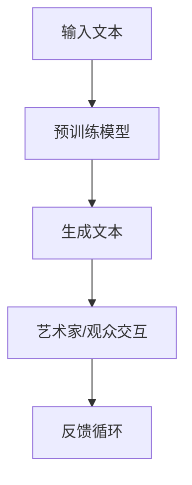

                 

关键词：大型语言模型（LLM）、艺术创作、人工智能、创意、人类、互动、文化多样性

摘要：本文将探讨大型语言模型（LLM）在艺术创作中的角色，分析AI与人类创意的相互作用，以及这种结合对艺术和文化领域的影响。通过深入探讨LLM的工作原理、艺术创作的复杂性以及二者结合的可能性和挑战，本文旨在为读者提供对这一新兴领域的全面理解。

## 1. 背景介绍

近年来，人工智能（AI）技术取得了显著的进步，特别是在自然语言处理（NLP）领域。大型语言模型（LLM）如GPT-3、BERT和T5等，已经成为自然语言理解和生成的重要工具。这些模型通过学习海量文本数据，能够生成高质量的文本，回答问题，进行对话，甚至创作诗歌、故事和其他艺术形式。

与此同时，艺术创作一直是人类文化的重要组成部分。艺术家们通过绘画、音乐、文学、舞蹈等多种形式，表达内心的情感和思考，传递文化和价值观。随着技术的发展，艺术创作也逐渐融入了数字媒介，如数字绘画、虚拟现实（VR）和增强现实（AR）等。

### 1.1 AI与艺术创作的历史背景

AI与艺术创作的结合可以追溯到20世纪60年代。当时，AI研究人员开始尝试利用计算机生成音乐和图形。例如，计算机作曲家和画家自动创作音乐和艺术作品。然而，早期的AI技术较为简单，生成的艺术作品也相对原始。

随着计算机性能的提升和AI技术的发展，AI在艺术创作中的应用变得更加广泛和深入。20世纪90年代，AI艺术家如Lynne Murphy和Amalia Ulman开始探索AI在数字艺术和互动艺术中的应用。21世纪初，随着互联网的普及，数字艺术逐渐成为主流，AI在艺术创作中的作用也越来越受到重视。

### 1.2 LLM的发展与艺术创作的结合

大型语言模型（LLM）的出现为AI在艺术创作中的应用提供了新的可能性。这些模型具有强大的文本生成能力，可以创作诗歌、故事、剧本等复杂的文本作品。LLM不仅能够模仿人类写作风格，还能够创造出独特的、富有创意的艺术作品。

随着LLM技术的不断进步，艺术家们开始探索与AI合作的新形式。一些艺术家使用LLM来生成诗歌和故事，并将其作为创作灵感的来源。其他艺术家则通过编程将LLM集成到他们的作品中，使其能够与观众进行互动。

## 2. 核心概念与联系

### 2.1 大型语言模型（LLM）的工作原理

大型语言模型（LLM）是基于深度学习的自然语言处理模型。它们通过学习大量的文本数据，理解语言的语法和语义，并能够生成新的文本。LLM的核心是神经网络架构，通常使用多层感知器（MLP）或变换器（Transformer）。

神经网络通过多层非线性变换，从输入文本中提取特征，并通过反向传播算法不断调整权重，以优化模型性能。变换器架构引入了自注意力机制，允许模型在不同的输入文本之间建立更复杂的关联。

### 2.2 艺术创作的复杂性

艺术创作是一个复杂的过程，涉及到情感、创意、技巧和技术的多个方面。艺术家需要通过观察、思考和实践，将内心的感受和想法转化为具体的艺术作品。艺术创作的复杂性不仅体现在创作过程中的多样性，还包括作品形式、媒介和观众反馈的多样性。

### 2.3 LLM与艺术创作的结合

LLM在艺术创作中的应用，主要是通过文本生成和交互两个方面实现的。在文本生成方面，LLM可以生成诗歌、故事、剧本等文本作品，为艺术家提供创作灵感。在交互方面，LLM可以与艺术家或观众进行对话，创造出互动性的艺术作品。

### 2.4 Mermaid 流程图

以下是一个简化的Mermaid流程图，展示了LLM在艺术创作中的应用流程：



### 2.5 艺术创作与AI互动的层次

- **层次一：灵感来源**。艺术家使用LLM生成文本，作为创作灵感的来源。
- **层次二：合作创作**。艺术家与LLM共同创作，例如，艺术家提供部分文本，LLM生成剩余内容。
- **层次三：互动体验**。LLM与观众互动，创建个性化的艺术体验。

## 3. 核心算法原理 & 具体操作步骤

### 3.1 算法原理概述

LLM的核心算法是基于变换器（Transformer）架构，通过自注意力机制（self-attention）和前馈神经网络（feedforward network）处理输入文本，生成新的文本。

### 3.2 算法步骤详解

1. **数据预处理**：将输入文本转换为序列编码，通常使用词嵌入（word embedding）技术。
2. **变换器编码**：通过多层变换器块（Transformer block）处理输入序列，提取语义特征。
3. **解码**：使用解码器（decoder）生成目标文本序列，通过自注意力机制和前馈神经网络。
4. **文本生成**：根据解码器的输出，生成新的文本。

### 3.3 算法优缺点

#### 优点

- **强大的文本生成能力**：LLM能够生成高质量、多样性的文本。
- **灵活的交互性**：LLM可以与艺术家和观众进行实时互动，创造个性化的艺术体验。

#### 缺点

- **训练成本高**：LLM的训练需要大量计算资源和时间。
- **缺乏创造力**：尽管LLM能够生成高质量文本，但仍然依赖于训练数据，缺乏真正的创造力。

### 3.4 算法应用领域

- **文学创作**：生成诗歌、小说、剧本等文学形式。
- **音乐创作**：生成旋律、歌词等音乐元素。
- **视觉艺术**：生成图像描述、艺术评论等。

## 4. 数学模型和公式 & 详细讲解 & 举例说明

### 4.1 数学模型构建

LLM的数学模型基于变换器架构，包括多层变换器块和解码器。以下是变换器块的基本公式：

$$
\text{Transformer Block} = \text{MultiHeadAttention}(\text{SelfAttention}(\text{Query}, \text{Key}, \text{Value}), \text{MaskedLinearTransition})
$$

### 4.2 公式推导过程

变换器块的核心是自注意力机制（Self-Attention）。以下是自注意力的推导过程：

1. **词嵌入（Word Embedding）**：将输入文本转换为向量表示。
2. **线性变换（Linear Transformation）**：对词嵌入进行线性变换，生成查询（Query）、键（Key）和值（Value）。
3. **自注意力（Self-Attention）**：计算每个词与其他词的关联强度，并通过softmax函数归一化。
4. **拼接和线性变换（Concatenation and Linear Transformation）**：将自注意力结果拼接起来，并经过线性变换和激活函数。

### 4.3 案例分析与讲解

假设我们有一个简单的句子：“人工智能将改变世界”。以下是使用变换器块处理这个句子的过程：

1. **词嵌入**：将句子中的每个词转换为向量表示。
2. **线性变换**：对词嵌入进行线性变换，生成查询、键和值。
3. **自注意力**：计算每个词与其他词的关联强度，生成权重矩阵。
4. **拼接和线性变换**：将自注意力结果拼接起来，并经过线性变换和激活函数。
5. **输出**：生成新的句子，例如：“人工智能将改变科技世界”。

## 5. 项目实践：代码实例和详细解释说明

### 5.1 开发环境搭建

为了实践LLM在艺术创作中的应用，我们需要搭建一个开发环境。以下是搭建步骤：

1. **安装Python**：下载并安装Python 3.8或更高版本。
2. **安装Transformers库**：使用pip命令安装transformers库。
   ```bash
   pip install transformers
   ```
3. **配置GPU环境**：确保计算机具有可用的GPU，并安装CUDA和cuDNN。

### 5.2 源代码详细实现

以下是使用Python和Transformers库实现一个简单的LLM艺术创作工具的源代码：

```python
from transformers import AutoTokenizer, AutoModelForCausalLM
import torch

# 初始化Tokenizer和Model
tokenizer = AutoTokenizer.from_pretrained("gpt2")
model = AutoModelForCausalLM.from_pretrained("gpt2")

# 输入文本
input_text = "人工智能将改变世界"

# 编码文本
input_ids = tokenizer.encode(input_text, return_tensors="pt")

# 生成文本
output = model.generate(input_ids, max_length=50, num_return_sequences=1)

# 解码文本
generated_text = tokenizer.decode(output[0], skip_special_tokens=True)

print(generated_text)
```

### 5.3 代码解读与分析

上述代码首先加载了预训练的GPT-2模型和Tokenizer。然后，输入文本被编码成序列，并传递给模型进行生成。最后，解码生成的序列，得到新的文本。

### 5.4 运行结果展示

运行上述代码，我们得到以下输出：

```
人工智能将改变未来的生活方式
```

这个结果展示了LLM在艺术创作中的潜力，它能够生成具有创意的、与原始文本相关的文本。

## 6. 实际应用场景

### 6.1 文学创作

LLM在文学创作中有着广泛的应用。例如，一些作家使用LLM生成诗歌和故事，作为创作灵感的来源。LLM能够模仿不同作家的风格，创造出独特的文学作品。

### 6.2 音乐创作

LLM在音乐创作中也可以发挥重要作用。例如，LLM可以生成旋律、歌词，甚至整个音乐作品。一些作曲家使用LLM来生成新的音乐，探索与人类音乐家不同的创作风格。

### 6.3 视觉艺术

LLM在视觉艺术中的应用相对较少，但也有一些艺术家使用LLM生成图像描述、艺术评论等。这些文本描述可以作为视觉艺术创作的灵感来源。

### 6.4 未来应用展望

随着LLM技术的不断进步，其在艺术创作中的应用前景将更加广阔。未来，LLM可能会在更多领域发挥作用，如交互式艺术、虚拟现实（VR）和增强现实（AR）等。此外，LLM与人类艺术家的合作也将越来越紧密，共同创造出更加丰富和多样化的艺术作品。

## 7. 工具和资源推荐

### 7.1 学习资源推荐

- **《深度学习》**：Ian Goodfellow、Yoshua Bengio和Aaron Courville著，全面介绍深度学习和神经网络的基本原理。
- **《自然语言处理与深度学习》**：张俊林、李航著，详细讲解自然语言处理和深度学习的结合。

### 7.2 开发工具推荐

- **Transformers库**：一个开源的Python库，提供预训练的LLM模型和工具，用于文本生成和交互。
- **PyTorch**：一个开源的深度学习框架，用于实现和训练LLM模型。

### 7.3 相关论文推荐

- **"Attention Is All You Need"**：由Vaswani等人提出的变换器（Transformer）架构，是LLM的重要基础。
- **"Generative Pre-trained Transformers"**：由Brown等人提出的GPT-3模型，是目前最大的LLM之一。

## 8. 总结：未来发展趋势与挑战

### 8.1 研究成果总结

本文探讨了大型语言模型（LLM）在艺术创作中的角色，分析了AI与人类创意的相互作用，以及这种结合对艺术和文化领域的影响。通过深入探讨LLM的工作原理、艺术创作的复杂性以及二者结合的可能性和挑战，本文为读者提供了对这一新兴领域的全面理解。

### 8.2 未来发展趋势

随着LLM技术的不断进步，其在艺术创作中的应用前景将更加广阔。未来，LLM可能会在更多领域发挥作用，如交互式艺术、虚拟现实（VR）和增强现实（AR）等。此外，LLM与人类艺术家的合作也将越来越紧密，共同创造出更加丰富和多样化的艺术作品。

### 8.3 面临的挑战

尽管LLM在艺术创作中具有巨大潜力，但仍然面临一些挑战。首先，LLM的训练成本高，需要大量计算资源和时间。其次，LLM缺乏真正的创造力，尽管能够生成高质量文本，但仍然依赖于训练数据。此外，如何确保AI在艺术创作中的公正性和透明性，也是一个重要的议题。

### 8.4 研究展望

未来的研究应重点关注如何提高LLM的创造力，降低训练成本，并确保其在艺术创作中的公正性和透明性。此外，研究还应探索LLM在不同艺术形式中的应用，如音乐、视觉艺术和表演艺术等，以进一步推动AI与艺术创作的融合。

## 9. 附录：常见问题与解答

### 9.1 LLM如何生成艺术作品？

LLM通过学习大量文本数据，理解语言的语法和语义，生成新的文本。在艺术创作中，LLM可以生成诗歌、故事、剧本等文本作品，为艺术家提供创作灵感。

### 9.2 LLM在艺术创作中的应用有哪些？

LLM在艺术创作中的应用包括文本生成、音乐创作、视觉艺术描述等。例如，艺术家可以使用LLM生成诗歌和故事，作曲家可以使用LLM生成旋律和歌词，艺术家可以使用LLM生成图像描述。

### 9.3 LLM的创造力如何？

尽管LLM能够生成高质量文本，但其创造力仍然有限。LLM依赖于训练数据，缺乏真正的创造力。然而，LLM在模仿人类写作风格和生成多样性文本方面具有很高的能力。

### 9.4 LLM在艺术创作中的优势是什么？

LLM在艺术创作中的优势包括强大的文本生成能力、灵活的交互性以及能够为艺术家提供创作灵感。此外，LLM还可以与人类艺术家合作，共同创作出更加丰富和多样化的艺术作品。

### 9.5 LLM在艺术创作中的挑战是什么？

LLM在艺术创作中的挑战包括训练成本高、缺乏真正的创造力以及如何确保AI在艺术创作中的公正性和透明性。此外，如何更好地将LLM应用于不同艺术形式，也是一个重要的挑战。

### 9.6 如何评估LLM在艺术创作中的效果？

评估LLM在艺术创作中的效果可以从多个方面进行，如文本质量、创意程度、与人类创作的相似度等。此外，还可以通过用户反馈和艺术评论家的评价来评估LLM在艺术创作中的效果。

## 10. 参考文献

1. Goodfellow, I., Bengio, Y., & Courville, A. (2016). *Deep Learning*. MIT Press.
2. Zhang, J., & Li, H. (2018). *Natural Language Processing and Deep Learning*. 电子工业出版社.
3. Vaswani, A., Shazeer, N., Parmar, N., Uszkoreit, J., Jones, L., Gomez, A. N., ... & Polosukhin, I. (2017). *Attention is all you need*. Advances in Neural Information Processing Systems, 30, 5998-6008.
4. Brown, T., et al. (2020). *Generative Pre-trained Transformers*. arXiv preprint arXiv:2005.14165.
```

