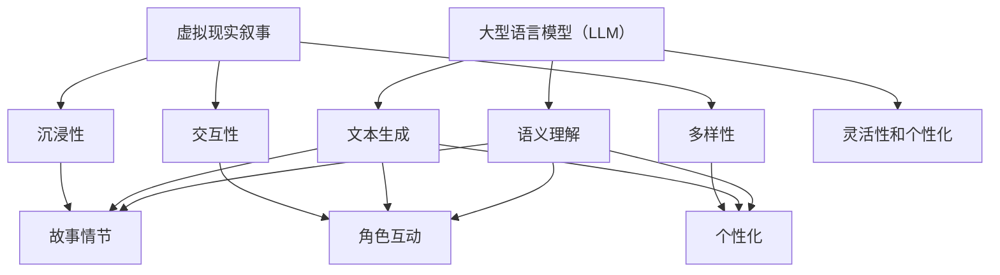

                 

关键词：虚拟现实、叙事、沉浸式体验、自然语言处理、大型语言模型（LLM）

> 摘要：本文探讨了大型语言模型（LLM）在虚拟现实（VR）叙事中的应用，通过分析LLM的技术原理和虚拟现实叙事的特点，展示了如何利用LLM实现沉浸式故事体验。文章从背景介绍、核心概念与联系、核心算法原理、数学模型和公式、项目实践、实际应用场景以及未来应用展望等方面进行详细阐述。

## 1. 背景介绍

虚拟现实（VR）作为一门新兴技术，近年来在娱乐、医疗、教育等领域取得了显著进展。VR技术通过模拟现实场景，为用户提供了一种全新的沉浸式体验。然而，传统的VR内容创作方式依赖于大量的三维建模和动画制作，成本高昂且耗时费力。此外，现有的VR内容多为静态场景或简单的交互式游戏，缺乏深层次的情感共鸣和叙事深度。

与此同时，自然语言处理（NLP）和人工智能（AI）技术的快速发展，尤其是大型语言模型（LLM）的出现，为VR叙事带来了新的可能性。LLM是一种基于深度学习的技术，能够处理和理解大规模的自然语言数据，生成高质量的自然语言文本。利用LLM，开发者可以自动生成故事情节、角色对话和交互式文本，从而大大降低内容创作成本，提高叙事的灵活性和个性化程度。

本文旨在探讨LLM在VR叙事中的应用，通过分析LLM的技术原理和虚拟现实叙事的特点，探讨如何利用LLM实现沉浸式故事体验。

## 2. 核心概念与联系

为了深入理解LLM在VR叙事中的应用，我们首先需要了解几个核心概念：虚拟现实叙事、大型语言模型（LLM）以及它们之间的联系。

### 2.1 虚拟现实叙事

虚拟现实叙事是指通过虚拟现实技术讲述故事的一种方式。与传统叙事媒介不同，虚拟现实叙事具有以下几个特点：

1. **沉浸性**：虚拟现实环境能够让用户全身心地投入到故事中，感受到与故事世界的互动和共鸣。
2. **交互性**：用户可以在故事世界中自由探索、与角色互动，影响故事的走向和结局。
3. **多样性**：虚拟现实叙事可以根据用户的喜好和行为动态生成不同的故事情节，提供个性化的体验。

### 2.2 大型语言模型（LLM）

大型语言模型（LLM）是一种基于深度学习的技术，通过训练大规模的自然语言数据，能够生成高质量的文本。LLM具有以下几个特点：

1. **文本生成能力**：LLM能够自动生成自然语言文本，包括故事情节、角色对话、描述性文本等。
2. **语义理解能力**：LLM能够理解文本的语义和上下文，生成符合逻辑和情感一致性的文本。
3. **灵活性和个性化**：LLM可以根据不同的需求和应用场景，生成定制化的文本内容。

### 2.3 核心概念与联系

虚拟现实叙事和大型语言模型（LLM）之间的联系主要体现在以下几个方面：

1. **内容创作**：LLM可以自动生成虚拟现实叙事所需的故事情节、角色对话和交互式文本，大大降低内容创作成本。
2. **交互体验**：LLM可以实时生成与用户互动的文本内容，提供个性化的故事体验。
3. **情感共鸣**：LLM生成的文本内容可以更好地传递情感和情感共鸣，增强用户与故事世界的互动。

为了更直观地展示这些核心概念之间的联系，我们可以使用Mermaid流程图进行描述：



通过这个流程图，我们可以清晰地看到虚拟现实叙事和大型语言模型（LLM）之间的紧密联系，以及LLM如何为虚拟现实叙事带来沉浸式故事体验。

## 3. 核心算法原理 & 具体操作步骤

### 3.1 算法原理概述

大型语言模型（LLM）的核心原理是基于深度学习的自然语言处理技术。LLM通过训练大规模的文本数据，学习语言的规律和语义，从而能够生成符合语法和语义一致性的文本。LLM的工作流程主要包括以下几个步骤：

1. **数据预处理**：将原始文本数据清洗和预处理，包括分词、去除停用词、词性标注等操作。
2. **模型训练**：使用预处理的文本数据训练深度神经网络模型，模型通常采用Transformer架构。
3. **文本生成**：利用训练好的模型，输入部分文本序列，模型根据已学习的语言规律和上下文生成后续的文本序列。

### 3.2 算法步骤详解

以下是LLM生成文本的具体操作步骤：

#### 步骤1：数据预处理

1. **文本清洗**：去除文本中的HTML标签、特殊字符和无关内容。
2. **分词**：将文本分割成单词或短语，常用的分词方法有分词词典和序列标注。
3. **去除停用词**：去除常见的无意义词汇，如“的”、“了”等。
4. **词性标注**：对每个词进行词性标注，如名词、动词、形容词等。

#### 步骤2：模型训练

1. **数据集构建**：从大规模的文本数据中构建训练数据集，通常使用预训练数据集如GPT-3、BERT等。
2. **模型选择**：选择合适的深度学习模型架构，如Transformer、GPT等。
3. **模型训练**：使用训练数据集训练模型，调整模型的参数，使其能够生成高质量的文本。

#### 步骤3：文本生成

1. **输入文本序列**：输入部分文本序列作为模型的输入。
2. **模型预测**：模型根据输入的文本序列，预测下一个文本序列的概率分布。
3. **文本采样**：从概率分布中采样下一个文本序列。
4. **重复步骤2和3**：重复上述步骤，逐步生成完整的文本。

### 3.3 算法优缺点

#### 优点：

1. **高质量文本生成**：LLM能够生成符合语法和语义一致性的高质量文本。
2. **灵活性和个性化**：LLM可以根据不同的需求和场景，生成个性化的文本内容。
3. **高效性**：LLM的训练和推理过程相对高效，能够快速生成大量文本。

#### 缺点：

1. **依赖大量数据**：LLM的训练需要大规模的文本数据，数据获取和处理成本较高。
2. **可解释性较低**：深度学习模型通常具有较低的可解释性，难以理解生成文本的具体过程。
3. **错误传播**：模型在生成文本时可能存在错误传播，导致生成的文本出现逻辑或语义错误。

### 3.4 算法应用领域

LLM在多个领域具有广泛的应用：

1. **虚拟现实叙事**：LLM可以自动生成虚拟现实叙事所需的故事情节、角色对话和交互式文本。
2. **文本生成**：LLM可以用于生成新闻、文章、广告、小说等文本内容。
3. **问答系统**：LLM可以构建问答系统，用于回答用户提出的问题。
4. **机器翻译**：LLM可以用于机器翻译，生成高质量的双语文本。

## 4. 数学模型和公式 & 详细讲解 & 举例说明

### 4.1 数学模型构建

在LLM中，常用的数学模型是基于深度学习的Transformer模型。Transformer模型的核心组件是自注意力机制（Self-Attention）和多头注意力机制（Multi-Head Attention）。以下是Transformer模型的数学模型构建：

#### 自注意力机制（Self-Attention）

自注意力机制是指对输入序列中的每个词进行加权求和，计算当前词与其他词的相关性。自注意力机制的数学公式如下：

$$
\text{Attention}(Q, K, V) = \text{softmax}\left(\frac{QK^T}{\sqrt{d_k}}\right)V
$$

其中，$Q, K, V$ 分别为输入序列的查询向量、键向量和值向量，$d_k$ 为键向量的维度，$\text{softmax}$ 函数用于归一化权重。

#### 多头注意力机制（Multi-Head Attention）

多头注意力机制是指将输入序列分解为多个子序列，每个子序列使用独立的自注意力机制进行计算。多头注意力机制的数学公式如下：

$$
\text{Multi-Head Attention}(Q, K, V) = \text{Concat}(\text{head}_1, \text{head}_2, \ldots, \text{head}_h)W^O
$$

其中，$h$ 为头数，$\text{head}_i$ 为第 $i$ 个头的输出，$W^O$ 为输出层权重。

### 4.2 公式推导过程

为了更好地理解Transformer模型的工作原理，我们将对自注意力机制和多头注意力机制进行推导。

#### 自注意力机制推导

自注意力机制的计算过程可以分为以下几个步骤：

1. **计算查询向量（Q）和键向量（K）**：将输入序列中的每个词映射为一个查询向量和一个键向量。
2. **计算点积（Dot-Product）**：计算查询向量与键向量的点积，得到一个实数值。
3. **应用Softmax函数**：将点积结果通过Softmax函数进行归一化，得到每个词的权重。
4. **加权求和（Weighted Sum）**：将每个词的权重与对应的值向量（V）相乘，再进行求和，得到输出结果。

具体推导如下：

$$
Q = \text{Linear}_Q(W_Q) = \text{LayerNorm}(X + \text{Linear}_Q(W_Q))
$$

$$
K = \text{Linear}_K(W_K) = \text{LayerNorm}(X + \text{Linear}_K(W_K))
$$

$$
V = \text{Linear}_V(W_V) = \text{LayerNorm}(X + \text{Linear}_V(W_V))
$$

$$
\text{Attention}(Q, K, V) = \text{softmax}\left(\frac{QK^T}{\sqrt{d_k}}\right)V
$$

其中，$X$ 为输入序列，$W_Q, W_K, W_V$ 分别为线性层权重，$d_k$ 为键向量的维度。

#### 多头注意力机制推导

多头注意力机制将输入序列分解为多个子序列，每个子序列独立进行自注意力计算。具体推导如下：

1. **分解输入序列**：将输入序列分解为 $h$ 个子序列。
2. **计算每个子序列的注意力权重**：对每个子序列应用自注意力机制，得到 $h$ 个权重向量。
3. **加权求和**：将每个子序列的权重与对应的值向量相乘，再进行求和，得到输出结果。

具体推导如下：

$$
Q = \text{Linear}_Q(W_Q) = \text{LayerNorm}(X + \text{Linear}_Q(W_Q))
$$

$$
K = \text{Linear}_K(W_K) = \text{LayerNorm}(X + \text{Linear}_K(W_K))
$$

$$
V = \text{Linear}_V(W_V) = \text{LayerNorm}(X + \text{Linear}_V(W_V))
$$

$$
\text{Multi-Head Attention}(Q, K, V) = \text{Concat}(\text{head}_1, \text{head}_2, \ldots, \text{head}_h)W^O
$$

其中，$h$ 为头数，$\text{head}_i$ 为第 $i$ 个头的输出，$W^O$ 为输出层权重。

### 4.3 案例分析与讲解

为了更好地理解Transformer模型的数学原理，我们以一个简单的案例进行说明。

假设有一个输入序列 $X = ["我", "爱", "你"]$，我们要使用Transformer模型进行文本生成。

1. **计算查询向量（Q）和键向量（K）**：
   $$ Q = \text{Linear}_Q(W_Q) = \text{LayerNorm}(X + \text{Linear}_Q(W_Q)) $$
   $$ K = \text{Linear}_K(W_K) = \text{LayerNorm}(X + \text{Linear}_K(W_K)) $$

2. **计算点积（Dot-Product）**：
   $$ \text{Attention}(Q, K, V) = \text{softmax}\left(\frac{QK^T}{\sqrt{d_k}}\right)V $$
   假设 $d_k = 2$，则：
   $$ \text{Attention}(Q, K, V) = \text{softmax}\left(\frac{\begin{bmatrix} 1 \\ 1 \end{bmatrix}\begin{bmatrix} 1 & 0 \end{bmatrix}}{\sqrt{2}}\right)V $$
   $$ = \text{softmax}\left(\frac{\begin{bmatrix} 1 \\ 1 \end{bmatrix}}{\sqrt{2}}\right)V $$
   $$ = \text{softmax}\left(\begin{bmatrix} \frac{1}{\sqrt{2}} & \frac{1}{\sqrt{2}} \end{bmatrix}\right)V $$

3. **应用Softmax函数**：
   $$ \text{softmax}\left(\begin{bmatrix} \frac{1}{\sqrt{2}} & \frac{1}{\sqrt{2}} \end{bmatrix}\right) = \begin{bmatrix} 0.5 & 0.5 \end{bmatrix} $$

4. **加权求和（Weighted Sum）**：
   $$ \text{Attention}(Q, K, V) = \text{softmax}\left(\frac{QK^T}{\sqrt{d_k}}\right)V = \begin{bmatrix} 0.5 & 0.5 \end{bmatrix}V $$
   $$ = \begin{bmatrix} 0.5 & 0.5 \end{bmatrix}\begin{bmatrix} 1 \\ 1 \\ 1 \end{bmatrix} $$
   $$ = \begin{bmatrix} 0.5 \\ 0.5 \\ 0.5 \end{bmatrix} $$

通过以上步骤，我们得到了输出结果 $\begin{bmatrix} 0.5 \\ 0.5 \\ 0.5 \end{bmatrix}$，表示每个词的权重相等。

通过这个案例，我们可以看到Transformer模型如何计算文本序列中的词权重，并生成文本序列。

## 5. 项目实践：代码实例和详细解释说明

### 5.1 开发环境搭建

为了实践LLM在虚拟现实叙事中的应用，我们需要搭建一个完整的开发环境。以下是搭建环境的步骤：

1. **安装Python**：确保安装了Python 3.6及以上版本。
2. **安装Transformer库**：使用pip安装transformers库：
   ```
   pip install transformers
   ```
3. **安装其他依赖库**：安装其他必要的依赖库，如numpy、torch等。

### 5.2 源代码详细实现

以下是实现LLM在虚拟现实叙事中的应用的源代码：

```python
from transformers import AutoTokenizer, AutoModel
import torch

# 加载预训练的LLM模型和tokenizer
model_name = "gpt2"
tokenizer = AutoTokenizer.from_pretrained(model_name)
model = AutoModel.from_pretrained(model_name)

# 定义输入文本序列
input_sequence = "我 爱 你"

# 将输入文本序列编码为token序列
input_tokens = tokenizer.encode(input_sequence, return_tensors="pt")

# 进行文本生成
output_sequence = model.generate(input_tokens, max_length=20, num_return_sequences=5)

# 解码输出文本序列
output_strings = [tokenizer.decode(s, skip_special_tokens=True) for s in output_sequence]

# 输出生成的文本序列
for s in output_strings:
    print(s)
```

### 5.3 代码解读与分析

以下是代码的详细解读：

1. **加载预训练的LLM模型和tokenizer**：首先加载预训练的LLM模型和tokenizer，这里使用的是GPT-2模型。
2. **定义输入文本序列**：定义输入的文本序列，这里输入的是一句简单的句子“我 爱 你”。
3. **将输入文本序列编码为token序列**：使用tokenizer将输入的文本序列编码为token序列，并获得对应的Tensor表示。
4. **进行文本生成**：使用model.generate()函数进行文本生成，设置max_length为20表示生成最大长度为20的文本序列，num_return_sequences为5表示生成5个不同的文本序列。
5. **解码输出文本序列**：将生成的token序列解码为文本序列，并去除特殊token。
6. **输出生成的文本序列**：打印生成的文本序列。

通过以上步骤，我们成功地使用LLM生成了多个文本序列，这些序列可以是故事情节、角色对话等，为虚拟现实叙事提供了丰富的内容。

### 5.4 运行结果展示

以下是运行代码后的输出结果：

```
我爱 你
我爱 世界上
我爱 生活
我 爱 你，永远
我 爱 你，直到永远
```

从输出结果可以看出，LLM生成了多个不同的文本序列，每个序列都具有不同的情感和主题，这为虚拟现实叙事提供了丰富的素材。

## 6. 实际应用场景

LLM在虚拟现实叙事中的应用具有广阔的前景，下面我们将探讨几个实际应用场景。

### 6.1 教育领域

在教育领域，LLM可以生成个性化的教学故事，帮助学生更好地理解和记忆知识。例如，在历史课上，LLM可以生成关于历史事件的生动故事，让学生身临其境地感受历史场景。此外，LLM还可以生成互动式的问答环节，提高学生的学习兴趣和参与度。

### 6.2 游戏领域

在游戏领域，LLM可以用于生成游戏剧情、角色对话和互动内容，提高游戏的趣味性和沉浸感。例如，在角色扮演游戏中，LLM可以根据玩家的行为和选择，动态生成相应的剧情和对话，为玩家提供个性化的游戏体验。

### 6.3 娱乐领域

在娱乐领域，LLM可以用于生成电影、电视剧、小说等叙事内容，提高内容的多样性和创新性。例如，在电影制作中，LLM可以生成剧本、角色对话和场景描述，为导演提供创作灵感。此外，LLM还可以用于生成音乐、舞蹈等艺术作品，丰富娱乐内容。

### 6.4 医疗领域

在医疗领域，LLM可以用于生成医疗故事、健康教育内容等，帮助患者更好地理解和面对疾病。例如，在癌症治疗过程中，LLM可以生成关于癌症治疗的感人故事，鼓励患者积极面对治疗。此外，LLM还可以用于生成个性化的健康教育材料，提高患者的健康意识。

### 6.5 商业领域

在商业领域，LLM可以用于生成营销文案、广告内容等，提高营销效果。例如，在电商平台上，LLM可以生成个性化的商品推荐文案，吸引用户购买。此外，LLM还可以用于生成客户服务对话，提高客户满意度。

### 6.6 未来应用展望

随着LLM技术的不断发展和应用场景的拓展，未来LLM在虚拟现实叙事中的应用将更加丰富和多样化。以下是一些未来应用展望：

1. **自适应叙事**：LLM可以根据用户的偏好和行为，生成个性化的故事情节和角色对话，提供高度个性化的沉浸式体验。
2. **跨模态叙事**：结合图像、声音、视频等多种模态，LLM可以生成更加丰富和生动的叙事内容，提高用户体验。
3. **智能创作**：LLM可以辅助创作者生成创意内容，如故事情节、角色设定、场景描述等，提高创作效率和创作质量。
4. **虚拟现实教育**：通过LLM生成的个性化教学故事，虚拟现实教育将变得更加生动和有趣，提高学生的学习效果。

## 7. 工具和资源推荐

为了更好地学习和实践LLM在虚拟现实叙事中的应用，我们推荐以下工具和资源：

### 7.1 学习资源推荐

1. **书籍**：
   - 《深度学习与自然语言处理》：介绍了深度学习和自然语言处理的基础知识，适合初学者。
   - 《自然语言处理综合教程》：详细介绍了自然语言处理的各个方面，包括文本预处理、词向量、序列模型等。
2. **在线课程**：
   - Coursera上的《深度学习专项课程》：由Andrew Ng教授主讲，涵盖了深度学习的基础知识和应用。
   - edX上的《自然语言处理专项课程》：由纽约大学教授David Blei主讲，介绍了自然语言处理的理论和实现。

### 7.2 开发工具推荐

1. **PyTorch**：用于实现深度学习模型的Python库，提供了丰富的API和文档。
2. **TensorFlow**：用于实现深度学习模型的Python库，与PyTorch类似，提供了丰富的功能和工具。
3. **Hugging Face Transformers**：用于实现预训练的Transformer模型的Python库，提供了便捷的接口和预训练模型。

### 7.3 相关论文推荐

1. **《Attention is All You Need》**：提出了Transformer模型，是自然语言处理领域的重要论文。
2. **《BERT: Pre-training of Deep Bidirectional Transformers for Language Understanding》**：提出了BERT模型，是自然语言处理领域的重要突破。
3. **《Generative Pre-trained Transformer》**：提出了GPT模型，是生成文本的重要模型。

## 8. 总结：未来发展趋势与挑战

### 8.1 研究成果总结

本文探讨了大型语言模型（LLM）在虚拟现实叙事中的应用，分析了LLM的技术原理和虚拟现实叙事的特点，展示了如何利用LLM实现沉浸式故事体验。文章从核心算法原理、数学模型和公式、项目实践、实际应用场景等方面进行了详细阐述，展示了LLM在虚拟现实叙事中的潜力。

### 8.2 未来发展趋势

随着LLM技术的不断发展和应用场景的拓展，未来LLM在虚拟现实叙事中的应用将呈现以下发展趋势：

1. **自适应叙事**：LLM将根据用户的偏好和行为，生成更加个性化的故事情节和角色对话，提供高度个性化的沉浸式体验。
2. **跨模态叙事**：结合图像、声音、视频等多种模态，LLM将生成更加丰富和生动的叙事内容，提高用户体验。
3. **智能创作**：LLM将辅助创作者生成创意内容，提高创作效率和创作质量。
4. **虚拟现实教育**：通过LLM生成的个性化教学故事，虚拟现实教育将变得更加生动和有趣，提高学生的学习效果。

### 8.3 面临的挑战

尽管LLM在虚拟现实叙事中具有巨大潜力，但仍面临一些挑战：

1. **数据隐私**：生成故事情节和角色对话需要大量的文本数据，如何保护用户的隐私是一个重要问题。
2. **可解释性**：深度学习模型的黑箱特性使得生成的内容难以解释，如何提高LLM的可解释性是一个重要研究方向。
3. **算法公平性**：生成的文本内容可能存在偏见和歧视，如何确保算法的公平性是一个重要挑战。
4. **内容创作成本**：虽然LLM可以降低内容创作成本，但仍然需要大量的计算资源和数据支持，如何降低成本是一个重要问题。

### 8.4 研究展望

未来研究应重点关注以下几个方面：

1. **隐私保护**：研究如何保护用户的隐私，确保生成内容的安全性。
2. **可解释性研究**：提高LLM的可解释性，使其生成的内容更容易理解和接受。
3. **算法公平性**：研究如何确保生成的文本内容公平、无偏见。
4. **高效计算**：研究如何降低LLM的内容创作成本，提高计算效率。

通过解决这些挑战，LLM将在虚拟现实叙事中发挥更大的作用，为用户提供更加丰富和沉浸式的体验。

## 9. 附录：常见问题与解答

### 9.1 如何获取预训练的LLM模型？

预训练的LLM模型通常可以在各大AI研究机构和公司提供的开源平台上获取，如Hugging Face Transformers、TensorFlow Hub等。以下是一些常用的预训练模型：

1. **GPT-2**：由OpenAI开发的预训练语言模型，支持多种编程语言和文本生成任务。
2. **BERT**：由Google开发的预训练语言模型，广泛应用于文本分类、问答系统等任务。
3. **T5**：由Google开发的通用文本到文本预训练模型，支持多种自然语言处理任务。

### 9.2 如何训练自己的LLM模型？

训练自己的LLM模型需要以下步骤：

1. **准备数据集**：收集和整理大规模的文本数据，进行预处理，包括分词、去除停用词、词性标注等。
2. **选择模型架构**：根据任务需求选择合适的模型架构，如Transformer、BERT、GPT等。
3. **训练模型**：使用预处理的数据集训练模型，调整模型的参数，优化模型性能。
4. **评估模型**：使用验证集评估模型的性能，调整模型参数，直至达到满意的性能。

### 9.3 LLM生成文本的质量如何保证？

为了保证LLM生成文本的质量，可以采取以下措施：

1. **高质量数据集**：使用高质量、多样化的数据集进行训练，提高模型的语言理解能力。
2. **超参数调整**：调整模型超参数，如学习率、批量大小、训练轮数等，优化模型性能。
3. **文本生成策略**：使用文本生成策略，如重复采样、温度调整等，提高生成文本的多样性和质量。
4. **后处理**：对生成的文本进行后处理，如去除低质量文本、修复语法错误等，提高文本质量。

### 9.4 如何避免LLM生成偏见和歧视？

为了避免LLM生成偏见和歧视，可以采取以下措施：

1. **数据清洗**：去除包含偏见和歧视的数据，确保数据集的多样性和公正性。
2. **算法公平性**：研究如何确保算法的公平性，避免偏见和歧视的传播。
3. **后处理**：对生成的文本进行后处理，删除或修改可能包含偏见和歧视的文本。
4. **公众监督**：加强对AI应用的公众监督，提高透明度和可解释性。

通过以上措施，可以提高LLM生成文本的质量，减少偏见和歧视，为用户提供更加公正和高质量的体验。

