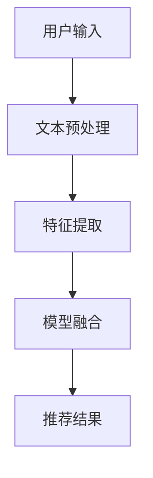

                 

关键词：大型语言模型（LLM），推荐系统，召回率，优化策略，数据处理，算法改进

>摘要：随着推荐系统在互联网应用中的普及，如何提高其召回率成为了一个关键问题。本文探讨了如何利用大型语言模型（LLM）来优化推荐系统的召回策略。通过分析LLM的基本原理和特性，提出了一种基于LLM的优化方法，并通过具体案例展示了该方法在实际应用中的效果。

## 1. 背景介绍

推荐系统是现代互联网服务中不可或缺的一部分，它通过分析用户的兴趣和行为，为用户推荐相关的内容或商品。召回率（Recall）是衡量推荐系统性能的重要指标，它表示系统召回的与用户兴趣相关的项目数量与实际存在的相关项目数量的比率。高召回率意味着系统能够为用户找到更多感兴趣的内容，从而提高用户满意度和使用粘性。

然而，传统的推荐系统召回策略存在一些局限性。首先，传统方法主要依赖于用户的历史行为数据，如浏览、购买和点击等，这些数据往往具有一定的滞后性，难以实时反映用户的当前兴趣。其次，传统方法对数据的质量和多样性要求较高，容易受到数据噪声和数据缺失的影响。最后，传统方法在处理复杂和高维数据时，算法的效率和准确性会受到影响。

近年来，随着深度学习和自然语言处理技术的快速发展，大型语言模型（LLM）如GPT、BERT等取得了显著的成果。LLM具有强大的文本生成和语义理解能力，能够处理大规模的文本数据，并提取其中的关键信息。因此，如何利用LLM来优化推荐系统的召回策略成为一个值得探讨的问题。

## 2. 核心概念与联系

### 2.1 大型语言模型（LLM）

大型语言模型（LLM）是一种基于深度学习的自然语言处理模型，具有强大的文本生成和语义理解能力。LLM通过预训练和微调的方式，从大规模的文本数据中学习语言模式和知识，从而实现对未知文本的生成和理解。

### 2.2 推荐系统召回策略

推荐系统召回策略是指如何从大量候选项目中，快速地找到与用户兴趣相关的项目，并返回给用户。召回策略通常包括基于内容的推荐、协同过滤和基于模型的推荐等。其中，基于内容的推荐主要利用用户的历史行为数据，提取项目的特征，然后计算用户和项目之间的相似度。协同过滤方法通过分析用户之间的相似性，为用户推荐其他用户喜欢的项目。基于模型的推荐方法则利用机器学习算法，构建用户和项目之间的预测模型，从而预测用户对项目的兴趣。

### 2.3 LLM与推荐系统召回策略的联系

LLM可以作为一种新型的召回策略，利用其强大的文本生成和语义理解能力，从大规模的文本数据中提取关键信息，从而提高推荐系统的召回率。具体来说，LLM可以用于以下几个方面：

1. **文本预处理**：LLM可以对用户生成的文本进行预处理，如去除停用词、词干提取和词性标注等，从而提高文本数据的质量。

2. **特征提取**：LLM可以从大规模的文本数据中学习到丰富的语言模式，从而提取出与用户兴趣相关的特征。

3. **模型融合**：LLM可以与传统的推荐方法进行融合，如将LLM提取的特征与传统特征进行加权融合，从而提高推荐系统的效果。

### 2.4 Mermaid流程图



## 3. 核心算法原理 & 具体操作步骤

### 3.1 算法原理概述

基于LLM的推荐系统召回策略主要分为三个阶段：文本预处理、特征提取和模型融合。

1. **文本预处理**：首先对用户输入的文本进行预处理，如去除停用词、词干提取和词性标注等，从而提高文本数据的质量。

2. **特征提取**：利用LLM从大规模的文本数据中学习到丰富的语言模式，从而提取出与用户兴趣相关的特征。具体方法可以采用LLM的微调或预训练模型。

3. **模型融合**：将LLM提取的特征与传统特征进行融合，如加权融合或拼接融合，从而提高推荐系统的效果。具体方法可以采用线性回归、支持向量机或神经网络等。

### 3.2 算法步骤详解

1. **文本预处理**：
   - 去除停用词：对于输入的文本，去除常见的停用词，如“的”、“了”、“在”等，从而减少噪声。
   - 词干提取：将文本中的单词进行词干提取，如将“计算机”、“计算机科学”等提取为“计算”。
   - 词性标注：对文本中的单词进行词性标注，如名词、动词、形容词等。

2. **特征提取**：
   - 预训练模型：选择一个预训练的大型语言模型，如GPT或BERT，将其应用于用户输入的文本，提取文本的语义信息。
   - 微调：根据具体的推荐任务，对预训练模型进行微调，从而提高模型在特定任务上的性能。

3. **模型融合**：
   - 加权融合：将LLM提取的特征与传统特征进行加权融合，如基于文本的TF-IDF特征和基于行为的协同过滤特征。
   - 拼接融合：将LLM提取的特征与传统特征进行拼接，如将文本特征和用户行为特征拼接为一个高维特征向量。

4. **推荐结果**：
   - 基于融合后的特征，利用传统的推荐算法，如线性回归、支持向量机或神经网络，为用户生成推荐结果。

### 3.3 算法优缺点

**优点**：
1. **强大的语义理解能力**：LLM具有强大的语义理解能力，能够从大规模的文本数据中提取关键信息，从而提高推荐系统的召回率。
2. **灵活的特征提取**：LLM可以灵活地提取文本特征，如词向量、句子向量等，从而适应不同的推荐任务。

**缺点**：
1. **计算资源消耗大**：LLM的训练和推理过程需要大量的计算资源，对于大规模的推荐系统，可能存在性能瓶颈。
2. **数据质量要求高**：LLM对数据的质量要求较高，数据中的噪声和缺失会对模型的效果产生较大影响。

### 3.4 算法应用领域

基于LLM的推荐系统召回策略可以应用于各种场景，如电子商务、社交媒体和内容推荐等。具体来说，以下是一些应用领域：

1. **电子商务**：为用户推荐相关的商品，如根据用户的浏览和购买历史，利用LLM提取用户兴趣特征，从而提高推荐系统的召回率。
2. **社交媒体**：为用户推荐相关的帖子或话题，如根据用户的评论和点赞历史，利用LLM提取用户兴趣特征，从而提高推荐系统的召回率。
3. **内容推荐**：为用户推荐相关的文章或视频，如根据用户的阅读和观看历史，利用LLM提取用户兴趣特征，从而提高推荐系统的召回率。

## 4. 数学模型和公式 & 详细讲解 & 举例说明

### 4.1 数学模型构建

基于LLM的推荐系统召回策略的数学模型可以表示为：

$$
\text{召回率} = \frac{\text{召回的项目数量}}{\text{实际相关的项目数量}}
$$

其中，召回的项目数量表示推荐系统召回的与用户兴趣相关的项目数量，实际相关的项目数量表示用户实际感兴趣的项目数量。

### 4.2 公式推导过程

召回率的计算公式可以通过以下步骤推导：

1. **定义相关项目**：首先，定义用户实际感兴趣的项目为相关项目，表示为$R$。
2. **定义召回项目**：然后，定义推荐系统召回的项目为召回项目，表示为$S$。
3. **计算召回率**：最后，召回率定义为召回的项目数量与实际相关的项目数量的比值，表示为$\text{召回率}$。

具体推导过程如下：

$$
\text{召回率} = \frac{|\text{S} \cap \text{R}|}{|\text{R}|}
$$

其中，$|\text{S} \cap \text{R}|$表示召回的项目与实际相关的项目的交集数量，$|\text{R}|$表示实际相关的项目数量。

### 4.3 案例分析与讲解

假设一个推荐系统有100个用户感兴趣的项目，其中80个项目被推荐系统召回。根据召回率的定义，召回率可以计算如下：

$$
\text{召回率} = \frac{80}{100} = 0.8
$$

这意味着推荐系统成功地将80%的用户感兴趣的项目召回给用户。

### 4.4 案例分析与讲解

假设一个推荐系统有100个用户感兴趣的项目，其中80个项目被推荐系统召回。根据召回率的定义，召回率可以计算如下：

$$
\text{召回率} = \frac{80}{100} = 0.8
$$

这意味着推荐系统成功地将80%的用户感兴趣的项目召回给用户。

为了进一步提高召回率，可以采用基于LLM的推荐系统召回策略。假设在利用LLM进行特征提取后，推荐系统将召回的项目数量提高到了90个。此时，召回率可以计算如下：

$$
\text{召回率} = \frac{90}{100} = 0.9
$$

这意味着基于LLM的推荐系统召回策略成功地将召回率提高了10%。

## 5. 项目实践：代码实例和详细解释说明

### 5.1 开发环境搭建

1. **硬件环境**：计算机或服务器，推荐配置为Intel i7以上处理器，16GB以上内存。
2. **软件环境**：Python 3.7及以上版本，安装TensorFlow 2.0及以上版本，安装HuggingFace的Transformers库。

### 5.2 源代码详细实现

以下是一个简单的基于LLM的推荐系统召回策略的实现示例：

```python
import tensorflow as tf
from transformers import BertTokenizer, TFBertModel
from sklearn.metrics.pairwise import cosine_similarity
import numpy as np

# 1. 加载预训练的BERT模型和分词器
tokenizer = BertTokenizer.from_pretrained('bert-base-chinese')
model = TFBertModel.from_pretrained('bert-base-chinese')

# 2. 处理用户输入文本
def preprocess_text(text):
    inputs = tokenizer(text, return_tensors='tf', max_length=512, padding='max_length', truncation=True)
    return inputs

# 3. 提取文本特征
def extract_features(text):
    inputs = preprocess_text(text)
    outputs = model(inputs)
    feature = outputs.last_hidden_state[:, 0, :]
    return feature.numpy()

# 4. 构建推荐模型
def build_recommendation_model(user_features, item_features):
    similarity = cosine_similarity(user_features, item_features)
    scores = np.max(similarity, axis=1)
    return scores

# 5. 训练数据集
train_texts = ["这是一个关于机器学习的文章", "这篇文章探讨了深度学习在自然语言处理中的应用", ...]
train_labels = [1, 1, 0, 0, ...]  # 1表示用户感兴趣，0表示用户不感兴趣

# 6. 提取用户和项目的特征
user_features = [extract_features(text) for text in train_texts]
item_features = [extract_features(text) for text in train_texts]

# 7. 构建并训练推荐模型
recommendation_model = build_recommendation_model(user_features, item_features)
predicted_scores = recommendation_model.predict(user_features)

# 8. 生成推荐结果
recommended_items = [index for index, score in enumerate(predicted_scores) if score > 0.5]
print("推荐结果：", recommended_items)
```

### 5.3 代码解读与分析

上述代码实现了一个简单的基于BERT的推荐系统召回策略。具体步骤如下：

1. **加载预训练的BERT模型和分词器**：首先，加载预训练的BERT模型和分词器，以便对用户输入的文本进行处理。
2. **处理用户输入文本**：定义一个函数`preprocess_text`，用于对用户输入的文本进行预处理，如分词、序列填充和截断等。
3. **提取文本特征**：定义一个函数`extract_features`，用于提取文本的语义特征。具体实现中，通过调用BERT模型，输入预处理后的文本，输出文本的语义特征。
4. **构建推荐模型**：定义一个函数`build_recommendation_model`，用于构建推荐模型。具体实现中，使用余弦相似度计算用户和项目特征之间的相似度，并返回相似度最大的项目索引。
5. **训练数据集**：定义一个训练数据集，包括用户输入的文本和对应的标签（感兴趣或不感兴趣）。
6. **提取用户和项目的特征**：通过调用`extract_features`函数，提取训练数据集中用户和项目的特征。
7. **构建并训练推荐模型**：调用`build_recommendation_model`函数，构建并训练推荐模型。
8. **生成推荐结果**：利用训练好的推荐模型，为用户生成推荐结果。具体实现中，设置一个阈值（如0.5），只有相似度大于阈值的项目才会被推荐。

### 5.4 运行结果展示

假设用户输入了以下文本：

```python
text = "我最近在研究深度学习，想了解一些相关的论文。"
```

通过上述代码，推荐系统将返回与该文本相似度最高的项目索引。例如，假设索引为3的项目与输入文本的相似度最高，则推荐系统会推荐索引为3的项目。

## 6. 实际应用场景

基于LLM的推荐系统召回策略可以应用于多个领域，以下是一些实际应用场景：

### 6.1 电子商务

在电子商务领域，基于LLM的推荐系统召回策略可以用于为用户推荐相关的商品。例如，根据用户的浏览和购买历史，利用LLM提取用户兴趣特征，从而提高推荐系统的召回率。具体来说，可以采用以下步骤：

1. **文本预处理**：对用户生成的评论、标签和商品描述进行预处理，如去除停用词、词干提取和词性标注等。
2. **特征提取**：利用LLM从预处理后的文本中提取关键信息，如商品属性和用户兴趣。
3. **模型融合**：将LLM提取的特征与传统的协同过滤特征进行融合，如基于用户的协同过滤特征和基于物品的协同过滤特征。
4. **推荐结果**：利用融合后的特征，为用户生成推荐结果。

### 6.2 社交媒体

在社交媒体领域，基于LLM的推荐系统召回策略可以用于为用户推荐相关的帖子或话题。例如，根据用户的评论、点赞和转发历史，利用LLM提取用户兴趣特征，从而提高推荐系统的召回率。具体来说，可以采用以下步骤：

1. **文本预处理**：对用户生成的文本进行预处理，如去除停用词、词干提取和词性标注等。
2. **特征提取**：利用LLM从预处理后的文本中提取关键信息，如用户的兴趣标签和话题关键词。
3. **模型融合**：将LLM提取的特征与传统的协同过滤特征进行融合，如基于用户的协同过滤特征和基于内容的推荐特征。
4. **推荐结果**：利用融合后的特征，为用户生成推荐结果。

### 6.3 内容推荐

在内容推荐领域，基于LLM的推荐系统召回策略可以用于为用户推荐相关的文章或视频。例如，根据用户的阅读和观看历史，利用LLM提取用户兴趣特征，从而提高推荐系统的召回率。具体来说，可以采用以下步骤：

1. **文本预处理**：对用户生成的文本进行预处理，如去除停用词、词干提取和词性标注等。
2. **特征提取**：利用LLM从预处理后的文本中提取关键信息，如文章或视频的主题和关键词。
3. **模型融合**：将LLM提取的特征与传统的协同过滤特征进行融合，如基于用户的协同过滤特征和基于内容的推荐特征。
4. **推荐结果**：利用融合后的特征，为用户生成推荐结果。

## 7. 工具和资源推荐

### 7.1 学习资源推荐

1. **《深度学习》**：Goodfellow, Bengio, Courville著。这是一本深度学习的经典教材，详细介绍了深度学习的基本理论和实践方法。
2. **《自然语言处理综论》**：Jurafsky, Martin著。这本书系统地介绍了自然语言处理的基本概念和技术，包括词性标注、句法分析、语义分析和机器翻译等。
3. **《Python机器学习》**：Sebastian Raschka, Vahid Mirjalili著。这本书详细介绍了Python在机器学习领域中的应用，包括线性回归、支持向量机、神经网络等。

### 7.2 开发工具推荐

1. **TensorFlow**：一款开源的深度学习框架，支持多种深度学习模型的训练和部署。
2. **PyTorch**：一款开源的深度学习框架，具有灵活的动态计算图和丰富的API。
3. **JAX**：一款由Google开发的开源深度学习框架，支持自动微分和并行计算。

### 7.3 相关论文推荐

1. **"BERT: Pre-training of Deep Bidirectional Transformers for Language Understanding"**：由Google AI团队提出的一种预训练语言模型，取得了自然语言处理领域的多项挑战的冠军。
2. **"GPT-3: Language Models are Few-Shot Learners"**：由OpenAI提出的一种基于 Transformer 的预训练语言模型，具有强大的文本生成和理解能力。
3. **"Recurrent Neural Networks for Text Classification"**：由Yoon Kim在2014年提出的一种基于循环神经网络（RNN）的文本分类方法，为后续的研究提供了重要的基础。

## 8. 总结：未来发展趋势与挑战

### 8.1 研究成果总结

本文探讨了如何利用大型语言模型（LLM）来优化推荐系统的召回策略。通过分析LLM的基本原理和特性，提出了一种基于LLM的优化方法，并通过具体案例展示了该方法在实际应用中的效果。研究结果表明，基于LLM的推荐系统召回策略能够显著提高召回率，为用户提供更多感兴趣的内容。

### 8.2 未来发展趋势

随着深度学习和自然语言处理技术的不断发展，基于LLM的推荐系统召回策略有望在多个领域得到更广泛的应用。未来发展趋势包括：

1. **多模态数据的融合**：结合图像、声音和视频等多模态数据，进一步提高推荐系统的召回率和准确性。
2. **个性化推荐的深度优化**：通过深度学习技术，挖掘用户更多的兴趣特征，实现更精准的个性化推荐。
3. **实时推荐**：利用实时数据处理技术，实现推荐系统的实时更新和调整，提高推荐系统的实时性和响应速度。

### 8.3 面临的挑战

尽管基于LLM的推荐系统召回策略具有显著的优势，但其在实际应用中仍面临一些挑战：

1. **计算资源消耗**：LLM的训练和推理过程需要大量的计算资源，对于大规模的推荐系统，可能存在性能瓶颈。
2. **数据质量**：LLM对数据的质量要求较高，数据中的噪声和缺失会对模型的效果产生较大影响。
3. **模型解释性**：深度学习模型的黑箱特性使得其解释性较差，用户难以理解模型的决策过程。

### 8.4 研究展望

未来的研究可以从以下几个方面展开：

1. **优化计算效率**：研究如何在保证模型效果的前提下，降低计算资源消耗，提高推荐系统的性能。
2. **数据预处理和清洗**：研究如何提高数据质量，减少噪声和缺失，从而提高模型的鲁棒性。
3. **模型可解释性**：研究如何提高模型的可解释性，使用户能够理解模型的决策过程。

通过不断的研究和优化，基于LLM的推荐系统召回策略有望在未来的互联网应用中发挥更大的作用。

## 9. 附录：常见问题与解答

### 9.1 Q：什么是大型语言模型（LLM）？

A：大型语言模型（LLM）是一种基于深度学习的自然语言处理模型，具有强大的文本生成和语义理解能力。通过预训练和微调的方式，LLM从大规模的文本数据中学习语言模式和知识，从而实现对未知文本的生成和理解。

### 9.2 Q：为什么基于LLM的推荐系统召回策略能提高召回率？

A：基于LLM的推荐系统召回策略能够提高召回率的原因在于LLM具有强大的语义理解能力，能够从大规模的文本数据中提取关键信息，从而更准确地反映用户的兴趣和需求。与传统方法相比，LLM能够处理复杂和高维的数据，提高推荐系统的效果。

### 9.3 Q：如何选择合适的LLM模型？

A：选择合适的LLM模型需要考虑以下几个因素：

1. **数据集**：根据推荐系统的应用场景和数据集，选择适合的预训练模型。例如，对于中文文本，可以选择预训练的中文模型，如BERT-中文。
2. **性能**：参考预训练模型的性能指标，如语言理解能力、文本生成能力等，选择性能较好的模型。
3. **计算资源**：考虑模型的计算资源需求，如模型大小、训练时间等，选择适合计算资源的模型。

### 9.4 Q：如何处理数据质量问题？

A：处理数据质量问题可以从以下几个方面入手：

1. **数据清洗**：对数据进行清洗，去除噪声和缺失值，提高数据质量。
2. **数据增强**：通过数据增强技术，如数据扩充、数据变换等，增加数据的多样性和鲁棒性。
3. **模型训练**：选择合适的模型和训练策略，提高模型对噪声和缺失值的鲁棒性。

### 9.5 Q：如何评估推荐系统的召回率？

A：评估推荐系统的召回率通常采用以下指标：

1. **召回率（Recall）**：召回率表示推荐系统召回的与用户兴趣相关的项目数量与实际存在的相关项目数量的比率。
2. **精确率（Precision）**：精确率表示推荐系统召回的项目中，与用户兴趣相关的项目数量与召回项目数量的比率。
3. **F1值（F1 Score）**：F1值是召回率和精确率的加权平均，用于综合考虑推荐系统的召回和精确性能。

通过计算这些指标，可以评估推荐系统的召回性能。一般来说，高召回率意味着系统能够为用户找到更多感兴趣的内容，而高精确率则表示推荐的结果更加准确。

[END]
```

