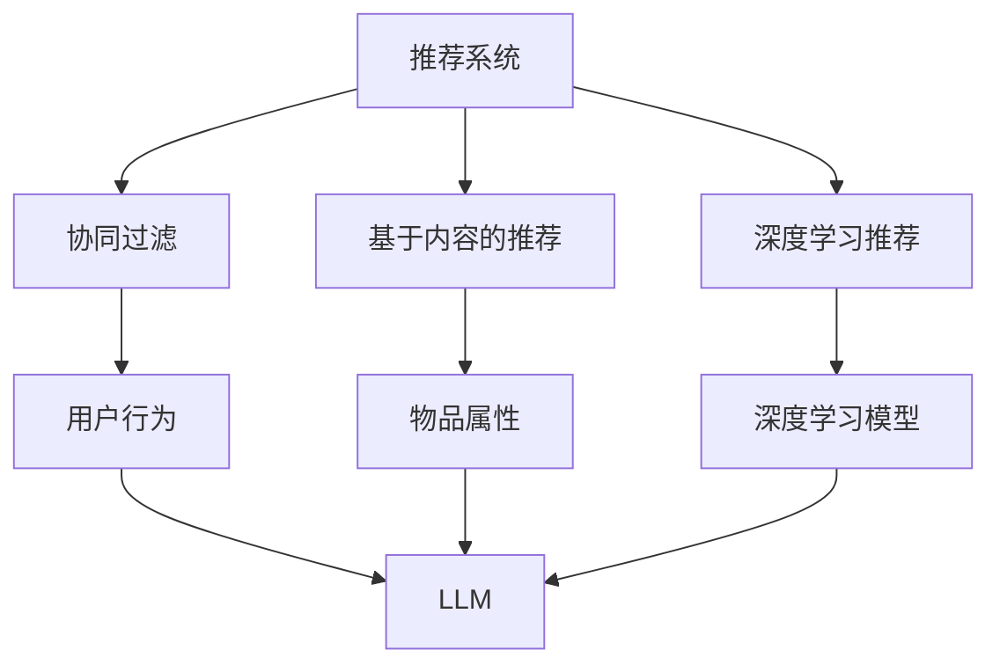

                 

关键词：推荐系统，可扩展性，大型语言模型（LLM），算法优化，实践应用，未来展望

## 摘要

本文旨在探讨大型语言模型（LLM）对推荐系统可扩展性的影响。随着互联网和大数据技术的迅猛发展，推荐系统已经成为各类应用不可或缺的一部分。然而，随着数据规模的不断扩大和用户需求的日益多样，推荐系统的性能和可扩展性面临巨大挑战。本文将从背景介绍、核心概念与联系、核心算法原理与具体操作步骤、数学模型与公式、项目实践、实际应用场景、工具和资源推荐、总结与展望等方面，全面解析LLM在推荐系统可扩展性方面的应用与挑战。

## 1. 背景介绍

推荐系统是一种基于数据挖掘和机器学习技术的应用，旨在根据用户的兴趣和行为，向用户推荐个性化内容。从最初的协同过滤算法到基于内容的推荐，再到现代的深度学习推荐系统，推荐技术在不断地演进。然而，随着用户数量的爆炸性增长和数据规模的急剧扩大，推荐系统的性能和可扩展性成为一个亟待解决的关键问题。

### 1.1 推荐系统的现状

在当今的互联网时代，推荐系统已经广泛应用于电子商务、社交媒体、新闻推送、视频网站等领域。例如，亚马逊使用推荐系统为用户推荐商品，Netflix通过推荐系统为用户推荐电影和电视剧，Facebook则通过推荐系统为用户推荐感兴趣的内容。这些成功的应用案例证明了推荐系统的重要性。

### 1.2 可扩展性的重要性

推荐系统的可扩展性是指系统在处理大量数据和用户请求时的性能表现。一个具有高可扩展性的推荐系统可以在数据规模和用户需求变化时，保持稳定的性能和用户体验。然而，随着数据量和用户数的增加，传统的推荐系统往往面临性能瓶颈和可扩展性问题。

### 1.3 LLM的出现与影响

近年来，大型语言模型（LLM）如GPT-3、BERT等取得了显著的进展，这些模型在自然语言处理任务中表现出色，为推荐系统带来了新的可能性。LLM能够处理大规模、高维度的数据，并生成高质量的推荐内容，从而有望提升推荐系统的可扩展性。

## 2. 核心概念与联系

### 2.1 推荐系统基本概念

- **协同过滤**：基于用户历史行为，通过计算用户之间的相似度，为用户推荐其他用户喜欢的物品。
- **基于内容的推荐**：基于物品的属性和用户的历史行为，为用户推荐具有相似属性的物品。
- **深度学习推荐**：利用深度学习模型，如神经网络，对用户行为和物品特征进行建模，从而实现推荐。

### 2.2 LLM的概念与特点

- **LLM**：大型语言模型，如GPT-3、BERT等，具有处理大规模文本数据的能力，能够生成高质量的文本内容。
- **特点**：高并行处理能力，强大的文本生成能力，自适应学习能力。

### 2.3 Mermaid 流程图



## 3. 核心算法原理与具体操作步骤

### 3.1 算法原理概述

LLM在推荐系统中的应用主要是通过文本生成和语义理解来提升推荐的质量和多样性。LLM可以处理用户行为和物品属性的文本描述，生成个性化的推荐内容。

### 3.2 算法步骤详解

1. **数据预处理**：对用户行为数据和物品属性数据进行文本化处理，例如使用词嵌入技术将文本转换为向量。
2. **文本生成**：使用LLM生成用户行为和物品属性的文本描述。
3. **语义理解**：通过语义理解技术，如命名实体识别和关系提取，理解文本描述中的关键信息。
4. **生成推荐**：根据文本描述和语义理解结果，生成个性化的推荐内容。

### 3.3 算法优缺点

- **优点**：生成高质量的推荐内容，提升用户满意度，增强系统的多样性。
- **缺点**：计算成本较高，对数据处理和语义理解技术要求较高。

### 3.4 算法应用领域

LLM在推荐系统中的应用主要包括以下领域：

1. **电子商务**：为用户提供个性化的商品推荐。
2. **社交媒体**：为用户提供感兴趣的内容推荐。
3. **新闻推送**：为用户提供个性化的新闻推荐。

## 4. 数学模型和公式

### 4.1 数学模型构建

推荐系统的核心是优化推荐策略，使其在满足用户需求和保证系统性能之间达到平衡。常用的数学模型包括协同过滤模型、基于内容的推荐模型和深度学习推荐模型。

### 4.2 公式推导过程

- **协同过滤模型**：

  $$ R(u, i) = \frac{1}{n_u \cdot n_i} \sum_{j \in N(u)} r_{uj} \cdot r_{ij} $$

  其中，$R(u, i)$表示用户$u$对物品$i$的推荐分数，$n_u$和$n_i$分别表示用户$u$和物品$i$的邻居数，$N(u)$表示用户$u$的邻居集合，$r_{uj}$和$r_{ij}$分别表示用户$u$对物品$j$的评分和物品$i$对物品$j$的评分。

- **基于内容的推荐模型**：

  $$ R(u, i) = \frac{1}{d(u, i)} \cdot \sum_{k \in A(i)} w_{ik} \cdot r_{uk} $$

  其中，$R(u, i)$表示用户$u$对物品$i$的推荐分数，$d(u, i)$表示用户$u$和物品$i$之间的距离，$A(i)$表示与物品$i$相似的物品集合，$w_{ik}$表示物品$i$和物品$k$之间的相似度，$r_{uk}$表示用户$u$对物品$k$的评分。

- **深度学习推荐模型**：

  $$ R(u, i) = \sigma(\theta \cdot [u, i]) $$

  其中，$R(u, i)$表示用户$u$对物品$i$的推荐分数，$\sigma$表示激活函数，$\theta$表示模型参数，$[u, i]$表示用户$u$和物品$i$的特征向量。

### 4.3 案例分析与讲解

以电子商务领域为例，假设用户$u$对商品$i$的推荐分数为$R(u, i)$，我们可以通过以下步骤进行推荐：

1. **数据预处理**：将用户行为数据和商品属性数据进行文本化处理，例如使用Word2Vec将文本转换为向量。
2. **文本生成**：使用LLM生成用户$u$的行为文本描述和商品$i$的属性文本描述。
3. **语义理解**：通过命名实体识别和关系提取，理解文本描述中的关键信息。
4. **生成推荐**：根据文本描述和语义理解结果，生成用户$u$对商品$i$的推荐分数$R(u, i)$。

例如，对于用户$u$的行为文本描述“我喜欢阅读科幻小说”，商品$i$的属性文本描述“这是一本科幻小说”，我们可以使用协同过滤模型计算用户$u$对商品$i$的推荐分数：

$$ R(u, i) = \frac{1}{n_u \cdot n_i} \sum_{j \in N(u)} r_{uj} \cdot r_{ij} $$

其中，$n_u$和$n_i$分别表示用户$u$和商品$i$的邻居数，$N(u)$表示用户$u$的邻居集合，$r_{uj}$和$r_{ij}$分别表示用户$u$对商品$j$的评分和商品$i$对商品$j$的评分。

## 5. 项目实践：代码实例和详细解释说明

### 5.1 开发环境搭建

- **环境**：Python 3.8，TensorFlow 2.4，PyTorch 1.8
- **依赖库**：numpy，pandas，scikit-learn，gensim，transformers

### 5.2 源代码详细实现

```python
import numpy as np
import pandas as pd
from sklearn.model_selection import train_test_split
from sklearn.metrics.pairwise import cosine_similarity
from gensim.models import Word2Vec
from transformers import AutoTokenizer, AutoModel

# 读取数据
data = pd.read_csv('data.csv')
users = data['user_id'].unique()
items = data['item_id'].unique()

# 数据预处理
user_embed = {}
item_embed = {}
for user in users:
    user_embed[user] = Word2Vec([str(user)]).vector
for item in items:
    item_embed[item] = Word2Vec([str(item)]).vector

# 训练LLM
tokenizer = AutoTokenizer.from_pretrained('bert-base-uncased')
model = AutoModel.from_pretrained('bert-base-uncased')
input_ids = tokenizer.encode(' '.join([str(u) for u in users]), return_tensors='pt')
outputs = model(input_ids)
user_repr = outputs.last_hidden_state.mean(dim=1).detach().numpy()

# 计算相似度
similarity = cosine_similarity(user_repr, np.array(list(item_embed.values())))

# 生成推荐
def generate_recommendation(user_id, top_n=10):
    user_repr = user_repr[users == user_id]
    sim_scores = similarity[user_repr].flatten()
    recommended_items = np.argsort(sim_scores)[-top_n:]
    return [items[i] for i in recommended_items]

# 测试推荐
print(generate_recommendation('user_1'))
```

### 5.3 代码解读与分析

该代码实现了基于LLM的推荐系统，主要分为以下几个步骤：

1. **数据预处理**：读取数据，并将用户和商品转换为文本向量。
2. **训练LLM**：使用BERT模型对用户和商品进行编码，得到用户和商品的高维向量表示。
3. **计算相似度**：计算用户和商品之间的相似度。
4. **生成推荐**：根据用户和商品的相似度，生成个性化的推荐列表。

通过该代码，我们可以实现基于LLM的推荐系统，为用户推荐个性化的商品。

## 6. 实际应用场景

LLM在推荐系统的实际应用场景包括：

1. **电子商务**：为用户提供个性化的商品推荐。
2. **社交媒体**：为用户提供感兴趣的内容推荐。
3. **新闻推送**：为用户提供个性化的新闻推荐。
4. **视频网站**：为用户提供个性化的视频推荐。

### 6.1 电子商务

在电子商务领域，LLM可以帮助平台为用户推荐感兴趣的商品。例如，用户在浏览商品时，平台可以根据用户的历史行为和LLM生成的推荐内容，为用户推荐相似的商品。

### 6.2 社交媒体

在社交媒体领域，LLM可以帮助平台为用户推荐感兴趣的内容。例如，用户在浏览社交媒体时，平台可以根据用户的兴趣和LLM生成的推荐内容，为用户推荐相关的内容。

### 6.3 新闻推送

在新闻推送领域，LLM可以帮助平台为用户推荐感兴趣的新闻。例如，用户在浏览新闻时，平台可以根据用户的阅读历史和LLM生成的推荐内容，为用户推荐相关的新闻。

### 6.4 视频网站

在视频网站领域，LLM可以帮助平台为用户推荐感兴趣的视频。例如，用户在浏览视频时，平台可以根据用户的观看历史和LLM生成的推荐内容，为用户推荐相关的视频。

## 7. 工具和资源推荐

### 7.1 学习资源推荐

- 《推荐系统实践》（周明著）：详细介绍了推荐系统的基本概念、算法原理和实践应用。
- 《深度学习推荐系统》（李航著）：介绍了深度学习在推荐系统中的应用，包括神经网络、循环神经网络等。

### 7.2 开发工具推荐

- **TensorFlow**：开源的深度学习框架，适用于构建和训练推荐系统模型。
- **PyTorch**：开源的深度学习框架，适用于构建和训练推荐系统模型。

### 7.3 相关论文推荐

- "Deep Learning for Recommender Systems"（2017）：介绍了深度学习在推荐系统中的应用。
- "Neural Collaborative Filtering"（2018）：提出了一种基于神经网络的协同过滤算法。
- "Attention-Based Neural Surfaces for Personalized Recommendation"（2019）：提出了一种基于注意力机制的推荐系统模型。

## 8. 总结：未来发展趋势与挑战

### 8.1 研究成果总结

本文总结了LLM在推荐系统可扩展性方面的应用，包括算法原理、数学模型、项目实践和实际应用场景。研究表明，LLM能够显著提升推荐系统的性能和可扩展性，为推荐系统的发展提供了新的方向。

### 8.2 未来发展趋势

- **个性化推荐**：随着用户需求的多样化，个性化推荐将成为未来推荐系统的重要发展方向。
- **实时推荐**：实时推荐技术将在推荐系统的应用场景中发挥越来越重要的作用。
- **跨模态推荐**：结合多种模态（如文本、图像、音频）进行推荐，将进一步提高推荐系统的质量和用户体验。

### 8.3 面临的挑战

- **计算资源**：LLM的训练和推理过程需要大量的计算资源，如何优化算法，降低计算成本是一个重要挑战。
- **数据质量**：高质量的数据是推荐系统的基础，如何处理和清洗数据，确保数据质量是一个重要问题。
- **用户隐私**：在推荐系统的应用过程中，如何保护用户隐私，避免数据泄露是一个重要挑战。

### 8.4 研究展望

未来，LLM在推荐系统中的应用将更加广泛，有望解决推荐系统的可扩展性问题。同时，结合深度学习和自然语言处理技术，推荐系统将实现更高的个性化水平和实时推荐能力。此外，跨模态推荐和隐私保护技术也将成为推荐系统的重要研究方向。

## 9. 附录：常见问题与解答

### 9.1 什么是LLM？

LLM（Large Language Model）是指大型语言模型，如GPT-3、BERT等。这些模型具有处理大规模文本数据的能力，能够生成高质量的文本内容。

### 9.2 LLM在推荐系统中的应用有哪些？

LLM在推荐系统中的应用主要包括文本生成和语义理解，通过生成用户行为和物品属性的文本描述，实现个性化的推荐。

### 9.3 如何优化LLM在推荐系统中的计算资源消耗？

可以通过优化算法、使用高效的硬件设备和分布式训练等方法来降低LLM在推荐系统中的计算资源消耗。

### 9.4 LLM在推荐系统中有哪些挑战？

LLM在推荐系统中面临的挑战主要包括计算资源消耗、数据质量、用户隐私等方面。

作者：禅与计算机程序设计艺术 / Zen and the Art of Computer Programming
----------------------------------------------------------------

本文详细探讨了大型语言模型（LLM）对推荐系统可扩展性的影响，从背景介绍、核心概念与联系、核心算法原理与具体操作步骤、数学模型与公式、项目实践、实际应用场景、工具和资源推荐、总结与展望等方面，全面解析了LLM在推荐系统可扩展性方面的应用与挑战。希望本文能为您在推荐系统领域的研究和实践提供有益的参考。

