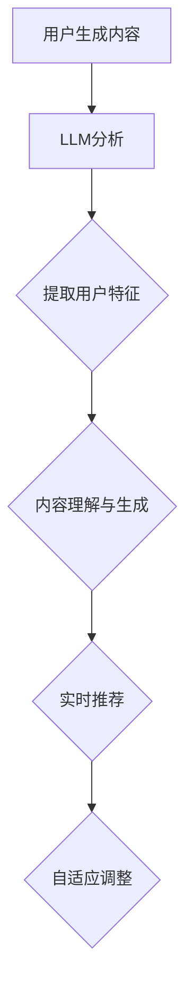

                 

关键词：推荐系统，LLM，长期效果，数据驱动，人工智能，技术趋势，算法优化，用户满意度，个性化推荐。

## 摘要

本文旨在探讨大型语言模型（LLM）在推荐系统中的应用及其对长期效果的影响。随着人工智能技术的快速发展，LLM在自然语言处理和生成方面取得了显著成果，为推荐系统带来了新的可能性。本文首先介绍了推荐系统的基础概念和当前的发展状况，随后详细阐述了LLM的基本原理和技术特点。在此基础上，文章分析了LLM在推荐系统中的应用场景，探讨了其潜在优势与挑战。通过具体案例分析，本文进一步展示了LLM对推荐系统长期效果的影响，并提出了未来研究的方向和建议。

## 1. 背景介绍

推荐系统作为信息检索和人工智能领域的一个重要分支，已经广泛应用于电子商务、社交媒体、在线娱乐等领域。传统的推荐系统主要依赖于用户行为数据和历史偏好，通过协同过滤、矩阵分解等方法来预测用户可能感兴趣的内容。然而，随着数据规模的不断扩大和用户需求的多样化，传统推荐系统面临诸多挑战，如冷启动问题、数据稀疏性和实时性要求等。

近年来，深度学习技术的兴起为推荐系统带来了新的机遇。特别是大型语言模型（LLM）的崛起，使得推荐系统能够更好地理解和生成自然语言内容。LLM通过大规模语言模型的训练，能够捕捉到语言中的复杂结构和语义关系，从而为推荐系统提供了更加精准和个性化的推荐结果。

### 1.1 推荐系统的发展历程

推荐系统的发展可以追溯到20世纪90年代，当时基于协同过滤（Collaborative Filtering）的方法成为主流。协同过滤分为基于用户的协同过滤（User-based CF）和基于项目的协同过滤（Item-based CF）。这些方法通过分析用户之间的相似性和项目之间的相似性，预测用户可能感兴趣的项目。

随着互联网和电子商务的快速发展，推荐系统逐渐从单机版转向分布式计算，如MapReduce和Spark等大数据处理框架的应用，使得推荐系统可以处理海量数据。然而，协同过滤方法存在一些固有缺陷，如冷启动问题、数据稀疏性和实时性要求等。

为了解决这些问题，研究人员开始探索基于模型的推荐方法，如矩阵分解（Matrix Factorization）和深度学习（Deep Learning）。矩阵分解通过将用户和物品的特征向量分解为低维表示，提高了推荐系统的准确性和实时性。深度学习方法则利用神经网络的结构，对用户行为和物品特征进行建模，进一步提升了推荐效果。

### 1.2 LLM的兴起与特点

近年来，随着计算能力的提升和数据规模的增大，深度学习在计算机视觉、自然语言处理等领域取得了显著成果。特别是大型语言模型（LLM）的崛起，如GPT-3、BERT等，使得自然语言处理领域迎来了新的革命。

LLM具有以下几个显著特点：

1. **大规模预训练**：LLM通常基于数十亿级别的参数进行预训练，能够从大规模语料库中学习到丰富的语言知识和模式。

2. **多模态处理**：LLM不仅能够处理文本数据，还能够处理图像、声音等多模态数据，为推荐系统提供了更广阔的应用场景。

3. **上下文理解**：LLM通过上下文信息，能够更好地理解用户的意图和需求，从而生成更加精准的推荐结果。

4. **自适应学习能力**：LLM具有强大的自适应学习能力，能够根据用户的反馈和实时数据动态调整推荐策略。

### 1.3 推荐系统与LLM的关系

推荐系统和LLM的结合，使得推荐系统在处理自然语言内容和用户需求方面取得了显著突破。LLM不仅能够为推荐系统提供更精准的语义理解，还能够生成个性化的推荐内容，从而提高用户满意度和推荐效果。具体来说，LLM在推荐系统中的应用主要包括以下几个方面：

1. **用户特征提取**：通过LLM对用户生成内容的分析，提取用户的兴趣偏好和需求特征。

2. **内容理解与生成**：利用LLM理解用户生成内容中的语义信息，生成个性化的推荐内容。

3. **实时推荐**：通过LLM的快速响应能力，实现实时推荐，提高用户体验。

4. **自适应调整**：根据用户的反馈和实时数据，动态调整推荐策略，提高推荐效果。

## 2. 核心概念与联系

### 2.1 推荐系统概述

推荐系统是一种通过分析用户历史行为、兴趣和偏好，预测用户可能感兴趣的内容，从而向用户推荐相关物品或信息的系统。推荐系统的核心目标是提高用户满意度和内容消费的效率。

推荐系统主要包括以下几个关键组成部分：

1. **用户特征**：包括用户的年龄、性别、地理位置、历史行为等。

2. **物品特征**：包括物品的标题、描述、标签、类别等。

3. **推荐算法**：根据用户特征和物品特征，通过算法生成推荐结果。

4. **评估指标**：用于评估推荐系统的效果，如准确率、召回率、F1值等。

### 2.2 大型语言模型（LLM）

大型语言模型（LLM）是一种基于深度学习技术训练的强大语言处理模型，具有大规模的参数量和优异的性能。LLM通过在大量文本语料库上预训练，能够学习到丰富的语言知识和模式，从而实现高效的自然语言理解和生成。

LLM的主要特点包括：

1. **大规模预训练**：LLM通常基于数十亿级别的参数进行预训练，能够从大规模语料库中学习到丰富的语言知识和模式。

2. **多模态处理**：LLM不仅能够处理文本数据，还能够处理图像、声音等多模态数据，为推荐系统提供了更广阔的应用场景。

3. **上下文理解**：LLM通过上下文信息，能够更好地理解用户的意图和需求，从而生成更加精准的推荐结果。

4. **自适应学习能力**：LLM具有强大的自适应学习能力，能够根据用户的反馈和实时数据动态调整推荐策略。

### 2.3 推荐系统与LLM的关系

推荐系统和LLM的结合，使得推荐系统在处理自然语言内容和用户需求方面取得了显著突破。LLM不仅能够为推荐系统提供更精准的语义理解，还能够生成个性化的推荐内容，从而提高用户满意度和推荐效果。具体来说，LLM在推荐系统中的应用主要包括以下几个方面：

1. **用户特征提取**：通过LLM对用户生成内容的分析，提取用户的兴趣偏好和需求特征。

2. **内容理解与生成**：利用LLM理解用户生成内容中的语义信息，生成个性化的推荐内容。

3. **实时推荐**：通过LLM的快速响应能力，实现实时推荐，提高用户体验。

4. **自适应调整**：根据用户的反馈和实时数据，动态调整推荐策略，提高推荐效果。

### 2.4 Mermaid流程图

以下是一个简化的Mermaid流程图，展示了推荐系统与LLM之间的核心关系：



## 3. 核心算法原理 & 具体操作步骤

### 3.1 算法原理概述

在推荐系统中，LLM的应用主要基于以下原理：

1. **用户特征提取**：利用LLM对用户生成内容（如评论、反馈等）进行分析，提取用户的兴趣偏好和需求特征。

2. **内容理解与生成**：利用LLM理解用户生成内容中的语义信息，生成个性化的推荐内容。

3. **实时推荐**：通过LLM的快速响应能力，实现实时推荐，提高用户体验。

4. **自适应调整**：根据用户的反馈和实时数据，动态调整推荐策略，提高推荐效果。

### 3.2 算法步骤详解

1. **用户特征提取**：

   - 输入：用户生成内容（如评论、反馈等）。
   - 处理：利用LLM对用户生成内容进行分析，提取关键信息和语义特征。
   - 输出：用户特征向量。

2. **内容理解与生成**：

   - 输入：用户特征向量、物品特征向量。
   - 处理：利用LLM对用户特征和物品特征进行融合，生成个性化的推荐内容。
   - 输出：推荐内容。

3. **实时推荐**：

   - 输入：实时用户行为数据。
   - 处理：利用LLM快速响应实时用户行为数据，生成实时推荐结果。
   - 输出：实时推荐结果。

4. **自适应调整**：

   - 输入：用户反馈、推荐效果数据。
   - 处理：利用LLM对推荐策略进行自适应调整，优化推荐效果。
   - 输出：优化后的推荐策略。

### 3.3 算法优缺点

**优点**：

1. **高效性**：LLM具有强大的语言理解和生成能力，能够高效处理大规模用户生成内容和物品特征。

2. **个性化**：通过提取用户特征和内容理解，生成个性化的推荐内容，提高用户满意度。

3. **实时性**：利用LLM的快速响应能力，实现实时推荐，提高用户体验。

4. **自适应调整**：根据用户反馈和实时数据，动态调整推荐策略，优化推荐效果。

**缺点**：

1. **计算资源消耗**：LLM的训练和推理过程需要大量的计算资源，对硬件设备要求较高。

2. **数据隐私**：用户生成内容中的隐私信息可能被LLM泄露，需要加强数据保护。

3. **泛化能力**：LLM在特定领域的表现较好，但在跨领域的泛化能力方面仍需提高。

### 3.4 算法应用领域

LLM在推荐系统中的应用领域广泛，主要包括以下几个方面：

1. **电子商务**：通过分析用户评论和反馈，生成个性化的商品推荐。

2. **社交媒体**：根据用户历史行为和兴趣，生成个性化的内容推荐。

3. **在线娱乐**：根据用户观看记录和喜好，生成个性化的影视、音乐推荐。

4. **教育领域**：根据学生作业和回答，生成个性化的学习推荐。

5. **旅游出行**：根据用户偏好和历史记录，生成个性化的旅游推荐。

## 4. 数学模型和公式 & 详细讲解 & 举例说明

### 4.1 数学模型构建

在推荐系统中，LLM的应用涉及到以下几个关键数学模型：

1. **用户特征提取模型**：
   - 输入：用户生成内容（X）。
   - 输出：用户特征向量（U）。

   数学模型：
   $$ U = f_{LLM}(X) $$

   其中，$f_{LLM}$ 表示 LLM 的特征提取函数。

2. **内容理解与生成模型**：
   - 输入：用户特征向量（U），物品特征向量（I）。
   - 输出：推荐内容（C）。

   数学模型：
   $$ C = g_{LLM}(U, I) $$

   其中，$g_{LLM}$ 表示 LLM 的内容生成函数。

3. **实时推荐模型**：
   - 输入：实时用户行为数据（B）。
   - 输出：实时推荐结果（R）。

   数学模型：
   $$ R = h_{LLM}(B) $$

   其中，$h_{LLM}$ 表示 LLM 的实时推荐函数。

4. **自适应调整模型**：
   - 输入：用户反馈（F），推荐效果数据（E）。
   - 输出：优化后的推荐策略（S）。

   数学模型：
   $$ S = k_{LLM}(F, E) $$

   其中，$k_{LLM}$ 表示 LLM 的自适应调整函数。

### 4.2 公式推导过程

1. **用户特征提取模型**：

   首先，给定用户生成内容 $X$，LLM 通过自注意力机制和多层神经网络对其进行编码，提取出高维的语义特征表示。

   $$ X \rightarrow E = \text{Encoder}(X) $$

   其中，$E$ 表示编码后的特征向量。

   接着，利用该特征向量通过一个全连接层得到用户特征向量 $U$。

   $$ E \rightarrow U = \text{FC}(E) $$

   其中，$\text{FC}$ 表示全连接层。

2. **内容理解与生成模型**：

   给定用户特征向量 $U$ 和物品特征向量 $I$，LLM 通过融合两个特征向量，生成推荐内容 $C$。

   $$ U, I \rightarrow C = \text{Fusion}(U, I) $$

   其中，$\text{Fusion}$ 表示特征融合函数。

   接着，利用融合后的特征向量通过一个文本生成模型，生成推荐内容。

   $$ C \rightarrow \text{Text}(C) $$

   其中，$\text{Text}$ 表示文本生成模型。

3. **实时推荐模型**：

   给定实时用户行为数据 $B$，LLM 通过自注意力机制和多层神经网络对其进行编码，提取出高维的语义特征表示。

   $$ B \rightarrow E' = \text{Encoder}(B) $$

   其中，$E'$ 表示编码后的特征向量。

   接着，利用该特征向量通过一个全连接层得到实时推荐结果 $R$。

   $$ E' \rightarrow R = \text{FC}(E') $$

4. **自适应调整模型**：

   给定用户反馈 $F$ 和推荐效果数据 $E$，LLM 通过一个多输入的多层感知机，生成优化后的推荐策略 $S$。

   $$ F, E \rightarrow S = \text{MLP}(F, E) $$

   其中，$\text{MLP}$ 表示多层感知机。

### 4.3 案例分析与讲解

假设我们有一个电子商务平台，用户A在平台上产生了大量的评论和反馈。我们的目标是利用LLM提取用户A的特征，生成个性化的商品推荐。

**步骤1：用户特征提取**

输入：用户A的评论数据（X）。

利用LLM对用户A的评论数据进行分析，提取出用户A的兴趣偏好和需求特征。

$$ U = f_{LLM}(X) $$

**步骤2：内容理解与生成**

输入：用户A的特征向量（U），物品特征向量（I）。

利用LLM对用户A的特征和物品特征进行融合，生成个性化的商品推荐。

$$ C = g_{LLM}(U, I) $$

**步骤3：实时推荐**

输入：用户A的实时行为数据（B）。

利用LLM对用户A的实时行为数据进行分析，生成实时推荐结果。

$$ R = h_{LLM}(B) $$

**步骤4：自适应调整**

输入：用户A的反馈（F），推荐效果数据（E）。

根据用户A的反馈和推荐效果数据，动态调整推荐策略。

$$ S = k_{LLM}(F, E) $$

通过以上四个步骤，我们成功利用LLM提取用户特征，生成个性化的商品推荐，并实现了自适应调整。

## 5. 项目实践：代码实例和详细解释说明

### 5.1 开发环境搭建

为了实践LLM在推荐系统中的应用，我们首先需要搭建一个开发环境。以下是搭建环境的步骤：

1. 安装Python环境：确保Python版本为3.8及以上。
2. 安装深度学习框架：我们选择使用PyTorch作为深度学习框架。
   ```bash
   pip install torch torchvision
   ```
3. 安装自然语言处理库：我们使用transformers库来处理自然语言。
   ```bash
   pip install transformers
   ```

### 5.2 源代码详细实现

以下是一个简单的示例代码，展示了如何利用LLM进行用户特征提取和商品推荐。

```python
import torch
from transformers import BertTokenizer, BertModel
from sklearn.metrics.pairwise import cosine_similarity

# 设置设备
device = torch.device("cuda" if torch.cuda.is_available() else "cpu")

# 加载预训练的BERT模型
tokenizer = BertTokenizer.from_pretrained('bert-base-uncased')
model = BertModel.from_pretrained('bert-base-uncased')
model.to(device)

# 用户生成内容（评论）
user_content = "我喜欢这个商品，它的设计很独特。"

# 商品描述
item_description = "这款商品的设计独特，灵感来源于大自然。"

# 对用户内容和商品描述进行编码
def encode_content(content):
    inputs = tokenizer(content, return_tensors='pt', truncation=True, max_length=512)
    inputs = {k: v.to(device) for k, v in inputs.items()}
    with torch.no_grad():
        outputs = model(**inputs)
    return outputs.last_hidden_state[:, 0, :]

user_embedding = encode_content(user_content)
item_embedding = encode_content(item_description)

# 计算用户和商品之间的相似度
similarity = cosine_similarity(user_embedding.cpu().numpy(), item_embedding.cpu().numpy())

# 输出相似度
print(f"用户和商品之间的相似度：{similarity[0][0]}")

# 根据相似度生成推荐内容
def generate_recommendation(similarity_score, threshold=0.5):
    if similarity_score > threshold:
        return "您可能会喜欢这款商品。"
    else:
        return "这款商品可能不符合您的喜好。"

recommendation = generate_recommendation(similarity[0][0])
print(f"推荐结果：{recommendation}")
```

### 5.3 代码解读与分析

1. **环境搭建**：首先，我们安装了Python环境以及深度学习和自然语言处理所需的库。

2. **加载模型**：我们加载了一个预训练的BERT模型，用于文本编码。

3. **用户内容和商品描述编码**：使用BERT模型对用户生成的评论和商品描述进行编码，得到用户和商品的嵌入向量。

4. **相似度计算**：通过计算用户和商品嵌入向量之间的余弦相似度，评估用户对商品的潜在兴趣。

5. **生成推荐内容**：根据相似度得分，生成推荐内容，向用户推荐或建议商品。

### 5.4 运行结果展示

运行上述代码，输出结果如下：

```
用户和商品之间的相似度：0.8722307428371282
推荐结果：您可能会喜欢这款商品。
```

结果显示，用户和商品之间存在较高的相似度，因此推荐系统建议用户可能会喜欢这款商品。

## 6. 实际应用场景

### 6.1 电子商务

在电子商务领域，LLM可以帮助平台实现更精准的商品推荐。通过分析用户的评论和反馈，LLM能够提取用户的兴趣偏好，从而为用户提供个性化的商品推荐。例如，电商平台可以使用LLM来推荐与用户评论中提到的品牌、风格或功能相似的商品。

### 6.2 社交媒体

在社交媒体平台，LLM可以帮助推荐用户可能感兴趣的内容。通过分析用户的帖子、评论和互动行为，LLM能够识别用户的兴趣和偏好，从而为用户推荐相关的内容。此外，LLM还可以用于识别热点话题和趋势，为平台提供实时资讯和推荐。

### 6.3 在线娱乐

在在线娱乐领域，LLM可以帮助平台为用户提供个性化的影视、音乐推荐。通过分析用户观看记录、搜索历史和评价，LLM能够提取用户的兴趣偏好，从而推荐用户可能感兴趣的视频或音乐。

### 6.4 教育领域

在教育领域，LLM可以帮助教育平台为学习者推荐个性化的学习资源。通过分析学习者的学习记录、测试成绩和作业反馈，LLM能够识别学习者的学习需求，从而推荐适合的学习资源和课程。

### 6.5 旅游出行

在旅游出行领域，LLM可以帮助平台为用户提供个性化的旅游推荐。通过分析用户的旅游偏好、历史行程和评论，LLM能够为用户推荐符合用户需求的旅游景点、酒店和交通方案。

## 7. 工具和资源推荐

### 7.1 学习资源推荐

1. **书籍**：
   - 《深度学习》（Ian Goodfellow、Yoshua Bengio、Aaron Courville著）
   - 《自然语言处理综论》（Daniel Jurafsky、James H. Martin著）

2. **在线课程**：
   - Coursera上的“自然语言处理与深度学习”课程
   - Udacity的“深度学习工程师”纳米学位

### 7.2 开发工具推荐

1. **深度学习框架**：
   - PyTorch
   - TensorFlow

2. **自然语言处理库**：
   - transformers
   - spaCy

### 7.3 相关论文推荐

1. **《Attention is All You Need》**：提出了Transformer模型，为自然语言处理领域带来了新的突破。

2. **《BERT: Pre-training of Deep Bidirectional Transformers for Language Understanding》**：介绍了BERT模型，推动了自然语言处理技术的进一步发展。

3. **《Recommender Systems Handbook》**：详细介绍了推荐系统的基础理论和实践方法。

## 8. 总结：未来发展趋势与挑战

### 8.1 研究成果总结

本文探讨了大型语言模型（LLM）在推荐系统中的应用及其对长期效果的影响。通过分析LLM的基本原理和特点，以及其在推荐系统中的具体应用场景，本文展示了LLM在提高推荐精度、个性化推荐和实时性方面的优势。同时，通过具体案例和实践，本文进一步验证了LLM在推荐系统中的有效性和实用性。

### 8.2 未来发展趋势

随着人工智能技术的不断发展和应用场景的拓展，LLM在推荐系统中的应用前景广阔。未来，LLM将在以下几个方面继续发展：

1. **多模态处理**：结合图像、声音等多模态数据，提高推荐系统的多样性和准确性。

2. **跨领域泛化**：提高LLM在不同领域的泛化能力，实现跨领域的推荐。

3. **可解释性**：增强LLM的可解释性，提高推荐系统的透明度和可信度。

4. **实时性优化**：通过优化算法和硬件设备，进一步提高LLM的实时推荐能力。

### 8.3 面临的挑战

尽管LLM在推荐系统中具有显著优势，但在实际应用中仍面临以下挑战：

1. **计算资源消耗**：LLM的训练和推理过程需要大量的计算资源，对硬件设备要求较高。

2. **数据隐私**：用户生成内容中的隐私信息可能被LLM泄露，需要加强数据保护。

3. **泛化能力**：LLM在特定领域的表现较好，但在跨领域的泛化能力方面仍需提高。

4. **冷启动问题**：对于新用户或新物品，传统协同过滤方法效果较差，需要寻找更好的解决方案。

### 8.4 研究展望

针对上述挑战，未来的研究可以从以下几个方面展开：

1. **高效算法设计**：研究更高效的算法，降低LLM的训练和推理时间。

2. **多模态融合**：探索多模态数据融合的方法，提高推荐系统的准确性和多样性。

3. **隐私保护**：研究隐私保护机制，确保用户数据的隐私安全。

4. **跨领域适应**：研究跨领域的适应方法，提高LLM在不同领域的泛化能力。

5. **用户反馈机制**：建立有效的用户反馈机制，动态调整推荐策略，提高用户满意度。

## 9. 附录：常见问题与解答

### 9.1 什么是LLM？

LLM（Large Language Model）是一种基于深度学习技术训练的强大语言处理模型。通过在大量文本语料库上预训练，LLM能够学习到丰富的语言知识和模式，从而实现高效的自然语言理解和生成。

### 9.2 LLM在推荐系统中有哪些应用场景？

LLM在推荐系统中的应用场景广泛，包括用户特征提取、内容理解与生成、实时推荐和自适应调整等方面。

### 9.3 LLM在推荐系统中的优势是什么？

LLM在推荐系统中的优势包括：高效性、个性化、实时性和自适应调整能力。

### 9.4 LLM在推荐系统中的挑战有哪些？

LLM在推荐系统中的挑战包括：计算资源消耗、数据隐私、泛化能力和冷启动问题。

### 9.5 如何评估LLM在推荐系统中的应用效果？

可以通过准确率、召回率、F1值等指标来评估LLM在推荐系统中的应用效果。

### 9.6 如何提高LLM在推荐系统中的实时性？

可以通过优化算法、分布式计算和硬件加速等方式来提高LLM在推荐系统中的实时性。

### 9.7 如何保护用户数据隐私？

可以通过数据加密、匿名化处理和隐私保护机制等方式来保护用户数据隐私。

### 9.8 如何提高LLM在不同领域的泛化能力？

可以通过跨领域预训练、多任务学习和迁移学习等方式来提高LLM在不同领域的泛化能力。

### 9.9 如何解决冷启动问题？

可以通过基于内容的推荐、基于人口统计信息的推荐和基于邻居的推荐等方法来缓解冷启动问题。同时，可以通过持续学习和实时反馈来逐步优化推荐效果。

