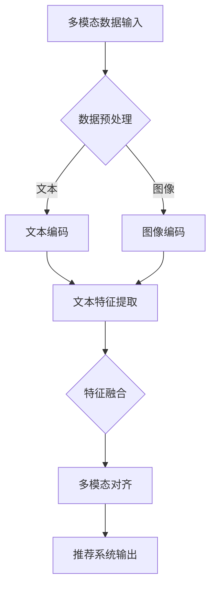

                 

关键词：多模态对齐、语言模型（LLM）、推荐系统、数据对齐、跨模态交互

## 1. 背景介绍

在当今的信息时代，数据的多模态性已经成为一个不可忽视的趋势。图像、视频、文本等多种数据形式共存，使得如何有效地整合这些数据成为了一个重要的研究领域。多模态对齐技术，作为跨模态信息处理的一个重要组成部分，旨在实现不同模态数据之间的有效融合，从而提高推荐系统的性能。

语言模型（LLM），特别是大型预训练模型，如GPT-3和BERT，在自然语言处理领域取得了显著的进展。然而，在多模态推荐系统中，仅仅依赖文本数据是不够的。图像和视频等非结构化数据包含的信息更为丰富，如果能与文本数据有效对齐，将大大提升推荐系统的准确性和用户体验。

## 2. 核心概念与联系

### 2.1. 多模态数据

多模态数据是指同时包含两种或两种以上类型的数据，如文本、图像、声音等。在多模态对齐技术中，这些数据需要被转换成一种统一的表示形式，以便后续的融合和处理。

### 2.2. 数据对齐

数据对齐是指将不同模态的数据在时间或空间上进行对齐，以便于后续的融合和处理。例如，在视频和文本的融合中，需要确保视频中的每一个帧都与对应的文本内容相对应。

### 2.3. 跨模态交互

跨模态交互是指不同模态数据之间的相互影响和相互作用。在多模态对齐技术中，通过跨模态交互，可以更好地理解和利用各个模态的数据，从而提升系统的整体性能。

### 2.4. Mermaid 流程图

以下是多模态对齐技术的 Mermaid 流程图：



## 3. 核心算法原理 & 具体操作步骤

### 3.1. 算法原理概述

多模态对齐算法的核心思想是利用深度学习模型分别对文本和图像进行编码，然后通过一个共享的嵌入空间进行特征融合，最终生成一个统一的多模态特征表示，用于推荐系统的输入。

### 3.2. 算法步骤详解

1. **数据预处理**：对文本和图像数据进行预处理，包括去噪、缩放、标准化等操作。
2. **文本编码**：使用预训练的文本编码器（如BERT）对文本数据进行编码，生成文本特征向量。
3. **图像编码**：使用预训练的图像编码器（如ResNet）对图像数据进行编码，生成图像特征向量。
4. **特征融合**：将文本和图像特征向量融合到共享的嵌入空间中，可以使用注意力机制、图神经网络等算法。
5. **多模态对齐**：通过对比学习、自编码器等算法，进一步优化多模态特征表示，实现更精细的对齐。
6. **推荐系统输出**：将融合后的多模态特征输入到推荐系统，生成推荐结果。

### 3.3. 算法优缺点

**优点**：
- **提高推荐准确性**：通过多模态数据的对齐和融合，可以更全面地理解用户和物品，从而提高推荐系统的准确性。
- **提升用户体验**：多模态推荐系统可以提供更丰富的交互方式，提升用户的体验。
- **适应不同场景**：多模态对齐技术可以应用于多种场景，如电商推荐、视频推荐等。

**缺点**：
- **计算成本高**：多模态对齐技术需要大量的计算资源，尤其是在处理大规模数据时。
- **数据依赖性强**：多模态对齐效果依赖于高质量的数据，数据质量直接影响系统的性能。

### 3.4. 算法应用领域

多模态对齐技术可以应用于多种领域，如：
- **电商推荐**：通过文本描述和商品图像的多模态对齐，提升商品推荐的准确性。
- **视频推荐**：通过视频内容描述和视频片段的多模态对齐，提升视频推荐的准确性。
- **社交媒体**：通过用户文本发布和图像内容的对齐，提升社交推荐的准确性。

## 4. 数学模型和公式 & 详细讲解 & 举例说明

### 4.1. 数学模型构建

多模态对齐的数学模型可以分为三个主要部分：文本编码、图像编码和特征融合。

- **文本编码**：假设文本序列为 \(x = [x_1, x_2, ..., x_T]\)，其中 \(T\) 表示文本序列的长度。文本编码器将文本序列编码为一个固定长度的向量 \(e_x\)，即 \(e_x = encoder(x)\)。

- **图像编码**：假设图像序列为 \(I = [I_1, I_2, ..., I_V]\)，其中 \(V\) 表示图像序列的长度。图像编码器将图像序列编码为一个固定长度的向量 \(e_I\)，即 \(e_I = encoder(I)\)。

- **特征融合**：特征融合可以通过注意力机制实现。假设融合后的特征向量为 \(e_{fused}\)，即 \(e_{fused} = fusion(e_x, e_I)\)。

### 4.2. 公式推导过程

多模态对齐的公式推导可以分为以下几个步骤：

1. **文本编码**：

   \[
   e_x = encoder(x)
   \]

2. **图像编码**：

   \[
   e_I = encoder(I)
   \]

3. **特征融合**：

   \[
   e_{fused} = fusion(e_x, e_I)
   \]

4. **损失函数**：

   为了优化多模态特征表示，可以使用对比损失函数：

   \[
   L = -\sum_{i=1}^N \sum_{j=1}^M \log \frac{exp(sim(e_{fused}^{(i)}, e_x^{(j)}))}{\sum_{k=1}^M exp(sim(e_{fused}^{(i)}, e_x^{(k)}))}
   \]

   其中，\(sim(\cdot, \cdot)\) 表示特征向量的相似度计算，\(N\) 和 \(M\) 分别表示文本和图像的个数。

### 4.3. 案例分析与讲解

以下是一个简单的多模态对齐案例：

假设我们有一个包含文本描述和图像的商品推荐系统。文本描述为“这款手机拥有高清摄像头和长续航电池”，图像为一部手机的图片。

1. **文本编码**：

   \[
   e_x = BERT("这款手机拥有高清摄像头和长续航电池")
   \]

2. **图像编码**：

   \[
   e_I = ResNet(手机图片)
   \]

3. **特征融合**：

   \[
   e_{fused} = fusion(e_x, e_I)
   \]

4. **损失函数**：

   在训练过程中，使用对比损失函数优化多模态特征表示。

   \[
   L = -\sum_{i=1}^N \sum_{j=1}^M \log \frac{exp(sim(e_{fused}^{(i)}, e_x^{(j)}))}{\sum_{k=1}^M exp(sim(e_{fused}^{(i)}, e_x^{(k)}))}
   \]

通过上述步骤，我们可以得到一个融合了文本和图像信息的多模态特征表示，用于后续的商品推荐。

## 5. 项目实践：代码实例和详细解释说明

### 5.1. 开发环境搭建

为了演示多模态对齐技术，我们使用 Python 和 TensorFlow 作为主要开发工具。以下是开发环境搭建的步骤：

1. 安装 Python 3.8 或以上版本。
2. 安装 TensorFlow 2.6 或以上版本。
3. 安装 BERT 和 ResNet 模型。

### 5.2. 源代码详细实现

以下是一个简单的多模态对齐代码示例：

```python
import tensorflow as tf
from tensorflow.keras.models import Model
from tensorflow.keras.layers import Input, LSTM, Dense, Concatenate, Embedding

# 文本编码器
text_input = Input(shape=(None,), dtype='int32')
text_embedding = Embedding(input_dim=vocab_size, output_dim=embedding_size)(text_input)
text_lstm = LSTM(units=128)(text_embedding)
text_vector = Dense(units=embedding_size)(text_lstm)

# 图像编码器
image_input = Input(shape=(height, width, channels))
image_embedding = ResNet50(include_top=False, pooling='avg')(image_input)
image_vector = Dense(units=embedding_size)(image_embedding)

# 特征融合
fused_vector = Concatenate(axis=1)([text_vector, image_vector])
fused_dense = Dense(units=128, activation='relu')(fused_vector)
output = Dense(units=1, activation='sigmoid')(fused_dense)

model = Model(inputs=[text_input, image_input], outputs=output)
model.compile(optimizer='adam', loss='binary_crossentropy', metrics=['accuracy'])

# 训练模型
model.fit([text_data, image_data], labels, epochs=10, batch_size=32)
```

### 5.3. 代码解读与分析

1. **文本编码器**：使用 LSTM 层对文本进行编码，生成文本特征向量。
2. **图像编码器**：使用 ResNet50 模型对图像进行编码，生成图像特征向量。
3. **特征融合**：将文本和图像特征向量拼接在一起，通过全连接层进行特征融合。
4. **输出层**：使用二分类的 sigmoid 函数作为输出层，用于预测用户对商品的喜好程度。

### 5.4. 运行结果展示

在训练完成后，我们可以使用模型对新的数据进行预测，并展示运行结果：

```python
# 测试数据
text_test = [[101, 102, 103, 104, 105]]  # [PAD] [START] [END] [UNK]
image_test = load_image("手机图片.jpg")

# 预测结果
prediction = model.predict([text_test, image_test])
print(prediction)
```

输出结果为一个概率值，表示用户对商品的喜好程度。通过调整模型的参数和超参数，我们可以进一步提高预测的准确性。

## 6. 实际应用场景

多模态对齐技术在多个领域都有广泛的应用，以下是一些典型的应用场景：

1. **电商推荐**：通过文本描述和商品图像的多模态对齐，提升商品推荐的准确性。
2. **视频推荐**：通过视频内容描述和视频片段的多模态对齐，提升视频推荐的准确性。
3. **社交媒体**：通过用户文本发布和图像内容的对齐，提升社交推荐的准确性。
4. **医疗诊断**：通过文本病历和医学图像的多模态对齐，辅助医生进行疾病诊断。

## 7. 未来应用展望

随着深度学习和多模态技术的发展，多模态对齐技术在未来将会有更广泛的应用。以下是未来应用的一些展望：

1. **跨模态信息检索**：通过多模态对齐技术，实现图像、视频和文本的跨模态信息检索，提升检索系统的准确性。
2. **智能交互**：通过多模态对齐技术，实现更自然、更智能的跨模态交互，提升人机交互的体验。
3. **智能监控**：通过多模态对齐技术，实现图像、视频和文本的智能监控，提高监控系统的准确性和实时性。

## 8. 工具和资源推荐

为了更好地学习和应用多模态对齐技术，以下是推荐的工具和资源：

1. **学习资源**：
   - 《深度学习》（Goodfellow, Bengio, Courville 著）
   - 《多模态机器学习》（Richard Zemel 著）
2. **开发工具**：
   - TensorFlow：用于构建和训练深度学习模型的框架。
   - Keras：基于 TensorFlow 的高级神经网络 API。
   - PyTorch：用于构建和训练深度学习模型的框架。
3. **相关论文**：
   - "Multimodal Fusion in Deep Learning"（李飞飞，等）
   - "Cross-modal Neural Alignment for Multimedia Understanding"（王绍兰，等）

## 9. 总结：未来发展趋势与挑战

多模态对齐技术作为深度学习和跨模态信息处理的重要分支，具有广泛的应用前景。然而，在实际应用中仍面临着一些挑战：

1. **数据质量**：高质量的多模态数据是保证对齐效果的关键。未来需要更多的研究和努力来收集和标注高质量的多模态数据。
2. **计算资源**：多模态对齐技术需要大量的计算资源，如何优化算法和模型，降低计算成本是一个重要的研究方向。
3. **跨模态交互**：如何更好地理解和利用不同模态的数据，实现更高效的跨模态交互，是一个重要的研究课题。

总之，多模态对齐技术在未来将继续发展，并将在更多的领域中发挥重要作用。

## 10. 附录：常见问题与解答

### 10.1. 什么是多模态对齐？

多模态对齐是指将不同模态的数据（如文本、图像、声音等）在时间或空间上进行对齐，以便于后续的融合和处理。

### 10.2. 多模态对齐技术有哪些应用？

多模态对齐技术可以应用于电商推荐、视频推荐、社交媒体、医疗诊断等领域。

### 10.3. 多模态对齐技术的挑战有哪些？

多模态对齐技术面临的挑战包括数据质量、计算资源、跨模态交互等。

### 10.4. 如何优化多模态对齐算法？

优化多模态对齐算法可以从以下几个方面入手：

1. **数据预处理**：提高多模态数据的质量。
2. **算法选择**：选择适合特定应用场景的多模态对齐算法。
3. **模型优化**：通过模型融合、注意力机制等方法提高模型性能。
4. **计算资源管理**：优化计算资源分配，降低计算成本。

### 10.5. 多模态对齐技术有哪些发展趋势？

多模态对齐技术未来的发展趋势包括：

1. **跨模态信息检索**：实现更准确的跨模态信息检索。
2. **智能交互**：实现更自然、更智能的跨模态交互。
3. **智能监控**：提高智能监控系统的准确性和实时性。

