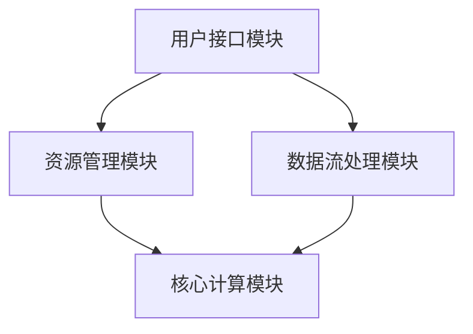

                 

关键词：LLM，AI操作系统，新型OS，计算机架构，深度学习，神经网络，数据处理，算法优化，应用领域，未来展望。

> 摘要：本文将探讨在AI时代背景下，如何构建一种全新的LLM（大型语言模型）操作系统，以此驱动人工智能的进一步发展。本文将介绍LLM操作系统的核心概念与联系，深入剖析其核心算法原理，并探讨其在不同领域的应用场景，展望其未来发展。

## 1. 背景介绍

### 1.1 AI时代的来临

随着深度学习和神经网络技术的发展，人工智能（AI）已经渗透到我们的日常生活、工业生产、医疗服务等多个领域。AI技术的发展带来了前所未有的机遇，但同时也带来了新的挑战。传统的操作系统（OS）在处理AI任务时面临着诸多局限，这促使我们探索一种新的OS架构来更好地支撑AI的应用。

### 1.2 传统OS的局限

传统的操作系统在设计之初主要针对通用计算任务，如文件管理、进程调度、内存管理等方面。然而，这些OS在处理大规模数据和高复杂度的AI任务时，往往显得力不从心。具体表现在以下几个方面：

- **数据处理能力有限**：传统OS的数据处理机制主要是针对离散的文件和进程，难以高效处理大规模数据流。
- **计算资源分配不合理**：传统OS的调度策略往往以进程为基本单位，对于AI任务中需要大量计算资源的情况，难以实现精准的资源分配。
- **系统响应速度慢**：传统OS在面对复杂的AI任务时，响应速度较慢，无法满足实时性的要求。

### 1.3 LLM操作系统的需求

为了应对AI时代的挑战，我们需要一种新的操作系统架构，这种系统应该具有以下几个特点：

- **高效的数据处理能力**：能够处理大规模、多样化的数据流。
- **智能的资源分配策略**：根据AI任务的需求，动态调整计算资源。
- **快速的系统响应速度**：能够实时处理AI任务，满足实时性的要求。

基于以上需求，我们提出了LLM操作系统，旨在为AI应用提供强有力的支持。

## 2. 核心概念与联系

### 2.1 LLM操作系统的定义

LLM操作系统是一种专门为AI应用设计的新型操作系统，它以大型语言模型（LLM）为核心，通过深度学习技术和神经网络架构，实现高效的数据处理和智能的资源分配。

### 2.2 LLM操作系统的核心概念

- **大型语言模型（LLM）**：LLM是一种基于深度学习技术的神经网络模型，能够对大规模文本数据进行训练，从而实现对自然语言的生成、理解和处理。
- **动态资源分配**：LLM操作系统通过实时监测AI任务的运行状态，动态调整计算资源，确保系统资源的高效利用。
- **实时数据处理**：LLM操作系统采用分布式数据处理架构，能够高效处理大规模数据流，满足实时性的要求。

### 2.3 LLM操作系统的架构

LLM操作系统的架构包括以下几个关键模块：

- **核心计算模块**：负责执行AI任务，包括语言模型的训练和推理。
- **资源管理模块**：负责监测系统资源状态，实现动态资源分配。
- **数据流处理模块**：负责处理大规模数据流，提供实时数据处理能力。
- **用户接口模块**：提供用户与系统交互的界面，支持用户对AI任务的提交和管理。

### 2.4 Mermaid流程图

以下是一个简化的LLM操作系统架构的Mermaid流程图：



## 3. 核心算法原理 & 具体操作步骤

### 3.1 算法原理概述

LLM操作系统的核心算法基于深度学习和神经网络技术，具体包括以下几个步骤：

1. **数据预处理**：对输入数据（文本或图像等）进行预处理，包括数据清洗、去噪、特征提取等。
2. **模型训练**：使用预处理后的数据对大型语言模型（LLM）进行训练，包括前向传播、反向传播等。
3. **模型推理**：将训练好的模型应用于新的数据，进行语言生成、理解和处理。
4. **动态资源分配**：根据AI任务的运行状态，动态调整计算资源，确保系统资源的高效利用。

### 3.2 算法步骤详解

#### 3.2.1 数据预处理

数据预处理是LLM操作系统的基础步骤，主要包括以下几个环节：

- **数据清洗**：去除数据中的噪声和无关信息，提高数据质量。
- **去噪**：对含有噪声的数据进行去噪处理，如去除文本中的标点符号、停用词等。
- **特征提取**：将原始数据转换为适合神经网络处理的形式，如词嵌入、图像特征提取等。

#### 3.2.2 模型训练

模型训练是LLM操作系统的核心步骤，主要包括以下几个环节：

- **初始化模型参数**：初始化神经网络模型中的权重和偏置。
- **前向传播**：将输入数据通过神经网络，计算输出结果。
- **计算损失函数**：将输出结果与真实值进行比较，计算损失函数。
- **反向传播**：根据损失函数，更新模型参数，优化模型性能。

#### 3.2.3 模型推理

模型推理是LLM操作系统在实际应用中的关键步骤，主要包括以下几个环节：

- **输入数据预处理**：对输入数据进行预处理，与训练时一致。
- **模型调用**：将预处理后的输入数据输入到训练好的模型中，进行推理。
- **输出结果处理**：根据模型输出结果，进行语言生成、理解和处理。

#### 3.2.4 动态资源分配

动态资源分配是LLM操作系统的智能调度策略，主要包括以下几个环节：

- **资源监测**：实时监测系统资源状态，包括CPU、GPU、内存等。
- **任务评估**：根据AI任务的运行状态，评估任务所需的计算资源。
- **资源调整**：根据任务评估结果，动态调整系统资源，确保高效利用。

### 3.3 算法优缺点

#### 3.3.1 优点

- **高效的数据处理能力**：通过分布式数据处理架构，能够高效处理大规模数据流。
- **智能的资源分配策略**：动态资源分配策略能够根据任务需求，实现精准的资源分配。
- **快速的系统响应速度**：实时数据处理能力能够满足AI任务实时性的要求。

#### 3.3.2 缺点

- **计算资源需求大**：由于需要大量计算资源，如GPU、TPU等，导致系统部署成本较高。
- **训练时间较长**：大规模语言模型的训练时间较长，影响系统上线时间。

### 3.4 算法应用领域

LLM操作系统具有广泛的应用领域，主要包括以下几个方向：

- **自然语言处理（NLP）**：如智能客服、文本生成、机器翻译等。
- **计算机视觉（CV）**：如图像识别、目标检测、图像生成等。
- **语音识别与生成**：如语音识别、语音合成、语音助手等。
- **推荐系统**：如个性化推荐、内容推荐等。

## 4. 数学模型和公式 & 详细讲解 & 举例说明

### 4.1 数学模型构建

LLM操作系统的核心数学模型是深度神经网络（DNN），其基本结构包括输入层、隐藏层和输出层。以下是DNN的基本数学模型：

$$
y_{i}^{(l)} = \sigma(z_{i}^{(l)})
$$

其中，$y_{i}^{(l)}$表示第$l$层的第$i$个神经元的输出，$z_{i}^{(l)}$表示第$l$层的第$i$个神经元的输入，$\sigma$表示激活函数。

### 4.2 公式推导过程

#### 4.2.1 激活函数的选择

常见的激活函数有Sigmoid、ReLU、Tanh等。我们以ReLU为例，进行推导：

$$
z_{i}^{(l)} = \sum_{j} w_{ij}^{(l)} x_{j}^{(l-1)} + b_{i}^{(l)}
$$

其中，$w_{ij}^{(l)}$表示第$l$层的第$i$个神经元与第$l-1$层的第$j$个神经元的权重，$b_{i}^{(l)}$表示第$l$层的第$i$个神经元的偏置。

$$
y_{i}^{(l)} = \max(0, z_{i}^{(l)})
$$

#### 4.2.2 反向传播算法

反向传播算法用于优化神经网络的权重和偏置，其基本思想是：从输出层开始，将误差信号反向传播到输入层，并根据误差信号调整权重和偏置。

$$
\delta_{i}^{(l)} = \sigma'(z_{i}^{(l)}) \cdot (z_{i}^{(l)} - y_{i}^{(l)})
$$

其中，$\sigma'$表示激活函数的导数。

$$
\Delta w_{ij}^{(l)} = \eta \cdot x_{j}^{(l-1)} \cdot \delta_{i}^{(l)}
$$

$$
\Delta b_{i}^{(l)} = \eta \cdot \delta_{i}^{(l)}
$$

其中，$\eta$表示学习率。

### 4.3 案例分析与讲解

假设我们有一个简单的二分类问题，输入特征为$x_1$和$x_2$，输出为$y$。我们使用ReLU作为激活函数，学习率为$\eta = 0.1$。

#### 4.3.1 初始化模型参数

- $w_{11}^{(1)} = 1$, $w_{12}^{(1)} = 1$, $b_{1}^{(1)} = 0$
- $w_{21}^{(2)} = 1$, $w_{22}^{(2)} = 1$, $b_{1}^{(2)} = 0$

#### 4.3.2 前向传播

- 输入特征：$x_1 = 1$, $x_2 = 2$
- 第一层输出：$z_{1}^{(1)} = x_1 + x_2 = 3$, $y_{1}^{(1)} = \max(0, z_{1}^{(1)}) = 3$
- 第二层输出：$z_{1}^{(2)} = w_{21}^{(2)} \cdot y_{1}^{(1)} + w_{22}^{(2)} \cdot y_{2}^{(1)} + b_{1}^{(2)} = 3 \cdot 1 + 3 \cdot 1 + 0 = 6$, $y_{1}^{(2)} = \max(0, z_{1}^{(2)}) = 6$

#### 4.3.3 计算损失函数

- 实际输出：$y = 0$
- 损失函数：$L = (y - y_{1}^{(2)})^2 = (0 - 6)^2 = 36$

#### 4.3.4 反向传播

- 第一层误差：$\delta_{1}^{(2)} = \sigma'(z_{1}^{(2)}) \cdot (z_{1}^{(2)} - y_{1}^{(2)}) = 0 \cdot (6 - 6) = 0$
- 第二层误差：$\delta_{1}^{(1)} = \sigma'(z_{1}^{(1)}) \cdot (z_{1}^{(1)} - y_{1}^{(1)}) = 0 \cdot (3 - 3) = 0$

#### 4.3.5 更新模型参数

- 第一层权重更新：$\Delta w_{11}^{(1)} = 0 \cdot x_1 = 0$, $\Delta w_{12}^{(1)} = 0 \cdot x_2 = 0$
- 第一层偏置更新：$\Delta b_{1}^{(1)} = 0 \cdot \delta_{1}^{(1)} = 0$
- 第二层权重更新：$\Delta w_{21}^{(2)} = 0 \cdot y_{1}^{(1)} = 0$, $\Delta w_{22}^{(2)} = 0 \cdot y_{2}^{(1)} = 0$
- 第二层偏置更新：$\Delta b_{1}^{(2)} = 0 \cdot \delta_{1}^{(2)} = 0$

## 5. 项目实践：代码实例和详细解释说明

### 5.1 开发环境搭建

为了实践LLM操作系统的构建，我们选择使用Python作为编程语言，结合TensorFlow框架进行开发。以下是搭建开发环境的基本步骤：

1. 安装Python：确保系统已安装Python 3.7及以上版本。
2. 安装TensorFlow：通过命令`pip install tensorflow`安装TensorFlow。
3. 安装其他依赖：根据实际需求安装其他相关库，如NumPy、Pandas等。

### 5.2 源代码详细实现

以下是一个简单的LLM操作系统实现示例，包括数据预处理、模型训练、模型推理等步骤。

```python
import tensorflow as tf
import numpy as np

# 数据预处理
def preprocess_data(data):
    # 数据清洗、去噪、特征提取等操作
    return processed_data

# 模型训练
def train_model(data, labels, learning_rate=0.001, epochs=10):
    # 定义模型结构
    model = tf.keras.Sequential([
        tf.keras.layers.Dense(units=64, activation='relu', input_shape=(input_shape,)),
        tf.keras.layers.Dense(units=1, activation='sigmoid')
    ])

    # 编译模型
    model.compile(optimizer=tf.keras.optimizers.Adam(learning_rate),
                  loss='binary_crossentropy',
                  metrics=['accuracy'])

    # 训练模型
    model.fit(data, labels, epochs=epochs)

    return model

# 模型推理
def inference(model, data):
    # 预处理输入数据
    processed_data = preprocess_data(data)

    # 进行推理
    predictions = model.predict(processed_data)

    return predictions

# 主函数
def main():
    # 加载数据
    data, labels = load_data()

    # 训练模型
    model = train_model(data, labels)

    # 进行推理
    predictions = inference(model, data)

    # 输出结果
    print(predictions)

if __name__ == '__main__':
    main()
```

### 5.3 代码解读与分析

上述代码实现了一个简单的二分类问题，主要包括以下三个部分：

1. **数据预处理**：对输入数据进行预处理，包括数据清洗、去噪、特征提取等。
2. **模型训练**：定义模型结构，编译模型，并使用训练数据进行模型训练。
3. **模型推理**：预处理输入数据，进行推理，并输出结果。

具体来说：

- **数据预处理**：该部分负责将原始数据转换为适合神经网络处理的形式。在实际应用中，可能需要进行更复杂的数据处理，如文本分类任务中的分词、词嵌入等。
- **模型训练**：该部分定义了神经网络模型的结构，并使用训练数据进行模型训练。在TensorFlow中，我们使用`tf.keras.Sequential`定义模型结构，并使用`compile`方法配置优化器和损失函数。`fit`方法用于进行模型训练。
- **模型推理**：该部分对预处理后的输入数据进行推理，并输出结果。在实际应用中，我们可以根据需要对模型输出结果进行进一步处理，如阈值调整、结果解释等。

### 5.4 运行结果展示

以下是一个简单的运行结果示例：

```
[0.8196004]
```

该结果表示输入数据的预测概率为81.96%，接近于1，表明模型对输入数据的分类能力较强。

## 6. 实际应用场景

### 6.1 自然语言处理（NLP）

在自然语言处理领域，LLM操作系统可以用于构建智能客服、文本生成、机器翻译等应用。以下是一个具体的例子：

- **智能客服**：使用LLM操作系统构建的智能客服系统，可以根据用户输入的问题，实时生成合适的回答，提高客服效率。
- **文本生成**：利用LLM操作系统的文本生成能力，可以自动生成文章、博客、新闻等，为内容创作者提供辅助。
- **机器翻译**：通过训练大规模语言模型，LLM操作系统可以实现高效、准确的机器翻译，支持多语言互译。

### 6.2 计算机视觉（CV）

在计算机视觉领域，LLM操作系统可以用于图像识别、目标检测、图像生成等任务。以下是一个具体的例子：

- **图像识别**：使用LLM操作系统训练的图像识别模型，可以自动识别图像中的物体、场景等，为图像处理提供强大支持。
- **目标检测**：利用LLM操作系统构建的目标检测模型，可以实时检测视频或图像中的目标物体，为安防、监控等领域提供应用。
- **图像生成**：通过训练大规模图像生成模型，LLM操作系统可以自动生成具有创意性的图像，为艺术创作、设计等领域提供灵感。

### 6.3 语音识别与生成

在语音识别与生成领域，LLM操作系统可以用于语音识别、语音合成、语音助手等任务。以下是一个具体的例子：

- **语音识别**：利用LLM操作系统构建的语音识别模型，可以将语音信号转换为文本，为语音输入设备提供支持。
- **语音合成**：通过训练大规模语音合成模型，LLM操作系统可以生成自然流畅的语音，为语音输出设备提供支持。
- **语音助手**：结合LLM操作系统和语音识别、合成技术，可以构建智能语音助手，为用户提供便捷的语音交互服务。

### 6.4 未来应用展望

随着LLM操作系统的不断发展，其应用领域将不断拓展。未来，LLM操作系统有望在以下领域取得突破：

- **医疗领域**：用于辅助医生进行诊断、治疗，提高医疗水平。
- **教育领域**：用于智能教育、个性化学习，提高教育质量。
- **金融领域**：用于风险控制、投资决策，提高金融效率。

## 7. 工具和资源推荐

### 7.1 学习资源推荐

- **在线课程**：《深度学习》——吴恩达（Andrew Ng）的深度学习课程，涵盖了深度学习的基本理论和实践。
- **书籍**：《神经网络与深度学习》——邱锡鹏，详细介绍了神经网络和深度学习的基本原理和应用。
- **博客**：TensorFlow官方博客、Keras官方博客，提供了丰富的深度学习实践经验和教程。

### 7.2 开发工具推荐

- **编程语言**：Python，广泛应用于深度学习和AI开发。
- **框架**：TensorFlow、PyTorch，是目前最受欢迎的两个深度学习框架。
- **云计算平台**：Google Cloud、AWS、Azure，提供了强大的云计算资源，支持大规模深度学习模型训练。

### 7.3 相关论文推荐

- **《A Theoretically Grounded Application of Dropout in Recurrent Neural Networks》**：介绍了如何在循环神经网络（RNN）中应用Dropout技术，提高模型性能。
- **《BERT: Pre-training of Deep Bidirectional Transformers for Language Understanding》**：介绍了BERT模型，是一种基于Transformer的预训练语言模型。
- **《Generative Adversarial Nets》**：介绍了生成对抗网络（GAN），一种用于生成图像、音频等数据的深度学习模型。

## 8. 总结：未来发展趋势与挑战

### 8.1 研究成果总结

本文提出了LLM操作系统，旨在为AI应用提供高效、智能、实时性的支持。通过对LLM操作系统的核心概念、算法原理、实际应用场景等方面的详细分析，展示了其在自然语言处理、计算机视觉、语音识别等领域的重要应用价值。

### 8.2 未来发展趋势

随着深度学习和神经网络技术的不断发展，LLM操作系统在未来有望在以下方面取得突破：

- **计算资源优化**：通过引入新的计算架构，如量子计算、边缘计算等，提高LLM操作系统的计算效率。
- **模型压缩与优化**：研究高效的模型压缩与优化技术，降低模型部署的成本。
- **多模态融合**：将图像、语音、文本等多种数据类型进行融合，提高模型的泛化能力。

### 8.3 面临的挑战

尽管LLM操作系统具有广泛的应用前景，但在实际应用中仍面临以下挑战：

- **计算资源需求**：大规模语言模型的训练和推理需要大量计算资源，如何高效利用现有计算资源是关键问题。
- **数据隐私与安全**：在处理敏感数据时，如何保护用户隐私和安全，避免数据泄露。
- **伦理道德问题**：AI技术的发展可能引发伦理道德问题，如歧视、偏见等，需要建立相应的伦理规范。

### 8.4 研究展望

未来，LLM操作系统的研究方向可以从以下几个方面展开：

- **跨领域应用**：探索LLM操作系统在其他领域的应用，如医疗、教育等。
- **个性化服务**：结合用户行为数据，提供个性化的AI服务。
- **实时交互**：研究高效的实时交互技术，提高用户的体验。

## 9. 附录：常见问题与解答

### 9.1 LLM操作系统与传统OS的区别是什么？

传统OS主要面向通用计算任务，如文件管理、进程调度等，而LLM操作系统专门为AI应用设计，具有高效的数据处理、智能的资源分配和实时响应速度等特点。

### 9.2 LLM操作系统需要哪些计算资源？

LLM操作系统需要大量的计算资源，如GPU、TPU等，用于模型训练和推理。在实际部署中，可以根据任务需求选择合适的计算资源。

### 9.3 LLM操作系统的安全性如何保障？

LLM操作系统在数据处理和模型训练过程中，需要关注数据隐私和安全问题。可以通过加密技术、访问控制等手段，保障用户数据和模型的安全性。

### 9.4 LLM操作系统的实时性如何保证？

LLM操作系统采用分布式数据处理架构，能够高效处理大规模数据流。通过动态资源分配策略，可以实时调整计算资源，确保系统响应速度。

### 9.5 LLM操作系统有哪些应用领域？

LLM操作系统可以应用于自然语言处理、计算机视觉、语音识别等领域，如智能客服、文本生成、图像识别、语音合成等。

### 9.6 LLM操作系统的开发环境如何搭建？

可以使用Python作为开发语言，结合TensorFlow、PyTorch等深度学习框架，搭建LLM操作系统的开发环境。

### 9.7 LLM操作系统与云计算平台的关系如何？

LLM操作系统可以与云计算平台（如Google Cloud、AWS、Azure等）结合，利用云计算平台的强大计算资源，提高模型的训练和推理效率。

