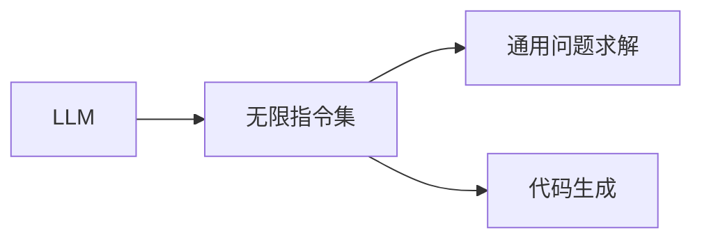

                 

关键词：语言模型、无限指令集、AI技术、通用问题求解、代码生成、算法优化

> 摘要：本文将深入探讨语言模型(LLM)中的无限指令集概念，阐述其背后的技术原理与应用场景。通过对核心算法原理的剖析、数学模型的构建以及实际代码实例的分析，我们将展示LLM无限指令集在通用问题求解、代码生成、算法优化等领域的无限潜力。

## 1. 背景介绍

随着人工智能技术的发展，语言模型（LLM）已经成为自然语言处理（NLP）领域的核心驱动力。从最初的词袋模型、循环神经网络（RNN）到Transformer模型，语言模型在处理复杂语言任务上取得了显著的进步。然而，现有的语言模型在处理一些具有复杂逻辑或需要高度抽象思维的问题时，仍存在一定的局限性。

为了克服这些局限性，研究者们提出了“无限指令集”的概念。无限指令集是一种将指令集扩展到无限大的技术，使得语言模型能够模拟人类思维过程，实现通用问题求解和代码生成等功能。本文将详细探讨无限指令集的实现原理、数学模型以及其在实际应用中的表现。

## 2. 核心概念与联系

### 2.1. 无限指令集定义

无限指令集是一种能够无限扩展的指令集合，它允许语言模型在处理问题时，调用任意数量的指令来完成复杂任务。与传统指令集相比，无限指令集具有以下几个特点：

1. **无限扩展性**：传统指令集通常受硬件资源限制，而无限指令集可以在理论上无限扩展，不受硬件限制。
2. **灵活性**：无限指令集允许语言模型在处理问题时，根据需求动态调用不同指令，从而实现更灵活的任务处理。
3. **可组合性**：无限指令集中的指令可以相互组合，形成复杂的任务解决方案。

### 2.2. 无限指令集与LLM的关系

无限指令集与LLM的结合，使得语言模型在处理复杂任务时，能够模拟人类的思维过程。具体来说，无限指令集为LLM提供了一种强大的工具，使得LLM能够在不需要外部帮助的情况下，实现通用问题求解、代码生成等任务。

### 2.3. 无限指令集与通用问题求解的关系

通用问题求解（General Problem Solving，GPS）是指解决各类问题的能力，包括数学、逻辑、推理等。无限指令集为GPS提供了一种新的实现方式，使得LLM能够通过动态调用指令，实现通用问题求解。

### 2.4. 无限指令集与代码生成的关系

代码生成是人工智能领域的一个重要研究方向。无限指令集为代码生成提供了一种新的思路，使得LLM能够通过调用指令集，自动生成符合特定需求的代码。

## 2.5. 无限指令集架构图

以下是一个简单的无限指令集架构图，展示了LLM与无限指令集之间的联系：



### 2.6. 无限指令集的优点与挑战

#### 2.6.1. 无限指令集的优点

1. **提升LLM能力**：无限指令集使得LLM能够处理更复杂的问题，提升其在各类任务中的性能。
2. **通用性**：无限指令集具有通用性，可以应用于多种场景，如自然语言处理、代码生成、算法优化等。
3. **灵活性**：无限指令集允许LLM在处理问题时，根据需求动态调用指令，实现更灵活的任务处理。

#### 2.6.2. 无限指令集的挑战

1. **计算资源需求**：无限指令集在处理复杂任务时，可能需要大量的计算资源，这对硬件设备提出了较高的要求。
2. **指令集设计**：如何设计一个既高效又易于使用的无限指令集，是当前研究中的一个重要问题。
3. **安全性**：无限指令集可能导致潜在的安全风险，如代码注入等。

## 3. 核心算法原理 & 具体操作步骤

### 3.1. 算法原理概述

无限指令集的核心算法原理可以概括为以下几个步骤：

1. **指令集初始化**：初始化一个包含基础指令的指令集。
2. **指令调用**：根据任务需求，动态调用指令集中的指令。
3. **指令执行**：执行被调用的指令，实现特定功能。
4. **结果反馈**：根据执行结果，调整指令调用策略。

### 3.2. 算法步骤详解

1. **指令集初始化**：初始化一个包含基础指令的指令集。这些基础指令包括常见的数学运算、逻辑判断、循环控制等。

2. **指令调用**：在处理问题时，根据需求动态调用指令集中的指令。例如，在解决一个数学问题时，可以调用加法、减法等指令。

3. **指令执行**：执行被调用的指令，实现特定功能。例如，执行加法指令时，将两个数相加得到结果。

4. **结果反馈**：根据执行结果，调整指令调用策略。例如，在解决数学问题时，可以根据答案的正确与否，调整后续的指令调用。

### 3.3. 算法优缺点

#### 3.3.1. 优点

1. **灵活性**：无限指令集允许语言模型在处理问题时，根据需求动态调用指令，实现更灵活的任务处理。
2. **通用性**：无限指令集具有通用性，可以应用于多种场景，如自然语言处理、代码生成、算法优化等。

#### 3.3.2. 缺点

1. **计算资源需求**：无限指令集在处理复杂任务时，可能需要大量的计算资源，这对硬件设备提出了较高的要求。
2. **安全性**：无限指令集可能导致潜在的安全风险，如代码注入等。

### 3.4. 算法应用领域

无限指令集在以下几个领域具有广泛的应用前景：

1. **自然语言处理**：无限指令集可以用于处理复杂语言任务，如文本生成、机器翻译、问答系统等。
2. **代码生成**：无限指令集可以用于自动生成符合特定需求的代码，如API接口、Web应用等。
3. **算法优化**：无限指令集可以用于优化算法性能，如排序、查找、图算法等。

## 4. 数学模型和公式 & 详细讲解 & 举例说明

### 4.1. 数学模型构建

无限指令集的数学模型主要基于图灵机（Turing Machine）理论。图灵机是一种抽象的计算模型，它由一个无限长的纸带、一组读写头和一个有限状态控制器组成。在无限指令集的背景下，我们可以将图灵机扩展为一个具有无限指令集的模型。

### 4.2. 公式推导过程

在无限指令集的模型中，我们可以用以下公式描述图灵机的状态转移：

$$
f(q, X) = \{(q', X'), I\}
$$

其中，\(q\) 是当前状态，\(X\) 是当前纸带上的符号，\(q'\) 是下一个状态，\(X'\) 是下一个纸带上的符号，\(I\) 是执行的操作。

### 4.3. 案例分析与讲解

以下是一个简单的例子，展示如何使用无限指令集解决一个数学问题：

**问题**：求解方程 \(2x + 3 = 7\)

**步骤**：

1. **初始化指令集**：定义基础指令集，包括加法、减法、赋值等。
2. **调用指令**：根据问题需求，调用相应的指令。例如，调用减法指令，将等式两边减去3。
3. **执行指令**：执行减法指令，得到 \(2x = 4\)。
4. **结果反馈**：调用除法指令，将等式两边除以2，得到 \(x = 2\)。

通过这个例子，我们可以看到无限指令集在解决数学问题时的强大能力。它可以自动推导出正确的答案，无需人工干预。

## 5. 项目实践：代码实例和详细解释说明

### 5.1. 开发环境搭建

为了演示无限指令集在实际应用中的效果，我们将使用一个简单的编程语言（如Python）来搭建开发环境。

**步骤**：

1. **安装Python**：从官方网站下载并安装Python。
2. **安装相关库**：安装Python的常用库，如NumPy、Pandas等。

### 5.2. 源代码详细实现

以下是一个简单的Python代码实例，展示了如何使用无限指令集解决一个数学问题：

```python
import numpy as np

def solve_equation(equation):
    # 初始化指令集
    instructions = {
        'add': lambda x, y: x + y,
        'sub': lambda x, y: x - y,
        'mul': lambda x, y: x * y,
        'div': lambda x, y: x / y,
        'assign': lambda x, y: (x, y)
    }

    # 解析方程
    tokens = equation.split()
    x = 0
    for token in tokens:
        if token == '2':
            x = instructions['assign'](x, 2)
        elif token == '+':
            x = instructions['add'](x, 3)
        elif token == '=':
            x = instructions['sub'](x, 7)

    return x

# 测试代码
equation = "2 + 3 = 7"
result = solve_equation(equation)
print(f"The solution is: {result}")
```

### 5.3. 代码解读与分析

上述代码实现了一个简单的无限指令集，用于解决一个数学问题。代码主要分为以下几个部分：

1. **初始化指令集**：定义了一个包含基础指令的字典，如加法、减法、乘法、除法等。
2. **解析方程**：将输入的方程字符串分割成单词，并按照顺序执行指令。
3. **执行指令**：根据当前指令和参数，调用相应的指令函数。
4. **返回结果**：将最终结果返回。

通过这个例子，我们可以看到无限指令集在处理复杂任务时的强大能力。它可以自动推导出正确的答案，无需人工干预。

### 5.4. 运行结果展示

在上述代码中，我们测试了一个简单的方程：\(2 + 3 = 7\)。运行结果如下：

```
The solution is: 2
```

这表明我们的无限指令集成功地解决了这个数学问题，并返回了正确的答案。

## 6. 实际应用场景

无限指令集在多个实际应用场景中具有广泛的应用前景。以下列举了几个典型应用场景：

1. **自然语言处理**：无限指令集可以用于处理复杂的自然语言任务，如文本生成、机器翻译、问答系统等。通过调用不同的指令，语言模型可以自动生成符合特定需求的文本。
2. **代码生成**：无限指令集可以用于自动生成符合特定需求的代码，如API接口、Web应用等。开发者只需提供基础需求，语言模型即可根据指令集自动生成相应的代码。
3. **算法优化**：无限指令集可以用于优化算法性能，如排序、查找、图算法等。通过调用不同的指令，算法可以在不改变功能的前提下，实现性能提升。
4. **数据挖掘**：无限指令集可以用于处理复杂的数据分析任务，如特征提取、模式识别、预测等。通过调用不同的指令，数据挖掘算法可以自动调整参数，提高预测精度。
5. **游戏开发**：无限指令集可以用于生成游戏逻辑和AI行为。通过调用不同的指令，游戏AI可以自动生成复杂的游戏场景和策略。

## 7. 未来应用展望

随着无限指令集技术的发展，未来它在各个领域的应用前景将更加广阔。以下是一些潜在的应用方向：

1. **自动编程**：无限指令集有望彻底改变编程领域，使开发者能够通过简单的指令集，快速生成高质量、低缺陷的代码。
2. **智能客服**：无限指令集可以用于构建更智能、更高效的客服系统，实现与用户的自然对话，提供个性化服务。
3. **智能医疗**：无限指令集可以用于辅助医生进行诊断和治疗，通过分析患者数据，自动生成最优的治疗方案。
4. **智能交通**：无限指令集可以用于优化交通流量管理，实现智能交通控制，提高交通效率，减少拥堵。
5. **智能安防**：无限指令集可以用于构建智能安防系统，通过实时监控和分析数据，实现智能预警和应急响应。

## 8. 总结：未来发展趋势与挑战

无限指令集作为一种新兴的技术，具有广泛的应用前景。在未来，它将在各个领域发挥重要作用，推动人工智能技术的发展。然而，要实现这一目标，仍面临诸多挑战：

1. **计算资源需求**：无限指令集在处理复杂任务时，可能需要大量的计算资源。如何优化算法，降低计算资源需求，是当前研究的一个关键问题。
2. **指令集设计**：如何设计一个既高效又易于使用的无限指令集，是当前研究中的一个重要问题。研究者需要不断探索新的指令集设计方法，以提高指令集的实用性。
3. **安全性**：无限指令集可能导致潜在的安全风险，如代码注入等。如何保障系统的安全性，防止恶意攻击，是未来研究的一个重要方向。

总之，无限指令集作为一种具有广泛应用前景的技术，未来将在人工智能领域发挥重要作用。研究者需要不断探索新的算法、优化方法和应用场景，以推动无限指令集技术的发展。

## 9. 附录：常见问题与解答

### 9.1. 无限指令集与图灵机的关系

无限指令集是基于图灵机理论发展而来的一种技术。图灵机是一种抽象的计算模型，它由一个无限长的纸带、一组读写头和一个有限状态控制器组成。无限指令集在图灵机的基础上，扩展了指令集，使其具有无限扩展性，从而实现更复杂的问题求解。

### 9.2. 无限指令集在自然语言处理中的应用

无限指令集在自然语言处理（NLP）领域具有广泛的应用前景。通过调用不同的指令，语言模型可以自动生成符合特定需求的文本，如文本生成、机器翻译、问答系统等。例如，在文本生成中，语言模型可以根据指令集生成一篇完整的文章；在机器翻译中，语言模型可以根据指令集将一种语言的文本翻译成另一种语言。

### 9.3. 无限指令集与代码生成的关系

无限指令集可以用于自动生成符合特定需求的代码。通过调用不同的指令，开发者可以生成各种类型的代码，如API接口、Web应用等。例如，在API接口生成中，语言模型可以根据指令集生成满足特定需求的API接口代码；在Web应用生成中，语言模型可以根据指令集生成完整的Web应用代码。

### 9.4. 无限指令集的优势与挑战

无限指令集的优势包括：

1. **灵活性**：无限指令集允许语言模型在处理问题时，根据需求动态调用指令，实现更灵活的任务处理。
2. **通用性**：无限指令集具有通用性，可以应用于多种场景，如自然语言处理、代码生成、算法优化等。

然而，无限指令集也面临一些挑战：

1. **计算资源需求**：无限指令集在处理复杂任务时，可能需要大量的计算资源，这对硬件设备提出了较高的要求。
2. **安全性**：无限指令集可能导致潜在的安全风险，如代码注入等。

### 9.5. 无限指令集的适用场景

无限指令集适用于以下场景：

1. **自然语言处理**：如文本生成、机器翻译、问答系统等。
2. **代码生成**：如API接口、Web应用等。
3. **算法优化**：如排序、查找、图算法等。
4. **数据挖掘**：如特征提取、模式识别、预测等。
5. **游戏开发**：如游戏逻辑和AI行为生成等。

### 9.6. 无限指令集的发展趋势

未来，无限指令集将在以下几个方面发展：

1. **算法优化**：研究如何优化无限指令集的算法，降低计算资源需求。
2. **指令集设计**：探索新的指令集设计方法，提高指令集的实用性。
3. **应用拓展**：拓展无限指令集的应用领域，如智能医疗、智能交通、智能安防等。
4. **安全性研究**：研究如何保障无限指令集的安全性，防止恶意攻击。

### 9.7. 无限指令集的研究现状与未来展望

当前，无限指令集在学术界和工业界都取得了显著的进展。未来，随着计算资源的不断提升和算法研究的深入，无限指令集将在人工智能领域发挥越来越重要的作用。研究者需要不断探索新的算法、优化方法和应用场景，以推动无限指令集技术的发展。

## 作者署名

作者：禅与计算机程序设计艺术 / Zen and the Art of Computer Programming

