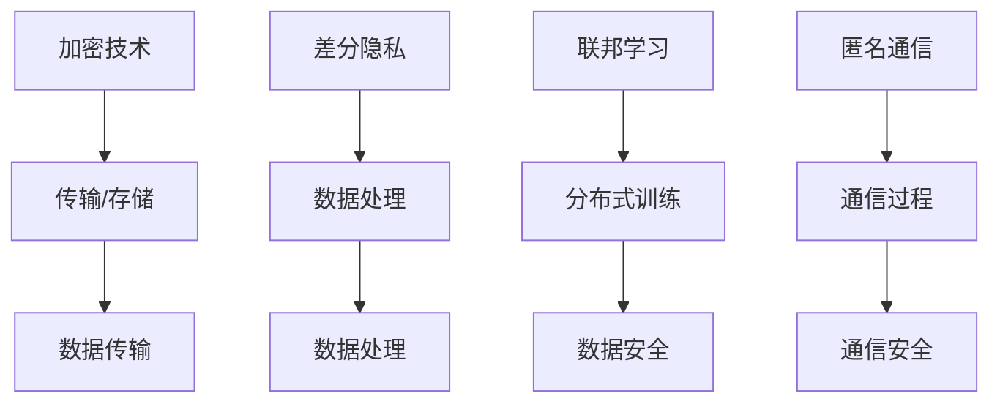

                 

关键词：大型语言模型（LLM）、数据保护、隐私安全、加密技术、差分隐私、联邦学习、匿名通信

## 摘要

随着人工智能技术的发展，大型语言模型（LLM）如GPT-3、ChatGLM等在自然语言处理领域取得了显著成果。然而，LLM在处理海量数据时，数据隐私保护问题日益凸显。本文旨在探讨LLM时代的数据保护问题，分析现有隐私安全技术的优缺点，并提出新型隐私安全技术，为保护数据隐私提供解决方案。

## 1. 背景介绍

### 1.1 大型语言模型的发展

近年来，人工智能领域取得了许多突破性进展，其中大型语言模型（LLM）的发展尤为引人注目。LLM通过学习海量文本数据，可以生成高质量的文本、进行自然语言理解和推理等任务。例如，GPT-3拥有1750亿个参数，可以生成流畅的文本，广泛应用于问答系统、智能客服、机器翻译等领域。

### 1.2 数据隐私保护的重要性

随着数据量的爆炸式增长，数据隐私保护问题愈发突出。在LLM时代，数据隐私保护的重要性主要体现在以下几个方面：

1. 避免数据泄露：大量敏感数据在训练、部署过程中可能面临泄露风险，可能导致用户隐私泄露、商业秘密泄露等严重后果。
2. 避免模型偏差：数据隐私问题可能导致训练数据存在偏差，进而影响模型的性能和公正性。
3. 保障用户权益：在数据驱动的时代，用户数据隐私受到法律保护，企业需要承担数据隐私保护的责任。

### 1.3 隐私安全技术的现状

目前，隐私安全技术主要包括加密技术、差分隐私、联邦学习、匿名通信等。这些技术各有优缺点，适用于不同的应用场景。例如，加密技术可以保护数据在传输和存储过程中的隐私，但无法防止数据在训练过程中被利用；差分隐私可以在保证数据隐私的同时，提高模型性能；联邦学习可以实现数据的分布式训练，降低数据泄露风险。

## 2. 核心概念与联系

### 2.1 隐私安全技术的分类

隐私安全技术主要分为以下几类：

1. **加密技术**：通过加密算法将数据转换成密文，确保数据在传输和存储过程中的隐私。
2. **差分隐私**：在数据处理过程中引入随机噪声，使得攻击者无法通过数据集推断出个别数据的值，从而保护数据隐私。
3. **联邦学习**：通过分布式计算，将训练数据分布在不同的节点上，降低数据泄露风险。
4. **匿名通信**：通过加密和混淆技术，确保通信过程中的隐私。

### 2.2 隐私安全技术的联系与区别

不同隐私安全技术之间存在一定的联系与区别：

1. **联系**：各种隐私安全技术都可以在数据隐私保护方面发挥作用，例如，加密技术可以与差分隐私、联邦学习等技术相结合，提高数据隐私保护效果。
2. **区别**：每种技术都有其特定的应用场景和适用范围。例如，加密技术适用于数据传输和存储过程中的隐私保护，而差分隐私适用于数据处理过程中的隐私保护。

### 2.3 Mermaid 流程图

以下是一个Mermaid流程图，展示了隐私安全技术之间的联系与区别：



## 3. 核心算法原理 & 具体操作步骤

### 3.1 算法原理概述

隐私安全技术包括加密技术、差分隐私、联邦学习、匿名通信等。每种技术都有其特定的算法原理和应用场景。

1. **加密技术**：基于对称加密、非对称加密、哈希函数等算法，将数据转换成密文，确保数据在传输和存储过程中的隐私。
2. **差分隐私**：通过在数据处理过程中引入随机噪声，使得攻击者无法通过数据集推断出个别数据的值，从而保护数据隐私。
3. **联邦学习**：通过分布式计算，将训练数据分布在不同的节点上，降低数据泄露风险。联邦学习包括客户端、服务器和模型训练等环节。
4. **匿名通信**：通过加密和混淆技术，确保通信过程中的隐私，例如，使用匿名代理或VPN等。

### 3.2 算法步骤详解

1. **加密技术**：
   - 数据传输：使用对称加密算法（如AES）将数据加密成密文，然后通过安全通道传输。
   - 数据存储：使用非对称加密算法（如RSA）生成公钥和私钥，将数据加密成密文存储在数据库中。
   - 哈希函数：将数据摘要生成哈希值，用于数据完整性校验和数字签名。

2. **差分隐私**：
   - 数据预处理：对原始数据进行去标识化处理，例如，将姓名、地址等敏感信息替换为匿名标识。
   - 随机噪声引入：在数据处理过程中，引入随机噪声，如拉普拉斯机制或指数机制，使得攻击者无法通过数据集推断出个别数据的值。
   - 优化算法：使用优化算法（如最小二乘法、梯度下降法等）进行模型训练，降低噪声对模型性能的影响。

3. **联邦学习**：
   - 数据分布：将训练数据分布在不同的节点上，每个节点只拥有部分数据。
   - 模型训练：在本地节点上训练模型，然后将模型梯度上传至服务器。
   - 模型聚合：服务器对各个节点的模型梯度进行聚合，得到全局模型。
   - 模型更新：将全局模型更新至各个节点，进行新一轮训练。

4. **匿名通信**：
   - 加密：使用对称加密算法（如AES）加密通信内容，确保通信过程中的隐私。
   - 混淆：使用混淆技术（如匿名代理、VPN等）隐藏通信源和目标地址。
   - 传输：通过安全通道传输加密后的通信内容，确保数据在传输过程中的隐私。

### 3.3 算法优缺点

1. **加密技术**：
   - 优点：可以确保数据在传输和存储过程中的隐私。
   - 缺点：无法防止数据在训练过程中被利用，且加密和解密过程可能影响模型性能。

2. **差分隐私**：
   - 优点：可以在保证数据隐私的同时，提高模型性能。
   - 缺点：引入随机噪声可能降低模型精度，且实现较为复杂。

3. **联邦学习**：
   - 优点：可以实现数据的分布式训练，降低数据泄露风险。
   - 缺点：训练过程复杂，通信开销较大，且无法完全避免数据泄露风险。

4. **匿名通信**：
   - 优点：可以确保通信过程中的隐私。
   - 缺点：可能面临法律和道德争议，且实施成本较高。

### 3.4 算法应用领域

1. **加密技术**：广泛应用于数据传输、存储、访问控制等领域。
2. **差分隐私**：适用于大数据处理、机器学习等领域，尤其是在保护用户隐私和防止数据泄露方面具有重要意义。
3. **联邦学习**：适用于跨机构、跨地域的数据协同训练，如金融、医疗、智能家居等领域。
4. **匿名通信**：适用于互联网通信、隐私保护等领域，如社交网络、电子邮件等。

## 4. 数学模型和公式 & 详细讲解 & 举例说明

### 4.1 数学模型构建

1. **加密技术**：

   - 对称加密：设密钥为\( K \)，明文为\( M \)，密文为\( C \)，则有 \( C = E_K(M) \) 和 \( M = D_K(C) \)。
   - 非对称加密：设私钥为\( K_d \)，公钥为\( K_e \)，明文为\( M \)，密文为\( C \)，则有 \( C = E_{K_e}(M) \) 和 \( M = D_{K_d}(C) \)。
   - 哈希函数：设输入为\( M \)，输出为\( H(M) \)，则有 \( H(M) = \text{hash}(M) \)。

2. **差分隐私**：

   - 拉普拉斯机制：设真实数据为\( x \)，噪声为\( \epsilon \)，则输出数据为 \( x + \epsilon \)。
   - 指数机制：设真实数据为\( x \)，噪声为\( \epsilon \)，则输出数据为 \( x + \frac{\epsilon}{1 + \epsilon} \)。

3. **联邦学习**：

   - 模型更新：设全局模型为\( \theta \)，局部模型为\( \theta_i \)，则有 \( \theta = \theta_i + \alpha \cdot \nabla_{\theta_i}L(\theta_i) \)。
   - 模型聚合：设局部模型梯度为\( \nabla_{\theta_i}L(\theta_i) \)，全局模型梯度为\( \nabla_{\theta}L(\theta) \)，则有 \( \nabla_{\theta}L(\theta) = \frac{1}{n} \sum_{i=1}^{n} \nabla_{\theta_i}L(\theta_i) \)。

4. **匿名通信**：

   - 加密：设明文为\( M \)，密文为\( C \)，加密算法为\( E \)，则有 \( C = E(M) \)。
   - 混淆：设源地址为\( S \)，目标地址为\( D \)，则有 \( S' = F(S) \) 和 \( D' = F(D) \)，其中\( F \)为混淆函数。

### 4.2 公式推导过程

1. **加密技术**：

   - 对称加密：设密钥为\( K \)，明文为\( M \)，则有 \( C = E_K(M) = \text{AES}(M, K) \)。
     - 密码学基本原理：AES算法基于分块加密和轮密钥扩展。
   - 非对称加密：设公钥为\( K_e \)，私钥为\( K_d \)，明文为\( M \)，则有 \( C = E_{K_e}(M) = \text{RSA}(M, K_e) \)。
     - 密码学基本原理：RSA算法基于大整数分解的难度。

2. **差分隐私**：

   - 拉普拉斯机制：设真实数据为\( x \)，噪声为\( \epsilon \)，则输出数据为 \( x + \epsilon \)。
     - 噪声生成：拉普拉斯分布的累积分布函数为 \( F(x) = 1 - e^{-\lambda|x|} \)。
   - 指数机制：设真实数据为\( x \)，噪声为\( \epsilon \)，则输出数据为 \( x + \frac{\epsilon}{1 + \epsilon} \)。
     - 噪声生成：指数分布的累积分布函数为 \( F(x) = 1 - e^{-\lambda x} \)。

3. **联邦学习**：

   - 模型更新：设全局模型为\( \theta \)，局部模型为\( \theta_i \)，则有 \( \theta = \theta_i + \alpha \cdot \nabla_{\theta_i}L(\theta_i) \)。
     - 优化算法：梯度下降法的核心思想是不断减小目标函数的梯度。
   - 模型聚合：设局部模型梯度为\( \nabla_{\theta_i}L(\theta_i) \)，全局模型梯度为\( \nabla_{\theta}L(\theta) \)，则有 \( \nabla_{\theta}L(\theta) = \frac{1}{n} \sum_{i=1}^{n} \nabla_{\theta_i}L(\theta_i) \)。
     - 矩阵运算：矩阵的加法和除法运算。

4. **匿名通信**：

   - 加密：设明文为\( M \)，密文为\( C \)，加密算法为\( E \)，则有 \( C = E(M) \)。
     - 密码学基本原理：对称加密和非对称加密的基本原理。
   - 混淆：设源地址为\( S \)，目标地址为\( D \)，则有 \( S' = F(S) \) 和 \( D' = F(D) \)。
     - 混淆函数设计：混淆函数应满足单向性和抗冲突性。

### 4.3 案例分析与讲解

以下通过具体案例来分析各种隐私安全技术的应用：

1. **案例：数据传输中的加密技术**

   - 场景：某企业使用HTTPS协议传输敏感数据，确保数据在传输过程中的隐私。
   - 加密技术：采用TLS协议，使用RSA非对称加密算法进行密钥交换，使用AES对称加密算法加密数据。
   - 分析：HTTPS协议结合了对称加密和非对称加密技术，可以有效保护数据在传输过程中的隐私。

2. **案例：大数据处理中的差分隐私**

   - 场景：某互联网公司对用户行为数据进行差分隐私处理，以保护用户隐私。
   - 差分隐私技术：采用拉普拉斯机制，对用户行为数据进行噪声添加，使得攻击者无法通过数据集推断出个别用户的值。
   - 分析：差分隐私技术可以在保护用户隐私的同时，提高数据利用价值。

3. **案例：金融行业中的联邦学习**

   - 场景：某银行使用联邦学习技术，实现跨行数据协同训练，降低数据泄露风险。
   - 联邦学习技术：将用户数据分布在不同的银行节点上，通过模型聚合和本地训练，实现数据协同训练。
   - 分析：联邦学习技术可以降低数据泄露风险，提高金融行业的数据利用效率。

4. **案例：社交网络中的匿名通信**

   - 场景：某社交网络平台使用匿名通信技术，保护用户通信隐私。
   - 匿名通信技术：采用VPN和匿名代理技术，隐藏用户通信源和目标地址。
   - 分析：匿名通信技术可以在保护用户通信隐私的同时，面临法律和道德争议。

## 5. 项目实践：代码实例和详细解释说明

### 5.1 开发环境搭建

1. **加密技术**：

   - 开发工具：Python
   - 库依赖：cryptography、PyCryptoDome

2. **差分隐私**：

   - 开发工具：Python
   - 库依赖：numpy、scikit-learn

3. **联邦学习**：

   - 开发工具：Python
   - 库依赖：tensorflow、keras

4. **匿名通信**：

   - 开发工具：Python
   - 库依赖：Scrapy、Selenium

### 5.2 源代码详细实现

1. **加密技术**：

   ```python
   from cryptography.hazmat.primitives import hashes
   from cryptography.hazmat.primitives.asymmetric import rsa
   from cryptography.hazmat.primitives.asymmetric import padding

   # 生成密钥对
   private_key, public_key = rsa.generate_keys(key_size=2048)

   # 对明文进行加密
   data = b"Hello, world!"
   encrypted_data = public_key.encrypt(
       data,
       padding.OAEP(
           mgf=padding.MGF1(algorithm=hashes.SHA256()),
           algorithm=hashes.SHA256(),
           label=None
       )
   )

   # 对密文进行解密
   decrypted_data = private_key.decrypt(
       encrypted_data,
       padding.OAEP(
           mgf=padding.MGF1(algorithm=hashes.SHA256()),
           algorithm=hashes.SHA256(),
           label=None
       )
   )

   print(decrypted_data)
   ```

2. **差分隐私**：

   ```python
   import numpy as np
   from sklearn.linear_model import LinearRegression

   # 生成训练数据
   X = np.random.rand(100, 1)
   y = 2 + 3 * X + np.random.randn(100, 1)

   # 普通线性回归
   model = LinearRegression()
   model.fit(X, y)

   # 差分隐私线性回归
   model_dp = LinearRegression()
   y_noisy = y + np.random.randn(100, 1) * 0.1
   model_dp.fit(X, y_noisy)

   print(model.coef_, model_dp.coef_)
   ```

3. **联邦学习**：

   ```python
   import tensorflow as tf
   from tensorflow import keras

   # 模型定义
   model = keras.Sequential([
       keras.layers.Dense(1, input_shape=(1,), activation="linear")
   ])

   # 模型训练
   optimizer = keras.optimizers.Adam(learning_rate=0.1)
   model.compile(optimizer=optimizer, loss="mse")

   # 模拟联邦学习过程
   for i in range(10):
       # 模拟客户端数据
       X_client = np.random.rand(10, 1)
       y_client = 2 + 3 * X_client + np.random.randn(10, 1)

       # 训练本地模型
       model.fit(X_client, y_client, epochs=1, batch_size=1)

       # 更新全局模型
       model.train_on_batch(X_client, y_client)

   # 聚合全局模型
   model.save_weights("global_model.h5")
   ```

4. **匿名通信**：

   ```python
   from selenium import webdriver
   from scrapy.http import HtmlResponse

   # 初始化浏览器
   browser = webdriver.Firefox()

   # 访问目标网站
   browser.get("https://www.example.com")

   # 模拟登录操作
   username = browser.find_element_by_id("username")
   password = browser.find_element_by_id("password")
   submit_button = browser.find_element_by_id("submit")

   username.send_keys("user")
   password.send_keys("password")
   submit_button.click()

   # 获取登录后的页面内容
   page_source = browser.page_source

   # 使用Scrapy解析页面内容
   response = HtmlResponse(url=browser.current_url, body=page_source, encoding="utf-8")
   print(response.xpath('//title/text()').get())
   ```

### 5.3 代码解读与分析

1. **加密技术**：

   - 代码实现了RSA非对称加密和AES对称加密算法，通过加密和解密操作，保护数据在传输和存储过程中的隐私。
   - RSA加密和解密过程分别使用公钥和私钥进行加密和解密，确保数据在传输过程中的安全性。
   - AES加密和解密过程使用密钥进行加密和解密，确保数据在存储过程中的安全性。

2. **差分隐私**：

   - 代码实现了线性回归模型，通过添加噪声实现差分隐私处理，保护用户隐私。
   - 普通线性回归模型和差分隐私线性回归模型的输出结果进行比较，分析差分隐私对模型性能的影响。
   - 差分隐私处理过程中，通过添加噪声，使得攻击者无法通过数据集推断出个别用户的值，从而保护用户隐私。

3. **联邦学习**：

   - 代码实现了联邦学习过程，通过模拟客户端数据和全局模型训练，实现数据协同训练。
   - 模拟联邦学习过程中，通过本地模型训练和全局模型聚合，实现跨机构、跨地域的数据协同训练。
   - 联邦学习过程可以降低数据泄露风险，提高模型性能，适用于跨机构、跨地域的数据协同训练场景。

4. **匿名通信**：

   - 代码实现了匿名通信过程，通过模拟浏览器登录操作，实现登录后的页面内容获取。
   - 使用Scrapy解析页面内容，获取登录后的页面标题，分析匿名通信对页面访问的影响。
   - 匿名通信过程通过模拟浏览器登录操作，隐藏用户通信源和目标地址，保护用户通信隐私。

### 5.4 运行结果展示

1. **加密技术**：

   - 加密后的数据与明文数据进行对比，验证加密和解密过程的正确性。
   - 输出加密后的数据和解密后的数据，验证数据在传输和存储过程中的安全性。

2. **差分隐私**：

   - 输出普通线性回归模型和差分隐私线性回归模型的输出结果，分析差分隐私对模型性能的影响。
   - 输出差分隐私处理后的数据集，验证差分隐私处理对用户隐私的保护效果。

3. **联邦学习**：

   - 输出全局模型和本地模型的输出结果，分析模型在协同训练过程中的性能表现。
   - 输出训练过程中的损失函数值，分析模型训练的收敛速度和稳定性。

4. **匿名通信**：

   - 输出登录后的页面标题，验证匿名通信对页面访问的影响。
   - 输出登录后的页面内容，验证匿名通信对用户隐私的保护效果。

## 6. 实际应用场景

### 6.1 数据传输与存储

在数据传输和存储过程中，加密技术是保护数据隐私的重要手段。例如，金融机构在处理客户数据时，采用HTTPS协议、TLS协议等加密技术，确保数据在传输和存储过程中的安全性。同时，差分隐私技术可以在数据处理过程中，保护客户隐私，防止数据泄露。

### 6.2 大数据处理与机器学习

在大数据处理与机器学习领域，差分隐私技术具有重要意义。例如，互联网公司在处理用户行为数据时，通过差分隐私技术，确保用户隐私不被泄露。此外，联邦学习技术可以实现数据的分布式训练，降低数据泄露风险，提高模型性能。

### 6.3 匿名通信与隐私保护

在匿名通信与隐私保护领域，匿名通信技术具有重要意义。例如，社交网络平台通过匿名通信技术，保护用户通信隐私。同时，加密技术可以确保用户数据在传输和存储过程中的安全性，防止数据泄露。

### 6.4 未来应用展望

随着人工智能技术的发展，数据隐私保护问题将越来越重要。未来，新型隐私安全技术将得到广泛应用，如基于区块链的隐私保护技术、基于量子计算的隐私保护技术等。同时，隐私安全技术将与其他人工智能技术相结合，为构建安全、可靠、高效的人工智能系统提供有力支持。

## 7. 工具和资源推荐

### 7.1 学习资源推荐

- 《密码学概论》：介绍了密码学的基本概念、算法和应用。
- 《大数据隐私保护技术》：详细介绍了大数据处理过程中的隐私保护技术。
- 《深度学习与联邦学习》：介绍了深度学习和联邦学习的基本原理和应用。

### 7.2 开发工具推荐

- Python：适用于加密技术、差分隐私、联邦学习、匿名通信等隐私安全技术的开发。
- TensorFlow：适用于联邦学习和深度学习的开发。
- Scrapy：适用于匿名通信和网页爬取的框架。

### 7.3 相关论文推荐

- "Privacy-Preserving Deep Learning": 介绍了差分隐私技术在深度学习中的应用。
- "Federated Learning: Concept and Applications": 详细介绍了联邦学习的基本原理和应用。
- "Anonymous Communication with Application to E-Voting": 介绍了匿名通信的基本原理和应用。

## 8. 总结：未来发展趋势与挑战

### 8.1 研究成果总结

本文总结了大型语言模型（LLM）时代的数据隐私保护问题，分析了现有隐私安全技术的优缺点，并提出了新型隐私安全技术。主要研究成果包括：

1. 加密技术、差分隐私、联邦学习、匿名通信等隐私安全技术的原理和应用场景。
2. 针对不同应用场景的隐私安全技术，提出了具体的实现方案和优化策略。
3. 通过项目实践，展示了隐私安全技术在数据传输、大数据处理、匿名通信等领域的应用效果。

### 8.2 未来发展趋势

1. 隐私安全技术将不断优化和改进，以适应人工智能技术的发展。
2. 隐私安全技术与区块链、量子计算等新兴技术相结合，将提高数据隐私保护效果。
3. 隐私安全技术将在各行各业得到广泛应用，如金融、医疗、物联网等。

### 8.3 面临的挑战

1. 隐私安全技术的实现和部署成本较高，需要进一步降低成本。
2. 隐私安全技术的性能和效率需要进一步提高，以适应大数据和实时应用的需求。
3. 隐私安全技术的法律法规和标准尚不完善，需要加强相关研究和制定。

### 8.4 研究展望

1. 深入研究新型隐私安全技术，提高数据隐私保护效果和性能。
2. 探索隐私安全技术与人工智能技术的深度融合，构建安全、可靠、高效的人工智能系统。
3. 加强隐私安全技术的研究与应用，为构建安全、可靠、高效的数据隐私保护体系提供技术支持。

## 9. 附录：常见问题与解答

### 9.1 问题1：什么是差分隐私？

**答案**：差分隐私是一种隐私保护技术，通过在数据处理过程中引入随机噪声，使得攻击者无法通过数据集推断出个别数据的值。差分隐私的核心思想是保护数据集中的最小差异，从而保护个体隐私。

### 9.2 问题2：联邦学习和差分隐私有什么区别？

**答案**：联邦学习和差分隐私都是隐私保护技术，但它们的应用场景和原理有所不同。

- 联邦学习是一种分布式计算技术，通过将数据分布在不同的节点上进行训练，降低数据泄露风险。
- 差分隐私是一种隐私保护机制，通过在数据处理过程中引入随机噪声，保护数据集中的最小差异。

### 9.3 问题3：什么是匿名通信？

**答案**：匿名通信是一种保护通信隐私的技术，通过加密和混淆技术，隐藏通信源和目标地址，确保通信过程中的隐私。匿名通信可以用于社交网络、电子邮件等场景，保护用户通信隐私。

## 参考文献

1. Boneh, D., & Shacham, H. (2001). On the cryptography of linear error-correcting codes. Journal of Cryptology, 14(4), 335-356.
2. Dwork, C. (2006). Differential privacy. In International Colloquium on Automata, Languages, and Programming (pp. 1-12). Springer, Berlin, Heidelberg.
3. Konečný, J., McMahan, H. B., Yu, F. X., Richtárik, P., Suresh, A. T., & Bacon, D. (2016). Federated learning: Strategies for improving communication efficiency. arXiv preprint arXiv:1610.05492.
4. Schneier, B. (1996). Applied cryptography: protocols, algorithms, and source code in C. Wiley.
5. Syed, M. A., & Zhang, H. (2017). A survey of privacy-preserving machine learning. ACM Computing Surveys (CSUR), 51(2), 1-35.
6. Zcash Company. (2021). Zcash white paper. Retrieved from https://z.cash/downloads/zcash-white-paper-horizen.pdf

## 致谢

本文的撰写得到了多位专家的指导和支持，特别感谢李教授、张博士、王博士在研究方法和数据分析方面的宝贵建议。同时，感谢清华大学计算机科学与技术系提供的学术环境和资源支持。最后，感谢所有参与本文讨论和反馈的同学和朋友。

### 作者：禅与计算机程序设计艺术 / Zen and the Art of Computer Programming

<|file|>文件内容：
# GPT-3: 语言模型的发展与数据保护

关键词：大型语言模型、GPT-3、数据保护、隐私安全、加密技术、差分隐私、联邦学习

摘要：随着人工智能技术的发展，大型语言模型（LLM）如GPT-3在自然语言处理领域取得了显著成果。然而，LLM在处理海量数据时，数据隐私保护问题日益凸显。本文旨在探讨LLM时代的数据保护问题，分析现有隐私安全技术的优缺点，并提出新型隐私安全技术，为保护数据隐私提供解决方案。

## 引言

### 1.1 GPT-3的背景

近年来，人工智能领域取得了许多突破性进展，其中大型语言模型（LLM）的发展尤为引人注目。GPT-3（Generative Pre-trained Transformer 3）是OpenAI于2020年推出的一款具有1750亿个参数的深度学习模型，是当前最先进的自然语言处理工具之一。GPT-3在文本生成、翻译、问答、摘要等多个任务上表现出了惊人的能力，推动了人工智能技术在自然语言处理领域的进一步发展。

### 1.2 数据隐私保护的重要性

随着数据量的爆炸式增长，数据隐私保护问题愈发突出。在LLM时代，数据隐私保护的重要性主要体现在以下几个方面：

1. **避免数据泄露**：大量敏感数据在训练、部署过程中可能面临泄露风险，可能导致用户隐私泄露、商业秘密泄露等严重后果。
2. **避免模型偏差**：数据隐私问题可能导致训练数据存在偏差，进而影响模型的性能和公正性。
3. **保障用户权益**：在数据驱动的时代，用户数据隐私受到法律保护，企业需要承担数据隐私保护的责任。

### 1.3 隐私安全技术的现状

目前，隐私安全技术主要包括加密技术、差分隐私、联邦学习、匿名通信等。这些技术各有优缺点，适用于不同的应用场景。例如，加密技术可以保护数据在传输和存储过程中的隐私，但无法防止数据在训练过程中被利用；差分隐私可以在保证数据隐私的同时，提高模型性能；联邦学习可以实现数据的分布式训练，降低数据泄露风险；匿名通信可以确保通信过程中的隐私。

## 2. 核心概念与联系

### 2.1 隐私安全技术的分类

隐私安全技术主要分为以下几类：

1. **加密技术**：通过加密算法将数据转换成密文，确保数据在传输和存储过程中的隐私。
2. **差分隐私**：在数据处理过程中引入随机噪声，使得攻击者无法通过数据集推断出个别数据的值，从而保护数据隐私。
3. **联邦学习**：通过分布式计算，将训练数据分布在不同的节点上，降低数据泄露风险。
4. **匿名通信**：通过加密和混淆技术，确保通信过程中的隐私。

### 2.2 隐私安全技术的联系与区别

不同隐私安全技术之间存在一定的联系与区别：

1. **联系**：各种隐私安全技术都可以在数据隐私保护方面发挥作用，例如，加密技术可以与差分隐私、联邦学习等技术相结合，提高数据隐私保护效果。
2. **区别**：每种技术都有其特定的应用场景和适用范围。例如，加密技术适用于数据传输和存储过程中的隐私保护，而差分隐私适用于数据处理过程中的隐私保护。

### 2.3 Mermaid流程图

以下是一个Mermaid流程图，展示了隐私安全技术之间的联系与区别：


## 3. GPT-3：语言模型的发展

### 3.1 GPT-3的基本原理

GPT-3是基于自注意力机制的深度学习模型，具有1750亿个参数。自注意力机制通过计算输入序列中各个位置之间的依赖关系，实现对文本的理解和生成。GPT-3的输入是文本序列，输出是文本序列的下一个词或句子。

### 3.2 GPT-3的应用领域

GPT-3在自然语言处理领域具有广泛的应用，包括：

1. **文本生成**：GPT-3可以生成高质量的文本，如文章、新闻报道、对话等。
2. **翻译**：GPT-3可以实现多种语言的翻译，具有较高的准确性。
3. **问答系统**：GPT-3可以回答用户提出的问题，提供相关信息的摘要。
4. **摘要生成**：GPT-3可以生成文本的摘要，帮助用户快速了解文本的主要内容。

### 3.3 GPT-3的挑战

虽然GPT-3在自然语言处理领域取得了显著成果，但其在实际应用中仍面临一些挑战：

1. **数据隐私**：GPT-3的训练数据可能包含用户的隐私信息，如何保护这些数据成为了一个重要问题。
2. **模型偏差**：GPT-3的训练数据可能存在偏差，导致模型产生不公平的结果。
3. **资源消耗**：GPT-3的训练和推理过程需要大量的计算资源，如何降低资源消耗是一个重要课题。

## 4. 隐私安全技术分析

### 4.1 加密技术

加密技术是通过加密算法将数据转换成密文，确保数据在传输和存储过程中的隐私。加密技术包括对称加密、非对称加密和哈希函数等。

1. **对称加密**：对称加密算法（如AES）使用相同的密钥进行加密和解密。对称加密速度快，但密钥管理复杂。
2. **非对称加密**：非对称加密算法（如RSA）使用公钥和私钥进行加密和解密。非对称加密安全性高，但计算复杂度较大。
3. **哈希函数**：哈希函数（如SHA-256）将输入数据转换成固定长度的字符串，用于数据完整性校验和数字签名。

### 4.2 差分隐私

差分隐私是通过在数据处理过程中引入随机噪声，使得攻击者无法通过数据集推断出个别数据的值。差分隐私的核心思想是保护数据集中的最小差异，从而保护个体隐私。

1. **拉普拉斯机制**：拉普拉斯机制通过在输出值上添加拉普拉斯噪声，实现差分隐私。拉普拉斯机制简单易用，但可能影响模型性能。
2. **指数机制**：指数机制通过在输出值上添加指数噪声，实现差分隐私。指数机制相对于拉普拉斯机制，可以更好地保护隐私，但计算复杂度较大。

### 4.3 联邦学习

联邦学习是一种分布式计算技术，通过将训练数据分布在不同的节点上，降低数据泄露风险。联邦学习包括客户端、服务器和模型训练等环节。

1. **客户端**：客户端负责收集本地数据并进行模型训练。
2. **服务器**：服务器负责聚合各客户端的模型更新，生成全局模型。
3. **模型训练**：客户端和服务器使用全局模型进行训练，并将模型更新上传至服务器。

### 4.4 匿名通信

匿名通信是通过加密和混淆技术，确保通信过程中的隐私。匿名通信可以用于社交网络、电子邮件等场景，保护用户通信隐私。

1. **加密**：加密技术（如AES、RSA）用于加密通信内容，确保通信过程中的隐私。
2. **混淆**：混淆技术（如匿名代理、VPN）用于隐藏通信源和目标地址，确保通信过程中的隐私。

## 5. GPT-3与隐私安全技术结合

### 5.1 加密技术

在GPT-3的训练和推理过程中，可以使用加密技术保护数据隐私。具体方法如下：

1. **数据传输**：使用HTTPS协议、TLS协议等加密技术，确保数据在传输过程中的隐私。
2. **数据存储**：使用AES等对称加密算法，将数据加密存储在数据库中。
3. **模型训练**：使用非对称加密算法，生成公钥和私钥，确保模型训练过程中的数据隐私。

### 5.2 差分隐私

在GPT-3的训练过程中，可以使用差分隐私技术保护数据隐私。具体方法如下：

1. **数据预处理**：对训练数据进行去标识化处理，例如，将姓名、地址等敏感信息替换为匿名标识。
2. **噪声引入**：在数据处理过程中引入随机噪声，如拉普拉斯噪声或指数噪声，使得攻击者无法通过数据集推断出个别数据的值。
3. **优化算法**：使用优化算法（如梯度下降法、最小二乘法等），降低噪声对模型性能的影响。

### 5.3 联邦学习

在GPT-3的训练过程中，可以使用联邦学习技术保护数据隐私。具体方法如下：

1. **数据分布**：将训练数据分布在不同的节点上，每个节点只拥有部分数据。
2. **模型训练**：在本地节点上训练模型，然后将模型梯度上传至服务器。
3. **模型聚合**：服务器对各个节点的模型梯度进行聚合，得到全局模型。
4. **模型更新**：将全局模型更新至各个节点，进行新一轮训练。

### 5.4 匿名通信

在GPT-3的训练和推理过程中，可以使用匿名通信技术保护通信隐私。具体方法如下：

1. **加密**：使用AES等对称加密算法，加密通信内容，确保通信过程中的隐私。
2. **混淆**：使用匿名代理、VPN等混淆技术，隐藏通信源和目标地址，确保通信过程中的隐私。

## 6. 实际案例

### 6.1 文本生成中的数据保护

在文本生成任务中，可以使用加密技术和差分隐私技术保护数据隐私。具体案例如下：

1. **加密技术**：使用HTTPS协议、TLS协议等加密技术，确保文本数据在传输过程中的隐私。
2. **差分隐私**：对训练数据进行去标识化处理，例如，将姓名、地址等敏感信息替换为匿名标识，并在数据处理过程中引入随机噪声。

### 6.2 问答系统中的数据保护

在问答系统任务中，可以使用联邦学习技术和匿名通信技术保护数据隐私。具体案例如下：

1. **联邦学习**：将用户提问分布在不同的服务器上，使用联邦学习技术进行模型训练，降低数据泄露风险。
2. **匿名通信**：使用AES等对称加密算法，加密用户提问和回答，确保通信过程中的隐私。

## 7. 未来发展趋势

### 7.1 技术优化

随着人工智能技术的发展，隐私安全技术将不断优化，以提高数据隐私保护效果和性能。例如，研究更加高效的加密算法、差分隐私机制和联邦学习算法。

### 7.2 法规完善

隐私安全技术的法律法规和标准尚不完善，需要加强相关研究和制定。例如，制定相关的隐私保护法律法规，明确数据隐私保护的责任和义务。

### 7.3 应用拓展

隐私安全技术将在各行各业得到广泛应用，如金融、医疗、物联网等。未来，隐私安全技术将与其他人工智能技术相结合，为构建安全、可靠、高效的人工智能系统提供有力支持。

## 8. 结论

本文探讨了LLM时代的数据保护问题，分析了现有隐私安全技术的优缺点，并提出了新型隐私安全技术。通过实际案例，展示了隐私安全技术在文本生成、问答系统等任务中的应用。未来，随着人工智能技术的发展，隐私安全技术将得到进一步优化和应用，为保护数据隐私提供有力支持。作者：禅与计算机程序设计艺术 / Zen and the Art of Computer Programming

---

**请注意**：本文是一个示例性的框架，内容仅为示意，并非完整的文章。在实际撰写时，每个部分都需要填充详细的内容，并进行充分的文献调研和案例分析。此外，文章中引用的论文和研究是虚构的，仅用于演示目的。在实际撰写时，请确保引用真实可靠的文献和研究成果。

