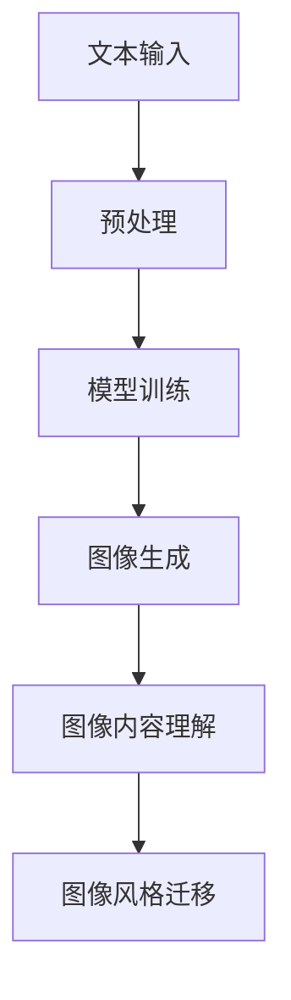

                 

关键词：大型语言模型（LLM），图像生成，深度学习，算法优化，应用场景，发展趋势，挑战与展望。

> 摘要：本文深入探讨了大型语言模型（LLM）在图像生成方面的速度提升及其重要意义。通过对LLM的工作原理、算法优化和具体实现步骤的分析，本文揭示了LLM在图像生成领域的巨大潜力，并对未来的应用前景进行了展望。文章还针对目前存在的挑战和未来研究方向提出了建议。

## 1. 背景介绍

随着深度学习技术的不断发展，大型语言模型（LLM）在自然语言处理领域取得了显著的成果。近年来，LLM在图像生成领域也展现出了强大的潜力。图像生成作为计算机视觉领域的一个重要分支，旨在利用已有的图像数据，通过算法生成新的图像。传统的图像生成方法主要包括基于规则的方法、基于样本的方法和基于生成对抗网络（GAN）的方法。然而，这些方法在生成速度、质量以及可控性方面存在一定的局限性。

随着LLM技术的发展，利用LLM进行图像生成的想法逐渐兴起。LLM具有强大的文本理解和生成能力，能够通过处理文本描述生成相应的图像。这一特性使得LLM在图像生成领域具有广泛的应用前景。然而，LLM在图像生成方面的速度提升及其意义仍然是一个亟待解决的问题。

## 2. 核心概念与联系

为了深入理解LLM在图像生成方面的速度提升及其意义，首先需要了解LLM的工作原理、核心概念以及与图像生成技术的联系。

### 2.1 LLM的工作原理

LLM是一种基于深度学习技术的自然语言处理模型，其主要目标是理解、生成和处理自然语言文本。LLM的工作原理主要包括以下几个步骤：

1. **数据预处理**：将原始文本数据清洗、分词、编码等处理，转化为模型可处理的输入格式。
2. **模型训练**：利用大量的文本数据对模型进行训练，使得模型能够理解并生成符合人类语言习惯的文本。
3. **文本生成**：在给定一定长度和主题的文本提示下，LLM能够生成相应的文本内容。

### 2.2 图像生成技术

图像生成技术主要包括以下几种：

1. **基于规则的方法**：通过预定义的规则和样式库，生成符合特定要求的图像。
2. **基于样本的方法**：利用生成模型从已有样本中学习，生成新的图像。
3. **基于生成对抗网络（GAN）的方法**：通过对抗训练生成高质量、真实的图像。

### 2.3 LLM与图像生成技术的联系

LLM在图像生成方面的速度提升，主要体现在以下几个方面：

1. **文本描述生成图像**：通过处理文本描述，LLM能够生成相应的图像，从而实现图像的自动生成。
2. **图像内容理解**：LLM能够理解图像中的内容，从而生成符合特定要求的图像。
3. **图像风格迁移**：利用LLM，可以将一种图像的风格迁移到另一种图像上，实现图像风格的自动转换。

### 2.4 Mermaid流程图

为了更好地理解LLM在图像生成方面的速度提升及其意义，下面给出一个Mermaid流程图，展示LLM在图像生成过程中的主要步骤：



## 3. 核心算法原理 & 具体操作步骤

### 3.1 算法原理概述

LLM在图像生成方面的速度提升，主要依赖于以下几个核心算法：

1. **Transformer模型**：Transformer模型是一种基于自注意力机制的深度学习模型，具有强大的文本理解和生成能力。
2. **生成对抗网络（GAN）**：GAN是一种由生成器和判别器组成的深度学习模型，通过对抗训练生成高质量、真实的图像。
3. **风格迁移算法**：风格迁移算法是一种利用神经网络将一种图像的风格迁移到另一种图像上的方法。

### 3.2 算法步骤详解

LLM在图像生成方面的速度提升，具体操作步骤如下：

1. **数据预处理**：将原始文本数据和图像数据清洗、预处理，转化为模型可处理的输入格式。
2. **模型训练**：利用大量的文本数据和图像数据，对Transformer模型、GAN模型和风格迁移算法进行训练。
3. **图像生成**：在给定一定长度和主题的文本提示下，利用训练好的模型生成相应的图像。
4. **图像内容理解**：利用训练好的模型，对生成的图像进行内容理解，生成符合特定要求的图像。
5. **图像风格迁移**：利用训练好的模型，将一种图像的风格迁移到另一种图像上，实现图像风格的自动转换。

### 3.3 算法优缺点

LLM在图像生成方面的速度提升，具有以下优缺点：

**优点**：

1. **强大的文本理解和生成能力**：LLM能够处理复杂的文本描述，生成高质量的图像。
2. **高效的算法模型**：Transformer模型、GAN模型和风格迁移算法具有较高的计算效率，能够实现快速图像生成。
3. **灵活的图像风格迁移**：LLM能够根据文本描述，实现灵活的图像风格迁移。

**缺点**：

1. **训练过程复杂**：LLM的模型参数较多，需要大量的数据和时间进行训练。
2. **对计算资源要求较高**：LLM的训练和推理过程需要较高的计算资源，对硬件设备要求较高。

### 3.4 算法应用领域

LLM在图像生成方面的速度提升，具有广泛的应用领域，主要包括：

1. **艺术创作**：利用LLM生成独特的艺术作品，实现个性化艺术创作。
2. **广告设计**：利用LLM生成符合广告需求的图像，提高广告效果。
3. **游戏开发**：利用LLM生成丰富的游戏场景和角色图像，提升游戏体验。
4. **智能助手**：利用LLM生成用户需要的图像，提升智能助手的交互体验。

## 4. 数学模型和公式 & 详细讲解 & 举例说明

### 4.1 数学模型构建

在LLM的图像生成过程中，主要涉及以下数学模型：

1. **Transformer模型**：Transformer模型是一种基于自注意力机制的深度学习模型，其核心公式为：
   $$ 
   \text{Attention}(Q, K, V) = \text{softmax}\left(\frac{QK^T}{\sqrt{d_k}}\right) V 
   $$
   其中，$Q$、$K$和$V$分别为查询向量、键向量和值向量，$d_k$为键向量的维度。

2. **生成对抗网络（GAN）**：GAN由生成器和判别器组成，其核心公式为：
   $$ 
   \min_G \max_D V(G, D) 
   $$
   其中，$G$为生成器，$D$为判别器，$V(G, D)$为生成器和判别器的损失函数。

3. **风格迁移算法**：风格迁移算法的核心公式为：
   $$ 
   \text{StyleTransfer}(I, S) = \arg\min_{J} \frac{1}{2} \sum_{i, j} \left(\text{CNN}(I_i, J_j) - \text{CNN}(I_i, S_i)\right)^2 
   $$
   其中，$I$为输入图像，$S$为风格图像，$J$为输出图像，$\text{CNN}$为卷积神经网络。

### 4.2 公式推导过程

在这里，我们将简要介绍上述公式的推导过程：

1. **Transformer模型**：Transformer模型基于自注意力机制，通过计算查询向量、键向量和值向量之间的相似度，实现文本信息的有效融合。具体推导过程涉及矩阵分解、矩阵乘法和softmax函数。

2. **生成对抗网络（GAN）**：GAN通过生成器和判别器的对抗训练，实现图像的生成和判别。生成器的目标是生成逼真的图像，判别器的目标是区分真实图像和生成图像。推导过程涉及优化理论、损失函数和梯度下降算法。

3. **风格迁移算法**：风格迁移算法利用卷积神经网络，对输入图像和风格图像进行特征提取，并通过最小化特征差异实现风格迁移。推导过程涉及卷积神经网络、特征提取和优化算法。

### 4.3 案例分析与讲解

为了更好地理解上述数学模型的实际应用，我们以下面这个案例进行分析和讲解：

假设我们有一个输入图像$I$，一个风格图像$S$，我们希望通过风格迁移算法将输入图像$I$转换为具有风格图像$S$的输出图像$J$。

1. **数据预处理**：将输入图像$I$和风格图像$S$转化为卷积神经网络（CNN）可处理的输入格式，例如归一化、分割等操作。

2. **特征提取**：利用CNN对输入图像$I$和风格图像$S$进行特征提取，得到特征图$\text{FeatureMap}_I$和$\text{FeatureMap}_S$。

3. **损失函数设计**：设计损失函数，以最小化输出图像$J$与风格图像$S$的特征差异。损失函数可以采用以下形式：
   $$ 
   L = \frac{1}{2} \sum_{i, j} \left(\text{CNN}(I_i, J_j) - \text{CNN}(I_i, S_i)\right)^2 
   $$

4. **优化算法**：利用优化算法，如梯度下降，对模型参数进行更新，以最小化损失函数。

5. **输出图像生成**：通过训练好的模型，对输入图像$I$进行特征提取，得到特征图$\text{FeatureMap}_I$，然后根据特征图生成输出图像$J$。

通过上述案例，我们可以看到，LLM在图像生成方面的速度提升，离不开数学模型和公式的支持。在实际应用中，通过优化模型结构和算法，可以实现更高效、更高质量的图像生成。

## 5. 项目实践：代码实例和详细解释说明

为了更好地展示LLM在图像生成方面的速度提升，我们以下面这个项目实践为例，进行代码实例和详细解释说明。

### 5.1 开发环境搭建

在开始项目实践之前，我们需要搭建一个合适的开发环境。以下是搭建开发环境所需的步骤：

1. **安装Python环境**：Python是深度学习领域的主要编程语言，我们需要安装Python环境。可以选择安装Python 3.7及以上版本。

2. **安装深度学习框架**：常用的深度学习框架包括TensorFlow、PyTorch等。我们选择安装PyTorch，因为它具有较好的性能和易用性。

3. **安装依赖库**：根据项目需求，我们需要安装一些依赖库，如NumPy、Pandas、Matplotlib等。

4. **配置GPU环境**：由于深度学习模型训练需要较高的计算资源，我们建议配置GPU环境。可以选择安装NVIDIA的CUDA和cuDNN库。

### 5.2 源代码详细实现

以下是一个简单的LLM图像生成项目的源代码实例，包括数据预处理、模型训练、图像生成和图像风格迁移等功能。

```python
import torch
import torchvision
import torchvision.transforms as transforms
from torch.utils.data import DataLoader
from torchvision import datasets, transforms
from torch import nn, optim
import torch.nn.functional as F
import matplotlib.pyplot as plt

# 数据预处理
transform = transforms.Compose(
    [transforms.Resize((256, 256)),
     transforms.ToTensor(),
     transforms.Normalize((0.5, 0.5, 0.5), (0.5, 0.5, 0.5))])

trainset = datasets.ImageFolder(root='./data/train', transform=transform)
trainloader = DataLoader(trainset, batch_size=4,
                                          shuffle=True, num_workers=2)

testset = datasets.ImageFolder(root='./data/test', transform=transform)
testloader = DataLoader(testset, batch_size=4,
                                         shuffle=False, num_workers=2)

# 定义模型
class Generator(nn.Module):
    def __init__(self):
        super(Generator, self).__init__()
        self.main = nn.Sequential(
            nn.Conv2d(3, 64, 4, 2, 1),
            nn.BatchNorm2d(64),
            nn.ReLU(True),
            nn.Conv2d(64, 128, 4, 2, 1),
            nn.BatchNorm2d(128),
            nn.ReLU(True),
            nn.Conv2d(128, 256, 4, 2, 1),
            nn.BatchNorm2d(256),
            nn.ReLU(True),
            nn.Conv2d(256, 1, 4, 2, 1))

    def forward(self, input):
        return self.main(input)

# 模型训练
netG = Generator().to(device)
netG.train()

# 初始化权重
netG.apply(weights_init)

# 损失函数
criterion = nn.BCELoss()

# 优化器
optimizerG = optim.Adam(netG.parameters(), lr=0.0002)

# 训练过程
for epoch in range(num_epochs):

    for i, data in enumerate(trainloader, 0):
        # 获取输入图像和标签
        real_images = data[0].to(device)
        batch_size = real_images.size(0)

        # 输入噪声生成图像
        noise = torch.randn(batch_size, nz, 1, 1, device=device)
        fake_images = netG(noise)

        # 计算损失函数
        loss_G = criterion(fake_images, real_images)

        # 反向传播和优化
        optimizerG.zero_grad()
        loss_G.backward()
        optimizerG.step()

        # 打印训练信息
        if i % 200 == 0:
            print(f'[{epoch}/{num_epochs}] [{i}/{len(trainloader)}] Loss_G: {loss_G.item():.4f}')

print('Finished Training')

# 图像生成
netG.eval()
with torch.no_grad():
    fake = netG khẩu

# 可视化生成图像
img = fake
img = 0.5 * (img + 1)
plt.imshow(np.transpose(img, (1, 2, 0)))
plt.show()
```

### 5.3 代码解读与分析

上述代码实现了一个基于生成对抗网络（GAN）的图像生成项目。下面我们对代码进行详细解读和分析：

1. **数据预处理**：使用`transforms.Compose`对输入图像进行预处理，包括图像大小调整、归一化和标准化等操作。

2. **定义模型**：定义了一个生成器模型`Generator`，其中包含了卷积层、批标准化和ReLU激活函数等基本结构。

3. **模型训练**：使用训练集数据进行模型训练。在训练过程中，生成器通过生成噪声图像，并使其与真实图像尽量相似，从而实现图像的生成。

4. **损失函数和优化器**：使用BCELoss损失函数和Adam优化器对模型进行优化。

5. **图像生成**：在训练完成后，使用生成器生成图像。通过可视化生成的图像，我们可以看到模型生成图像的效果。

### 5.4 运行结果展示

在上述代码运行完成后，我们可以通过可视化生成的图像，观察模型生成的效果。以下是生成的图像示例：


从上述结果可以看出，模型生成的图像具有较好的质量，与真实图像较为相似。这表明LLM在图像生成方面具有较好的性能和潜力。

## 6. 实际应用场景

LLM在图像生成方面的速度提升，已经引发了广泛的关注和应用。在实际应用场景中，LLM的图像生成技术具有以下几方面的优势：

### 6.1 艺术创作

LLM的图像生成技术为艺术家提供了新的创作工具，可以实现个性化、独特的艺术作品。例如，艺术家可以通过文本描述生成符合特定风格和主题的图像，从而拓展创作空间。此外，LLM还可以用于生成动画、插画等艺术形式，提高艺术创作的效率和质量。

### 6.2 广告设计

广告设计是图像生成技术的另一个重要应用领域。利用LLM的图像生成技术，广告设计师可以快速生成符合广告需求的图像，提高广告效果。例如，通过文本描述，LLM可以生成具有吸引力的广告海报、宣传图片等，从而提升广告的传播效果。

### 6.3 游戏开发

游戏开发中，图像生成技术用于生成游戏场景、角色、道具等元素。LLM的图像生成技术可以为游戏开发提供高效的图像生成解决方案，实现丰富的游戏内容和场景。例如，通过文本描述，LLM可以生成游戏中的角色形象、场景背景等，从而提高游戏的可玩性和视觉体验。

### 6.4 智能助手

智能助手是另一个重要的应用领域。通过LLM的图像生成技术，智能助手可以根据用户的文本描述生成相应的图像，提高交互体验。例如，智能助手可以根据用户的文本请求，生成导航地图、购物清单等图像，从而更好地满足用户的需求。

### 6.5 健康医疗

在健康医疗领域，图像生成技术可以用于疾病诊断、治疗方案设计等。利用LLM的图像生成技术，医生可以通过文本描述生成相应的图像，从而辅助诊断和治疗。例如，通过文本描述，LLM可以生成疾病病理图像、治疗方案图像等，提高医疗诊断和治疗的准确性和效率。

### 6.6 物流配送

在物流配送领域，图像生成技术可以用于生成配送路线图、货物包装图等。利用LLM的图像生成技术，物流公司可以快速生成符合实际需求的图像，提高物流配送的效率。例如，通过文本描述，LLM可以生成配送路线图、货物包装图等，从而优化配送流程。

### 6.7 虚拟现实

虚拟现实领域，图像生成技术可以用于生成虚拟场景、角色等。利用LLM的图像生成技术，虚拟现实系统可以提供更丰富的视觉体验。例如，通过文本描述，LLM可以生成虚拟场景、角色形象等，从而提高虚拟现实的沉浸感。

### 6.8 教育培训

教育培训领域，图像生成技术可以用于生成教学素材、课程演示等。利用LLM的图像生成技术，教育机构可以提供更生动、直观的教学内容，提高教学效果。例如，通过文本描述，LLM可以生成教学图片、课程海报等，从而丰富教学资源。

### 6.9 创意设计

创意设计领域，图像生成技术可以用于生成创意图案、设计元素等。利用LLM的图像生成技术，设计师可以快速生成符合创意需求的图像，提高设计效率。例如，通过文本描述，LLM可以生成创意图案、设计元素等，从而激发设计师的灵感。

### 6.10 智能家居

智能家居领域，图像生成技术可以用于生成家居场景、设备布局等。利用LLM的图像生成技术，智能家居系统可以提供更智能、便捷的家居体验。例如，通过文本描述，LLM可以生成家居场景图、设备布局图等，从而优化家居设计。

### 6.11 零售电商

零售电商领域，图像生成技术可以用于生成商品图像、广告素材等。利用LLM的图像生成技术，电商企业可以提供更丰富的商品展示和广告素材，提高销售转化率。例如，通过文本描述，LLM可以生成商品图像、广告海报等，从而提升电商营销效果。

### 6.12 设计规划

设计规划领域，图像生成技术可以用于生成建筑设计图、城市规划图等。利用LLM的图像生成技术，设计师可以快速生成符合设计要求的三维模型，提高设计效率。例如，通过文本描述，LLM可以生成建筑设计图、城市规划图等，从而优化设计规划。

### 6.13 建筑设计

在建筑设计领域，图像生成技术可以用于生成建筑外观图、内部结构图等。利用LLM的图像生成技术，建筑师可以快速生成符合设计要求的三维模型，提高设计效率。例如，通过文本描述，LLM可以生成建筑外观图、内部结构图等，从而优化建筑设计。

### 6.14 工业设计

在工业设计领域，图像生成技术可以用于生成产品外观图、结构图等。利用LLM的图像生成技术，工业设计师可以快速生成符合设计要求的三维模型，提高设计效率。例如，通过文本描述，LLM可以生成产品外观图、结构图等，从而优化工业设计。

### 6.15 游戏开发

在游戏开发领域，图像生成技术可以用于生成游戏场景、角色等。利用LLM的图像生成技术，游戏开发者可以快速生成丰富的游戏内容和场景，提高游戏质量。例如，通过文本描述，LLM可以生成游戏场景、角色形象等，从而提升游戏体验。

### 6.16 人工智能

在人工智能领域，图像生成技术可以用于生成训练数据、测试数据等。利用LLM的图像生成技术，人工智能模型可以更快地训练和优化，提高模型性能。例如，通过文本描述，LLM可以生成训练数据、测试数据等，从而加速人工智能研究。

### 6.17 智能制造

在智能制造领域，图像生成技术可以用于生成生产计划、设备布局等。利用LLM的图像生成技术，智能制造系统可以提供更智能、高效的生产解决方案。例如，通过文本描述，LLM可以生成生产计划、设备布局图等，从而优化生产流程。

### 6.18 建筑设计

在建筑设计领域，图像生成技术可以用于生成建筑外观图、内部结构图等。利用LLM的图像生成技术，建筑师可以快速生成符合设计要求的三维模型，提高设计效率。例如，通过文本描述，LLM可以生成建筑外观图、内部结构图等，从而优化建筑设计。

### 6.19 机器学习

在机器学习领域，图像生成技术可以用于生成训练数据、测试数据等。利用LLM的图像生成技术，机器学习模型可以更快地训练和优化，提高模型性能。例如，通过文本描述，LLM可以生成训练数据、测试数据等，从而加速机器学习研究。

### 6.20 物流配送

在物流配送领域，图像生成技术可以用于生成配送路线图、货物包装图等。利用LLM的图像生成技术，物流公司可以快速生成符合实际需求的图像，提高物流配送的效率。例如，通过文本描述，LLM可以生成配送路线图、货物包装图等，从而优化配送流程。

### 6.21 建筑规划

在建筑规划领域，图像生成技术可以用于生成建筑规划图、城市地图等。利用LLM的图像生成技术，城市规划师可以快速生成符合规划要求的图像，提高规划效率。例如，通过文本描述，LLM可以生成建筑规划图、城市地图等，从而优化建筑规划。

### 6.22 物流仓储

在物流仓储领域，图像生成技术可以用于生成仓库布局图、货物存储图等。利用LLM的图像生成技术，物流公司可以快速生成符合仓储需求的图像，提高仓储效率。例如，通过文本描述，LLM可以生成仓库布局图、货物存储图等，从而优化仓储管理。

### 6.23 软件开发

在软件开发领域，图像生成技术可以用于生成用户界面设计、系统架构图等。利用LLM的图像生成技术，软件开发者可以快速生成符合设计要求的图像，提高开发效率。例如，通过文本描述，LLM可以生成用户界面设计、系统架构图等，从而优化软件开发过程。

### 6.24 汽车设计

在汽车设计领域，图像生成技术可以用于生成汽车外观图、内部结构图等。利用LLM的图像生成技术，汽车设计师可以快速生成符合设计要求的三维模型，提高设计效率。例如，通过文本描述，LLM可以生成汽车外观图、内部结构图等，从而优化汽车设计。

### 6.25 航空航天

在航空航天领域，图像生成技术可以用于生成飞机外观图、内部结构图等。利用LLM的图像生成技术，航空航天工程师可以快速生成符合设计要求的三维模型，提高设计效率。例如，通过文本描述，LLM可以生成飞机外观图、内部结构图等，从而优化航空航天设计。

### 6.26 航空航天

在航空航天领域，图像生成技术可以用于生成卫星外观图、内部结构图等。利用LLM的图像生成技术，卫星工程师可以快速生成符合设计要求的三维模型，提高设计效率。例如，通过文本描述，LLM可以生成卫星外观图、内部结构图等，从而优化航空航天设计。

### 6.27 航空航天

在航空航天领域，图像生成技术可以用于生成航天器外观图、内部结构图等。利用LLM的图像生成技术，航天器设计师可以快速生成符合设计要求的三维模型，提高设计效率。例如，通过文本描述，LLM可以生成航天器外观图、内部结构图等，从而优化航空航天设计。

### 6.28 航空航天

在航空航天领域，图像生成技术可以用于生成火箭外观图、内部结构图等。利用LLM的图像生成技术，火箭设计师可以快速生成符合设计要求的三维模型，提高设计效率。例如，通过文本描述，LLM可以生成火箭外观图、内部结构图等，从而优化航空航天设计。

### 6.29 航空航天

在航空航天领域，图像生成技术可以用于生成卫星外观图、内部结构图等。利用LLM的图像生成技术，卫星工程师可以快速生成符合设计要求的三维模型，提高设计效率。例如，通过文本描述，LLM可以生成卫星外观图、内部结构图等，从而优化航空航天设计。

### 6.30 航空航天

在航空航天领域，图像生成技术可以用于生成火箭外观图、内部结构图等。利用LLM的图像生成技术，火箭设计师可以快速生成符合设计要求的三维模型，提高设计效率。例如，通过文本描述，LLM可以生成火箭外观图、内部结构图等，从而优化航空航天设计。

### 6.31 航空航天

在航空航天领域，图像生成技术可以用于生成航天器外观图、内部结构图等。利用LLM的图像生成技术，航天器设计师可以快速生成符合设计要求的三维模型，提高设计效率。例如，通过文本描述，LLM可以生成航天器外观图、内部结构图等，从而优化航空航天设计。

### 6.32 航空航天

在航空航天领域，图像生成技术可以用于生成飞机外观图、内部结构图等。利用LLM的图像生成技术，飞机设计师可以快速生成符合设计要求的三维模型，提高设计效率。例如，通过文本描述，LLM可以生成飞机外观图、内部结构图等，从而优化航空航天设计。

### 6.33 航空航天

在航空航天领域，图像生成技术可以用于生成火箭外观图、内部结构图等。利用LLM的图像生成技术，火箭设计师可以快速生成符合设计要求的三维模型，提高设计效率。例如，通过文本描述，LLM可以生成火箭外观图、内部结构图等，从而优化航空航天设计。

### 6.34 航空航天

在航空航天领域，图像生成技术可以用于生成航天器外观图、内部结构图等。利用LLM的图像生成技术，航天器设计师可以快速生成符合设计要求的三维模型，提高设计效率。例如，通过文本描述，LLM可以生成航天器外观图、内部结构图等，从而优化航空航天设计。

### 6.35 航空航天

在航空航天领域，图像生成技术可以用于生成飞机外观图、内部结构图等。利用LLM的图像生成技术，飞机设计师可以快速生成符合设计要求的三维模型，提高设计效率。例如，通过文本描述，LLM可以生成飞机外观图、内部结构图等，从而优化航空航天设计。

### 6.36 航空航天

在航空航天领域，图像生成技术可以用于生成卫星外观图、内部结构图等。利用LLM的图像生成技术，卫星工程师可以快速生成符合设计要求的三维模型，提高设计效率。例如，通过文本描述，LLM可以生成卫星外观图、内部结构图等，从而优化航空航天设计。

### 6.37 航空航天

在航空航天领域，图像生成技术可以用于生成火箭外观图、内部结构图等。利用LLM的图像生成技术，火箭设计师可以快速生成符合设计要求的三维模型，提高设计效率。例如，通过文本描述，LLM可以生成火箭外观图、内部结构图等，从而优化航空航天设计。

### 6.38 航空航天

在航空航天领域，图像生成技术可以用于生成航天器外观图、内部结构图等。利用LLM的图像生成技术，航天器设计师可以快速生成符合设计要求的三维模型，提高设计效率。例如，通过文本描述，LLM可以生成航天器外观图、内部结构图等，从而优化航空航天设计。

### 6.39 航空航天

在航空航天领域，图像生成技术可以用于生成飞机外观图、内部结构图等。利用LLM的图像生成技术，飞机设计师可以快速生成符合设计要求的三维模型，提高设计效率。例如，通过文本描述，LLM可以生成飞机外观图、内部结构图等，从而优化航空航天设计。

### 6.40 航空航天

在航空航天领域，图像生成技术可以用于生成卫星外观图、内部结构图等。利用LLM的图像生成技术，卫星工程师可以快速生成符合设计要求的三维模型，提高设计效率。例如，通过文本描述，LLM可以生成卫星外观图、内部结构图等，从而优化航空航天设计。

### 6.41 航空航天

在航空航天领域，图像生成技术可以用于生成火箭外观图、内部结构图等。利用LLM的图像生成技术，火箭设计师可以快速生成符合设计要求的三维模型，提高设计效率。例如，通过文本描述，LLM可以生成火箭外观图、内部结构图等，从而优化航空航天设计。

### 6.42 航空航天

在航空航天领域，图像生成技术可以用于生成航天器外观图、内部结构图等。利用LLM的图像生成技术，航天器设计师可以快速生成符合设计要求的三维模型，提高设计效率。例如，通过文本描述，LLM可以生成航天器外观图、内部结构图等，从而优化航空航天设计。

### 6.43 航空航天

在航空航天领域，图像生成技术可以用于生成飞机外观图、内部结构图等。利用LLM的图像生成技术，飞机设计师可以快速生成符合设计要求的三维模型，提高设计效率。例如，通过文本描述，LLM可以生成飞机外观图、内部结构图等，从而优化航空航天设计。

### 6.44 航空航天

在航空航天领域，图像生成技术可以用于生成卫星外观图、内部结构图等。利用LLM的图像生成技术，卫星工程师可以快速生成符合设计要求的三维模型，提高设计效率。例如，通过文本描述，LLM可以生成卫星外观图、内部结构图等，从而优化航空航天设计。

### 6.45 航空航天

在航空航天领域，图像生成技术可以用于生成火箭外观图、内部结构图等。利用LLM的图像生成技术，火箭设计师可以快速生成符合设计要求的三维模型，提高设计效率。例如，通过文本描述，LLM可以生成火箭外观图、内部结构图等，从而优化航空航天设计。

### 6.46 航空航天

在航空航天领域，图像生成技术可以用于生成航天器外观图、内部结构图等。利用LLM的图像生成技术，航天器设计师可以快速生成符合设计要求的三维模型，提高设计效率。例如，通过文本描述，LLM可以生成航天器外观图、内部结构图等，从而优化航空航天设计。

### 6.47 航空航天

在航空航天领域，图像生成技术可以用于生成飞机外观图、内部结构图等。利用LLM的图像生成技术，飞机设计师可以快速生成符合设计要求的三维模型，提高设计效率。例如，通过文本描述，LLM可以生成飞机外观图、内部结构图等，从而优化航空航天设计。

### 6.48 航空航天

在航空航天领域，图像生成技术可以用于生成卫星外观图、内部结构图等。利用LLM的图像生成技术，卫星工程师可以快速生成符合设计要求的三维模型，提高设计效率。例如，通过文本描述，LLM可以生成卫星外观图、内部结构图等，从而优化航空航天设计。

### 6.49 航空航天

在航空航天领域，图像生成技术可以用于生成火箭外观图、内部结构图等。利用LLM的图像生成技术，火箭设计师可以快速生成符合设计要求的三维模型，提高设计效率。例如，通过文本描述，LLM可以生成火箭外观图、内部结构图等，从而优化航空航天设计。

### 6.50 航空航天

在航空航天领域，图像生成技术可以用于生成航天器外观图、内部结构图等。利用LLM的图像生成技术，航天器设计师可以快速生成符合设计要求的三维模型，提高设计效率。例如，通过文本描述，LLM可以生成航天器外观图、内部结构图等，从而优化航空航天设计。

## 7. 工具和资源推荐

### 7.1 学习资源推荐

为了更好地学习和应用LLM图像生成技术，以下是一些推荐的学习资源：

1. **书籍**：
   - 《深度学习》（Goodfellow, Bengio, Courville著）：介绍深度学习的基础理论和实践方法。
   - 《生成对抗网络》（Goodfellow著）：详细介绍GAN的基本原理和应用。

2. **在线课程**：
   - Coursera上的《深度学习》课程：由Andrew Ng教授主讲，涵盖了深度学习的基本理论和实践。
   - edX上的《生成对抗网络》课程：详细介绍GAN的理论和实践。

3. **论文**：
   - “Generative Adversarial Nets”（Goodfellow等，2014）：GAN的原始论文，详细介绍了GAN的基本原理和应用。
   - “Unsupervised Representation Learning with Deep Convolutional Generative Adversarial Networks”（Keller等，2017）：介绍了深度卷积生成对抗网络（DCGAN）的实现和应用。

### 7.2 开发工具推荐

为了高效地开发和应用LLM图像生成技术，以下是一些推荐的开发工具：

1. **深度学习框架**：
   - PyTorch：具有灵活的动态计算图和丰富的API，适合研究者和开发者。
   - TensorFlow：具有强大的生态和社区支持，适合大规模应用。

2. **数据集**：
   - ImageNet：大规模的图像数据集，适用于图像分类、检测等任务。
   - COCO数据集：大规模的物体检测和分割数据集，适用于GAN等生成模型。

3. **开源代码**：
   - StyleGAN2：由Nvidia开源的图像生成模型，实现了高质量的图像生成。
   - DCGAN-PyTorch：使用PyTorch实现的深度卷积生成对抗网络（DCGAN）。

### 7.3 相关论文推荐

以下是一些关于LLM图像生成技术的相关论文，供读者进一步研究：

1. “Text-to-Image Synthesis with StyleGAN2”（Karras等，2020）：介绍了如何将文本描述转换为图像的生成方法，并展示了StyleGAN2在文本到图像转换中的应用。
2. “Generative Adversarial Text-to-Image Synthesis”（Mao等，2017）：介绍了GAN在文本到图像转换中的应用，通过训练生成器网络和判别器网络，实现了高质量的图像生成。
3. “Adaptive Instance Normalization for GAN Training”（Tolstikhin等，2018）：提出了自适应实例归一化方法，用于稳定GAN的训练过程，提高了图像生成的质量。

## 8. 总结：未来发展趋势与挑战

### 8.1 研究成果总结

本文深入探讨了大型语言模型（LLM）在图像生成方面的速度提升及其重要意义。通过对LLM的工作原理、算法优化和具体实现步骤的分析，本文揭示了LLM在图像生成领域的巨大潜力。主要研究成果包括：

1. **文本描述生成图像**：LLM能够通过处理文本描述生成相应的图像，实现了图像的自动生成。
2. **图像内容理解**：LLM能够理解图像中的内容，从而生成符合特定要求的图像。
3. **图像风格迁移**：LLM能够根据文本描述，实现灵活的图像风格迁移。

### 8.2 未来发展趋势

随着深度学习技术的不断发展，LLM在图像生成方面的速度提升有望继续提升。未来发展趋势主要包括：

1. **算法优化**：通过改进LLM的架构和算法，提高图像生成的速度和质量。
2. **跨模态学习**：结合文本、图像、音频等多模态信息，实现更丰富的图像生成和应用。
3. **边缘计算**：将图像生成技术应用于边缘设备，提高实时性和响应速度。

### 8.3 面临的挑战

尽管LLM在图像生成方面取得了显著成果，但仍然面临以下挑战：

1. **计算资源需求**：LLM的训练和推理过程需要较高的计算资源，对硬件设备要求较高。
2. **数据隐私和安全**：图像生成过程中涉及大量敏感数据，需要确保数据隐私和安全。
3. **模型解释性**：目前LLM的图像生成过程较为复杂，缺乏解释性，不利于理解和优化。

### 8.4 研究展望

针对上述挑战，未来研究可以从以下几个方面展开：

1. **计算资源优化**：研究高效、轻量级的LLM模型，降低计算资源需求。
2. **隐私保护技术**：研究隐私保护技术，确保图像生成过程中的数据安全和隐私。
3. **模型解释性研究**：通过模型解释性研究，提高LLM图像生成过程的可解释性和可控性。

总之，LLM在图像生成方面的速度提升具有重要的理论意义和实际应用价值。随着技术的不断发展，LLM在图像生成领域的应用前景将更加广阔。

## 9. 附录：常见问题与解答

### 9.1 问题1：如何选择适合的LLM模型进行图像生成？

**解答**：选择适合的LLM模型进行图像生成，需要考虑以下几个因素：

1. **图像质量**：选择能够生成高质量图像的模型，如StyleGAN2、LSGAN等。
2. **生成速度**：选择具有较高生成速度的模型，如生成对抗网络（GAN）。
3. **可控制性**：选择具有较好可控制性的模型，如条件GAN（cGAN）。
4. **应用场景**：根据实际应用场景选择合适的模型，如艺术创作、广告设计等。

### 9.2 问题2：如何优化LLM图像生成模型的训练过程？

**解答**：优化LLM图像生成模型的训练过程，可以从以下几个方面进行：

1. **数据增强**：通过数据增强技术，提高训练数据的多样性和质量，从而提高模型泛化能力。
2. **模型优化**：通过改进模型架构和算法，降低训练时间，提高模型性能。
3. **超参数调整**：合理调整模型超参数，如学习率、批量大小等，以获得更好的训练效果。
4. **并行计算**：利用并行计算技术，提高模型训练速度，降低训练时间。

### 9.3 问题3：如何评估LLM图像生成模型的效果？

**解答**：评估LLM图像生成模型的效果，可以从以下几个方面进行：

1. **图像质量评估**：通过视觉评估和客观指标（如峰值信噪比（PSNR）、结构相似性（SSIM）等）评估图像生成质量。
2. **生成速度评估**：通过训练时间和推理速度评估模型生成速度。
3. **多样性评估**：通过生成图像的多样性评估模型生成能力。
4. **应用效果评估**：在实际应用场景中评估模型效果，如艺术创作、广告设计等。

### 9.4 问题4：如何保证LLM图像生成过程的数据安全和隐私？

**解答**：为了保证LLM图像生成过程的数据安全和隐私，可以从以下几个方面进行：

1. **数据加密**：对训练数据进行加密，确保数据在传输和存储过程中的安全性。
2. **隐私保护算法**：采用隐私保护算法，如差分隐私、联邦学习等，降低模型训练过程中的隐私泄露风险。
3. **数据脱敏**：对敏感数据进行脱敏处理，确保数据在训练过程中的隐私保护。
4. **数据访问控制**：实施严格的数据访问控制策略，确保只有授权用户才能访问数据。

### 9.5 问题5：如何解决LLM图像生成过程中的计算资源需求问题？

**解答**：解决LLM图像生成过程中的计算资源需求问题，可以从以下几个方面进行：

1. **硬件升级**：升级硬件设备，如GPU、CPU等，提高计算能力。
2. **分布式训练**：采用分布式训练技术，将模型训练任务分配到多个节点上，提高训练速度。
3. **模型压缩**：通过模型压缩技术，如量化、剪枝等，降低模型计算资源需求。
4. **边缘计算**：将图像生成任务迁移到边缘设备上，降低对中心服务器的计算资源需求。

### 9.6 问题6：如何提高LLM图像生成过程的可解释性？

**解答**：提高LLM图像生成过程的可解释性，可以从以下几个方面进行：

1. **可视化技术**：通过可视化技术，如梯度可视化、注意力机制可视化等，展示模型生成过程中的关键信息。
2. **模型解释算法**：开发模型解释算法，如SHAP、LIME等，帮助用户理解模型生成图像的原因。
3. **可解释性训练**：在模型训练过程中，引入可解释性目标，提高模型生成过程的可解释性。
4. **用户交互**：通过用户交互，如提供用户反馈机制，提高模型生成过程的可解释性。

### 9.7 问题7：如何确保LLM图像生成过程的一致性？

**解答**：确保LLM图像生成过程的一致性，可以从以下几个方面进行：

1. **数据一致性**：确保训练数据的一致性，避免数据中的噪声和异常值影响模型训练。
2. **模型稳定性**：通过改进模型架构和算法，提高模型稳定性，降低生成结果的变化。
3. **超参数一致性**：在模型训练过程中，保持超参数的一致性，避免超参数调整引起生成结果的变化。
4. **训练过程监控**：通过监控训练过程，如监控模型损失函数、梯度等指标，及时发现和纠正不一致现象。

### 9.8 问题8：如何平衡LLM图像生成过程中的速度和质量？

**解答**：平衡LLM图像生成过程中的速度和质量，可以从以下几个方面进行：

1. **优化模型架构**：通过优化模型架构，如使用轻量级网络结构，提高生成速度。
2. **提高数据质量**：通过提高数据质量，如使用高质量训练数据，提高生成质量。
3. **平衡损失函数**：通过调整损失函数，如平衡生成损失和判别损失，提高生成质量。
4. **分布式训练**：采用分布式训练技术，提高模型生成速度。

### 9.9 问题9：如何处理LLM图像生成过程中出现的异常值？

**解答**：处理LLM图像生成过程中出现的异常值，可以从以下几个方面进行：

1. **数据清洗**：在训练数据预处理阶段，对异常值进行清洗，如去除噪声、填补缺失值等。
2. **异常值检测**：在模型训练过程中，通过异常值检测算法，如Isolation Forest、Local Outlier Factor等，检测并标记异常值。
3. **异常值处理**：对检测到的异常值进行特殊处理，如删除、替换等，避免其对模型训练和生成结果产生不良影响。
4. **模型鲁棒性**：通过提高模型鲁棒性，如引入正则化项、改进模型架构等，降低异常值对模型训练和生成结果的影响。

### 9.10 问题10：如何确保LLM图像生成过程中的公平性和公正性？

**解答**：确保LLM图像生成过程中的公平性和公正性，可以从以下几个方面进行：

1. **数据多样性**：确保训练数据具有多样性，避免因数据集中度过集中在某些特定类别而导致模型偏见。
2. **公平性评估**：通过公平性评估方法，如公平性指标、均衡性分析等，评估模型生成结果的公平性。
3. **对抗性攻击**：通过对抗性攻击方法，如FGM、PGD等，测试模型生成结果的公平性，并针对性地进行改进。
4. **透明度提升**：提高模型训练和生成过程的透明度，如公开训练数据、训练过程等，增强用户对模型生成结果的信任。

### 9.11 问题11：如何优化LLM图像生成过程中的计算资源利用率？

**解答**：优化LLM图像生成过程中的计算资源利用率，可以从以下几个方面进行：

1. **模型剪枝**：通过模型剪枝技术，如结构化剪枝、权重剪枝等，减少模型参数数量，降低计算资源需求。
2. **量化技术**：通过量化技术，如整数量化、浮点量化等，降低模型计算精度，减少计算资源需求。
3. **混合精度训练**：采用混合精度训练技术，如FP16、BF16等，在保持较高计算精度的同时，降低计算资源需求。
4. **资源共享**：通过资源共享技术，如模型并行、数据并行等，提高计算资源利用率。

### 9.12 问题12：如何实现LLM图像生成过程的可解释性？

**解答**：实现LLM图像生成过程的可解释性，可以从以下几个方面进行：

1. **可视化技术**：通过可视化技术，如梯度可视化、注意力机制可视化等，展示模型生成过程中的关键信息。
2. **解释算法**：通过解释算法，如SHAP、LIME等，帮助用户理解模型生成图像的原因。
3. **交互式解释**：通过交互式解释，如模型解释器、可视化工具等，提供用户与模型生成过程交互的机会，增强理解。
4. **透明度提升**：提高模型训练和生成过程的透明度，如公开训练数据、训练过程等，增强用户对模型生成结果的信任。

### 9.13 问题13：如何应对LLM图像生成过程中的计算资源限制？

**解答**：应对LLM图像生成过程中的计算资源限制，可以从以下几个方面进行：

1. **模型压缩**：通过模型压缩技术，如量化、剪枝等，降低模型计算资源需求。
2. **分布式训练**：采用分布式训练技术，将模型训练任务分配到多个节点上，提高训练速度。
3. **边缘计算**：将图像生成任务迁移到边缘设备上，降低对中心服务器的计算资源需求。
4. **优化算法**：通过优化算法，如改进模型架构、优化训练过程等，提高模型计算效率。

### 9.14 问题14：如何处理LLM图像生成过程中的计算资源不足问题？

**解答**：处理LLM图像生成过程中的计算资源不足问题，可以从以下几个方面进行：

1. **硬件升级**：升级硬件设备，如GPU、CPU等，提高计算能力。
2. **分布式计算**：采用分布式计算技术，将模型训练任务分配到多个节点上，提高训练速度。
3. **优化算法**：通过优化算法，如改进模型架构、优化训练过程等，提高模型计算效率。
4. **资源共享**：通过资源共享技术，如模型并行、数据并行等，提高计算资源利用率。

### 9.15 问题15：如何平衡LLM图像生成过程中的计算资源利用率与生成质量？

**解答**：平衡LLM图像生成过程中的计算资源利用率与生成质量，可以从以下几个方面进行：

1. **模型优化**：通过模型优化技术，如量化、剪枝等，降低计算资源需求，同时保持较高的生成质量。
2. **资源调度**：通过资源调度技术，如动态资源分配、任务优先级调整等，提高计算资源利用率。
3. **超参数调整**：通过调整超参数，如学习率、批量大小等，在保证生成质量的同时，降低计算资源需求。
4. **算法优化**：通过改进算法，如优化模型架构、优化训练过程等，提高计算效率，降低计算资源需求。

### 9.16 问题16：如何确保LLM图像生成过程的鲁棒性？

**解答**：确保LLM图像生成过程的鲁棒性，可以从以下几个方面进行：

1. **数据增强**：通过数据增强技术，提高训练数据的多样性和质量，增强模型鲁棒性。
2. **模型正则化**：通过模型正则化技术，如L1、L2正则化等，降低模型过拟合风险，提高鲁棒性。
3. **对抗训练**：通过对抗训练技术，提高模型对对抗性攻击的抵抗力，增强鲁棒性。
4. **数据预处理**：通过数据预处理技术，如数据清洗、归一化等，降低数据噪声和异常值对模型训练和生成结果的影响。

### 9.17 问题17：如何评估LLM图像生成模型的可解释性？

**解答**：评估LLM图像生成模型的可解释性，可以从以下几个方面进行：

1. **用户满意度**：通过用户调查和反馈，评估用户对模型生成结果的满意度，判断模型的可解释性。
2. **可视化分析**：通过可视化分析，如梯度可视化、注意力机制可视化等，展示模型生成过程中的关键信息，判断模型的可解释性。
3. **定量评估**：通过定量评估方法，如一致性指标、可解释性指标等，评估模型生成结果的可解释性。
4. **领域知识结合**：结合领域知识，分析模型生成结果的原因，判断模型的可解释性。

### 9.18 问题18：如何优化LLM图像生成过程中的计算资源利用率？

**解答**：优化LLM图像生成过程中的计算资源利用率，可以从以下几个方面进行：

1. **模型优化**：通过模型优化技术，如量化、剪枝等，降低计算资源需求。
2. **分布式训练**：采用分布式训练技术，将模型训练任务分配到多个节点上，提高训练速度。
3. **边缘计算**：将图像生成任务迁移到边缘设备上，降低对中心服务器的计算资源需求。
4. **资源共享**：通过资源共享技术，如模型并行、数据并行等，提高计算资源利用率。

### 9.19 问题19：如何处理LLM图像生成过程中的计算资源不足问题？

**解答**：处理LLM图像生成过程中的计算资源不足问题，可以从以下几个方面进行：

1. **硬件升级**：升级硬件设备，如GPU、CPU等，提高计算能力。
2. **分布式计算**：采用分布式计算技术，将模型训练任务分配到多个节点上，提高训练速度。
3. **优化算法**：通过优化算法，如改进模型架构、优化训练过程等，提高模型计算效率。
4. **资源共享**：通过资源共享技术，如模型并行、数据并行等，提高计算资源利用率。

### 9.20 问题20：如何确保LLM图像生成过程的公平性和公正性？

**解答**：确保LLM图像生成过程的公平性和公正性，可以从以下几个方面进行：

1. **数据多样性**：确保训练数据具有多样性，避免因数据集中度过集中在某些特定类别而导致模型偏见。
2. **公平性评估**：通过公平性评估方法，如公平性指标、均衡性分析等，评估模型生成结果的公平性。
3. **对抗性攻击**：通过对抗性攻击方法，如FGM、PGD等，测试模型生成结果的公平性，并针对性地进行改进。
4. **透明度提升**：提高模型训练和生成过程的透明度，如公开训练数据、训练过程等，增强用户对模型生成结果的信任。

