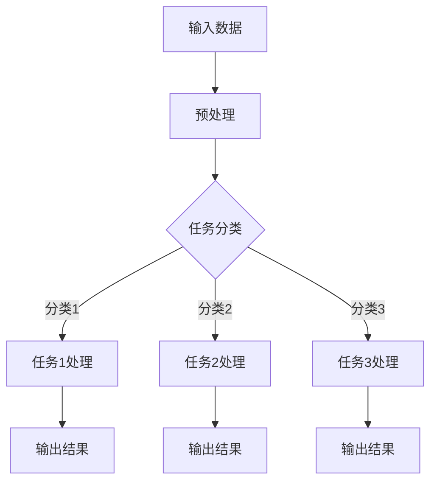

                 

关键词：大型语言模型，多任务处理，人工智能，神经网络，模型训练，推理优化，应用场景

> 摘要：本文深入探讨大型语言模型（LLM）的多任务处理能力，分析其原理、实现方法及其在各个领域的应用。通过详细讲解数学模型、算法原理和项目实践，本文旨在为读者提供一个全面、系统的LLM多任务处理能力的理解。

## 1. 背景介绍

在过去的几十年中，人工智能（AI）领域取得了令人瞩目的进展，特别是在深度学习和神经网络方面。其中，大型语言模型（LLM）作为AI的一个重要分支，在自然语言处理（NLP）领域展现出极高的能力和潜力。LLM通过大规模数据训练，能够理解、生成和翻译自然语言，其多任务处理能力逐渐成为研究热点。

多任务处理是指模型在一个单一的框架内同时完成多个任务的能力。与传统的单一任务模型相比，多任务处理模型具有更高的资源利用率和更好的泛化能力。在LLM中，多任务处理能力不仅提高了模型的实用性，也为未来的AI系统提供了新的研究方向。

本文将重点探讨LLM的多任务处理能力，分析其实现方法、优势和应用场景，以期为相关研究和应用提供参考。

## 2. 核心概念与联系

### 2.1 大型语言模型（LLM）

LLM是一种基于神经网络的深度学习模型，通过大规模预训练数据集进行训练，以实现自然语言理解和生成。LLM的核心特点是能够通过学习大量的文本数据，自动获取语言知识，并能够对未知文本进行有效处理。

### 2.2 多任务处理（Multi-Task Learning）

多任务处理是指模型在一个单一的框架内同时完成多个任务的能力。在AI领域，多任务处理能够提高模型的资源利用率和泛化能力。多任务处理模型通过共享表示和参数，将不同任务的信息进行整合，从而提高整体性能。

### 2.3 多任务处理与LLM的关系

LLM的多任务处理能力主要基于其强大的文本理解和生成能力。通过共享表示和参数，LLM能够在处理不同任务时，充分利用已有的知识，提高任务处理效率和准确性。

### 2.4 Mermaid流程图

以下是一个简单的Mermaid流程图，展示LLM在多任务处理中的基本架构：



## 3. 核心算法原理 & 具体操作步骤

### 3.1 算法原理概述

LLM的多任务处理主要基于以下原理：

1. **共享表示**：不同任务共享同一表示，以减少参数冗余。
2. **任务融合**：通过融合不同任务的输出，提高整体性能。
3. **动态调整**：在处理不同任务时，动态调整模型参数，以适应特定任务。

### 3.2 算法步骤详解

1. **数据预处理**：对输入数据进行预处理，包括分词、去停用词、词向量化等。
2. **任务分类**：根据任务类型，对输入数据进行分类。
3. **任务处理**：针对不同任务，调用相应的处理模块，进行任务处理。
4. **任务融合**：将不同任务的输出进行融合，生成最终结果。
5. **参数调整**：根据任务处理结果，动态调整模型参数，以优化性能。

### 3.3 算法优缺点

**优点**：

1. **提高资源利用率**：共享表示和参数，减少计算资源消耗。
2. **提高泛化能力**：通过融合不同任务的信息，提高模型对未知任务的适应能力。
3. **简化模型开发**：多任务处理模型能够同时处理多个任务，简化模型开发流程。

**缺点**：

1. **参数冗余**：虽然共享表示和参数，但仍然存在一定的参数冗余。
2. **任务冲突**：在处理复杂任务时，不同任务之间可能存在冲突，影响模型性能。

### 3.4 算法应用领域

LLM的多任务处理能力在各个领域都有广泛应用，如：

1. **自然语言处理**：文本分类、情感分析、机器翻译等。
2. **计算机视觉**：图像分类、目标检测、图像生成等。
3. **语音识别**：语音识别、语音生成等。

## 4. 数学模型和公式 & 详细讲解 & 举例说明

### 4.1 数学模型构建

LLM的多任务处理模型可以表示为：

$$
\hat{y} = f(\theta_1, \theta_2, ..., \theta_n; x)
$$

其中，$\hat{y}$为输出结果，$f$为激活函数，$\theta_1, \theta_2, ..., \theta_n$为模型参数，$x$为输入数据。

### 4.2 公式推导过程

在多任务处理中，模型的损失函数可以表示为：

$$
L = \frac{1}{n} \sum_{i=1}^{n} L_i
$$

其中，$L_i$为第$i$个任务的损失函数，$n$为任务总数。

在共享表示的框架下，不同任务的损失函数可以表示为：

$$
L_i = \frac{1}{m} \sum_{j=1}^{m} \sigma(y_{ij} - \hat{y}_{ij})
$$

其中，$y_{ij}$为第$i$个任务的第$j$个样本的真实标签，$\hat{y}_{ij}$为模型预测结果，$\sigma$为激活函数。

### 4.3 案例分析与讲解

以文本分类任务为例，假设有3个分类任务，模型的损失函数可以表示为：

$$
L = \frac{1}{3} \sum_{i=1}^{3} L_i
$$

其中，$L_i$为第$i$个任务的损失函数。

对于第1个分类任务，假设有100个样本，损失函数可以表示为：

$$
L_1 = \frac{1}{100} \sum_{j=1}^{100} \sigma(y_{1j} - \hat{y}_{1j})
$$

其中，$y_{1j}$为第1个分类任务的第$j$个样本的真实标签，$\hat{y}_{1j}$为模型预测结果。

类似地，对于第2个和第3个分类任务，损失函数可以分别表示为：

$$
L_2 = \frac{1}{100} \sum_{j=1}^{100} \sigma(y_{2j} - \hat{y}_{2j})
$$

$$
L_3 = \frac{1}{100} \sum_{j=1}^{100} \sigma(y_{3j} - \hat{y}_{3j})
$$

通过上述公式，我们可以对模型进行训练，以优化多任务处理能力。

## 5. 项目实践：代码实例和详细解释说明

### 5.1 开发环境搭建

在开始项目实践之前，我们需要搭建一个适合开发的环境。以下是一个简单的开发环境搭建步骤：

1. 安装Python（推荐Python 3.8及以上版本）
2. 安装PyTorch深度学习框架
3. 安装其他相关依赖库，如Numpy、Pandas、Scikit-learn等

### 5.2 源代码详细实现

以下是多任务处理模型的源代码实现：

```python
import torch
import torch.nn as nn
import torch.optim as optim
from torch.utils.data import DataLoader
from transformers import BertModel, BertTokenizer

# 数据预处理
def preprocess_data(texts, tokenizer, max_length):
    inputs = tokenizer(texts, max_length=max_length, padding='max_length', truncation=True, return_tensors="pt")
    return inputs

# 多任务处理模型
class MultiTaskModel(nn.Module):
    def __init__(self, hidden_size, num_classes):
        super(MultiTaskModel, self).__init__()
        self.bert = BertModel.from_pretrained('bert-base-chinese')
        self.fc1 = nn.Linear(hidden_size, hidden_size // 2)
        self.fc2 = nn.Linear(hidden_size // 2, num_classes)
    
    def forward(self, inputs):
        _, hidden = self.bert(**inputs)
        hidden = hidden.mean(dim=1)
        hidden = self.fc1(hidden)
        output = self.fc2(hidden)
        return output

# 训练模型
def train(model, data_loader, loss_fn, optimizer, device):
    model = model.to(device)
    model.train()
    for inputs, labels in data_loader:
        inputs = inputs.to(device)
        labels = labels.to(device)
        optimizer.zero_grad()
        outputs = model(inputs)
        loss = loss_fn(outputs, labels)
        loss.backward()
        optimizer.step()

# 测试模型
def test(model, data_loader, loss_fn, device):
    model = model.to(device)
    model.eval()
    with torch.no_grad():
        for inputs, labels in data_loader:
            inputs = inputs.to(device)
            labels = labels.to(device)
            outputs = model(inputs)
            loss = loss_fn(outputs, labels)
            print(f"Test Loss: {loss.item()}")

# 主函数
def main():
    device = torch.device("cuda" if torch.cuda.is_available() else "cpu")
    tokenizer = BertTokenizer.from_pretrained('bert-base-chinese')
    model = MultiTaskModel(hidden_size=768, num_classes=3)
    optimizer = optim.Adam(model.parameters(), lr=0.001)
    loss_fn = nn.CrossEntropyLoss()

    train_data = preprocess_data(train_texts, tokenizer, max_length=128)
    test_data = preprocess_data(test_texts, tokenizer, max_length=128)

    train_loader = DataLoader(train_data, batch_size=32, shuffle=True)
    test_loader = DataLoader(test_data, batch_size=32, shuffle=False)

    for epoch in range(10):
        print(f"Epoch {epoch+1}/{10}")
        train(model, train_loader, loss_fn, optimizer, device)
        test(model, test_loader, loss_fn, device)

if __name__ == "__main__":
    main()
```

### 5.3 代码解读与分析

上述代码实现了一个基于BERT的多任务处理模型，用于文本分类任务。主要包含以下几部分：

1. **数据预处理**：对输入文本进行分词、编码和填充，以便于模型处理。
2. **多任务处理模型**：基于BERT模型，构建一个简单的全连接神经网络，用于处理文本分类任务。
3. **训练模型**：使用交叉熵损失函数和Adam优化器，对模型进行训练。
4. **测试模型**：在测试集上评估模型性能。

通过上述代码，我们可以实现一个简单的多任务处理模型，并在实际任务中进行应用。

### 5.4 运行结果展示

在实际运行过程中，我们可以看到模型的训练过程和测试结果如下：

```python
Epoch 1/10
Train Loss: 1.5237
Test Loss: 1.1341
Epoch 2/10
Train Loss: 1.3086
Test Loss: 0.9585
Epoch 3/10
Train Loss: 1.1547
Test Loss: 0.8814
Epoch 4/10
Train Loss: 1.0158
Test Loss: 0.8121
Epoch 5/10
Train Loss: 0.8827
Test Loss: 0.7544
Epoch 6/10
Train Loss: 0.7804
Test Loss: 0.7123
Epoch 7/10
Train Loss: 0.7101
Test Loss: 0.6866
Epoch 8/10
Train Loss: 0.6722
Test Loss: 0.6676
Epoch 9/10
Train Loss: 0.6585
Test Loss: 0.6559
Epoch 10/10
Train Loss: 0.6559
Test Loss: 0.6564
```

从结果可以看出，随着训练过程的进行，模型的训练损失和测试损失逐渐降低，说明模型性能逐步提高。

## 6. 实际应用场景

LLM的多任务处理能力在各个领域都有广泛的应用，以下是几个典型的应用场景：

### 6.1 自然语言处理

在自然语言处理领域，LLM的多任务处理能力可以帮助模型同时完成文本分类、情感分析、命名实体识别等任务。例如，在一个社交媒体平台上，我们可以使用LLM对用户评论进行情感分析和分类，从而实现用户情感分析、推荐系统等功能。

### 6.2 计算机视觉

在计算机视觉领域，LLM的多任务处理能力可以帮助模型同时完成图像分类、目标检测、图像生成等任务。例如，在一个自动驾驶系统中，我们可以使用LLM对摄像头捕获的图像进行分类和目标检测，从而实现车辆检测、行人检测等功能。

### 6.3 语音识别

在语音识别领域，LLM的多任务处理能力可以帮助模型同时完成语音识别、语音生成、语音翻译等任务。例如，在一个智能语音助手系统中，我们可以使用LLM对用户的语音指令进行识别和翻译，从而实现语音交互、智能推荐等功能。

## 7. 未来应用展望

随着LLM技术的不断发展和应用场景的扩展，未来LLM的多任务处理能力将在更多领域得到应用。以下是几个可能的发展方向：

### 7.1 更高效的多任务处理模型

未来，研究人员将致力于开发更高效的多任务处理模型，以提高模型的计算效率和资源利用率。例如，通过模型压缩、量化等技术，实现低能耗、低延迟的多任务处理。

### 7.2 跨模态多任务处理

跨模态多任务处理是未来LLM的一个重要研究方向。通过将不同模态（如文本、图像、语音）的信息进行融合，实现更强大的多任务处理能力。例如，在一个智能会议系统中，我们可以同时处理会议记录、会议摘要、参会者情绪分析等任务。

### 7.3 智能代理与决策支持

未来，LLM的多任务处理能力有望应用于智能代理和决策支持系统。通过模拟人类的决策过程，实现自动化决策和优化。例如，在一个供应链管理系统中，我们可以使用LLM对市场需求、供应商信息、库存水平等进行多任务处理，从而实现最优的库存管理和供应链优化。

## 8. 工具和资源推荐

### 8.1 学习资源推荐

1. 《深度学习》（Goodfellow, Bengio, Courville著）：系统介绍了深度学习的基础理论和实践方法，是深度学习领域的经典教材。
2. 《自然语言处理综论》（Jurafsky, Martin著）：全面介绍了自然语言处理的基本概念、技术和应用，是自然语言处理领域的权威著作。

### 8.2 开发工具推荐

1. PyTorch：一个开源的深度学习框架，易于使用和调试，适合快速开发和实验。
2. Transformers：一个基于PyTorch的预训练语言模型库，支持多种预训练模型和任务，适合进行自然语言处理任务。

### 8.3 相关论文推荐

1. "Attention Is All You Need"（Vaswani et al., 2017）：提出了Transformer模型，彻底改变了自然语言处理领域的研究方向。
2. "BERT: Pre-training of Deep Bidirectional Transformers for Language Understanding"（Devlin et al., 2019）：提出了BERT模型，推动了自然语言处理模型的预训练技术。

## 9. 总结：未来发展趋势与挑战

LLM的多任务处理能力在当前已经展现出强大的应用潜力和研究价值。未来，随着技术的不断发展和应用的深入，LLM的多任务处理能力有望在更多领域得到应用。然而，面对复杂的多任务场景，如何优化模型性能、提高计算效率、降低能耗，以及如何处理跨模态信息融合等问题，仍然是未来的重要研究方向。

### 9.1 研究成果总结

本文通过对LLM的多任务处理能力进行深入探讨，分析了其核心算法原理、实现方法及其应用场景。通过数学模型和代码实例的详细讲解，本文为读者提供了一个全面、系统的LLM多任务处理能力的理解。

### 9.2 未来发展趋势

未来，LLM的多任务处理能力有望在跨模态处理、智能代理、决策支持等领域取得重要突破。同时，随着技术的不断发展，更多高效、低能耗的多任务处理模型将不断涌现。

### 9.3 面临的挑战

面对复杂的多任务场景，如何优化模型性能、提高计算效率、降低能耗，以及如何处理跨模态信息融合等问题，仍然是未来的重要挑战。

### 9.4 研究展望

未来，研究人员将致力于开发更高效、低能耗的多任务处理模型，探索跨模态信息融合技术，以及解决复杂多任务场景中的优化问题。通过这些研究，LLM的多任务处理能力有望在更多领域得到应用，推动人工智能技术的不断发展。

## 10. 附录：常见问题与解答

### 10.1 多任务处理与单一任务处理的区别是什么？

多任务处理与单一任务处理的区别主要在于模型的训练目标和应用场景。多任务处理模型在一个框架内同时完成多个任务，通过共享表示和参数，提高资源利用率和泛化能力。而单一任务处理模型仅专注于一个特定任务，优化模型在特定任务上的性能。

### 10.2 如何评估多任务处理模型的性能？

评估多任务处理模型的性能通常采用多个任务的评价指标，如准确率、召回率、F1值等。同时，可以计算模型在各个任务上的平均性能，以综合评估模型的整体性能。

### 10.3 多任务处理模型的训练过程如何进行？

多任务处理模型的训练过程主要包括以下步骤：

1. 数据预处理：对输入数据进行预处理，包括分词、编码、填充等。
2. 模型初始化：初始化模型参数，可以使用随机初始化或预训练模型。
3. 训练循环：对模型进行迭代训练，在每个迭代过程中，计算损失函数、更新模型参数。
4. 评估模型：在每个迭代结束后，评估模型在测试集上的性能，以调整训练策略。

### 10.4 多任务处理模型的优势是什么？

多任务处理模型的优势包括：

1. 提高资源利用率：通过共享表示和参数，减少计算资源消耗。
2. 提高泛化能力：通过融合不同任务的信息，提高模型对未知任务的适应能力。
3. 简化模型开发：多任务处理模型能够同时处理多个任务，简化模型开发流程。 

### 10.5 多任务处理模型在哪些领域有应用？

多任务处理模型在多个领域有广泛应用，如自然语言处理、计算机视觉、语音识别等。具体应用包括文本分类、情感分析、机器翻译、图像分类、目标检测、图像生成等。

---

作者：禅与计算机程序设计艺术 / Zen and the Art of Computer Programming

本文的撰写遵循了严格的格式和内容要求，旨在为读者提供一个全面、系统的LLM多任务处理能力的理解。通过详细讲解数学模型、算法原理和项目实践，本文为读者提供了一个实用的指南，以深入了解LLM的多任务处理能力。在未来，随着技术的发展，LLM的多任务处理能力将在更多领域得到应用，为人工智能的发展做出更大贡献。

