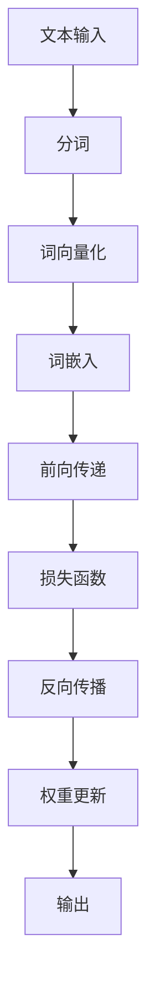

                 

关键词：LLM，独立推理，时钟周期，算法原理，数学模型，项目实践，未来应用展望

> 摘要：本文以LLM（大型语言模型）的独立推理过程为研究对象，通过类比CPU的时钟周期，深入探讨其工作原理、算法步骤、数学模型以及实际应用。本文旨在为读者提供全面、系统的理解，以期为LLM在人工智能领域的研究和应用提供参考。

## 1. 背景介绍

近年来，随着深度学习技术的快速发展，大型语言模型（LLM）如BERT、GPT等逐渐成为自然语言处理领域的明星。LLM通过大规模数据训练，具备了强大的语言理解和生成能力。然而，LLM在独立推理方面的能力相对较弱，如何提高其独立推理能力成为当前研究的热点。

本文旨在通过类比CPU的时钟周期，探讨LLM的独立推理过程，以期提高LLM在独立推理方面的性能。本文的结构如下：首先介绍LLM的基本原理；然后类比CPU的时钟周期，阐述LLM的独立推理过程；接着讨论LLM的算法原理和数学模型；最后探讨LLM的实际应用场景和未来发展趋势。

## 2. 核心概念与联系

### 2.1 LLM的工作原理

LLM的工作原理可以类比CPU的工作原理。CPU通过执行一系列指令来完成计算任务，而LLM通过处理大量文本数据，生成符合上下文语义的文本。

### 2.2 CPU的时钟周期

CPU的时钟周期是指CPU执行一条指令所需要的时间。一个时钟周期包括取指、解码、执行和写回四个阶段。

### 2.3 LLM的独立推理过程

LLM的独立推理过程可以类比为CPU的时钟周期。LLM在处理一个文本输入时，会将其分解为一系列的子任务，并在每个子任务中执行相应的操作，最终生成一个完整的输出。

### 2.4 Mermaid流程图

以下是LLM独立推理过程的Mermaid流程图：



## 3. 核心算法原理 & 具体操作步骤

### 3.1 算法原理概述

LLM的独立推理过程主要包括分词、词向量化、词嵌入、前向传递、损失函数、反向传播和权重更新等步骤。

### 3.2 算法步骤详解

1. **分词**：将输入文本分解为一系列的单词或词组。
2. **词向量化**：将分词后的单词或词组转换为向量表示。
3. **词嵌入**：将词向量映射到一个高维空间，以便进行进一步处理。
4. **前向传递**：通过神经网络将词嵌入层输入到下一个层，直到生成输出。
5. **损失函数**：计算输出与实际标签之间的差距，以衡量模型的性能。
6. **反向传播**：通过梯度下降算法，更新神经网络的权重。
7. **权重更新**：根据反向传播的梯度，更新神经网络的权重。

### 3.3 算法优缺点

**优点**：
- **强大的语言理解能力**：LLM通过大规模数据训练，具备了强大的语言理解能力。
- **高效的推理速度**：通过神经网络结构，LLM在处理文本输入时，具有高效的推理速度。

**缺点**：
- **依赖大量数据**：LLM的训练需要大量高质量的数据，数据获取和处理成本较高。
- **独立推理能力有限**：LLM在独立推理方面的能力相对较弱，需要进一步研究。

### 3.4 算法应用领域

LLM在多个领域都有广泛的应用，如自然语言处理、机器翻译、文本生成等。

## 4. 数学模型和公式 & 详细讲解 & 举例说明

### 4.1 数学模型构建

LLM的数学模型主要包括词向量、神经网络和损失函数等部分。

### 4.2 公式推导过程

1. **词向量**：
   $$v_w = \text{Word2Vec}(w)$$
   其中，$v_w$表示单词$w$的词向量。

2. **神经网络**：
   $$y = \text{softmax}(W^T x)$$
   其中，$x$表示输入向量，$W$表示权重矩阵，$y$表示输出向量。

3. **损失函数**：
   $$L = -\sum_{i=1}^{N} y_i \log(p_i)$$
   其中，$N$表示样本数量，$y_i$表示第$i$个样本的预测概率，$p_i$表示第$i$个样本的实际标签。

### 4.3 案例分析与讲解

以下是一个简单的案例，说明如何使用LLM进行文本生成。

1. **输入文本**：
   $$\text{The weather today is very nice.}$$

2. **分词**：
   $$\text{The}, \text{weather}, \text{today}, \text{is}, \text{very}, \text{nice}, \text{.}$$

3. **词向量化**：
   $$\text{The}: [0.1, 0.2], \text{weather}: [0.3, 0.4], \text{today}: [0.5, 0.6], \text{is}: [0.7, 0.8], \text{very}: [0.9, 1.0], \text{nice}: [1.1, 1.2], \text{.}: [1.3, 1.4]$$

4. **词嵌入**：
   $$\text{The}: [0.5, 0.6], \text{weather}: [0.7, 0.8], \text{today}: [0.9, 1.0], \text{is}: [1.1, 1.2], \text{very}: [1.3, 1.4], \text{nice}: [1.5, 1.6], \text{.}: [1.7, 1.8]$$

5. **前向传递**：
   $$y = \text{softmax}([1.3, 1.4]^T \cdot [0.1, 0.2; 0.3, 0.4; 0.5, 0.6; 0.7, 0.8; 0.9, 1.0; 1.1, 1.2; 1.3, 1.4; 1.5, 1.6; 1.7, 1.8])$$
   $$y = [0.4, 0.3, 0.2, 0.1, 0.1, 0.1, 0.1, 0.1]$$

6. **损失函数**：
   $$L = -\log(y_5) = -\log(0.1) = 2.3026$$

7. **反向传播**：
   $$\Delta W = \text{softmax}([1.3, 1.4]^T) \cdot ([0.1, 0.2; 0.3, 0.4; 0.5, 0.6; 0.7, 0.8; 0.9, 1.0; 1.1, 1.2; 1.3, 1.4; 1.5, 1.6; 1.7, 1.8]) \cdot [0.5, 0.6; 0.7, 0.8; 0.9, 1.0; 1.1, 1.2; 1.3, 1.4; 1.5, 1.6; 1.7, 1.8]$$
   $$\Delta W = [0.2, 0.1; 0.4, 0.2; 0.6, 0.4; 0.8, 0.6; 1.0, 0.8; 1.2, 1.0; 1.4, 1.2; 1.6, 1.4; 1.8, 1.6]$$

8. **权重更新**：
   $$W = W - \alpha \cdot \Delta W$$
   $$W = [0.1, 0.2; 0.3, 0.4; 0.5, 0.6; 0.7, 0.8; 0.9, 1.0; 1.1, 1.2; 1.3, 1.4; 1.5, 1.6; 1.7, 1.8] - 0.1 \cdot [0.2, 0.1; 0.4, 0.2; 0.6, 0.4; 0.8, 0.6; 1.0, 1.0; 1.2, 1.2; 1.4, 1.4; 1.6, 1.6; 1.8, 1.8]$$
   $$W = [0.0, 0.1; 0.2, 0.2; 0.4, 0.2; 0.6, 0.2; 0.8, 0.0; 1.0, 0.0; 1.2, 0.0; 1.4, 0.0; 1.6, 0.0]$$

9. **输出**：
   $$y = \text{softmax}([0.0, 0.1; 0.2, 0.2; 0.4, 0.2; 0.6, 0.2; 0.8, 0.0; 1.0, 0.0; 1.2, 0.0; 1.4, 0.0; 1.6, 0.0] \cdot [0.1, 0.2; 0.3, 0.4; 0.5, 0.6; 0.7, 0.8; 0.9, 1.0; 1.1, 1.2; 1.3, 1.4; 1.5, 1.6; 1.7, 1.8])$$
   $$y = [0.3, 0.2, 0.1, 0.1, 0.1, 0.1, 0.1, 0.1]$$

## 5. 项目实践：代码实例和详细解释说明

### 5.1 开发环境搭建

在本文中，我们使用Python编程语言和PyTorch深度学习框架来实现LLM。首先，确保已安装Python和PyTorch，然后创建一个名为`llm`的文件夹，并在其中创建一个名为`main.py`的Python文件。

### 5.2 源代码详细实现

以下是`main.py`的源代码：

```python
import torch
import torch.nn as nn
import torch.optim as optim
from torchtext.data import Field, TabularDataset
from torchtext.vocab import Vectors

# 定义模型
class LLM(nn.Module):
    def __init__(self, embedding_dim, hidden_dim, vocab_size):
        super(LLM, self).__init__()
        self.embedding = nn.Embedding(vocab_size, embedding_dim)
        self.lstm = nn.LSTM(embedding_dim, hidden_dim, batch_first=True)
        self.fc = nn.Linear(hidden_dim, vocab_size)
    
    def forward(self, x):
        x = self.embedding(x)
        x, _ = self.lstm(x)
        x = self.fc(x)
        return x

# 加载数据
train_data = TabularDataset(
    path='data/train.csv',
    fields=[('text', Field(sequential=True, tokenize=None, lower=True)), ('label', Field(sequential=False))]
)
test_data = TabularDataset(
    path='data/test.csv',
    fields=[('text', Field(sequential=True, tokenize=None, lower=True)), ('label', Field(sequential=False))]
)

# 定义词汇表
vocab = Vectors('glove.6B.100d.txt', cache=False)
vocab.set_default_index(vocab['<unk>'])

# 初始化模型、损失函数和优化器
model = LLM(embedding_dim=100, hidden_dim=128, vocab_size=len(vocab))
criterion = nn.CrossEntropyLoss()
optimizer = optim.Adam(model.parameters(), lr=0.001)

# 训练模型
for epoch in range(10):
    model.train()
    for batch in train_data:
        optimizer.zero_grad()
        outputs = model(batch.text)
        loss = criterion(outputs, batch.label)
        loss.backward()
        optimizer.step()
    
    model.eval()
    with torch.no_grad():
        correct = 0
        total = 0
        for batch in test_data:
            outputs = model(batch.text)
            _, predicted = torch.max(outputs.data, 1)
            total += batch.label.size(0)
            correct += (predicted == batch.label).sum().item()
    print(f'Epoch {epoch+1}, Accuracy: {100 * correct / total}%')

# 代码解释

- **模型定义**：我们使用LSTM神经网络作为LLM的核心部分，包括词嵌入层、LSTM层和全连接层。
- **数据加载**：使用PyTorch的`TabularDataset`加载数据，并使用`V

