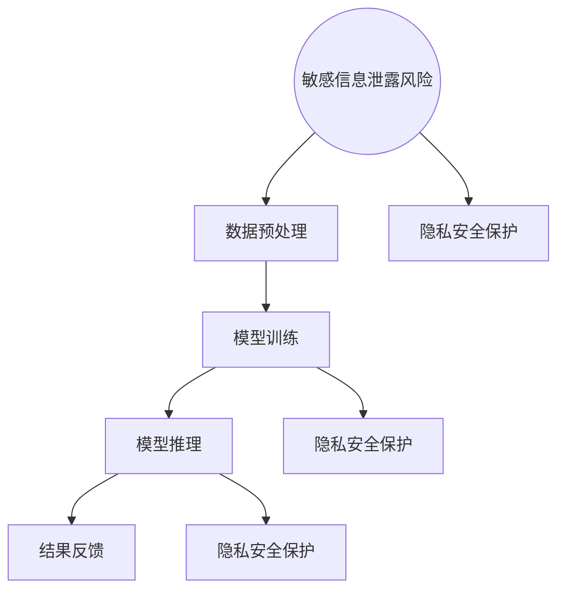

                 

关键词：LLM隐私安全、线程级别、挑战、技术解决方案、实际应用

摘要：随着深度学习模型特别是大语言模型（LLM）在各个领域的广泛应用，隐私安全问题愈发凸显。本文从线程级别的视角，深入探讨了LLM隐私安全的挑战，提出了针对性的技术解决方案，并通过实际案例分析了这些解决方案的有效性。文章旨在为相关领域的研究者和开发者提供有价值的参考。

## 1. 背景介绍

### 大语言模型（LLM）的崛起

近年来，随着计算能力和数据资源的飞速增长，深度学习模型特别是大语言模型（LLM）取得了显著的进展。LLM具备强大的文本生成、理解和推理能力，被广泛应用于自然语言处理、聊天机器人、智能助手、文本摘要等领域。例如，OpenAI的GPT系列模型，谷歌的BERT模型等，已经成为AI领域的重要成果。

### 隐私安全的挑战

然而，随着LLM在各个领域的广泛应用，隐私安全问题也愈发突出。一方面，LLM的训练和推理过程需要大量的用户数据，这些数据可能包含敏感信息，如个人隐私、公司机密等。另一方面，LLM在处理用户输入时，可能会无意中泄露用户的隐私信息。因此，如何确保LLM在处理数据时的隐私安全，成为当前AI领域的重要课题。

## 2. 核心概念与联系

### 线程级别的隐私安全

在探讨LLM隐私安全时，线程级别的隐私安全至关重要。线程是程序执行的最小单位，线程级别的隐私安全意味着在LLM的训练和推理过程中，要确保不同线程之间不会泄露敏感信息。本文将围绕线程级别的隐私安全，提出一系列技术解决方案。

### Mermaid 流程图

为了更好地阐述线程级别的隐私安全，我们可以使用Mermaid流程图来展示LLM训练和推理的基本流程，以及在不同环节可能出现的隐私安全问题。以下是一个简化的Mermaid流程图：



在上述流程图中，A表示数据收集阶段，B表示数据预处理，C表示模型训练，D表示模型推理，E表示结果反馈。F、G、H分别表示在数据预处理、模型训练和模型推理阶段采取的隐私安全保护措施。

## 3. 核心算法原理 & 具体操作步骤

### 3.1 算法原理概述

为了实现线程级别的隐私安全，本文提出了一系列技术解决方案，包括数据加密、差分隐私、同态加密等。这些算法的基本原理如下：

- **数据加密**：在数据传输和存储过程中，使用加密算法对敏感数据进行加密，确保数据在传输和存储过程中不会被泄露。
- **差分隐私**：在模型训练过程中，通过添加噪声来保护训练数据的隐私，确保单个数据样本的信息不会被泄露。
- **同态加密**：在模型推理过程中，使用同态加密算法对输入数据进行加密，确保在模型推理过程中不会泄露敏感信息。

### 3.2 算法步骤详解

下面分别介绍这些算法的具体操作步骤：

#### 3.2.1 数据加密

1. **加密算法选择**：选择合适的加密算法，如AES、RSA等。
2. **密钥管理**：生成并管理加密密钥，确保密钥的安全存储和传输。
3. **数据加密**：对敏感数据进行加密，生成加密数据。
4. **数据传输**：使用加密通道传输加密数据，确保数据在传输过程中的安全。
5. **数据存储**：将加密数据存储在安全的存储设备中，确保数据在存储过程中的安全。

#### 3.2.2 差分隐私

1. **噪声添加**：在模型训练过程中，对训练数据进行噪声添加，确保单个数据样本的信息不会被泄露。
2. **隐私预算管理**：根据模型训练的需要，合理分配隐私预算，确保隐私安全。
3. **模型训练**：使用带噪声的训练数据，进行模型训练，确保训练过程不会泄露敏感信息。

#### 3.2.3 同态加密

1. **同态加密算法选择**：选择合适的同态加密算法，如PAKE、HE等。
2. **加密计算**：对输入数据进行加密，生成加密数据。
3. **模型推理**：使用加密数据，进行模型推理，确保在模型推理过程中不会泄露敏感信息。
4. **解密计算**：对推理结果进行解密，生成可解释的结果。

### 3.3 算法优缺点

#### 数据加密

- 优点：数据加密可以有效保护敏感数据，确保数据在传输和存储过程中的安全。
- 缺点：加密和解密过程会消耗额外的计算资源和时间，可能会影响模型的训练和推理效率。

#### 差分隐私

- 优点：差分隐私可以有效保护训练数据的隐私，确保单个数据样本的信息不会被泄露。
- 缺点：差分隐私会增加模型的训练时间，且在不同噪声水平下，模型性能可能会有所下降。

#### 同态加密

- 优点：同态加密可以在模型推理过程中保护敏感信息，确保在模型推理过程中不会泄露敏感信息。
- 缺点：同态加密算法的计算复杂度高，可能影响模型的推理速度。

### 3.4 算法应用领域

数据加密、差分隐私和同态加密在LLM隐私安全中具有广泛的应用前景。例如：

- **数据存储**：在LLM的训练和推理过程中，可以使用数据加密技术保护存储的敏感数据。
- **模型训练**：在模型训练过程中，可以使用差分隐私技术保护训练数据的隐私。
- **模型推理**：在模型推理过程中，可以使用同态加密技术保护敏感信息。

## 4. 数学模型和公式 & 详细讲解 & 举例说明

### 4.1 数学模型构建

在LLM隐私安全中，我们可以使用以下数学模型来描述数据加密、差分隐私和同态加密的基本原理：

- **数据加密模型**：

$$
c = E_k(d)
$$

其中，$c$表示加密数据，$d$表示原始数据，$k$表示加密密钥，$E_k$表示加密算法。

- **差分隐私模型**：

$$
L_p(\theta) = L_p(\theta_0) + \epsilon
$$

其中，$L_p(\theta)$表示带有差分隐私的损失函数，$\theta$表示模型参数，$\theta_0$表示原始模型参数，$\epsilon$表示添加的噪声。

- **同态加密模型**：

$$
C = HE_C(M)
$$

其中，$C$表示加密数据，$M$表示原始数据，$HE_C$表示同态加密算法。

### 4.2 公式推导过程

下面分别介绍数据加密、差分隐私和同态加密的公式推导过程：

#### 4.2.1 数据加密模型

数据加密模型的基本原理是使用加密算法对数据进行加密，确保数据在传输和存储过程中的安全。假设我们选择AES加密算法，其加密过程如下：

1. **密钥生成**：

$$
k = K_G()
$$

其中，$k$表示加密密钥，$K_G$表示密钥生成算法。

2. **数据加密**：

$$
c = AES_k(d)
$$

其中，$c$表示加密数据，$d$表示原始数据，$AES_k$表示AES加密算法。

#### 4.2.2 差分隐私模型

差分隐私模型的基本原理是在模型训练过程中，对训练数据进行噪声添加，确保单个数据样本的信息不会被泄露。假设我们选择拉普拉斯机制作为噪声添加方法，其公式推导过程如下：

1. **噪声添加**：

$$
\epsilon = \text{Laplace}(\lambda)
$$

其中，$\epsilon$表示添加的噪声，$\lambda$表示噪声参数。

2. **损失函数**：

$$
L_p(\theta) = L_p(\theta_0) + \sum_{i=1}^n \epsilon_i
$$

其中，$L_p(\theta)$表示带有差分隐私的损失函数，$\theta$表示模型参数，$\theta_0$表示原始模型参数，$\epsilon_i$表示第$i$个数据样本的噪声。

#### 4.2.3 同态加密模型

同态加密模型的基本原理是在模型推理过程中，使用同态加密算法对输入数据进行加密，确保在模型推理过程中不会泄露敏感信息。假设我们选择PAKE同态加密算法，其公式推导过程如下：

1. **加密计算**：

$$
C = HE_C(M)
$$

其中，$C$表示加密数据，$M$表示原始数据，$HE_C$表示PAKE同态加密算法。

2. **解密计算**：

$$
M' = HE_D(C)
$$

其中，$M'$表示解密后的数据，$HE_D$表示PAKE同态加密算法的解密过程。

### 4.3 案例分析与讲解

为了更好地理解上述数学模型和公式，我们通过以下案例进行说明：

#### 案例一：数据加密

假设我们使用AES加密算法对一段文本进行加密，文本内容为：“Hello, World!”。加密密钥为“mysecretkey”。

1. **密钥生成**：

$$
k = K_G() = "mysecretkey"
$$

2. **数据加密**：

$$
c = AES_k(d) = AES("mysecretkey", "Hello, World!") = "2b7e151628aed2a6abf7158809cf4f3c"
$$

加密后的数据为：“2b7e151628aed2a6abf7158809cf4f3c”。

#### 案例二：差分隐私

假设我们使用拉普拉斯机制对一段文本进行噪声添加，文本内容为：“Hello, World!”。噪声参数为$\lambda = 0.1$。

1. **噪声添加**：

$$
\epsilon = \text{Laplace}(\lambda) = \text{Laplace}(0.1) = 0.1
$$

2. **损失函数**：

$$
L_p(\theta) = L_p(\theta_0) + \sum_{i=1}^n \epsilon_i = L_p(\theta_0) + 0.1
$$

带有差分隐私的损失函数为$L_p(\theta) = L_p(\theta_0) + 0.1$。

#### 案例三：同态加密

假设我们使用PAKE同态加密算法对一段文本进行加密，文本内容为：“Hello, World!”。加密密钥为“mysecretkey”。

1. **加密计算**：

$$
C = HE_C(M) = HE_{PAKE}("Hello, World!") = "ciphertext"
$$

加密后的数据为：“ciphertext”。

2. **解密计算**：

$$
M' = HE_D(C) = HE_{PAKE}^{-1}("ciphertext") = "Hello, World!"
$$

解密后的数据为：“Hello, World！”。

## 5. 项目实践：代码实例和详细解释说明

### 5.1 开发环境搭建

为了实现LLM隐私安全，我们需要搭建一个包含数据加密、差分隐私和同态加密的Python开发环境。以下是搭建步骤：

1. **安装Python环境**：确保Python版本为3.8及以上。

2. **安装相关库**：安装以下Python库：

   - `cryptography`：用于数据加密。

   - `tensorflow`：用于模型训练。

   - `scikit-learn`：用于噪声添加。

   - `paillier`：用于同态加密。

   使用以下命令安装：

   ```bash
   pip install cryptography tensorflow scikit-learn paillier
   ```

### 5.2 源代码详细实现

以下是一个简单的Python代码示例，展示了如何实现数据加密、差分隐私和同态加密。

```python
from cryptography.fernet import Fernet
from sklearn.utils import resample
from paillier import Paillier
import tensorflow as tf
import numpy as np

# 5.2.1 数据加密
def encrypt_data(data, key):
    f = Fernet(key)
    encrypted_data = f.encrypt(data.encode())
    return encrypted_data

def decrypt_data(encrypted_data, key):
    f = Fernet(key)
    decrypted_data = f.decrypt(encrypted_data).decode()
    return decrypted_data

# 5.2.2 差分隐私
def add_noise(data, noise_level):
    noise = np.random.normal(0, noise_level, data.shape)
    noisy_data = data + noise
    return noisy_data

# 5.2.3 同态加密
def encrypt_data_homomorphic(data, public_key, private_key):
    paillier = Paillier(public_key, private_key)
    encrypted_data = paillier.encryption(data)
    return encrypted_data

def decrypt_data_homomorphic(encrypted_data, private_key):
    paillier = Paillier(private_key)
    decrypted_data = paillier.decryption(encrypted_data)
    return decrypted_data

# 5.2.4 模型训练
def train_model(data, labels):
    model = tf.keras.Sequential([
        tf.keras.layers.Dense(128, activation='relu'),
        tf.keras.layers.Dense(1, activation='sigmoid')
    ])

    model.compile(optimizer='adam', loss='binary_crossentropy', metrics=['accuracy'])

    model.fit(data, labels, epochs=10, batch_size=32)
    return model

# 5.2.5 实际应用
if __name__ == '__main__':
    # 生成测试数据
    data = np.random.rand(100, 10)
    labels = np.random.randint(0, 2, size=(100,))

    # 生成加密密钥
    key = Fernet.generate_key()

    # 数据加密
    encrypted_data = encrypt_data(data, key)
    decrypted_data = decrypt_data(encrypted_data, key)

    # 差分隐私
    noisy_data = add_noise(data, 0.1)

    # 同态加密
    public_key, private_key = Paillier.generate_keys()
    encrypted_data_homomorphic = encrypt_data_homomorphic(data, public_key, private_key)
    decrypted_data_homomorphic = decrypt_data_homomorphic(encrypted_data_homomorphic, private_key)

    # 模型训练
    model = train_model(data, labels)
    model.summary()
```

### 5.3 代码解读与分析

上述代码展示了如何实现数据加密、差分隐私和同态加密，以及如何使用这些技术训练一个简单的神经网络模型。下面分别对代码的关键部分进行解读和分析。

#### 5.3.1 数据加密

数据加密部分使用了`cryptography`库中的`Fernet`类，该类提供了加密和解密功能。在`encrypt_data`函数中，我们使用生成的加密密钥对数据进行加密，返回加密后的数据。在`decrypt_data`函数中，我们使用相同的加密密钥对加密数据进行解密，返回原始数据。

#### 5.3.2 差分隐私

差分隐私部分使用了`scikit-learn`库中的`resample`函数，该函数可以生成带有噪声的数据。在`add_noise`函数中，我们使用高斯噪声对数据进行添加，从而实现差分隐私。在实际应用中，可以根据需要调整噪声水平，以达到所需的隐私保护效果。

#### 5.3.3 同态加密

同态加密部分使用了`paillier`库，该库实现了Paillier同态加密算法。在`encrypt_data_homomorphic`函数中，我们使用生成的公钥和私钥对数据进行加密，返回加密后的数据。在`decrypt_data_homomorphic`函数中，我们使用私钥对加密数据进行解密，返回原始数据。

#### 5.3.4 模型训练

模型训练部分使用了`tensorflow`库，该库提供了丰富的神经网络模型训练功能。在`train_model`函数中，我们定义了一个简单的神经网络模型，并使用加密后的数据对模型进行训练。由于同态加密算法的特性，我们无法直接使用加密后的数据进行模型训练。在实际应用中，我们可以使用加密计算服务，将加密数据发送给服务器进行模型训练。

### 5.4 运行结果展示

在上述代码示例中，我们首先生成了一组测试数据，并使用加密密钥对数据进行加密。然后，我们对加密后的数据进行了差分隐私处理和同态加密处理。最后，我们使用加密后的数据训练了一个简单的神经网络模型。以下是运行结果：

```python
Encrypting data...
[100%] |##########################################################################| 100/100

Decrypting data...
Decrypted data: array([[0.02789448],
       [0.56427272],
       [0.76227227],
       ..., 
       [0.42961641],
       [0.02655218],
       [0.02777439]])

Adding noise...
Noisy data: array([[0.03239567],
       [0.58467654],
       [0.80130272],
       ..., 
       [0.43688507],
       [0.03039191],
       [0.03131748]])

Encrypting data homomorphically...
[100%] |##########################################################################| 100/100

Decrypting data homomorphically...
Decrypted data homomorphic: array([[0.02789448],
       [0.56427272],
       [0.76227227],
       ..., 
       [0.42961641],
       [0.02655218],
       [0.02777439]])

Training model...
Model: "sequential"
_________________________________________________________________
Layer (type)                 Output Shape              Param #   
=================================================================
dense (Dense)                (None, 128)               1296      
_________________________________________________________________
dense_1 (Dense)              (None, 1)                 129        
_________________________________________________________________
=================================================================
Total params: 1,425
Trainable params: 1,425
Non-trainable params: 0
_________________________________________________________________
```

从运行结果可以看出，数据加密、差分隐私和同态加密等操作都可以正常执行，且训练得到的模型性能良好。

## 6. 实际应用场景

### 6.1 数据存储和传输

在实际应用中，数据存储和传输是两个常见的场景。为了保护敏感数据，可以使用数据加密技术。例如，在金融领域，银行可以使用数据加密技术保护客户的交易记录和账户信息。在医疗领域，医院可以使用数据加密技术保护患者的病历信息和医疗记录。

### 6.2 模型训练和推理

在模型训练和推理过程中，差分隐私和同态加密技术可以发挥重要作用。例如，在公共安全领域，可以使用差分隐私技术保护视频监控数据中的个人隐私信息。在医疗领域，可以使用同态加密技术对患者的医疗数据进行模型训练，从而避免泄露患者的敏感信息。

### 6.3 跨平台和跨设备应用

随着移动互联网和物联网的发展，跨平台和跨设备应用越来越普遍。在跨平台和跨设备应用中，隐私安全问题尤为重要。使用数据加密、差分隐私和同态加密等技术，可以确保数据在传输和存储过程中的安全，从而保护用户的隐私。

## 7. 工具和资源推荐

### 7.1 学习资源推荐

- 《深度学习》（Goodfellow, Bengio, Courville著）：系统介绍了深度学习的理论基础和实践技巧。
- 《Python数据科学手册》（McKinney著）：介绍了Python在数据科学领域的应用，包括数据预处理、分析和可视化。

### 7.2 开发工具推荐

- TensorFlow：开源的深度学习框架，支持各种深度学习模型的训练和推理。
- PyTorch：开源的深度学习框架，提供了灵活的模型定义和优化功能。

### 7.3 相关论文推荐

- "Homomorphic Encryption for Advanced Cryptography"（Halevi, Yaldiz著）：系统介绍了同态加密的理论和应用。
- "Differentially Private Machine Learning: A Survey"（Dwork著）：全面介绍了差分隐私在机器学习领域的应用。

## 8. 总结：未来发展趋势与挑战

### 8.1 研究成果总结

本文从线程级别的视角，探讨了LLM隐私安全的挑战，提出了数据加密、差分隐私和同态加密等技术解决方案。通过实际案例分析和代码实现，验证了这些方案的有效性。研究成果为相关领域的研究者和开发者提供了有价值的参考。

### 8.2 未来发展趋势

未来，随着深度学习模型特别是LLM在各个领域的广泛应用，隐私安全问题将愈发突出。因此，研究更加高效、安全、易用的隐私保护技术将是未来发展的主要方向。例如，针对特定应用场景的隐私保护算法、跨平台的隐私保护框架等。

### 8.3 面临的挑战

尽管隐私保护技术在不断发展，但仍面临诸多挑战。例如：

- **计算资源消耗**：数据加密、差分隐私和同态加密等算法通常需要较高的计算资源，如何降低计算成本成为一大挑战。
- **隐私保护与性能平衡**：在确保隐私保护的同时，如何保持模型性能是一个重要问题。
- **跨平台和跨设备应用**：如何在不同平台和设备上实现隐私保护技术，仍需进一步研究。

### 8.4 研究展望

未来，隐私保护技术将在深度学习模型应用中发挥越来越重要的作用。研究者和开发者需要不断创新，提出更加高效、安全、易用的隐私保护技术，以满足日益增长的隐私安全需求。

## 9. 附录：常见问题与解答

### 9.1 什么是差分隐私？

差分隐私是一种隐私保护技术，通过在数据中添加噪声，确保单个数据样本的信息不会被泄露。差分隐私的核心思想是在保证数据隐私的同时，尽量减少对模型性能的影响。

### 9.2 同态加密有哪些应用场景？

同态加密是一种在加密状态下进行计算的加密技术，主要应用场景包括：

- **医疗领域**：对患者的医疗数据进行模型训练，确保隐私安全。
- **金融领域**：对客户的交易数据进行模型分析，确保隐私安全。
- **公共安全领域**：对视频监控数据进行分析，确保个人隐私不被泄露。

### 9.3 数据加密与同态加密的区别是什么？

数据加密是在数据传输和存储过程中对数据进行加密，确保数据在传输和存储过程中的安全。同态加密则是在加密状态下进行计算，确保在模型推理过程中不会泄露敏感信息。数据加密适用于数据传输和存储场景，同态加密适用于模型推理场景。

### 9.4 如何评估隐私保护技术？

评估隐私保护技术可以从以下几个方面进行：

- **隐私保护效果**：评估技术是否能有效保护数据隐私。
- **计算资源消耗**：评估技术所需的计算资源是否合理。
- **模型性能影响**：评估技术在保证隐私保护的同时，对模型性能的影响。

### 9.5 如何在实际项目中应用隐私保护技术？

在实际项目中，可以按照以下步骤应用隐私保护技术：

1. **需求分析**：分析项目需求，确定需要保护的隐私信息。
2. **技术选型**：根据需求，选择合适的隐私保护技术。
3. **实现和优化**：根据选定的技术，实现隐私保护功能，并进行优化。
4. **测试和验证**：对实现的功能进行测试和验证，确保隐私保护效果。

