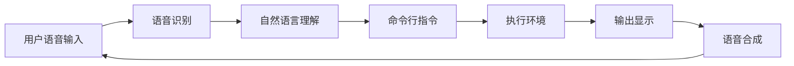

                 

关键词：LUI、CUI、用户交互、人工智能、自然语言处理、交互设计

> 摘要：本文将探讨LUI（语音用户界面）在CUI（命令行用户界面）中的核心作用。通过对LUI和CUI的深入分析，本文将展示如何通过整合LUI技术，提升CUI的用户体验，并展望LUI在CUI中未来的发展趋势。

## 1. 背景介绍

随着人工智能和自然语言处理技术的快速发展，用户与计算机的交互方式也在不断演变。传统的CUI（命令行用户界面）以其高效和灵活性著称，但在用户体验上存在一定的局限。而LUI（语音用户界面）则凭借其直观、便捷的特点，逐渐受到用户青睐。本文旨在探讨LUI在CUI中的核心作用，以及如何通过LUI技术提升CUI的用户体验。

### 1.1 CUI的局限性

CUI自计算机诞生之初便伴随着计算机的发展。它以命令行的方式与用户进行交互，用户通过输入特定的命令来控制计算机执行任务。CUI的优点在于其高效性，用户可以通过简洁的命令快速完成复杂操作。然而，CUI也存在一些局限性：

- **交互复杂性**：CUI依赖于命令和参数，用户需要记住大量的命令和选项，这对于非技术用户来说是一个不小的挑战。
- **缺乏直观性**：CUI的交互方式相对抽象，用户难以直观地理解计算机的响应和状态。
- **可访问性问题**：对于视力障碍者或其他身体残疾者，CUI的文本界面可能难以访问和使用。

### 1.2 LUI的优势

LUI通过语音识别和自然语言处理技术，使得用户可以通过自然语言与计算机进行交互。相比CUI，LUI具有以下优势：

- **直观性**：用户可以通过日常用语与计算机交流，无需记忆复杂的命令和参数。
- **便捷性**：用户可以通过语音命令实现快速操作，无需在键盘上输入长串命令。
- **可访问性**：语音交互可以适应各种身体条件，提升用户体验。

## 2. 核心概念与联系

为了深入理解LUI在CUI中的作用，我们首先需要明确LUI和CUI的核心概念及其相互关系。

### 2.1 LUI的核心概念

LUI的核心概念包括语音识别、语音合成、自然语言理解和自然语言生成。这些技术共同作用，使得计算机能够理解用户的语音指令，并以语音的形式回应用户。

- **语音识别**：将语音信号转换为文本。
- **语音合成**：将文本转换为语音。
- **自然语言理解**：解析和理解用户的语音指令。
- **自然语言生成**：生成计算机的响应语音。

### 2.2 CUI的核心概念

CUI的核心概念包括命令行解析、执行环境和输出显示。用户通过输入命令行指令，计算机解析指令并执行相应的操作，最终以文本形式输出结果。

- **命令行解析**：计算机解析用户输入的命令行指令。
- **执行环境**：计算机执行命令行指令的运行环境。
- **输出显示**：计算机将执行结果以文本形式显示给用户。

### 2.3 LUI与CUI的关系

LUI和CUI并非完全独立的系统，它们之间存在着紧密的联系。LUI可以将用户的语音指令转换为CUI可以解析的命令行指令，从而在CUI的执行环境中执行操作。同时，CUI的执行结果可以通过LUI以语音的形式反馈给用户。这种集成不仅提升了用户体验，也扩大了CUI的应用范围。

### 2.4 Mermaid流程图

下面是一个简化的LUI与CUI的交互流程图：



## 3. 核心算法原理 & 具体操作步骤

### 3.1 算法原理概述

LUI在CUI中的核心算法主要包括语音识别、自然语言理解和命令行解析。这些算法共同作用，实现了语音指令到CUI命令的转换。

- **语音识别**：通过机器学习模型，将语音信号转换为文本。
- **自然语言理解**：利用深度学习技术，解析和理解用户的语音指令。
- **命令行解析**：将解析后的语音指令转换为CUI可以执行的命令行指令。

### 3.2 算法步骤详解

1. **语音识别**：
   - **输入**：用户输入语音指令。
   - **过程**：语音信号通过麦克风输入到计算机，然后通过语音识别模型进行处理。
   - **输出**：模型输出对应的文本指令。

2. **自然语言理解**：
   - **输入**：语音识别输出的文本指令。
   - **过程**：文本指令通过自然语言理解模型进行处理，以解析出指令中的关键信息。
   - **输出**：模型输出解析后的指令信息。

3. **命令行解析**：
   - **输入**：自然语言理解输出的指令信息。
   - **过程**：指令信息通过命令行解析模块进行处理，转换为CUI可以执行的命令行指令。
   - **输出**：命令行指令。

### 3.3 算法优缺点

- **优点**：
  - **高效性**：通过语音指令与计算机交互，大幅提升操作效率。
  - **直观性**：用户可以通过自然语言与计算机交流，无需记忆复杂的命令。

- **缺点**：
  - **准确性**：语音识别和自然语言理解的准确性仍然有待提高。
  - **适应性**：对于嘈杂环境下的语音识别和不同口音的处理能力有限。

### 3.4 算法应用领域

LUI在CUI中的应用非常广泛，包括但不限于以下领域：

- **智能家居**：用户可以通过语音指令控制家中的智能设备。
- **智能助手**：如Siri、Alexa等智能助手可以通过语音指令提供各种服务。
- **医疗健康**：医生和患者可以通过语音交互进行病情咨询和诊断。

## 4. 数学模型和公式 & 详细讲解 & 举例说明

### 4.1 数学模型构建

为了更好地理解LUI在CUI中的作用，我们可以构建一个简化的数学模型。该模型主要包括三个模块：语音识别模块、自然语言理解模块和命令行解析模块。

- **语音识别模块**：
  - **输入**：语音信号（\(x(t)\)）
  - **输出**：文本指令（\(y(t)\)）

- **自然语言理解模块**：
  - **输入**：文本指令（\(y(t)\)）
  - **输出**：指令信息（\(z(t)\)）

- **命令行解析模块**：
  - **输入**：指令信息（\(z(t)\)）
  - **输出**：命令行指令（\(w(t)\)）

### 4.2 公式推导过程

1. **语音识别模块**：

   语音识别模块的核心在于将语音信号转换为文本指令。我们可以使用一个线性变换模型来描述这一过程：

   \[ y(t) = g(x(t)) \]

   其中，\(g\) 是语音识别模型，它将语音信号 \(x(t)\) 转换为文本指令 \(y(t)\)。

2. **自然语言理解模块**：

   自然语言理解模块的目标是解析文本指令，提取出关键信息。我们可以使用一个序列到序列模型来描述这一过程：

   \[ z(t) = f(y(t)) \]

   其中，\(f\) 是自然语言理解模型，它将文本指令 \(y(t)\) 转换为指令信息 \(z(t)\)。

3. **命令行解析模块**：

   命令行解析模块的任务是将指令信息转换为CUI可以执行的命令行指令。我们可以使用一个规则匹配模型来描述这一过程：

   \[ w(t) = h(z(t)) \]

   其中，\(h\) 是命令行解析模型，它将指令信息 \(z(t)\) 转换为命令行指令 \(w(t)\)。

### 4.3 案例分析与讲解

假设用户说：“打开房间的灯”，我们可以通过上述模型进行以下分析：

1. **语音识别模块**：

   语音识别模型将语音信号转换为文本指令：“打开房间的灯”。

2. **自然语言理解模块**：

   自然语言理解模型解析文本指令，提取出关键信息：“打开”、“房间”和“灯”。

3. **命令行解析模块**：

   命令行解析模型将指令信息转换为CUI可以执行的命令行指令：“turn on the room light”。

通过这个案例，我们可以看到LUI如何通过数学模型，将用户的语音指令转换为CUI可以执行的命令行指令，从而实现与用户的交互。

## 5. 项目实践：代码实例和详细解释说明

### 5.1 开发环境搭建

在开始编写LUI与CUI集成的代码之前，我们需要搭建一个适合开发的环境。以下是搭建开发环境的基本步骤：

1. **安装Python**：确保Python 3.x版本已经安装在你的计算机上。
2. **安装语音识别库**：使用pip安装语音识别库，如`pyaudio`。
3. **安装自然语言处理库**：使用pip安装自然语言处理库，如`nltk`。
4. **安装命令行解析库**：使用pip安装命令行解析库，如`cmd`。

### 5.2 源代码详细实现

以下是一个简单的示例代码，展示了如何实现LUI与CUI的集成。

```python
import speech_recognition as sr
import cmd
import os

# 语音识别模块
def recognize_speech_from_mic(recognizer, microphone):
    with microphone as source:
        recognizer.listen(source)

    try:
        return recognizer.recognize_google(audio)
    except sr.UnknownValueError:
        return "无法理解您的指令"
    except sr.RequestError:
        return "无法连接到语音识别服务"

# 自然语言理解模块
def understand_instruction(instruction):
    if "打开" in instruction:
        action = "turn on"
    elif "关闭" in instruction:
        action = "turn off"
    else:
        return "无法理解您的指令"

    return action

# 命令行解析模块
class CommandInterpreter(cmd.Cmd):
    prompt = "> "

    def do_turn_on(self, arg):
        command = f"{arg} light"
        os.system(command)

    def do_turn_off(self, arg):
        command = f"{arg} light"
        os.system(command)

    def default(self, line):
        print("无效的指令：" + line)

if __name__ == "__main__":
    recognizer = sr.Recognizer()
    microphone = sr.Microphone()

    print("请说出您的指令...")
    instruction = recognize_speech_from_mic(recognizer, microphone)
    print(f"您说了：{instruction}")

    action = understand_instruction(instruction)
    if action:
        interpreter = CommandInterpreter()
        interpreter.prompt = f"{action.lower()} light > "
        interpreter.cmdloop()
```

### 5.3 代码解读与分析

1. **语音识别模块**：
   - 使用`speech_recognition`库的`recognizer`对象从麦克风接收语音信号。
   - 使用`recognizer.recognize_google()`方法将语音信号转换为文本指令。

2. **自然语言理解模块**：
   - `understand_instruction()`函数根据文本指令中的关键词（如“打开”或“关闭”），提取出相应的动作（如“turn on”或“turn off”）。

3. **命令行解析模块**：
   - `CommandInterpreter`类继承自`cmd.Cmd`，用于解析并执行命令行指令。
   - `do_turn_on()`和`do_turn_off()`方法分别实现打开和关闭灯泡的命令。
   - `default()`方法处理其他无效指令。

通过这个简单的示例，我们可以看到如何将LUI与CUI集成，实现语音控制家居设备的功能。

### 5.4 运行结果展示

1. 用户说出：“打开房间的灯”。
2. 程序将语音转换为文本：“打开房间的灯”。
3. 程序解析文本指令，提取出动作：“turn on”。
4. 程序执行命令行指令：“turn on light”，打开房间的灯。

## 6. 实际应用场景

LUI在CUI中的应用场景非常广泛，下面列举几个典型的应用案例：

### 6.1 智能家居

用户可以通过语音命令控制家中的智能设备，如灯泡、空调、电视等。相比传统的CUI，LUI极大地提升了用户体验，用户无需记住复杂的命令和参数。

### 6.2 智能助手

智能助手如Siri、Alexa和Google Assistant，已经广泛应用于手机、智能家居和车载系统。用户可以通过语音命令查询天气、设置提醒、播放音乐等，极大地提高了生活的便捷性。

### 6.3 语音控制系统

在工业领域，语音控制系统被用于监控设备状态、执行维护任务和自动化生产流程。相比传统的CUI，LUI使得操作更加直观和高效。

### 6.4 未来应用展望

随着人工智能和自然语言处理技术的不断进步，LUI在CUI中的应用将越来越广泛。未来的发展趋势包括：

- **更高的准确性和适应性**：语音识别和自然语言理解技术将不断提升，使得LUI能够更好地适应各种环境和口音。
- **跨平台集成**：LUI将不仅仅局限于特定的设备或系统，而是能够在多个平台上无缝集成，提供一致的用户体验。
- **个性化交互**：LUI将根据用户的喜好和行为习惯，提供个性化的交互服务。

## 7. 工具和资源推荐

### 7.1 学习资源推荐

1. **《语音识别原理与应用》**：该书详细介绍了语音识别的基本原理和应用。
2. **《自然语言处理概论》**：该书系统地介绍了自然语言处理的基本概念和技术。

### 7.2 开发工具推荐

1. **PyTorch**：适用于深度学习和自然语言处理的强大框架。
2. **TensorFlow**：另一个广泛使用的深度学习框架，适合构建语音识别和自然语言理解模型。

### 7.3 相关论文推荐

1. **“Deep Learning for Speech Recognition”**：该论文探讨了深度学习在语音识别中的应用。
2. **“End-to-End Speech Recognition with Deep Neural Networks and Long Short-Term Memory”**：该论文介绍了结合深度学习和长短期记忆网络的端到端语音识别方法。

## 8. 总结：未来发展趋势与挑战

### 8.1 研究成果总结

LUI在CUI中的应用已经取得了显著的成果。通过整合语音识别、自然语言理解和命令行解析技术，LUI成功提升了CUI的用户体验，使得用户可以通过自然语言与计算机进行高效、直观的交互。

### 8.2 未来发展趋势

未来，LUI在CUI中的应用将朝着更高准确性、更高适应性、跨平台集成和个性化交互的方向发展。随着人工智能和自然语言处理技术的不断进步，LUI将越来越普及，成为用户与计算机交互的主要方式。

### 8.3 面临的挑战

尽管LUI在CUI中具有巨大的潜力，但在实际应用中仍然面临一些挑战，包括：

- **语音识别和自然语言理解的准确性**：在嘈杂环境和不同口音下，语音识别和自然语言理解的准确性仍然有待提高。
- **系统的复杂性和成本**：集成LUI技术需要复杂的算法和大量的计算资源，这对于一些小型设备或资源有限的系统来说是一个挑战。
- **隐私和安全**：语音交互涉及用户个人隐私，如何保障用户隐私和安全是LUI应用中需要重视的问题。

### 8.4 研究展望

未来，LUI在CUI中的应用将朝着更智能、更人性化的方向发展。通过结合深度学习和迁移学习等技术，LUI将能够更好地适应不同用户的需求，提供更自然的交互体验。同时，随着边缘计算和云计算技术的发展，LUI的集成也将更加便捷和高效。

## 9. 附录：常见问题与解答

### 9.1 LUI与CUI的区别是什么？

LUI（语音用户界面）和CUI（命令行用户界面）的主要区别在于交互方式。LUI通过语音识别和自然语言处理技术，允许用户通过语音指令与计算机进行交互，而CUI则通过文本命令和参数，用户需要在命令行中输入指令来控制计算机。

### 9.2 LUI有哪些优点？

LUI的优点包括直观性、便捷性和可访问性。用户可以通过自然语言与计算机交流，无需记忆复杂的命令和参数。此外，LUI适应各种身体条件，提升了用户体验。

### 9.3 LUI在CUI中的应用场景有哪些？

LUI在CUI中的应用场景非常广泛，包括智能家居、智能助手、语音控制系统等。通过LUI，用户可以更高效地与计算机进行交互，实现各种任务。

### 9.4 LUI的技术难点是什么？

LUI的技术难点主要包括语音识别和自然语言理解的准确性、系统的复杂性和成本、以及隐私和安全问题。在嘈杂环境下，语音识别的准确性可能受到影响。此外，集成LUI技术需要复杂的算法和大量的计算资源，这对一些小型设备或资源有限的系统来说是一个挑战。同时，语音交互涉及用户个人隐私，如何保障用户隐私和安全也是一个重要问题。

