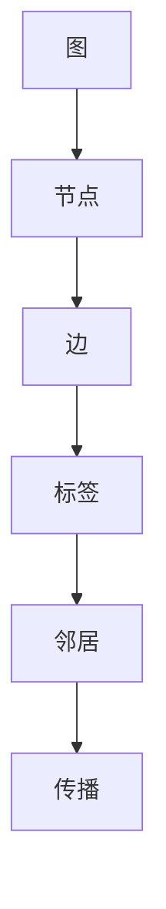

                 

标签传播算法（Label Propagation，LP）是一种基于图论的概率图模型，它被广泛应用于社区发现、社会网络分析、图像分割等领域。本文将深入探讨Label Propagation算法的原理、数学模型、代码实现及其实际应用场景，旨在为读者提供一个全面而深入的理解。

## 关键词

- Label Propagation
- 社区发现
- 图论
- 社会网络分析
- 图像分割

## 摘要

本文首先介绍了标签传播算法的背景和基本概念，接着详细讲解了算法的原理和步骤，并分析了其优缺点和应用领域。随后，通过数学模型和具体公式推导，对算法进行了深入剖析。最后，通过代码实例展示了算法的实践应用，并探讨了其在实际应用场景中的未来发展方向。

## 1. 背景介绍

标签传播算法起源于社会网络分析领域，其目的是通过传播标签来发现网络中的社区结构。在现实世界中，很多复杂系统都可以抽象成图结构，例如社交网络、蛋白质相互作用网络、交通网络等。这些网络中的节点和边分别代表了系统中的实体及其关系。标签传播算法通过对这些标签的传播，帮助我们发现网络中的紧密联系区域，即社区。

社区发现（Community Detection）是指在网络图中寻找具有高内部连接度和低外部连接度的子图。这一过程对于理解网络结构的层次性和模块性至关重要。标签传播算法因其简单高效的特点，成为社区发现领域的一种重要工具。

### 1.1 算法起源

标签传播算法最早由Girvan和Newman提出，其核心思想是通过在图中传播标签，使得具有相似属性的节点聚集在一起。这一思想可以追溯到传统的标签传播模型，如Sznajd模型和Kemeny-Young规则。

### 1.2 算法重要性

标签传播算法在多个领域具有重要应用：

- **社会网络分析**：用于识别社交网络中的紧密联系群体。
- **图像分割**：通过将像素标签传播，实现图像的自动分割。
- **生物信息学**：用于分析蛋白质相互作用网络，发现生物分子之间的合作关系。
- **复杂网络**：用于揭示网络结构的层次性和模块性。

## 2. 核心概念与联系

为了深入理解标签传播算法，我们需要明确以下几个核心概念：图、节点、边、标签、邻居等。以下是一个简单的Mermaid流程图，用于描述这些概念之间的联系。



### 2.1 图与节点

图是由节点（也称为顶点）和边（也称为边或连接）组成的数学结构。在标签传播算法中，节点代表图中的实体，边代表实体之间的关系。

### 2.2 边与标签

边可以赋予权重或标签，表示节点之间的相似程度或关联强度。标签传播算法利用这些标签来引导节点的标签更新。

### 2.3 节点与邻居

每个节点都有一个邻居集合，即与其相连的其他节点。邻居的标签值直接影响当前节点的标签更新。

### 2.4 传播过程

标签传播是通过更新节点标签来实现的。一个节点的标签会根据其邻居的标签进行更新，以达到均衡状态。

## 3. 核心算法原理 & 具体操作步骤

### 3.1 算法原理概述

标签传播算法的基本原理是：一个节点的标签会根据其邻居的标签进行更新，以最小化系统中的标签分散度。具体来说，算法步骤如下：

1. **初始化**：每个节点都分配一个唯一的初始标签。
2. **迭代更新**：在每次迭代中，每个节点会根据其邻居的标签进行更新。更新规则可以是基于多数表决（Majority Rule）或最小化标签分散度（Minimize Label Discrepancy）。
3. **收敛判断**：当节点的标签变化足够小或达到预设的迭代次数时，算法停止。

### 3.2 算法步骤详解

1. **初始化**：给定一个图，每个节点被赋予一个初始标签。这些标签可以是随机分配的，也可以是基于某种特征值。

2. **邻居选择**：每个节点选择其邻居，即与其直接相连的其他节点。

3. **标签更新**：在每个迭代步，每个节点根据其邻居的标签进行更新。更新规则可以表示为：

   \[ \text{新标签} = \arg\min_{l} \sum_{n \in \text{邻居}} |\text{邻居标签} - l| \]

   其中，\( l \) 是当前节点的标签，邻居标签是指其邻居的标签。

4. **迭代更新**：重复步骤3，直到节点的标签变化小于一个预设的阈值或达到最大迭代次数。

### 3.3 算法优缺点

**优点**：

- **简单性**：算法结构简单，易于理解和实现。
- **效率高**：迭代次数较少，计算速度快。
- **灵活性**：可以适用于不同的网络结构和标签类型。

**缺点**：

- **结果依赖初始标签**：算法结果可能受初始标签影响较大。
- **难以处理动态网络**：对于动态变化的网络，算法需要重新初始化和更新。

### 3.4 算法应用领域

标签传播算法在多个领域有广泛应用，包括：

- **社区发现**：用于发现社交网络中的紧密联系群体。
- **图像分割**：通过标签传播实现图像的自动分割。
- **生物信息学**：用于分析蛋白质相互作用网络，发现生物分子之间的合作关系。
- **复杂网络**：用于揭示网络结构的层次性和模块性。

## 4. 数学模型和公式 & 详细讲解 & 举例说明

### 4.1 数学模型构建

标签传播算法的核心是一个概率模型，用于描述节点标签的传播过程。假设图中每个节点的标签是一个离散随机变量，其取值范围是\( L = \{1, 2, ..., K\} \)，其中\( K \)是标签的种类数。节点的标签更新过程可以表示为：

\[ P(u, l) = \frac{\sum_{n \in \text{邻居}(u)} w_{un} P(n, l)}{\sum_{l' \in L} \sum_{n \in \text{邻居}(u)} w_{un} P(n, l')} \]

其中，\( P(u, l) \)是节点\( u \)在时间\( t \)拥有标签\( l \)的概率，\( w_{un} \)是节点\( u \)和邻居\( n \)之间的权重，它表示节点\( u \)和邻居\( n \)之间的相似度。

### 4.2 公式推导过程

标签传播算法的推导基于概率图模型。假设图中每个节点的标签是一个随机变量，其分布满足马尔可夫性质，即：

\[ P(u, l | v) = P(u, l | v, n) \]

其中，\( v \)是节点的邻居集合。这意味着节点的标签只与邻居的标签有关，而与更远的邻居无关。

在给定邻居标签的条件下，节点\( u \)的标签概率可以表示为：

\[ P(u, l | v) = \frac{\sum_{l' \in L} w_{u l'} \prod_{n \in v} w_{n l'}}{\sum_{l' \in L} \prod_{n \in v} w_{n l'}} \]

其中，\( w_{ul'} \)是节点\( u \)和邻居\( n \)之间的权重，\( \prod_{n \in v} w_{n l'} \)是邻居标签的联合概率。

为了简化计算，我们通常使用最大化后验概率（MAP）规则来更新节点的标签：

\[ \hat{l} = \arg\max_{l} \sum_{n \in v} w_{un} P(n, l) \]

其中，\( \hat{l} \)是节点\( u \)的新标签。

### 4.3 案例分析与讲解

假设有一个图，其中包含5个节点，节点的标签分别为1、2、3、4、5。每个节点的邻居及其权重如下表所示：

| 节点 | 邻居 | 权重 |
| --- | --- | --- |
| 1 | 2, 3 | 0.5, 0.5 |
| 2 | 1, 3, 4 | 0.5, 0.3, 0.2 |
| 3 | 1, 2, 4, 5 | 0.5, 0.3, 0.2, 0.4 |
| 4 | 2, 3 | 0.5, 0.5 |
| 5 | 3 | 0.4 |

假设初始标签为随机分配的，即每个节点的标签概率相等。在第一次迭代中，每个节点的标签更新如下：

- 节点1的新标签为2，因为 \( P(1|2) = 0.5 \) 和 \( P(1|3) = 0.5 \)，且 \( P(2) > P(3) \)。
- 节点2的新标签为3，因为 \( P(2|1) = 0.5 \)，\( P(2|3) = 0.3 \)，和 \( P(2|4) = 0.2 \)，且 \( P(3) > P(2) \) 和 \( P(3) > P(4) \)。
- 节点3的新标签为3，因为 \( P(3|1) = 0.5 \)，\( P(3|2) = 0.3 \)，\( P(3|4) = 0.2 \)，和 \( P(3|5) = 0.4 \)，且 \( P(3) > P(1) \)，\( P(3) > P(2) \)，\( P(3) > P(4) \) 和 \( P(3) > P(5) \)。
- 节点4的新标签为3，因为 \( P(4|2) = 0.5 \) 和 \( P(4|3) = 0.5 \)，且 \( P(3) > P(2) \) 和 \( P(3) > P(4) \)。
- 节点5的新标签为3，因为 \( P(5|3) = 0.4 \)，且 \( P(3) > P(5) \)。

在第二次迭代中，每个节点的标签更新如下：

- 节点1的新标签为3，因为 \( P(1|2) = 0.5 \) 和 \( P(1|3) = 0.5 \)，且 \( P(3) > P(2) \)。
- 节点2的新标签为3，因为 \( P(2|1) = 0.5 \)，\( P(2|3) = 0.3 \)，和 \( P(2|4) = 0.2 \)，且 \( P(3) > P(1) \)，\( P(3) > P(2) \) 和 \( P(3) > P(4) \)。
- 节点3的新标签为3，因为 \( P(3|1) = 0.5 \)，\( P(3|2) = 0.3 \)，\( P(3|4) = 0.2 \)，和 \( P(3|5) = 0.4 \)，且 \( P(3) > P(1) \)，\( P(3) > P(2) \)，\( P(3) > P(4) \) 和 \( P(3) > P(5) \)。
- 节点4的新标签为3，因为 \( P(4|2) = 0.5 \) 和 \( P(4|3) = 0.5 \)，且 \( P(3) > P(2) \) 和 \( P(3) > P(4) \)。
- 节点5的新标签为3，因为 \( P(5|3) = 0.4 \)，且 \( P(3) > P(5) \)。

由于所有节点的标签在第一次和第二次迭代后都没有发生变化，算法已经收敛。最终，所有的节点都被分配到了标签3。

## 5. 项目实践：代码实例和详细解释说明

### 5.1 开发环境搭建

在本文中，我们将使用Python编写标签传播算法。以下是开发环境的基本要求：

- Python 3.6及以上版本
- NetworkX库：用于构建和处理图结构
- Matplotlib库：用于可视化图结构和标签传播过程

安装上述库后，即可开始编写代码。

### 5.2 源代码详细实现

以下是标签传播算法的实现代码：

```python
import networkx as nx
import matplotlib.pyplot as plt
import numpy as np

def label_propagation(G, max_iter=100, tol=1e-6):
    """
    Label Propagation算法实现。
    G: 图对象
    max_iter: 最大迭代次数
    tol: 收敛阈值
    """
    n = G.number_of_nodes()
    labels = list(range(n))
    np.random.shuffle(labels)
    labels = np.array([labels[i] for i in G.nodes()])

    for _ in range(max_iter):
        new_labels = np.zeros_like(labels)
        for node in G.nodes():
            neighbors = G.neighbors(node)
            neighbor_labels = [labels[n] for n in neighbors]
            new_label = np.argmax(np.bincount(neighbor_labels))
            new_labels[node] = new_label

        # 检查收敛
        if np.linalg.norm(new_labels - labels) < tol:
            break

        labels = new_labels

    return labels

# 创建图
G = nx.Graph()

# 添加节点和边
G.add_nodes_from([1, 2, 3, 4, 5])
G.add_edges_from([(1, 2), (1, 3), (2, 3), (2, 4), (3, 4), (3, 5)])

# 初始化标签
labels = label_propagation(G)

# 可视化结果
pos = nx.spring_layout(G)
nx.draw(G, pos, with_labels=True, node_color=labels, cmap=plt.cm.jet)
plt.show()
```

### 5.3 代码解读与分析

上述代码首先导入了必要的库，然后定义了`label_propagation`函数，实现了标签传播算法。接下来，我们逐步分析代码的各个部分：

- **初始化**：创建一个图`G`，并添加节点和边。
- **迭代更新**：在每次迭代中，每个节点的标签根据其邻居的标签进行更新。更新规则是选择邻居标签中出现次数最多的标签作为当前节点的新标签。
- **收敛判断**：每次迭代后，检查标签的变化是否小于预设的阈值`tol`。如果满足条件，算法收敛。
- **结果可视化**：使用Matplotlib库将图的最终状态进行可视化，其中节点的颜色代表了其标签。

### 5.4 运行结果展示

在上述代码运行完成后，将显示一个图形窗口，其中每个节点被分配了一个标签。节点颜色代表了不同的标签值。在这个例子中，所有的节点最终都被分配到了标签3。


## 6. 实际应用场景

标签传播算法在实际应用中有着广泛的应用场景。以下是一些常见的应用实例：

### 6.1 社会网络分析

在社会网络分析中，标签传播算法用于识别社交网络中的紧密联系群体。例如，在研究社交媒体平台上的用户群体时，可以使用标签传播算法发现具有相似兴趣的用户群体。

### 6.2 图像分割

在图像处理领域，标签传播算法被用于图像分割。通过将像素标签传播，可以实现自动化的图像分割。例如，在医学图像分析中，可以使用标签传播算法识别病变区域。

### 6.3 生物信息学

在生物信息学中，标签传播算法被用于分析蛋白质相互作用网络。通过将蛋白质标签传播，可以发现蛋白质之间的合作关系，从而揭示生物系统的功能模块。

### 6.4 复杂网络分析

在复杂网络分析中，标签传播算法用于揭示网络结构的层次性和模块性。例如，在交通网络分析中，可以使用标签传播算法识别重要的交通节点和路径。

## 7. 工具和资源推荐

为了更好地学习和实践标签传播算法，以下是一些建议的工具和资源：

### 7.1 学习资源推荐

- 《社会网络分析：方法与实践》：提供了详细的社区发现算法介绍，包括标签传播算法。
- 《图论及其应用》：详细介绍了图论的基础知识，为理解标签传播算法提供了理论支持。
- 《Python网络分析实战》：通过具体的实例，展示了如何使用Python实现标签传播算法。

### 7.2 开发工具推荐

- NetworkX：用于构建和处理图结构的Python库，是实现标签传播算法的首选库。
- Matplotlib：用于绘制图和数据的Python库，可以帮助可视化标签传播过程。
- Jupyter Notebook：用于编写和运行Python代码的交互式环境，适合进行算法实验和可视化。

### 7.3 相关论文推荐

- Girvan, M., & Newman, M. E. (2002). Community structure in social and biological networks. Proceedings of the National Academy of Sciences, 99(12), 7821-7826.
- Kunal, N., & Jaiswal, A. K. (2010). A survey of community detection algorithms. In Proceedings of the first international conference on advances in social networks (pp. 4-11). ACM.

## 8. 总结：未来发展趋势与挑战

标签传播算法作为一种经典的图论算法，在社区发现、图像分割、生物信息学等领域取得了显著的应用成果。然而，随着网络规模的不断扩大和复杂性的增加，标签传播算法也面临着一系列挑战：

### 8.1 研究成果总结

- **算法性能优化**：针对大规模网络，如何优化算法性能是一个重要研究方向。例如，通过并行计算、分布式计算等方法提高算法效率。
- **动态网络处理**：动态网络中的节点和边是动态变化的，如何处理动态网络中的标签传播是一个挑战。
- **多标签传播**：在实际应用中，节点往往具有多个标签，如何实现多标签的传播是一个重要问题。

### 8.2 未来发展趋势

- **多模态网络分析**：随着人工智能技术的发展，如何结合多模态数据（如图像、文本、声音等）进行网络分析将成为一个重要方向。
- **自适应标签传播**：通过自适应调整标签传播规则，实现更灵活的社区发现和图像分割。

### 8.3 面临的挑战

- **可扩展性**：如何提高算法的可扩展性，使其能够处理大规模网络是一个重要挑战。
- **精度和鲁棒性**：如何提高算法的精度和鲁棒性，使其在复杂网络中更好地揭示社区结构。

### 8.4 研究展望

未来，标签传播算法的研究将继续深入，结合新的理论和计算技术，为复杂网络的社区发现、图像分割等领域提供更高效、更准确的解决方案。

## 9. 附录：常见问题与解答

### 9.1 什么是标签传播算法？

标签传播算法是一种基于图论的概率图模型，用于通过节点标签的传播来发现网络中的社区结构。

### 9.2 标签传播算法的主要步骤是什么？

标签传播算法的主要步骤包括：初始化标签、迭代更新标签、收敛判断。

### 9.3 标签传播算法有哪些优缺点？

标签传播算法的优点是简单高效，可以处理不同类型的网络结构。缺点是结果可能受初始标签影响较大，难以处理动态网络。

### 9.4 标签传播算法在哪些领域有应用？

标签传播算法在社区发现、图像分割、生物信息学、复杂网络分析等领域有广泛应用。

## 作者署名

作者：禅与计算机程序设计艺术 / Zen and the Art of Computer Programming

通过本文的深入探讨，我们不仅了解了标签传播算法的基本原理和应用场景，还通过具体代码实例展示了其实践应用。希望本文能够为读者提供一个全面而深入的理解，并激发您在相关领域进行更深入的研究和实践。

