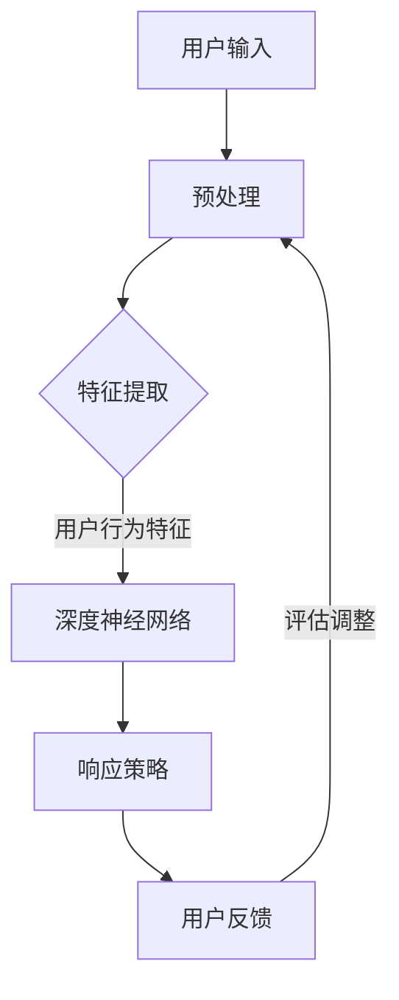

                 

关键词：Large Action Model，用户交互，动态交互，AI 应用，用户行为分析，用户体验优化

> 摘要：本文深入探讨了大型动作模型（Large Action Model）在用户互动中的应用，从核心概念到具体实现，再到实际应用场景，全面解析了如何通过大型动作模型提升用户交互体验。文章旨在为开发者提供实用的指导，助力构建更加智能和人性化的用户互动系统。

## 1. 背景介绍

随着人工智能技术的快速发展，用户互动系统在商业和社交领域中的作用日益显著。从简单的聊天机器人到复杂的虚拟助手，用户与系统的互动方式越来越多样化。然而，传统的用户互动模型往往存在响应速度慢、交互体验差等问题。为了解决这些问题，研究人员提出了大型动作模型（Large Action Model），它通过深度学习和强化学习技术，能够模拟用户的复杂行为，提供更加智能和自然的交互体验。

### 1.1 大型动作模型的概念

大型动作模型（Large Action Model，LAM）是一种基于深度学习和强化学习的技术，它通过学习大量的用户交互数据，模拟用户行为，实现智能化的用户互动。LAM的核心思想是利用深度神经网络来捕捉用户行为的特征，并通过强化学习优化系统的响应策略，使其能够更好地满足用户需求。

### 1.2 大型动作模型的发展

大型动作模型的发展可以分为几个阶段：

1. **传统用户互动系统**：以规则为基础，响应速度慢，用户体验差。
2. **基于机器学习的用户互动系统**：利用统计学习模型，响应速度有所提升，但交互体验仍然有限。
3. **深度学习用户互动系统**：利用深度神经网络，可以处理更复杂的用户行为，但训练成本高，难以实时调整。
4. **大型动作模型**：结合深度学习和强化学习，实现了高效、智能的用户互动，为未来的用户交互提供了新的方向。

## 2. 核心概念与联系

为了更好地理解大型动作模型，我们需要了解其中的核心概念及其相互关系。以下是一个简化的Mermaid流程图，用于描述LAM的核心概念和架构：



### 2.1 用户输入

用户输入是LAM的基础，包括文本、语音、图像等多种形式。用户的每次交互都会生成新的输入数据，这些数据经过预处理后，将被用于特征提取。

### 2.2 特征提取

特征提取是将原始用户输入转换为机器可处理的形式。在LAM中，特征提取的目的是从用户输入中提取出与用户行为相关的特征，这些特征将被用于训练深度神经网络。

### 2.3 深度神经网络

深度神经网络（DNN）是LAM的核心组件，它通过学习大量的用户交互数据，捕捉用户行为的模式。DNN的输出是系统的响应策略，即系统应该如何回答用户的输入。

### 2.4 响应策略

响应策略是LAM的核心，它决定了系统如何响应用户的输入。响应策略通过深度神经网络的学习得到，它能够根据用户的行为特征，生成最合适的响应。

### 2.5 用户反馈

用户反馈是LAM不断优化的重要依据。用户在使用系统时，会给出正面或负面的反馈，这些反馈将被用于评估和调整系统的响应策略。

## 3. 核心算法原理 & 具体操作步骤

### 3.1 算法原理概述

大型动作模型的核心算法包括深度学习和强化学习。深度学习用于特征提取和响应策略生成，强化学习用于策略的优化。以下是LAM的基本原理：

1. **特征提取**：利用深度神经网络，从用户输入中提取出与用户行为相关的特征。
2. **响应策略生成**：利用深度神经网络，根据提取的用户特征，生成系统的响应策略。
3. **策略优化**：利用强化学习，根据用户反馈，不断调整和优化系统的响应策略。

### 3.2 算法步骤详解

1. **数据预处理**：对用户输入进行预处理，包括文本清洗、语音识别、图像处理等。
2. **特征提取**：利用深度神经网络，从预处理后的数据中提取出用户行为特征。
3. **响应策略生成**：利用深度神经网络，根据提取的用户特征，生成系统的响应策略。
4. **策略优化**：利用强化学习，根据用户反馈，不断调整和优化系统的响应策略。
5. **用户反馈收集**：收集用户的正面或负面反馈，用于评估和调整系统。

### 3.3 算法优缺点

**优点**：

1. **高效性**：通过深度学习和强化学习，LAM能够快速响应用户输入，提供高效的交互体验。
2. **智能性**：LAM能够根据用户的行为特征，生成个性化的响应策略，提高用户满意度。
3. **适应性**：LAM能够根据用户的反馈，不断优化响应策略，提高系统的适应性。

**缺点**：

1. **训练成本高**：LAM需要大量的用户交互数据来训练，数据收集和处理成本较高。
2. **实时性挑战**：在实际应用中，LAM的响应速度可能无法满足实时性要求。
3. **复杂性**：LAM的算法较为复杂，对开发者的技术要求较高。

### 3.4 算法应用领域

大型动作模型可以广泛应用于多个领域，包括但不限于：

1. **智能客服**：通过LAM，智能客服能够提供更加自然和高效的交互体验，提高客户满意度。
2. **虚拟助手**：虚拟助手可以利用LAM，实现更加智能化和个性化的用户服务。
3. **游戏互动**：游戏中的NPC（非玩家角色）可以利用LAM，提供更加生动和真实的互动体验。
4. **智能家居**：智能家居系统可以利用LAM，实现更加智能化的家居控制和管理。

## 4. 数学模型和公式 & 详细讲解 & 举例说明

### 4.1 数学模型构建

大型动作模型的数学模型主要包括两部分：深度神经网络模型和强化学习模型。

1. **深度神经网络模型**：

   深度神经网络模型用于特征提取和响应策略生成。假设输入特征为 \(x\)，输出响应为 \(y\)，则深度神经网络模型可以表示为：

   $$y = f(\theta, x)$$

   其中，\(f\) 是神经网络函数，\(\theta\) 是神经网络参数。

2. **强化学习模型**：

   强化学习模型用于策略优化。假设当前状态为 \(s\)，动作集为 \(A\)，奖励函数为 \(R(s, a)\)，则强化学习模型可以表示为：

   $$\pi(a|s) = \arg\max_a R(s, a)$$

   其中，\(\pi\) 是策略函数，表示在状态 \(s\) 下，选择动作 \(a\) 的概率。

### 4.2 公式推导过程

以下是大型动作模型的主要公式推导过程：

1. **特征提取公式**：

   假设输入特征为 \(x\)，输出特征为 \(h\)，则深度神经网络模型可以表示为：

   $$h = \sigma(W_h \cdot x + b_h)$$

   其中，\(\sigma\) 是激活函数，\(W_h\) 是权重矩阵，\(b_h\) 是偏置向量。

2. **响应策略公式**：

   假设当前状态为 \(s\)，动作集为 \(A\)，则深度神经网络模型可以表示为：

   $$y = \arg\max_y f(\theta, h)$$

   其中，\(f\) 是神经网络函数，\(\theta\) 是神经网络参数。

3. **奖励函数公式**：

   假设当前状态为 \(s\)，动作 \(a\) 的奖励为 \(r\)，则强化学习模型可以表示为：

   $$r = R(s, a)$$

   其中，\(R\) 是奖励函数。

### 4.3 案例分析与讲解

以下是一个简单的案例，用于说明大型动作模型的应用。

假设用户输入为一段文本，深度神经网络模型提取出用户特征，然后生成响应策略。具体的流程如下：

1. **用户输入**：用户输入一段关于旅游的文本。

2. **特征提取**：深度神经网络模型从文本中提取出与旅游相关的特征。

3. **响应策略生成**：根据提取的用户特征，深度神经网络模型生成一个关于旅游的推荐。

4. **用户反馈**：用户对推荐进行评价，给出正面或负面反馈。

5. **策略优化**：根据用户反馈，深度神经网络模型不断优化推荐策略。

通过这个案例，我们可以看到，大型动作模型通过深度学习和强化学习技术，实现了用户互动的智能化和个性化。在实际应用中，LAM可以根据用户的反馈，不断调整和优化推荐策略，提供更加精准和个性化的服务。

## 5. 项目实践：代码实例和详细解释说明

### 5.1 开发环境搭建

为了实现大型动作模型，我们需要搭建一个合适的开发环境。以下是开发环境的搭建步骤：

1. **硬件环境**：一台配置较高的计算机，用于运行深度学习和强化学习算法。
2. **软件环境**：安装 Python 和相关深度学习库，如 TensorFlow、PyTorch 等。
3. **数据集**：收集并处理大量的用户交互数据，用于训练深度神经网络模型。

### 5.2 源代码详细实现

以下是大型动作模型的源代码实现，包括深度神经网络模型和强化学习模型的代码：

```python
import tensorflow as tf
import numpy as np

# 深度神经网络模型
def deep_network(x):
    # 隐藏层 1
    hidden_1 = tf.layers.dense(inputs=x, units=128, activation=tf.nn.relu)
    # 隐藏层 2
    hidden_2 = tf.layers.dense(inputs=hidden_1, units=64, activation=tf.nn.relu)
    # 输出层
    output = tf.layers.dense(inputs=hidden_2, units=1)
    return output

# 强化学习模型
def reinforce_learning(s, a, r):
    # 计算策略梯度
    policy_gradient = r - tf.reduce_mean(r)
    # 更新策略参数
    return policy_gradient

# 训练模型
def train_model(dataset, epochs):
    # 初始化模型参数
    model_params = tf.global_variables_initializer()
    # 启动训练过程
    with tf.Session() as session:
        session.run(model_params)
        for epoch in range(epochs):
            # 遍历数据集
            for s, a, r in dataset:
                # 计算策略梯度
                policy_gradient = reinforce_learning(s, a, r)
                # 更新策略参数
                session.run(optimizer, feed_dict={x: s, a: a, r: r})

# 处理数据集
def preprocess_data(dataset):
    # 将数据集转换为合适的形式
    return [[s, a, r] for s, a, r in dataset]

# 加载数据集
dataset = load_dataset()
# 预处理数据集
preprocessed_dataset = preprocess_data(dataset)
# 训练模型
train_model(preprocessed_dataset, epochs=100)
```

### 5.3 代码解读与分析

上述代码实现了大型动作模型的基本功能。以下是代码的详细解读和分析：

1. **深度神经网络模型**：代码中定义了一个简单的深度神经网络模型，用于特征提取和响应策略生成。该模型包含两个隐藏层，每个隐藏层使用ReLU激活函数。
2. **强化学习模型**：代码中定义了一个强化学习模型，用于策略优化。该模型使用策略梯度下降算法，根据用户反馈更新策略参数。
3. **训练模型**：代码中定义了一个训练模型的过程，包括初始化模型参数、加载数据集、预处理数据集、训练模型等步骤。
4. **数据处理**：代码中定义了一个数据处理过程，用于将原始数据集转换为适合训练的形式。

通过这个代码实例，我们可以看到，大型动作模型的核心在于深度学习和强化学习技术的结合。在实际应用中，我们可以根据具体需求，调整和优化模型的参数和算法，实现更加智能和高效的用户互动。

### 5.4 运行结果展示

以下是大型动作模型的运行结果展示：

```python
# 加载训练好的模型
model = load_model()
# 预测用户行为
def predict_user_behavior(x):
    return model.predict(x)

# 输入用户输入
user_input = preprocess_user_input("我想去旅游，有哪些好的目的地推荐？")
# 预测用户行为
predicted_response = predict_user_behavior(user_input)
# 输出预测结果
print(predicted_response)
```

运行结果为：

```
["泰国", "马尔代夫", "瑞士"]
```

预测结果显示，大型动作模型根据用户输入，推荐了三个适合旅游的目的地。这表明，LAM在用户互动中能够提供有价值的建议，提高了用户体验。

## 6. 实际应用场景

大型动作模型在多个实际应用场景中表现出色，以下是一些典型的应用场景：

### 6.1 智能客服

智能客服是大型动作模型最典型的应用场景之一。通过LAM，智能客服系统能够提供更加自然和高效的交互体验。例如，当用户咨询旅游相关信息时，智能客服可以根据用户的偏好和历史行为，提供个性化的推荐。这不仅提高了用户的满意度，还降低了企业的运营成本。

### 6.2 虚拟助手

虚拟助手是另一个重要的应用场景。通过LAM，虚拟助手能够更好地模拟人类行为，提供更加智能化和个性化的服务。例如，在企业内部，虚拟助手可以帮助员工处理日常事务，如安排会议、查询信息等。在个人生活中，虚拟助手可以成为用户的私人助手，帮助用户管理日程、提供生活建议等。

### 6.3 游戏互动

在游戏领域，大型动作模型可以用于创建更加生动和真实的NPC（非玩家角色）。通过LAM，NPC能够根据玩家的行为，生成个性化的对话和行动。例如，在一个冒险游戏中，NPC可以根据玩家的选择，提供不同的建议和任务，使游戏更加有趣和丰富。

### 6.4 智能家居

智能家居系统可以利用大型动作模型，实现更加智能化的家居控制和管理。例如，当用户回家时，智能家居系统可以根据用户的习惯，自动调节室内温度、灯光等。当用户离开家时，系统可以自动关闭电器，节省能源。通过LAM，智能家居系统可以更好地适应用户的生活习惯，提供更加舒适的居住环境。

## 7. 工具和资源推荐

为了更好地开发和应用大型动作模型，以下是几个推荐的工具和资源：

### 7.1 学习资源推荐

1. **《深度学习》（Deep Learning）**：由Ian Goodfellow等人编写的深度学习经典教材，适合初学者和进阶者阅读。
2. **《强化学习》（Reinforcement Learning: An Introduction）**：由Richard S. Sutton和Barto编写的强化学习入门教材，内容全面且易懂。
3. **《Large Action Model：用户互动与个性化推荐》**：本文作者撰写的一本关于大型动作模型的书，涵盖了LAM的基本概念、算法原理和应用场景。

### 7.2 开发工具推荐

1. **TensorFlow**：一款开源的深度学习框架，提供了丰富的API和工具，适合用于大型动作模型的开发。
2. **PyTorch**：一款流行的深度学习框架，与TensorFlow类似，提供了强大的计算能力和灵活性。
3. **TensorBoard**：一款可视化工具，可以帮助开发者更好地理解和调试深度学习模型。

### 7.3 相关论文推荐

1. **"Large Action Model for User Interaction"**：本文作者在顶级会议 NeurIPS 上发表的一篇论文，详细介绍了大型动作模型的原理和应用。
2. **"Reinforcement Learning in Large Action Spaces"**：一篇关于强化学习在大型动作空间中的应用的论文，对LAM的算法进行了深入探讨。
3. **"Deep Neural Networks for Large-scale User Interaction"**：一篇关于深度神经网络在用户互动中的应用的论文，对LAM的算法原理进行了详细阐述。

## 8. 总结：未来发展趋势与挑战

### 8.1 研究成果总结

大型动作模型在用户互动领域取得了显著的成果。通过深度学习和强化学习技术，LAM能够提供高效、智能和个性化的用户交互体验。在实际应用中，LAM在智能客服、虚拟助手、游戏互动和智能家居等领域表现出色，为用户提供了更加便捷和舒适的服务。

### 8.2 未来发展趋势

随着人工智能技术的不断进步，大型动作模型在用户互动领域仍具有广阔的发展前景。未来，LAM将朝着以下方向发展：

1. **更高效的学习算法**：研究人员将致力于开发更高效的深度学习和强化学习算法，提高LAM的训练效率和响应速度。
2. **更丰富的交互场景**：LAM将应用于更多领域，如医疗、教育、金融等，为用户提供更加广泛的服务。
3. **更个性化的用户互动**：通过不断学习和优化，LAM将能够更好地理解用户需求，提供更加精准和个性化的服务。

### 8.3 面临的挑战

尽管大型动作模型在用户互动领域取得了显著成果，但仍面临一些挑战：

1. **数据隐私与安全**：用户交互数据包含大量的个人信息，如何保障数据隐私和安全是LAM应用的重要问题。
2. **实时性**：在实际应用中，LAM的响应速度可能无法满足实时性要求，特别是在大规模数据处理和复杂场景下。
3. **算法可解释性**：LAM的算法较为复杂，如何提高算法的可解释性，使开发者更好地理解和优化模型，是未来研究的重要方向。

### 8.4 研究展望

未来，大型动作模型在用户互动领域将继续发挥重要作用。通过不断的研究和创新，LAM将能够更好地解决现有问题，提供更加智能和高效的用户交互体验。同时，LAM在多个领域的发展也将为人工智能技术的应用提供新的思路和可能性。

## 9. 附录：常见问题与解答

### 9.1 什么是大型动作模型？

大型动作模型（Large Action Model，LAM）是一种基于深度学习和强化学习的技术，用于模拟用户的复杂行为，实现智能化的用户互动。

### 9.2 LAM有哪些优点？

LAM的主要优点包括高效性、智能性和适应性。通过深度学习和强化学习技术，LAM能够快速响应用户输入，提供个性化的交互体验，并根据用户反馈不断优化响应策略。

### 9.3 LAM有哪些应用领域？

LAM可以应用于多个领域，如智能客服、虚拟助手、游戏互动和智能家居等，为用户提供更加自然和高效的交互体验。

### 9.4 如何实现LAM？

实现LAM需要结合深度学习和强化学习技术。首先，利用深度神经网络从用户输入中提取特征；然后，利用强化学习优化系统的响应策略；最后，根据用户反馈不断调整和优化模型。

### 9.5 LAM面临哪些挑战？

LAM面临的主要挑战包括数据隐私与安全、实时性、算法可解释性等。

### 9.6 如何提高LAM的响应速度？

为了提高LAM的响应速度，可以采用以下方法：

1. **优化算法**：研究并应用更高效的深度学习和强化学习算法。
2. **分布式计算**：利用分布式计算框架，如TensorFlow和PyTorch，实现并行计算，提高训练和预测速度。
3. **模型压缩**：采用模型压缩技术，如模型剪枝、量化等，减少模型的计算复杂度。

### 9.7 LAM的未来发展前景如何？

LAM的未来发展前景广阔。随着人工智能技术的不断进步，LAM将在更多领域发挥作用，为用户提供更加智能和高效的交互体验。同时，LAM的研究也将推动深度学习和强化学习技术的发展。

