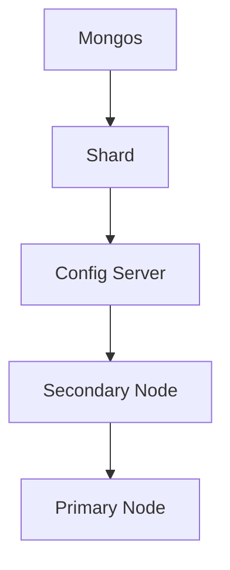

                 

 > **关键词**: MongoDB, 数据存储, 非关系型数据库, 文档数据库, 分片机制, 读写性能优化

> **摘要**: 本文将深入探讨MongoDB的原理，包括其架构设计、核心概念、算法原理和操作步骤。通过具体的代码实例，我们将详细了解MongoDB的用法，并在实际应用场景中展示其优势。最后，本文将讨论未来的应用展望和面临的挑战。

## 1. 背景介绍

MongoDB是一个开源的文档数据库，由MongoDB Inc.在2009年推出。它旨在提供高性能、可扩展和高可用性的数据存储解决方案。与传统的RDBMS（关系型数据库管理系统）相比，MongoDB以文档模型为核心，支持灵活的数据结构和复杂的数据查询。

随着大数据和云计算的兴起，非关系型数据库（NoSQL）在近年来得到了广泛的应用。MongoDB因其易用性、灵活性和高效性而成为了NoSQL领域的佼佼者。本文将围绕MongoDB的原理和实际应用，提供全面的讲解。

## 2. 核心概念与联系

### 2.1 MongoDB的基本架构

MongoDB采用分布式架构，包括以下几个核心组件：

- **Mongos**: 路由器，负责处理来自客户端的查询，并将查询分发到适当的分片上。
- **Shard**: 数据分片，将数据分布在多个节点上，以实现水平扩展。
- **Config Server**: 存储集群配置信息，如数据分片和副本集信息。
- **Secondary Node**: 副本节点，用于数据备份和高可用性。
- **Primary Node**: 主节点，负责处理写操作，并在主节点故障时自动进行故障转移。

### 2.2 核心概念原理与架构的 Mermaid 流程图



## 3. 核心算法原理 & 具体操作步骤

### 3.1 算法原理概述

MongoDB的核心算法原理主要包括：

- **分片机制**：通过将数据分割成多个分片，实现数据的水平扩展。
- **副本集**：通过复制数据，实现数据的高可用性和故障转移。

### 3.2 算法步骤详解

#### 分片机制步骤：

1. **数据分片**：将数据按特定键（如_id）分片到多个分片上。
2. **查询路由**：客户端查询数据时，由Mongos路由器将查询分发到适当的分片上。
3. **数据聚合**：在多个分片上执行数据聚合操作，并将结果返回给客户端。

#### 副本集步骤：

1. **初始化副本集**：在集群中初始化副本集，指定主节点和副本节点。
2. **主节点选举**：在主节点故障时，副本节点进行选举，选出新的主节点。
3. **数据同步**：副本节点与主节点同步数据，确保数据一致性。

### 3.3 算法优缺点

#### 分片机制：

- **优点**：实现数据水平扩展，提高读写性能。
- **缺点**：查询复杂度增加，分片键选择需谨慎。

#### 副本集：

- **优点**：提高数据可用性和容错能力。
- **缺点**：增加存储成本，维护复杂度。

### 3.4 算法应用领域

MongoDB适用于以下领域：

- **大数据处理**：处理大量数据的高性能查询和写入操作。
- **实时应用**：支持实时数据处理和快速响应。
- **物联网**：存储和处理海量物联网设备数据。

## 4. 数学模型和公式 & 详细讲解 & 举例说明

### 4.1 数学模型构建

MongoDB的数学模型主要涉及：

- **分片键的选择**：根据数据访问模式选择合适的分片键。
- **副本集的副本数量**：根据数据一致性和性能要求选择副本数量。

### 4.2 公式推导过程

- **分片键的选择**：

  $$ hash(key) \mod N $$

  其中，$hash(key)$为分片键的哈希值，$N$为分片数量。

- **副本集的副本数量**：

  $$ R = \lceil \frac{N}{2} \rceil $$

  其中，$N$为分片数量，$R$为副本数量。

### 4.3 案例分析与讲解

#### 案例一：选择合适的分片键

假设一个电商系统，商品数据存储在MongoDB中。选择商品类别（category）作为分片键，以实现按类别查询商品数据。

#### 案例二：副本集的副本数量

假设一个大型网站，数据存储在MongoDB中。根据数据一致性和性能要求，选择3个副本节点。

## 5. 项目实践：代码实例和详细解释说明

### 5.1 开发环境搭建

1. 安装MongoDB：从[MongoDB官网](https://www.mongodb.com/)下载并安装MongoDB。
2. 配置MongoDB：在配置文件中指定分片集和副本集。

### 5.2 源代码详细实现

```javascript
// 示例：插入数据
db.products.insertOne({
  _id: ObjectId("61d3e7c1234567890abcdef"),
  name: "iPhone 13",
  category: "Electronics",
  price: 999.99
});

// 示例：查询数据
db.products.find({ category: "Electronics" });
```

### 5.3 代码解读与分析

代码示例中，我们首先插入了一个商品文档，并使用分片键`_id`将数据插入到相应的分片上。然后，我们执行了一个查询操作，根据分类查询商品数据。

### 5.4 运行结果展示

执行代码后，我们可以在MongoDB的命令行工具中看到插入和查询的结果。

## 6. 实际应用场景

MongoDB适用于多种场景，如：

- **电商系统**：存储商品信息、订单数据等。
- **物联网应用**：存储和处理海量物联网设备数据。
- **实时数据处理**：支持实时数据处理和快速响应。

## 7. 工具和资源推荐

### 7.1 学习资源推荐

- [MongoDB官方文档](https://docs.mongodb.com/)
- [MongoDB University](https://university.mongodb.com/)

### 7.2 开发工具推荐

- [MongoDB Compass](https://www.mongodb.com/compass)
- [Robomongo](https://robomongo.org/)

### 7.3 相关论文推荐

- "MongoDB: A Document-Oriented Database System"
- "Sharding Strategies for MongoDB"

## 8. 总结：未来发展趋势与挑战

### 8.1 研究成果总结

MongoDB作为NoSQL数据库的代表，已经取得了显著的研究成果和应用成效。其分布式架构、灵活的数据模型和高效的数据处理能力，为各种应用场景提供了可靠的解决方案。

### 8.2 未来发展趋势

随着大数据和云计算的发展，MongoDB将继续演进，支持更丰富的数据类型和处理能力。同时，随着区块链、物联网等新兴技术的兴起，MongoDB有望在这些领域发挥更大的作用。

### 8.3 面临的挑战

尽管MongoDB取得了巨大成功，但仍面临一些挑战，如：

- **查询性能优化**：如何进一步提高查询性能，尤其是在大规模数据集上。
- **数据安全性**：如何确保数据的安全性和隐私性。
- **社区生态建设**：如何构建更完善的社区生态，吸引更多的开发者和用户。

### 8.4 研究展望

未来，MongoDB的研究将重点关注以下几个方面：

- **分布式存储和计算**：探索更高效的分布式存储和计算方法。
- **数据一致性保障**：研究如何在不影响性能的前提下，保障数据一致性。
- **跨平台支持**：提供更多平台的部署和运行支持。

## 9. 附录：常见问题与解答

### Q：如何选择合适的分片键？
A：选择分片键时，需要考虑数据的访问模式、数据分布和查询性能。一般建议使用主键或复合主键作为分片键，以实现均匀的数据分布。

### Q：如何优化MongoDB的查询性能？
A：优化MongoDB查询性能的方法包括：选择合适的索引、合理设计数据模型、避免使用内联视图和子查询等。

### Q：如何保证MongoDB的数据安全性？
A：保证MongoDB数据安全的方法包括：使用SSL加密传输、配置访问控制策略、定期备份和更新等。

---

**作者：禅与计算机程序设计艺术 / Zen and the Art of Computer Programming**

以上是MongoDB原理与代码实例讲解的完整文章。希望本文对您了解和使用MongoDB有所帮助。在未来的研究和应用中，MongoDB将继续发挥重要作用，为各种复杂应用场景提供强大支持。

