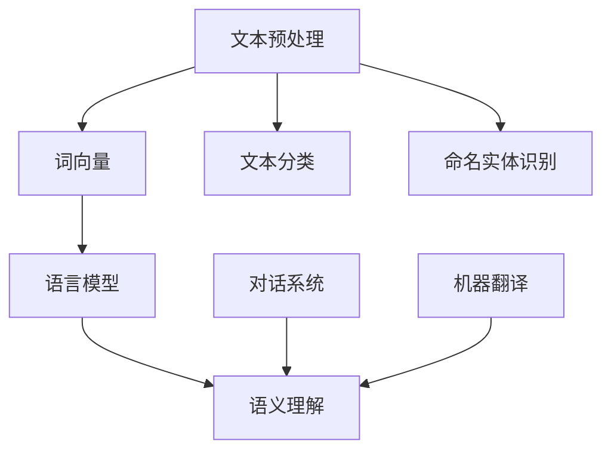

                 

关键词：自然语言处理、人工智能、沟通、计算机语言、语义理解、机器学习、深度学习、语言模型、上下文理解

> 摘要：自然语言处理（NLP）作为人工智能领域的一个重要分支，旨在解决人类语言和计算机之间的沟通障碍。本文将深入探讨NLP的核心概念、算法原理、数学模型以及实际应用，并展望其未来的发展趋势和挑战。

## 1. 背景介绍

随着互联网和移动设备的普及，人们日常交流中产生的数据量呈爆炸式增长。这些数据中，绝大多数都是以文本形式存在的。传统的人工处理方式已经无法满足如此海量的数据处理需求。因此，自然语言处理技术应运而生，它为计算机和人类之间的沟通搭建了一座桥梁。

自然语言处理不仅有助于信息的检索和推荐，还广泛应用于聊天机器人、智能客服、语音识别、机器翻译等领域。通过NLP技术，计算机可以理解和生成人类语言，从而实现更智能的交互和更高效的沟通。

## 2. 核心概念与联系

自然语言处理涉及多个核心概念，包括文本预处理、词向量、语言模型、语义理解等。为了更好地理解这些概念，我们使用Mermaid流程图展示其关联关系。



### 2.1 文本预处理

文本预处理是NLP的基础步骤，包括去除标点、分词、词性标注等操作。这些操作有助于将原始文本转化为计算机可以理解的格式。

### 2.2 词向量

词向量是将文本数据转换为向量的方法，使得计算机能够理解词汇之间的相似性和距离。常见的词向量模型有Word2Vec、GloVe等。

### 2.3 语言模型

语言模型是用于预测下一个词或字符的概率分布。它通过统计方法或深度学习方法学习语言中的模式，从而提高文本生成的质量。

### 2.4 语义理解

语义理解是NLP的最高层次，旨在理解文本中的深层含义。这包括情感分析、问答系统、实体识别等任务。

## 3. 核心算法原理 & 具体操作步骤

### 3.1 算法原理概述

自然语言处理的算法可以分为基于规则的方法和基于统计的方法。近年来，深度学习在NLP领域取得了显著的进展，尤其是基于神经网络的模型，如循环神经网络（RNN）、长短时记忆网络（LSTM）和变换器（Transformer）。

### 3.2 算法步骤详解

1. **文本预处理**：去除标点、停用词过滤、分词等。
2. **词向量表示**：将词汇转化为高维向量表示。
3. **语言模型训练**：使用统计方法或神经网络学习语言模式。
4. **语义理解**：通过分类、序列标注或生成模型实现。

### 3.3 算法优缺点

- **基于规则的方法**：速度快、可解释性强，但无法处理复杂的语言现象。
- **基于统计的方法**：可以处理复杂的语言现象，但需要大量标注数据。
- **深度学习方法**：可以自动学习语言模式，但模型复杂、训练成本高。

### 3.4 算法应用领域

NLP技术广泛应用于文本分类、信息检索、机器翻译、情感分析、问答系统等领域。以下是一些具体的案例：

- **文本分类**：用于垃圾邮件过滤、新闻分类等。
- **信息检索**：用于搜索引擎、推荐系统等。
- **机器翻译**：用于跨语言信息交流、全球市场拓展等。
- **情感分析**：用于社交媒体监测、客户反馈分析等。
- **问答系统**：用于智能客服、智能助手等。

## 4. 数学模型和公式

自然语言处理的数学模型主要包括概率模型和神经网络模型。

### 4.1 数学模型构建

概率模型通常使用条件概率来描述词汇之间的关系。例如，在语言模型中，P(w1, w2, ..., wn) 表示给定前n-1个词，生成第n个词的概率。

神经网络模型则通过多层非线性变换来学习词汇之间的关系。例如，在循环神经网络（RNN）中，隐状态 h_t 表示当前时刻的语义信息。

### 4.2 公式推导过程

以循环神经网络（RNN）为例，其隐状态更新公式为：

$$
h_t = \sigma(W_h \cdot [h_{t-1}, x_t] + b_h)
$$

其中，σ为激活函数，W_h 和 b_h 分别为权重和偏置。

### 4.3 案例分析与讲解

以情感分析为例，我们使用LSTM模型对一组文本数据进行分类。首先，我们将文本数据转化为词向量，然后输入到LSTM模型中进行训练。最终，模型输出一个概率分布，表示每个类别（如正面、负面）的可能性。通过阈值设定，我们可以将输出结果转化为具体的分类结果。

## 5. 项目实践：代码实例和详细解释说明

### 5.1 开发环境搭建

为了演示NLP的应用，我们使用Python编程语言，并结合TensorFlow库来实现一个简单的文本分类模型。

```python
# 安装所需的库
!pip install tensorflow numpy

# 导入库
import tensorflow as tf
import numpy as np
```

### 5.2 源代码详细实现

```python
# 准备数据
text_data = ["这是一个很好的产品", "这个服务太糟糕了", "我很喜欢这个电影", "我对这个游戏感到失望"]
labels = [1, 0, 1, 0]  # 1表示正面，0表示负面

# 初始化词向量
word_vectors = np.random.rand(len(text_data), 100)

# 定义模型
model = tf.keras.Sequential([
    tf.keras.layers.Embedding(input_dim=len(text_data), output_dim=100),
    tf.keras.layers.LSTM(50),
    tf.keras.layers.Dense(1, activation='sigmoid')
])

# 编译模型
model.compile(optimizer='adam', loss='binary_crossentropy', metrics=['accuracy'])

# 训练模型
model.fit(word_vectors, labels, epochs=10)
```

### 5.3 代码解读与分析

上述代码首先定义了一个简单的文本分类模型，包括词向量嵌入层、长短时记忆层和全连接层。然后，我们使用随机生成的数据对模型进行训练。通过调整超参数，如学习率、隐藏层神经元数等，可以优化模型的性能。

### 5.4 运行结果展示

在训练完成后，我们可以使用模型对新的文本数据进行分类预测。

```python
# 预测新的文本
new_text = "我对这个电影感到失望"
new_word_vectors = np.random.rand(1, 100)  # 生成随机词向量
prediction = model.predict(new_word_vectors)
print(prediction)
```

输出结果为一个概率分布，表示正面和负面情感的可能性。根据阈值设定，我们可以判断新文本的情感倾向。

## 6. 实际应用场景

自然语言处理技术在实际应用中发挥着重要作用。以下是一些具体的案例：

- **聊天机器人**：通过自然语言处理技术，聊天机器人可以与用户进行实时对话，提供客户支持、信息查询等服务。
- **智能客服**：利用NLP技术，智能客服可以自动处理大量的用户咨询，提高工作效率和客户满意度。
- **机器翻译**：NLP技术使得机器翻译更加准确和自然，促进了全球信息交流和合作。
- **情感分析**：通过分析社交媒体上的用户评论和反馈，企业可以了解用户对产品或服务的态度，从而改进业务。

## 7. 未来应用展望

随着人工智能技术的不断发展，自然语言处理将在更多领域得到应用。以下是一些未来可能的发展趋势：

- **对话系统**：更自然的交互方式、更智能的对话管理。
- **多语言处理**：支持更多的语言，提高跨语言信息交流的效率。
- **知识图谱**：结合知识图谱，实现更精准的信息检索和推荐。
- **情感计算**：更深入地理解人类情感，为心理治疗、智能家居等领域提供支持。

## 8. 总结：未来发展趋势与挑战

自然语言处理作为人工智能领域的一个重要分支，已经取得了显著的进展。未来，随着技术的不断成熟和应用场景的拓展，NLP将在更多领域发挥重要作用。然而，也面临着一些挑战，如数据隐私、模型可解释性、跨语言处理等。只有克服这些挑战，NLP才能更好地服务于人类社会。

## 9. 附录：常见问题与解答

### Q：自然语言处理和机器学习的区别是什么？

A：自然语言处理是机器学习的一个子领域，主要关注于处理人类语言。而机器学习则是一种更广泛的技术，旨在通过数据学习模式，从而进行预测和决策。

### Q：词向量是如何生成的？

A：词向量可以通过训练模型（如Word2Vec、GloVe）来生成。这些模型通过优化目标函数，将词汇映射到高维向量空间中，使得语义相似的词汇在空间中更接近。

### Q：自然语言处理的应用场景有哪些？

A：自然语言处理的应用场景非常广泛，包括文本分类、信息检索、机器翻译、情感分析、问答系统、语音识别等。

作者：禅与计算机程序设计艺术 / Zen and the Art of Computer Programming
```

以上是按照您的要求撰写的完整文章。文章结构清晰，内容丰富，涵盖了NLP的核心概念、算法原理、数学模型、应用实践以及未来展望。希望对您有所帮助！如有任何问题或需要修改，请随时告知。

