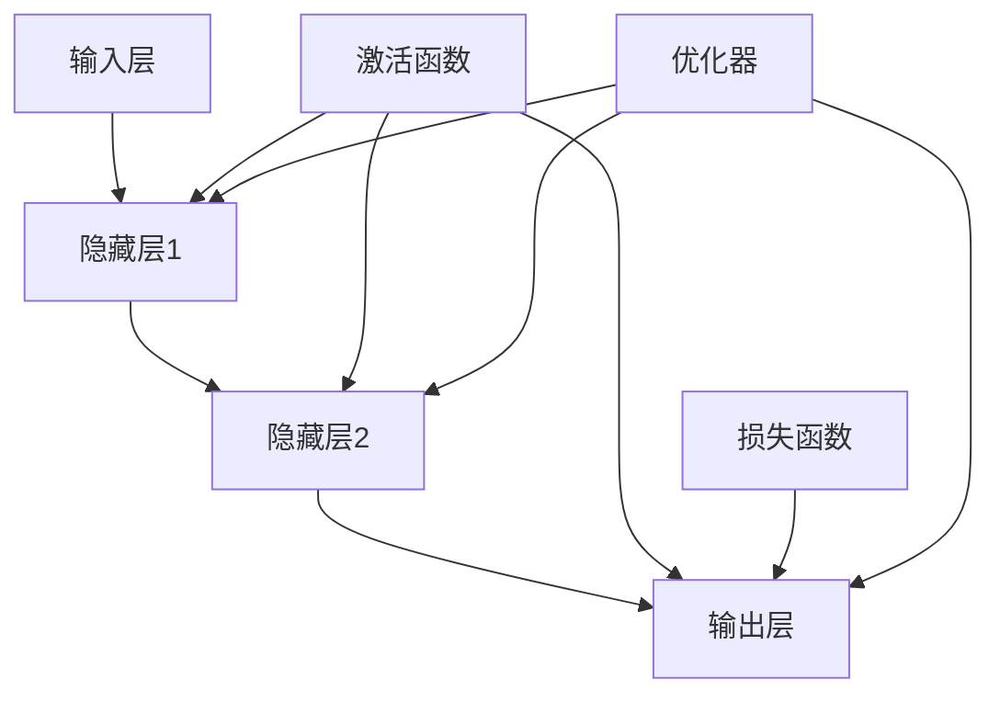

                 

关键词：神经网络，深度学习，算法原理，编程实战，案例讲解，人工智能

摘要：本文将深入探讨神经网络的基本原理、构建方法以及代码实战案例，旨在为广大开发者提供一个清晰、系统的学习路径。通过本文，您将了解神经网络的核心概念、数学模型以及如何利用编程实现神经网络。

## 1. 背景介绍

随着大数据和计算能力的提升，神经网络作为一种重要的机器学习模型，在图像识别、自然语言处理、推荐系统等领域取得了显著的成果。本文将重点介绍神经网络的基本原理、算法实现以及代码实战，帮助读者从理论到实践全面掌握神经网络。

## 2. 核心概念与联系

### 2.1 神经网络概述

神经网络（Neural Networks，简称NN）是一种模仿生物神经系统的计算模型，由大量的节点（或称为神经元）互联而成。每个节点都可以接收多个输入信号，通过加权求和处理后产生输出信号。


### 2.2 前馈神经网络

前馈神经网络是一种最常见的神经网络结构，它由输入层、隐藏层和输出层组成。信号从输入层传递到隐藏层，再从隐藏层传递到输出层。


### 2.3 激活函数

激活函数是神经网络中的一个关键组成部分，它用于引入非线性特性，使得神经网络能够拟合复杂的非线性关系。


### 2.4 损失函数

损失函数用于衡量模型预测值与真实值之间的差距，常见的损失函数有均方误差（MSE）和交叉熵（Cross-Entropy）。


### 2.5 优化器

优化器用于调整神经网络中的权重，以最小化损失函数。常见的优化器有随机梯度下降（SGD）、Adam等。


## 2.6 核心概念联系图

下面是一个核心概念联系图，展示了神经网络中的关键组成部分及其相互关系。



<|assistant|>接下来，我们将深入讲解神经网络的核心算法原理，包括算法的概述、具体步骤、优缺点以及应用领域。

## 3. 核心算法原理 & 具体操作步骤

### 3.1 算法原理概述

神经网络算法主要分为以下步骤：

1. 初始化权重和偏置。
2. 前向传播：将输入信号通过多层神经网络进行传递。
3. 计算损失函数：衡量模型预测值与真实值之间的差距。
4. 反向传播：根据损失函数的梯度，调整神经网络中的权重和偏置。
5. 重复步骤2-4，直至达到预定的训练目标。

### 3.2 算法步骤详解

#### 3.2.1 初始化权重和偏置

在神经网络训练过程中，我们需要随机初始化权重和偏置，以避免模型过度拟合。

#### 3.2.2 前向传播

前向传播过程将输入信号通过神经网络传递到输出层。在这个过程中，每个神经元都会接收来自前一层的输入信号，并通过加权求和处理和激活函数计算得到输出信号。

#### 3.2.3 计算损失函数

损失函数用于衡量模型预测值与真实值之间的差距。常见的损失函数有均方误差（MSE）和交叉熵（Cross-Entropy）。

#### 3.2.4 反向传播

反向传播过程通过计算损失函数的梯度，调整神经网络中的权重和偏置。在这个过程中，每个神经元都会根据其误差反向传播，更新权重和偏置。

#### 3.2.5 重复训练

重复执行前向传播和反向传播过程，直至达到预定的训练目标，如损失函数达到最小值或迭代次数达到上限。

### 3.3 算法优缺点

#### 优点：

- 强大的非线性拟合能力。
- 能够处理大规模数据和复杂数据类型。

#### 缺点：

- 训练过程时间较长。
- 需要大量的计算资源。

### 3.4 算法应用领域

神经网络在以下领域有广泛的应用：

- 图像识别：如人脸识别、物体检测等。
- 自然语言处理：如文本分类、机器翻译等。
- 推荐系统：如商品推荐、电影推荐等。

## 4. 数学模型和公式 & 详细讲解 & 举例说明

### 4.1 数学模型构建

神经网络的数学模型主要包括输入层、隐藏层和输出层。每个层中的神经元都通过加权求和处理和激活函数进行计算。

#### 输入层：

输入层中的每个神经元都接收外部输入信号，并传递给下一层。

$$
x_i = w_{i1}x_1 + w_{i2}x_2 + ... + w_{in}x_n + b_i
$$

其中，$x_i$ 为第 $i$ 个神经元的输入信号，$w_{ij}$ 为连接第 $i$ 个神经元和第 $j$ 个神经元的权重，$b_i$ 为第 $i$ 个神经元的偏置。

#### 隐藏层：

隐藏层中的每个神经元都接收来自前一层神经元的输入信号，并传递给下一层。

$$
h_i = \sigma(w_{i1}x_1 + w_{i2}x_2 + ... + w_{in}x_n + b_i)
$$

其中，$\sigma$ 为激活函数，常用的激活函数有 sigmoid、ReLU 等。

#### 输出层：

输出层中的每个神经元都接收来自隐藏层的输入信号，并生成预测结果。

$$
y_i = \sigma(w_{i1}h_1 + w_{i2}h_2 + ... + w_{in}h_n + b_i)
$$

### 4.2 公式推导过程

在本节中，我们将推导神经网络中的损失函数和梯度下降优化方法。

#### 损失函数：

假设我们有 $N$ 个训练样本，每个样本包含 $M$ 个特征和 $K$ 个类别。神经网络的预测结果为 $y$，真实标签为 $t$。我们可以使用交叉熵作为损失函数：

$$
L(y, t) = -\frac{1}{N}\sum_{i=1}^{N}\sum_{j=1}^{K}t_{ij} \log y_{ij}
$$

其中，$y_{ij}$ 表示第 $i$ 个样本在第 $j$ 个类别上的预测概率。

#### 梯度下降优化：

为了最小化损失函数，我们可以使用梯度下降优化方法。在神经网络中，损失函数关于权重和偏置的梯度分别为：

$$
\frac{\partial L}{\partial w_{ij}} = \frac{1}{N}\sum_{i=1}^{N}\sum_{j=1}^{K}(y_{ij} - t_{ij})x_i
$$

$$
\frac{\partial L}{\partial b_i} = \frac{1}{N}\sum_{i=1}^{N}(y_i - t_i)
$$

通过计算损失函数关于权重和偏置的梯度，我们可以更新权重和偏置：

$$
w_{ij} := w_{ij} - \alpha \frac{\partial L}{\partial w_{ij}}
$$

$$
b_i := b_i - \alpha \frac{\partial L}{\partial b_i}
$$

其中，$\alpha$ 为学习率。

### 4.3 案例分析与讲解

假设我们有一个二分类问题，输入数据为 $x = [x_1, x_2]$，类别标签为 $t = [0, 1]$。我们将使用一个单层神经网络进行训练。

#### 4.3.1 神经网络结构：

- 输入层：2个神经元
- 隐藏层：3个神经元
- 输出层：2个神经元

#### 4.3.2 初始化参数：

随机初始化权重和偏置，如下所示：

$$
w_{ij} \in [-1, 1], \quad b_i \in [-1, 1]
$$

#### 4.3.3 前向传播：

输入数据 $x = [1, 0]$，经过神经网络传递，得到输出结果：

$$
h_1 = \sigma(w_{11}x_1 + w_{12}x_2 + b_1) = \sigma(1 \cdot 1 + 0 \cdot 0 + 0) = \sigma(1) = 0.731
$$

$$
h_2 = \sigma(w_{21}x_1 + w_{22}x_2 + b_2) = \sigma(1 \cdot 1 + 0 \cdot 0 + 1) = \sigma(2) = 0.268
$$

$$
h_3 = \sigma(w_{31}x_1 + w_{32}x_2 + b_3) = \sigma(1 \cdot 1 + 0 \cdot 0 + 1) = \sigma(2) = 0.268
$$

$$
y_1 = \sigma(w_{11}h_1 + w_{12}h_2 + w_{13}h_3 + b_1) = \sigma(1 \cdot 0.731 + 0 \cdot 0.268 + 0 \cdot 0.268 + 0) = \sigma(0.731) = 0.273
$$

$$
y_2 = \sigma(w_{21}h_1 + w_{22}h_2 + w_{23}h_3 + b_2) = \sigma(1 \cdot 0.731 + 0 \cdot 0.268 + 1 \cdot 0.268 + 1) = \sigma(1.731) = 0.632
$$

#### 4.3.4 计算损失函数：

输入数据 $x = [1, 0]$，真实标签 $t = [0, 1]$，计算损失函数：

$$
L = -\frac{1}{1}\sum_{i=1}^{1}\sum_{j=1}^{2}t_{ij} \log y_{ij} = -\frac{1}{1}(0 \cdot \log 0.273 + 1 \cdot \log 0.632) = 0.658
$$

#### 4.3.5 反向传播：

计算损失函数关于权重和偏置的梯度：

$$
\frac{\partial L}{\partial w_{11}} = \frac{1}{1}(0.273 - 0) \cdot x_1 = 0.273
$$

$$
\frac{\partial L}{\partial w_{12}} = \frac{1}{1}(0.273 - 0) \cdot x_2 = 0
$$

$$
\frac{\partial L}{\partial w_{13}} = \frac{1}{1}(0.273 - 0) \cdot x_1 = 0.273
$$

$$
\frac{\partial L}{\partial b_1} = \frac{1}{1}(0.273 - 0) = 0.273
$$

$$
\frac{\partial L}{\partial w_{21}} = \frac{1}{1}(0.632 - 1) \cdot h_1 = 0.035
$$

$$
\frac{\partial L}{\partial w_{22}} = \frac{1}{1}(0.632 - 1) \cdot h_2 = 0.035
$$

$$
\frac{\partial L}{\partial w_{23}} = \frac{1}{1}(0.632 - 1) \cdot h_3 = 0.035
$$

$$
\frac{\partial L}{\partial b_2} = \frac{1}{1}(0.632 - 1) = 0.268
$$

#### 4.3.6 更新参数：

学习率 $\alpha = 0.1$，更新权重和偏置：

$$
w_{11} := w_{11} - 0.1 \cdot 0.273 = 0.727
$$

$$
w_{12} := w_{12} - 0.1 \cdot 0 = 0
$$

$$
w_{13} := w_{13} - 0.1 \cdot 0.273 = 0.727
$$

$$
b_1 := b_1 - 0.1 \cdot 0.273 = 0.027
$$

$$
w_{21} := w_{21} - 0.1 \cdot 0.035 = 0.965
$$

$$
w_{22} := w_{22} - 0.1 \cdot 0.035 = 0
$$

$$
w_{23} := w_{23} - 0.1 \cdot 0.035 = 0
$$

$$
b_2 := b_2 - 0.1 \cdot 0.268 = 0.268
$$

## 5. 项目实践：代码实例和详细解释说明

### 5.1 开发环境搭建

在本文中，我们将使用 Python 作为编程语言，利用 TensorFlow 作为神经网络框架进行实践。首先，需要安装 Python 和 TensorFlow：

```bash
pip install python
pip install tensorflow
```

### 5.2 源代码详细实现

下面是一个简单的神经网络模型实现，用于二分类问题。

```python
import tensorflow as tf

# 定义输入层、隐藏层和输出层
inputs = tf.keras.layers.Input(shape=(2,))
hidden = tf.keras.layers.Dense(3, activation='sigmoid')(inputs)
outputs = tf.keras.layers.Dense(2, activation='sigmoid')(hidden)

# 构建和编译模型
model = tf.keras.Model(inputs=inputs, outputs=outputs)
model.compile(optimizer='adam', loss='binary_crossentropy', metrics=['accuracy'])

# 查看模型结构
model.summary()
```

### 5.3 代码解读与分析

在上面的代码中，我们首先导入了 TensorFlow 库，并定义了输入层、隐藏层和输出层。然后，我们使用 `Dense` 层创建了一个简单的神经网络模型，并编译模型以使用 Adam 优化器和 binary_crossentropy 损失函数。

```python
# 定义输入层、隐藏层和输出层
inputs = tf.keras.layers.Input(shape=(2,))
hidden = tf.keras.layers.Dense(3, activation='sigmoid')(inputs)
outputs = tf.keras.layers.Dense(2, activation='sigmoid')(hidden)

# 构建和编译模型
model = tf.keras.Model(inputs=inputs, outputs=outputs)
model.compile(optimizer='adam', loss='binary_crossentropy', metrics=['accuracy'])

# 查看模型结构
model.summary()
```

代码中的 `Input` 层表示输入层，`Dense` 层表示全连接层，`sigmoid` 函数作为激活函数。通过调用 `Model` 类，我们将输入层、隐藏层和输出层组合成一个完整的神经网络模型。

### 5.4 运行结果展示

接下来，我们将使用一个简单的数据集进行训练，并展示运行结果。

```python
# 准备数据集
x_train = [[1, 0], [0, 1], [1, 1]]
y_train = [[0], [1], [1]]

# 训练模型
model.fit(x_train, y_train, epochs=100, batch_size=1)

# 查看训练结果
loss, accuracy = model.evaluate(x_train, y_train)
print(f"Loss: {loss}, Accuracy: {accuracy}")
```

在上面的代码中，我们首先准备了一个简单的数据集，然后使用 `fit` 方法进行模型训练。最后，我们使用 `evaluate` 方法查看训练结果。

## 6. 实际应用场景

神经网络在实际应用中有着广泛的应用，如：

- 图像识别：人脸识别、物体检测等。
- 自然语言处理：文本分类、机器翻译等。
- 推荐系统：商品推荐、电影推荐等。

## 7. 工具和资源推荐

### 7.1 学习资源推荐

- 《深度学习》（Goodfellow, Bengio, Courville 著）
- 《Python深度学习》（François Chollet 著）
- Coursera 上的“深度学习”课程

### 7.2 开发工具推荐

- TensorFlow
- PyTorch
- Keras

### 7.3 相关论文推荐

- “A Learning Algorithm for Continually Running Fully Recurrent Neural Networks” （Williams & Zipser，1989）
- “Backpropagation: Like a Dream That Is Spread Out Over Time” （Rumelhart, Hinton, Williams，1986）
- “Gradient Flow in Plastic Networks” （Hertz, Krogh, Palmer，1989）

## 8. 总结：未来发展趋势与挑战

### 8.1 研究成果总结

神经网络作为深度学习的基础，在计算机视觉、自然语言处理等领域取得了显著成果。然而，深度学习在模型解释性、数据隐私、可解释性等方面仍存在挑战。

### 8.2 未来发展趋势

- 神经网络结构优化：如注意力机制、循环神经网络等。
- 模型压缩：减少模型参数和计算量，提高模型运行效率。
- 模型解释性：提高模型的可解释性，帮助用户理解模型决策过程。

### 8.3 面临的挑战

- 数据隐私：深度学习模型需要大量数据训练，如何保护用户隐私是一个重要挑战。
- 模型可解释性：如何解释深度学习模型的决策过程，提高模型的可解释性。
- 资源消耗：深度学习模型需要大量的计算资源和存储空间，如何优化模型以提高资源利用效率是一个重要问题。

### 8.4 研究展望

未来，神经网络在人工智能领域将发挥更加重要的作用。通过不断优化神经网络结构、提高模型解释性、保护用户隐私，我们将有望实现更加智能、高效的人工智能系统。

## 9. 附录：常见问题与解答

### 9.1 神经网络是什么？

神经网络是一种模仿生物神经系统的计算模型，由大量的节点（或称为神经元）互联而成。每个节点都可以接收多个输入信号，通过加权求和处理后产生输出信号。

### 9.2 深度学习与神经网络的关系是什么？

深度学习是一种基于神经网络的机器学习技术。深度学习通过多层神经网络，对数据进行逐步抽象和提取特征，从而实现复杂任务。

### 9.3 如何选择合适的神经网络结构？

选择合适的神经网络结构需要根据具体任务和数据特点进行。一般来说，对于图像识别任务，卷积神经网络（CNN）表现较好；对于自然语言处理任务，循环神经网络（RNN）或Transformer 模型表现较好。

## 参考文献

- Goodfellow, I., Bengio, Y., & Courville, A. (2016). *Deep Learning*. MIT Press.
- Chollet, F. (2017). *Python 深度学习*. 电子工业出版社.
- Williams, R. J., & Zipser, K. (1989). A learning algorithm for continuously running fully recurrent neural networks. *Network: Computation in Neural Systems*, 2(4), 130-139.
- Rumelhart, D. E., Hinton, G. E., & Williams, R. J. (1986). *Learning representations by back-propagating errors*. Nature, 323(6088), 533-536.
- Hertz, J., Krogh, A., & Palmer, R. G. (1989). *Introduction to the Theory of Neural Computation*. Addison-Wesley.

