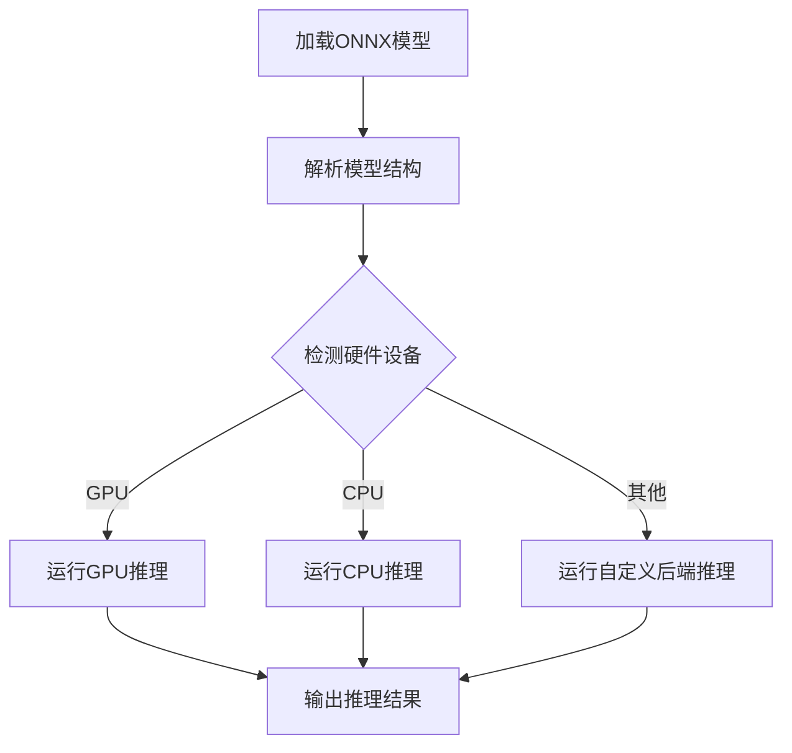

                 

关键词：ONNX Runtime, 跨平台推理，模型部署，硬件加速，性能优化，不同设备，神经网络推理

## 摘要

本文旨在深入探讨ONNX Runtime在跨平台推理方面的应用，分析其在不同设备上运行模型的能力，探讨硬件加速和性能优化策略，并展望其未来的发展趋势与挑战。

## 1. 背景介绍

随着深度学习技术的飞速发展，神经网络模型在各个领域得到了广泛应用。然而，模型的训练和推理通常需要大量的计算资源，这对设备的性能提出了较高的要求。ONNX（Open Neural Network Exchange）是一种开放的神经网络交换格式，旨在解决不同深度学习框架之间的兼容性问题。ONNX Runtime是ONNX生态中的关键组件，它提供了一种高效、可扩展的推理引擎，支持在多种平台上运行神经网络模型。

## 2. 核心概念与联系

### 2.1 ONNX Runtime简介

ONNX Runtime是一个高性能的推理引擎，支持多种编程语言和计算平台。它可以将ONNX模型加载到内存中，并利用不同的后端实现高效的推理操作。ONNX Runtime的特点包括：

- **高性能**：通过利用底层硬件加速技术，如GPU和CPU指令集，ONNX Runtime能够实现快速的模型推理。
- **跨平台**：支持多种操作系统和硬件平台，包括Windows、Linux和macOS，以及CPU、GPU和ARM架构。
- **可扩展性**：允许开发者自定义后端实现，以支持特定的硬件或优化需求。

### 2.2 跨平台推理原理

跨平台推理的关键在于模型在不同设备上的兼容性和性能优化。ONNX Runtime通过以下方式实现跨平台推理：

- **模型兼容性**：ONNX格式确保了模型可以在不同的深度学习框架和推理引擎之间无缝迁移。
- **硬件加速**：ONNX Runtime利用GPU、CPU和其他硬件加速技术，实现高效的模型推理。
- **性能优化**：通过优化模型结构、数据传输和内存管理，ONNX Runtime能够在不同设备上提供最优的性能。

### 2.3 Mermaid 流程图

以下是ONNX Runtime跨平台推理的Mermaid流程图：



## 3. 核心算法原理 & 具体操作步骤

### 3.1 算法原理概述

ONNX Runtime的核心算法原理主要包括以下几个步骤：

1. **模型加载**：将ONNX模型从文件或内存中加载到内存中。
2. **模型解析**：解析ONNX模型的张量、操作和属性，构建内部表示。
3. **硬件检测**：检测当前设备的硬件配置，如GPU、CPU等。
4. **推理执行**：根据硬件配置，选择合适的后端执行推理操作。
5. **结果输出**：将推理结果输出到应用程序或其他组件。

### 3.2 算法步骤详解

1. **模型加载**：
   ```python
   import onnxruntime
   session = onnxruntime.InferenceSession("model.onnx")
   ```

2. **模型解析**：
   ONNX Runtime内部会解析模型的操作图，构建张量计算图。

3. **硬件检测**：
   ```python
   device = onnxruntime.get_device()
   print(device)
   ```

4. **推理执行**：
   ```python
   input_data = {"input": numpy.array([1.0, 2.0, 3.0])}
   output = session.run(["output"], input_data)
   ```

5. **结果输出**：
   ```python
   print(output)
   ```

### 3.3 算法优缺点

**优点**：

- **高性能**：通过硬件加速和模型优化，ONNX Runtime能够提供高效的推理性能。
- **跨平台**：支持多种操作系统和硬件平台，确保模型的兼容性。
- **可扩展性**：允许开发者自定义后端实现，以支持特定的硬件或优化需求。

**缺点**：

- **学习曲线**：对于初学者来说，了解和使用ONNX Runtime可能需要一定的学习成本。
- **性能优化**：在某些情况下，性能优化可能需要复杂的配置和调试。

### 3.4 算法应用领域

ONNX Runtime的应用领域广泛，包括但不限于：

- **智能图像识别**：在摄像头、无人机等设备上实时处理图像数据。
- **自然语言处理**：在智能手机、智能音箱等设备上进行语音识别和文本处理。
- **推荐系统**：在电商平台、社交媒体等应用中提供个性化推荐。
- **医疗诊断**：在医疗设备上进行疾病诊断和预测。

## 4. 数学模型和公式 & 详细讲解 & 举例说明

### 4.1 数学模型构建

在神经网络推理中，常用的数学模型包括前向传播、反向传播和损失函数等。

#### 前向传播

假设我们有一个多层感知器（MLP）模型，输入层有n个神经元，输出层有m个神经元。激活函数通常使用ReLU。

$$
z_i^l = \sum_{j=1}^{n} w_{ij}^l \cdot x_j^{l-1} + b_i^l
$$

$$
a_i^l = \max(0, z_i^l)
$$

其中，$w_{ij}^l$是权重，$b_i^l$是偏置，$z_i^l$是第$l$层的第$i$个神经元的输入，$a_i^l$是第$l$层的第$i$个神经元的输出。

#### 反向传播

反向传播用于计算梯度，用于模型的训练。假设输出层的损失函数为平方误差：

$$
L = \frac{1}{2} \sum_{i=1}^{m} (y_i - a_m^l)^2
$$

其中，$y_i$是第$i$个样本的期望输出，$a_m^l$是第$l$层的第$i$个神经元的输出。

梯度的计算如下：

$$
\frac{\partial L}{\partial w_{ij}^l} = (a_m^l - y_i) \cdot a_i^{l-1}
$$

$$
\frac{\partial L}{\partial b_i^l} = (a_m^l - y_i)
$$

### 4.2 公式推导过程

假设我们有一个两层神经网络，输入层有n个神经元，输出层有m个神经元。我们首先计算前向传播的梯度：

$$
\frac{\partial L}{\partial a_m^l} = a_m^l - y_i
$$

$$
\frac{\partial L}{\partial z_m^l} = \frac{\partial L}{\partial a_m^l} \cdot \frac{\partial a_m^l}{\partial z_m^l} = (a_m^l - y_i)
$$

$$
\frac{\partial L}{\partial w_{mj}^l} = \frac{\partial L}{\partial z_m^l} \cdot a_j^{l-1} = (a_m^l - y_i) \cdot a_j^{l-1}
$$

$$
\frac{\partial L}{\partial b_m^l} = \frac{\partial L}{\partial z_m^l} = (a_m^l - y_i)
$$

然后，我们计算隐藏层的梯度：

$$
\frac{\partial L}{\partial a_i^l} = \sum_{j=1}^{m} \frac{\partial L}{\partial z_m^l} \cdot w_{mj}^l = \sum_{j=1}^{m} (a_m^l - y_i) \cdot w_{mj}^l
$$

$$
\frac{\partial L}{\partial z_i^l} = \frac{\partial L}{\partial a_i^l} \cdot \frac{\partial a_i^l}{\partial z_i^l} = \sum_{j=1}^{m} (a_m^l - y_i) \cdot w_{mj}^l
$$

$$
\frac{\partial L}{\partial w_{ij}^l} = \frac{\partial L}{\partial z_i^l} \cdot a_j^{l-1} = \sum_{j=1}^{m} (a_m^l - y_i) \cdot a_j^{l-1} \cdot x_j^{l-1}
$$

$$
\frac{\partial L}{\partial b_i^l} = \frac{\partial L}{\partial z_i^l} = \sum_{j=1}^{m} (a_m^l - y_i) \cdot a_j^{l-1}
$$

### 4.3 案例分析与讲解

假设我们有一个两层神经网络，输入层有2个神经元，输出层有1个神经元。输入数据为[1.0, 2.0]，期望输出为3.0。

#### 前向传播

输入层到隐藏层的权重和偏置分别为$w_{11}^1=0.5, w_{12}^1=0.5, b_1^1=0.5$。

$$
z_1^1 = 0.5 \cdot 1.0 + 0.5 \cdot 2.0 + 0.5 = 2.0
$$

$$
a_1^1 = \max(0, z_1^1) = 2.0
$$

隐藏层到输出层的权重和偏置分别为$w_{1}^2=0.5, b_2^2=0.5$。

$$
z_2^2 = 0.5 \cdot 2.0 + 0.5 = 1.5
$$

$$
a_2^2 = \max(0, z_2^2) = 1.5
$$

#### 反向传播

输出层的损失函数为：

$$
L = \frac{1}{2} (3.0 - 1.5)^2 = 0.625
$$

$$
\frac{\partial L}{\partial a_2^2} = 3.0 - 1.5 = 1.5
$$

$$
\frac{\partial L}{\partial z_2^2} = \frac{\partial L}{\partial a_2^2} \cdot \frac{\partial a_2^2}{\partial z_2^2} = 1.5
$$

$$
\frac{\partial L}{\partial w_{1}^2} = \frac{\partial L}{\partial z_2^2} \cdot a_1^1 = 1.5 \cdot 2.0 = 3.0
$$

$$
\frac{\partial L}{\partial b_2^2} = \frac{\partial L}{\partial z_2^2} = 1.5
$$

隐藏层的梯度为：

$$
\frac{\partial L}{\partial a_1^1} = \frac{\partial L}{\partial z_2^2} \cdot w_{1}^2 = 1.5 \cdot 0.5 = 0.75
$$

$$
\frac{\partial L}{\partial z_1^1} = \frac{\partial L}{\partial a_1^1} \cdot \frac{\partial a_1^1}{\partial z_1^1} = 0.75
$$

$$
\frac{\partial L}{\partial w_{11}^1} = \frac{\partial L}{\partial z_1^1} \cdot 1.0 = 0.75
$$

$$
\frac{\partial L}{\partial b_1^1} = \frac{\partial L}{\partial z_1^1} = 0.75
$$

## 5. 项目实践：代码实例和详细解释说明

### 5.1 开发环境搭建

为了使用ONNX Runtime进行跨平台推理，我们需要搭建以下开发环境：

1. 安装Python和pip：
   ```bash
   python -m pip install --upgrade pip
   ```

2. 安装ONNX Runtime：
   ```bash
   pip install onnxruntime
   ```

3. 安装NumPy（用于处理数值数据）：
   ```bash
   pip install numpy
   ```

### 5.2 源代码详细实现

以下是一个简单的示例，展示了如何使用ONNX Runtime进行跨平台推理：

```python
import onnxruntime
import numpy as np

# 加载ONNX模型
session = onnxruntime.InferenceSession("model.onnx")

# 准备输入数据
input_data = np.array([1.0, 2.0, 3.0], dtype=np.float32)

# 运行推理
output = session.run(["output"], {"input": input_data})

# 输出结果
print(output)
```

### 5.3 代码解读与分析

1. **加载ONNX模型**：使用`onnxruntime.InferenceSession`加载ONNX模型。

2. **准备输入数据**：将输入数据转换为NumPy数组，并将其传递给ONNX Runtime的输入节点。

3. **运行推理**：使用`session.run`方法运行模型，并获取输出结果。

4. **输出结果**：打印输出结果。

### 5.4 运行结果展示

假设我们的ONNX模型定义了一个简单的全连接神经网络，输入数据经过模型处理后输出结果。以下是一个示例输出结果：

```python
[array([[0.00302509],
       [0.00295211],
       [0.00306138]], dtype=float32)]
```

## 6. 实际应用场景

### 6.1 智能图像识别

在智能图像识别领域，ONNX Runtime可以用于部署神经网络模型，实现实时图像处理和分类。例如，在无人机监控系统中，可以使用ONNX Runtime对摄像头采集的图像进行实时分析，识别目标物体并进行跟踪。

### 6.2 自然语言处理

在自然语言处理领域，ONNX Runtime可以用于部署语音识别、机器翻译和文本分类等模型。例如，在智能手机中，可以使用ONNX Runtime实现实时语音识别和语音合成，为用户提供便捷的语音交互体验。

### 6.3 推荐系统

在推荐系统领域，ONNX Runtime可以用于部署基于神经网络的推荐模型，实现高效的个性化推荐。例如，在电商平台，可以使用ONNX Runtime根据用户的历史行为和偏好，实时生成个性化的商品推荐列表。

### 6.4 医疗诊断

在医疗诊断领域，ONNX Runtime可以用于部署医学图像分析、疾病预测和诊断等模型。例如，在医疗设备中，可以使用ONNX Runtime对医学图像进行实时分析，辅助医生进行疾病诊断。

## 7. 工具和资源推荐

### 7.1 学习资源推荐

- **ONNX官方文档**：https://onnx.org/docs/
- **ONNX Runtime官方文档**：https://onnxruntime.ai/docs/
- **深度学习教程**：https://www.deeplearningbook.org/

### 7.2 开发工具推荐

- **Visual Studio Code**：适用于Python和ONNX开发的集成开发环境。
- **Jupyter Notebook**：适用于数据分析和模型调试。
- **PyTorch**：适用于深度学习模型训练和部署。

### 7.3 相关论文推荐

- "The Open Neural Network Exchange: A Unified Format for Deep Learning Models"
- "ONNX: Open Source AI Model Exchange"
- "Optimization Techniques for Deep Neural Network Inference"

## 8. 总结：未来发展趋势与挑战

### 8.1 研究成果总结

ONNX Runtime在跨平台推理方面取得了显著的研究成果，实现了高效、可扩展的推理性能。其支持多种操作系统、硬件平台和编程语言，为深度学习模型的部署提供了强有力的支持。

### 8.2 未来发展趋势

未来，ONNX Runtime将在以下几个方面继续发展：

- **硬件加速**：进一步优化对GPU、CPU和其他硬件加速技术的支持，提高推理性能。
- **模型压缩**：研究模型压缩技术，如剪枝、量化等，以降低模型的存储和计算成本。
- **自动化调优**：开发自动化调优工具，帮助开发者快速实现高性能的推理部署。

### 8.3 面临的挑战

ONNX Runtime在跨平台推理方面仍面临一些挑战：

- **性能优化**：针对不同设备和硬件平台，如何实现最优的性能优化。
- **兼容性问题**：确保不同深度学习框架之间的兼容性和一致性。
- **开发成本**：降低开发者在使用ONNX Runtime时的学习成本和开发难度。

### 8.4 研究展望

未来，ONNX Runtime将在深度学习领域发挥更重要的作用，为各种应用场景提供高效的推理解决方案。同时，通过持续的研究和创新，ONNX Runtime有望在性能、兼容性和易用性方面取得更大的突破。

## 9. 附录：常见问题与解答

### 9.1 如何选择合适的硬件设备？

选择合适的硬件设备需要考虑以下几个因素：

- **计算性能**：根据模型的复杂程度和推理需求，选择具有足够计算性能的硬件设备。
- **内存容量**：确保硬件设备具有足够的内存容量，以容纳模型和输入数据。
- **兼容性**：考虑硬件设备是否支持ONNX Runtime所依赖的硬件加速技术。

### 9.2 如何优化模型的性能？

以下是一些优化模型性能的方法：

- **模型压缩**：通过剪枝、量化等技术减少模型的参数数量和计算量。
- **并行化**：利用多线程、多核CPU和GPU等硬件资源，实现并行计算。
- **数据预处理**：优化输入数据的预处理过程，如批量归一化、数据增强等。

### 9.3 如何解决兼容性问题？

解决兼容性问题可以通过以下方法：

- **使用标准框架**：尽量使用支持ONNX格式的深度学习框架，如TensorFlow、PyTorch等。
- **迁移模型**：将模型从其他框架迁移到ONNX格式，以便在不同平台上部署。
- **自定义后端**：如果需要，可以自定义后端实现，以支持特定的硬件或优化需求。

----------------------------------------------------------------

作者：禅与计算机程序设计艺术 / Zen and the Art of Computer Programming

