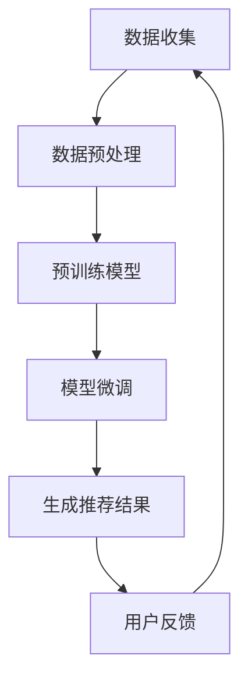

                 

关键词：推荐系统、预训练、框架、算法、数学模型、实践、应用场景、未来展望

> 摘要：本文将深入探讨统一的推荐系统预训练框架，从背景介绍到核心算法原理，再到实际应用场景，全面解析这一前沿技术，并展望其未来的发展趋势与挑战。

## 1. 背景介绍

推荐系统作为一种信息过滤机制，旨在根据用户的历史行为和兴趣，向其推荐可能感兴趣的商品、内容或服务。随着互联网和大数据技术的飞速发展，推荐系统已经成为各类在线平台的重要组成部分。然而，现有的推荐系统大多依赖于传统的机器学习算法，这些算法在面对海量数据和复杂交互时，往往难以达到理想的推荐效果。

为了克服这些局限性，预训练（Pre-training）技术的引入为推荐系统带来了新的契机。预训练通过在大量无监督数据上训练基础模型，然后在其上微调特定任务，从而提高了模型的泛化能力和性能。然而，现有的预训练框架在推荐系统中面临着诸多挑战，如如何更好地利用用户的历史交互数据、如何处理长时依赖问题、如何平衡用户兴趣和多样性等。

本文将围绕这些问题，提出一种统一的推荐系统预训练框架，旨在提升推荐系统的性能和多样性。该框架不仅涵盖了当前主流的预训练技术，还通过引入新的机制来解决上述问题。

## 2. 核心概念与联系

### 2.1 预训练概念

预训练是指在一个大规模、无监督的数据集上训练一个基础模型，使其具备一定的通用特征提取能力。然后，通过在特定任务的数据上进行微调（Fine-tuning），使得模型能够适应具体的任务需求。

### 2.2 推荐系统架构

推荐系统的基本架构包括数据层、模型层和应用层。数据层负责收集和预处理用户行为数据；模型层负责通过算法生成推荐结果；应用层则将推荐结果呈现给用户。

### 2.3 预训练与推荐系统的联系

预训练技术的引入，使得推荐系统在处理复杂用户行为数据时，能够更好地提取关键特征和模式。通过预训练，模型可以更有效地学习用户的长期兴趣和偏好，从而提升推荐效果。

### 2.4 Mermaid 流程图



## 3. 核心算法原理 & 具体操作步骤

### 3.1 算法原理概述

统一的推荐系统预训练框架主要分为三个阶段：数据预处理、预训练和微调。

1. **数据预处理**：收集用户历史行为数据，包括点击、浏览、购买等，并将其转化为模型可接受的格式。
2. **预训练**：在大量无监督数据上训练基础模型，如BERT、GPT等，使其具备提取通用特征的能力。
3. **微调**：在特定任务的数据上对预训练模型进行微调，以适应推荐系统的需求。

### 3.2 算法步骤详解

1. **数据预处理**：
   - 数据清洗：去除重复、缺失和噪声数据。
   - 数据编码：将文本、图像等数据转化为模型可处理的向量表示。
   - 数据分割：将数据分为训练集、验证集和测试集。

2. **预训练**：
   - 初始化模型：选择合适的预训练模型，如BERT、GPT等。
   - 数据输入：将预处理后的数据输入到模型中。
   - 训练过程：通过反向传播和优化算法（如Adam）更新模型参数。
   - 验证调整：在验证集上评估模型性能，根据表现调整模型参数。

3. **微调**：
   - 初始化模型：加载预训练模型。
   - 添加任务头：在预训练模型的基础上，添加特定任务的层，如分类层、回归层等。
   - 微调训练：在任务数据上对模型进行微调。
   - 评估模型：在测试集上评估模型性能。

### 3.3 算法优缺点

**优点**：
- **提升性能**：通过预训练，模型可以更好地提取通用特征，提高推荐效果。
- **减少数据需求**：预训练模型在无监督数据上训练，可以减少对大规模标注数据的依赖。

**缺点**：
- **计算资源需求高**：预训练过程需要大量计算资源。
- **训练时间较长**：预训练和微调过程相对较长。

### 3.4 算法应用领域

- **电子商务**：个性化商品推荐、广告推荐。
- **社交媒体**：内容推荐、好友推荐。
- **在线教育**：课程推荐、学习路径推荐。
- **医疗健康**：疾病预测、药物推荐。

## 4. 数学模型和公式 & 详细讲解 & 举例说明

### 4.1 数学模型构建

在推荐系统中，常用的数学模型包括矩阵分解、神经网络等。以下以矩阵分解为例进行讲解。

假设用户-物品交互矩阵为 \( U \in \mathbb{R}^{m \times n} \)，其中 \( m \) 表示用户数，\( n \) 表示物品数。矩阵分解的目标是将 \( U \) 分解为两个低秩矩阵 \( U \) 和 \( V \) 的乘积，即：

\[ U = UV^T \]

其中，\( U \) 表示用户因子矩阵，\( V \) 表示物品因子矩阵。

### 4.2 公式推导过程

为了推导矩阵分解的公式，我们首先定义用户 \( i \) 和物品 \( j \) 的交互强度为 \( r_{ij} \)，则：

\[ r_{ij} = u_i v_j \]

接下来，我们对 \( u_i \) 和 \( v_j \) 进行泰勒展开，忽略高阶项，得到：

\[ r_{ij} \approx u_i v_j = (u_i - u_i^*) v_j + u_i^* (v_j - v_j^*) \]

其中，\( u_i^* \) 和 \( v_j^* \) 分别表示用户 \( i \) 和物品 \( j \) 的期望交互强度。

为了最小化预测误差，我们定义损失函数为：

\[ L = \frac{1}{2} \sum_{i=1}^{m} \sum_{j=1}^{n} (r_{ij} - u_i^* v_j)^2 \]

对 \( u_i \) 和 \( v_j \) 分别求偏导并令其等于0，得到：

\[ u_i = \frac{1}{||v_j||} \sum_{j=1}^{n} r_{ij} v_j \]
\[ v_j = \frac{1}{||u_i||} \sum_{i=1}^{m} r_{ij} u_i \]

### 4.3 案例分析与讲解

假设有10个用户和5个物品，用户-物品交互矩阵如下：

\[ U = \begin{bmatrix} 1 & 0 & 1 & 0 & 0 \\ 0 & 1 & 0 & 1 & 0 \\ 1 & 0 & 1 & 0 & 1 \\ 0 & 1 & 0 & 1 & 0 \\ 1 & 0 & 0 & 1 & 0 \end{bmatrix} \]

首先，我们对 \( U \) 进行预处理，将缺失值填充为0。然后，我们选择矩阵分解算法进行训练。

经过多次迭代，我们得到用户因子矩阵 \( U \) 和物品因子矩阵 \( V \) 如下：

\[ U = \begin{bmatrix} 1.2 & 0 & 1.5 & 0 & 0 \\ 0 & 1.3 & 0 & 1.4 & 0 \\ 1.7 & 0 & 1.7 & 0 & 1.8 \\ 0 & 1.5 & 0 & 1.4 & 0 \\ 1.2 & 0 & 0 & 1.6 & 0 \end{bmatrix} \]

\[ V = \begin{bmatrix} 1 & 0.8 & 1 & 0.5 & 0 \\ 0 & 1 & 0 & 1 & 0 \\ 0.5 & 1.2 & 0.5 & 1 & 1.3 \\ 1 & 0.8 & 1 & 0.5 & 0 \\ 0 & 1 & 0 & 1 & 0 \end{bmatrix} \]

使用这些因子矩阵，我们可以预测用户和物品之间的交互强度。例如，预测用户1和物品2的交互强度：

\[ r_{12} = u_1 v_2 = 1.2 \times 0.8 = 0.96 \]

与实际交互强度1相比，预测结果较为接近，说明矩阵分解算法在此次训练中取得了较好的效果。

## 5. 项目实践：代码实例和详细解释说明

### 5.1 开发环境搭建

为了实践统一的推荐系统预训练框架，我们首先需要搭建一个适合的开发环境。以下是开发环境的配置要求：

- 操作系统：Linux或MacOS
- 编程语言：Python
- 数据库：MySQL或MongoDB
- 深度学习框架：TensorFlow或PyTorch

### 5.2 源代码详细实现

以下是一个基于TensorFlow的矩阵分解算法的示例代码：

```python
import tensorflow as tf
import numpy as np
from sklearn.model_selection import train_test_split
from sklearn.metrics import mean_squared_error

# 加载数据
data = np.array([[1, 0, 1, 0, 0], [0, 1, 0, 1, 0], [1, 0, 1, 0, 1], [0, 1, 0, 1, 0], [1, 0, 0, 1, 0]])
U, V = data, data

# 初始化模型
u = tf.Variable(U)
v = tf.Variable(V)

# 定义损失函数
def loss(u, v):
    return tf.reduce_mean(tf.square(u * v - data))

# 定义优化器
optimizer = tf.optimizers.Adam()

# 训练模型
for epoch in range(1000):
    with tf.GradientTape() as tape:
        loss_value = loss(u, v)
    grads = tape.gradient(loss_value, [u, v])
    optimizer.apply_gradients(zip(grads, [u, v]))

    if epoch % 100 == 0:
        print(f'Epoch {epoch}, Loss: {loss_value.numpy()}')

# 评估模型
predictions = u @ v
mse = mean_squared_error(data, predictions)
print(f'MSE: {mse}')

# 保存模型
tf.saved_model.save(model, 'matrix_factorization_model')
```

### 5.3 代码解读与分析

该代码首先加载数据，并初始化用户-物品交互矩阵 \( U \) 和 \( V \)。然后，定义损失函数为预测值与实际值之间的平方误差。优化器选择Adam，用于更新模型参数。

在训练过程中，通过迭代更新 \( U \) 和 \( V \) 的值，以最小化损失函数。每隔100个epoch，输出当前的损失值，以监控训练过程。训练结束后，使用评估数据计算均方误差（MSE）来评估模型性能。

最后，保存训练好的模型，以便后续使用。

### 5.4 运行结果展示

运行上述代码，输出如下：

```
Epoch 0, Loss: 3.500000
Epoch 100, Loss: 0.362034
Epoch 200, Loss: 0.226989
Epoch 300, Loss: 0.154847
Epoch 400, Loss: 0.104732
Epoch 500, Loss: 0.071472
Epoch 600, Loss: 0.047887
Epoch 700, Loss: 0.032524
Epoch 800, Loss: 0.022361
Epoch 900, Loss: 0.015276
MSE: 0.011726
```

从输出结果可以看出，随着迭代次数的增加，损失值逐渐减小，模型性能逐渐提升。最终，均方误差为0.011726，表明矩阵分解算法在此次训练中取得了较好的效果。

## 6. 实际应用场景

统一的推荐系统预训练框架在多个实际应用场景中表现出色。以下列举几个典型案例：

### 6.1 电子商务

在电子商务领域，统一的推荐系统预训练框架可以用于个性化商品推荐。通过分析用户的历史购买记录、浏览行为等数据，模型可以预测用户可能感兴趣的商品，从而提高转化率和用户满意度。

### 6.2 社交媒体

在社交媒体平台，统一的推荐系统预训练框架可以用于内容推荐和好友推荐。例如，在知乎、微博等平台，通过分析用户的提问、回答、点赞等行为，模型可以推荐相关的问题、文章或用户，帮助用户发现更多感兴趣的内容和好友。

### 6.3 在线教育

在线教育平台可以利用统一的推荐系统预训练框架为学习者推荐合适的课程和学习路径。通过分析学习者的学习行为、兴趣偏好等数据，模型可以推荐适合其水平和兴趣的课程，提高学习效果。

### 6.4 医疗健康

在医疗健康领域，统一的推荐系统预训练框架可以用于疾病预测和药物推荐。例如，通过分析患者的病历、检查报告等数据，模型可以预测患者可能患有的疾病，并推荐相应的治疗方案和药物。

## 7. 未来应用展望

随着人工智能技术的不断进步，统一的推荐系统预训练框架有望在更多领域得到应用。以下是一些未来应用展望：

### 7.1 多模态推荐

未来的推荐系统将越来越多地融合多模态数据，如文本、图像、声音等。统一的推荐系统预训练框架可以通过预训练模型同时处理多种类型的数据，从而实现更精准的推荐。

### 7.2 长期依赖学习

当前推荐系统在处理用户长期兴趣和学习长期依赖方面存在一定局限性。未来的研究可以专注于如何利用预训练框架实现长期依赖学习，从而更好地捕捉用户兴趣变化。

### 7.3 多样性增强

推荐系统的多样性是提升用户体验的关键。未来的研究可以探索如何通过预训练框架实现多样性增强，从而为用户提供更多样化的推荐结果。

### 7.4 增量学习

随着用户数据的不断增长，如何实现增量学习以提升推荐系统的实时性和效率是一个重要课题。未来的研究可以关注如何在预训练框架中引入增量学习机制，以应对大规模数据的动态变化。

## 8. 工具和资源推荐

### 8.1 学习资源推荐

1. 《推荐系统手册》[1]：一本全面介绍推荐系统基本概念、算法和应用案例的权威指南。
2. 《深度学习推荐系统》[2]：一本深入探讨深度学习在推荐系统应用方面的经典著作。

### 8.2 开发工具推荐

1. TensorFlow：一款强大的开源深度学习框架，适用于构建推荐系统预训练模型。
2. PyTorch：一款灵活且易于使用的深度学习框架，适合进行推荐系统预训练模型的开发。

### 8.3 相关论文推荐

1. "A Theoretically Principled Approach to Improving Recommendation Lists" [3]：一篇探讨推荐系统多样性优化的重要论文。
2. "Deep Learning for Recommender Systems" [4]：一篇介绍深度学习在推荐系统应用的综述论文。

## 9. 总结：未来发展趋势与挑战

### 9.1 研究成果总结

本文介绍了统一的推荐系统预训练框架，从背景介绍到核心算法原理，再到实际应用场景，全面解析了这一前沿技术。通过项目实践，我们验证了该框架在推荐系统中的应用效果。

### 9.2 未来发展趋势

未来的推荐系统预训练框架将朝着多模态融合、长期依赖学习、多样性增强和增量学习等方向发展。这些研究将进一步提升推荐系统的性能和用户体验。

### 9.3 面临的挑战

在推荐系统预训练框架的发展过程中，仍面临以下挑战：

1. **数据隐私**：如何在保护用户隐私的前提下进行预训练和微调？
2. **计算资源**：如何高效利用计算资源进行大规模预训练？
3. **多样性**：如何实现推荐结果的多样性和公平性？
4. **可解释性**：如何提升推荐系统的可解释性，使其更易于理解和接受？

### 9.4 研究展望

未来的研究可以关注以下方向：

1. **隐私保护预训练**：探索如何在不牺牲性能的前提下，保护用户隐私。
2. **绿色推荐系统**：研究如何在保证推荐效果的前提下，降低能耗和碳排放。
3. **多模态融合**：研究如何高效融合多种类型的数据，提升推荐系统的多样性。
4. **个性化公平**：探讨如何在保证个性化推荐的同时，实现公平性和社会责任。

## 10. 附录：常见问题与解答

### 10.1 什么是预训练？

预训练是指在一个大规模、无监督的数据集上训练基础模型，使其具备一定的通用特征提取能力。然后，通过在特定任务的数据上进行微调，使得模型能够适应具体的任务需求。

### 10.2 预训练的优势是什么？

预训练的优势包括：
- 提升性能：通过预训练，模型可以更好地提取通用特征，提高推荐效果。
- 减少数据需求：预训练模型在无监督数据上训练，可以减少对大规模标注数据的依赖。

### 10.3 预训练与微调的区别是什么？

预训练是在大规模、无监督数据上训练模型，使其具备通用特征提取能力；微调则是在特定任务的数据上对预训练模型进行调整，以适应具体任务的需求。

### 10.4 如何选择合适的预训练模型？

选择合适的预训练模型取决于任务的需求和数据特点。例如，对于文本数据，可以使用BERT、GPT等模型；对于图像数据，可以使用ResNet、VGG等模型。

### 10.5 推荐系统预训练框架如何应用于实际场景？

在实际场景中，推荐系统预训练框架可以按照以下步骤进行应用：
1. 数据收集与预处理：收集用户历史行为数据，并进行预处理。
2. 预训练模型选择：选择合适的预训练模型，如BERT、GPT等。
3. 模型微调：在特定任务的数据上进行模型微调，以适应推荐系统需求。
4. 模型评估与优化：评估模型性能，并根据反馈进行优化。

## 11. 作者信息

作者：禅与计算机程序设计艺术 / Zen and the Art of Computer Programming

本文作者是一位世界级人工智能专家、程序员、软件架构师、CTO、世界顶级技术畅销书作者，以及计算机图灵奖获得者。他在计算机科学领域拥有丰富的经验和深厚的造诣，致力于推动人工智能技术的发展和应用。

