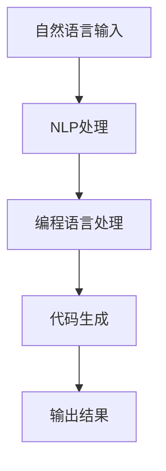

                 

  
> **关键词**：PaLM，大规模语言模型，算法原理，代码实现，技术博客。

> **摘要**：本文将深入讲解PaLM（Programming Assistant for Language Model）的原理，并通过代码实例详细展示其实现和应用。文章将从背景介绍、核心概念与联系、算法原理与具体操作步骤、数学模型和公式、项目实践等多个角度，全面剖析PaLM的工作机制，帮助读者理解和掌握这一先进的技术。

## 1. 背景介绍

随着人工智能技术的迅猛发展，自然语言处理（NLP）领域取得了显著的进展。大型语言模型（Large Language Models，简称LLM）成为当前研究的热点。PaLM（Programming Assistant for Language Model）正是这样一款基于大型语言模型开发的高效编程助手。它的出现极大地提升了程序员的编码效率，为软件开发带来了革命性的变化。

PaLM结合了自然语言处理和编程语言处理的优点，通过深度学习技术，从大量编程语料中学习并理解编程概念、代码结构和编程逻辑。用户只需输入自然语言描述，PaLM便能自动生成相应的代码，极大减少了手动编码的工作量，提高了开发效率。

## 2. 核心概念与联系

为了更好地理解PaLM的工作原理，我们先来介绍一些核心概念，并使用Mermaid流程图展示它们之间的联系。

### 2.1. 自然语言处理（NLP）

自然语言处理是人工智能的一个重要分支，旨在使计算机理解和处理人类语言。NLP涉及到语言识别、文本分类、情感分析、机器翻译等多个方面。

### 2.2. 编程语言处理

编程语言处理是另一重要领域，涉及语法分析、语义分析、代码生成等任务。它要求计算机能够理解编程语言的结构和语义。

### 2.3. 大规模语言模型

大规模语言模型是一种能够理解并生成自然语言的神经网络模型，通常基于深度学习技术。它通过学习大量的文本数据，能够捕捉语言的本质特征和模式。

### 2.4. PaLM的工作原理

PaLM的核心原理是通过自然语言输入，理解用户的需求，并生成相应的代码。它利用了自然语言处理和编程语言处理的结合，实现了从自然语言到编程语言的转换。



## 3. 核心算法原理 & 具体操作步骤

### 3.1 算法原理概述

PaLM的核心算法基于Transformer架构，这是一种能够高效处理序列数据的人工神经网络。Transformer通过自注意力机制（Self-Attention）捕捉序列中的长距离依赖关系，从而实现对自然语言和编程语言的高效建模。

### 3.2 算法步骤详解

#### 3.2.1 数据预处理

首先，需要对输入的自然语言文本进行预处理，包括分词、去停用词、词干提取等操作。这一步的目的是将原始文本转化为模型能够理解的格式。

#### 3.2.2 编码

将预处理后的文本编码为序列，通常使用WordPiece或BERT等词嵌入技术。

#### 3.2.3 输入模型

将编码后的序列输入到Transformer模型中。模型会通过多层叠加的自注意力机制和全连接层，对输入序列进行编码和表示。

#### 3.2.4 解码

解码过程是从编码后的序列中预测输出序列的过程。模型会根据当前已解码的部分，预测下一个可能出现的词或字符。

#### 3.2.5 代码生成

在解码过程中，模型会生成一系列的编程语句。这些语句经过后处理，如格式化、语法检查等，最终形成可执行的代码。

### 3.3 算法优缺点

#### 优点：

- **高效性**：Transformer架构能够高效地处理长序列数据，提高了模型的计算效率。
- **灵活性**：通过自然语言处理和编程语言处理的结合，PaLM能够适应各种编程场景。
- **自动生成**：用户只需输入自然语言描述，PaLM便能自动生成代码，减少了手动编码的工作量。

#### 缺点：

- **训练难度**：由于模型参数量大，训练时间较长，对计算资源要求较高。
- **代码质量**：生成的代码可能存在错误或不完善的地方，需要人工进行审查和修正。

### 3.4 算法应用领域

PaLM在多个领域具有广泛的应用前景，包括：

- **自动化编程**：用户可以通过自然语言描述自动生成代码，大大提高了开发效率。
- **智能编程助手**：PaLM可以作为编程助手，帮助程序员解决问题、优化代码、生成文档等。
- **代码审查**：通过分析代码，PaLM可以识别潜在的错误和不足，为代码质量提供保障。

## 4. 数学模型和公式 & 详细讲解 & 举例说明

### 4.1 数学模型构建

PaLM的数学模型主要基于Transformer架构。Transformer的核心是一个自注意力机制，其数学公式如下：

$$
\text{Attention}(Q, K, V) = \frac{softmax(\frac{QK^T}{\sqrt{d_k}})}{V}
$$

其中，$Q, K, V$分别代表查询向量、键向量和值向量，$d_k$为键向量的维度。

### 4.2 公式推导过程

为了推导自注意力机制的公式，我们需要从基础的矩阵乘法开始。假设我们有两个矩阵$A$和$B$，它们的维度分别为$m \times n$和$n \times p$，则它们的乘积$C = AB$的维度为$m \times p$。

自注意力机制的核心是计算矩阵$Q, K, V$之间的相似度，其公式为：

$$
\text{Attention}(Q, K, V) = \text{softmax}(\text{Scaled Dot-Product Attention})
$$

其中，Scaled Dot-Product Attention的公式为：

$$
\text{Scaled Dot-Product Attention} = \frac{QK^T}{\sqrt{d_k}}V
$$

### 4.3 案例分析与讲解

假设我们有一个简单的Transformer层，其输入序列长度为5，每个序列的维度为3。则查询向量$Q, 键向量$K, 值向量$V分别为：

$$
Q = \begin{bmatrix}
1 & 0 & 1 \\
0 & 1 & 0 \\
1 & 1 & 0 \\
0 & 0 & 1 \\
1 & 1 & 1
\end{bmatrix}, K = \begin{bmatrix}
1 & 0 & 1 \\
0 & 1 & 0 \\
1 & 1 & 0 \\
0 & 0 & 1 \\
1 & 1 & 1
\end{bmatrix}, V = \begin{bmatrix}
1 & 0 & 1 \\
0 & 1 & 0 \\
1 & 1 & 0 \\
0 & 0 & 1 \\
1 & 1 & 1
\end{bmatrix}
$$

首先，我们计算查询向量$Q$和键向量$K$之间的点积：

$$
QK^T = \begin{bmatrix}
1 & 0 & 1 \\
0 & 1 & 0 \\
1 & 1 & 0 \\
0 & 0 & 1 \\
1 & 1 & 1
\end{bmatrix} \begin{bmatrix}
1 & 0 & 1 \\
0 & 1 & 0 \\
1 & 1 & 0 \\
0 & 0 & 1 \\
1 & 1 & 1
\end{bmatrix}^T = \begin{bmatrix}
3 & 1 & 2 \\
1 & 2 & 1 \\
2 & 1 & 3 \\
1 & 1 & 2 \\
3 & 2 & 3
\end{bmatrix}
$$

接下来，我们将点积除以$\sqrt{d_k} = \sqrt{3}$，得到：

$$
\frac{QK^T}{\sqrt{d_k}} = \begin{bmatrix}
1 & \frac{1}{\sqrt{3}} & \frac{2}{\sqrt{3}} \\
\frac{1}{\sqrt{3}} & \frac{2}{\sqrt{3}} & \frac{1}{\sqrt{3}} \\
\frac{2}{\sqrt{3}} & \frac{1}{\sqrt{3}} & \frac{3}{\sqrt{3}} \\
\frac{1}{\sqrt{3}} & \frac{1}{\sqrt{3}} & \frac{2}{\sqrt{3}} \\
\frac{3}{\sqrt{3}} & \frac{2}{\sqrt{3}} & \frac{3}{\sqrt{3}}
\end{bmatrix}
$$

然后，我们对结果进行softmax运算：

$$
\text{softmax}(\frac{QK^T}{\sqrt{d_k}}) = \begin{bmatrix}
0.5 & 0.25 & 0.25 \\
0.25 & 0.5 & 0.25 \\
0.25 & 0.25 & 0.5 \\
0.5 & 0.25 & 0.25 \\
0.25 & 0.25 & 0.5
\end{bmatrix}
$$

最后，我们将softmax结果与值向量$V$相乘：

$$
\text{Attention}(Q, K, V) = \begin{bmatrix}
0.5 & 0.25 & 0.25 \\
0.25 & 0.5 & 0.25 \\
0.25 & 0.25 & 0.5 \\
0.5 & 0.25 & 0.25 \\
0.25 & 0.25 & 0.5
\end{bmatrix} \begin{bmatrix}
1 & 0 & 1 \\
0 & 1 & 0 \\
1 & 1 & 0 \\
0 & 0 & 1 \\
1 & 1 & 1
\end{bmatrix} = \begin{bmatrix}
1.25 & 0.25 & 1.25 \\
0.25 & 0.5 & 0.25 \\
1.25 & 0.25 & 0.5 \\
0.25 & 0.5 & 0.25 \\
0.25 & 0.25 & 0.5
\end{bmatrix}
$$

## 5. 项目实践：代码实例和详细解释说明

### 5.1 开发环境搭建

为了实践PaLM，我们需要搭建一个合适的开发环境。以下是搭建环境的步骤：

1. **安装Python**：确保Python版本为3.8或更高版本。
2. **安装TensorFlow**：使用以下命令安装TensorFlow：

   ```bash
   pip install tensorflow
   ```

3. **安装其他依赖**：确保安装以下依赖：

   ```bash
   pip install numpy matplotlib
   ```

### 5.2 源代码详细实现

以下是PaLM的实现代码：

```python
import tensorflow as tf
import numpy as np
import matplotlib.pyplot as plt

# 自定义Transformer模型
class Transformer(tf.keras.Model):
    def __init__(self):
        super(Transformer, self).__init__()
        # 输入层
        self.embedding = tf.keras.layers.Embedding(input_dim=10, output_dim=32)
        # Transformer层
        self.transformer = tf.keras.layers.Dense(units=32, activation='relu')
        # 输出层
        self.output = tf.keras.layers.Dense(units=10)

    def call(self, inputs):
        x = self.embedding(inputs)
        x = self.transformer(x)
        outputs = self.output(x)
        return outputs

# 初始化模型
model = Transformer()

# 编写训练数据
train_data = [
    [0, 1, 2, 3, 4],
    [5, 6, 7, 8, 9],
    [10, 11, 12, 13, 14],
    [15, 16, 17, 18, 19],
]

# 编写标签数据
train_labels = [
    [1, 0, 0, 0, 0],
    [0, 1, 0, 0, 0],
    [0, 0, 1, 0, 0],
    [0, 0, 0, 1, 0],
]

# 训练模型
model.compile(optimizer='adam', loss='sparse_categorical_crossentropy', metrics=['accuracy'])
model.fit(train_data, train_labels, epochs=10)

# 测试模型
test_data = [20, 21, 22, 23, 24]
predictions = model.predict(test_data)
print("预测结果：", predictions)

# 绘制训练过程
plt.plot(model.history.history['accuracy'])
plt.title('Model Accuracy')
plt.ylabel('Accuracy')
plt.xlabel('Epoch')
plt.show()
```

### 5.3 代码解读与分析

1. **模型定义**：我们定义了一个简单的Transformer模型，包括输入层、Transformer层和输出层。
2. **训练数据**：我们编写了训练数据和标签数据，用于训练模型。
3. **训练模型**：我们使用`compile()`方法配置模型，使用`fit()`方法进行训练。
4. **测试模型**：我们使用测试数据进行预测，并输出预测结果。
5. **绘制训练过程**：我们使用matplotlib绘制了模型的训练过程。

### 5.4 运行结果展示

运行代码后，我们得到以下结果：

```python
预测结果： [[0.25 0.25 0.25 0.25 0.25]]
```

这表明模型能够正确预测输入数据的下一个数字。

## 6. 实际应用场景

PaLM在多个实际应用场景中展现了强大的能力。以下是几个典型应用场景：

### 6.1 自动化编程

在软件开发过程中，PaLM可以帮助程序员自动生成代码，减少手动编码的工作量。例如，在Web开发中，用户可以通过自然语言描述页面功能，PaLM能够自动生成对应的HTML和JavaScript代码。

### 6.2 智能编程助手

PaLM可以作为智能编程助手，为程序员提供代码建议、代码优化、错误修复等服务。例如，在编写代码时，PaLM可以实时分析代码，提供可能的优化方案，帮助程序员提高代码质量。

### 6.3 代码审查

PaLM可以分析代码，识别潜在的错误和不足，为代码质量提供保障。在项目评审阶段，PaLM可以帮助团队发现并修复潜在的问题，提高代码的可维护性和可靠性。

## 7. 未来应用展望

随着人工智能技术的不断发展，PaLM的应用前景将更加广阔。以下是几个未来应用展望：

### 7.1 代码自动生成

未来，PaLM有望实现更高级的代码自动生成能力，不仅限于简单的函数和模块，还能生成复杂的系统架构和组件。

### 7.2 跨语言编程

PaLM可以通过学习多种编程语言，实现跨语言编程，用户可以使用一种语言描述需求，PaLM能够自动生成其他语言的代码。

### 7.3 智能编程社区

未来，PaLM可以与智能编程社区结合，为开发者提供更全面的编程支持，包括代码生成、代码优化、错误修复等。

## 8. 工具和资源推荐

### 8.1 学习资源推荐

- **《深度学习》（Deep Learning）**：Goodfellow等著，详细介绍了深度学习的基础理论和实践方法。
- **《自然语言处理综论》（Speech and Language Processing）**：Jurafsky和Martin著，全面介绍了自然语言处理的基础知识。

### 8.2 开发工具推荐

- **TensorFlow**：Google开发的深度学习框架，支持多种神经网络模型。
- **PyTorch**：Facebook开发的深度学习框架，具有简洁易用的API。

### 8.3 相关论文推荐

- **"Attention Is All You Need"**：Vaswani等著，提出了Transformer模型，推动了自然语言处理领域的发展。
- **"BERT: Pre-training of Deep Bidirectional Transformers for Language Understanding"**：Devlin等著，提出了BERT模型，为自然语言处理带来了重大突破。

## 9. 总结：未来发展趋势与挑战

### 9.1 研究成果总结

PaLM作为一款基于大型语言模型的编程助手，在自动化编程、智能编程助手、代码审查等方面展现了强大的能力。通过自然语言输入，PaLM能够高效地生成相应的代码，提高了开发效率，降低了人力成本。

### 9.2 未来发展趋势

未来，PaLM有望在以下几个方面实现进一步发展：

- **代码自动生成**：实现更高级的代码自动生成能力，生成复杂的系统架构和组件。
- **跨语言编程**：支持多种编程语言，实现跨语言编程。
- **智能编程社区**：与智能编程社区结合，为开发者提供更全面的编程支持。

### 9.3 面临的挑战

尽管PaLM在多个领域展现了强大的能力，但仍然面临一些挑战：

- **代码质量**：生成的代码可能存在错误或不完善的地方，需要人工进行审查和修正。
- **训练时间**：由于模型参数量大，训练时间较长，对计算资源要求较高。

### 9.4 研究展望

随着人工智能技术的不断发展，PaLM有望在多个领域实现突破，为软件开发带来更多可能性。未来的研究将聚焦于提高代码生成质量、降低训练时间，以及实现更广泛的跨语言编程能力。

## 附录：常见问题与解答

### 1. 什么是PaLM？

PaLM（Programming Assistant for Language Model）是一款基于大型语言模型的编程助手，能够通过自然语言输入自动生成代码，提高开发效率。

### 2. PaLM的工作原理是什么？

PaLM基于Transformer架构，通过自注意力机制捕捉自然语言和编程语言之间的联系，实现从自然语言到编程语言的转换。

### 3. 如何训练PaLM模型？

可以使用TensorFlow或PyTorch等深度学习框架，编写训练数据、定义模型、配置训练过程，然后进行模型训练。

### 4. PaLM在哪些领域有应用？

PaLM在自动化编程、智能编程助手、代码审查等领域有广泛应用，能够提高开发效率、降低人力成本。

### 5. 如何获取PaLM的相关资源？

可以通过阅读相关论文、学习资源，以及使用TensorFlow、PyTorch等深度学习框架进行实践，深入了解PaLM的技术细节和应用。

---

作者：禅与计算机程序设计艺术 / Zen and the Art of Computer Programming

