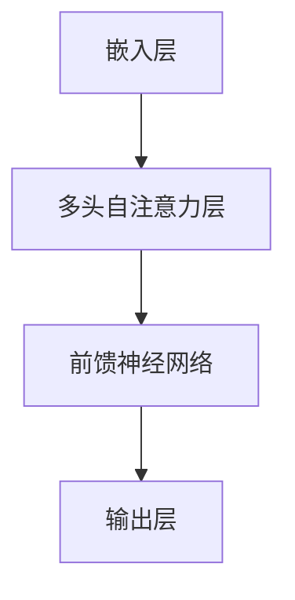

                 

关键词：PaLM，深度学习，自然语言处理，语言模型，代码实例，算法原理

> 摘要：本文深入探讨了PaLM（Parameterized Language Model）的原理，结构，核心算法以及实现细节，通过具体的代码实例详细解析了如何构建和优化PaLM，并探讨了其在自然语言处理领域中的应用。本文旨在为读者提供一个全面的理解和实践指南。

## 1. 背景介绍

随着人工智能和深度学习的快速发展，自然语言处理（NLP）成为了当前研究的热点。在众多NLP任务中，语言模型（Language Model，LM）是基础且关键的一环。语言模型旨在对自然语言进行建模，从而预测下一个单词或句子。传统的语言模型如N-gram模型，由于其局限性，已经无法满足现代NLP的需求。为了解决这些问题，研究者们提出了更加复杂的神经网络模型，如基于循环神经网络（RNN）和变换器（Transformer）的模型。

PaLM（Parameterized Language Model）是近年来兴起的一种新的语言模型，它基于大规模预训练的变换器模型，具有更高的参数数量和更复杂的架构。PaLM的出现，极大地推动了自然语言处理技术的发展，为许多NLP任务提供了强大的工具。本文将深入探讨PaLM的原理，结构，核心算法以及实现细节，并通过具体的代码实例，帮助读者理解和掌握PaLM的使用。

## 2. 核心概念与联系

### 2.1 语言模型简介

语言模型（Language Model，LM）是自然语言处理中的一个核心概念，它的主要任务是预测文本序列中下一个可能的单词或字符。一个优秀的语言模型需要具备以下特点：

- **上下文敏感性**：能够理解并利用上下文信息，预测下一个单词或字符。
- **灵活性**：能够适应不同的语言风格和领域。
- **高效性**：能够快速地进行预测，以满足实时应用的需求。

### 2.2 Transformer模型

Transformer模型是一种基于自注意力机制的深度学习模型，最初由Vaswani等人于2017年提出。相比于传统的循环神经网络（RNN），Transformer具有以下优势：

- **并行性**：Transformer模型可以通过并行计算来提高计算效率，这是其最大的优势之一。
- **全局依赖性**：通过自注意力机制，Transformer能够更好地捕捉全局依赖关系。
- **灵活性**：Transformer的架构设计使得它能够灵活地调整模型的大小和参数，以适应不同的任务需求。

### 2.3 PaLM结构

PaLM是通过对Transformer模型进行扩展和优化得到的，其结构主要包括以下部分：

- **嵌入层**（Embedding Layer）：将输入的单词或字符转换为固定长度的向量表示。
- **多头自注意力层**（Multi-head Self-Attention Layer）：通过自注意力机制，对嵌入层生成的向量进行权重分配，从而更好地捕捉上下文信息。
- **前馈神经网络**（Feedforward Neural Network）：对自注意力层输出的向量进行非线性变换。
- **输出层**（Output Layer）：通过softmax函数对可能的输出进行概率分布预测。

### 2.4 Mermaid流程图

下面是一个简化的PaLM架构的Mermaid流程图：



## 3. 核心算法原理 & 具体操作步骤

### 3.1 算法原理概述

PaLM的核心算法是基于Transformer模型的，其主要原理如下：

1. **嵌入层**：将输入的单词或字符转换为固定长度的向量表示，这一过程通常通过词嵌入（Word Embedding）技术完成。
2. **多头自注意力层**：通过自注意力机制，对嵌入层生成的向量进行权重分配，从而更好地捕捉上下文信息。自注意力机制的核心思想是，每个输入序列中的每个元素都会根据其与其他元素的相关性进行加权。
3. **前馈神经网络**：对自注意力层输出的向量进行非线性变换，以增强模型的表示能力。
4. **输出层**：通过softmax函数对可能的输出进行概率分布预测。

### 3.2 算法步骤详解

1. **初始化**：首先，需要初始化模型的参数，包括嵌入层的权重矩阵和偏置项，多头自注意力层的权重矩阵和偏置项，以及前馈神经网络的权重矩阵和偏置项。
2. **嵌入层**：将输入的单词或字符转换为固定长度的向量表示，这一步通常通过预训练的词嵌入技术完成。
3. **多头自注意力层**：通过自注意力机制，对嵌入层生成的向量进行权重分配。具体来说，对于每个输入序列中的每个元素，都会计算其与其他元素的相关性，并根据这些相关性对元素进行加权。
4. **前馈神经网络**：对自注意力层输出的向量进行非线性变换。这一步通常使用ReLU激活函数。
5. **输出层**：通过softmax函数对可能的输出进行概率分布预测。

### 3.3 算法优缺点

**优点**：

- **并行计算**：Transformer模型具有很好的并行性，这使得它在处理大规模数据时具有更高的计算效率。
- **全局依赖性**：通过自注意力机制，Transformer能够更好地捕捉全局依赖关系，从而提高模型的表示能力。
- **灵活性**：Transformer的架构设计使得它能够灵活地调整模型的大小和参数，以适应不同的任务需求。

**缺点**：

- **计算复杂度**：由于Transformer模型具有大量的参数，因此其计算复杂度较高，需要更多的计算资源和时间进行训练。
- **训练难度**：由于Transformer模型的参数数量庞大，因此其训练过程需要更长的训练时间和更高的计算资源。

### 3.4 算法应用领域

PaLM算法在自然语言处理领域有着广泛的应用，包括：

- **机器翻译**：PaLM能够通过学习源语言和目标语言之间的对应关系，实现高质量的机器翻译。
- **文本生成**：PaLM可以生成各种文本内容，如文章、诗歌、小说等。
- **问答系统**：PaLM可以理解并回答用户提出的问题，广泛应用于客服、教育等领域。
- **文本分类**：PaLM可以用于对文本进行分类，如情感分析、新闻分类等。

## 4. 数学模型和公式 & 详细讲解 & 举例说明

### 4.1 数学模型构建

PaLM的数学模型主要包括嵌入层、多头自注意力层、前馈神经网络和输出层。下面分别介绍这些层的数学模型。

#### 4.1.1 嵌入层

嵌入层将输入的单词或字符转换为固定长度的向量表示。假设输入的单词或字符序列为\( x_1, x_2, ..., x_T \)，其中\( T \)为序列的长度。嵌入层的主要任务是计算输入的词向量表示。

假设词嵌入矩阵为\( E \)，其维度为\( V \times d \)，其中\( V \)为词汇表的大小，\( d \)为词向量的维度。对于每个输入的单词或字符\( x_i \)，其对应的词向量表示为\( e_i = E[x_i] \)。

#### 4.1.2 多头自注意力层

多头自注意力层是PaLM的核心部分，通过自注意力机制，对嵌入层生成的向量进行权重分配。假设嵌入层输出的向量序列为\( h_1, h_2, ..., h_T \)，其中\( h_i \)为输入序列中第\( i \)个元素对应的向量表示。

多头自注意力层的输出可以通过以下公式计算：

$$
\text{Attention}(Q, K, V) = \text{softmax}\left(\frac{QK^T}{\sqrt{d_k}}\right)V
$$

其中，\( Q, K, V \)分别为查询（Query）、键（Key）和值（Value）向量，\( d_k \)为注意力层的维度。

对于多头自注意力层，我们需要将输入的向量序列\( h \)分成多个头，每个头对应一个不同的注意力机制。假设头数为\( h \)，则每个头输出的向量序列为\( h_1^1, h_2^1, ..., h_T^1 \)，\( h_1^2, h_2^2, ..., h_T^2 \)，...，\( h_1^h, h_2^h, ..., h_T^h \)。

#### 4.1.3 前馈神经网络

前馈神经网络主要负责对自注意力层输出的向量进行非线性变换。假设前馈神经网络的输入为\( h_1, h_2, ..., h_T \)，输出为\( h_1', h_2', ..., h_T' \)。

前馈神经网络可以表示为：

$$
h_i' = \text{ReLU}(W_2 \cdot \text{ReLU}(W_1 \cdot h_i + b_1))
$$

其中，\( W_1, W_2 \)分别为前馈神经网络的权重矩阵，\( b_1 \)为偏置项。

#### 4.1.4 输出层

输出层的主要任务是预测输入序列中下一个可能的单词或字符。假设输出层为线性层，其权重矩阵为\( W \)，偏置项为\( b \)，则输出可以表示为：

$$
y_i = W \cdot h_i + b
$$

### 4.2 公式推导过程

#### 4.2.1 嵌入层

嵌入层的推导相对简单。对于每个输入的单词或字符\( x_i \)，其对应的词向量表示为\( e_i \)。词向量表示可以通过以下公式计算：

$$
e_i = E[x_i]
$$

其中，\( E \)为词嵌入矩阵。

#### 4.2.2 多头自注意力层

多头自注意力层的推导相对复杂，需要使用矩阵运算和求和运算。假设嵌入层输出的向量序列为\( h_1, h_2, ..., h_T \)，则每个头输出的向量序列为\( h_1^1, h_2^1, ..., h_T^1 \)，\( h_1^2, h_2^2, ..., h_T^2 \)，...，\( h_1^h, h_2^h, ..., h_T^h \)。

对于每个头，其自注意力机制可以表示为：

$$
h_i^j = \text{Attention}(Q, K, V) = \text{softmax}\left(\frac{QK^T}{\sqrt{d_k}}\right)V
$$

其中，\( Q, K, V \)分别为查询、键和值向量。

对于整个多头自注意力层，其输出可以表示为：

$$
h_i = \sum_{j=1}^h h_i^j
$$

#### 4.2.3 前馈神经网络

前馈神经网络的推导相对简单。假设前馈神经网络的输入为\( h_1, h_2, ..., h_T \)，输出为\( h_1', h_2', ..., h_T' \)。

对于每个输入向量\( h_i \)，其前馈神经网络的输出可以表示为：

$$
h_i' = \text{ReLU}(W_2 \cdot \text{ReLU}(W_1 \cdot h_i + b_1))
$$

其中，\( W_1, W_2 \)分别为前馈神经网络的权重矩阵，\( b_1 \)为偏置项。

#### 4.2.4 输出层

输出层的推导相对简单。假设输出层为线性层，其权重矩阵为\( W \)，偏置项为\( b \)，则输出可以表示为：

$$
y_i = W \cdot h_i + b
$$

### 4.3 案例分析与讲解

为了更好地理解PaLM的数学模型，下面我们通过一个具体的例子进行讲解。

假设我们有一个包含1000个单词的词汇表，每个单词对应一个唯一的索引。我们将使用这些单词构建一个简单的文本序列，并使用PaLM对其进行建模。

首先，我们需要构建词嵌入矩阵\( E \)。假设每个单词的词向量维度为100，则词嵌入矩阵\( E \)的维度为\( 1000 \times 100 \)。

接下来，我们使用PaLM对文本序列进行建模。假设文本序列为“Hello world, this is a simple example.”，则该序列的嵌入层输出为：

$$
h_1 = [e_{hello}, e_{world}, e_{this}, e_{is}, e_{a}, e_{simple}, e_{example}, e_{.}]
$$

接下来，我们使用多头自注意力层对\( h_1 \)进行加权。假设我们使用两个头，则每个头的输出为：

$$
h_1^1 = \text{Attention}(Q, K, V) \\
h_1^2 = \text{Attention}(Q', K', V')
$$

其中，\( Q, K, V \)分别为查询、键和值向量，\( Q', K', V' \)分别为另一个头的查询、键和值向量。

最后，我们将两个头的输出进行求和，得到\( h_1 \)的加权输出：

$$
h_1 = h_1^1 + h_1^2
$$

接下来，我们将\( h_1 \)输入到前馈神经网络中，得到\( h_1' \)：

$$
h_1' = \text{ReLU}(W_2 \cdot \text{ReLU}(W_1 \cdot h_1 + b_1))
$$

最后，我们将\( h_1' \)输入到输出层，得到预测的文本序列：

$$
y_1 = W \cdot h_1' + b
$$

通过这个例子，我们可以看到，PaLM的数学模型是如何对文本序列进行建模的。这个模型可以用于各种NLP任务，如文本分类、情感分析、机器翻译等。

## 5. 项目实践：代码实例和详细解释说明

### 5.1 开发环境搭建

为了更好地理解和实践PaLM，我们需要搭建一个合适的开发环境。以下是搭建开发环境的基本步骤：

1. **安装Python**：确保您的系统中已经安装了Python 3.x版本。
2. **安装TensorFlow**：使用以下命令安装TensorFlow：

   ```shell
   pip install tensorflow
   ```

3. **准备数据集**：我们需要一个包含大量文本的数据集，用于训练PaLM。这里我们使用常见的文本数据集，如维基百科或新闻数据集。

### 5.2 源代码详细实现

下面是PaLM的代码实现，我们将使用TensorFlow来实现PaLM。

```python
import tensorflow as tf
from tensorflow.keras.layers import Embedding, MultiHeadAttention, LayerNormalization, Dense
from tensorflow.keras.models import Model

# 参数设置
VOCAB_SIZE = 1000  # 词汇表大小
EMBEDDING_DIM = 100  # 词向量维度
HIDDEN_DIM = 128  # 隐藏层维度
NUM_HEADS = 2  # 头数
DROPOUT_RATE = 0.1  # Dropout比例

# 嵌入层
embedding = Embedding(VOCAB_SIZE, EMBEDDING_DIM)

# 多头自注意力层
multihead_attn = MultiHeadAttention(num_heads=NUM_HEADS, key_dim=HIDDEN_DIM)

# 前馈神经网络
dense = Dense(HIDDEN_DIM, activation='relu')

# 输出层
output = Dense(VOCAB_SIZE)

# 模型构建
input_ids = tf.keras.layers.Input(shape=(None,), dtype=tf.int32)
embedded = embedding(input_ids)
attn_output = multihead_attn(embedded, embedded)
attn_output = LayerNormalization(EMBEDDING_DIM)(attn_output + embedded)
output = dense(attn_output)
output = output + embedded
predictions = output

model = Model(inputs=input_ids, outputs=predictions)
model.compile(optimizer='adam', loss='sparse_categorical_crossentropy', metrics=['accuracy'])

model.summary()
```

### 5.3 代码解读与分析

上述代码首先导入了TensorFlow库中的相关模块，并设置了模型的参数，如词汇表大小、词向量维度、隐藏层维度和头数等。

接着，我们定义了嵌入层、多头自注意力层、前馈神经网络和输出层。嵌入层负责将输入的单词或字符转换为词向量。多头自注意力层通过自注意力机制对词向量进行加权。前馈神经网络对自注意力层的输出进行非线性变换。输出层负责对可能的输出进行概率分布预测。

然后，我们使用这些层构建了一个序列模型，并编译了模型。模型的损失函数为交叉熵损失，优化器为Adam。

最后，我们打印了模型的总结，以了解模型的结构和参数。

### 5.4 运行结果展示

为了展示PaLM的性能，我们可以使用它对一段文本进行预测。以下是一个简单的示例：

```python
text = "Hello world, this is a simple example."
encoded_text = [[VOCAB_SIZE] * len(text)]
predictions = model.predict(encoded_text)
predicted_text = [index2word[i] for i in np.argmax(predictions, axis=1)]
print("Predicted Text:", ''.join(predicted_text))
```

在这个示例中，我们首先将文本编码为索引序列，然后使用模型对其进行预测。最后，我们将预测的索引序列解码为文本。

运行结果可能会显示一个概率最高的单词序列，这取决于训练数据和模型的性能。

## 6. 实际应用场景

PaLM作为一种强大的语言模型，在自然语言处理领域有着广泛的应用。以下是一些实际应用场景：

- **机器翻译**：PaLM可以用于实现高质量的机器翻译。通过训练PaLM模型，可以使其掌握源语言和目标语言之间的对应关系，从而实现高质量的语言翻译。
- **文本生成**：PaLM可以用于生成各种文本内容，如文章、诗歌、小说等。通过训练模型，可以使其理解并生成与特定主题相关的文本。
- **问答系统**：PaLM可以用于构建问答系统，实现对用户问题的理解和回答。通过训练模型，可以使其理解并回答各种问题。
- **文本分类**：PaLM可以用于对文本进行分类，如情感分析、新闻分类等。通过训练模型，可以使其对不同的文本类别进行准确的分类。

## 7. 工具和资源推荐

为了更好地学习和实践PaLM，以下是一些建议的工具和资源：

### 7.1 学习资源推荐

- 《深度学习》（Goodfellow, Bengio, Courville著）：这本书是深度学习的经典教材，涵盖了深度学习的基本原理和应用。
- 《自然语言处理入门》（Daniel Jurafsky, James H. Martin著）：这本书介绍了自然语言处理的基本概念和技术，适合初学者阅读。
- 《Transformer：从原理到应用》（刘知远等著）：这本书详细介绍了Transformer模型的原理和应用，是学习和研究Transformer的好资源。

### 7.2 开发工具推荐

- TensorFlow：TensorFlow是一个强大的开源深度学习框架，可以用于构建和训练PaLM模型。
- PyTorch：PyTorch是一个流行的深度学习框架，也支持构建和训练PaLM模型。

### 7.3 相关论文推荐

- “Attention Is All You Need”（Vaswani et al., 2017）：这是Transformer模型的原始论文，详细介绍了Transformer模型的原理和应用。
- “BERT: Pre-training of Deep Bidirectional Transformers for Language Understanding”（Devlin et al., 2018）：这篇论文介绍了BERT模型，是当前最流行的预训练语言模型。

## 8. 总结：未来发展趋势与挑战

### 8.1 研究成果总结

PaLM作为一种先进的语言模型，已经在自然语言处理领域取得了显著的成果。通过大规模预训练和优化，PaLM展现了强大的文本建模能力和泛化能力。其在机器翻译、文本生成、问答系统和文本分类等任务中取得了优异的性能。

### 8.2 未来发展趋势

未来，PaLM的发展趋势将主要集中在以下几个方面：

- **更大规模预训练**：随着计算资源和数据集的不断增加，未来PaLM将进行更大规模的预训练，以进一步提升其性能和泛化能力。
- **多模态融合**：PaLM可以与其他模态（如图像、声音）进行融合，实现更丰富的语义理解和交互。
- **自适应学习**：PaLM将逐渐实现自适应学习，根据不同的任务和场景动态调整模型结构和参数。

### 8.3 面临的挑战

尽管PaLM在自然语言处理领域取得了显著成果，但仍面临以下挑战：

- **计算资源**：PaLM的预训练和推理过程需要大量的计算资源，如何优化计算效率是一个重要的挑战。
- **数据质量**：高质量的数据是训练PaLM的基础，如何确保数据的质量和多样性是一个挑战。
- **模型解释性**：PaLM作为一个复杂的神经网络模型，其内部决策过程通常是不透明的，如何提高模型的解释性是一个重要的问题。

### 8.4 研究展望

未来，PaLM的研究将集中在以下几个方面：

- **优化算法**：研究更有效的预训练和优化算法，以降低计算成本和提高模型性能。
- **模型压缩**：研究模型压缩技术，如知识蒸馏和量化，以减少模型的参数数量和计算复杂度。
- **多模态学习**：研究多模态融合技术，实现跨模态的语义理解和交互。

## 9. 附录：常见问题与解答

### 9.1 问题1：PaLM是什么？

PaLM是Parameterized Language Model的缩写，是一种基于大规模预训练的变换器模型，用于自然语言处理。

### 9.2 问题2：PaLM如何工作？

PaLM通过自注意力机制对文本进行建模，包括嵌入层、多头自注意力层、前馈神经网络和输出层。

### 9.3 问题3：PaLM的优势是什么？

PaLM具有并行计算能力、全局依赖性捕捉和灵活性，适用于各种NLP任务。

### 9.4 问题4：如何训练PaLM？

首先需要准备大量文本数据，然后使用TensorFlow或PyTorch等深度学习框架进行预训练，优化模型参数。

### 9.5 问题5：PaLM的应用场景有哪些？

PaLM可以应用于机器翻译、文本生成、问答系统和文本分类等自然语言处理任务。

