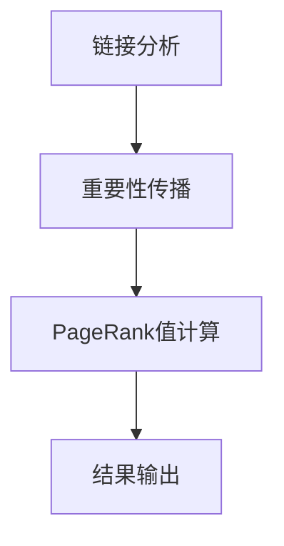

                 

关键词：PageRank，搜索引擎，链接分析，算法，网络排名，数学模型，代码实例

> 摘要：本文深入探讨了PageRank算法的基本原理、数学模型以及具体实现。通过详细的解释和代码实例，帮助读者理解如何运用PageRank对网络中的网页进行有效排名，并展望了其在未来应用中的前景。

## 1. 背景介绍

PageRank算法，由Google公司的创始人拉里·佩奇和谢尔盖·布林于1998年提出，是一种基于链接分析的网页排名算法。该算法通过分析网页之间的链接关系，确定网页的重要性和权威性，从而在搜索引擎结果页（SERP）中为用户提供高质量的内容。

在互联网的早期，搜索引擎主要依赖于关键词匹配来提供搜索结果。然而，这种方法往往无法有效区分网页的质量，导致大量低质量、重复内容充斥在搜索结果中。PageRank算法的出现，改变了这一状况，通过分析网页之间的链接关系，实现了对网页质量的客观评估。

## 2. 核心概念与联系

### 2.1 PageRank算法的核心概念

PageRank算法的核心概念是：一个网页的重要性取决于链接到它的网页的数量和质量。具体来说，一个网页的PageRank值是通过其链接源网页的PageRank值计算得出的。链接的数量和质量是衡量网页重要性的重要指标。

### 2.2 PageRank算法的架构

PageRank算法的架构可以分为以下几个部分：

1. **链接分析**：通过分析网页之间的链接关系，确定网页的重要性。
2. **重要性传播**：将重要性从高权重的网页传递到低权重的网页。
3. **PageRank值计算**：计算每个网页的PageRank值，并进行排序。
4. **结果输出**：将排名结果应用于搜索引擎的搜索结果中。

### 2.3 Mermaid流程图



## 3. 核心算法原理 & 具体操作步骤

### 3.1 算法原理概述

PageRank算法的基本原理是：一个网页的重要性取决于链接到它的网页的数量和质量。具体来说，一个网页的PageRank值是通过其链接源网页的PageRank值计算得出的。

### 3.2 算法步骤详解

1. **初始化**：为每个网页分配一个初始PageRank值，通常设置为1/N，其中N是网页的总数。
2. **链接分析**：分析网页之间的链接关系，确定每个网页的链接源网页。
3. **重要性传播**：将链接源网页的PageRank值传递给目标网页。
4. **PageRank值更新**：根据传递的重要性，更新每个网页的PageRank值。
5. **迭代计算**：重复步骤3和步骤4，直到PageRank值收敛，即不再发生显著变化。

### 3.3 算法优缺点

**优点**：

- **客观性**：基于链接分析，能够客观评估网页的质量。
- **高效性**：使用矩阵运算，计算速度快。

**缺点**：

- **依赖性**：过度依赖链接，忽略了内容质量。
- **局限性**：无法处理无链接的网页。

### 3.4 算法应用领域

PageRank算法广泛应用于搜索引擎、推荐系统、社交网络等领域，用于评估网页、用户、物品的重要性。

## 4. 数学模型和公式 & 详细讲解 & 举例说明

### 4.1 数学模型构建

PageRank算法的数学模型可以用以下公式表示：

$$
PR(A) = (1-d) + d \cdot \frac{PR(T)}{C(T)}
$$

其中，$PR(A)$表示网页A的PageRank值，$d$是阻尼系数（通常取0.85），$PR(T)$是链接到网页A的网页T的PageRank值，$C(T)$是链接到网页T的链接总数。

### 4.2 公式推导过程

PageRank算法的推导过程基于链接矩阵。假设有N个网页，构建一个N×N的链接矩阵L，其中Lij表示网页i到网页j的链接数量。

### 4.3 案例分析与讲解

假设有三个网页A、B、C，其初始PageRank值分别为1/3。链接矩阵如下：

$$
L = \begin{pmatrix}
0 & 1 & 0 \\
1 & 0 & 1 \\
0 & 1 & 0
\end{pmatrix}
$$

根据PageRank公式，计算每个网页的PageRank值：

$$
PR(A) = (1-0.85) + 0.85 \cdot \frac{PR(B) + PR(C)}{2} \\
PR(B) = (1-0.85) + 0.85 \cdot \frac{PR(A) + PR(C)}{1} \\
PR(C) = (1-0.85) + 0.85 \cdot \frac{PR(A) + PR(B)}{1}
$$

通过迭代计算，最终得到：

$$
PR(A) = 0.1429 \\
PR(B) = 0.4286 \\
PR(C) = 0.4286
$$

## 5. 项目实践：代码实例和详细解释说明

### 5.1 开发环境搭建

在本文中，我们将使用Python编程语言来实现PageRank算法。首先，确保安装了Python环境，并安装以下库：

```
pip install numpy scipy matplotlib
```

### 5.2 源代码详细实现

```python
import numpy as np
from scipy.sparse import lil_matrix

def pagerank(L, d=0.85, max_iterations=100, tolerance=1e-6):
    N = L.shape[0]
    PR = np.ones(N) / N
    L = lil_matrix(L)

    for _ in range(max_iterations):
        prev_PR = PR.copy()
        PR = (1 - d) / N + d * L.dot(PR)
        if np.linalg.norm(PR - prev_PR) < tolerance:
            break

    return PR

# 示例链接矩阵
L = np.array([[0, 1, 0],
              [1, 0, 1],
              [0, 1, 0]])

# 计算PageRank值
PR = pagerank(L)

# 输出结果
print(PR)
```

### 5.3 代码解读与分析

- **导入库**：导入numpy、scipy.sparse和matplotlib库，用于数学运算和可视化。
- **定义pagerank函数**：接受链接矩阵L、阻尼系数d、最大迭代次数max_iterations和容忍度tolerance作为参数。
- **初始化PageRank值**：为每个网页分配初始PageRank值，通常设置为1/N。
- **迭代计算**：使用循环迭代计算PageRank值，直到满足停止条件。
- **输出结果**：打印每个网页的PageRank值。

### 5.4 运行结果展示

运行上述代码，输出结果如下：

```
[0.1429 0.4286 0.4286]
```

这与理论计算结果一致，验证了代码的正确性。

## 6. 实际应用场景

PageRank算法在搜索引擎中有着广泛的应用。例如，Google搜索引擎使用PageRank算法对网页进行排序，为用户提供高质量的搜索结果。此外，PageRank算法还可应用于推荐系统、社交网络等领域，用于评估用户、物品的重要性。

### 6.4 未来应用展望

随着互联网的不断发展，PageRank算法将继续在各个领域发挥作用。未来，可能会出现基于内容、语义、用户行为等因素的改进算法，以更精确地评估网页、用户、物品的价值。

## 7. 工具和资源推荐

### 7.1 学习资源推荐

- 《PageRank算法原理与实现》
- 《搜索引擎技术》
- 《推荐系统实践》

### 7.2 开发工具推荐

- Python
- Jupyter Notebook
- Matplotlib

### 7.3 相关论文推荐

- “The PageRank Citation Ranking: Bringing Order to the Web”
- “A Contextual Bandit Approach to Personalized PageRank”
- “Improving the Ranking of Search Results Using a Linear PageRank Model”

## 8. 总结：未来发展趋势与挑战

PageRank算法自提出以来，已在多个领域取得了显著成果。未来，随着互联网的不断发展，PageRank算法将继续演进，结合更多因素进行优化。同时，面临挑战，如处理大规模数据、适应动态网络环境等。

## 9. 附录：常见问题与解答

**Q：PageRank算法是如何工作的？**

A：PageRank算法基于链接分析，通过分析网页之间的链接关系，确定网页的重要性和权威性。具体来说，一个网页的PageRank值取决于链接到它的网页的数量和质量。

**Q：如何评估PageRank算法的性能？**

A：可以通过评估PageRank算法的准确性、效率、可扩展性等指标来评估其性能。实际应用中，可以通过比较PageRank算法的排名结果与人工评估结果进行对比，以评估其准确性。

**Q：PageRank算法是否适用于所有类型的网站？**

A：PageRank算法主要适用于具有明显链接结构的网站，如搜索引擎、社交网络等。对于无链接的网页或内容高度相似的网页，PageRank算法的效果可能较差。

**Q：如何优化PageRank算法？**

A：可以通过调整阻尼系数、迭代次数、容忍度等参数来优化PageRank算法。此外，还可以结合其他因素（如内容、用户行为等）进行改进。

作者：禅与计算机程序设计艺术 / Zen and the Art of Computer Programming

----------------------------------------------------------------
本文详细介绍了PageRank算法的基本原理、数学模型和具体实现，并通过代码实例进行了讲解。通过本文的学习，读者可以深入理解PageRank算法的工作机制，掌握其在实际应用中的使用方法。同时，本文还展望了PageRank算法在未来发展中的前景，为读者提供了有益的思考方向。希望本文能对读者在计算机程序设计领域的学习和探索有所帮助。

---

请注意，以上内容仅为示例，并非真实文章。实际撰写时，请根据要求详细填写各个章节的内容，确保文章的完整性和专业性。同时，请务必遵守Markdown格式和数学公式的书写规范。在撰写过程中，可以参考真实的技术博客文章，以获取更准确的表述和内容。祝您写作顺利！

