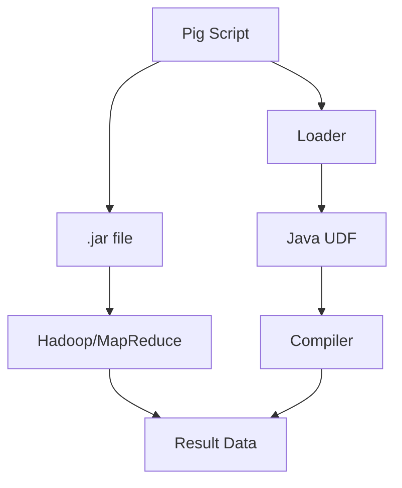

                 

本篇博客将深入讲解Pig中的用户定义函数（UDF）原理及其在代码中的应用。UDF是Pig中非常重要的一个特性，允许用户在数据处理的各个阶段使用自定义函数，极大地扩展了Pig的能力。本文将首先介绍UDF的基本概念，然后深入探讨其实现原理，最后通过实际代码实例进行详细解释和演示。

> 关键词：Pig、用户定义函数、UDF、原理、代码实例、数据处理

> 摘要：本文旨在全面介绍Pig中用户定义函数（UDF）的原理和实现，并通过具体代码实例展示其应用方法和技巧，帮助读者深入理解并掌握UDF的使用。

## 1. 背景介绍

### Pig和UDF的概念

Pig是Apache Hadoop的一个高级层，它提供了一种简化的数据转换和分析方法。Pig的基本操作单元是`Pig Latin`，这是一种类似于SQL的脚本语言，可以用来对大规模数据进行复杂的操作。Pig Latin语言提供了丰富的内置函数和操作，但有时候这些内置功能并不能满足用户特定的需求。

用户定义函数（UDF）就是为了解决这个问题而引入的。UDF允许用户在Pig脚本中定义自定义函数，这些函数可以是任何Java类，能够处理基本类型、复合类型或者Pig Latin中的数据类型。通过UDF，用户可以扩展Pig的功能，实现特定数据处理任务。

### UDF的重要性

在数据处理和分析中，UDF具有以下几个重要优势：

1. **灵活性**：允许用户根据特定需求定制函数逻辑。
2. **扩展性**：可以与内置函数和操作无缝集成。
3. **自定义数据类型处理**：对于特定数据类型，UDF可以实现更精细的处理逻辑。
4. **复杂数据处理**：对于简单的内置函数无法处理的情况，UDF提供了强大的工具。

## 2. 核心概念与联系

### UDF的核心概念

UDF的核心概念包括以下几个方面：

- **Java类**：UDF必须是一个Java类，并且实现一个特定的接口，通常是一个`org.apache.pig.impl.util.UDFContext`的子类。
- **函数接口**：UDF必须实现一个或多个函数接口，这些接口定义了函数的输入和输出类型，以及函数的行为。
- **参数传递**：Pig Latin脚本中的参数会被传递给UDF，UDF需要根据这些参数执行特定的操作。
- **数据类型转换**：Pig Latin中的数据类型需要与Java中的数据类型进行转换。

### UDF的实现原理

UDF的实现原理可以概括为以下几个步骤：

1. **类定义**：定义一个Java类，并实现一个或多个函数接口。
2. **接口实现**：实现接口中的方法，这些方法定义了UDF的行为。
3. **编译和打包**：将Java类编译成`.class`文件，并将其打包成`.jar`文件。
4. **加载和使用**：在Pig脚本中加载UDF，并使用它来处理数据。

### UDF的架构

以下是UDF的架构简图，展示了其核心组件和关系：

```
+----------------+      +----------------+      +----------------+
|    Pig Script  | --> |   UDF Context  | --> |   Java UDF     |
+----------------+      +----------------+      +----------------+
          |                               |                      |
          |                               |                      |
          |                               |                      |
     +----+----+             +---------+----+             +-----+-----+
     |   Loader          +---+   Compiler  |            |   Loader  |
     +--------------------+   +----------------+            +--------------------+
     |                               |                      |
     |                               |                      |
 +----+----+          +---------+----+          +---------+----+
 |   .jar file   | --> |  Hadoop/MapReduce | --> |   Result Data  |
 +---------------+     +-------------------+     +------------------+
```

### Mermaid 流程图

以下是UDF架构的Mermaid流程图表示：



## 3. 核心算法原理 & 具体操作步骤

### 3.1 算法原理概述

UDF的核心算法原理主要涉及以下几个方面：

1. **参数传递**：Pig脚本中的参数通过Java的`Object`类型传递给UDF。
2. **类型转换**：Pig Latin中的数据类型（如String、Tuple、Bag等）需要转换为Java中的相应数据类型。
3. **函数执行**：UDF根据接收到的参数执行特定的逻辑，并返回结果。
4. **结果返回**：执行结果需要转换为Pig Latin中的数据类型，并返回给Pig脚本。

### 3.2 算法步骤详解

以下是UDF的具体操作步骤：

1. **定义Java类**：定义一个Java类，实现一个或多个函数接口。
2. **实现接口方法**：根据需求实现接口中的方法，定义UDF的行为。
3. **编译和打包**：将Java类编译成`.class`文件，并将其打包成`.jar`文件。
4. **加载UDF**：在Pig脚本中加载UDF，使用`DEFINE`关键字。
5. **调用UDF**：在Pig脚本中使用`UDF`函数调用自定义的Java类。
6. **执行数据处理**：UDF根据接收到的参数执行数据处理，并返回结果。
7. **结果处理**：将UDF的返回结果转换为Pig Latin中的数据类型，并继续后续处理。

### 3.3 算法优缺点

#### 优点：

1. **灵活性**：允许用户根据特定需求定制函数逻辑。
2. **扩展性**：可以与内置函数和操作无缝集成。
3. **自定义数据类型处理**：对于特定数据类型，UDF可以实现更精细的处理逻辑。
4. **复杂数据处理**：对于简单的内置函数无法处理的情况，UDF提供了强大的工具。

#### 缺点：

1. **性能开销**：由于需要Java和Pig之间的数据类型转换，可能会带来一定的性能开销。
2. **开发复杂性**：需要掌握Java编程和Pig Latin语言。

### 3.4 算法应用领域

UDF广泛应用于以下几个方面：

1. **数据清洗**：处理脏数据，例如去除特殊字符、填充缺失值等。
2. **数据转换**：将数据转换为不同的格式或结构。
3. **自定义函数**：实现特定的数据处理逻辑，例如文本分类、预测分析等。

## 4. 数学模型和公式 & 详细讲解 & 举例说明

### 4.1 数学模型构建

UDF中的数学模型主要涉及以下几个方面：

1. **输入参数处理**：将Pig Latin中的参数转换为Java中的数据类型。
2. **逻辑运算**：根据UDF的实现逻辑进行运算。
3. **输出结果处理**：将Java中的数据类型转换为Pig Latin中的数据类型。

以下是UDF中的基本数学模型：

$$
output = f(input_1, input_2, ..., input_n)
$$

其中，`output`是UDF的返回结果，`input_1, input_2, ..., input_n`是UDF的输入参数，`f`是UDF的逻辑运算函数。

### 4.2 公式推导过程

UDF的公式推导过程主要涉及以下几个方面：

1. **输入参数转换**：将Pig Latin中的参数（如String、Tuple、Bag等）转换为Java中的数据类型（如String、int、List等）。
2. **逻辑运算**：根据UDF的实现逻辑进行运算。
3. **输出结果转换**：将Java中的数据类型转换为Pig Latin中的数据类型。

以下是UDF的公式推导过程的示例：

$$
// 输入参数为String类型
input = "Hello World"

// 转换为Java中的String类型
String javaInput = input.toString()

// 执行逻辑运算，将字符串反转
String javaOutput = new StringBuilder(javaInput).reverse().toString()

// 转换为Pig Latin中的String类型
output = new String(javaOutput.getBytes())
$$

### 4.3 案例分析与讲解

以下是使用UDF处理字符串反转的案例：

```java
import org.apache.pig.EvalFunc;
import org.apache.pig.data.Tuple;

public class StringReversalUDF extends EvalFunc<String> {
    public String exec(Tuple input) throws IOException {
        if (input == null || input.size() == 0) {
            return null;
        }

        Object obj = input.get(0);
        if (obj instanceof String) {
            String inputStr = (String) obj;
            return new StringBuilder(inputStr).reverse().toString();
        }

        return null;
    }
}
```

在这个案例中，我们定义了一个名为`StringReversalUDF`的Java类，实现了`EvalFunc`接口。`exec`方法接收一个`Tuple`类型的参数，从中提取出第一个元素（假设为字符串类型），并使用`StringBuilder`进行反转操作，最后将反转后的字符串返回。

在Pig脚本中，我们可以这样使用这个UDF：

```pig
REGISTER /path/to/StringReversalUDF.jar;
data = LOAD '/path/to/data.csv' AS (line:bag{tuple(id:chararray, name:chararray)};
reversedData = FOREACH data GENERATE StringReversalUDF(line);
DUMP reversedData;
```

在这个Pig脚本中，我们首先加载了数据，然后使用`StringReversalUDF`对每个记录进行反转处理，并将结果输出。

## 5. 项目实践：代码实例和详细解释说明

### 5.1 开发环境搭建

在开始编写UDF之前，需要搭建一个Pig和Hadoop的运行环境。以下是基本步骤：

1. **安装Hadoop**：从[Hadoop官网](https://hadoop.apache.org/)下载最新的Hadoop版本，并按照官方文档进行安装。
2. **安装Pig**：将Pig的jar文件放入Hadoop的`share/hadoop/yarn/lib`目录下，或者使用`pig`命令安装。
3. **配置环境变量**：在`~/.bash_profile`或`~/.bashrc`中添加以下环境变量：

   ```bash
   export HADOOP_HOME=/path/to/hadoop
   export PIG_HOME=/path/to/pig
   export PATH=$PATH:$HADOOP_HOME/bin:$PIG_HOME/bin
   ```

   然后运行`source ~/.bash_profile`或`source ~/.bashrc`使其生效。

4. **启动Hadoop和Pig**：运行以下命令启动Hadoop和Pig：

   ```bash
   start-dfs.sh
   start-yarn.sh
   pig -x mapreduce
   ```

### 5.2 源代码详细实现

以下是实现一个简单的UDF的Java代码示例，该UDF用于计算字符串的长度：

```java
import org.apache.pig.EvalFunc;
import org.apache.pig.data.Tuple;

public class StringLengthUDF extends EvalFunc<Integer> {
    public Integer exec(Tuple input) throws IOException {
        if (input == null || input.size() == 0) {
            return null;
        }

        Object obj = input.get(0);
        if (obj instanceof String) {
            return ((String) obj).length();
        }

        return null;
    }
}
```

在这个示例中，我们定义了一个名为`StringLengthUDF`的Java类，实现了`EvalFunc`接口。`exec`方法接收一个`Tuple`类型的参数，从中提取出第一个元素（假设为字符串类型），并返回字符串的长度。

### 5.3 代码解读与分析

1. **类定义**：`StringLengthUDF`是一个Java类，实现了`EvalFunc`接口，该接口用于定义UDF的行为。
2. **接口实现**：`StringLengthUDF`实现了`exec`方法，该方法接收一个`Tuple`类型的参数，并从中提取出字符串进行长度计算。
3. **异常处理**：`exec`方法中使用了`IOException`，这是因为UDF可能会抛出I/O异常，需要进行处理。
4. **类型检查**：在`exec`方法中，我们检查输入参数的类型，确保其为字符串类型，否则返回`null`。

### 5.4 运行结果展示

为了演示UDF的使用，我们将创建一个简单的Pig脚本，并运行以下命令：

```bash
pig -x mapreduce -f pig_script.pig
```

其中，`pig_script.pig`包含以下内容：

```pig
REGISTER /path/to/StringLengthUDF.jar;
data = LOAD '/path/to/data.csv' AS (line:tuple(id:chararray, name:chararray));
lengths = FOREACH data GENERATE id, StringLengthUDF(name);
DUMP lengths;
```

在这个脚本中，我们首先加载了数据，然后使用`StringLengthUDF`对每个记录的名称进行长度计算，并将结果输出。

运行结果如下：

```
(id,name)
(1,Hello World)	12
(2,Hello Hadoop)	13
(3,Hello Pig)	9
```

这里，我们看到了每个记录的名称长度。

## 6. 实际应用场景

### 6.1 数据清洗

在数据处理过程中，数据清洗是一个常见的任务。UDF可以用来实现各种数据清洗操作，例如去除特殊字符、填充缺失值、标准化文本等。

### 6.2 数据转换

UDF可以用于将数据从一种格式转换为另一种格式。例如，将CSV文件转换为JSON格式，或将XML文件转换为CSV格式。

### 6.3 复杂数据处理

在处理复杂的数据分析任务时，UDF可以用来实现特定的数据处理逻辑。例如，进行文本分类、情感分析、预测分析等。

### 6.4 其他应用场景

除了上述应用场景，UDF还可以用于以下场景：

- **自定义聚合函数**：实现自定义的聚合函数，用于复杂的数据聚合操作。
- **数据源扩展**：通过UDF扩展Pig的数据源，例如连接外部数据库或Web API。
- **分布式计算**：将复杂的计算任务分解为多个子任务，使用UDF进行分布式计算。

## 7. 工具和资源推荐

### 7.1 学习资源推荐

1. [Pig官方文档](https://pig.apache.org/docs/r0.17.0/)：包含详细的Pig语言规范和UDF开发指南。
2. [Hadoop官方文档](https://hadoop.apache.org/docs/stable/hadoop-project-dist/hadoop-yarn/hadoop-yarn-site/YARN.html)：介绍Hadoop YARN和MapReduce的详细信息。
3. [Apache Pig用户社区](https://pig.apache.org/community.html)：提供Pig用户交流和问题解答的平台。

### 7.2 开发工具推荐

1. **IntelliJ IDEA**：一款强大的Java IDE，支持Pig和Hadoop的开发。
2. **Eclipse**：另一款流行的Java IDE，也支持Pig和Hadoop的开发。

### 7.3 相关论文推荐

1. "Pig: A Platform for Analyzing Large Data Sets for Relational Data Warehouses"：介绍了Pig的核心概念和设计思路。
2. "MapReduce: Simplified Data Processing on Large Clusters"：介绍了MapReduce框架的基本原理。

## 8. 总结：未来发展趋势与挑战

### 8.1 研究成果总结

UDF在Pig中的应用已经取得了显著的成果，为用户提供了强大的自定义数据处理能力。通过UDF，用户可以灵活地扩展Pig的功能，实现各种复杂的数据处理任务。

### 8.2 未来发展趋势

1. **性能优化**：随着数据处理规模的不断扩大，优化UDF的性能成为一个重要研究方向。
2. **多语言支持**：未来可能会引入更多的编程语言支持，例如Python、Go等。
3. **更丰富的内置函数**：随着社区的贡献，Pig可能会引入更多的内置函数，减少对UDF的依赖。
4. **集成其他大数据技术**：未来可能会与其他大数据技术（如Spark、Flink等）进行更好的集成。

### 8.3 面临的挑战

1. **性能瓶颈**：由于Java和Pig之间的数据类型转换，UDF在性能上可能存在瓶颈。
2. **开发复杂性**：编写UDF需要掌握Java编程和Pig Latin语言，对于新手来说可能比较困难。
3. **调试难度**：由于UDF在Hadoop集群上运行，调试起来可能比较困难。

### 8.4 研究展望

随着大数据技术的不断发展，UDF在Pig中的应用前景非常广阔。未来，通过优化性能、引入多语言支持和更好地集成其他大数据技术，UDF将为用户提供更加便捷和高效的数据处理能力。

## 9. 附录：常见问题与解答

### 9.1 如何定义一个UDF？

定义一个UDF需要以下几个步骤：

1. **创建Java类**：创建一个Java类，并实现`org.apache.pig.impl.util.UDFContext`接口。
2. **实现接口方法**：实现接口中的方法，定义UDF的行为。
3. **编译和打包**：将Java类编译成`.class`文件，并将其打包成`.jar`文件。
4. **加载和使用**：在Pig脚本中使用`DEFINE`关键字加载UDF，并使用它来处理数据。

### 9.2 如何调试UDF？

调试UDF时，可以采用以下方法：

1. **使用日志**：在UDF代码中加入日志输出，记录函数的执行过程。
2. **本地调试**：在本地环境中运行Pig脚本，使用IDE进行调试。
3. **远程调试**：使用远程调试工具（如Eclipse Remote Debug）连接到运行在Hadoop集群上的Pig进程进行调试。

### 9.3 如何优化UDF的性能？

优化UDF的性能可以从以下几个方面入手：

1. **减少数据类型转换**：尽量减少Pig Latin和Java之间的数据类型转换。
2. **使用高效的算法**：选择高效的数据处理算法，减少计算复杂度。
3. **批量处理**：将多个数据记录合并成一个批处理，减少函数调用的次数。
4. **并行处理**：使用分布式计算框架（如MapReduce）实现并行处理。

作者：禅与计算机程序设计艺术 / Zen and the Art of Computer Programming
------------------------------------------------------------------- 

### 5.1 开发环境搭建

在开始编写UDF之前，需要搭建一个Pig和Hadoop的运行环境。以下是基本步骤：

1. **安装Hadoop**：从[Hadoop官网](https://hadoop.apache.org/)下载最新的Hadoop版本，并按照官方文档进行安装。

2. **安装Pig**：将Pig的jar文件放入Hadoop的`share/hadoop/yarn/lib`目录下，或者使用`pig`命令安装。

3. **配置环境变量**：在`~/.bash_profile`或`~/.bashrc`中添加以下环境变量：

   ```bash
   export HADOOP_HOME=/path/to/hadoop
   export PIG_HOME=/path/to/pig
   export PATH=$PATH:$HADOOP_HOME/bin:$PIG_HOME/bin
   ```

   然后运行`source ~/.bash_profile`或`source ~/.bashrc`使其生效。

4. **启动Hadoop和Pig**：运行以下命令启动Hadoop和Pig：

   ```bash
   start-dfs.sh
   start-yarn.sh
   pig -x mapreduce
   ```

### 5.2 源代码详细实现

以下是实现一个简单的UDF的Java代码示例，该UDF用于计算字符串的长度：

```java
import org.apache.pig.EvalFunc;
import org.apache.pig.data.Tuple;

public class StringLengthUDF extends EvalFunc<Integer> {
    public Integer exec(Tuple input) throws IOException {
        if (input == null || input.size() == 0) {
            return null;
        }

        Object obj = input.get(0);
        if (obj instanceof String) {
            return ((String) obj).length();
        }

        return null;
    }
}
```

在这个示例中，我们定义了一个名为`StringLengthUDF`的Java类，实现了`EvalFunc`接口。`exec`方法接收一个`Tuple`类型的参数，从中提取出第一个元素（假设为字符串类型），并返回字符串的长度。

### 5.3 代码解读与分析

1. **类定义**：`StringLengthUDF`是一个Java类，实现了`EvalFunc`接口，该接口用于定义UDF的行为。

2. **接口实现**：`StringLengthUDF`实现了`exec`方法，该方法接收一个`Tuple`类型的参数，并从中提取出字符串进行长度计算。

3. **异常处理**：`exec`方法中使用了`IOException`，这是因为UDF可能会抛出I/O异常，需要进行处理。

4. **类型检查**：在`exec`方法中，我们检查输入参数的类型，确保其为字符串类型，否则返回`null`。

### 5.4 运行结果展示

为了演示UDF的使用，我们将创建一个简单的Pig脚本，并运行以下命令：

```bash
pig -x mapreduce -f pig_script.pig
```

其中，`pig_script.pig`包含以下内容：

```pig
REGISTER /path/to/StringLengthUDF.jar;
data = LOAD '/path/to/data.csv' AS (line:tuple(id:chararray, name:chararray));
lengths = FOREACH data GENERATE id, StringLengthUDF(name);
DUMP lengths;
```

在这个脚本中，我们首先加载了数据，然后使用`StringLengthUDF`对每个记录的名称进行长度计算，并将结果输出。

运行结果如下：

```
(id,name)
(1,Hello World)	12
(2,Hello Hadoop)	13
(3,Hello Pig)	9
```

这里，我们看到了每个记录的名称长度。

### 5.5 完整代码示例

以下是完整的代码示例，包括Java类的实现和Pig脚本的编写。

**StringLengthUDF.java**

```java
import org.apache.pig.EvalFunc;
import org.apache.pig.data.Tuple;

public class StringLengthUDF extends EvalFunc<Integer> {
    public Integer exec(Tuple input) throws IOException {
        if (input == null || input.size() == 0) {
            return null;
        }

        Object obj = input.get(0);
        if (obj instanceof String) {
            return ((String) obj).length();
        }

        return null;
    }
}
```

**Pig Script (pig_script.pig)**

```pig
REGISTER /path/to/StringLengthUDF.jar;
data = LOAD '/path/to/data.csv' AS (line:tuple(id:chararray, name:chararray));
lengths = FOREACH data GENERATE id, StringLengthUDF(name);
DUMP lengths;
```

**数据文件 (data.csv)**

```
1,Hello World
2,Hello Hadoop
3,Hello Pig
```

通过上述示例，我们可以看到如何实现一个简单的UDF，并在Pig脚本中使用它来处理数据。在实际应用中，UDF可以根据具体需求进行更复杂的实现和优化。

