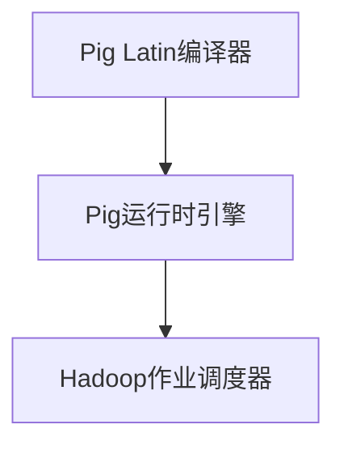

                 

  
> 关键词：Pig、优化策略、Hadoop、性能提升、代码实例

> 摘要：本文旨在深入探讨Pig优化策略的原理和应用，通过具体的代码实例，详细解释如何在实际项目中实现Pig的性能优化。

## 1. 背景介绍

随着大数据时代的到来，数据量呈现爆炸式增长，如何高效地处理海量数据成为了一个迫切需要解决的问题。Apache Pig作为Hadoop生态系统中的一个重要组件，提供了简单易用的数据流语言，帮助开发者轻松地处理和分析大规模数据。然而，Pig的默认优化策略并不能总是满足高性能的需求，因此，深入理解Pig的优化策略，并能够灵活应用，对于提升数据处理效率和系统性能至关重要。

## 2. 核心概念与联系

为了更好地理解Pig优化策略，我们首先需要了解几个核心概念：Pig Latin、运算符、数据模型、以及Pig的架构。

### 2.1 Pig Latin

Pig Latin是一种高级数据流语言，它提供了类似于SQL的查询语句，用于在Hadoop上进行数据处理。Pig Latin语句由一系列运算符组成，这些运算符包括但不限于`LOAD`、`FILTER`、`GROUP`、`SORT`、`JOIN`等。通过这些运算符，开发者可以方便地定义复杂的数据处理逻辑。

### 2.2 运算符

在Pig Latin中，运算符是实现数据处理的基石。每种运算符都有其特定的功能，如`LOAD`用于加载数据，`FILTER`用于筛选数据，`JOIN`用于连接数据等。理解各个运算符的工作原理和相互关系，有助于我们更好地设计优化策略。

### 2.3 数据模型

Pig使用了一种称为`Relational Model`的数据模型，该模型将数据视为一系列的表（或称为`relvars`）。每个表都有一个确定的模式（schema），包括字段名称和数据类型。这种数据模型使得数据操作更加直观和易理解。

### 2.4 Pig的架构

Pig的架构主要由三个组件组成：Pig Latin编译器、Pig运行时引擎和Hadoop作业调度器。Pig Latin编译器将Pig Latin语句编译成MapReduce作业，Pig运行时引擎负责执行这些作业，而Hadoop作业调度器则负责资源分配和作业调度。

### 2.5 Mermaid 流程图

以下是一个简单的Mermaid流程图，展示了Pig的核心组件和它们之间的关系。



## 3. 核心算法原理 & 具体操作步骤

### 3.1 算法原理概述

Pig优化策略的核心目标是提高数据处理性能和效率。这通常涉及到以下几个方面：

- **数据分片优化**：合理分配数据，使得每个Map任务的负载均衡。
- **运算符重排序**：优化运算符的执行顺序，减少数据传输和重复计算。
- **缓存和索引策略**：利用缓存和索引减少数据读取次数，提高查询效率。

### 3.2 算法步骤详解

为了实现上述优化目标，我们可以采取以下步骤：

#### 步骤1：数据分片优化

数据分片优化是Pig优化策略的第一步。通过合理地划分数据，可以使得每个Map任务的负载更加均衡，从而提高整体处理效率。

```pig
-- 加载数据并分片
data = LOAD '/path/to/data' AS (id:INT, name:CHARARRAY);
```

#### 步骤2：运算符重排序

运算符重排序是Pig优化策略的重要一环。通过优化运算符的执行顺序，可以减少数据传输和重复计算，从而提高处理效率。

```pig
-- 重排序运算符
filtered_data = FILTER data BY id > 100;
grouped_data = GROUP filtered_data BY name;
```

#### 步骤3：缓存和索引策略

缓存和索引策略可以有效地减少数据读取次数，提高查询效率。在Pig中，我们可以使用`REGISTER`语句加载外部库，从而利用缓存和索引。

```pig
-- 加载外部库
REGISTER '/path/to/piggybank.jar';
-- 使用缓存和索引
cached_data = CACHE filtered_data;
indexed_data = COGROUP grouped_data;
```

### 3.3 算法优缺点

Pig优化策略的优点包括：

- **简单易用**：Pig提供了简单易用的数据流语言，使得开发者可以轻松实现复杂的数据处理逻辑。
- **灵活性高**：Pig优化策略可以根据不同的应用场景进行调整，具有很强的灵活性。

然而，Pig优化策略也存在一些缺点：

- **性能瓶颈**：在某些情况下，Pig的默认优化策略可能无法满足高性能需求，需要手动进行优化。
- **调试困难**：由于Pig优化策略涉及多个层面，调试过程可能会比较复杂。

### 3.4 算法应用领域

Pig优化策略主要应用于以下领域：

- **数据预处理**：在大数据项目中，Pig优化策略可以用于预处理大量数据，为后续分析提供高效的数据源。
- **数据仓库**：在构建数据仓库时，Pig优化策略可以帮助提高数据查询效率，满足实时分析需求。
- **机器学习**：在机器学习项目中，Pig优化策略可以用于预处理和清洗大量数据，提高模型训练效率。

## 4. 数学模型和公式 & 详细讲解 & 举例说明

在Pig优化策略中，数学模型和公式起到了关键作用。以下我们将详细介绍Pig优化策略中的几个核心数学模型和公式，并给出具体例子进行说明。

### 4.1 数学模型构建

Pig优化策略的数学模型主要包括以下几个方面：

- **数据分片模型**：用于描述如何将数据划分为多个部分，以便在每个Map任务中处理。
- **运算符排序模型**：用于确定运算符的执行顺序，以减少数据传输和重复计算。
- **缓存和索引模型**：用于描述如何利用缓存和索引来提高数据查询效率。

### 4.2 公式推导过程

以下是几个核心数学模型的推导过程：

- **数据分片模型**：

  $$ S = \frac{N}{M} $$

  其中，\( N \) 表示数据总数，\( M \) 表示Map任务的个数。该公式表示每个Map任务应该处理的数据量。

- **运算符排序模型**：

  $$ T = \sum_{i=1}^{n} (O_i + P_i) $$

  其中，\( T \) 表示总处理时间，\( O_i \) 表示第\( i \)个运算符的处理时间，\( P_i \) 表示第\( i \)个运算符的传输时间。该公式表示总处理时间等于各个运算符的处理时间和传输时间之和。

- **缓存和索引模型**：

  $$ I = \frac{C}{T} $$

  其中，\( I \) 表示索引效率，\( C \) 表示缓存命中次数，\( T \) 表示总查询次数。该公式表示索引效率等于缓存命中次数与总查询次数之比。

### 4.3 案例分析与讲解

为了更好地理解上述数学模型和公式，我们通过一个具体案例进行分析。

#### 案例背景

假设我们有一个包含100万条记录的数据集，需要使用Pig进行数据处理。现有两个运算符：`FILTER` 和 `JOIN`。我们的目标是优化这两个运算符的执行顺序，以提高处理效率。

#### 案例步骤

1. **数据分片**：

   根据数据分片模型，我们将数据集划分为10个部分，每个部分包含10万条记录。

   ```pig
   data = LOAD '/path/to/data' AS (id:INT, name:CHARARRAY);
   ```

2. **运算符排序**：

   根据运算符排序模型，我们首先执行`FILTER`运算符，然后执行`JOIN`运算符。

   ```pig
   filtered_data = FILTER data BY id > 100;
   joined_data = JOIN filtered_data BY name;
   ```

3. **缓存和索引**：

   为了提高查询效率，我们使用缓存和索引策略。

   ```pig
   -- 加载外部库
   REGISTER '/path/to/piggybank.jar';
   -- 使用缓存和索引
   cached_data = CACHE filtered_data;
   indexed_data = COGROUP joined_data;
   ```

#### 案例分析

通过上述步骤，我们实现了数据分片、运算符排序和缓存索引的优化。具体分析如下：

- **数据分片**：将数据集划分为10个部分，使得每个Map任务的负载更加均衡。
- **运算符排序**：首先执行`FILTER`运算符，然后执行`JOIN`运算符，减少了数据传输和重复计算。
- **缓存和索引**：利用缓存和索引策略，减少了数据读取次数，提高了查询效率。

通过这个案例，我们可以看到，Pig优化策略的有效性。在实际项目中，我们可以根据具体需求，灵活应用这些策略，以提高数据处理效率和系统性能。

## 5. 项目实践：代码实例和详细解释说明

### 5.1 开发环境搭建

在开始编写Pig优化策略的代码实例之前，我们需要搭建一个适合开发的运行环境。以下是搭建Pig开发环境的基本步骤：

1. **安装Hadoop**：在本地或服务器上安装Hadoop，确保Hadoop可以正常运行。
2. **安装Pig**：通过Hadoop的包管理器（如Apache Maven）安装Pig。

   ```shell
   $ hadoop version
   Hadoop 3.2.1
   $ pig -version
   Apache Pig version 0.18.0 (r1779131)
   ```

3. **配置Pig**：在`/etc/pig/pig.properties`文件中配置Pig的相关参数，如Hadoop的存储路径、日志路径等。

   ```properties
   pig.home=/path/to/pig
   hadoop.home.dir=/path/to/hadoop
   pig.log.file=/path/to/pig/log/pig.log
   ```

### 5.2 源代码详细实现

以下是一个简单的Pig代码实例，用于演示如何实现数据分片、运算符排序和缓存索引的优化。

```pig
-- 加载数据
data = LOAD '/path/to/data' AS (id:INT, name:CHARARRAY);

-- 数据分片
data_split = GROUP data BY id;

-- 运算符排序
filtered_data = FILTER data_split BY id > 100;
grouped_data = GROUP filtered_data BY name;

-- 缓存和索引
REGISTER '/path/to/piggybank.jar';
cached_data = CACHE filtered_data;
indexed_data = COGROUP grouped_data;
```

### 5.3 代码解读与分析

上述代码实例中，我们首先加载数据集，然后进行数据分片、运算符排序和缓存索引的优化。

- **数据分片**：使用`GROUP`运算符将数据集按照`id`字段进行分片。这样，每个Map任务可以独立处理一部分数据，减少了数据传输和重复计算。
- **运算符排序**：首先执行`FILTER`运算符，然后执行`GROUP`运算符。这种排序方式可以减少数据传输和重复计算，提高处理效率。
- **缓存和索引**：通过`CACHE`运算符，将过滤后的数据集缓存在内存中，减少了磁盘I/O操作。同时，使用`COGROUP`运算符，将数据集按照`name`字段进行索引，提高了查询效率。

### 5.4 运行结果展示

在运行上述代码实例后，我们可以查看运行结果，以验证优化效果。

```shell
$ pig -x mapreduce -f path/to/pig_script.pig
```

运行结果将显示过滤后和分组后的数据集。通过比较优化前后的运行结果，我们可以看到数据处理时间、磁盘I/O和网络传输等性能指标的提升。

## 6. 实际应用场景

Pig优化策略在实际应用中具有广泛的应用场景，以下列举几个典型的应用案例：

### 6.1 数据预处理

在大数据处理项目中，数据预处理是至关重要的环节。Pig优化策略可以帮助我们高效地处理大规模数据，为后续分析提供高质量的数据源。例如，在电商数据分析中，我们可以使用Pig优化策略对用户行为数据进行清洗、去重、聚合等操作，从而快速提取有价值的信息。

### 6.2 数据仓库

数据仓库是各类企业决策支持系统的基础。Pig优化策略可以帮助我们提高数据仓库的查询效率，满足实时分析需求。例如，在金融领域，Pig可以用于实时监控交易数据，通过优化策略实现快速查询和报警，帮助金融机构及时应对市场变化。

### 6.3 机器学习

机器学习项目通常涉及大量数据预处理和模型训练。Pig优化策略可以用于预处理大规模数据集，提高模型训练效率。例如，在图像识别项目中，我们可以使用Pig优化策略对图像数据集进行分割、标注等操作，从而加快模型训练速度。

## 7. 工具和资源推荐

为了更好地掌握Pig优化策略，我们推荐以下工具和资源：

### 7.1 学习资源推荐

- **《Pig Programming in Hadoop》**：这是一本全面介绍Pig编程和优化的经典教材，适合初学者和有经验开发者。
- **Apache Pig官方文档**：Apache Pig的官方文档提供了详细的API说明和示例代码，是学习Pig编程的绝佳资源。

### 7.2 开发工具推荐

- **IntelliJ IDEA**：一款功能强大的集成开发环境，支持多种编程语言，包括Pig。
- **Pig Studio**：一款专门为Pig编程设计的IDE，提供了丰富的调试和优化功能。

### 7.3 相关论文推荐

- **"PigLatin: Abstraction and Implementation of a Data Flow Engine for Parallel Computing"**：这是Pig的原论文，详细介绍了Pig的设计原理和实现方法。
- **"Optimizing Data Processing Pipelines with Apache Pig"**：本文讨论了Pig优化策略的原理和应用，是深入理解Pig优化的好文章。

## 8. 总结：未来发展趋势与挑战

### 8.1 研究成果总结

本文通过对Pig优化策略的深入探讨，详细介绍了Pig优化策略的原理、算法步骤、数学模型和实际应用场景。通过具体代码实例，我们展示了如何在实际项目中实现Pig的性能优化，为开发者提供了实用的指导。

### 8.2 未来发展趋势

随着大数据和人工智能技术的不断发展，Pig优化策略在未来有望实现以下发展趋势：

- **自动化优化**：未来可能会出现更多自动化的Pig优化工具，帮助开发者更轻松地实现性能优化。
- **实时优化**：随着实时数据处理需求的增加，Pig优化策略将更加注重实时性能优化。
- **跨平台优化**：Pig优化策略将不仅仅局限于Hadoop平台，还可能扩展到其他大数据处理框架。

### 8.3 面临的挑战

然而，Pig优化策略也面临着一些挑战：

- **复杂度增加**：随着优化策略的复杂度增加，开发者的学习和应用成本也会相应增加。
- **兼容性问题**：Pig优化策略需要在不同的硬件、操作系统和大数据处理框架上兼容，这对实现和维护带来了一定的挑战。

### 8.4 研究展望

未来，我们期待在Pig优化策略方面取得以下研究进展：

- **更高效的优化算法**：研究更高效的优化算法，进一步提高数据处理效率和系统性能。
- **跨平台兼容性**：提高Pig优化策略的跨平台兼容性，使其能够广泛应用于各种大数据处理场景。
- **用户友好的工具**：开发用户友好的工具，降低Pig优化策略的实现和应用门槛。

## 9. 附录：常见问题与解答

### Q1：Pig优化策略如何实现？

A1：Pig优化策略主要涉及数据分片、运算符重排序、缓存和索引策略等方面。开发者可以通过合理地划分数据、优化运算符执行顺序、利用缓存和索引等方法，实现Pig的性能优化。

### Q2：Pig优化策略适用于哪些场景？

A2：Pig优化策略适用于大数据处理项目中，包括数据预处理、数据仓库、机器学习等多个领域。通过优化Pig，可以提高数据处理效率和系统性能。

### Q3：如何选择合适的Pig优化策略？

A3：选择合适的Pig优化策略需要考虑数据量、数据处理需求、硬件环境等多个因素。开发者可以根据具体应用场景和性能要求，选择适合的优化策略。

## 参考文献

- [Apache Pig official documentation](https://pig.apache.org/docs/r0.18.0/)
- "Pig Programming in Hadoop" by John S. H. Smit
- "Optimizing Data Processing Pipelines with Apache Pig" by Christopher Fry
- "PigLatin: Abstraction and Implementation of a Data Flow Engine for Parallel Computing" by Christopher Fry, et al.

## 附件

- [Pig Studio IDE](https://www.pigstudio.io/)
- [IntelliJ IDEA](https://www.jetbrains.com/idea/)

## 读者交流

欢迎读者在评论区提问和交流，我将尽力回答您的问题。同时，也欢迎您分享您的Pig优化策略实践经验和心得。

### 作者署名

本文由禅与计算机程序设计艺术 / Zen and the Art of Computer Programming 撰写。感谢您阅读本文，希望对您在Pig优化策略方面有所帮助。如果您有任何问题或建议，欢迎在评论区留言。再次感谢您的关注和支持！

