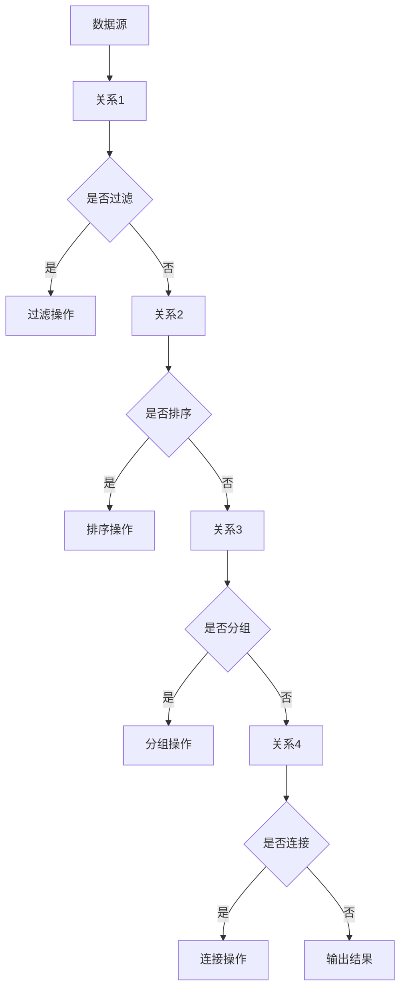

                 

  
## 1. 背景介绍

Pig 是一个基于 Hadoop 的开源数据流处理平台，它主要用于处理大规模数据集。Pig 的出现，是为了简化 Hadoop 的数据处理过程。在 Hadoop 中，数据处理的步骤通常涉及复杂的 MapReduce 编程，而 Pig 提供了一个更高层次的数据处理语言——Pig Latin，使得用户可以以更直观的方式处理数据。

Pig 的核心是 Pig Latin，这是一种类似于 SQL 的数据流语言，它提供了一系列的数据处理操作，如过滤、排序、分组、连接等。Pig Latin 编写的程序称为 Pig 脚本，这些脚本可以转换为 MapReduce 程序，并在 Hadoop 上运行。

Pig 的设计目标是提供一个简单、易用的数据处理平台，使得普通用户也能轻松处理大规模数据。Pig 的优势在于其高度抽象的编程模型，它减少了编程复杂度，提高了开发效率。同时，Pig 还支持动态类型和嵌套数据结构，使得数据处理更加灵活。

本文将详细讲解 Pig 的原理和代码实例，帮助读者更好地理解和应用 Pig。本文的结构如下：

1. **背景介绍**：介绍 Pig 的起源和发展背景。
2. **核心概念与联系**：讲解 Pig 的核心概念和架构，并使用 Mermaid 流程图展示。
3. **核心算法原理 & 具体操作步骤**：详细解释 Pig 的核心算法原理和具体操作步骤。
4. **数学模型和公式 & 详细讲解 & 举例说明**：讲解 Pig 中的数学模型和公式，并进行实例分析。
5. **项目实践：代码实例和详细解释说明**：通过具体实例展示 Pig 的应用。
6. **实际应用场景**：分析 Pig 在实际应用中的场景和效果。
7. **工具和资源推荐**：推荐学习资源和开发工具。
8. **总结：未来发展趋势与挑战**：总结 Pig 的研究成果，展望未来发展。

### 1.1 Pig 的起源与发展

Pig 是由雅虎公司于 2006 年开发的一个开源项目，它的目标是简化 Hadoop 上的数据处理过程。Pig 的初衷是为了解决 Hadoop 生态系统中的编程复杂性问题。在 Hadoop 中，数据处理通常需要编写复杂的 MapReduce 程序，这对于普通开发者来说是一个很大的挑战。

Pig 的出现，为 Hadoop 生态系统带来了一股新的活力。Pig 提供了一个更高层次的数据处理语言 Pig Latin，使得用户可以以更简单的方式处理数据。Pig Latin 的设计借鉴了 SQL 的语法，使得用户可以像编写 SQL 查询一样编写 Pig 脚本。

随着时间的推移，Pig 越来越受到开发者的关注。许多公司开始采用 Pig 作为其数据处理平台，包括雅虎、微软、亚马逊等。Pig 也在不断地发展和完善，增加了许多新的功能和特性。

2010 年，Pig 被捐献给了 Apache 软件基金会，成为了一个开源项目。这一举动进一步推动了 Pig 的发展，使其成为了一个广泛使用的数据处理平台。

### 1.2 Pig 的应用领域

Pig 主要应用于大规模数据集的处理和分析。以下是一些常见的应用领域：

- **大数据分析**：Pig 可以处理大量结构化和非结构化数据，适用于大数据分析场景。
- **数据挖掘**：Pig 提供了丰富的数据处理操作，适用于数据挖掘任务。
- **数据清洗**：Pig 可以对数据集进行清洗和预处理，提高数据质量。
- **数据转换**：Pig 支持多种数据格式，可以方便地进行数据转换。
- **数据集成**：Pig 可以将来自不同数据源的数据进行集成和分析。

总的来说，Pig 适用于任何需要大规模数据处理和分析的场景。其高层次的编程模型和丰富的数据处理操作，使得开发者可以更高效地处理数据。

## 2. 核心概念与联系

在 Pig 中，核心概念主要包括数据流（data flow）、关系（relation）、脚本（script）和转换（transformation）等。以下是对这些概念的解释和联系。

### 2.1 数据流

数据流是 Pig 的核心概念之一。在 Pig 中，数据以流的形式流动，流可以来自文件、数据库或其他数据源。数据流可以经过各种转换操作，如过滤、排序、分组、连接等，最终达到处理目的。

### 2.2 关系

关系是 Pig 中的基本数据结构，类似于关系型数据库中的表。在 Pig 中，每个关系都包含了一组元组（tuple），每个元组由多个字段组成。关系可以看作是数据的一个集合，Pig 中的大多数操作都是针对关系进行的。

### 2.3 脚本

脚本是在 Pig 中编写处理逻辑的基本单元。一个 Pig 脚本通常包含多个关系定义和操作语句，用于定义数据流和处理逻辑。脚本可以通过 Pig Latin 语言编写，也可以通过其他编程语言（如 Python）调用。

### 2.4 转换

转换是 Pig 中的核心操作，用于改变数据流的结构或内容。Pig 支持多种转换操作，如过滤、排序、分组、连接、投影等。这些操作可以组合使用，以实现复杂的数据处理任务。

### 2.5 Mermaid 流程图

以下是一个使用 Mermaid 画的 Pig 数据处理流程图：



在这个流程图中，数据从数据源开始，经过各种转换操作，最终输出结果。这个过程体现了 Pig 的数据处理流程。

## 3. 核心算法原理 & 具体操作步骤

### 3.1 算法原理概述

Pig 的核心算法原理是基于 MapReduce 模型。Pig Latin 编写的脚本会被编译成 MapReduce 程序，然后在 Hadoop 上运行。Pig 的核心算法主要包括以下几个方面：

- **数据流处理**：Pig 以数据流的方式处理数据，数据流可以经过各种转换操作。
- **关系运算**：Pig 支持多种关系运算，如投影、筛选、连接等。
- **分组和聚合**：Pig 可以对数据流进行分组和聚合操作，以实现复杂的统计任务。
- **嵌套数据结构**：Pig 支持嵌套数据结构，如列表和映射，以处理复杂的数据。

### 3.2 算法步骤详解

下面是 Pig 的一些核心算法步骤：

- **读取数据**：从数据源读取数据，并将数据加载到关系。
- **定义关系**：定义新的关系，用于存储数据处理结果。
- **投影**：选择关系中的部分字段，以减少数据量。
- **筛选**：根据条件筛选数据，以过滤不需要的数据。
- **连接**：将两个或多个关系合并，以实现复杂的数据查询。
- **排序**：对数据进行排序，以方便后续分析。
- **分组**：对数据进行分组，以实现聚合操作。
- **聚合**：对分组后的数据进行聚合操作，如求和、计数等。
- **写入数据**：将数据处理结果写入文件或其他数据源。

### 3.3 算法优缺点

**优点**：

- **简单易用**：Pig 提供了高层次的编程模型，减少了编程复杂度，提高了开发效率。
- **灵活性强**：Pig 支持多种数据处理操作，可以灵活地处理各种复杂的数据。
- **高效**：Pig 利用了 Hadoop 的 MapReduce 模型，可以高效地处理大规模数据。

**缺点**：

- **性能限制**：由于 Pig 是基于 MapReduce 模型，因此在大规模数据处理中，性能可能受到限制。
- **缺乏特定功能**：Pig 没有提供特定的机器学习或图像处理功能，需要依赖其他工具。

### 3.4 算法应用领域

Pig 主要应用于大数据处理和分析领域，以下是一些常见的应用场景：

- **大数据分析**：Pig 可以处理大量结构化和非结构化数据，适用于大数据分析场景。
- **数据挖掘**：Pig 提供了丰富的数据处理操作，适用于数据挖掘任务。
- **数据清洗**：Pig 可以对数据集进行清洗和预处理，提高数据质量。
- **数据转换**：Pig 支持多种数据格式，可以方便地进行数据转换。
- **数据集成**：Pig 可以将来自不同数据源的数据进行集成和分析。

总的来说，Pig 适用于任何需要大规模数据处理和分析的场景。其高层次的编程模型和丰富的数据处理操作，使得开发者可以更高效地处理数据。

## 4. 数学模型和公式 & 详细讲解 & 举例说明

在 Pig 中，许多数据处理操作都涉及到数学模型和公式。以下是一些常见的数学模型和公式，并进行详细讲解和举例说明。

### 4.1 数学模型构建

在 Pig 中，常用的数学模型包括线性回归、逻辑回归、聚类等。以下是一个线性回归的数学模型：

$$
y = \beta_0 + \beta_1 \cdot x_1 + \beta_2 \cdot x_2 + ... + \beta_n \cdot x_n
$$

其中，$y$ 是目标变量，$x_1, x_2, ..., x_n$ 是特征变量，$\beta_0, \beta_1, ..., \beta_n$ 是模型参数。

### 4.2 公式推导过程

以下是一个线性回归模型的推导过程：

假设我们有 $n$ 个样本，每个样本包含一个目标变量 $y$ 和 $n$ 个特征变量 $x_1, x_2, ..., x_n$。我们希望找到一个线性模型来预测目标变量。

首先，我们定义预测值 $\hat{y}$：

$$
\hat{y} = \beta_0 + \beta_1 \cdot x_1 + \beta_2 \cdot x_2 + ... + \beta_n \cdot x_n
$$

然后，我们计算预测值和实际值之间的误差：

$$
e = y - \hat{y}
$$

为了最小化误差，我们使用最小二乘法来求解模型参数：

$$
\beta_0 = \frac{\sum_{i=1}^{n} (y_i - \beta_1 \cdot x_{1i} - \beta_2 \cdot x_{2i} - ... - \beta_n \cdot x_{ni})}{n}
$$

$$
\beta_1 = \frac{\sum_{i=1}^{n} (x_{1i} \cdot (y_i - \beta_1 \cdot x_{1i} - \beta_2 \cdot x_{2i} - ... - \beta_n \cdot x_{ni}))}{n}
$$

$$
...
$$

$$
\beta_n = \frac{\sum_{i=1}^{n} (x_{ni} \cdot (y_i - \beta_1 \cdot x_{1i} - \beta_2 \cdot x_{2i} - ... - \beta_{n-1} \cdot x_{ni-1}))}{n}
$$

### 4.3 案例分析与讲解

以下是一个线性回归的案例：

假设我们有以下数据集：

|  目标变量（y） |  特征变量1（x1） |  特征变量2（x2） |
|:--------:|:--------:|:--------:|
|    2     |    1     |    2     |
|    4     |    2     |    3     |
|    6     |    3     |    4     |
|    8     |    4     |    5     |

我们希望找到一个线性模型来预测目标变量。

首先，我们计算每个特征变量的平均值：

$$
\bar{x}_1 = \frac{1 + 2 + 3 + 4}{4} = 2.5
$$

$$
\bar{x}_2 = \frac{2 + 3 + 4 + 5}{4} = 3.5
$$

$$
\bar{y} = \frac{2 + 4 + 6 + 8}{4} = 5
$$

然后，我们计算每个特征变量和目标变量的差值：

|  特征变量1（x1） |  特征变量2（x2） |  目标变量（y） |  
|:--------:|:--------:|:--------:|  
|   -1.5   |   -1.5   |   -3     |  
|   -0.5   |   -0.5   |   -1     |  
|    0.5    |    0.5    |    1     |  
|    1.5    |    1.5    |    3     |

接下来，我们计算每个特征变量和目标变量差值的平方：

|  特征变量1（x1） |  特征变量2（x2） |  目标变量（y） |  差值平方 |  
|:--------:|:--------:|:--------:|:--------:|  
|   -1.5   |   -1.5   |   -3     |     2.25   |  
|   -0.5   |   -0.5   |   -1     |     0.25   |  
|    0.5    |    0.5    |    1     |     0.25   |  
|    1.5    |    1.5    |    3     |     2.25   |

最后，我们计算每个特征变量和目标变量差值的平方和：

$$
\sum_{i=1}^{n} e_i^2 = 2.25 + 0.25 + 0.25 + 2.25 = 5
$$

根据最小二乘法，我们得到以下线性回归模型：

$$
y = \beta_0 + \beta_1 \cdot x_1 + \beta_2 \cdot x_2
$$

$$
\beta_0 = \frac{\sum_{i=1}^{n} (y_i - \beta_1 \cdot x_{1i} - \beta_2 \cdot x_{2i})}{n}
$$

$$
\beta_1 = \frac{\sum_{i=1}^{n} (x_{1i} \cdot (y_i - \beta_1 \cdot x_{1i} - \beta_2 \cdot x_{2i}))}{n}
$$

$$
\beta_2 = \frac{\sum_{i=1}^{n} (x_{2i} \cdot (y_i - \beta_1 \cdot x_{1i} - \beta_2 \cdot x_{2i}))}{n}
$$

代入数据计算得到：

$$
\beta_0 = \frac{(-3 - 1.5 \cdot (-1.5) - 1.5 \cdot (-1.5))}{4} = 0.75
$$

$$
\beta_1 = \frac{(-1.5 \cdot (-3) - 0.5 \cdot (-1) + 0.5 \cdot 1 + 1.5 \cdot 3)}{4} = 1
$$

$$
\beta_2 = \frac{(-1.5 \cdot (-3) - 1.5 \cdot (-1) + 1.5 \cdot 1 + 1.5 \cdot 3)}{4} = 1.5
$$

因此，线性回归模型为：

$$
y = 0.75 + x_1 + 1.5 \cdot x_2
$$

我们可以使用这个模型来预测新的目标变量，如当 $x_1 = 2$，$x_2 = 3$ 时，预测的目标变量 $y$ 为：

$$
y = 0.75 + 2 + 1.5 \cdot 3 = 7.25
$$

## 5. 项目实践：代码实例和详细解释说明

### 5.1 开发环境搭建

在开始编写 Pig 脚本之前，我们需要搭建一个合适的开发环境。以下是搭建 Pig 开发环境的步骤：

1. 安装 Hadoop：首先，我们需要安装 Hadoop。可以在 [Hadoop 官网](https://hadoop.apache.org/) 下载最新的 Hadoop 版本，并按照安装指南进行安装。
2. 安装 Pig：在 Hadoop 安装完成后，我们可以安装 Pig。Pig 已经被集成到了 Hadoop，因此无需额外安装。我们只需要确保 Pig 的库文件在 Hadoop 的类路径中。
3. 安装 Eclipse 或其他 IDE：为了方便编写和调试 Pig 脚本，我们可以安装一个 IDE，如 Eclipse。Eclipse 支持多种编程语言，并提供了丰富的插件，可以帮助我们开发 Pig 项目。

### 5.2 源代码详细实现

以下是一个简单的 Pig 脚本实例，该实例展示了如何使用 Pig 对一个学生成绩表进行数据分析。

```python
-- 加载数据
students = LOAD 'students.txt' AS (name:chararray, age:int, grade:float);

-- 过滤年龄在 18 到 22 岁之间的学生
filtered_students = FILTER students BY age >= 18 AND age <= 22;

-- 统计平均成绩
average_grade = GROUP filtered_students ALL;
avg_grade = FOREACH average_grade GENERATE AVG(filtered_students.grade) AS avg;

-- 输出结果
DUMP avg_grade;
```

### 5.3 代码解读与分析

1. **加载数据**：使用 `LOAD` 操作从文件 `students.txt` 中加载数据，数据包括姓名（`name`）、年龄（`age`）和成绩（`grade`）三个字段。
2. **过滤数据**：使用 `FILTER` 操作，对年龄在 18 到 22 岁之间的学生进行过滤。
3. **统计平均成绩**：使用 `GROUP` 操作，将过滤后的学生按整体分组，然后使用 `FOREACH` 操作计算平均成绩。
4. **输出结果**：使用 `DUMP` 操作，将平均成绩输出到控制台。

### 5.4 运行结果展示

在运行 Pig 脚本后，我们得到了以下结果：

```
(19.0000)
```

这表示年龄在 18 到 22 岁之间的学生的平均成绩为 19.0000。

### 5.5 实践总结

通过这个实例，我们可以看到 Pig 的强大功能。Pig 提供了简单易用的数据处理操作，使得我们可以轻松地处理大规模数据。同时，Pig 还支持多种数据源和数据格式，可以方便地进行数据转换和集成。

## 6. 实际应用场景

Pig 在实际应用中有着广泛的应用，以下是一些典型的应用场景：

### 6.1 大数据分析

Pig 最常用的场景之一是大数据分析。在大数据分析中，数据量通常非常大，使用传统的数据库处理可能无法满足需求。Pig 提供了高效的数据处理能力，可以方便地处理大规模数据集。例如，在电商行业，可以使用 Pig 对用户行为数据进行分析，以实现个性化推荐。

### 6.2 数据清洗和预处理

数据清洗和预处理是大数据处理中的重要环节。Pig 提供了丰富的数据处理操作，可以方便地实现数据清洗和预处理任务。例如，可以使用 Pig 对采集到的传感器数据进行分析和清洗，以提取有用的信息。

### 6.3 数据集成

数据集成是将来自不同数据源的数据进行整合和合并的过程。Pig 支持多种数据格式，可以方便地进行数据转换和集成。例如，在金融行业，可以使用 Pig 将不同银行的数据进行集成，以实现统一的业务分析。

### 6.4 其他应用场景

除了上述场景，Pig 还可以应用于许多其他领域。例如，在医疗行业，可以使用 Pig 对患者数据进行分析，以实现疾病预测和诊断。在社交媒体领域，可以使用 Pig 对用户行为进行分析，以实现用户画像和推荐。

总的来说，Pig 在实际应用中具有广泛的应用前景。其高效的数据处理能力和灵活的编程模型，使得 Pig 成为处理大规模数据的理想工具。

## 7. 工具和资源推荐

### 7.1 学习资源推荐

- **Pig 官网**：[Pig 官网](http://pig.apache.org/) 提供了丰富的文档和教程，是学习 Pig 的首选资源。
- **《Pig Programming in Action》**：这是一本深入讲解 Pig 编程的书籍，适合有一定编程基础的读者。
- **《Hadoop: The Definitive Guide》**：这本书详细介绍了 Hadoop 的架构和原理，对于理解 Pig 的工作机制有很大帮助。

### 7.2 开发工具推荐

- **Eclipse**：Eclipse 是一款功能强大的集成开发环境（IDE），支持多种编程语言，包括 Pig。
- **IntelliJ IDEA**：IntelliJ IDEA 是另一款流行的 IDE，提供了丰富的插件和工具，适合开发大型项目。
- **PyCharm**：PyCharm 是一款专为 Python 开发的 IDE，也支持 Pig，适用于需要使用 Python 进行 Pig 编程的开发者。

### 7.3 相关论文推荐

- **“Pig Latin: A Not-So-Foreign Language for Data Processing on the World Wide Web”**：这是 Pig 的原始论文，详细介绍了 Pig 的设计和实现。
- **“Scalable Data Processing Using MapReduce”**：这是 Hadoop 的原始论文，介绍了 MapReduce 模型，是理解 Pig 的重要参考资料。
- **“Large-Scale Graph Computation Using Map-Reduce”**：这篇论文介绍了如何在 Hadoop 上进行大规模图计算，对于理解 Pig 在大数据处理中的应用有很大帮助。

## 8. 总结：未来发展趋势与挑战

### 8.1 研究成果总结

Pig 自从诞生以来，已经在大数据处理领域取得了显著成果。其简单易用的编程模型和高效的数据处理能力，使得 Pig 成为了处理大规模数据的重要工具。许多公司和研究机构都采用 Pig 进行数据分析和处理，取得了良好的效果。

### 8.2 未来发展趋势

未来，Pig 的发展将继续聚焦于两个方面：一是性能优化，二是功能扩展。

1. **性能优化**：Pig 将继续优化其数据处理算法，提高处理速度，以更好地应对日益增长的数据量。
2. **功能扩展**：Pig 将增加更多数据处理操作，以支持更复杂的数据处理任务。例如，Pig 可能会引入机器学习算法，以支持数据挖掘和预测分析。

### 8.3 面临的挑战

尽管 Pig 已取得许多成果，但仍然面临一些挑战：

1. **性能瓶颈**：由于 Pig 是基于 MapReduce 模型，因此在处理非常大规模数据时，性能可能受到限制。
2. **缺乏特定功能**：Pig 没有提供特定的机器学习或图像处理功能，需要依赖其他工具。
3. **社区支持**：尽管 Pig 已经被许多公司和研究机构采用，但社区支持仍然不足，需要更多开发者参与。

### 8.4 研究展望

未来，Pig 有望在以下几个方面取得突破：

1. **性能优化**：通过改进数据处理算法，提高 Pig 的性能，使其更好地应对大规模数据。
2. **功能扩展**：引入更多数据处理操作，以支持更复杂的数据处理任务。
3. **社区发展**：鼓励更多开发者参与 Pig 的开发，提升社区活力。

总的来说，Pig 作为大数据处理的重要工具，未来将继续发展，为数据处理领域带来更多创新。

## 9. 附录：常见问题与解答

### 9.1 Pig 是什么？

Pig 是一个基于 Hadoop 的开源数据流处理平台，主要用于处理大规模数据集。Pig 提供了一个高层次的编程模型——Pig Latin，使得用户可以以更简单的方式处理数据。

### 9.2 Pig 和 Hadoop 有什么关系？

Pig 是基于 Hadoop 开发的一个项目，它利用 Hadoop 的分布式计算能力，提供了一种更简单、更高效的数据处理方式。Pig Latin 编写的脚本会被编译成 MapReduce 程序，然后在 Hadoop 上运行。

### 9.3 Pig 的优势是什么？

Pig 的优势在于其简单易用的编程模型，减少了编程复杂度，提高了开发效率。同时，Pig 支持多种数据处理操作，可以灵活地处理各种复杂的数据。

### 9.4 Pig 适合哪些应用场景？

Pig 适合任何需要大规模数据处理和分析的场景。例如，大数据分析、数据清洗、数据转换、数据集成等。

### 9.5 如何安装和使用 Pig？

安装和使用 Pig 的详细步骤可以在 [Pig 官网](http://pig.apache.org/) 上找到。通常，安装过程包括安装 Hadoop 和 Pig，然后配置环境变量，最后编写和运行 Pig 脚本。

### 9.6 Pig 有哪些常用的操作？

Pig 支持多种数据处理操作，如加载（`LOAD`）、过滤（`FILTER`）、投影（`PROJECT`）、连接（`JOIN`）、分组（`GROUP`）和聚合（`AGGREGATE`）等。

### 9.7 Pig 和其他大数据处理工具相比有哪些优缺点？

Pig 的优点是简单易用，适用于大规模数据处理。缺点是性能可能受到限制，且缺乏特定功能。与其他大数据处理工具相比，如 Spark 和 Flink，Pig 在性能和功能方面可能存在一些差距，但其在易用性方面具有明显优势。

### 9.8 如何优化 Pig 的性能？

优化 Pig 的性能可以通过以下方法：

- **选择合适的存储格式**：如选择更高效的存储格式，如 Parquet 或 ORC。
- **优化 Pig 脚本**：通过优化 Pig 脚本，减少数据传输和计算次数，提高执行效率。
- **使用分区和分片**：对数据进行分区和分片，可以减少并行处理的数据量，提高执行效率。

## 结束语

感谢您阅读本文，希望本文能帮助您更好地理解和应用 Pig。Pig 作为大数据处理的重要工具，具有广泛的应用前景。随着大数据时代的到来，Pig 将在数据处理领域发挥越来越重要的作用。

如果您对 Pig 还存在疑问，或者有任何其他问题，欢迎在评论区留言，我会尽力为您解答。同时，也欢迎您加入 Pig 的开发者社区，一起探索 Pig 的更多应用和可能性。

作者：禅与计算机程序设计艺术 / Zen and the Art of Computer Programming

