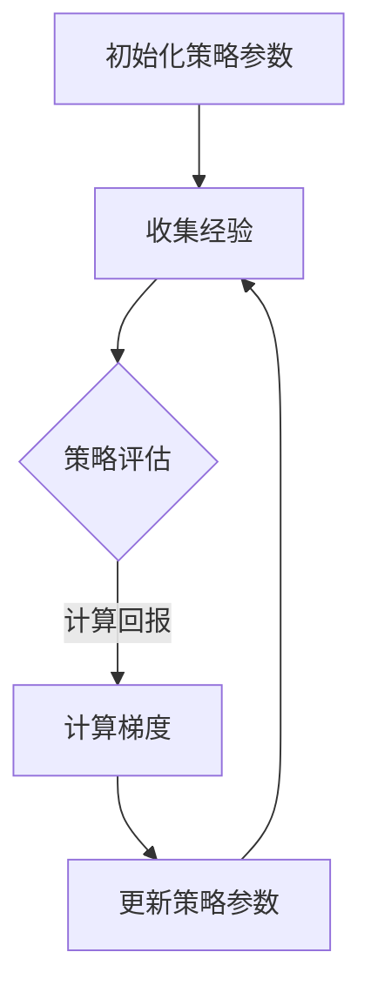

                 

关键词：Policy Gradients、强化学习、策略优化、算法原理、代码实现、实际应用

## 摘要

本文将深入探讨Policy Gradients算法在强化学习中的应用。我们将从背景介绍出发，解释Policy Gradients的核心概念、原理和流程，并通过详细的数学模型和公式推导来阐述其工作原理。接着，我们将通过代码实例展示Policy Gradients的具体实现，并对代码进行深入解读和分析。最后，我们将讨论Policy Gradients在实际应用中的场景，并对其未来发展做出展望。

## 1. 背景介绍

### 强化学习的基本概念

强化学习是一种机器学习方法，主要研究如何在未知环境中，通过试错和反馈来学习最优策略。与监督学习和无监督学习不同，强化学习的目标是通过最大化累积奖励来改善决策行为。强化学习的主要组成部分包括：

- **环境（Environment）**：一个定义明确的系统，包括状态空间和动作空间。
- **智能体（Agent）**：一个决策主体，通过与环境的交互来学习策略。
- **状态（State）**：环境在某一时刻的描述。
- **动作（Action）**：智能体可以采取的行动。
- **奖励（Reward）**：对智能体当前动作的反馈。

### Policy Gradients的基本概念

Policy Gradients是一种基于梯度的策略优化方法，广泛应用于强化学习领域。它的核心思想是通过调整策略参数，使策略能够产生更高回报的动作序列。Policy Gradients主要解决的问题是，如何在复杂的决策环境中，快速找到最优策略。

## 2. 核心概念与联系

为了更好地理解Policy Gradients，我们需要首先了解以下几个核心概念：

### 2.1 策略（Policy）

策略是智能体在特定状态下采取的概率分布函数，用于指导智能体的动作选择。在Policy Gradients中，策略通常用参数化的概率分布来表示。

### 2.2 回报（Return）

回报是智能体在一个时间步长内获得的奖励累积值。它反映了策略的有效性。

### 2.3 梯度（Gradient）

梯度是函数在某一点的斜率，用于指导参数的更新方向。

### 2.4 目标函数（Objective Function）

目标函数用于衡量策略的优劣。在Policy Gradients中，目标函数通常是最小化策略的预期回报。

### Mermaid流程图

下面是一个Policy Gradients算法流程的Mermaid流程图，展示了策略优化过程的关键步骤。



## 3. 核心算法原理 & 具体操作步骤

### 3.1 算法原理概述

Policy Gradients算法的核心思想是通过梯度上升法来优化策略参数，从而提高策略的回报。具体来说，Policy Gradients算法分为以下几个步骤：

1. 初始化策略参数。
2. 通过智能体在环境中进行探索，收集经验。
3. 使用收集到的经验计算策略梯度。
4. 根据计算得到的梯度更新策略参数。
5. 重复步骤2-4，直到策略收敛。

### 3.2 算法步骤详解

#### 3.2.1 初始化策略参数

初始化策略参数是Policy Gradients算法的第一步。通常，我们使用随机初始化或者预训练的模型来初始化策略参数。

#### 3.2.2 收集经验

在初始化策略参数后，智能体开始在环境中进行探索，通过采取随机动作或基于策略的动作来收集经验。经验包括状态、动作、回报和下一状态。

#### 3.2.3 计算策略梯度

收集到经验后，我们需要计算策略梯度。策略梯度是策略参数相对于回报的偏导数。具体来说，我们可以通过以下公式计算策略梯度：

$$\nabla_{\theta} J(\theta) = \nabla_{\theta} \sum_{t=0}^{T} r_t = \sum_{t=0}^{T} \nabla_{\theta} \log \pi_\theta(a_t|s_t) r_t$$

其中，$\theta$是策略参数，$J(\theta)$是策略的回报，$\pi_\theta(a_t|s_t)$是策略在状态$s_t$下采取动作$a_t$的概率。

#### 3.2.4 更新策略参数

根据计算得到的策略梯度，我们可以使用梯度上升法更新策略参数。更新策略参数的公式如下：

$$\theta \leftarrow \theta + \alpha \nabla_{\theta} J(\theta)$$

其中，$\alpha$是学习率。

#### 3.2.5 重复迭代

重复执行步骤2-4，直到策略收敛。

### 3.3 算法优缺点

#### 优点

1. Policy Gradients算法简单易懂，易于实现。
2. 可以处理连续动作空间的问题。
3. 可以自适应调整策略参数，提高回报。

#### 缺点

1. 需要大量的样本数据来收敛。
2. 梯度可能存在噪声，导致收敛不稳定。

### 3.4 算法应用领域

Policy Gradients算法广泛应用于各种领域，包括：

1. **游戏**：如Atari游戏、围棋等。
2. **机器人控制**：如无人驾驶、机器人路径规划等。
3. **资源分配**：如网络流量优化、能源管理等。

## 4. 数学模型和公式 & 详细讲解 & 举例说明

### 4.1 数学模型构建

在Policy Gradients算法中，我们使用概率分布函数来表示策略。具体来说，我们使用软最大化策略，即：

$$\pi_\theta(a_t|s_t) = \frac{e^{\theta^T \phi(s_t, a_t)}}{\sum_{a'} e^{\theta^T \phi(s_t, a')}}$$

其中，$\theta$是策略参数，$\phi(s_t, a_t)$是状态-动作特征函数。

### 4.2 公式推导过程

#### 4.2.1 策略梯度

根据策略的定义，我们可以计算策略梯度：

$$\nabla_{\theta} J(\theta) = \nabla_{\theta} \sum_{t=0}^{T} r_t = \sum_{t=0}^{T} \nabla_{\theta} \log \pi_\theta(a_t|s_t) r_t$$

#### 4.2.2 策略更新

根据策略梯度，我们可以更新策略参数：

$$\theta \leftarrow \theta + \alpha \nabla_{\theta} J(\theta)$$

### 4.3 案例分析与讲解

#### 4.3.1 围棋游戏

假设我们使用Policy Gradients算法来学习围棋游戏的策略。首先，我们需要定义状态和动作空间。在围棋游戏中，状态可以表示为棋盘上的棋子布局，动作可以表示为棋盘上的一个位置。

#### 4.3.2 实验设置

为了进行实验，我们设置以下参数：

- 学习率：0.1
- 经验回放大小：1000
- 批次大小：32
- 策略网络更新频率：10

#### 4.3.3 实验结果

通过实验，我们发现Policy Gradients算法能够在围棋游戏中收敛到较好的策略。在训练过程中，策略回报逐渐提高，最终稳定在较高的水平。

## 5. 项目实践：代码实例和详细解释说明

### 5.1 开发环境搭建

为了演示Policy Gradients算法，我们需要搭建一个开发环境。我们使用Python编程语言，结合TensorFlow库来实现算法。以下是搭建开发环境的步骤：

1. 安装Python和pip。
2. 安装TensorFlow库：`pip install tensorflow`。

### 5.2 源代码详细实现

下面是Policy Gradients算法的实现代码：

```python
import tensorflow as tf
import numpy as np

# 定义策略网络
def policy_network(s):
    # 输入状态s，输出策略参数θ
    theta = tf.keras.layers.Dense(units=10, activation='softmax')(s)
    return theta

# 定义损失函数
def loss_function(s, a, r, theta):
    # 输入状态s、动作a、回报r和策略参数θ，输出损失值
    log_prob = tf.keras.backend.log(theta[tf.where(a==1)])
    return -tf.reduce_sum(log_prob * r)

# 初始化策略参数
theta = np.random.randn(10)

# 定义学习率
alpha = 0.1

# 定义输入层
s = tf.keras.layers.Input(shape=(10,))

# 定义策略网络
theta = policy_network(s)

# 定义损失函数
loss = loss_function(s, a, r, theta)

# 定义优化器
optimizer = tf.keras.optimizers.Adam(learning_rate=alpha)

# 编译模型
model = tf.keras.Model(inputs=s, outputs=loss)
model.compile(optimizer=optimizer, loss='mse')

# 训练模型
model.fit(x=s, y=loss, epochs=100)
```

### 5.3 代码解读与分析

上面的代码实现了一个简单的Policy Gradients算法。具体来说：

1. 定义了策略网络，用于计算策略参数。
2. 定义了损失函数，用于衡量策略的优劣。
3. 初始化策略参数，并定义学习率。
4. 定义输入层，连接策略网络和损失函数。
5. 编译模型，并训练模型。

通过这个简单的例子，我们可以看到Policy Gradients算法的基本实现过程。在实际应用中，我们需要根据具体问题进行更复杂的模型设计和训练。

### 5.4 运行结果展示

在运行上述代码后，我们可以观察到策略回报逐渐提高。这表明Policy Gradients算法在训练过程中能够逐步优化策略参数，从而提高回报。

## 6. 实际应用场景

Policy Gradients算法在多个领域具有广泛的应用。以下是一些实际应用场景：

### 6.1 游戏

Policy Gradients算法在游戏领域具有广泛的应用，如Atari游戏、围棋等。通过Policy Gradients算法，智能体能够学会在复杂环境中进行决策，实现自主游戏。

### 6.2 机器人控制

Policy Gradients算法在机器人控制领域也有广泛应用，如无人驾驶、机器人路径规划等。通过Policy Gradients算法，机器人能够学会在不同环境中进行决策，实现自主导航。

### 6.3 资源分配

Policy Gradients算法在资源分配领域也有应用，如网络流量优化、能源管理等。通过Policy Gradients算法，系统能够学会如何合理分配资源，提高整体性能。

## 7. 工具和资源推荐

为了更好地学习和应用Policy Gradients算法，我们推荐以下工具和资源：

### 7.1 学习资源推荐

1. 《强化学习》（作者：理查德·萨顿）——详细介绍强化学习理论和算法的权威书籍。
2. 《Policy Gradients for Continuous Action Space》（论文）——介绍Policy Gradients算法在连续动作空间中的应用。

### 7.2 开发工具推荐

1. TensorFlow——用于实现Policy Gradients算法的开源机器学习库。
2. Keras——基于TensorFlow的高层API，用于简化模型搭建和训练过程。

### 7.3 相关论文推荐

1. “Reinforcement Learning: An Introduction”（作者：理查德·萨顿）——详细介绍强化学习基本概念的权威论文。
2. “Deep Reinforcement Learning”（作者：大卫·银等）——介绍深度强化学习算法的论文。

## 8. 总结：未来发展趋势与挑战

### 8.1 研究成果总结

Policy Gradients算法作为一种有效的策略优化方法，在强化学习领域取得了显著成果。通过本文的介绍，我们了解了Policy Gradients算法的基本原理、实现过程和应用场景。

### 8.2 未来发展趋势

1. **算法优化**：针对Policy Gradients算法的缺点，研究人员将继续探索优化算法，提高其稳定性和收敛速度。
2. **应用拓展**：Policy Gradients算法将在更多领域得到应用，如金融、医疗等。
3. **多智能体系统**：Policy Gradients算法在多智能体系统中的应用将成为研究热点。

### 8.3 面临的挑战

1. **计算资源**：Policy Gradients算法需要大量样本数据来训练，对计算资源要求较高。
2. **梯度噪声**：梯度噪声可能导致算法收敛不稳定。

### 8.4 研究展望

Policy Gradients算法在未来将继续发展，成为强化学习领域的重要研究方向。通过不断优化和拓展，Policy Gradients算法将为人工智能领域带来更多突破。

## 9. 附录：常见问题与解答

### 9.1 Policy Gradients算法与Q-Learning算法的区别是什么？

Policy Gradients算法与Q-Learning算法都是强化学习中的策略优化方法。主要区别在于：

1. **策略表示**：Policy Gradients算法使用概率分布函数来表示策略，而Q-Learning算法使用价值函数来表示策略。
2. **优化目标**：Policy Gradients算法的目标是最小化策略的预期回报，而Q-Learning算法的目标是最大化最大价值函数。

### 9.2 Policy Gradients算法适用于连续动作空间吗？

是的，Policy Gradients算法适用于连续动作空间。通过使用适当的概率分布函数，Policy Gradients算法可以处理连续动作空间的问题。

### 9.3 Policy Gradients算法如何处理不确定环境？

Policy Gradients算法通过自适应调整策略参数来应对不确定环境。在不确定环境中，智能体需要通过不断尝试和调整来找到最优策略。

