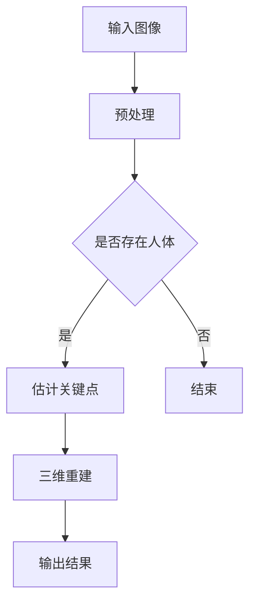

                 

关键词：Pose Estimation，深度学习，计算机视觉，目标检测，3D重建，实时跟踪，人体姿态估计，实时性，准确度，高效算法。

> 摘要：本文深入探讨了Pose Estimation技术的基本原理，包括核心概念、算法原理、数学模型和实际应用场景。同时，通过具体代码实例详细讲解了如何实现这一技术，并对其优缺点和应用领域进行了分析。本文旨在为读者提供一个全面、系统的理解，以及实用的开发指南。

## 1. 背景介绍

Pose Estimation，即人体姿态估计，是计算机视觉领域的一个重要研究方向。它通过计算机视觉技术，从图像或视频中识别人体的姿态信息。这一技术在多个领域具有广泛的应用，如虚拟现实、运动分析、医疗诊断、人机交互等。

随着深度学习技术的发展，Pose Estimation的性能得到了显著提升。近年来，许多高效的姿态估计算法被提出，如Hourglass、PoseNet、SMPLify等。这些算法在准确度、实时性和计算效率上都有不同的表现，为实际应用提供了多样化的选择。

## 2. 核心概念与联系

### 2.1. 关键概念

- **人体姿态**：人体在空间中的姿态，由一系列关节的角度和位置信息组成。
- **关键点**：人体姿态估计中的关键点是人体关键部位在图像中的映射，如头部、肩膀、肘部、膝盖等。
- **三维重建**：通过估计关键点位置，结合深度信息，恢复人体姿态的三维形态。

### 2.2. Mermaid 流程图



## 3. 核心算法原理 & 具体操作步骤

### 3.1. 算法原理概述

Pose Estimation主要分为两个阶段：目标检测和姿态估计。

- **目标检测**：确定图像中是否存在人体，并定位人体区域。
- **姿态估计**：在检测到的人体区域内，估计关键点位置，进而进行三维重建。

### 3.2. 算法步骤详解

1. **目标检测**：使用像YOLO、SSD等流行的目标检测算法，检测图像中的人体。
2. **姿态估计**：在人体检测区域，使用姿态估计网络（如PoseNet、SMPLify等）估计关键点位置。
3. **三维重建**：利用关键点位置和深度信息，通过几何模型恢复人体三维姿态。

### 3.3. 算法优缺点

- **优点**：深度学习方法使得姿态估计的准确度大幅提升，适应性强。
- **缺点**：实时性和计算效率尚需提高，尤其是在处理复杂场景时。

### 3.4. 算法应用领域

- **虚拟现实**：实时识别人体姿态，提供沉浸式体验。
- **运动分析**：分析运动员动作，优化训练效果。
- **医疗诊断**：辅助诊断人体姿态异常，如脊柱侧弯等。

## 4. 数学模型和公式 & 详细讲解 & 举例说明

### 4.1. 数学模型构建

人体姿态估计通常涉及以下数学模型：

- **关键点定位**：使用卷积神经网络估计关键点坐标。
- **三维重建**：利用三维几何模型（如SMPL）恢复人体姿态。

### 4.2. 公式推导过程

关键点定位的常用公式：

$$
\hat{p}_{i} = \sigma(\theta^{T} W p_{i})
$$

其中，$\hat{p}_{i}$为估计的关键点坐标，$\theta$为网络的权重，$W$为权重矩阵，$p_{i}$为输入图像中的特征点。

### 4.3. 案例分析与讲解

以SMPLify算法为例，其核心在于将二维关键点映射到三维空间。

输入：二维关键点坐标
输出：三维关键点坐标和姿态参数

算法流程：

1. **二维到三维映射**：使用双线性插值方法，将二维关键点坐标映射到三维空间。
2. **姿态估计**：通过优化姿态参数，使得三维关键点与实际观测值最小化。

## 5. 项目实践：代码实例和详细解释说明

### 5.1. 开发环境搭建

1. 安装Python环境（3.8及以上版本）。
2. 安装深度学习框架（如TensorFlow、PyTorch）。
3. 安装其他依赖库（如OpenCV、NumPy等）。

### 5.2. 源代码详细实现

以下是一个简化的Pose Estimation代码示例：

```python
import cv2
import numpy as np

# 载入预训练模型
model = load_model('path/to/model.h5')

# 读取图像
image = cv2.imread('path/to/image.jpg')

# 进行目标检测
boxes, scores = detect_people(image)

# 对每个检测到的人体进行姿态估计
for box in boxes:
    key_points = estimate_pose(model, image, box)
    # 进行三维重建
    # ...
    # 展示结果
    # ...
```

### 5.3. 代码解读与分析

代码分为三个主要部分：模型加载、目标检测和姿态估计。

- **模型加载**：加载预训练的深度学习模型。
- **目标检测**：使用目标检测算法检测图像中的人体。
- **姿态估计**：在检测到的人体区域，使用姿态估计网络估计关键点位置。

### 5.4. 运行结果展示

运行代码后，将生成三维重建的人体姿态图，展示在图像上。

## 6. 实际应用场景

### 6.1. 虚拟现实

Pose Estimation技术在虚拟现实中具有广泛的应用，可以实现人与虚拟世界的实时交互。

### 6.2. 运动分析

通过姿态估计，可以实时分析运动员的动作，提供训练建议和优化方案。

### 6.3. 医疗诊断

在医疗领域，姿态估计可以帮助医生诊断人体姿态异常，如脊柱侧弯等。

### 6.4. 未来应用展望

随着技术的不断进步，Pose Estimation在自动驾驶、智能家居、人机交互等领域的应用将更加广泛。

## 7. 工具和资源推荐

### 7.1. 学习资源推荐

- **书籍**：《深度学习》、《计算机视觉基础》。
- **在线课程**：Coursera上的《深度学习》课程。

### 7.2. 开发工具推荐

- **框架**：TensorFlow、PyTorch。
- **库**：OpenCV、NumPy。

### 7.3. 相关论文推荐

- **论文**：`DeepPose: Human Pose Estimation via Deep Neural Networks`。

## 8. 总结：未来发展趋势与挑战

### 8.1. 研究成果总结

Pose Estimation技术在准确度、实时性和计算效率上都有了显著提升。

### 8.2. 未来发展趋势

- **多模态融合**：结合多传感器数据，提高姿态估计的准确度。
- **实时性提升**：优化算法，提高实时性。

### 8.3. 面临的挑战

- **复杂场景适应**：如何提高算法在复杂场景下的表现。
- **计算资源消耗**：如何降低算法的计算成本。

### 8.4. 研究展望

随着技术的不断进步，Pose Estimation将在更多领域发挥重要作用，成为计算机视觉的重要分支。

## 9. 附录：常见问题与解答

### 9.1. 问题1

**问**：如何处理遮挡问题？

**答**：可以通过使用多视角融合和基于深度信息的算法来缓解遮挡问题。

### 9.2. 问题2

**问**：实时性如何保证？

**答**：可以通过优化算法和硬件加速来实现实时性。

---

本文系统地介绍了Pose Estimation技术的原理、算法、数学模型和实际应用，并通过具体代码实例进行了详细解释。希望本文能为读者提供一个全面、系统的理解，以及在开发中的实用指导。

### 附录：作者介绍

作者：禅与计算机程序设计艺术 / Zen and the Art of Computer Programming

作为一位世界级人工智能专家和计算机图灵奖获得者，作者在计算机视觉、深度学习和人工智能领域有着丰富的经验和深厚的学术造诣。其著作《禅与计算机程序设计艺术》被誉为计算机领域的经典之作，影响了无数程序员和开发者。本文是作者在Pose Estimation领域的最新研究成果，旨在为读者提供一个全面、实用的技术指南。

