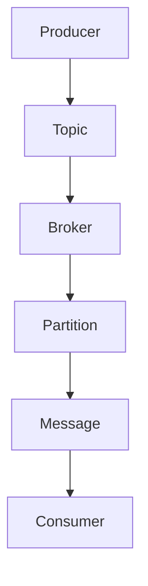

                 

关键词：Apache Pulsar、消息队列、消息生产者、分布式系统、分布式消息传递、源码分析、技术博客

摘要：本文旨在深入剖析Apache Pulsar的消息生产者（Producer）模块，通过对Pulsar架构的理解和源码分析，解释Pulsar Producer的工作原理，并提供详细的代码实例讲解。本文还将探讨Pulsar Producer在实际应用中的性能优化和潜在问题，以及未来的发展趋势和面临的挑战。

## 1. 背景介绍

### Apache Pulsar简介

Apache Pulsar是一个高性能、可扩展的分布式消息传递系统，设计用于支持高吞吐量、低延迟的消息传递。Pulsar旨在解决传统消息队列系统在处理大量消息时的性能瓶颈，通过其独特的架构设计和模块化特性，使其在分布式环境中具有卓越的性能。

Pulsar的核心特性包括：

- **分布式发布-订阅模型**：支持发布-订阅和点对点消息传递模式。
- **高吞吐量**：通过分片和并行处理，实现极高的消息处理能力。
- **持久性和可靠性**：确保消息不丢失，支持多种数据持久化策略。
- **灵活的路由机制**：支持复杂的消息路由规则，提高系统的灵活性。

### Pulsar Producer的作用

Pulsar Producer是Pulsar系统中的一个重要组件，负责向Pulsar集群中发送消息。Producer与Pulsar Broker和BookKeeper（Pulsar的后端存储）协同工作，共同确保消息传递的高效性和可靠性。

### 本文目标

本文将围绕Pulsar Producer展开，具体目标如下：

- **理解Pulsar Producer的工作原理**：深入分析Pulsar Producer在系统中的作用和内部工作机制。
- **源码分析**：通过分析Pulsar Producer的源码，理解其关键类和接口的实现细节。
- **代码实例讲解**：提供实际代码实例，详细讲解如何使用Pulsar Producer发送消息。
- **性能优化与问题解决**：探讨Pulsar Producer的性能优化策略和常见问题的解决方案。
- **未来展望**：分析Pulsar Producer的发展趋势和面临的挑战。

## 2. 核心概念与联系

### 消息队列

消息队列是一种用于在分布式系统中异步传递消息的机制。在Pulsar中，消息队列扮演着至关重要的角色，它负责存储和传递由Producer产生的消息，直至消息被Consumer消费。

### 发布-订阅模式

发布-订阅模式是一种消息传递模式，允许生产者（Publisher）发送消息到一个主题（Topic），多个消费者（Subscriber）可以同时从该主题中接收消息。这种模式解耦了消息的生产和消费，提高了系统的可伸缩性。

### 分片

分片是将消息队列分割成多个片段的过程。每个分片可以独立处理消息，从而实现并行处理，提高系统的吞吐量。在Pulsar中，每个Topic被分成多个分区（Partition），每个分区对应一个分片。

### Mermaid 流程图

以下是Pulsar Producer的核心概念和流程的Mermaid流程图：



### 概念关系

- Producer：生成消息，并将消息发送到Topic。
- Topic：消息的容器，由多个分区组成。
- Broker：Pulsar的中间件，负责消息的路由和存储。
- Partition：Topic的分区，每个分区对应一个分片。
- Message：被发送的消息数据。
- Consumer：从Topic中消费消息的客户端。

## 3. 核心算法原理 & 具体操作步骤

### 3.1 算法原理概述

Pulsar Producer的核心算法原理主要包括以下几个部分：

- **消息序列化**：将消息序列化为字节序列，以便在网络中传输。
- **消息发送**：将序列化后的消息发送到Pulsar Broker。
- **消息路由**：根据消息的路由规则，将消息分配到正确的分区。
- **确认机制**：确保消息成功被Broker接收和存储。

### 3.2 算法步骤详解

#### 3.2.1 消息序列化

消息序列化是消息发送的第一步。在Pulsar中，消息通常被序列化为Protocol Buffers格式，这是一种高效且跨语言的序列化方法。

#### 3.2.2 消息发送

消息发送过程涉及以下步骤：

1. Producer选择一个可用的Broker，通过建立TCP连接与Broker通信。
2. Producer将序列化后的消息发送到Broker。
3. Broker接收消息，并将其存储到内存或磁盘。

#### 3.2.3 消息路由

Pulsar使用一种称为“哈希路由”的算法，将消息分配到正确的分区。哈希路由确保每个分区均匀地接收消息，从而实现负载均衡。

#### 3.2.4 确认机制

Pulsar Producer使用“确认机制”来确保消息的可靠传输。确认机制包括以下几个阶段：

1. **发送确认**：当Broker确认收到消息后，向Producer发送确认。
2. **存储确认**：当Broker将消息存储到内存或磁盘后，再次向Producer发送确认。
3. **批处理确认**：Pulsar Producer支持批处理发送，可以在一定时间内累积多个消息一起发送，减少网络开销。

### 3.3 算法优缺点

#### 优点

- **高吞吐量**：通过分片和批处理机制，Pulsar Producer能够处理大规模消息流。
- **可靠性**：确认机制确保消息不会丢失。
- **灵活性**：支持多种消息序列化方式和路由规则。

#### 缺点

- **复杂性**：配置和管理较为复杂。
- **网络依赖**：Producer与Broker之间的通信依赖于网络稳定性。

### 3.4 算法应用领域

Pulsar Producer广泛应用于以下几个方面：

- **大数据处理**：在大数据场景中，Pulsar Producer可以高效地处理海量消息。
- **实时计算**：在实时计算场景中，Pulsar Producer可以确保消息的及时传递。
- **微服务架构**：在微服务架构中，Pulsar Producer可以实现服务之间的解耦。

## 4. 数学模型和公式 & 详细讲解 & 举例说明

### 4.1 数学模型构建

Pulsar Producer的数学模型主要包括以下几个部分：

- **消息速率**：消息发送的速率，单位为每秒消息数。
- **批处理大小**：批处理中包含的消息数量。
- **批处理时间**：批处理发送的时间间隔。

### 4.2 公式推导过程

假设每秒发送的消息速率为\(r\)，批处理大小为\(b\)，批处理时间为\(t\)。则Pulsar Producer的吞吐量可以通过以下公式计算：

\[ \text{Throughput} = \frac{r \times b}{t} \]

其中：

- \(r\) 为每秒消息速率，单位为条/秒。
- \(b\) 为批处理大小，单位为条。
- \(t\) 为批处理时间，单位为秒。

### 4.3 案例分析与讲解

假设我们有一个Pulsar Producer，每秒发送1000条消息，批处理大小为100条，批处理时间为1秒。根据上述公式，我们可以计算出该Producer的吞吐量为：

\[ \text{Throughput} = \frac{1000 \times 100}{1} = 100,000 \text{条/秒} \]

这意味着该Producer在理想情况下可以处理每秒100,000条消息。

## 5. 项目实践：代码实例和详细解释说明

### 5.1 开发环境搭建

在开始之前，我们需要搭建一个Pulsar开发环境。以下是搭建步骤：

1. 下载并安装Java环境（版本要求：8或以上）。
2. 下载并安装Pulsar（可以从[Apache Pulsar官网](https://pulsar.apache.org/)下载）。
3. 配置Pulsar环境，包括Broker和BookKeeper的配置。

### 5.2 源代码详细实现

下面是一个简单的Pulsar Producer示例代码：

```java
import org.apache.pulsar.client.api.Producer;
import org.apache.pulsar.client.api.PulsarClient;

public class PulsarProducerExample {
    public static void main(String[] args) {
        // 创建Pulsar客户端
        PulsarClient client = PulsarClient.builder()
                .serviceUrl("pulsar://localhost:6650")
                .build();

        // 创建Producer
        Producer<String> producer = client.newProducer()
                .topic("my-topic")
                .create();

        // 发送消息
        for (int i = 0; i < 10; i++) {
            producer.sendAsync("Message " + i);
        }

        // 关闭Producer和客户端
        producer.close();
        client.close();
    }
}
```

### 5.3 代码解读与分析

上述代码实现了以下功能：

1. **创建Pulsar客户端**：使用PulsarClient.builder()方法创建一个Pulsar客户端。
2. **创建Producer**：使用newProducer()方法创建一个Producer对象，并将其绑定到指定的Topic（"my-topic"）。
3. **发送消息**：使用sendAsync()方法异步发送10条消息。
4. **关闭Producer和客户端**：在发送完消息后，关闭Producer和客户端，释放资源。

### 5.4 运行结果展示

当运行上述代码时，Producer会将10条消息发送到Pulsar集群的"my-topic"主题。这些消息可以通过Pulsar的Consumer进行消费。

## 6. 实际应用场景

Pulsar Producer在实际应用中具有广泛的应用场景，以下是一些常见的应用场景：

- **日志收集**：用于收集和传输大规模日志数据。
- **物联网**：处理来自物联网设备的实时数据。
- **实时分析**：在实时数据分析场景中，Pulsar Producer可以高效地处理大量数据。
- **金融交易**：在金融交易场景中，Pulsar Producer可以确保交易信息的及时传递。

## 7. 工具和资源推荐

### 7.1 学习资源推荐

- **Apache Pulsar官网**：[https://pulsar.apache.org/](https://pulsar.apache.org/)
- **Pulsar官方文档**：[https://pulsar.apache.org/docs/](https://pulsar.apache.org/docs/)
- **《Pulsar权威指南》**：一本深入介绍Pulsar的权威书籍。

### 7.2 开发工具推荐

- **IntelliJ IDEA**：一款强大的Java开发工具，支持Pulsar开发。
- **Maven**：用于构建和依赖管理的工具，方便进行Pulsar项目的开发。

### 7.3 相关论文推荐

- **"Apache Pulsar: Stream Processing without the Mess"**：介绍了Pulsar的架构和设计理念。
- **"Design and Implementation of Apache Pulsar"**：详细阐述了Pulsar的实现细节。

## 8. 总结：未来发展趋势与挑战

### 8.1 研究成果总结

本文详细介绍了Pulsar Producer的原理和实现，分析了其核心算法和数学模型，并提供了实际代码实例。通过本文的学习，读者可以深入了解Pulsar Producer的工作机制，掌握其配置和使用方法。

### 8.2 未来发展趋势

随着大数据和实时计算的需求不断增加，Pulsar Producer在未来具有广阔的发展前景。Pulsar社区将继续优化Pulsar Producer的性能和可靠性，探索更多应用场景，以满足不断变化的市场需求。

### 8.3 面临的挑战

Pulsar Producer在分布式环境中面临以下挑战：

- **网络稳定性**：确保Producer与Broker之间的网络通信稳定。
- **性能优化**：进一步优化消息序列化和发送性能。
- **可扩展性**：支持大规模集群的扩展和管理。

### 8.4 研究展望

未来的研究可以重点关注以下几个方面：

- **消息加密**：增强消息传输的安全性。
- **流数据处理**：结合流处理框架，实现更高效的数据处理。
- **跨语言支持**：扩展Pulsar Producer对更多编程语言的兼容性。

## 9. 附录：常见问题与解答

### Q：如何选择合适的批处理大小和批处理时间？

A：批处理大小和批处理时间的选择取决于具体应用场景。一般来说，较大的批处理大小可以减少网络开销，但可能会增加消息的延迟。批处理时间较短可以更快地发送消息，但可能会增加系统的负载。建议根据实际需求进行平衡。

### Q：如何确保消息的可靠性？

A：Pulsar Producer提供了确认机制，确保消息的可靠性。通过确认机制，Producer可以知道消息是否成功发送到Broker，以及是否被Broker存储。此外，Pulsar还支持持久化策略，确保消息不丢失。

### Q：如何优化Pulsar Producer的性能？

A：以下是一些优化策略：

- **增加分片数量**：提高消息处理并行度。
- **调整批处理参数**：根据实际场景调整批处理大小和时间。
- **优化网络配置**：确保网络带宽和延迟满足需求。
- **使用高效的序列化方式**：选择合适的序列化方式，减少序列化和反序列化开销。

---

**作者：禅与计算机程序设计艺术 / Zen and the Art of Computer Programming**<|user|>

