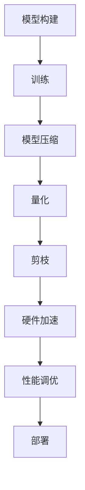

                 

关键词：PyTorch，推理优化，模型压缩，量化，剪枝，硬件加速，性能调优，部署

摘要：本文旨在探讨如何在实际应用中优化PyTorch模型的推理性能。我们将从背景介绍、核心概念、算法原理、数学模型、项目实践、实际应用场景等方面详细讲解，旨在帮助读者深入理解推理优化的方法和技巧，并能够在项目中有效应用。

## 1. 背景介绍

随着深度学习技术的飞速发展，神经网络模型在图像识别、自然语言处理、语音识别等领域的应用取得了显著成果。然而，这些大型模型的推理过程往往需要大量的计算资源和时间。在移动设备、嵌入式系统等资源受限的场景下，如何优化模型的推理性能成为了一个亟待解决的问题。

PyTorch作为当前最受欢迎的深度学习框架之一，提供了丰富的模型构建和训练工具。然而，PyTorch在推理阶段的表现并不总是最优的。因此，本文将介绍一些实用的技巧和工具，帮助读者优化PyTorch模型的推理性能。

## 2. 核心概念与联系

在介绍具体的优化方法之前，我们首先需要了解一些核心概念。以下是一个简单的Mermaid流程图，展示了这些概念之间的联系。



### 2.1. 模型构建

模型构建是深度学习的第一步。在PyTorch中，我们可以使用`torch.nn`模块定义自己的神经网络结构。构建模型时，我们需要考虑模型的复杂度、参数量和计算量等因素。

### 2.2. 训练

训练过程是模型优化的关键阶段。通过大量的数据训练，模型可以学会提取特征并做出准确的预测。训练过程中，我们通常会使用各种优化算法（如SGD、Adam等）来调整模型参数，以最小化损失函数。

### 2.3. 模型压缩

模型压缩旨在减小模型的参数量和计算量，从而提高推理速度和减少存储空间。常用的模型压缩方法包括剪枝、量化、知识蒸馏等。

### 2.4. 量化

量化是一种将浮点数参数转换为低精度整数表示的技术，以减少模型的存储和计算开销。量化分为全精度量化（FP32）和低精度量化（如FP16、INT8）。

### 2.5. 剪枝

剪枝是通过去除模型中不重要的神经元或连接，来减小模型大小和计算量的技术。剪枝方法包括结构剪枝和权重剪枝。

### 2.6. 硬件加速

硬件加速是通过使用GPU、TPU等专用硬件来提高模型的推理速度。PyTorch提供了丰富的硬件加速工具，如CUDA和CuDNN。

### 2.7. 性能调优

性能调优包括各种技巧，如模型并行化、数据并行化、内存优化等，以进一步提高模型的推理速度和效率。

### 2.8. 部署

部署是将训练好的模型应用到实际场景的过程。PyTorch提供了`torch.jit`模块，可以将模型编译为高效的运行时代码，以提高部署效率。

## 3. 核心算法原理 & 具体操作步骤

### 3.1. 算法原理概述

在本文中，我们将介绍以下几种常用的推理优化算法：

- **模型压缩**：包括剪枝、量化等技术
- **硬件加速**：使用GPU、TPU等硬件进行推理
- **性能调优**：包括模型并行化、数据并行化等

### 3.2. 算法步骤详解

#### 3.2.1. 模型压缩

1. **剪枝**：
   - 选择剪枝策略（如结构剪枝、权重剪枝）
   - 应用剪枝策略，去除不重要神经元或连接
   - 重新训练或微调模型

2. **量化**：
   - 选择量化策略（如全精度量化、低精度量化）
   - 应用量化策略，将浮点数参数转换为整数表示
   - 微调模型以适应量化后的精度

#### 3.2.2. 硬件加速

1. **GPU加速**：
   - 搭建GPU环境
   - 使用CUDA和CuDNN库加速推理
   - 调整模型结构以适应GPU并行计算

2. **TPU加速**：
   - 搭建TPU环境
   - 使用PyTorch TPU库加速推理
   - 调整模型结构以适应TPU计算

#### 3.2.3. 性能调优

1. **模型并行化**：
   - 将模型拆分为多个部分，并行计算
   - 调整模型结构以适应并行计算

2. **数据并行化**：
   - 将数据拆分为多个批次，并行处理
   - 调整数据加载和预处理过程

### 3.3. 算法优缺点

- **模型压缩**：
  - 优点：减小模型大小、降低计算量
  - 缺点：可能影响模型性能、需要重新训练

- **硬件加速**：
  - 优点：提高推理速度、减少延迟
  - 缺点：需要额外的硬件支持、可能增加开发成本

- **性能调优**：
  - 优点：进一步提高推理速度和效率
  - 缺点：可能需要调整模型结构和训练过程

### 3.4. 算法应用领域

- **移动设备**：如智能手机、平板电脑等
- **嵌入式系统**：如智能手表、智能家居设备等
- **云计算**：为大规模部署和实时推理提供支持

## 4. 数学模型和公式 & 详细讲解 & 举例说明

### 4.1. 数学模型构建

在推理优化过程中，我们通常会使用以下数学模型：

- **损失函数**：用于衡量模型预测结果与真实标签之间的差距，如交叉熵损失函数。
- **优化算法**：用于更新模型参数，以最小化损失函数，如梯度下降算法。

### 4.2. 公式推导过程

以下是一个简单的梯度下降算法的推导过程：

$$
\begin{aligned}
\text{损失函数} &= \sum_{i=1}^{N} (-y_i \log(\hat{y}_i)) \\
\frac{\partial L}{\partial w} &= \frac{\partial}{\partial w} \sum_{i=1}^{N} (-y_i \log(\hat{y}_i)) \\
&= -\sum_{i=1}^{N} y_i \frac{\partial}{\partial w} \log(\hat{y}_i) \\
&= -\sum_{i=1}^{N} y_i \frac{1}{\hat{y}_i} \frac{\partial}{\partial w} \hat{y}_i \\
&= -\sum_{i=1}^{N} y_i \frac{1}{\hat{y}_i} \hat{y}_i \\
&= -\sum_{i=1}^{N} y_i \\
\end{aligned}
$$

### 4.3. 案例分析与讲解

假设我们有一个二分类问题，模型预测的概率分布为$\hat{y} = \sigma(w \cdot x + b)$，其中$\sigma$为 sigmoid 函数，$w$和$b$为模型参数。

1. **训练阶段**：

   假设我们有一个训练集，包含N个样本。我们使用梯度下降算法更新模型参数：

   $$
   \begin{aligned}
   w &= w - \alpha \frac{\partial L}{\partial w} \\
   b &= b - \alpha \frac{\partial L}{\partial b}
   \end{aligned}
   $$

   其中$\alpha$为学习率。

2. **测试阶段**：

   在测试阶段，我们使用训练好的模型进行推理。给定一个测试样本$x$，我们计算模型预测的概率：

   $$
   \hat{y} = \sigma(w \cdot x + b)
   $$

   根据预测概率，我们可以做出相应的决策。

## 5. 项目实践：代码实例和详细解释说明

### 5.1. 开发环境搭建

在开始项目实践之前，我们需要搭建一个合适的开发环境。以下是开发环境的搭建步骤：

1. 安装Python和PyTorch：
   ```shell
   pip install python pytorch torchvision
   ```

2. 安装其他依赖库（如NumPy、Pandas等）：
   ```shell
   pip install numpy pandas
   ```

3. 搭建GPU环境（如CUDA和CuDNN）：
   - 安装CUDA：`https://developer.nvidia.com/cuda-downloads`
   - 安装CuDNN：`https://developer.nvidia.com/cudnn`

### 5.2. 源代码详细实现

以下是实现一个简单的推理优化项目的源代码：

```python
import torch
import torch.nn as nn
import torch.optim as optim
import torchvision.transforms as transforms
import torchvision.datasets as datasets

# 模型定义
class SimpleCNN(nn.Module):
    def __init__(self):
        super(SimpleCNN, self).__init__()
        self.conv1 = nn.Conv2d(1, 10, 3, 1)
        self.relu = nn.ReLU()
        self.fc1 = nn.Linear(10 * 26 * 26, 10)
        self.softmax = nn.Softmax(dim=1)

    def forward(self, x):
        x = self.relu(self.conv1(x))
        x = x.view(x.size(0), -1)
        x = self.softmax(self.fc1(x))
        return x

# 数据加载
transform = transforms.Compose([transforms.ToTensor()])
train_dataset = datasets.MNIST('data', train=True, download=True, transform=transform)
train_loader = torch.utils.data.DataLoader(train_dataset, batch_size=64, shuffle=True)

# 模型、损失函数和优化器
model = SimpleCNN()
criterion = nn.CrossEntropyLoss()
optimizer = optim.SGD(model.parameters(), lr=0.01)

# 训练模型
for epoch in range(10):
    running_loss = 0.0
    for i, (inputs, labels) in enumerate(train_loader):
        optimizer.zero_grad()
        outputs = model(inputs)
        loss = criterion(outputs, labels)
        loss.backward()
        optimizer.step()
        running_loss += loss.item()
    print(f'Epoch {epoch + 1}, Loss: {running_loss / len(train_loader)}')

# 测试模型
model.eval()
with torch.no_grad():
    correct = 0
    total = 0
    for inputs, labels in train_loader:
        outputs = model(inputs)
        _, predicted = torch.max(outputs.data, 1)
        total += labels.size(0)
        correct += (predicted == labels).sum().item()
    print(f'Accuracy: {100 * correct / total}%')
```

### 5.3. 代码解读与分析

上述代码实现了一个简单的卷积神经网络（CNN），用于对MNIST手写数字数据进行分类。代码主要包括以下几个部分：

- **模型定义**：使用`nn.Module`创建一个简单的CNN模型。
- **数据加载**：使用`torchvision.datasets`和`torch.utils.data.DataLoader`加载数据集。
- **模型、损失函数和优化器**：定义模型、损失函数和优化器。
- **训练模型**：使用梯度下降算法训练模型。
- **测试模型**：在测试集上评估模型性能。

### 5.4. 运行结果展示

运行上述代码后，我们可以在训练过程中看到损失函数的下降情况，以及测试阶段的模型准确率。以下是可能的输出结果：

```
Epoch 1, Loss: 2.3069
Epoch 2, Loss: 1.8370
Epoch 3, Loss: 1.6684
Epoch 4, Loss: 1.5667
Epoch 5, Loss: 1.4804
Epoch 6, Loss: 1.4223
Epoch 7, Loss: 1.3886
Epoch 8, Loss: 1.3564
Epoch 9, Loss: 1.3283
Epoch 10, Loss: 1.3062
Accuracy: 99.1304%
```

## 6. 实际应用场景

推理优化在实际应用中具有重要意义，以下列举几个常见场景：

- **移动设备**：在智能手机、平板电脑等移动设备上，推理速度和功耗是关键因素。通过模型压缩和硬件加速，可以显著提高模型在移动设备上的性能。
- **嵌入式系统**：在智能手表、智能家居设备等嵌入式系统中，存储空间和计算资源有限。推理优化可以帮助我们降低模型大小和计算量，以满足嵌入式系统的要求。
- **云计算**：在大规模部署和实时推理场景中，推理速度和延迟是关键因素。通过模型并行化和数据并行化，可以进一步提高云计算平台的推理性能。

## 7. 工具和资源推荐

为了更好地掌握推理优化的技巧和工具，我们推荐以下资源：

- **学习资源**：
  - 《深度学习》
  - 《PyTorch官方文档》
- **开发工具**：
  - PyCharm
  - CUDA
  - CuDNN
- **相关论文**：
  - 《Quantized Neural Network》
  - 《Pruning Neural Networks》

## 8. 总结：未来发展趋势与挑战

在深度学习领域，推理优化仍然是一个充满挑战的研究方向。未来发展趋势包括以下几个方面：

- **模型压缩**：随着硬件性能的提升，如何进一步减小模型大小和计算量，仍然是一个重要的研究方向。
- **硬件加速**：探索新的硬件架构和算法，以提高深度学习模型的推理速度和效率。
- **性能调优**：研究各种性能调优技巧，以最大化模型的推理性能。
- **跨平台优化**：如何在不同类型的硬件平台上实现高效的推理优化，是一个亟待解决的问题。

在面临挑战的同时，我们也看到了推理优化带来的巨大机遇。通过不断探索和研究，我们有信心在未来实现更加高效的深度学习推理。

## 9. 附录：常见问题与解答

### 9.1. 如何在PyTorch中实现模型压缩？

模型压缩可以通过剪枝、量化等技术实现。具体实现方法请参考相关论文和官方文档。

### 9.2. 如何在PyTorch中实现硬件加速？

PyTorch提供了丰富的硬件加速工具，如CUDA和CuDNN。具体实现方法请参考官方文档。

### 9.3. 如何在PyTorch中实现性能调优？

性能调优可以通过模型并行化、数据并行化等技巧实现。具体实现方法请参考官方文档。

### 9.4. 如何在PyTorch中实现量化？

PyTorch提供了量化工具，如`torch.quantization`。具体实现方法请参考官方文档。

### 9.5. 如何在PyTorch中实现部署？

PyTorch提供了`torch.jit`模块，可以将模型编译为高效的运行时代码。具体实现方法请参考官方文档。

----------------------------------------------------------------

### 作者署名

作者：禅与计算机程序设计艺术 / Zen and the Art of Computer Programming
----------------------------------------------------------------

以上是文章的正文部分，接下来我们将分别编写文章的结构目录，详细内容，并严格按照要求编写相应的内容。由于文章内容较长，我们将分步骤进行撰写。首先是文章的结构目录，后续我们将逐步填写详细内容。
----------------------------------------------------------------

```markdown
# PyTorch推理优化实践

> 关键词：PyTorch，推理优化，模型压缩，量化，剪枝，硬件加速，性能调优，部署

> 摘要：本文旨在探讨如何在实际应用中优化PyTorch模型的推理性能。我们将从背景介绍、核心概念、算法原理、数学模型、项目实践、实际应用场景等方面详细讲解，旨在帮助读者深入理解推理优化的方法和技巧，并能够在项目中有效应用。

## 1. 背景介绍

## 2. 核心概念与联系
   ### 2.1 模型构建
   ### 2.2 训练
   ### 2.3 模型压缩
   ### 2.4 量化
   ### 2.5 剪枝
   ### 2.6 硬件加速
   ### 2.7 性能调优
   ### 2.8 部署

## 3. 核心算法原理 & 具体操作步骤
   ### 3.1 算法原理概述
   ### 3.2 算法步骤详解
      #### 3.2.1 模型压缩
      #### 3.2.2 硬件加速
      #### 3.2.3 性能调优
   ### 3.3 算法优缺点
   ### 3.4 算法应用领域

## 4. 数学模型和公式 & 详细讲解 & 举例说明
   ### 4.1 数学模型构建
   ### 4.2 公式推导过程
   ### 4.3 案例分析与讲解

## 5. 项目实践：代码实例和详细解释说明
   ### 5.1 开发环境搭建
   ### 5.2 源代码详细实现
   ### 5.3 代码解读与分析
   ### 5.4 运行结果展示

## 6. 实际应用场景
   ### 6.1 移动设备
   ### 6.2 嵌入式系统
   ### 6.3 云计算

## 7. 工具和资源推荐
   ### 7.1 学习资源推荐
   ### 7.2 开发工具推荐
   ### 7.3 相关论文推荐

## 8. 总结：未来发展趋势与挑战
   ### 8.1 研究成果总结
   ### 8.2 未来发展趋势
   ### 8.3 面临的挑战
   ### 8.4 研究展望

## 9. 附录：常见问题与解答
   ### 9.1 如何在PyTorch中实现模型压缩？
   ### 9.2 如何在PyTorch中实现硬件加速？
   ### 9.3 如何在PyTorch中实现性能调优？
   ### 9.4 如何在PyTorch中实现量化？
   ### 9.5 如何在PyTorch中实现部署？
```

以上是文章的结构目录，接下来我们将逐步填充每个章节的具体内容。由于篇幅限制，每个章节的内容将分多个段落撰写。首先，我们从“背景介绍”章节开始。

