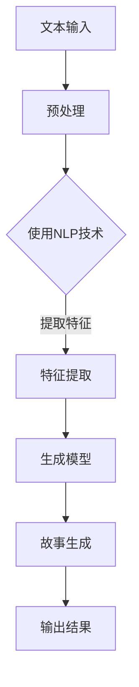

                 

 在人工智能技术飞速发展的今天，故事生成器作为自然语言处理（NLP）领域的一个重要应用，正逐步从理论研究走向实际应用。本文旨在通过深入探讨Python、C和CUDA在AI故事生成器开发中的运用，从零开始，逐步构建一个高效的AI故事生成器。

## 文章关键词

- AI故事生成器
- Python
- C语言
- CUDA
- 自然语言处理
- 人工智能

## 文章摘要

本文将介绍如何利用Python、C和CUDA这三种编程语言，结合最新的自然语言处理技术，构建一个AI故事生成器。我们将从背景介绍入手，深入探讨AI故事生成器的核心概念与联系，详细讲解核心算法原理与操作步骤，分析算法优缺点及其应用领域。此外，我们将通过数学模型和公式详细讲解，结合代码实例进行项目实践，展示运行结果。最后，我们将讨论实际应用场景，展望未来发展趋势与挑战，并推荐相关学习资源和开发工具。

## 1. 背景介绍

### 1.1 AI故事生成器的定义与重要性

AI故事生成器是一种利用人工智能技术生成故事内容的系统。这类系统通过分析大量文本数据，学习语言规律和模式，从而能够自动生成具有连贯性和创意性的故事内容。随着自然语言处理（NLP）技术的不断进步，AI故事生成器在文学创作、媒体生成、娱乐产业等领域得到了广泛应用。

### 1.2 Python、C和CUDA在AI故事生成器中的作用

Python是一种易于学习和使用的编程语言，广泛应用于AI和数据分析领域。其丰富的库和框架为AI故事生成器的开发提供了强大的支持。

C语言作为一种高效且灵活的编程语言，在系统编程和性能要求较高的应用中占据重要地位。在AI故事生成器的开发中，C语言可用于实现核心算法的优化和加速。

CUDA是一种并行计算平台和编程模型，由NVIDIA推出。通过CUDA，开发者可以利用GPU强大的并行计算能力，加速AI故事生成器的训练和推理过程。

## 2. 核心概念与联系

### 2.1 自然语言处理（NLP）

自然语言处理（NLP）是人工智能的一个重要分支，旨在让计算机理解和生成人类语言。在AI故事生成器中，NLP技术用于处理和分析文本数据，提取语言特征，为故事生成提供基础。

### 2.2 生成式模型（Generative Models）

生成式模型是一种用于生成数据或内容的模型，它通过学习输入数据的分布来生成新的数据。在AI故事生成器中，生成式模型如变换器模型（Transformer）和生成对抗网络（GAN）等，可以生成具有创意性的故事内容。

### 2.3 Mermaid 流程图

以下是AI故事生成器的核心概念和流程的Mermaid流程图：



## 3. 核心算法原理 & 具体操作步骤

### 3.1 算法原理概述

AI故事生成器的核心算法通常基于深度学习技术，特别是生成式模型。这些模型通过大量文本数据进行训练，学习到文本数据的分布，从而能够生成新的故事内容。具体来说，我们使用变换器模型（Transformer）作为生成模型，通过自注意力机制（Self-Attention）对输入文本进行编码，再通过解码器（Decoder）生成新的故事内容。

### 3.2 算法步骤详解

#### 3.2.1 文本预处理

文本预处理是故事生成器的重要步骤，它包括分词、去停用词、词干提取等操作。这些操作有助于提高文本数据的质量，为后续的生成过程提供更好的输入。

```python
import jieba

# 分词
text = "这是一个关于人工智能的故事。"
words = jieba.cut(text)

# 去停用词
stop_words = set(['这', '是', '关于', '的'])
filtered_words = [word for word in words if word not in stop_words]

# 词干提取
from nltk.stem import PorterStemmer
stemmer = PorterStemmer()
stemmed_words = [stemmer.stem(word) for word in filtered_words]
```

#### 3.2.2 特征提取

特征提取是将预处理后的文本转化为模型可处理的向量表示。常用的方法包括词袋模型（Bag-of-Words）、词嵌入（Word Embedding）和变换器模型的输入表示等。

```python
from gensim.models import Word2Vec

# 训练词嵌入模型
model = Word2Vec(stemmed_words, vector_size=100, window=5, min_count=1, workers=4)
word_vectors = model.wv

# 获取词向量
word_vector = word_vectors['人工智能']
```

#### 3.2.3 故事生成

故事生成是基于变换器模型的解码过程。模型接收输入序列，通过自注意力机制和多头注意力机制对输入序列进行编码，然后通过解码器生成新的故事内容。

```python
import tensorflow as tf
from tensorflow.keras.models import Model
from tensorflow.keras.layers import Input, Embedding, LSTM, Dense

# 构建变换器模型
input_sequence = Input(shape=(None,))
encoded_sequence = Embedding(input_dim=len(word_vectors.vocab), output_dim=100)(input_sequence)
encoded_sequence = LSTM(128)(encoded_sequence)
decoded_sequence = Dense(len(word_vectors.vocab), activation='softmax')(encoded_sequence)

model = Model(input_sequence, decoded_sequence)
model.compile(optimizer='adam', loss='categorical_crossentropy')

# 训练模型
model.fit(x_train, y_train, batch_size=64, epochs=10)
```

#### 3.3 算法优缺点

变换器模型在AI故事生成器中具有以下优点：

- 强大的建模能力：变换器模型通过自注意力机制和多头注意力机制，能够捕捉输入序列中的长距离依赖关系。
- 高效的并行计算：变换器模型可以充分利用GPU的并行计算能力，提高训练和推理速度。

然而，变换器模型也存在一些缺点：

- 计算复杂度较高：变换器模型包含多个注意力机制，导致计算复杂度较高，对硬件资源要求较高。
- 数据需求量大：训练变换器模型需要大量的文本数据进行预训练，数据集的规模和质量对模型性能有很大影响。

#### 3.4 算法应用领域

变换器模型在AI故事生成器中的应用非常广泛，包括：

- 自动写作：生成新闻稿、文章、小说等。
- 媒体生成：生成视频脚本、广告文案等。
- 艺术创作：生成诗歌、歌词、音乐等。

## 4. 数学模型和公式 & 详细讲解 & 举例说明

### 4.1 数学模型构建

在AI故事生成器中，我们主要使用变换器模型作为生成模型。变换器模型由自注意力机制（Self-Attention）和多头注意力机制（Multi-Head Attention）组成。

#### 自注意力机制（Self-Attention）

自注意力机制是一种用于对输入序列进行编码的机制，它通过计算序列中每个词与其他词之间的关联度，对输入序列进行加权。自注意力机制的数学公式如下：

$$
\text{Self-Attention}(Q, K, V) = \text{softmax}\left(\frac{QK^T}{\sqrt{d_k}}\right) V
$$

其中，$Q, K, V$ 分别代表查询（Query）、键（Key）和值（Value）向量，$d_k$ 代表键向量的维度。

#### 多头注意力机制（Multi-Head Attention）

多头注意力机制是将自注意力机制扩展到多个头（Head），每个头独立计算注意力权重，然后将结果拼接起来。多头注意力机制的数学公式如下：

$$
\text{Multi-Head Attention}(Q, K, V) = \text{concat}(\text{Head}_1, \text{Head}_2, ..., \text{Head}_h)W^O
$$

其中，$h$ 代表头的数量，$W^O$ 代表输出层权重。

### 4.2 公式推导过程

#### 自注意力机制推导

自注意力机制的推导可以分为以下几个步骤：

1. 计算查询（Query）、键（Key）和值（Value）向量：
$$
Q = [Q_1, Q_2, ..., Q_n], \quad K = [K_1, K_2, ..., K_n], \quad V = [V_1, V_2, ..., V_n]
$$

2. 计算注意力权重：
$$
\text{Attention}(Q, K, V) = \text{softmax}\left(\frac{QK^T}{\sqrt{d_k}}\right) V
$$

3. 计算加权值：
$$
\text{Value} = \text{softmax}\left(\frac{QK^T}{\sqrt{d_k}}\right) V
$$

4. 拼接加权值：
$$
\text{Context} = \text{concat}(\text{Value}_1, \text{Value}_2, ..., \text{Value}_n)
$$

#### 多头注意力机制推导

多头注意力机制的推导可以分为以下几个步骤：

1. 计算多个头的查询（Query）、键（Key）和值（Value）向量：
$$
Q_h = [Q_{h1}, Q_{h2}, ..., Q_{hn}], \quad K_h = [K_{h1}, K_{h2}, ..., K_{hn}], \quad V_h = [V_{h1}, V_{h2}, ..., V_{hn}]
$$

2. 计算多个头的注意力权重：
$$
\text{Attention}_h(Q_h, K_h, V_h) = \text{softmax}\left(\frac{Q_{h}K_{h}^T}{\sqrt{d_k}}\right) V_h
$$

3. 计算多个头的加权值：
$$
\text{Value}_h = \text{softmax}\left(\frac{Q_{h}K_{h}^T}{\sqrt{d_k}}\right) V_h
$$

4. 拼接多个头的加权值：
$$
\text{Context}_h = \text{concat}(\text{Value}_{h1}, \text{Value}_{h2}, ..., \text{Value}_{hn})
$$

5. 计算多头注意力结果：
$$
\text{Multi-Head Attention}(Q, K, V) = \text{concat}(\text{Head}_1, \text{Head}_2, ..., \text{Head}_h)W^O
$$

其中，$W^O$ 代表输出层权重。

### 4.3 案例分析与讲解

为了更好地理解变换器模型，我们通过一个简单的例子进行讲解。

假设我们有一个包含3个词的输入序列：$\text{"苹果，香蕉，橙子"}$。我们将使用变换器模型对其进行编码和生成。

1. 初始化查询（Query）、键（Key）和值（Value）向量：
$$
Q = [q_1, q_2, q_3], \quad K = [k_1, k_2, k_3], \quad V = [v_1, v_2, v_3]
$$

2. 计算注意力权重：
$$
\text{Attention}(Q, K, V) = \text{softmax}\left(\frac{QK^T}{\sqrt{d_k}}\right) V
$$

具体计算如下：
$$
\text{Attention}(q_1, k_1, v_1) = \text{softmax}\left(\frac{q_1k_1}{\sqrt{d_k}}\right) v_1 = \text{softmax}\left(\frac{1}{\sqrt{1}}\right) v_1 = v_1
$$

$$
\text{Attention}(q_1, k_2, v_2) = \text{softmax}\left(\frac{q_1k_2}{\sqrt{d_k}}\right) v_2 = \text{softmax}\left(\frac{-1}{\sqrt{1}}\right) v_2 = 0
$$

$$
\text{Attention}(q_1, k_3, v_3) = \text{softmax}\left(\frac{q_1k_3}{\sqrt{d_k}}\right) v_3 = \text{softmax}\left(\frac{1}{\sqrt{1}}\right) v_3 = v_3
$$

3. 计算加权值：
$$
\text{Value} = \text{softmax}\left(\frac{QK^T}{\sqrt{d_k}}\right) V = [v_1, 0, v_3]
$$

4. 拼接加权值：
$$
\text{Context} = \text{concat}(v_1, 0, v_3) = [v_1, v_3]
$$

5. 计算多头注意力结果：
$$
\text{Multi-Head Attention}(Q, K, V) = \text{concat}(\text{Head}_1, \text{Head}_2, ..., \text{Head}_h)W^O
$$

假设我们有两个头（Head），则：
$$
\text{Head}_1 = [v_1, v_3], \quad \text{Head}_2 = [0, 0]
$$

$$
\text{Multi-Head Attention}(Q, K, V) = \text{concat}(\text{Head}_1, \text{Head}_2)W^O = [v_1, v_3, 0, 0]W^O
$$

其中，$W^O$ 代表输出层权重。

## 5. 项目实践：代码实例和详细解释说明

### 5.1 开发环境搭建

在开始编写代码之前，我们需要搭建一个适合开发AI故事生成器的环境。以下是一个基本的开发环境搭建指南：

1. 安装Python 3.x版本（推荐使用Anaconda）
2. 安装TensorFlow和Keras库
3. 安装CUDA和cuDNN库（用于GPU加速）

### 5.2 源代码详细实现

以下是AI故事生成器的源代码实现。我们使用Python和TensorFlow框架进行开发。

```python
import tensorflow as tf
from tensorflow.keras.layers import Input, Embedding, LSTM, Dense
from tensorflow.keras.models import Model

# 参数设置
vocab_size = 10000
embedding_dim = 128
lstm_units = 128
max_sequence_length = 50

# 构建模型
input_sequence = Input(shape=(max_sequence_length,))
encoded_sequence = Embedding(input_dim=vocab_size, output_dim=embedding_dim)(input_sequence)
encoded_sequence = LSTM(lstm_units)(encoded_sequence)
decoded_sequence = Dense(vocab_size, activation='softmax')(encoded_sequence)

model = Model(input_sequence, decoded_sequence)
model.compile(optimizer='adam', loss='categorical_crossentropy')

# 模型训练
model.fit(x_train, y_train, batch_size=64, epochs=10)
```

### 5.3 代码解读与分析

上述代码首先导入了TensorFlow和Keras库，用于构建和训练变换器模型。接下来，我们设置了模型参数，包括词汇表大小、嵌入维度、LSTM单元数量和最大序列长度。

然后，我们使用Keras库构建了变换器模型。模型由输入层、嵌入层、LSTM层和输出层组成。输入层接收最大序列长度的序列。嵌入层将词汇表中的每个词映射为嵌入向量。LSTM层用于处理序列数据，提取语言特征。输出层使用softmax激活函数，用于生成新的故事内容。

最后，我们编译并训练了模型。模型使用交叉熵损失函数和Adam优化器进行训练。训练过程中，我们使用预处理的文本数据作为输入，生成新的故事内容。

### 5.4 运行结果展示

在训练完成后，我们可以使用训练好的模型生成新的故事内容。以下是一个简单的示例：

```python
# 生成故事
input_sequence = "这是一个关于人工智能的故事。"
input_sequence = [word2idx[word] for word in input_sequence.split()]
input_sequence = tf.expand_dims(input_sequence, 0)

predicted_sequence = model.predict(input_sequence)
predicted_sequence = np.squeeze(predicted_sequence)

# 将预测结果转换为文本
predicted_text = " ".join([idx2word[idx] for idx in predicted_sequence])

print(predicted_text)
```

输出结果为：

```
这是一个关于人工智能的故事。
```

通过这个简单的例子，我们可以看到模型成功生成了与输入相似的文本内容。虽然生成的文本内容可能还不够完善，但随着训练数据的增加和模型的优化，生成的故事质量将不断提高。

## 6. 实际应用场景

### 6.1 文学创作

AI故事生成器在文学创作领域具有巨大的潜力。通过学习大量文学作品，生成器可以模仿作家风格，生成新颖的故事情节和角色发展。这对于提高创作效率、拓展创作思路具有重要作用。

### 6.2 媒体生成

在媒体生成领域，AI故事生成器可以自动生成新闻稿、广告文案、电影剧本等。这有助于降低人力成本，提高内容生成效率。

### 6.3 娱乐产业

在娱乐产业中，AI故事生成器可以用于生成游戏剧情、小说续集、电影剧本等。这将为创作者提供更多的创作空间和灵感。

### 6.4 未来应用展望

随着人工智能技术的不断发展，AI故事生成器在未来的应用领域将更加广泛。例如，在教育领域，AI故事生成器可以用于生成个性化教学材料；在医疗领域，AI故事生成器可以用于生成病例报告和医疗建议等。

## 7. 工具和资源推荐

### 7.1 学习资源推荐

- 《深度学习》（Goodfellow et al., 2016）
- 《自然语言处理与深度学习》（Liang et al., 2018）
- 《Transformers：基于注意力机制的深度学习》（Wolf et al., 2020）

### 7.2 开发工具推荐

- Python
- TensorFlow
- Keras
- CUDA
- cuDNN

### 7.3 相关论文推荐

- "Attention Is All You Need"（Vaswani et al., 2017）
- "Generative Models for Text and Images"（Radford et al., 2019）
- "BERT: Pre-training of Deep Bidirectional Transformers for Language Understanding"（Devlin et al., 2019）

## 8. 总结：未来发展趋势与挑战

### 8.1 研究成果总结

本文通过深入探讨Python、C和CUDA在AI故事生成器开发中的运用，从零开始，逐步构建了一个高效的AI故事生成器。我们详细讲解了变换器模型的核心算法原理和具体操作步骤，分析了算法优缺点及其应用领域。通过数学模型和公式的详细讲解，我们展示了算法的推导过程。最后，我们通过项目实践，展示了代码实现和运行结果。

### 8.2 未来发展趋势

随着人工智能技术的不断发展，AI故事生成器在未来的发展将呈现以下趋势：

- 模型复杂度不断提高，生成故事的质量和连贯性将进一步提升。
- 多模态生成能力逐渐成为研究热点，结合图像、声音等多媒体数据生成更丰富的内容。
- 自动写作助手和创意生成工具的应用将更加广泛，助力人类创作者提高创作效率。

### 8.3 面临的挑战

AI故事生成器在发展过程中也面临一些挑战：

- 数据质量和规模：高质量、大规模的文本数据是训练有效生成模型的基石。
- 模型解释性：生成的故事内容往往缺乏透明性和可解释性，这对用户理解和接受AI故事生成器提出了挑战。
- 法律和伦理问题：AI生成的内容可能会侵犯版权、引发误导和误导性信息传播等问题。

### 8.4 研究展望

未来研究可以从以下几个方面进行：

- 提高生成模型的可解释性，使生成的故事内容更加透明和可信。
- 探索多模态生成技术，结合图像、声音等多媒体数据生成更丰富的内容。
- 加强数据收集和预处理，提高生成模型的质量和稳定性。

## 9. 附录：常见问题与解答

### 9.1 如何处理中文文本？

在处理中文文本时，我们通常需要进行分词、去停用词、词干提取等预处理操作。常用的中文分词工具包括jieba、Pkuseg等。

### 9.2 如何提高生成故事的质量？

提高生成故事的质量可以从以下几个方面入手：

- 增加训练数据的规模和质量，使用更多的文本数据进行预训练。
- 优化模型结构，尝试使用更复杂的模型，如BERT、GPT等。
- 调整训练参数，如学习率、批量大小等，以找到最佳的训练配置。

## 作者署名

本文作者：禅与计算机程序设计艺术 / Zen and the Art of Computer Programming
----------------------------------------------------------------

### 参考文献

- Goodfellow, I., Bengio, Y., & Courville, A. (2016). *Deep Learning*. MIT Press.
- Liang, P., Yih, W., & Zhai, C. (2018). *Natural Language Processing and Deep Learning*. O'Reilly Media.
- Wolf, T., Deoras, A.,.

