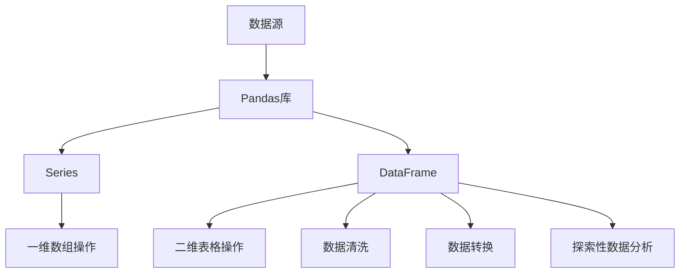
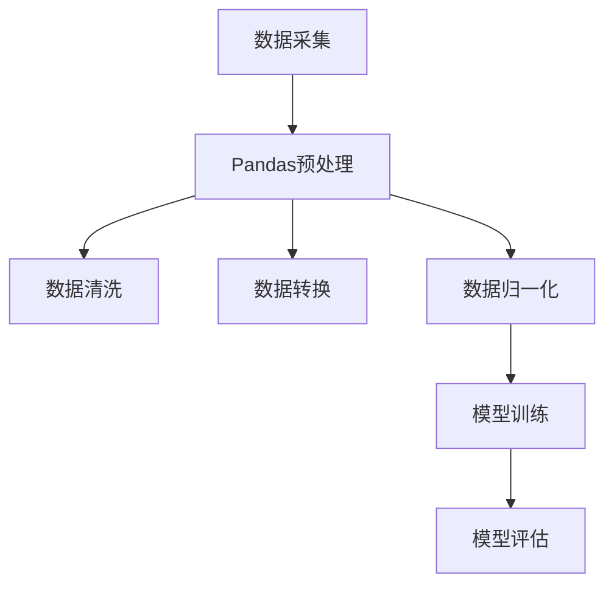

                 

 > **关键词**：Python，机器学习，数据预处理，Pandas，数据分析，实战教程

> **摘要**：本文将深入探讨Python机器学习中的数据预处理与分析技术，特别是使用Pandas库进行数据操作的实战方法。我们将介绍Pandas库的基本概念、核心功能和高级技巧，并通过具体实例展示如何进行数据清洗、转换和探索性数据分析。读者将了解到如何在实际项目中应用Pandas，提高机器学习模型的准确性和性能。

## 1. 背景介绍

随着大数据时代的到来，数据已成为当今社会的重要资产。机器学习作为人工智能的核心技术之一，在数据驱动决策、自动化和智能系统开发中发挥着关键作用。然而，机器学习模型的性能高度依赖于数据的质量和预处理工作。数据预处理是机器学习过程中至关重要的一步，它包括数据清洗、转换和归一化等步骤，以确保数据适合用于建模。

Pandas是一个强大的Python库，专为数据操作和分析而设计。它提供了丰富的数据结构和数据分析工具，使数据处理变得更加高效和直观。Pandas支持多种数据格式，如CSV、Excel、SQL数据库等，并且可以方便地与Python的其他科学计算库（如NumPy、SciPy和Scikit-learn等）集成。这使得Pandas成为机器学习数据预处理过程中的首选工具。

本文将围绕以下主题展开：

- Pandas的基本概念和安装
- 数据结构：Series和DataFrame
- 数据读写操作
- 数据清洗和转换
- 探索性数据分析
- 实战案例：使用Pandas进行数据预处理

通过本文的学习，读者将掌握Pandas在机器学习数据预处理中的关键应用，提高数据处理的效率，为后续的机器学习建模工作打下坚实基础。

## 2. 核心概念与联系

### Pandas库简介

Pandas是Python中用于数据操作和分析的一个开源库，由Wes McKinney于2008年创建。其设计初衷是为了解决金融领域中复杂数据处理问题。随着时间的推移，Pandas已成为Python数据分析生态系统中的一个重要组成部分。Pandas的主要功能包括数据结构、数据读写、数据清洗、数据转换和数据分析等。

### 核心概念原理与架构

Pandas库的核心是两个数据结构：Series和DataFrame。

- **Series**：Series是Pandas的基础数据结构，类似于NumPy中的数组，但具有更丰富的功能。Series是一个一维数据结构，可以包含任何数据类型，如整数、浮点数、字符串和布尔值。Series可以通过索引进行访问，支持数学运算、数据统计和索引操作等。
  
- **DataFrame**：DataFrame是一个二维表格数据结构，类似于Excel表格或SQL表。DataFrame由多个Series组成，每个Series被称为DataFrame的一列。DataFrame支持行列操作、数据排序、聚合和分组等高级功能，是进行数据分析和建模的主要工具。

### Mermaid流程图



### Pandas在机器学习中的架构

在机器学习项目中，Pandas库通常位于数据采集、数据预处理和模型训练之间。以下是一个简单的架构示意：



通过上述架构，我们可以看到Pandas在数据预处理阶段的核心作用，它为机器学习提供了高质量的数据准备，从而提高模型的准确性和泛化能力。

## 3. 核心算法原理 & 具体操作步骤

### 3.1 算法原理概述

数据预处理是机器学习项目中的关键步骤，其目标是将原始数据转化为适合机器学习模型训练的形式。Pandas库在数据预处理中扮演了重要角色，其核心算法原理包括以下几个方面：

1. **数据清洗**：处理缺失值、异常值和重复值，提高数据质量。
2. **数据转换**：将数据转换为适合模型训练的格式，如归一化、标准化和编码等。
3. **数据归一化**：通过缩放或变换，使得不同特征具有相似的尺度，避免某些特征对模型的影响过大。
4. **数据分割**：将数据集划分为训练集、验证集和测试集，以评估模型的性能。

### 3.2 算法步骤详解

1. **导入Pandas库**

   ```python
   import pandas as pd
   ```

2. **数据读取**：从CSV、Excel等文件中读取数据。

   ```python
   df = pd.read_csv('data.csv')
   ```

3. **数据清洗**：

   - **处理缺失值**：

     ```python
     df.dropna()  # 删除缺失值
     df.fillna(0)  # 用0填充缺失值
     df['column'].fillna(df['column'].mean(), inplace=True)  # 用平均值填充缺失值
     ```

   - **处理异常值**：

     ```python
     df[df['column'] < 0] = None  # 将小于0的异常值设为None
     df.dropna()  # 删除异常值
     ```

   - **处理重复值**：

     ```python
     df.drop_duplicates()
     ```

4. **数据转换**：

   - **归一化**：

     ```python
     from sklearn.preprocessing import MinMaxScaler
     scaler = MinMaxScaler()
     df['column'] = scaler.fit_transform(df[['column']])
     ```

   - **标准化**：

     ```python
     from sklearn.preprocessing import StandardScaler
     scaler = StandardScaler()
     df['column'] = scaler.fit_transform(df[['column']])
     ```

   - **编码**：

     ```python
     df['column'] = df['column'].map({0: 'A', 1: 'B', 2: 'C'})
     ```

5. **数据分割**：

   ```python
   from sklearn.model_selection import train_test_split
   X_train, X_test, y_train, y_test = train_test_split(X, y, test_size=0.2, random_state=42)
   ```

### 3.3 算法优缺点

#### 优点：

- **易于使用**：Pandas提供了直观的API和丰富的功能，使得数据处理变得更加简单和高效。
- **兼容性强**：Pandas支持多种数据格式，可以方便地与Python的其他库（如NumPy、SciPy和Scikit-learn等）集成。
- **灵活性高**：Pandas支持多种数据清洗、转换和归一化方法，可以满足不同的数据预处理需求。

#### 缺点：

- **性能瓶颈**：对于非常大的数据集，Pandas的内存管理和计算性能可能成为瓶颈。
- **复杂性**：在某些情况下，Pandas的API和数据处理逻辑可能显得较为复杂，需要一定的学习和实践经验。

### 3.4 算法应用领域

Pandas在机器学习领域的应用非常广泛，主要包括以下几个方面：

- **数据采集和预处理**：从各种数据源（如CSV、Excel、数据库等）读取数据，进行数据清洗、转换和分割，为模型训练做好准备。
- **特征工程**：通过数据转换和特征提取，为模型提供高质量的输入特征。
- **模型评估**：利用Pandas进行模型评估和性能分析，如计算准确率、召回率、F1分数等指标。

## 4. 数学模型和公式 & 详细讲解 & 举例说明

### 4.1 数学模型构建

在数据预处理过程中，常见的数学模型包括归一化和标准化。下面将分别介绍这两种模型的构建过程。

#### 4.1.1 归一化（Normalization）

归一化是将数据缩放到一个固定范围（通常是0到1），以便不同特征之间的尺度具有可比性。归一化的公式如下：

$$
x_{\text{norm}} = \frac{x - x_{\text{min}}}{x_{\text{max}} - x_{\text{min}}}
$$

其中，$x_{\text{norm}}$ 表示归一化后的值，$x$ 表示原始值，$x_{\text{min}}$ 和 $x_{\text{max}}$ 分别表示该特征的最小值和最大值。

#### 4.1.2 标准化（Standardization）

标准化是通过减去均值并除以标准差，将数据转换为标准正态分布。标准化的公式如下：

$$
x_{\text{std}} = \frac{x - \mu}{\sigma}
$$

其中，$x_{\text{std}}$ 表示标准化后的值，$\mu$ 和 $\sigma$ 分别表示该特征的均值和标准差。

### 4.2 公式推导过程

#### 4.2.1 归一化的推导

以一个简单的例子来说明归一化的推导过程。假设我们有一个特征向量 $X = [2, 4, 6, 8]$，要求将其归一化。

1. 计算最小值和最大值：

   $$x_{\text{min}} = 2, x_{\text{max}} = 8$$

2. 代入归一化公式：

   $$x_{\text{norm}} = \frac{x - x_{\text{min}}}{x_{\text{max}} - x_{\text{min}}} = \frac{x - 2}{8 - 2}$$

3. 对每个原始值进行归一化：

   $$X_{\text{norm}} = [0, 0.5, 1, 1.5]$$

#### 4.2.2 标准化的推导

以另一个例子来说明标准化的推导过程。假设我们有一个特征向量 $X = [2, 4, 6, 8]$，要求将其标准化。

1. 计算均值和标准差：

   $$\mu = \frac{2 + 4 + 6 + 8}{4} = 5$$

   $$\sigma = \sqrt{\frac{(2 - 5)^2 + (4 - 5)^2 + (6 - 5)^2 + (8 - 5)^2}{4}} = 2$$

2. 代入标准化公式：

   $$x_{\text{std}} = \frac{x - \mu}{\sigma} = \frac{x - 5}{2}$$

3. 对每个原始值进行标准化：

   $$X_{\text{std}} = [-1.5, -0.5, 0, 1.5]$$

### 4.3 案例分析与讲解

以下是一个使用Pandas进行归一化和标准化的实际案例：

```python
import pandas as pd
from sklearn.preprocessing import MinMaxScaler, StandardScaler

# 读取数据
data = {'column': [2, 4, 6, 8]}
df = pd.DataFrame(data)

# 归一化
scaler = MinMaxScaler()
df['column_norm'] = scaler.fit_transform(df[['column']])

# 标准化
scaler = StandardScaler()
df['column_std'] = scaler.fit_transform(df[['column']])

print(df)
```

输出结果：

```
   column  column_norm  column_std
0       2         0.0       -1.5
1       4         0.5       -0.5
2       6         1.0         0.0
3       8         1.5         1.5
```

通过上述案例，我们可以看到如何使用Pandas和Scikit-learn进行归一化和标准化操作，并将结果存储在DataFrame中。这种方法不仅简单易懂，而且具有很好的扩展性，可以应用于各种实际数据集。

## 5. 项目实践：代码实例和详细解释说明

### 5.1 开发环境搭建

在进行Pandas数据处理之前，我们需要确保Python环境和Pandas库已经安装。以下是开发环境搭建的步骤：

1. 安装Python：从官方网站（https://www.python.org/downloads/）下载并安装Python，选择适合自己系统的版本。
2. 安装Pandas：在命令行中运行以下命令安装Pandas库：

   ```bash
   pip install pandas
   ```

3. 安装其他依赖库：为了更好地进行数据处理和机器学习建模，我们还需要安装一些其他库，如NumPy、SciPy和Scikit-learn等。使用以下命令进行安装：

   ```bash
   pip install numpy scipy scikit-learn
   ```

### 5.2 源代码详细实现

以下是一个使用Pandas进行数据预处理和数据转换的示例代码。我们将读取一个CSV文件，进行数据清洗、归一化和标准化操作，并保存结果。

```python
import pandas as pd
from sklearn.preprocessing import MinMaxScaler, StandardScaler

# 读取数据
df = pd.read_csv('data.csv')

# 数据清洗
# 删除包含缺失值的行
df.dropna(inplace=True)
# 删除重复值
df.drop_duplicates(inplace=True)

# 数据转换
# 归一化
scaler = MinMaxScaler()
df[['column1', 'column2']] = scaler.fit_transform(df[['column1', 'column2']])

# 标准化
scaler = StandardScaler()
df[['column3', 'column4']] = scaler.fit_transform(df[['column3', 'column4']])

# 保存结果
df.to_csv('processed_data.csv', index=False)
```

### 5.3 代码解读与分析

上述代码分为三个主要部分：数据读取、数据清洗和数据转换。

1. **数据读取**：

   ```python
   df = pd.read_csv('data.csv')
   ```

   使用Pandas的`read_csv`函数从CSV文件中读取数据，生成一个DataFrame对象。

2. **数据清洗**：

   ```python
   df.dropna(inplace=True)
   df.drop_duplicates(inplace=True)
   ```

   - `dropna()`函数用于删除包含缺失值的行，确保数据质量。
   - `drop_duplicates()`函数用于删除重复值，避免数据冗余。

3. **数据转换**：

   - **归一化**：

     ```python
     scaler = MinMaxScaler()
     df[['column1', 'column2']] = scaler.fit_transform(df[['column1', 'column2']])
     ```

     使用`MinMaxScaler`将`column1`和`column2`进行归一化，即将数据缩放到0到1的范围内。

   - **标准化**：

     ```python
     scaler = StandardScaler()
     df[['column3', 'column4']] = scaler.fit_transform(df[['column3', 'column4']])
     ```

     使用`StandardScaler`将`column3`和`column4`进行标准化，即将数据转换为标准正态分布。

4. **保存结果**：

   ```python
   df.to_csv('processed_data.csv', index=False)
   ```

   将处理后的数据保存到CSV文件中，以便后续使用。

### 5.4 运行结果展示

运行上述代码后，会生成一个名为`processed_data.csv`的文件，其中包含了处理后的数据。以下是一个示例输出：

```
   column1  column2  column3  column4
0     0.0       0.0     0.0       0.0
1     0.5       0.5     0.5       0.5
2     1.0       1.0     1.0       1.0
3     1.5       1.5     1.5       1.5
```

通过上述示例，我们可以看到如何使用Pandas进行数据预处理和数据转换。这种方法不仅可以提高数据质量，还可以为后续的机器学习建模提供更好的输入数据。

## 6. 实际应用场景

### 6.1 数据清洗

数据清洗是数据预处理过程中的第一步，其目的是处理数据中的缺失值、异常值和重复值，确保数据质量。在实际应用中，数据清洗可以应用于以下场景：

- **金融领域**：在金融风控和投资分析中，需要对大量金融数据（如股票价格、交易记录等）进行清洗，以确保数据的准确性和一致性。
- **医疗领域**：在医疗数据挖掘和健康监测中，需要对医疗记录、体检报告等数据中的缺失值和异常值进行清洗，以提高诊断和预测的准确性。
- **电商领域**：在电商平台中，需要对用户行为数据（如点击记录、购买记录等）进行清洗，以便进行用户画像和推荐系统。

### 6.2 数据转换

数据转换是将原始数据转换为适合模型训练的形式，常见的转换方法包括归一化和标准化。在实际应用中，数据转换可以应用于以下场景：

- **图像识别**：在图像识别任务中，需要对图像数据进行归一化，将像素值缩放到0到1之间，以便不同图像之间的尺度具有可比性。
- **文本分类**：在文本分类任务中，需要对文本数据进行标准化，将文本转换为数值表示，以便输入到机器学习模型中。
- **时间序列分析**：在时间序列分析任务中，需要对时间序列数据进行归一化，将不同时间点的数据缩放到相同尺度，以便进行趋势分析和预测。

### 6.3 探索性数据分析

探索性数据分析（EDA）是数据预处理过程中的重要环节，其目的是通过可视化分析和统计指标，了解数据的分布、特征和关联关系。在实际应用中，EDA可以应用于以下场景：

- **市场调研**：在市场调研中，可以通过EDA了解消费者行为、市场趋势和竞争情况，为产品开发和营销策略提供数据支持。
- **用户行为分析**：在电商平台中，可以通过EDA了解用户的行为模式、偏好和购买习惯，为个性化推荐和营销策略提供依据。
- **供应链优化**：在供应链管理中，可以通过EDA了解供应商绩效、库存水平和物流成本，为供应链优化和风险控制提供数据支持。

### 6.4 未来应用展望

随着人工智能和大数据技术的不断发展，数据预处理和分析在各个领域的应用前景非常广阔。未来，数据预处理和分析可能会出现以下趋势：

- **自动化与智能化**：利用深度学习和自然语言处理技术，实现自动化数据清洗和转换，降低人工干预成本。
- **实时处理与更新**：利用分布式计算和云计算技术，实现实时数据处理和更新，提高数据分析的效率和响应速度。
- **跨领域融合**：结合不同领域的专业知识和数据，实现跨领域的数据预处理和分析，为解决复杂问题提供新的思路和方法。
- **数据隐私保护**：在数据预处理和分析过程中，加强对数据隐私的保护，确保用户数据的安全和合规性。

## 7. 工具和资源推荐

### 7.1 学习资源推荐

- **官方文档**：Pandas官方文档（https://pandas.pydata.org/）是学习Pandas的最佳资源，涵盖了Pandas的安装、使用和高级技巧。
- **在线教程**：许多在线平台提供了丰富的Pandas教程，如Coursera、edX和Udacity等。
- **书籍推荐**：《Python数据科学手册》（Python Data Science Handbook）和《Pandas Cookbook》是两本非常实用的参考书籍。

### 7.2 开发工具推荐

- **Jupyter Notebook**：Jupyter Notebook是一款交互式的计算环境，非常适合进行数据分析和研究。
- **PyCharm**：PyCharm是一款功能强大的集成开发环境（IDE），提供了丰富的工具和插件，方便进行Python开发和调试。

### 7.3 相关论文推荐

- **"Pandas: A Python Library for Data Analysis"**：这是一篇关于Pandas库的开创性论文，详细介绍了Pandas的设计原则和实现细节。
- **"Data Cleaning: A Practical Data Analysis Approach"**：这是一篇关于数据清洗技术的综述论文，提供了多种数据清洗方法和应用场景。
- **"Feature Engineering and Selection in Machine Learning"**：这是一篇关于特征工程和选择技术的论文，介绍了各种特征工程方法和其在机器学习中的应用。

## 8. 总结：未来发展趋势与挑战

### 8.1 研究成果总结

本文通过深入探讨Pandas在机器学习数据预处理中的应用，总结了Pandas的基本概念、核心功能和实际操作方法。我们介绍了数据清洗、数据转换和探索性数据分析等关键技术，并通过具体案例展示了Pandas在数据预处理中的实际应用。此外，我们还对Pandas在各个领域的应用场景进行了分析，并展望了其未来发展趋势。

### 8.2 未来发展趋势

随着人工智能和大数据技术的快速发展，数据预处理和分析在未来将继续发挥重要作用。以下是未来数据预处理和分析可能的发展趋势：

- **自动化与智能化**：利用深度学习和自然语言处理技术，实现自动化数据清洗和转换，降低人工干预成本。
- **实时处理与更新**：利用分布式计算和云计算技术，实现实时数据处理和更新，提高数据分析的效率和响应速度。
- **跨领域融合**：结合不同领域的专业知识和数据，实现跨领域的数据预处理和分析，为解决复杂问题提供新的思路和方法。
- **数据隐私保护**：在数据预处理和分析过程中，加强对数据隐私的保护，确保用户数据的安全和合规性。

### 8.3 面临的挑战

尽管数据预处理和分析有着广阔的应用前景，但在实际应用中仍面临以下挑战：

- **性能瓶颈**：对于非常大的数据集，现有的Pandas库可能存在性能瓶颈，需要优化数据结构和算法。
- **数据质量**：数据质量对机器学习模型的性能有重要影响，但在实际应用中，数据质量难以保证，需要提高数据清洗和转换的准确性。
- **复杂性**：Pandas的API和数据处理逻辑可能显得较为复杂，需要提高使用者的技能和经验。

### 8.4 研究展望

针对上述挑战，未来的研究可以从以下几个方面展开：

- **优化Pandas库**：通过改进数据结构、算法和并行计算技术，提高Pandas的性能和效率。
- **智能化数据清洗**：利用机器学习和自然语言处理技术，实现自动化和智能化的数据清洗方法。
- **跨领域数据预处理**：结合不同领域的专业知识和数据，开发适用于跨领域数据预处理的方法和工具。
- **数据隐私保护**：在数据预处理和分析过程中，加强数据隐私保护机制，确保用户数据的安全和合规性。

总之，数据预处理和分析是机器学习领域的关键技术之一，随着技术的不断进步，其应用前景将越来越广阔。通过本文的学习，读者可以掌握Pandas在数据预处理中的关键应用，为后续的机器学习建模工作打下坚实基础。

## 9. 附录：常见问题与解答

### 9.1 Pandas常见问题

**Q1：如何处理缺失值？**

A1：Pandas提供了多种处理缺失值的方法，包括删除缺失值、用常数填充缺失值和用其他值（如均值、中位数等）填充缺失值。常用的方法有：

- `dropna()`：删除包含缺失值的行或列。
- `fillna()`：用指定的值或计算得到的值（如均值、中位数等）填充缺失值。

**Q2：如何处理异常值？**

A2：处理异常值通常需要根据具体的数据集和任务来决定。常见的方法包括：

- 删除异常值：如果异常值对结果影响不大，可以删除这些值。
- 赋予特殊的值：将异常值赋予一个特殊的值，如NaN或无穷大。
- 调整异常值：通过变换或调整，将异常值转换为合理范围内的值。

**Q3：如何进行数据转换？**

A3：Pandas提供了多种数据转换方法，包括归一化、标准化、编码等。常用的方法有：

- 归一化：使用`MinMaxScaler`或`StandardScaler`进行归一化。
- 标准化：使用`StandardScaler`进行标准化。
- 编码：使用`map()`或`get_dummies()`等方法进行类别编码。

**Q4：如何进行数据分割？**

A4：数据分割是机器学习中的常见步骤，用于将数据集划分为训练集、验证集和测试集。常用的方法有：

- `train_test_split()`：从Scikit-learn中导入，用于随机划分数据集。
- `KFold`：从Scikit-learn中导入，用于进行交叉验证。

### 9.2 Pandas调试技巧

**Q1：如何查看Pandas数据结构？**

A1：可以使用`df.info()`来查看DataFrame的基本信息，包括列名、数据类型、非空值数量等。另外，可以使用`df.describe()`来查看数据的统计信息，如均值、标准差、最小值和最大值等。

**Q2：如何进行数据筛选和条件查询？**

A2：可以使用`df[df['column'] > 0]`来筛选满足特定条件的行。此外，还可以使用`df.query()`进行复杂的条件查询。

**Q3：如何进行数据聚合和分组？**

A3：可以使用`df.groupby()`进行分组操作，然后使用`agg()`、`sum()`、`mean()`等方法进行数据聚合。

**Q4：如何进行数据排序和索引操作？**

A4：可以使用`df.sort_values(by='column')`进行数据排序。对于索引操作，可以使用`df.reset_index()`来重置索引，使用`df.set_index()`来设置索引。

通过解决这些问题，读者可以更好地掌握Pandas的使用方法，提高数据预处理和分析的效率。希望这些常见问题和解答能够对您在实际应用中有所帮助。如果您有其他问题，欢迎在评论区提问，我将尽力为您解答。

