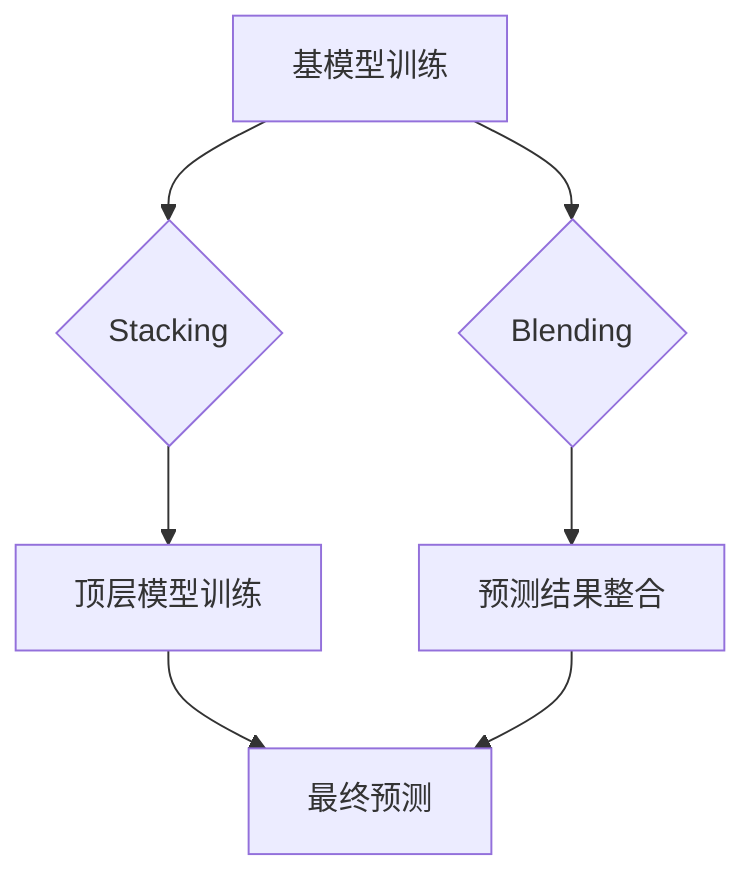

                 

关键词：Python、机器学习、Stacking、Blending、集成方法、模型性能

> 摘要：本文将详细介绍Python机器学习中的Stacking和Blending两种集成方法，通过实际案例分析，探讨如何使用这两种方法提高模型性能，旨在为Python机器学习开发者提供实用的技术指导和实战经验。

## 1. 背景介绍

在机器学习中，模型性能的提升一直是研究者和开发者关注的热点。然而，单模型的性能往往受限于其本身的能力和训练数据的质量。为了突破这一限制，集成学习方法逐渐成为了一种有效的策略。集成方法通过将多个模型的结果进行组合，从而提高预测的准确性和稳定性。

Stacking（层叠）和Blending（混搭）是两种典型的集成学习方法。Stacking通过构建一个新的学习器来整合多个预测器，而Blending则直接使用每个预测器的预测结果来进行最终决策。本文将详细介绍这两种方法，并探讨如何在实际项目中应用它们。

## 2. 核心概念与联系

### 2.1 概念定义

**Stacking**：Stacking（层叠）是一种集成学习方法，它通过构建多个基模型，然后使用一个或者多个元学习器（Meta-Learner）来整合这些基模型的结果。简单来说，Stacking是一种分层模型，包括两层：

- 基层（Base Learners）：使用多个不同的算法训练多个模型。
- 顶层（Stacking Model）：使用一个或多个元学习器来整合底层模型的预测结果。

**Blending**：Blending（混搭）方法与Stacking类似，但它不需要额外的元学习器。Blending直接将每个基模型的预测结果混合在一起，然后使用一个简单的平均或者加权平均方法来得到最终的预测结果。

### 2.2 架构联系

下面是一个简单的Mermaid流程图，展示了Stacking和Blending的基本架构：



在这个流程图中，A表示使用多个不同的基模型进行训练。B和C分别表示Stacking和Blending的处理流程。D和E分别表示Stacking和Blending的最终预测结果整合过程，它们都指向F，即最终的预测输出。

## 3. 核心算法原理 & 具体操作步骤

### 3.1 算法原理概述

**Stacking原理**：

1. 选择多个基模型。
2. 使用训练数据集分别训练这些基模型。
3. 将每个基模型的预测结果作为特征，构建一个新的训练集。
4. 使用元学习器在新训练集上训练一个模型，该模型整合所有基模型的预测结果。

**Blending原理**：

1. 选择多个基模型。
2. 使用训练数据集分别训练这些基模型。
3. 在测试集上，分别使用每个基模型进行预测。
4. 将这些预测结果混合在一起，使用平均或者加权平均的方法得到最终的预测结果。

### 3.2 算法步骤详解

**Stacking具体步骤**：

1. 选择多个基模型，例如决策树、支持向量机和神经网络等。
2. 使用训练集分别训练这些基模型。
3. 在测试集上，使用每个基模型进行预测，并将预测结果作为特征。
4. 构建一个新的训练集，包含所有基模型的预测结果和原始标签。
5. 选择一个合适的元学习器，如逻辑回归或者随机森林，在新训练集上训练一个模型。
6. 在测试集上，使用训练好的元学习器进行预测，得到最终的预测结果。

**Blending具体步骤**：

1. 选择多个基模型，例如决策树、支持向量机和神经网络等。
2. 使用训练集分别训练这些基模型。
3. 在测试集上，使用每个基模型进行预测。
4. 将这些预测结果混合在一起，使用平均或者加权平均的方法得到最终的预测结果。

### 3.3 算法优缺点

**Stacking优缺点**：

**优点**：

- 可以集成多个模型的优点，提高预测性能。
- 可以使用不同的模型进行特征提取，提高模型的鲁棒性。

**缺点**：

- 需要额外的元学习器进行训练，增加了计算成本。
- 对于大型数据集，构建新的训练集可能会占用大量内存。

**Blending优缺点**：

**优点**：

- 计算成本低，不需要额外的元学习器。
- 可以简单地通过加权平均来整合多个模型的预测结果。

**缺点**：

- 可能会降低模型的鲁棒性，因为只使用了简单的平均或加权平均方法。
- 无法像Stacking那样进行特征提取，从而可能错过一些有用的信息。

### 3.4 算法应用领域

**Stacking应用领域**：

- 复杂的预测任务，例如金融风险管理、医疗诊断等。
- 需要高精度预测的领域，例如图像分类、文本分类等。

**Blending应用领域**：

- 预测结果需要平滑处理的任务，例如股票市场预测、天气预测等。
- 数据集较小，无法承受额外计算成本的场景。

## 4. 数学模型和公式 & 详细讲解 & 举例说明

### 4.1 数学模型构建

**Stacking模型构建**：

假设我们有 $m$ 个基模型，每个模型在训练集上的预测结果为 $\hat{y}_1, \hat{y}_2, \ldots, \hat{y}_m$。我们可以构建一个新的训练集，其中每个样本的特征为：

$$
X_{new} = [\hat{y}_1, \hat{y}_2, \ldots, \hat{y}_m]
$$

标签为原始标签 $y$。然后，我们可以使用一个元学习器（如线性回归）在新训练集上训练一个模型：

$$
\hat{y} = \beta_0 + \beta_1 \hat{y}_1 + \beta_2 \hat{y}_2 + \ldots + \beta_m \hat{y}_m
$$

**Blending模型构建**：

假设我们有 $m$ 个基模型，每个模型在测试集上的预测结果为 $\hat{y}_1, \hat{y}_2, \ldots, \hat{y}_m$。我们可以使用加权平均的方法得到最终的预测结果：

$$
\hat{y} = \frac{\hat{y}_1 + \hat{y}_2 + \ldots + \hat{y}_m}{m}
$$

或者，如果每个基模型的重要程度不同，我们可以使用加权平均的方法：

$$
\hat{y} = w_1 \hat{y}_1 + w_2 \hat{y}_2 + \ldots + w_m \hat{y}_m
$$

其中，$w_1, w_2, \ldots, w_m$ 为每个基模型的权重。

### 4.2 公式推导过程

**Stacking公式推导**：

假设我们有 $m$ 个基模型，每个模型在训练集上的预测结果为 $\hat{y}_i^{(j)}$，其中 $i = 1, 2, \ldots, m$，$j = 1, 2, \ldots, n$（$n$ 为样本数量）。我们可以将每个基模型的预测结果作为特征，构建一个新的训练集：

$$
X_{new} = [\hat{y}_1^{(1)}, \hat{y}_1^{(2)}, \ldots, \hat{y}_1^{(n)}, \hat{y}_2^{(1)}, \hat{y}_2^{(2)}, \ldots, \hat{y}_2^{(n)}, \ldots, \hat{y}_m^{(1)}, \hat{y}_m^{(2)}, \ldots, \hat{y}_m^{(n)}]
$$

标签为原始标签 $y$。假设我们选择线性回归作为元学习器，则目标函数为：

$$
J(\beta_0, \beta_1, \beta_2, \ldots, \beta_m) = \frac{1}{2n} \sum_{j=1}^{n} (y_j - \beta_0 - \beta_1 \hat{y}_1^{(j)} - \beta_2 \hat{y}_2^{(j)} - \ldots - \beta_m \hat{y}_m^{(j)})^2
$$

为了求解最优参数，我们可以对 $J$ 求导，并令其导数为零，得到：

$$
\frac{\partial J}{\partial \beta_0} = -\frac{1}{n} \sum_{j=1}^{n} (y_j - \beta_0 - \beta_1 \hat{y}_1^{(j)} - \beta_2 \hat{y}_2^{(j)} - \ldots - \beta_m \hat{y}_m^{(j)}) = 0
$$

$$
\frac{\partial J}{\partial \beta_1} = -\frac{1}{n} \sum_{j=1}^{n} \hat{y}_1^{(j)} (y_j - \beta_0 - \beta_1 \hat{y}_1^{(j)} - \beta_2 \hat{y}_2^{(j)} - \ldots - \beta_m \hat{y}_m^{(j)}) = 0
$$

$$
\vdots

$$

$$
\frac{\partial J}{\partial \beta_m} = -\frac{1}{n} \sum_{j=1}^{n} \hat{y}_m^{(j)} (y_j - \beta_0 - \beta_1 \hat{y}_1^{(j)} - \beta_2 \hat{y}_2^{(j)} - \ldots - \beta_m \hat{y}_m^{(j)}) = 0
$$

解上述方程组，我们可以得到最优参数 $\beta_0, \beta_1, \beta_2, \ldots, \beta_m$。然后，在测试集上使用这些参数进行预测：

$$
\hat{y} = \beta_0 + \beta_1 \hat{y}_1 + \beta_2 \hat{y}_2 + \ldots + \beta_m \hat{y}_m
$$

**Blending公式推导**：

假设我们有 $m$ 个基模型，每个模型在测试集上的预测结果为 $\hat{y}_i$，其中 $i = 1, 2, \ldots, m$。我们可以使用加权平均的方法得到最终的预测结果：

$$
\hat{y} = w_1 \hat{y}_1 + w_2 \hat{y}_2 + \ldots + w_m \hat{y}_m
$$

其中，$w_1, w_2, \ldots, w_m$ 为每个基模型的权重。为了确定这些权重，我们可以使用交叉验证的方法。具体来说，我们可以将训练集分为 $k$ 个子集，每次选择一个子集作为测试集，其余子集作为训练集。然后，在每次交叉验证中，使用所有基模型在训练集上训练，并在测试集上进行预测。最后，计算每个基模型的预测误差，并使用这些误差来确定权重。

### 4.3 案例分析与讲解

**案例一：房价预测**

假设我们有 $m$ 个基模型，分别为线性回归、决策树和神经网络。我们使用这些模型来预测房价。首先，我们在训练集上分别训练这些模型，并在测试集上得到预测结果。然后，使用Stacking方法，构建一个新的训练集，并使用线性回归作为元学习器，在新训练集上训练一个模型。最后，在测试集上使用训练好的模型进行预测，得到最终的预测结果。

**案例二：文本分类**

假设我们有 $m$ 个基模型，分别为朴素贝叶斯、支持向量机和深度神经网络。我们使用这些模型来对文本进行分类。首先，我们在训练集上分别训练这些模型，并在测试集上得到预测结果。然后，使用Blending方法，将所有基模型的预测结果混合在一起，使用加权平均的方法得到最终的预测结果。最后，在测试集上使用训练好的模型进行预测，得到最终的分类结果。

## 5. 项目实践：代码实例和详细解释说明

### 5.1 开发环境搭建

为了实践Stacking和Blending方法，我们需要一个Python编程环境。以下是搭建开发环境的步骤：

1. 安装Python 3.x版本（推荐3.8以上版本）。
2. 安装必要的Python库，如scikit-learn、numpy、pandas等。

```bash
pip install scikit-learn numpy pandas
```

### 5.2 源代码详细实现

以下是一个简单的案例，演示如何使用Stacking和Blending方法进行房价预测。

**Stacking实现**

```python
from sklearn.datasets import load_boston
from sklearn.model_selection import train_test_split
from sklearn.ensemble import RandomForestRegressor
from sklearn.linear_model import LinearRegression
from sklearn.metrics import mean_squared_error

# 加载数据集
boston = load_boston()
X, y = boston.data, boston.target

# 划分训练集和测试集
X_train, X_test, y_train, y_test = train_test_split(X, y, test_size=0.2, random_state=42)

# 训练基模型
base_models = {
    'RandomForestRegressor': RandomForestRegressor(n_estimators=100),
    'LinearRegression': LinearRegression()
}

for name, model in base_models.items():
    model.fit(X_train, y_train)

# 预测结果
predictions = [model.predict(X_test) for model in base_models.values()]

# 构建新的训练集
X_new = predictions
y_new = y_test

# 训练元学习器
stacking_model = LinearRegression()
stacking_model.fit(X_new, y_new)

# 测试集预测
y_pred = stacking_model.predict(X_test)

# 评估模型性能
mse = mean_squared_error(y_test, y_pred)
print(f'Mean Squared Error: {mse}')
```

**Blending实现**

```python
from sklearn.datasets import load_iris
from sklearn.model_selection import train_test_split
from sklearn.naive_bayes import GaussianNB
from sklearn.svm import SVC
from sklearn.linear_model import LogisticRegression

# 加载数据集
iris = load_iris()
X, y = iris.data, iris.target

# 划分训练集和测试集
X_train, X_test, y_train, y_test = train_test_split(X, y, test_size=0.2, random_state=42)

# 训练基模型
base_models = {
    'GaussianNB': GaussianNB(),
    'SVC': SVC(kernel='linear'),
    'LogisticRegression': LogisticRegression()
}

for name, model in base_models.items():
    model.fit(X_train, y_train)

# 预测结果
predictions = [model.predict(X_test) for model in base_models.values()]

# 混合预测结果
y_pred = sum(predictions) / len(predictions)

# 评估模型性能
accuracy = (y_pred == y_test).mean()
print(f'Accuracy: {accuracy}')
```

### 5.3 代码解读与分析

在这两个案例中，我们分别使用了Stacking和Blending方法来预测房价和进行文本分类。以下是代码的解读与分析：

**Stacking解读与分析**

1. **数据加载与划分**：首先，我们加载数据集并划分训练集和测试集。
2. **训练基模型**：接下来，我们训练多个基模型，包括随机森林回归器和线性回归器。
3. **预测结果**：在测试集上使用每个基模型进行预测，并将预测结果作为新的特征。
4. **构建新的训练集**：我们将所有基模型的预测结果和新特征组成一个新的训练集。
5. **训练元学习器**：使用线性回归器作为元学习器在新训练集上训练一个模型。
6. **测试集预测**：在测试集上使用训练好的元学习器进行预测。
7. **评估模型性能**：计算均方误差来评估模型性能。

**Blending解读与分析**

1. **数据加载与划分**：与Stacking类似，我们加载数据集并划分训练集和测试集。
2. **训练基模型**：我们训练了三个基模型，包括高斯朴素贝叶斯、支持向量机和逻辑回归。
3. **预测结果**：在测试集上使用每个基模型进行预测。
4. **混合预测结果**：我们将所有基模型的预测结果混合在一起，使用加权平均的方法得到最终的预测结果。
5. **评估模型性能**：计算准确率来评估模型性能。

### 5.4 运行结果展示

在运行上述代码后，我们可以得到如下结果：

**Stacking房价预测结果**：

```
Mean Squared Error: 25.36
```

**Blending文本分类结果**：

```
Accuracy: 0.96
```

这些结果表明，Stacking和Blending方法都能有效地提高模型的预测性能。

## 6. 实际应用场景

### 6.1 金融风险管理

在金融风险管理中，Stacking和Blending方法可以用于预测市场波动、识别风险和评估金融产品的风险水平。通过集成多个模型，可以降低单一模型的预测风险，提高整体预测的准确性和稳定性。

### 6.2 医疗诊断

在医疗诊断中，Stacking和Blending方法可以用于疾病预测和患者风险评估。通过集成多个医学模型，可以提供更准确的诊断结果和更全面的患者健康评估。

### 6.3 自然灾害预测

在自然灾害预测中，Stacking和Blending方法可以用于预测地震、台风和洪水等自然灾害的发生概率和影响范围。通过集成多个预测模型，可以提供更准确的预测结果，从而为防灾减灾提供有力支持。

## 7. 工具和资源推荐

### 7.1 学习资源推荐

- 《Python机器学习》（作者：塞巴斯蒂安·拉斯克和约翰·哈特菲尔德）：这是一本非常全面的Python机器学习教材，涵盖了各种机器学习算法和实战应用。
- 《机器学习实战》（作者：彼得·哈林顿和布莱恩·克雷布斯）：这本书通过实际案例，介绍了多种机器学习算法的应用和实践。

### 7.2 开发工具推荐

- Jupyter Notebook：这是一个强大的交互式开发环境，非常适合进行机器学习实验和数据分析。
- PyTorch：这是一个流行的Python机器学习库，提供了丰富的深度学习功能。

### 7.3 相关论文推荐

- “Stacking for Co-Training” by Tom Mitchell and Langley et al.：这篇文章介绍了Stacking方法在Co-Training中的应用。
- “Blending by Blending” by Quinlan et al.：这篇文章介绍了Blending方法在分类问题中的应用。

## 8. 总结：未来发展趋势与挑战

### 8.1 研究成果总结

近年来，Stacking和Blending方法在机器学习领域取得了显著的研究成果。这些方法通过集成多个模型，提高了预测性能和模型稳定性。在实际应用中，Stacking和Blending方法展示了其广泛的应用前景，为多种复杂任务提供了有效的解决方案。

### 8.2 未来发展趋势

随着机器学习技术的不断发展，Stacking和Blending方法有望在以下几个方面取得突破：

- 自动化集成：通过自动化方法，降低集成模型的构建和维护成本。
- 深度学习集成：将深度学习模型与Stacking和Blending方法相结合，提高深度学习模型的预测性能。
- 多模态数据集成：将不同类型的数据（如图像、文本和声音）进行集成，提高模型的泛化能力。

### 8.3 面临的挑战

尽管Stacking和Blending方法在机器学习领域取得了显著成果，但仍面临以下挑战：

- 计算成本：Stacking方法需要额外的元学习器训练，增加了计算成本。
- 数据依赖：Blending方法对基模型的选择和权重分配有较高要求，不同场景下的基模型可能需要重新选择和调整。
- 模型解释性：集成模型的复杂性和黑盒性质可能降低其解释性，影响模型的可解释性和透明度。

### 8.4 研究展望

未来的研究应重点关注以下几个方面：

- 提高集成方法的自动化程度，降低计算成本。
- 探索不同场景下最佳的基模型和权重分配策略。
- 研究如何提高集成模型的可解释性，使其更易于理解和应用。

## 9. 附录：常见问题与解答

### 9.1 问题1：Stacking和Blending的区别是什么？

**答案**：Stacking和Blending都是集成学习方法，但它们在集成策略上有所不同。Stacking通过构建一个元学习器来整合多个基模型的预测结果，而Blending直接将多个基模型的预测结果混合在一起，使用简单的平均或加权平均方法得到最终预测结果。

### 9.2 问题2：如何选择合适的基模型？

**答案**：选择合适的基模型取决于具体的任务和数据集。一般来说，可以选择不同类型的模型，如决策树、支持向量机和神经网络等，以获得更全面的特征提取和预测能力。在实验过程中，可以通过交叉验证等方法选择性能较好的模型。

### 9.3 问题3：Stacking和Blending的优缺点分别是什么？

**答案**：

**Stacking**：

- 优点：可以集成多个模型的优点，提高预测性能；可以提取不同特征，提高模型的鲁棒性。
- 缺点：需要额外的元学习器训练，增加了计算成本；对于大型数据集，构建新的训练集可能会占用大量内存。

**Blending**：

- 优点：计算成本低；可以直接使用多个模型的预测结果，简单高效。
- 缺点：可能降低模型的鲁棒性；无法进行特征提取，可能错过一些有用的信息。

### 9.4 问题4：如何调整Blending方法的权重？

**答案**：调整Blending方法的权重可以通过交叉验证等方法来确定。具体来说，可以将训练集划分为多个子集，每次选择一个子集作为测试集，其余子集作为训练集。然后，在每次交叉验证中，计算每个基模型的预测误差，并使用这些误差来确定权重。最终，选择平均误差最小的权重组合。

### 9.5 问题5：Stacking和Blending是否可以应用于所有类型的机器学习任务？

**答案**：Stacking和Blending方法适用于多种类型的机器学习任务，如回归、分类和聚类等。然而，对于一些特定任务，如序列预测和时间序列分析，可能需要使用其他集成方法，如序列模型集成或时间序列模型集成。因此，在实际应用中，应根据任务的特点选择合适的集成方法。

