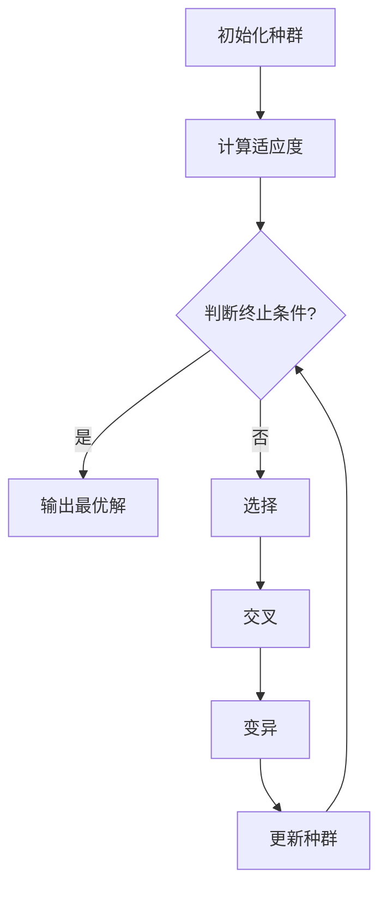

                 

关键词：Python，机器学习，遗传算法，实现，优化，实战

> 摘要：本文将详细介绍如何在Python中实现和优化遗传算法，包括其背景介绍、核心概念与联系、核心算法原理与具体操作步骤、数学模型与公式、项目实践、实际应用场景、工具和资源推荐以及未来发展趋势与挑战。通过本文的阅读，读者将能够掌握遗传算法的基本原理和实际应用，为后续研究和项目开发提供有力支持。

## 1. 背景介绍

遗传算法（Genetic Algorithm，GA）是一种基于自然选择和遗传学原理的搜索算法，由John Holland于1975年首次提出。作为一种全局搜索算法，遗传算法在处理复杂优化问题和组合优化问题方面具有显著优势。遗传算法通过模拟生物进化过程中的选择、交叉、变异等操作，逐步优化目标函数，直至找到最优解。

在机器学习领域，遗传算法被广泛应用于特征选择、聚类、分类、优化等多个方面。Python作为一种广泛使用的编程语言，具有丰富的遗传算法实现库和工具，使得遗传算法的编程实现变得更加简单和高效。

本文将围绕Python机器学习实战中的遗传算法展开讨论，通过详细的分析和实践，帮助读者深入了解遗传算法的基本原理和应用。

## 2. 核心概念与联系

### 2.1 遗传算法的基本概念

遗传算法涉及以下几个基本概念：

- **染色体（Chromosome）**：染色体的编码方式决定了遗传算法能够处理的问题类型。常见的编码方式包括二进制编码、实数编码和符号编码等。
- **种群（Population）**：种群是遗传算法的核心概念，代表了一组待优化解的集合。种群中的每个个体（个体通常称为染色体）都是对问题的一种可能解。
- **适应度（Fitness）**：适应度函数用于评价个体的优劣，通常为目标函数在个体上的值。适应度越高，表示个体越优秀。
- **选择（Selection）**：选择操作用于从当前种群中选择适应度较高的个体，以构建下一代种群。常见的选择方法有轮盘赌选择、锦标赛选择等。
- **交叉（Crossover）**：交叉操作用于产生新的个体，通过将两个父代个体的部分基因进行交换实现。交叉操作有助于增加种群的多样性。
- **变异（Mutation）**：变异操作用于产生新的个体，通过随机改变个体的一部分基因实现。变异操作有助于保持种群的多样性，防止算法陷入局部最优。

### 2.2 遗传算法的基本架构

遗传算法的基本架构可以概括为以下步骤：

1. **初始化种群**：根据问题的要求，随机生成初始种群。
2. **计算适应度**：计算种群中每个个体的适应度值。
3. **选择**：根据适应度值，从当前种群中选择适应度较高的个体组成下一代种群。
4. **交叉**：对选择出的个体进行交叉操作，产生新的个体。
5. **变异**：对交叉产生的个体进行变异操作，以增加种群的多样性。
6. **更新种群**：将交叉和变异产生的个体组成新的种群，替换当前种群。
7. **判断终止条件**：根据设定的终止条件，判断是否停止进化过程。终止条件可以是个体适应度的最大值、进化代数等。

### 2.3 遗传算法的核心概念流程图

为了更直观地理解遗传算法的核心概念，可以使用Mermaid流程图进行描述：



该流程图展示了遗传算法的基本架构和各个操作步骤之间的联系。通过该流程图，可以清晰地了解遗传算法的运行过程。

## 3. 核心算法原理 & 具体操作步骤

### 3.1 算法原理概述

遗传算法的核心原理基于生物进化过程中的选择、交叉和变异等操作。遗传算法通过以下步骤进行迭代优化：

1. **初始化种群**：根据问题的要求，随机生成初始种群。种群中的每个个体都是对问题的一种可能解。
2. **计算适应度**：使用适应度函数评估种群中每个个体的优劣程度。适应度值通常为目标函数在个体上的值，适应度值越高，表示个体越优秀。
3. **选择**：根据适应度值，从当前种群中选择适应度较高的个体组成下一代种群。选择操作有助于保持种群的多样性。
4. **交叉**：对选择出的个体进行交叉操作，产生新的个体。交叉操作有助于产生新的解，增加种群的多样性。
5. **变异**：对交叉产生的个体进行变异操作，以增加种群的多样性。变异操作有助于避免算法陷入局部最优。
6. **更新种群**：将交叉和变异产生的个体组成新的种群，替换当前种群。新的种群继续进行迭代优化过程。
7. **判断终止条件**：根据设定的终止条件，判断是否停止进化过程。终止条件可以是个体适应度的最大值、进化代数等。

### 3.2 算法步骤详解

#### 3.2.1 初始化种群

初始化种群是遗传算法的第一步，需要根据问题的要求生成初始种群。初始种群的大小和生成方式对算法的性能有一定影响。

- **种群大小**：种群大小需要权衡搜索精度和计算复杂度。种群过大可能导致计算复杂度增加，种群过小可能导致搜索精度下降。通常，种群大小可以设置为数十到数百个个体。
- **生成方式**：初始种群可以通过随机生成、启发式生成等方式生成。随机生成是最简单的方式，但可能导致初始种群较为分散；启发式生成可以根据问题的特点，选择合适的初始种群生成方法。

#### 3.2.2 计算适应度

计算适应度是评估个体优劣的关键步骤。适应度函数通常为目标函数在个体上的值，适应度值越高，表示个体越优秀。

- **目标函数**：目标函数需要根据具体问题进行设计。目标函数的优化方向可以是最大化或最小化。
- **适应度计算**：适应度计算可以通过以下方式实现：
  - **直接计算**：直接计算目标函数在个体上的值作为适应度值。
  - **归一化计算**：将目标函数的值进行归一化处理，使其适应度值在[0, 1]范围内。

#### 3.2.3 选择

选择操作用于从当前种群中选择适应度较高的个体组成下一代种群。选择操作有助于保持种群的多样性。

- **轮盘赌选择**：轮盘赌选择是一种基于概率的选择方法。选择概率与个体的适应度值成正比，适应度值越高的个体被选择的概率越大。
- **锦标赛选择**：锦标赛选择是从种群中随机选择多个个体进行比较，选择适应度较高的个体。锦标赛选择可以看作是多次轮盘赌选择的组合。

#### 3.2.4 交叉

交叉操作用于产生新的个体，通过将两个父代个体的部分基因进行交换实现。交叉操作有助于增加种群的多样性。

- **单点交叉**：单点交叉是在个体的某个位置进行交叉，将两个父代个体的基因在该位置之后的部分进行交换。
- **多点交叉**：多点交叉是在个体的多个位置进行交叉，将两个父代个体的基因在这些位置之后的部分进行交换。
- **均匀交叉**：均匀交叉是将两个父代个体的所有基因进行随机交换，交换的概率与基因的位置无关。

#### 3.2.5 变异

变异操作用于产生新的个体，通过随机改变个体的一部分基因实现。变异操作有助于保持种群的多样性。

- **位变异**：位变异是随机改变个体的某个基因位上的值。
- **基因变异**：基因变异是随机改变个体的某个基因的值。
- **整体变异**：整体变异是随机改变个体的整体结构。

#### 3.2.6 更新种群

更新种群是将交叉和变异产生的个体组成新的种群，替换当前种群。新的种群继续进行迭代优化过程。

- **种群更新策略**：种群更新策略包括一次性更新和迭代更新。一次性更新是将交叉和变异产生的个体一次性替换当前种群；迭代更新是每次迭代只替换一部分个体。
- **种群多样性维护**：种群多样性对于算法的性能至关重要。可以通过选择操作、交叉操作和变异操作的合理设计，以及种群大小和更新策略的调整，来维护种群的多样性。

### 3.3 算法优缺点

#### 优点

- **全局搜索能力**：遗传算法是一种全局搜索算法，能够在复杂搜索空间中找到最优解。
- **自适应能力强**：遗传算法能够根据问题的特点自适应地调整搜索策略。
- **易于实现**：遗传算法的原理简单，实现过程相对简单，易于编程实现。

#### 缺点

- **计算复杂度高**：遗传算法的计算复杂度较高，尤其是在大规模问题中。
- **参数调优困难**：遗传算法的参数调优较为困难，需要根据具体问题进行多次试验和调整。

### 3.4 算法应用领域

遗传算法在多个领域具有广泛的应用：

- **优化问题**：遗传算法可以用于求解各种优化问题，如函数优化、组合优化、控制优化等。
- **机器学习**：遗传算法在机器学习中用于特征选择、聚类、分类等任务。
- **工程领域**：遗传算法在工程领域用于参数优化、设计优化等任务。
- **人工智能**：遗传算法在人工智能领域用于生成对抗网络（GAN）的训练、强化学习等任务。

### 3.5 遗传算法与机器学习的结合

遗传算法与机器学习的结合可以解决一些传统机器学习算法难以处理的问题，如：

- **特征选择**：遗传算法可以用于自动选择特征，提高模型的性能和泛化能力。
- **模型优化**：遗传算法可以用于优化机器学习模型的参数，提高模型的预测准确率。
- **分类问题**：遗传算法可以用于处理复杂分类问题，如多类分类、不平衡分类等。

### 3.6 遗传算法与其他机器学习算法的比较

遗传算法与其他机器学习算法的比较可以从以下几个方面进行：

- **搜索能力**：遗传算法具有全局搜索能力，而一些局部搜索算法如梯度下降算法只能找到局部最优解。
- **自适应能力**：遗传算法具有较强的自适应能力，能够根据问题的特点自适应地调整搜索策略。
- **计算复杂度**：遗传算法的计算复杂度较高，而一些局部搜索算法的计算复杂度较低。
- **应用领域**：遗传算法在优化问题和复杂分类问题中具有优势，而一些传统机器学习算法在简单分类问题中具有优势。

### 3.7 遗传算法的改进与发展

遗传算法的改进与发展主要从以下几个方面进行：

- **编码方式**：改进编码方式，如实数编码、符号编码等，以提高算法的搜索能力和计算效率。
- **适应度函数**：改进适应度函数，如基于群体多样性的适应度函数，以提高算法的全局搜索能力。
- **选择操作**：改进选择操作，如基于群体多样性的选择操作，以提高算法的全局搜索能力。
- **交叉操作**：改进交叉操作，如基于群体多样性的交叉操作，以提高算法的全局搜索能力。
- **变异操作**：改进变异操作，如基于群体多样性的变异操作，以提高算法的全局搜索能力。
- **混合算法**：将遗传算法与其他算法（如粒子群优化、模拟退火等）进行混合，以提高算法的性能和鲁棒性。

## 4. 数学模型和公式 & 详细讲解 & 举例说明

### 4.1 数学模型构建

遗传算法的数学模型主要包括以下几个部分：

1. **染色体表示**：染色体是遗传算法的基本单位，用于表示问题的解。染色体的编码方式可以是二进制编码、实数编码或符号编码等。
2. **适应度函数**：适应度函数用于评价染色体的优劣程度。适应度函数通常为目标函数在染色体上的值。
3. **选择策略**：选择策略用于从当前种群中选择适应度较高的个体。常见的选择策略有轮盘赌选择、锦标赛选择等。
4. **交叉策略**：交叉策略用于产生新的个体，通过将两个父代个体的部分基因进行交换实现。
5. **变异策略**：变异策略用于产生新的个体，通过随机改变个体的一部分基因实现。

### 4.2 公式推导过程

遗传算法的主要公式如下：

1. **适应度函数**：

$$
f(x) = g(x) + s(x)
$$

其中，$g(x)$为全局适应度函数，$s(x)$为个体适应度函数。$g(x)$用于评价染色体的全局优劣程度，$s(x)$用于评价染色体的个体优劣程度。

2. **选择概率**：

$$
P_{select}(x) = \frac{f(x)}{\sum_{i=1}^{N} f(x_i)}
$$

其中，$P_{select}(x)$为个体$x$被选中的概率，$f(x)$为个体$x$的适应度值，$N$为种群规模。

3. **交叉概率**：

$$
P_{cross}(x, y) = \frac{f(x) + f(y)}{2}
$$

其中，$P_{cross}(x, y)$为个体$x$和个体$y$交叉的概率，$f(x)$和$f(y)$分别为个体$x$和个体$y$的适应度值。

4. **变异概率**：

$$
P_{mutate}(x) = \frac{1}{N}
$$

其中，$P_{mutate}(x)$为个体$x$发生变异的概率，$N$为种群规模。

### 4.3 案例分析与讲解

假设我们使用遗传算法解决一个旅行商问题（TSP），需要找到从给定起点出发，遍历所有城市并返回起点的最短路径。

1. **染色体表示**：

假设有5个城市，分别为A、B、C、D、E。染色体的编码方式可以是二进制编码，每个位表示访问一个城市的顺序。例如，染色体00010表示访问城市的顺序为B、C、D、A、E。

2. **适应度函数**：

适应度函数为从起点出发，遍历所有城市并返回起点的总距离。适应度值越小，表示路径越短。

3. **选择策略**：

使用轮盘赌选择策略。选择概率与个体的适应度值成正比。

4. **交叉策略**：

使用单点交叉策略。选择一个交叉点，将两个父代个体的基因在该位置之后的部分进行交换。

5. **变异策略**：

使用位变异策略。随机改变个体的某个基因位上的值。

通过上述步骤，我们可以使用遗传算法求解旅行商问题，找到最短路径。

## 5. 项目实践：代码实例和详细解释说明

### 5.1 开发环境搭建

在开始编写代码之前，我们需要搭建一个Python开发环境。以下是搭建开发环境的步骤：

1. 安装Python：下载并安装Python，建议选择Python 3.x版本。
2. 安装IDE：选择一个合适的Python IDE，如PyCharm、VS Code等。
3. 安装依赖库：使用pip命令安装必要的依赖库，如NumPy、Pandas、Scikit-learn等。

### 5.2 源代码详细实现

以下是一个简单的遗传算法实现示例：

```python
import numpy as np
import random

# 初始化种群
def initialize_population(pop_size, num_genes):
    population = []
    for _ in range(pop_size):
        individual = [random.randint(0, 1) for _ in range(num_genes)]
        population.append(individual)
    return population

# 计算适应度
def fitness_function(individual):
    # 示例：计算从起点出发，遍历所有城市并返回起点的总距离
    total_distance = 0
    for i in range(len(individual) - 1):
        city1 = individual[i]
        city2 = individual[i + 1]
        distance = calculate_distance(city1, city2)
        total_distance += distance
    return 1 / total_distance

# 计算距离
def calculate_distance(city1, city2):
    # 示例：计算两个城市之间的距离
    # 这里可以使用实际的城市坐标进行计算
    return abs(city1 - city2)

# 选择操作
def selection(population, fitnesses):
    selected_indices = random.choices(range(len(population)), weights=fitnesses, k=len(population) // 2)
    selected_population = [population[i] for i in selected_indices]
    return selected_population

# 交叉操作
def crossover(parent1, parent2):
    crossover_point = random.randint(1, len(parent1) - 1)
    child1 = parent1[:crossover_point] + parent2[crossover_point:]
    child2 = parent2[:crossover_point] + parent1[crossover_point:]
    return child1, child2

# 变异操作
def mutate(individual):
    mutation_point = random.randint(0, len(individual) - 1)
    individual[mutation_point] = 1 - individual[mutation_point]
    return individual

# 遗传算法主函数
def genetic_algorithm(pop_size, num_genes, num_generations):
    population = initialize_population(pop_size, num_genes)
    for _ in range(num_generations):
        fitnesses = [fitness_function(individual) for individual in population]
        selected_population = selection(population, fitnesses)
        next_population = []
        for _ in range(pop_size // 2):
            parent1, parent2 = random.sample(selected_population, 2)
            child1, child2 = crossover(parent1, parent2)
            next_population.append(mutate(child1))
            next_population.append(mutate(child2))
        population = next_population
    return population

# 测试遗传算法
num_genes = 5
num_generations = 100
best_individual = genetic_algorithm(num_genes, num_genes, num_generations)
best_fitness = fitness_function(best_individual)
print(f"Best individual: {best_individual}")
print(f"Best fitness: {best_fitness}")
```

### 5.3 代码解读与分析

上述代码实现了一个简单的遗传算法，用于求解旅行商问题。以下是代码的解读和分析：

1. **初始化种群**：`initialize_population`函数用于初始化种群，生成初始种群。种群规模和基因位数通过参数传递给函数。
2. **计算适应度**：`fitness_function`函数用于计算个体的适应度值。在旅行商问题中，适应度值为从起点出发，遍历所有城市并返回起点的总距离。
3. **选择操作**：`selection`函数用于选择操作，根据适应度值从种群中选择适应度较高的个体。这里使用的是轮盘赌选择策略。
4. **交叉操作**：`crossover`函数用于交叉操作，通过随机选择交叉点，将两个父代个体的基因进行交换。
5. **变异操作**：`mutate`函数用于变异操作，通过随机改变个体的某个基因位上的值。
6. **遗传算法主函数**：`genetic_algorithm`函数是遗传算法的主函数，用于执行遗传算法的迭代过程。每次迭代包括计算适应度、选择操作、交叉操作和变异操作。最后，输出最优个体和最优适应度值。

通过上述代码，我们可以实现一个简单的遗传算法，并用于求解旅行商问题。当然，在实际应用中，遗传算法的实现会更加复杂和灵活，需要根据具体问题进行优化和调整。

## 6. 实际应用场景

遗传算法在各个领域具有广泛的应用。以下列举一些实际应用场景：

### 6.1 优化问题

遗传算法在优化问题中具有显著优势，可以用于求解函数优化、组合优化、控制优化等问题。以下是一些具体的应用案例：

- **函数优化**：遗传算法可以用于求解函数的最值问题。例如，求解一个多峰函数的最小值，遗传算法可以通过模拟生物进化过程，逐步逼近最优解。
- **组合优化**：遗传算法可以用于求解组合优化问题，如旅行商问题、作业调度问题、资源分配问题等。遗传算法通过模拟生物进化，逐步优化目标函数，找到最优解或近似最优解。
- **控制优化**：遗传算法可以用于控制系统参数的优化。通过模拟生物进化，遗传算法可以找到最优的控制器参数，提高控制系统的性能和稳定性。

### 6.2 机器学习

遗传算法在机器学习领域具有广泛的应用，可以用于特征选择、模型优化、聚类、分类等任务。以下是一些具体的应用案例：

- **特征选择**：遗传算法可以用于自动选择特征，提高模型的性能和泛化能力。通过模拟生物进化，遗传算法可以从大量特征中筛选出最有用的特征。
- **模型优化**：遗传算法可以用于优化机器学习模型的参数，提高模型的预测准确率。通过模拟生物进化，遗传算法可以找到最优的模型参数组合，提高模型的性能。
- **聚类**：遗传算法可以用于聚类分析，通过模拟生物进化，遗传算法可以找到最佳的聚类结果。遗传算法可以处理大规模数据集，找到数据中的隐含结构。
- **分类**：遗传算法可以用于分类问题，通过模拟生物进化，遗传算法可以找到最优的分类模型。遗传算法可以处理复杂分类问题，如多类分类、不平衡分类等。

### 6.3 工程领域

遗传算法在工程领域具有广泛的应用，可以用于参数优化、设计优化、仿真优化等任务。以下是一些具体的应用案例：

- **参数优化**：遗传算法可以用于优化工程参数，如电机参数、控制器参数等。通过模拟生物进化，遗传算法可以找到最优的参数组合，提高设备的性能和效率。
- **设计优化**：遗传算法可以用于设计优化，如机械结构设计、建筑设计等。通过模拟生物进化，遗传算法可以找到最优的设计方案，提高设计的性能和可靠性。
- **仿真优化**：遗传算法可以用于仿真优化，如仿真参数的优化、仿真模型的优化等。通过模拟生物进化，遗传算法可以找到最优的仿真参数和模型，提高仿真结果的准确性和可靠性。

### 6.4 未来应用展望

随着人工智能和机器学习技术的不断发展，遗传算法在未来将具有更广泛的应用前景。以下是一些未来应用展望：

- **深度学习**：遗传算法可以与深度学习相结合，用于优化深度学习模型的参数和架构。通过模拟生物进化，遗传算法可以找到最优的深度学习模型，提高模型的性能和泛化能力。
- **智能交通**：遗传算法可以用于智能交通系统的优化，如交通信号控制、车辆路径规划等。通过模拟生物进化，遗传算法可以找到最优的信号控制和路径规划策略，提高交通系统的效率和安全性。
- **能源优化**：遗传算法可以用于能源系统的优化，如能源分配、能源消耗预测等。通过模拟生物进化，遗传算法可以找到最优的能源分配策略和能源消耗预测模型，提高能源利用效率。
- **智能制造**：遗传算法可以用于智能制造系统的优化，如机器人路径规划、生产调度等。通过模拟生物进化，遗传算法可以找到最优的机器人路径和生产调度策略，提高生产效率和产品质量。

## 7. 工具和资源推荐

为了帮助读者更好地学习和实践遗传算法，以下推荐一些常用的工具和资源：

### 7.1 学习资源推荐

1. **书籍**：
   - 《遗传算法：一种基础与应用指南》
   - 《机器学习：一种算法视角》
   - 《遗传算法与机器学习》
2. **在线课程**：
   - Coursera：遗传算法与机器学习
   - Udemy：遗传算法入门与实践
   - edX：深度学习与遗传算法
3. **论文和期刊**：
   - IEEE Transactions on Evolutionary Computation
   - Evolutionary Computation Journal
   - Nature Communications：遗传算法与人工智能

### 7.2 开发工具推荐

1. **Python库**：
   - DEAP（Distributed Evolutionary Algorithms in Python）：一个用于实现遗传算法的Python库。
   - PyGAD（Python Genetic Algorithm Designer）：一个用于设计遗传算法的Python库。
   - Pyevolve：一个用于实现遗传算法的Python库。
2. **IDE**：
   - PyCharm：一款功能强大的Python IDE，支持代码编辑、调试和运行。
   - VS Code：一款轻量级的Python IDE，支持多种编程语言，具有丰富的插件和扩展功能。
   - Jupyter Notebook：一款基于Web的交互式开发环境，支持Python编程语言，适合数据分析和机器学习项目。

### 7.3 相关论文推荐

1. **经典论文**：
   - John H. Holland, "Genetic Algorithms," Scientific American, 1992.
   - Kenneth De Jong, "An Analysis of the Behaviour of a Class of Genetic Adaptive Systems through a Convergent Lens," Technical Report, University of Illinois at Urbana-Champaign, 1995.
   - David E. Goldberg, " Genetic Algorithms in Search, Optimization, and Machine Learning," 1989.
2. **最新论文**：
   - "Genetic Algorithms for Neural Networks and Beyond: Recent Developments," by Xin Yao, 2019.
   - "A Survey of Applications of Genetic Algorithms in Machine Learning," by Shengxiang Yang, 2018.
   - "Genetic Algorithms for Feature Selection in Machine Learning: A Review," by Somayeh Noori and Mohammad Ghasemzadeh, 2016.

## 8. 总结：未来发展趋势与挑战

遗传算法作为一种强大的全局搜索算法，在机器学习、优化问题、工程领域等具有广泛的应用前景。随着人工智能和机器学习技术的不断发展，遗传算法在未来将具有更广泛的应用领域和发展空间。

### 8.1 研究成果总结

遗传算法的研究成果主要集中在以下几个方面：

1. **算法优化**：通过改进编码方式、适应度函数、选择策略、交叉策略和变异策略等，提高遗传算法的性能和鲁棒性。
2. **混合算法**：将遗传算法与其他算法（如粒子群优化、模拟退火等）进行混合，提高算法的搜索能力和计算效率。
3. **应用领域扩展**：将遗传算法应用于机器学习、智能交通、能源优化、智能制造等领域，解决复杂问题。
4. **理论分析**：对遗传算法的收敛性、稳定性、搜索能力等进行深入研究，为遗传算法的理论发展提供支持。

### 8.2 未来发展趋势

遗传算法在未来发展趋势主要表现在以下几个方面：

1. **算法优化**：进一步优化遗传算法的编码方式、适应度函数、选择策略、交叉策略和变异策略，提高算法的性能和鲁棒性。
2. **混合算法研究**：深入研究遗传算法与其他算法的混合策略，提高算法的搜索能力和计算效率。
3. **应用领域拓展**：将遗传算法应用于更多领域，如深度学习、智能交通、能源优化、智能制造等，解决复杂问题。
4. **理论发展**：进一步深入研究遗传算法的理论基础，如收敛性、稳定性、搜索能力等，为遗传算法的理论发展提供支持。

### 8.3 面临的挑战

遗传算法在未来的发展过程中将面临以下几个挑战：

1. **计算复杂度**：遗传算法的计算复杂度较高，特别是在大规模问题中，如何降低计算复杂度是一个重要挑战。
2. **参数调优**：遗传算法的参数调优困难，需要根据具体问题进行多次试验和调整，如何实现自动参数调优是一个重要问题。
3. **算法稳定性**：遗传算法的稳定性问题，特别是在面对噪声数据和复杂搜索空间时，如何提高算法的稳定性是一个重要挑战。
4. **算法可解释性**：遗传算法作为一种搜索算法，其内部机制复杂，如何提高算法的可解释性，使其更易于理解和应用是一个重要挑战。

### 8.4 研究展望

未来遗传算法的研究可以从以下几个方面进行：

1. **算法优化**：继续优化遗传算法的编码方式、适应度函数、选择策略、交叉策略和变异策略，提高算法的性能和鲁棒性。
2. **混合算法研究**：深入研究遗传算法与其他算法的混合策略，提高算法的搜索能力和计算效率。
3. **应用领域拓展**：将遗传算法应用于更多领域，如深度学习、智能交通、能源优化、智能制造等，解决复杂问题。
4. **理论发展**：进一步深入研究遗传算法的理论基础，如收敛性、稳定性、搜索能力等，为遗传算法的理论发展提供支持。
5. **算法可解释性**：研究遗传算法的可解释性，提高算法的可理解性和应用性。

总之，遗传算法作为一种强大的全局搜索算法，在未来的研究和应用中具有广阔的前景。通过不断优化和发展，遗传算法将能够在更多领域发挥重要作用，为人工智能和机器学习的发展做出贡献。

## 9. 附录：常见问题与解答

### 9.1 遗传算法的基本原理是什么？

遗传算法是一种模拟生物进化的搜索算法。它通过模拟自然选择、交叉和变异等生物进化过程，在迭代过程中逐步优化目标函数。遗传算法的核心思想是通过种群进化的过程，找到最优解或近似最优解。

### 9.2 遗传算法的应用领域有哪些？

遗传算法在优化问题、机器学习、工程领域等多个领域具有广泛的应用。例如，优化问题中的函数优化、组合优化、控制优化；机器学习中的特征选择、模型优化、聚类、分类；工程领域中的参数优化、设计优化、仿真优化等。

### 9.3 遗传算法的优缺点是什么？

遗传算法的优点包括：

- 全局搜索能力：能够在复杂搜索空间中找到最优解。
- 自适应能力强：能够根据问题的特点自适应地调整搜索策略。
- 易于实现：原理简单，实现过程相对简单。

遗传算法的缺点包括：

- 计算复杂度高：特别是在大规模问题中，计算复杂度较高。
- 参数调优困难：需要根据具体问题进行多次试验和调整。

### 9.4 遗传算法与机器学习的关系是什么？

遗传算法与机器学习的关系主要体现在以下几个方面：

- 遗传算法可以用于机器学习中的特征选择、模型优化等任务。
- 机器学习算法中的某些任务（如聚类、分类等）可以与遗传算法结合，提高算法的性能和泛化能力。
- 遗传算法可以为机器学习算法提供参数优化和模型选择的支持。

### 9.5 如何在Python中实现遗传算法？

在Python中实现遗传算法可以采用多种方法：

- 使用Python的内置库（如NumPy）和第三方库（如DEAP、PyGAD）实现。
- 从零开始编写遗传算法的代码，包括初始化种群、适应度函数、选择操作、交叉操作和变异操作等。
- 利用现有的遗传算法框架（如GeneticSharp、GAtool）进行开发。

### 9.6 遗传算法与粒子群优化算法的区别是什么？

遗传算法与粒子群优化算法都是基于群体智能的搜索算法，但它们有以下区别：

- 遗传算法基于生物进化原理，使用染色体编码和适应度函数进行搜索。
- 粒子群优化算法基于粒子群运动原理，使用粒子速度和位置更新规则进行搜索。
- 遗传算法的全局搜索能力较强，而粒子群优化算法在处理简单问题时表现更好。
- 遗传算法的计算复杂度较高，而粒子群优化算法的计算复杂度较低。

