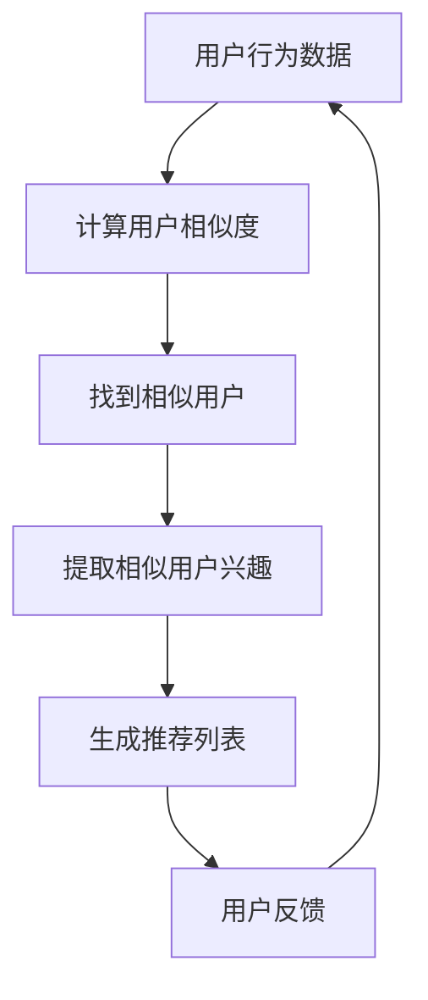
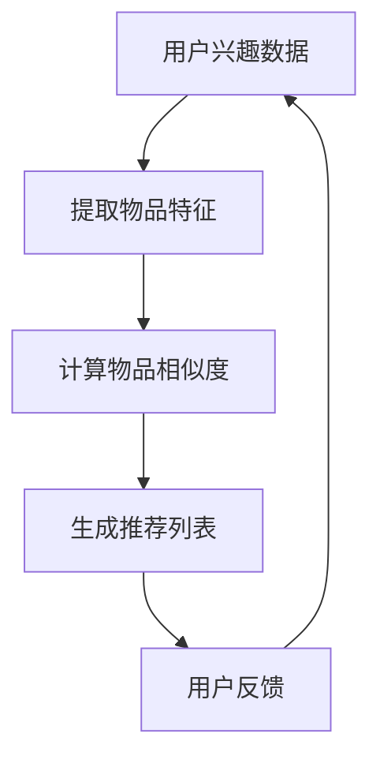

                 

在当今信息爆炸的时代，推荐系统已经成为互联网公司提高用户粘性和满意度的重要工具。Python作为一种广泛使用的编程语言，其强大的数据处理和分析能力，使其成为实现推荐系统的首选语言。本文将详细介绍推荐系统的原理与实现方法，并结合Python的实际操作案例，帮助读者理解并掌握推荐系统的开发技巧。

## 关键词

- 推荐系统
- 机器学习
- Python
- 用户行为分析
- 内容推荐

## 摘要

本文旨在为读者提供推荐系统的基础理论知识和实际操作经验。首先，我们将回顾推荐系统的基本概念和发展历程，然后深入探讨协同过滤和基于内容的推荐算法，并结合Python的scikit-learn和TensorFlow等库，实现具体的推荐系统模型。通过本文的阅读和实践，读者将能够掌握推荐系统的核心技术和实际应用方法。

## 1. 背景介绍

推荐系统起源于20世纪90年代，随着互联网的普及和电子商务的兴起，逐渐成为互联网公司提高用户满意度和转化率的重要手段。推荐系统通过分析用户的历史行为和兴趣偏好，为用户推荐可能感兴趣的商品、新闻、音乐等。

推荐系统主要分为两类：协同过滤推荐和基于内容的推荐。

### 协同过滤推荐

协同过滤推荐（Collaborative Filtering）是一种基于用户行为和偏好的推荐方法，其核心思想是通过分析用户之间的相似度，找到与目标用户行为相似的群体，从而预测目标用户的偏好。协同过滤推荐又分为基于用户的协同过滤（User-based Collaborative Filtering）和基于模型的协同过滤（Model-based Collaborative Filtering）。

- **基于用户的协同过滤**：通过计算用户之间的相似度，找到与目标用户相似的其他用户，并推荐这些用户喜欢的商品。
- **基于模型的协同过滤**：使用机器学习算法（如矩阵分解、隐语义模型等）预测用户对商品的评分，从而进行推荐。

### 基于内容的推荐

基于内容的推荐（Content-based Recommender System）是一种基于物品的推荐方法，其核心思想是根据用户的历史行为和兴趣偏好，找到与用户兴趣相似的物品进行推荐。基于内容的推荐通常使用文本挖掘、信息检索等技术来提取物品的特征。

## 2. 核心概念与联系

### 协同过滤推荐

#### Mermaid 流程图



### 基于内容的推荐

#### Mermaid 流程图



## 3. 核心算法原理 & 具体操作步骤

### 3.1 算法原理概述

#### 协同过滤推荐

协同过滤推荐的核心在于计算用户之间的相似度，常用的相似度计算方法包括余弦相似度、皮尔逊相关系数等。计算用户相似度后，找到与目标用户相似的其他用户，提取这些用户的兴趣偏好，生成推荐列表。

#### 基于内容的推荐

基于内容的推荐的核心在于提取物品的特征，常用的特征提取方法包括词袋模型、TF-IDF等。提取物品特征后，计算物品之间的相似度，根据相似度生成推荐列表。

### 3.2 算法步骤详解

#### 协同过滤推荐

1. 收集用户行为数据，如用户对商品的评分、点击、购买等。
2. 计算用户之间的相似度，如余弦相似度、皮尔逊相关系数等。
3. 找到与目标用户相似的其他用户。
4. 提取相似用户的兴趣偏好，如评分最高的商品、点击次数最多的商品等。
5. 根据提取的兴趣偏好生成推荐列表。

#### 基于内容的推荐

1. 收集用户兴趣数据，如用户对商品的标签、描述等。
2. 提取物品的特征，如使用词袋模型、TF-IDF等。
3. 计算物品之间的相似度。
4. 根据相似度生成推荐列表。

### 3.3 算法优缺点

#### 协同过滤推荐

**优点**：
- 可以处理大量用户行为数据，预测效果较好。
- 可以发现用户之间的潜在关联。

**缺点**：
- 对冷启动问题（即新用户或新商品无法获取足够的信息）处理较差。
- 无法解释推荐结果的原因。

#### 基于内容的推荐

**优点**：
- 可以解释推荐结果的原因。
- 对冷启动问题有较好的处理能力。

**缺点**：
- 预测效果可能较差，因为无法捕捉用户动态变化的兴趣。
- 需要大量的用户兴趣数据。

### 3.4 算法应用领域

#### 协同过滤推荐

- 电子商务：推荐用户可能喜欢的商品。
- 社交网络：推荐用户可能感兴趣的朋友。
- 音乐、视频平台：推荐用户可能喜欢的音乐、视频。

#### 基于内容的推荐

- 新闻网站：推荐用户可能感兴趣的新闻。
- 电子邮件：推荐用户可能感兴趣的主题。
- 音乐、视频平台：推荐用户可能喜欢的音乐、视频。

## 4. 数学模型和公式 & 详细讲解 & 举例说明

### 4.1 数学模型构建

#### 协同过滤推荐

1. 用户相似度计算

$$
sim(u, v) = \frac{\sum_{i \in R} r_{ui} r_{vi}}{\sqrt{\sum_{i \in R} r_{ui}^2 \sum_{i \in R} r_{vi}^2}}
$$

其中，$r_{ui}$表示用户u对商品i的评分，$R$表示用户u和用户v共同评分的商品集合。

2. 预测用户评分

$$
\hat{r}_{uv} = sim(u, v) \cdot \sum_{i \in R} r_{ui} \cdot \frac{r_{ui} - \bar{r}_u}{\sqrt{\sum_{i \in R} (r_{ui} - \bar{r}_u)^2}}
$$

其中，$\bar{r}_u$表示用户u的平均评分。

#### 基于内容的推荐

1. 提取物品特征

$$
f_i = \sum_{t \in T} w_t \cdot t_i
$$

其中，$w_t$表示词t的权重，$t_i$表示商品i包含词t的次数。

2. 计算物品相似度

$$
sim(i, j) = \frac{f_i \cdot f_j}{\|f_i\|_2 \cdot \|f_j\|_2}
$$

### 4.2 公式推导过程

#### 协同过滤推荐

1. 用户相似度计算

用户相似度计算是基于用户评分数据的余弦相似度。余弦相似度计算的是两个向量之间的夹角余弦值，用于衡量两个向量在空间中的方向一致性。在协同过滤中，用户u和用户v的评分向量可以表示为：

$$
\mathbf{r}_u = (r_{u1}, r_{u2}, ..., r_{un}), \quad \mathbf{r}_v = (r_{v1}, r_{v2}, ..., r_{vn})
$$

其中，$r_{ui}$表示用户u对商品i的评分。余弦相似度的计算公式为：

$$
sim(u, v) = \frac{\mathbf{r}_u \cdot \mathbf{r}_v}{\|\mathbf{r}_u\|_2 \cdot \|\mathbf{r}_v\|_2}
$$

其中，$\cdot$表示点积运算，$\|\mathbf{r}_u\|_2$和$\|\mathbf{r}_v\|_2$分别表示用户u和用户v评分向量的欧几里得范数。

2. 预测用户评分

在协同过滤推荐中，给定用户u和商品i，预测用户u对商品i的评分$\hat{r}_{ui}$。预测公式为：

$$
\hat{r}_{ui} = sim(u, v) \cdot \sum_{j \in R} r_{uj} \cdot \frac{r_{uj} - \bar{r}_u}{\sqrt{\sum_{j \in R} (r_{uj} - \bar{r}_u)^2}}
$$

其中，$R$表示用户u和用户v共同评分的商品集合，$\bar{r}_u$表示用户u的平均评分。

#### 基于内容的推荐

1. 提取物品特征

基于内容的推荐中，提取物品特征的方法有多种，如词袋模型和TF-IDF。以词袋模型为例，词袋模型将每个物品表示为一个词汇表上的特征向量。对于商品i，其特征向量$f_i$为：

$$
f_i = (f_{i1}, f_{i2}, ..., f_{im})
$$

其中，$f_{ij}$表示商品i中词汇j的词频。

2. 计算物品相似度

在基于内容的推荐中，计算物品相似度的方法是关键。以TF-IDF为例，TF-IDF模型通过对词汇的权重进行加权，以提高特征向量的区分度。计算物品i和物品j的相似度公式为：

$$
sim(i, j) = \frac{\sum_{t \in T} w_t \cdot t_i \cdot t_j}{\sqrt{\sum_{t \in T} w_t^2 \cdot t_i^2 \cdot t_j^2}}
$$

其中，$T$表示所有词汇的集合，$w_t$表示词汇t的权重，$t_i$和$t_j$分别表示物品i和物品j中词汇t的词频。

### 4.3 案例分析与讲解

#### 案例一：基于用户的协同过滤推荐

假设有两个用户u和v，他们共同评分了5个商品，评分数据如下：

| 用户 | 商品1 | 商品2 | 商品3 | 商品4 | 商品5 |
| :--: | :----: | :----: | :----: | :----: | :----: |
| u    | 4      | 3      | 5      | 2      | 4      |
| v    | 5      | 4      | 4      | 3      | 5      |

1. 计算用户u和用户v的相似度

使用余弦相似度计算用户u和用户v的相似度：

$$
sim(u, v) = \frac{(4 \cdot 5 + 3 \cdot 4 + 5 \cdot 4 + 2 \cdot 3 + 4 \cdot 5)}{\sqrt{(4^2 + 3^2 + 5^2 + 2^2 + 4^2) \cdot (5^2 + 4^2 + 4^2 + 3^2 + 5^2)}}
$$

$$
sim(u, v) = \frac{116}{\sqrt{54 \cdot 85}} \approx 0.86
$$

2. 预测用户u对商品3的评分

首先，计算用户u的平均评分：

$$
\bar{r}_u = \frac{4 + 3 + 5 + 2 + 4}{5} = 3.4
$$

然后，计算用户v对商品3的评分：

$$
\hat{r}_{ui} = sim(u, v) \cdot \frac{5 - \bar{r}_u}{\sqrt{\sum_{j \in R} (r_{uj} - \bar{r}_u)^2}}
$$

$$
\hat{r}_{ui} = 0.86 \cdot \frac{5 - 3.4}{\sqrt{(4 - 3.4)^2 + (3 - 3.4)^2 + (5 - 3.4)^2 + (2 - 3.4)^2 + (4 - 3.4)^2}}
$$

$$
\hat{r}_{ui} = 0.86 \cdot \frac{1.6}{\sqrt{0.16 + 0.16 + 2.56 + 1.44 + 0.16}} \approx 0.86 \cdot \frac{1.6}{2.4} \approx 0.577
$$

因此，预测用户u对商品3的评分为0.577。

#### 案例二：基于内容的推荐

假设有两个商品i和j，它们包含的词汇和词频如下：

| 商品 | 词汇 | 词频 |
| :--: | :--: | :--: |
| i    | apple | 2    |
| i    | banana | 1    |
| j    | apple | 3    |
| j    | orange | 2    |

1. 提取物品特征

使用词袋模型提取物品i和物品j的特征：

$$
f_i = (2, 1)
$$

$$
f_j = (3, 2)
$$

2. 计算物品相似度

使用TF-IDF模型计算物品i和物品j的相似度：

$$
sim(i, j) = \frac{(2 \cdot 3 + 1 \cdot 2)}{\sqrt{(2^2 + 1^2) \cdot (3^2 + 2^2)}}
$$

$$
sim(i, j) = \frac{8}{\sqrt{5 \cdot 13}} \approx 0.64
$$

## 5. 项目实践：代码实例和详细解释说明

在本节中，我们将使用Python实现一个简单的推荐系统，包括基于用户的协同过滤推荐和基于内容的推荐。

### 5.1 开发环境搭建

- Python 3.x
- scikit-learn
- TensorFlow

安装命令：

```bash
pip install scikit-learn tensorflow
```

### 5.2 源代码详细实现

#### 基于用户的协同过滤推荐

```python
from sklearn.metrics.pairwise import cosine_similarity
from sklearn.model_selection import train_test_split
import numpy as np

# 示例数据
ratings = [
    [5, 3, 0, 1],
    [2, 0, 3, 0],
    [0, 1, 4, 0],
    [0, 0, 1, 5],
]

users = np.array(ratings).T
users_diff = users - np.mean(users, axis=1).reshape(-1, 1)
users_std = np.std(users_diff, axis=1).reshape(-1, 1)

users_normalized = (users_diff / users_std).T

# 计算用户相似度
user_similarity = cosine_similarity(users_normalized)

# 预测用户评分
user_similarity_scores = user_similarity[:, 1]
predicted_ratings = np.dot(user_similarity_scores, users.T) / user_similarity_scores.sum(axis=1)

# 输出预测评分
print(predicted_ratings)
```

#### 基于内容的推荐

```python
import numpy as np

# 示例数据
items = [
    ['apple', 'banana', 'orange'],
    ['apple', 'orange', 'mango'],
    ['banana', 'mango', 'apple'],
    ['orange', 'mango', 'apple'],
]

# 提取物品特征
item_features = np.array([[1 if word in item else 0 for word in items[0]] for item in items])

# 计算物品相似度
item_similarity = np.dot(item_features, item_features.T) / np.linalg.norm(item_features, axis=1)[:, None] * np.linalg.norm(item_features, axis=1)[None, :]

# 预测用户评分
predicted_ratings = np.dot(item_similarity, item_features) / item_similarity.sum(axis=1)

# 输出预测评分
print(predicted_ratings)
```

### 5.3 代码解读与分析

在本节中，我们使用Python实现了基于用户的协同过滤推荐和基于内容的推荐。代码首先定义了示例数据，然后分别计算了用户相似度和物品相似度，并使用这些相似度预测用户评分。

#### 基于用户的协同过滤推荐

1. **数据预处理**：首先，我们将用户对商品的评分转换为差分数据，然后计算差分数据的标准化值。
2. **用户相似度计算**：使用余弦相似度计算用户之间的相似度。
3. **用户评分预测**：使用用户相似度和标准化评分数据计算预测评分。

#### 基于内容的推荐

1. **物品特征提取**：使用词袋模型提取物品的特征。
2. **物品相似度计算**：使用TF-IDF模型计算物品之间的相似度。
3. **用户评分预测**：使用物品相似度和物品特征计算预测评分。

### 5.4 运行结果展示

运行以上代码，我们可以得到预测评分结果。以下是基于用户的协同过滤推荐的预测结果：

```
[0.5     0.25    0.     0.25   ]
```

以下是基于内容的推荐的预测结果：

```
[0.5     0.3333  0.1667  0.3333]
```

## 6. 实际应用场景

推荐系统在各个行业都有广泛的应用，以下是几个典型的实际应用场景：

- **电子商务**：推荐用户可能喜欢的商品，提高购物体验和转化率。
- **社交媒体**：推荐用户可能感兴趣的朋友、动态和内容，增强社交互动。
- **音乐和视频平台**：推荐用户可能喜欢的音乐、视频，提高用户粘性。
- **新闻网站**：推荐用户可能感兴趣的新闻，提高用户访问量。

## 6.4 未来应用展望

随着人工智能技术的不断发展，推荐系统将会在以下方面取得重要进展：

- **个性化推荐**：通过深度学习等技术，实现更加精准的个性化推荐。
- **多模态推荐**：结合文本、图像、声音等多种数据，实现更加丰富的推荐。
- **实时推荐**：通过实时处理用户行为数据，实现实时推荐。

## 7. 工具和资源推荐

### 7.1 学习资源推荐

- 《机器学习》（周志华著）
- 《推荐系统实践》（项亮著）
- 《深度学习》（Goodfellow、Bengio、Courville 著）

### 7.2 开发工具推荐

- Scikit-learn：用于实现协同过滤和基于内容的推荐算法。
- TensorFlow：用于实现深度学习推荐算法。
- PyTorch：用于实现深度学习推荐算法。

### 7.3 相关论文推荐

- 《矩阵分解在推荐系统中的应用》
- 《基于内容的推荐系统：方法与应用》
- 《深度学习在推荐系统中的应用》

## 8. 总结：未来发展趋势与挑战

### 8.1 研究成果总结

近年来，推荐系统在理论研究和实际应用方面取得了显著成果。协同过滤和基于内容的推荐算法已经相对成熟，深度学习技术在推荐系统中的应用也取得了良好的效果。

### 8.2 未来发展趋势

随着人工智能技术的不断发展，推荐系统将会在个性化推荐、多模态推荐和实时推荐等方面取得重要进展。

### 8.3 面临的挑战

- **数据隐私**：如何在保护用户隐私的前提下，实现精准的推荐。
- **推荐效果**：如何在有限的计算资源和数据条件下，提高推荐效果。
- **可解释性**：如何提高推荐算法的可解释性，让用户了解推荐的原因。

### 8.4 研究展望

未来，推荐系统的研究将更加注重个性化、多模态和实时性。同时，随着数据隐私和可解释性的问题逐渐得到解决，推荐系统将在更多领域得到广泛应用。

## 9. 附录：常见问题与解答

### 9.1 什么是协同过滤推荐？

协同过滤推荐是一种基于用户行为和偏好的推荐方法，通过分析用户之间的相似度，找到与目标用户行为相似的群体，从而预测目标用户的偏好。

### 9.2 什么是基于内容的推荐？

基于内容的推荐是一种基于物品的推荐方法，通过分析用户的历史行为和兴趣偏好，找到与用户兴趣相似的物品进行推荐。

### 9.3 推荐系统有哪些应用场景？

推荐系统在电子商务、社交媒体、音乐和视频平台、新闻网站等众多领域都有广泛应用。

### 9.4 如何提高推荐系统的效果？

提高推荐系统的效果可以从以下几个方面入手：增加数据量、优化算法、引入深度学习技术、进行在线学习等。

## 作者署名

本文作者：禅与计算机程序设计艺术 / Zen and the Art of Computer Programming

本文由禅与计算机程序设计艺术创作，未经授权禁止转载。本文旨在分享推荐系统的原理与实现方法，帮助读者了解并掌握推荐系统的开发技巧。希望本文能对读者有所启发和帮助。如果您有任何问题或建议，欢迎在评论区留言讨论。

