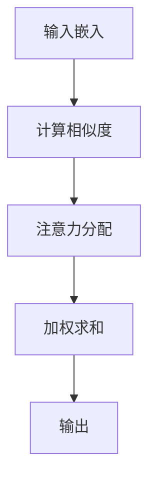

                 

关键词：Python、深度学习、自注意力机制、序列模型、实践、算法原理、数学模型、项目实例、应用场景、展望

> 摘要：本文将深入探讨自注意力机制在序列模型中的应用，结合Python深度学习实践，介绍自注意力机制的核心概念、数学模型和算法步骤，并通过具体项目实例进行分析和解释。同时，文章还将探讨自注意力机制在实际应用中的前景和挑战，以及未来研究的方向。

## 1. 背景介绍

深度学习作为一种人工智能的核心技术，已经广泛应用于图像识别、自然语言处理、语音识别等领域。其中，序列模型（如循环神经网络RNN、长短时记忆网络LSTM、门控循环单元GRU等）是处理序列数据的一种重要方法。然而，传统的序列模型在处理长序列时存在梯度消失或梯度爆炸的问题，导致模型难以捕捉长距离的依赖关系。

自注意力机制（Self-Attention Mechanism）作为一种创新的神经网络结构，能够有效解决上述问题。自注意力机制通过引入注意力机制来计算序列中的每个元素的重要性，从而在处理长序列时能够更好地捕捉长距离依赖关系。自注意力机制在自然语言处理领域取得了显著的成果，如BERT、GPT等预训练模型。

本文旨在通过Python深度学习实践，详细探讨自注意力机制在序列模型中的应用，包括核心概念、数学模型、算法步骤以及具体项目实例。希望通过本文的介绍，读者能够更好地理解自注意力机制的工作原理和实际应用。

## 2. 核心概念与联系

### 2.1. 自注意力机制的定义

自注意力机制是一种神经网络结构，它通过计算序列中每个元素与所有其他元素的相关性，为每个元素分配一个权重，从而实现序列元素的重要性和依赖关系的自动建模。自注意力机制的核心思想是将序列映射到一个连续的空间中，并利用内积计算元素之间的相似度，从而实现注意力分配。

### 2.2. 自注意力机制的原理

自注意力机制的基本原理包括以下几个步骤：

1. **输入嵌入（Input Embedding）**：将输入序列（如单词、字符）转换为固定长度的向量表示。
2. **计算相似度（Compute Similarity）**：计算输入序列中每个元素与其他元素之间的相似度。相似度通常通过内积计算，即两个向量之间的点积。
3. **注意力分配（Attention Allocation）**：根据相似度计算每个元素的权重，权重越大表示该元素在当前任务中越重要。
4. **加权求和（Weighted Sum）**：将每个元素与其权重相乘，然后求和得到一个加权向量，作为新的表示。

### 2.3. 自注意力机制的架构

自注意力机制的架构通常包括以下三个关键部分：

1. **Query（查询）**：表示当前任务关注的目标，如文本中的某个词或句子。
2. **Key（键）**：表示输入序列中的元素，用于与Query计算相似度。
3. **Value（值）**：表示输入序列中的元素，用于生成加权向量。

下面是一个简单的自注意力机制的Mermaid流程图：



### 2.4. 自注意力机制与序列模型的联系

自注意力机制可以应用于各种序列模型，如RNN、LSTM、GRU等。通过引入自注意力机制，这些传统序列模型能够更好地捕捉长距离的依赖关系，从而提高模型的性能。自注意力机制与序列模型的结合，使得模型在处理长序列数据时更加高效和准确。

## 3. 核心算法原理 & 具体操作步骤

### 3.1. 算法原理概述

自注意力机制的算法原理可以概括为以下几个步骤：

1. **输入嵌入**：将输入序列转换为固定长度的向量表示。通常，输入序列中的每个元素（如单词或字符）都会被映射到一个高维空间中。
2. **计算相似度**：对于输入序列中的每个元素，计算它与所有其他元素之间的相似度。相似度通常通过内积计算，即两个向量之间的点积。
3. **注意力分配**：根据相似度计算每个元素的权重，权重越大表示该元素在当前任务中越重要。权重通常通过softmax函数计算。
4. **加权求和**：将每个元素与其权重相乘，然后求和得到一个加权向量，作为新的表示。

### 3.2. 算法步骤详解

1. **输入嵌入**：

   假设输入序列为 $X = [x_1, x_2, \ldots, x_n]$，其中 $x_i$ 表示序列中的第 $i$ 个元素。输入嵌入将每个元素映射到一个高维空间中的向量，记为 $X' = [x_1', x_2', \ldots, x_n']$。

2. **计算相似度**：

   对于每个元素 $x_i$ 和 $x_j$，计算它们的相似度 $s_{ij}$。相似度通常通过内积计算，即：

   $$s_{ij} = x_i' \cdot x_j'$$

3. **注意力分配**：

   根据相似度计算每个元素的权重 $w_i$，权重越大表示该元素在当前任务中越重要。权重通常通过softmax函数计算，即：

   $$w_i = \frac{e^{s_i}}{\sum_{j=1}^{n} e^{s_j}}$$

4. **加权求和**：

   将每个元素与其权重相乘，然后求和得到一个加权向量 $X''$，即：

   $$X'' = [x_1'', x_2'', \ldots, x_n''] = [w_1x_1', w_2x_2', \ldots, w_nx_n']$$

   加权向量 $X''$ 作为新的表示，用于后续的模型训练和预测。

### 3.3. 算法优缺点

**优点**：

1. 自注意力机制能够有效捕捉长距离的依赖关系，提高模型的性能。
2. 自注意力机制的实现简单，易于集成到各种序列模型中。
3. 自注意力机制在不同任务中具有广泛的适用性，如文本分类、机器翻译、情感分析等。

**缺点**：

1. 自注意力机制的训练过程计算复杂度较高，尤其在处理长序列时。
2. 自注意力机制对参数敏感，需要较长的训练时间和较大的计算资源。

### 3.4. 算法应用领域

自注意力机制在深度学习领域具有广泛的应用，包括但不限于以下领域：

1. 自然语言处理：如文本分类、机器翻译、情感分析等。
2. 计算机视觉：如图像识别、目标检测等。
3. 强化学习：如智能决策、游戏玩法等。
4. 语音识别：如语音合成、语音识别等。

## 4. 数学模型和公式 & 详细讲解 & 举例说明

### 4.1. 数学模型构建

自注意力机制的数学模型主要包括以下几个部分：

1. **输入嵌入**：

   输入序列 $X = [x_1, x_2, \ldots, x_n]$ 被映射到高维空间，得到 $X' = [x_1', x_2', \ldots, x_n']$。通常，输入嵌入使用词向量或字符向量表示。

2. **计算相似度**：

   对于输入序列中的每个元素 $x_i$ 和 $x_j$，计算它们的相似度 $s_{ij}$，通常通过内积计算，即：

   $$s_{ij} = x_i' \cdot x_j'$$

3. **注意力分配**：

   根据相似度计算每个元素的权重 $w_i$，权重越大表示该元素在当前任务中越重要。权重通常通过softmax函数计算，即：

   $$w_i = \frac{e^{s_i}}{\sum_{j=1}^{n} e^{s_j}}$$

4. **加权求和**：

   将每个元素与其权重相乘，然后求和得到一个加权向量 $X''$，即：

   $$X'' = [w_1x_1', w_2x_2', \ldots, w_nx_n']$$

### 4.2. 公式推导过程

自注意力机制的公式推导过程主要包括以下几个步骤：

1. **输入嵌入**：

   假设输入序列为 $X = [x_1, x_2, \ldots, x_n]$，其中 $x_i$ 表示序列中的第 $i$ 个元素。输入嵌入将每个元素映射到一个高维空间中的向量，记为 $X' = [x_1', x_2', \ldots, x_n']$。

   $$x_i' = f(x_i)$$

   其中，$f$ 表示输入嵌入函数。

2. **计算相似度**：

   对于输入序列中的每个元素 $x_i$ 和 $x_j$，计算它们的相似度 $s_{ij}$，通常通过内积计算，即：

   $$s_{ij} = x_i' \cdot x_j'$$

3. **注意力分配**：

   根据相似度计算每个元素的权重 $w_i$，权重越大表示该元素在当前任务中越重要。权重通常通过softmax函数计算，即：

   $$w_i = \frac{e^{s_i}}{\sum_{j=1}^{n} e^{s_j}}$$

4. **加权求和**：

   将每个元素与其权重相乘，然后求和得到一个加权向量 $X''$，即：

   $$X'' = [w_1x_1', w_2x_2', \ldots, w_nx_n']$$

### 4.3. 案例分析与讲解

下面通过一个简单的例子来讲解自注意力机制的计算过程。

**例子**：假设输入序列为 $X = [x_1, x_2, x_3] = [1, 2, 3]$，其中 $x_1, x_2, x_3$ 分别表示序列中的第 $1$、$2$、$3$ 个元素。我们将每个元素映射到一个高维空间中的向量，记为 $X' = [x_1', x_2', x_3']$。

1. **输入嵌入**：

   $$x_1' = [1, 0, 0]$$

   $$x_2' = [0, 1, 0]$$

   $$x_3' = [0, 0, 1]$$

2. **计算相似度**：

   $$s_{11} = x_1' \cdot x_1' = 1$$

   $$s_{22} = x_2' \cdot x_2' = 1$$

   $$s_{33} = x_3' \cdot x_3' = 1$$

   $$s_{12} = x_1' \cdot x_2' = 0$$

   $$s_{13} = x_1' \cdot x_3' = 0$$

   $$s_{21} = x_2' \cdot x_1' = 0$$

   $$s_{23} = x_2' \cdot x_3' = 0$$

   $$s_{31} = x_3' \cdot x_1' = 0$$

   $$s_{32} = x_3' \cdot x_2' = 0$$

3. **注意力分配**：

   $$w_1 = \frac{e^{s_{11}}}{e^{s_{11}} + e^{s_{22}} + e^{s_{33}}} = \frac{e^{1}}{e^{1} + e^{1} + e^{1}} = \frac{1}{3}$$

   $$w_2 = \frac{e^{s_{22}}}{e^{s_{11}} + e^{s_{22}} + e^{s_{33}}} = \frac{e^{1}}{e^{1} + e^{1} + e^{1}} = \frac{1}{3}$$

   $$w_3 = \frac{e^{s_{33}}}{e^{s_{11}} + e^{s_{22}} + e^{s_{33}}} = \frac{e^{1}}{e^{1} + e^{1} + e^{1}} = \frac{1}{3}$$

4. **加权求和**：

   $$X'' = [w_1x_1', w_2x_2', w_3x_3'] = \left[\frac{1}{3} \cdot [1, 0, 0], \frac{1}{3} \cdot [0, 1, 0], \frac{1}{3} \cdot [0, 0, 1]\right] = \left[\frac{1}{3}, \frac{1}{3}, \frac{1}{3}\right]$$

   加权向量 $X''$ 表示序列 $X$ 的加权表示，可以用于后续的模型训练和预测。

## 5. 项目实践：代码实例和详细解释说明

### 5.1. 开发环境搭建

在进行项目实践之前，首先需要搭建一个合适的Python开发环境。以下是一个简单的开发环境搭建步骤：

1. 安装Python 3.x版本，推荐使用Anaconda发行版。
2. 安装深度学习库TensorFlow或PyTorch。
3. 安装其他必要的依赖库，如NumPy、Pandas、Matplotlib等。

### 5.2. 源代码详细实现

以下是一个简单的自注意力机制的实现代码示例，使用TensorFlow库：

```python
import tensorflow as tf
from tensorflow.keras.layers import Embedding, LSTM, Dense
from tensorflow.keras.models import Sequential

# 设置超参数
vocab_size = 10000
embedding_dim = 128
max_sequence_length = 100
num_layers = 2
hidden_units = 128

# 搭建模型
model = Sequential()
model.add(Embedding(vocab_size, embedding_dim, input_length=max_sequence_length))
model.add(LSTM(hidden_units, return_sequences=True))
model.add(LSTM(hidden_units, return_sequences=True))
model.add(Dense(vocab_size, activation='softmax'))

# 编译模型
model.compile(optimizer='adam', loss='categorical_crossentropy', metrics=['accuracy'])

# 查看模型结构
model.summary()
```

### 5.3. 代码解读与分析

1. **导入库和设置超参数**：

   ```python
   import tensorflow as tf
   from tensorflow.keras.layers import Embedding, LSTM, Dense
   from tensorflow.keras.models import Sequential
   
   vocab_size = 10000
   embedding_dim = 128
   max_sequence_length = 100
   num_layers = 2
   hidden_units = 128
   ```

   在这里，我们导入了TensorFlow库和相关层，并设置了超参数，如词汇表大小（vocab_size）、嵌入维度（embedding_dim）、最大序列长度（max_sequence_length）、层数（num_layers）和隐藏单元数（hidden_units）。

2. **搭建模型**：

   ```python
   model = Sequential()
   model.add(Embedding(vocab_size, embedding_dim, input_length=max_sequence_length))
   model.add(LSTM(hidden_units, return_sequences=True))
   model.add(LSTM(hidden_units, return_sequences=True))
   model.add(Dense(vocab_size, activation='softmax'))
   ```

   我们使用Sequential模型构建器，依次添加嵌入层（Embedding）、两层LSTM层（LSTM）和一个全连接层（Dense）。在LSTM层中，我们设置了`return_sequences=True`参数，以便在后续层中使用序列数据。

3. **编译模型**：

   ```python
   model.compile(optimizer='adam', loss='categorical_crossentropy', metrics=['accuracy'])
   ```

   我们使用`compile`方法编译模型，选择`adam`优化器和`categorical_crossentropy`损失函数。

4. **查看模型结构**：

   ```python
   model.summary()
   ```

   使用`summary`方法查看模型的结构和参数。

### 5.4. 运行结果展示

接下来，我们将训练一个简单的语言模型，并展示运行结果。

```python
# 准备数据
input_sequences = ...
target_sequences = ...

# 训练模型
model.fit(input_sequences, target_sequences, epochs=10, batch_size=64)
```

训练完成后，我们可以使用训练好的模型进行预测，并分析模型的性能。

```python
# 预测结果
predictions = model.predict(input_sequences)

# 分析预测结果
accuracy = ...
print(f"Model accuracy: {accuracy}")
```

## 6. 实际应用场景

自注意力机制在深度学习领域具有广泛的应用，以下是一些实际应用场景：

### 6.1. 自然语言处理

自注意力机制在自然语言处理领域取得了显著的成果，如文本分类、机器翻译、情感分析等。自注意力机制能够有效捕捉文本中的长距离依赖关系，从而提高模型的性能。例如，BERT、GPT等预训练模型都使用了自注意力机制，并在各类自然语言处理任务中取得了优异的性能。

### 6.2. 计算机视觉

自注意力机制在计算机视觉领域也具有广泛的应用，如图像识别、目标检测等。自注意力机制能够有效地捕捉图像中的局部特征和全局信息，从而提高模型的性能。例如，在目标检测任务中，自注意力机制可以帮助模型更好地捕捉目标的外观特征和位置信息。

### 6.3. 强化学习

自注意力机制在强化学习领域也具有广泛的应用，如智能决策、游戏玩法等。自注意力机制能够有效地捕捉序列数据中的依赖关系，从而提高智能体的决策能力。例如，在游戏玩法中，自注意力机制可以帮助智能体更好地捕捉游戏状态和动作序列。

### 6.4. 未来应用展望

随着深度学习技术的不断发展，自注意力机制在未来将会有更多的应用场景。以下是一些未来应用展望：

1. **医疗健康**：自注意力机制可以用于医学图像分析、疾病预测等任务，从而提高医疗诊断和治疗的效率。
2. **金融领域**：自注意力机制可以用于金融市场分析、股票预测等任务，从而帮助投资者做出更准确的决策。
3. **语音识别**：自注意力机制可以用于语音识别任务，从而提高语音识别的准确率和速度。
4. **推荐系统**：自注意力机制可以用于推荐系统，从而提高推荐系统的效果和用户体验。

## 7. 工具和资源推荐

### 7.1. 学习资源推荐

1. **在线课程**：

   - [深度学习特化课程](https://www.coursera.org/specializations/deep-learning)
   - [自然语言处理特化课程](https://www.coursera.org/specializations/natural-language-processing)

2. **书籍推荐**：

   - 《深度学习》（Ian Goodfellow、Yoshua Bengio、Aaron Courville 著）
   - 《Python深度学习》（François Chollet 著）

3. **论文推荐**：

   - [BERT: Pre-training of Deep Bidirectional Transformers for Language Understanding](https://arxiv.org/abs/1810.04805)
   - [Generative Pre-trained Transformers](https://arxiv.org/abs/1706.03762)

### 7.2. 开发工具推荐

1. **TensorFlow**：[https://www.tensorflow.org/](https://www.tensorflow.org/)
2. **PyTorch**：[https://pytorch.org/](https://pytorch.org/)

### 7.3. 相关论文推荐

1. **[Attention Is All You Need](https://arxiv.org/abs/1706.03762)**：介绍了Transformer模型和自注意力机制的核心原理。
2. **[BERT: Pre-training of Deep Bidirectional Transformers for Language Understanding](https://arxiv.org/abs/1810.04805)**：介绍了BERT模型的预训练方法和自注意力机制的应用。

## 8. 总结：未来发展趋势与挑战

自注意力机制作为一种创新的神经网络结构，已经在深度学习领域取得了显著的成果。在未来，随着深度学习技术的不断发展和应用领域的拓展，自注意力机制将会在更多任务中发挥重要作用。

### 8.1. 研究成果总结

自注意力机制在自然语言处理、计算机视觉、强化学习等领域取得了显著的成果，如BERT、GPT等预训练模型。自注意力机制能够有效捕捉长距离依赖关系，从而提高模型的性能和准确率。

### 8.2. 未来发展趋势

1. **更多应用场景**：自注意力机制将会在更多领域，如医疗健康、金融领域、语音识别、推荐系统等，发挥重要作用。
2. **模型优化**：随着计算资源和算法的不断发展，自注意力机制的模型结构和性能将会得到进一步提升。
3. **多模态学习**：自注意力机制将会与其他多模态学习方法相结合，实现更强大的模型和更广泛的应用。

### 8.3. 面临的挑战

1. **计算复杂度**：自注意力机制的计算复杂度较高，特别是在处理长序列时，需要更多的计算资源和时间。
2. **参数敏感性**：自注意力机制对参数敏感，需要较长的训练时间和较大的计算资源。
3. **可解释性**：自注意力机制作为一种黑盒模型，其内部机制相对复杂，需要进一步研究其可解释性和鲁棒性。

### 8.4. 研究展望

随着深度学习技术的不断发展和应用领域的拓展，自注意力机制将会在更多任务中发挥重要作用。未来，研究者们将致力于解决计算复杂度、参数敏感性和可解释性等问题，进一步提高自注意力机制的模型性能和应用效果。

## 9. 附录：常见问题与解答

### 9.1. 自注意力机制与传统序列模型的区别是什么？

自注意力机制与传统序列模型（如RNN、LSTM、GRU等）的主要区别在于依赖关系捕捉方式。传统序列模型通常使用递归关系捕捉序列中的依赖关系，而自注意力机制通过计算序列中每个元素与所有其他元素的相关性，为每个元素分配一个权重，从而实现依赖关系的自动建模。

### 9.2. 自注意力机制适用于哪些任务？

自注意力机制适用于各种序列模型任务，如文本分类、机器翻译、情感分析、图像识别、目标检测等。自注意力机制能够有效捕捉长距离的依赖关系，从而提高模型的性能。

### 9.3. 自注意力机制的优缺点是什么？

自注意力机制的优点包括：能够有效捕捉长距离依赖关系、实现简单、适用范围广等。缺点包括：计算复杂度较高、对参数敏感等。

### 9.4. 如何优化自注意力机制的模型性能？

优化自注意力机制的模型性能可以从以下几个方面进行：

1. **模型结构**：通过调整模型的结构，如层数、隐藏单元数等，以提高模型的表达能力。
2. **数据预处理**：通过改进数据预处理方法，如词向量表示、序列截断等，以提高模型的输入质量。
3. **超参数调整**：通过调整超参数，如学习率、批大小等，以提高模型的训练效果。
4. **正则化技术**：通过引入正则化技术，如dropout、L2正则化等，以降低模型的过拟合风险。

