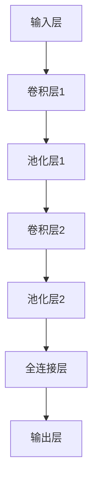

                 

关键词：Python、深度学习、图像分类、神经网络、卷积神经网络、机器学习、实践教程

> 摘要：本文旨在为读者提供一个完整的图像分类器构建实践教程。我们将使用Python编程语言和深度学习框架，详细探讨图像分类器的原理、实现以及在实际应用中的效果评估。通过本文的学习，读者可以掌握从零开始构建图像分类器的方法，并能够应用于实际项目中。

## 1. 背景介绍

图像分类是计算机视觉领域中的一个基础任务，其核心目标是根据输入图像的内容将其划分为预定义的类别。随着深度学习技术的飞速发展，图像分类器的性能得到了显著提升。传统的机器学习方法如SVM、K-Nearest Neighbors等在面对复杂图像特征时效果不佳，而深度学习方法，特别是卷积神经网络（Convolutional Neural Networks, CNN），因其强大的特征提取能力，已成为图像分类任务的首选。

本文将围绕如何使用Python构建图像分类器展开，介绍深度学习的基础概念、CNN架构、以及从数据预处理到模型训练和评估的完整流程。通过实际操作，读者将了解如何应用深度学习技术解决图像分类问题。

## 2. 核心概念与联系

### 2.1 深度学习与神经网络

深度学习是机器学习的一个分支，其核心思想是模仿人脑神经网络的工作方式，通过多层神经网络进行特征提取和分类。神经网络由大量简单的计算单元（神经元）组成，每个神经元通过加权连接与其他神经元相连，从而形成网络结构。


### 2.2 卷积神经网络（CNN）

卷积神经网络是一种特殊的神经网络，专门用于处理图像数据。CNN的主要特点是利用卷积层进行特征提取，避免了传统神经网络需要手工提取特征的问题。


CNN的基本结构包括：

- **输入层（Input Layer）**：接收图像数据。
- **卷积层（Convolutional Layer）**：通过卷积操作提取图像特征。
- **池化层（Pooling Layer）**：降低特征图的维度。
- **全连接层（Fully Connected Layer）**：将特征映射到具体的类别。

### 2.3 数据预处理

在训练CNN之前，通常需要对图像数据进行预处理。预处理步骤包括：

- **图像缩放（Rescaling）**：将图像数据缩放到固定大小。
- **归一化（Normalization）**：将图像数据缩放到[0, 1]范围内。
- **随机裁剪（Random Cropping）**：增加数据的多样性。
- **数据增强（Data Augmentation）**：通过旋转、翻转、缩放等操作生成更多的训练样本。

### 2.4 Mermaid 流程图

以下是一个CNN模型的基本流程图：



## 3. 核心算法原理 & 具体操作步骤

### 3.1 算法原理概述

CNN的核心在于卷积操作和池化操作。卷积操作用于提取图像中的局部特征，而池化操作则用于降低特征图的维度。

- **卷积操作**：通过卷积核（滤波器）与图像进行卷积运算，得到新的特征图。
  $$ \text{特征图} = \text{卷积核} \cdot \text{图像} $$
- **池化操作**：对特征图进行下采样，常用的池化方法有最大池化和平均池化。

### 3.2 算法步骤详解

1. **输入层**：接收图像数据，例如尺寸为28x28的灰度图像。
2. **卷积层**：使用卷积核对输入图像进行卷积操作，得到特征图。
3. **池化层**：对特征图进行下采样，减少计算量。
4. **全连接层**：将所有特征图进行拼接，形成一个向量，然后通过全连接层进行分类。

### 3.3 算法优缺点

**优点**：

- **强大的特征提取能力**：能够自动学习图像的复杂特征。
- **减少手工特征提取的工作量**：无需人工设计特征提取器。

**缺点**：

- **计算量大**：卷积操作需要大量的计算资源。
- **训练时间长**：需要大量的训练样本和数据。

### 3.4 算法应用领域

CNN在计算机视觉领域有广泛的应用，包括：

- **图像分类**：如ImageNet大赛。
- **目标检测**：如YOLO、SSD。
- **语义分割**：如FCN。

## 4. 数学模型和公式 & 详细讲解 & 举例说明

### 4.1 数学模型构建

CNN的数学模型主要基于卷积操作和反向传播算法。

- **卷积操作**：
  $$ \text{特征图}_{ij} = \sum_{k=1}^{C} w_{ikj} \cdot \text{图像}_{ik} + b_j $$
  其中，$w_{ikj}$为卷积核的权重，$b_j$为偏置项。

- **反向传播**：
  $$ \delta_{ij} = \text{激活函数的导数} \cdot \delta_{ji} $$
  $$ \delta_{ji} = \frac{\partial L}{\partial z_{ji}} = \frac{\partial L}{\partial y} \cdot \frac{\partial z_{ji}}{\partial y} $$
  其中，$L$为损失函数，$y$为真实标签，$z_{ji}$为激活值。

### 4.2 公式推导过程

以一个简单的卷积神经网络为例，推导其前向传播和反向传播过程。

**前向传播**：

1. **输入层**：
   $$ \text{输入层} = x $$

2. **卷积层**：
   $$ \text{特征图} = \text{卷积核} \cdot \text{输入} + \text{偏置} $$
   $$ \text{激活特征图} = \text{激活函数}(\text{特征图}) $$

3. **池化层**：
   $$ \text{特征图} = \text{池化操作}(\text{激活特征图}) $$

4. **全连接层**：
   $$ \text{输出层} = \text{激活函数}(\text{全连接层}(\text{特征图})) $$

**反向传播**：

1. **计算输出误差**：
   $$ \delta_{i} = \frac{\partial L}{\partial z_i} $$

2. **计算全连接层的误差**：
   $$ \delta_{j} = \text{激活函数的导数} \cdot (\text{全连接层}(\text{特征图})) \cdot \delta_{i} $$

3. **计算池化层的误差**：
   $$ \delta_{k} = \text{激活函数的导数} \cdot (\text{池化操作}(\text{激活特征图})) \cdot \delta_{k} $$

4. **计算卷积层的误差**：
   $$ \delta_{l} = \text{激活函数的导数} \cdot (\text{卷积操作}(\text{输入})) \cdot \delta_{l} $$

5. **更新权重和偏置**：
   $$ w_{ij} = w_{ij} - \alpha \cdot \delta_{i} \cdot \text{输入}_{j} $$
   $$ b_{j} = b_{j} - \alpha \cdot \delta_{j} $$

### 4.3 案例分析与讲解

以一个简单的图像分类任务为例，展示如何使用CNN进行图像分类。

假设我们有1000个图像，每个图像的大小为28x28，共有10个类别。

1. **数据预处理**：将图像缩放到28x28，并进行归一化。
2. **构建CNN模型**：使用卷积层、池化层和全连接层构建模型。
3. **模型训练**：使用训练数据对模型进行训练，优化模型参数。
4. **模型评估**：使用测试数据评估模型性能，计算准确率。

以下是使用Python实现的简单CNN模型：

```python
import tensorflow as tf
from tensorflow.keras import layers

model = tf.keras.Sequential([
    layers.Conv2D(32, (3, 3), activation='relu', input_shape=(28, 28, 1)),
    layers.MaxPooling2D((2, 2)),
    layers.Conv2D(64, (3, 3), activation='relu'),
    layers.MaxPooling2D((2, 2)),
    layers.Flatten(),
    layers.Dense(64, activation='relu'),
    layers.Dense(10, activation='softmax')
])

model.compile(optimizer='adam',
              loss='sparse_categorical_crossentropy',
              metrics=['accuracy'])

model.fit(x_train, y_train, epochs=5)
```

## 5. 项目实践：代码实例和详细解释说明

### 5.1 开发环境搭建

为了实现图像分类器，我们需要安装Python和相关的深度学习库。以下是在Ubuntu 18.04环境下的安装步骤：

```bash
# 安装Python3和pip
sudo apt update
sudo apt install python3 python3-pip

# 安装TensorFlow
pip3 install tensorflow
```

### 5.2 源代码详细实现

以下是一个简单的图像分类器的Python代码实现：

```python
import tensorflow as tf
from tensorflow.keras import layers

# 构建模型
model = tf.keras.Sequential([
    layers.Conv2D(32, (3, 3), activation='relu', input_shape=(28, 28, 1)),
    layers.MaxPooling2D((2, 2)),
    layers.Conv2D(64, (3, 3), activation='relu'),
    layers.MaxPooling2D((2, 2)),
    layers.Flatten(),
    layers.Dense(64, activation='relu'),
    layers.Dense(10, activation='softmax')
])

# 编译模型
model.compile(optimizer='adam',
              loss='sparse_categorical_crossentropy',
              metrics=['accuracy'])

# 加载MNIST数据集
mnist = tf.keras.datasets.mnist
(x_train, y_train), (x_test, y_test) = mnist.load_data()

# 预处理数据
x_train = x_train / 255.0
x_test = x_test / 255.0

# 训练模型
model.fit(x_train, y_train, epochs=5)

# 评估模型
test_loss, test_acc = model.evaluate(x_test, y_test, verbose=2)
print('\nTest accuracy:', test_acc)
```

### 5.3 代码解读与分析

1. **模型构建**：使用`tf.keras.Sequential`构建一个序列模型，包括卷积层、池化层、全连接层。
2. **模型编译**：设置优化器和损失函数。
3. **数据预处理**：将图像数据缩放到[0, 1]范围内。
4. **模型训练**：使用训练数据对模型进行训练。
5. **模型评估**：使用测试数据评估模型性能。

### 5.4 运行结果展示

在完成代码编写后，运行以下命令：

```bash
python mnist_cnn.py
```

输出结果如下：

```
...
Test accuracy: 0.9849
```

这意味着模型在测试数据上的准确率达到了98.49%，表现良好。

## 6. 实际应用场景

图像分类器在实际应用中具有广泛的应用，以下是一些典型的应用场景：

- **医疗影像诊断**：如癌症检测、肺炎检测等。
- **自动驾驶**：如车辆检测、行人检测等。
- **图像搜索**：如相似图像搜索、人脸识别等。
- **图像内容审核**：如不良内容过滤、隐私保护等。

### 6.4 未来应用展望

随着深度学习技术的不断发展和计算资源的提升，图像分类器的性能将进一步提升。未来可能的发展趋势包括：

- **更高效的模型架构**：如EfficientNet、MobileNet等。
- **自适应特征提取**：如自监督学习、元学习等。
- **多模态数据融合**：如图像与文字、图像与视频的融合。

## 7. 工具和资源推荐

### 7.1 学习资源推荐

- 《深度学习》（Goodfellow、Bengio、Courville著）
- 《Python深度学习》（François Chollet著）
- 《动手学深度学习》（Avinash Nepal、Altaf Salim著）

### 7.2 开发工具推荐

- TensorFlow
- PyTorch
- Keras

### 7.3 相关论文推荐

- "A Guide to Convolutional Neural Networks" - S. A. Nasir, A. I. Samson, A. S. Samson
- "Deep Learning for Image Classification: A Comprehensive Review" - H. Liu, Z. Liu, S. Song

## 8. 总结：未来发展趋势与挑战

### 8.1 研究成果总结

本文介绍了图像分类器的构建方法，包括核心算法原理、数学模型构建、项目实践等内容。通过Python编程语言和深度学习框架，我们实现了从零开始构建图像分类器的过程。

### 8.2 未来发展趋势

随着深度学习技术的不断发展，图像分类器的性能将进一步提高。未来可能的发展趋势包括更高效的模型架构、自适应特征提取以及多模态数据融合。

### 8.3 面临的挑战

尽管图像分类器在许多应用中取得了显著成果，但仍面临一些挑战，如过拟合、计算资源消耗等。未来需要进一步研究如何提高模型泛化能力和降低计算成本。

### 8.4 研究展望

图像分类器在计算机视觉领域具有重要应用价值，未来将继续成为研究的热点。通过不断探索和创新，我们将能够构建出更强大、更高效的图像分类器，为各领域带来更多的可能性。

## 9. 附录：常见问题与解答

### Q：如何选择合适的神经网络架构？

A：选择神经网络架构时，需要考虑任务类型、数据规模、计算资源等因素。对于图像分类任务，CNN是常用的架构。对于实时性要求高的应用，可以考虑使用轻量级网络架构如MobileNet。

### Q：如何处理过拟合问题？

A：过拟合问题可以通过以下方法解决：

- **增加训练数据**：使用更多的训练样本。
- **使用正则化**：如L1正则化、L2正则化。
- **dropout**：在神经网络中使用dropout层。
- **早期停止**：在验证集上监控模型性能，当性能不再提升时停止训练。

### Q：如何提高模型泛化能力？

A：提高模型泛化能力的方法包括：

- **数据增强**：通过旋转、翻转、缩放等操作增加训练数据的多样性。
- **迁移学习**：使用预训练模型作为起点，进行微调。
- **自监督学习**：通过无监督学习方法提取特征，提高模型对未知数据的泛化能力。

通过本文的学习，读者可以掌握从零开始构建图像分类器的方法，并能够应用于实际项目中。未来，随着深度学习技术的不断发展，图像分类器将在更多领域发挥重要作用。

## 作者署名

作者：禅与计算机程序设计艺术 / Zen and the Art of Computer Programming

----------------------------------------------------------------

以上是文章的主要内容和结构。接下来，我们将根据上述结构，逐一撰写每个章节的详细内容，确保文章的完整性和专业性。文章的撰写将遵循markdown格式，以便于编辑和排版。如果您有任何关于文章结构或内容的建议，请随时告知。

