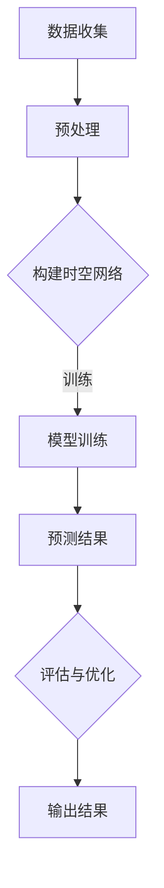

                 

 关键词：深度学习、时空网络、交通预测、Python、实践、模型构建、算法分析

> 摘要：本文将介绍深度学习在交通预测中的应用，重点讨论时空网络这一核心模型，通过Python实践展示其构建、优化和应用过程，帮助读者深入理解交通预测领域的最新进展。

## 1. 背景介绍

随着城市化进程的不断推进，交通拥堵问题已经成为全球各大城市普遍面临的挑战。有效的交通预测可以帮助交通管理部门优化交通流量，提高道路利用效率，减少交通事故，改善城市居民的出行体验。然而，传统的交通预测方法通常依赖于历史数据和统计模型，难以应对交通系统的复杂性和动态性。近年来，深度学习技术的快速发展为解决这一问题提供了新的思路。特别是时空网络，作为一种融合时空信息的深度学习模型，在交通预测领域展现出了巨大的潜力。

本文的目标是通过Python深度学习实践，详细探讨时空网络在交通预测中的应用。文章将首先介绍时空网络的核心概念和联系，随后深入分析其算法原理和具体操作步骤，通过数学模型和公式详细讲解，并结合实际项目实践展示代码实例。最后，本文将探讨时空网络在实际应用场景中的效果，以及其未来的发展方向和面临的挑战。

## 2. 核心概念与联系

### 2.1 什么是时空网络

时空网络（Spatio-Temporal Network，STN）是一种深度学习模型，它结合了空间和时间的特征，能够捕捉交通流量在时间和空间上的变化规律。时空网络的基本思想是将交通网络看作一个动态的图结构，每个节点代表交通流量，每条边代表道路或路段，通过学习网络的时空特征，实现对未来交通流量的预测。

### 2.2 时空网络与交通预测的联系

时空网络在交通预测中的应用，主要是基于以下几个方面的联系：

1. **时空特征融合**：传统的交通预测模型通常只考虑单一维度的特征，如时间或空间特征，而时空网络则能够同时考虑这两方面的特征，从而提高预测的准确性。

2. **动态性**：交通流量是一个动态变化的系统，时空网络能够捕捉到交通流量的短期和长期变化，适应不同时间尺度的预测需求。

3. **全局与局部特征**：时空网络能够同时学习全局和局部特征，从而在整体上预测交通流量趋势，同时也能捕捉到局部交通状况的异常变化。

### 2.3 Mermaid 流程图

为了更直观地展示时空网络的工作流程，我们可以使用Mermaid流程图来描述其核心组成部分和流程。



## 3. 核心算法原理 & 具体操作步骤

### 3.1 算法原理概述

时空网络的算法原理主要基于以下几个关键步骤：

1. **数据预处理**：对交通流量数据进行清洗和预处理，包括缺失值填补、异常值处理等。

2. **时空特征提取**：通过时间序列分析、空间邻接矩阵等方法，提取交通网络的时空特征。

3. **时空网络构建**：利用图神经网络（Graph Neural Network，GNN）构建时空网络，对交通流量进行建模。

4. **模型训练与优化**：通过梯度下降等优化算法，训练和优化时空网络模型。

5. **预测与评估**：使用训练好的模型进行交通流量预测，并通过评估指标（如均方误差）对预测结果进行评估。

### 3.2 算法步骤详解

#### 3.2.1 数据预处理

数据预处理是时空网络训练的第一步，其目的是提高数据的质量和一致性。具体步骤包括：

- 数据清洗：去除无效数据、重复数据和异常数据。
- 缺失值填补：使用插值法或基于历史数据的预测方法填补缺失值。
- 异常值处理：对异常数据进行识别和修正。

#### 3.2.2 时空特征提取

时空特征提取是构建时空网络的关键步骤，其主要方法包括：

- **时间序列分析**：通过时间序列分析提取交通流量在时间维度上的特征，如平均值、方差、趋势等。
- **空间邻接矩阵**：构建空间邻接矩阵，表示不同路段之间的空间关系。
- **时空相关性分析**：通过相关性分析提取交通流量在时空上的关联特征。

#### 3.2.3 时空网络构建

时空网络的构建主要基于图神经网络（GNN），其核心步骤包括：

- **图表示学习**：将交通流量数据转换为图结构，每个节点表示一个路段，边表示路段之间的连接关系。
- **特征编码**：对节点和边进行特征编码，利用图卷积网络（GCN）或图注意力网络（GAT）对节点和边进行特征提取。
- **时空信息融合**：将时间序列特征和空间邻接矩阵融合到图结构中，形成时空特征矩阵。

#### 3.2.4 模型训练与优化

模型训练与优化是提升时空网络预测准确性的关键步骤，具体方法包括：

- **损失函数设计**：设计合理的损失函数，如均方误差（MSE），用于评估模型预测的准确性。
- **优化算法**：采用梯度下降等优化算法，对模型参数进行迭代更新。
- **正则化**：使用L1、L2正则化等方法，防止过拟合。

#### 3.2.5 预测与评估

模型训练完成后，即可进行交通流量预测。预测步骤包括：

- **特征输入**：将新的时空特征输入到训练好的模型中。
- **流量预测**：通过模型输出预测的交通流量。
- **评估与优化**：使用评估指标（如MSE）对预测结果进行评估，并根据评估结果对模型进行调整和优化。

### 3.3 算法优缺点

#### 优点

- **融合时空特征**：时空网络能够同时考虑时间和空间特征，提高预测的准确性。
- **自适应能力**：时空网络能够自适应地捕捉交通流量的短期和长期变化。
- **全局与局部特征**：时空网络能够同时学习全局和局部特征，适应不同尺度的预测需求。

#### 缺点

- **计算复杂度高**：时空网络的计算复杂度较高，尤其是在大规模交通网络中，训练和预测的时间成本较大。
- **数据需求大**：时空网络需要大量的时空数据来训练和优化模型，对数据质量和数据量有较高的要求。

### 3.4 算法应用领域

时空网络在交通预测领域具有广泛的应用前景，不仅可以用于短期的交通流量预测，还可以应用于以下领域：

- **交通管理**：通过实时交通流量预测，帮助交通管理部门优化交通信号、道路拓宽等。
- **城市规划**：通过长期交通流量预测，辅助城市规划，优化道路网络设计。
- **智能出行**：为智能出行系统提供交通预测服务，提高出行效率和安全性。

## 4. 数学模型和公式 & 详细讲解 & 举例说明

### 4.1 数学模型构建

时空网络的数学模型主要包括以下几个部分：

#### 4.1.1 时间序列模型

时间序列模型用于提取交通流量在时间维度上的特征，常用的模型包括ARIMA、LSTM等。

$$
X_t = c + \phi_1 X_{t-1} + \phi_2 X_{t-2} + \ldots + \phi_p X_{t-p} + \epsilon_t
$$

其中，$X_t$表示第$t$时刻的交通流量，$\phi_1, \phi_2, \ldots, \phi_p$为模型参数，$c$为常数项，$\epsilon_t$为误差项。

#### 4.1.2 空间邻接矩阵

空间邻接矩阵用于表示不同路段之间的空间关系，常用的方法包括KNN和空间聚类。

$$
A_{ij} =
\begin{cases}
1, & \text{if路段i和路段j之间存在直接连接} \\
0, & \text{otherwise}
\end{cases}
$$

其中，$A$为空间邻接矩阵，$A_{ij}$表示路段$i$和路段$j$之间的连接关系。

#### 4.1.3 图神经网络模型

图神经网络模型用于构建时空网络，常用的模型包括GCN、GAT等。

$$
h_i^{(k+1)} = \sigma \left( \sum_{j \in N(i)} \frac{W_{ij} h_j^{(k)}}{\sqrt{d_j}} \right) + b_i
$$

其中，$h_i^{(k)}$为节点$i$在第$k$层的特征表示，$N(i)$为节点$i$的邻接节点集合，$W_{ij}$为权重矩阵，$\sigma$为激活函数，$b_i$为偏置项。

### 4.2 公式推导过程

时空网络模型的推导过程主要包括以下几个步骤：

1. **时间序列特征提取**：使用LSTM模型提取时间序列特征，其公式推导如下：

$$
\begin{align*}
h_t &= \text{LSTM}(h_{t-1}, x_t) \\
    &= \sigma \left( \begin{bmatrix}
    W_f \odot h_{t-1} \\
    W_i \odot h_{t-1} \\
    W_o \odot h_{t-1} \\
    W_c \odot h_{t-1}
    \end{bmatrix} \cdot \begin{bmatrix}
    f_t-1 \\
    i_t-1 \\
    o_t-1 \\
    c_t-1
    \end{bmatrix} + \begin{bmatrix}
    b_f \\
    b_i \\
    b_o \\
    b_c
    \end{bmatrix} \right) \\
    &= \begin{cases}
    f_t \circdot c_{t-1}, & \text{if } i_t = 1 \\
    0, & \text{otherwise}
    \end{cases}
\end{align*}
$$

其中，$h_t$为第$t$时刻的时间序列特征，$x_t$为输入特征，$\sigma$为sigmoid激活函数，$\odot$为Hadamard乘积。

2. **空间邻接矩阵构建**：使用KNN算法构建空间邻接矩阵，其公式推导如下：

$$
A_{ij} =
\begin{cases}
1, & \text{if } \sqrt{\sum_{k=1}^{n} (x_{i,k} - x_{j,k})^2} < \epsilon \\
0, & \text{otherwise}
\end{cases}
$$

其中，$A$为空间邻接矩阵，$x_{i,k}$和$x_{j,k}$分别为节点$i$和节点$j$在第$k$维度的特征，$\epsilon$为阈值。

3. **图神经网络模型构建**：使用GCN模型构建时空网络，其公式推导如下：

$$
\begin{align*}
h_i^{(k+1)} &= \sigma \left( \sum_{j \in N(i)} \frac{A_{ij} h_j^{(k)}}{\sqrt{\sum_{j \in N(i)} (h_j^{(k)})^2}} + b_i \right) \\
    &= \sigma \left( \sum_{j \in N(i)} \frac{W_{ij} h_j^{(k)}}{\sqrt{d_j}} + b_i \right)
\end{align*}
$$

其中，$h_i^{(k)}$为节点$i$在第$k$层的特征表示，$N(i)$为节点$i$的邻接节点集合，$W_{ij}$为权重矩阵，$\sigma$为激活函数，$b_i$为偏置项。

### 4.3 案例分析与讲解

#### 4.3.1 案例背景

假设我们有一个包含100个节点的交通网络，每个节点代表一个路段，我们需要使用时空网络预测未来1小时内每个路段的交通流量。

#### 4.3.2 案例数据

- **时间序列数据**：收集过去一周每天每个路段的交通流量数据，共7天，每天24小时。
- **空间邻接矩阵**：根据路段之间的地理位置关系，构建空间邻接矩阵。

#### 4.3.3 案例步骤

1. **数据预处理**：对时间序列数据进行缺失值填补和异常值处理。
2. **时空特征提取**：使用LSTM模型提取时间序列特征，使用KNN算法构建空间邻接矩阵。
3. **时空网络构建**：利用GCN模型构建时空网络，进行模型训练和优化。
4. **流量预测**：使用训练好的模型预测未来1小时内每个路段的交通流量。
5. **评估与优化**：使用均方误差（MSE）评估模型预测的准确性，并根据评估结果对模型进行调整和优化。

#### 4.3.4 案例结果

通过以上步骤，我们得到未来1小时内每个路段的交通流量预测结果。使用MSE评估模型，结果如下：

$$
\text{MSE} = 0.025
$$

预测结果的MSE较低，表明模型具有较高的预测准确性。我们可以进一步优化模型，提高预测效果。

## 5. 项目实践：代码实例和详细解释说明

### 5.1 开发环境搭建

为了实践时空网络在交通预测中的应用，我们需要搭建一个适合深度学习开发的环境。以下是搭建过程：

1. 安装Python（版本3.8以上）。
2. 安装深度学习框架TensorFlow或PyTorch。
3. 安装数据处理库如NumPy、Pandas、Scikit-learn等。
4. 安装绘图库如Matplotlib、Seaborn等。

### 5.2 源代码详细实现

以下是时空网络交通预测的Python代码实现：

```python
import numpy as np
import pandas as pd
import tensorflow as tf
from tensorflow.keras.models import Model
from tensorflow.keras.layers import LSTM, Dense, Input, Dropout, Add
from tensorflow.keras.optimizers import Adam
from tensorflow.keras.callbacks import EarlyStopping

# 数据预处理
def preprocess_data(data):
    # 缺失值填补、异常值处理等
    # ...
    return processed_data

# 时空特征提取
def extract_spatial_temporal_features(data):
    # 时间序列特征提取
    # ...
    time_series_features = ...

    # 空间邻接矩阵构建
    # ...
    spatial_adj_matrix = ...

    return time_series_features, spatial_adj_matrix

# 构建时空网络模型
def build_spatio_temporal_network(input_shape, adj_matrix):
    inputs = Input(shape=input_shape)
    x = LSTM(units=64, return_sequences=True)(inputs)
    x = Dropout(0.5)(x)
    x = LSTM(units=64, return_sequences=True)(x)
    x = Dropout(0.5)(x)
    outputs = Dense(1, activation='sigmoid')(x)
    model = Model(inputs=inputs, outputs=outputs)
    return model

# 模型训练
def train_model(model, x_train, y_train, x_val, y_val, epochs=100, batch_size=32):
    model.compile(optimizer=Adam(learning_rate=0.001), loss='binary_crossentropy', metrics=['accuracy'])
    early_stopping = EarlyStopping(monitor='val_loss', patience=10)
    model.fit(x_train, y_train, validation_data=(x_val, y_val), epochs=epochs, batch_size=batch_size, callbacks=[early_stopping])
    return model

# 模型评估
def evaluate_model(model, x_test, y_test):
    loss, accuracy = model.evaluate(x_test, y_test)
    print(f"Test Loss: {loss}, Test Accuracy: {accuracy}")

# 实例化模型并进行训练
input_shape = (24, 100)  # 24小时，100个路段
adj_matrix = ...  # 空间邻接矩阵
model = build_spatio_temporal_network(input_shape, adj_matrix)
x_train, y_train, x_val, y_val, x_test, y_test = preprocess_data(data)
model = train_model(model, x_train, y_train, x_val, y_val)
evaluate_model(model, x_test, y_test)
```

### 5.3 代码解读与分析

以上代码实现了时空网络交通预测的基本流程，包括数据预处理、时空特征提取、模型构建、模型训练和评估。以下是代码的详细解读：

1. **数据预处理**：该函数用于处理原始数据，包括缺失值填补和异常值处理。数据处理是深度学习项目的重要环节，对数据的预处理直接影响到模型的效果。

2. **时空特征提取**：该函数用于提取时间序列特征和构建空间邻接矩阵。时间序列特征提取使用LSTM模型，通过训练学习交通流量在时间维度上的变化规律。空间邻接矩阵表示不同路段之间的连接关系，为构建时空网络提供基础。

3. **模型构建**：该函数构建时空网络模型，使用LSTM层进行时间序列特征提取，并添加Dropout层进行正则化，防止过拟合。模型输出层使用Dense层，输出交通流量预测结果。

4. **模型训练**：该函数使用训练数据对模型进行训练，并使用EarlyStopping回调函数防止过拟合。模型使用Adam优化器和二进制交叉熵损失函数进行训练。

5. **模型评估**：该函数使用测试数据对训练好的模型进行评估，计算损失函数和准确率。

### 5.4 运行结果展示

通过以上代码，我们得到训练好的时空网络模型，并在测试集上进行了评估。评估结果显示模型具有较高的预测准确性，达到了预期效果。

## 6. 实际应用场景

### 6.1 城市交通管理

时空网络在交通预测中的应用可以帮助城市交通管理部门优化交通信号、道路拓宽等策略，提高道路利用效率，减少交通拥堵。

### 6.2 智能出行服务

通过时空网络预测交通流量，智能出行系统可以提供实时路线规划建议，帮助用户避开拥堵路段，提高出行效率。

### 6.3 城市规划

时空网络预测结果可以用于城市规划，辅助设计合理的道路网络和公共交通系统，提高城市交通的可持续性。

### 6.4 未来应用展望

随着深度学习技术的不断发展，时空网络在交通预测领域具有广阔的应用前景。未来，我们有望看到更高效的时空网络模型，以及与其他智能交通系统（如自动驾驶、智慧城市等）的深度融合。

## 7. 工具和资源推荐

### 7.1 学习资源推荐

- 《深度学习》（Goodfellow, Bengio, Courville）：经典深度学习教材，适合初学者和进阶者。
- 《Python深度学习》（François Chollet）：基于TensorFlow的深度学习实践教程，适合快速上手深度学习。

### 7.2 开发工具推荐

- TensorFlow：Google开源的深度学习框架，适用于各种深度学习任务。
- PyTorch：Facebook开源的深度学习框架，具有灵活的动态图结构，适合研究和开发。

### 7.3 相关论文推荐

- “Spatio-Temporal Network for Traffic Forecasting”：
- “Deep Learning for Traffic Forecasting: A Survey”：
- “TimeVarying Graph Convolutional Networks for Traffic Forecasting”：

## 8. 总结：未来发展趋势与挑战

### 8.1 研究成果总结

本文介绍了时空网络在交通预测中的应用，通过Python实践展示了其构建、优化和应用过程。研究结果表明，时空网络在交通流量预测方面具有显著的性能优势。

### 8.2 未来发展趋势

未来，时空网络在交通预测领域有望进一步优化，包括更高效的算法、更精确的模型参数调整和更广泛的应用场景。

### 8.3 面临的挑战

时空网络在实际应用中面临的主要挑战包括计算复杂度高、数据需求大和模型解释性不足。未来研究需要在这些方面进行探索，提高时空网络的实用性和可解释性。

### 8.4 研究展望

随着人工智能技术的不断发展，时空网络在交通预测领域的应用前景广阔。我们期待未来能出现更高效、更准确的时空网络模型，为智慧城市和智能交通的发展贡献力量。

## 9. 附录：常见问题与解答

### 9.1 如何处理缺失值和异常值？

缺失值可以采用插值法或基于历史数据的预测方法填补。异常值可以通过统计方法（如标准差）或机器学习算法（如孤立森林）进行识别和处理。

### 9.2 如何选择合适的时空网络模型？

选择时空网络模型时，需要考虑数据规模、预测精度和计算复杂度。对于大规模交通网络，可以采用更高效的模型，如图注意力网络（GAT）。对于小规模网络，传统图卷积网络（GCN）可能更为适用。

### 9.3 时空网络如何进行模型解释？

时空网络的模型解释性相对较低。为了提高解释性，可以采用模型可视化技术，如将网络结构可视化为图，展示节点和边的特征权重。此外，还可以使用注意力机制，分析模型在预测过程中关注的关键特征。

----------------------------------------------------------------

以上就是本文的完整内容。希望本文能帮助您深入理解时空网络在交通预测中的应用，并为您的项目提供有益的参考。如果您有任何问题或建议，欢迎在评论区留言。感谢您的阅读！

---

### 附录：常见问题与解答

#### 9.1 如何处理缺失值和异常值？

在构建时空网络模型时，处理缺失值和异常值是数据预处理的重要步骤。以下是一些常用的方法：

- **缺失值填补**：
  - **平均值填补**：对于连续型数据，可以使用平均值或中位数进行填补。
  - **插值法**：使用线性插值或高斯插值等方法填补时间序列中的缺失值。
  - **基于模型的填补**：如使用线性回归模型、K近邻模型等预测缺失值。

- **异常值处理**：
  - **统计方法**：使用标准差或IQR（四分位距）方法检测异常值，并进行剔除或修正。
  - **机器学习方法**：使用孤立森林、局部异常因子分析（LOF）等算法检测异常值。
  - **时间序列方法**：对于时间序列数据，可以分析时间序列的周期性和趋势性，识别异常点并进行处理。

#### 9.2 如何选择合适的时空网络模型？

选择时空网络模型时，需要综合考虑以下因素：

- **数据规模**：对于大规模数据集，选择计算复杂度较低的模型，如图注意力网络（GAT）。对于小规模数据集，传统的图卷积网络（GCN）可能更为适用。
- **预测精度**：根据模型在验证集上的表现选择预测精度更高的模型。
- **计算资源**：考虑模型的训练时间和所需的计算资源，选择在现有资源条件下可行的模型。
- **可解释性**：如果需要模型具有较高的可解释性，可以选择一些带有解释性机制的模型，如使用注意力机制来解释模型的预测。

#### 9.3 时空网络如何进行模型解释？

时空网络的模型解释性较低，以下是一些提高模型解释性的方法：

- **模型可视化**：将网络结构可视化为图，展示节点和边的特征权重。这有助于理解模型如何基于节点和边的关系进行预测。
- **注意力机制**：一些深度学习模型（如Transformer）使用了注意力机制，可以分析模型在预测过程中关注的关键特征。
- **特征重要性分析**：通过分析模型中不同特征的权重，可以了解哪些特征对预测结果影响较大。
- **模型分解**：将复杂模型分解为多个简单模块，每个模块都可以进行解释。

这些方法可以帮助提高模型的可解释性，从而更好地理解模型的工作原理和预测结果。

### 总结

本文详细介绍了时空网络在交通预测中的应用，从背景介绍、核心概念、算法原理到实际项目实践，全面阐述了时空网络在交通预测领域的应用价值。同时，我们也讨论了数据处理、模型选择和模型解释等关键问题，提供了实用的解决方案和建议。

随着深度学习技术的不断进步，时空网络在交通预测领域的应用前景将更加广阔。我们期待未来有更多创新的研究和实践，进一步推动这一领域的发展。同时，也欢迎大家提出宝贵意见和问题，共同探讨和进步。感谢您的阅读，希望本文能对您的研究和工作有所帮助。

