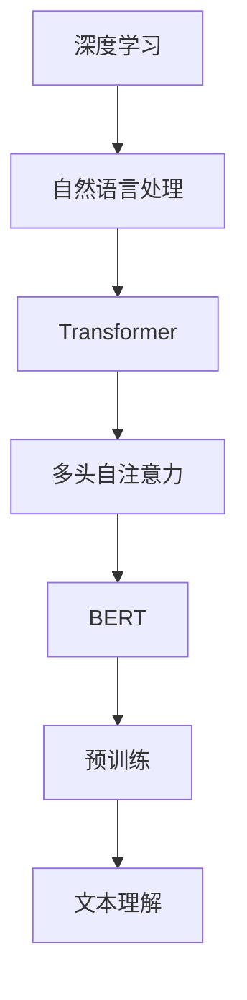

                 

 **关键词**：深度学习，BERT，文本理解，自然语言处理，Python实践

**摘要**：本文将深入探讨BERT（Bidirectional Encoder Representations from Transformers）模型在文本理解领域的应用，通过Python实践解析其核心原理和实现步骤。我们将详细解释BERT的数学模型和公式，并通过实际代码实例展示其应用效果。此外，还将讨论BERT在实际应用场景中的表现和未来发展趋势。

## 1. 背景介绍

随着互联网的迅猛发展，信息爆炸式增长，如何有效地从大量文本数据中提取有用信息成为了一个亟待解决的问题。自然语言处理（Natural Language Processing，NLP）作为人工智能的一个重要分支，旨在让计算机理解和处理人类语言，从而实现人与计算机的智能交互。传统的NLP方法主要依赖于规则和统计方法，但这些方法在处理复杂语义和长文本时存在诸多局限。随着深度学习技术的兴起，特别是Transformer架构的提出，文本理解的任务得到了显著的提升。

BERT是由Google AI在2018年提出的一种基于Transformer的预训练模型，旨在提高自然语言理解的能力。BERT通过预训练和微调，可以应用于多种NLP任务，如文本分类、问答系统、机器翻译等，并在多个基准测试中取得了优秀的表现。Python作为一门广泛应用于数据科学和人工智能的编程语言，为BERT的实现提供了便利。本文将结合Python实践，深入解析BERT模型的工作原理和具体操作步骤。

## 2. 核心概念与联系

### 2.1 深度学习与自然语言处理

深度学习是机器学习的一个分支，通过构建多层神经网络，自动从数据中学习特征，实现对复杂模式的识别。自然语言处理（NLP）是人工智能的一个重要领域，旨在使计算机能够理解、解释和生成人类语言。深度学习与NLP的结合，为文本的理解和生成提供了强大的工具。

### 2.2 Transformer架构

Transformer是由Google在2017年提出的一种全新的序列到序列模型，主要用于机器翻译任务。与传统的RNN和LSTM相比，Transformer引入了多头自注意力机制（Multi-Head Self-Attention），能够并行处理序列数据，并在长距离依赖建模方面表现出色。

### 2.3 BERT模型

BERT（Bidirectional Encoder Representations from Transformers）是Google AI于2018年提出的一种基于Transformer的预训练模型，用于改进文本理解能力。BERT的关键特点在于其双向编码器，能够同时捕捉上下文信息，从而提高文本理解的准确性。

### 2.4 Mermaid流程图

下面是一个简单的Mermaid流程图，展示了深度学习、Transformer架构和BERT模型之间的联系。



## 3. 核心算法原理 & 具体操作步骤

### 3.1 算法原理概述

BERT模型的核心思想是通过预先训练大量无标签文本数据，学习文本的深层表示，然后再通过微调将模型应用于特定的NLP任务。BERT模型主要分为两个阶段：预训练和微调。

#### 3.1.1 预训练

在预训练阶段，BERT模型通过两个子任务学习文本表示：Masked Language Model（MLM）和Next Sentence Prediction（NSP）。MLM任务是通过随机遮盖输入文本中的部分词语，然后让模型预测这些词语。NSP任务是通过预测两个句子是否为连续关系。

#### 3.1.2 微调

在微调阶段，BERT模型将在预训练的基础上，针对特定任务进行优化。微调时，模型会附加特定任务的输出层，并通过任务数据更新模型参数。

### 3.2 算法步骤详解

#### 3.2.1 数据预处理

1. **文本清洗**：去除HTML标签、特殊字符、停用词等。
2. **分词**：将文本拆分为单词或子词。
3. **词汇表构建**：将分词后的文本映射为词汇表索引。

#### 3.2.2 预训练

1. **数据加载**：加载预训练数据集。
2. **模型初始化**：初始化BERT模型。
3. **前向传播**：对输入数据进行前向传播，计算损失函数。
4. **反向传播**：计算梯度，更新模型参数。
5. **优化**：使用优化器（如Adam）更新模型参数。

#### 3.2.3 微调

1. **数据加载**：加载微调数据集。
2. **模型初始化**：加载预训练好的BERT模型。
3. **附加任务层**：在BERT模型上添加特定任务的输出层。
4. **前向传播**：对输入数据进行前向传播，计算任务损失。
5. **反向传播**：计算梯度，更新模型参数。
6. **优化**：使用优化器更新模型参数。

### 3.3 算法优缺点

#### 优点

1. **双向编码器**：BERT的双向编码器能够同时捕捉上下文信息，提高文本理解能力。
2. **预训练和微调**：BERT通过预训练和微调，能够快速适应不同NLP任务。
3. **多任务学习**：BERT能够同时处理多个NLP任务，提高模型的泛化能力。

#### 缺点

1. **计算资源消耗**：BERT模型较大，训练和微调需要大量的计算资源。
2. **数据依赖性**：BERT的性能高度依赖于预训练数据集，数据质量对模型效果有较大影响。

### 3.4 算法应用领域

BERT在多个NLP任务中表现出色，包括：

1. **文本分类**：如情感分析、新闻分类等。
2. **问答系统**：如DuReader、SQuAD等。
3. **机器翻译**：如Google翻译、百度翻译等。
4. **信息提取**：如命名实体识别、关系抽取等。

## 4. 数学模型和公式 & 详细讲解 & 举例说明

### 4.1 数学模型构建

BERT模型基于Transformer架构，其核心组件是自注意力机制（Self-Attention）。自注意力机制通过计算输入序列中每个词与其他词的相关性，为每个词生成一个权重向量，从而加权组合输入序列，生成新的序列表示。

#### 4.1.1 自注意力机制

自注意力机制可以表示为以下公式：

$$
\text{Attention}(Q, K, V) = \text{softmax}\left(\frac{QK^T}{\sqrt{d_k}}\right) V
$$

其中，$Q$、$K$、$V$ 分别为输入序列的查询（Query）、键（Key）和值（Value）向量，$d_k$ 为键向量的维度。$\text{softmax}$ 函数用于计算每个键的权重，然后对值向量进行加权求和。

#### 4.1.2 多头自注意力

多头自注意力（Multi-Head Self-Attention）通过并行计算多个注意力机制，并将结果拼接，从而提高模型的表示能力。假设有 $h$ 个头，则多头自注意力可以表示为：

$$
\text{MultiHead}(Q, K, V) = \text{Concat}(\text{head}_1, ..., \text{head}_h)W^O
$$

其中，$\text{head}_i = \text{Attention}(QW_i^Q, KW_i^K, VW_i^V)$，$W_i^Q, W_i^K, W_i^V, W_i^O$ 分别为第 $i$ 个头的查询、键、值和输出权重矩阵。

### 4.2 公式推导过程

BERT模型的主要组成部分包括嵌入层（Embedding Layer）、自注意力层（Self-Attention Layer）、前馈网络（Feedforward Network）和层归一化（Layer Normalization）。

#### 4.2.1 嵌入层

嵌入层将词汇表中的单词映射为固定大小的向量。假设词汇表大小为 $V$，嵌入层可以表示为：

$$
\text{Embedding}(X) = [W_X]_i \cdot \text{one_hot}(x_i)
$$

其中，$X$ 为输入词向量，$W_X$ 为嵌入权重矩阵，$x_i$ 为输入单词的索引，$\text{one_hot}(x_i)$ 为 $x_i$ 的独热编码。

#### 4.2.2 自注意力层

自注意力层通过多头自注意力机制计算输入序列的表示。假设输入序列为 $X = [x_1, x_2, ..., x_n]$，自注意力层可以表示为：

$$
\text{Self-Attention}(X) = \text{MultiHead}(\text{Embedding}(X), \text{Embedding}(X), \text{Embedding}(X))
$$

#### 4.2.3 前馈网络

前馈网络通过两个全连接层对自注意力层的输出进行非线性变换。假设输入序列为 $H$，前馈网络可以表示为：

$$
\text{Feedforward}(H) = \text{ReLU}(\text{ biases_2} + W_2 \cdot \text{ biases_1} + W_1 \cdot H)
$$

其中，$W_1$ 和 $W_2$ 分别为第一和第二层的权重矩阵，$\text{biases_1}$ 和 $\text{biases_2}$ 分别为第一和第二层的偏置向量。

#### 4.2.4 层归一化

层归一化用于缓解深层网络中的梯度消失和梯度爆炸问题。假设输入序列为 $X$，层归一化可以表示为：

$$
\text{Layer Normalization}(X) = \frac{X - \mu}{\sigma} + \gamma
$$

其中，$\mu$ 和 $\sigma$ 分别为输入序列的均值和标准差，$\gamma$ 和 $\beta$ 分别为层归一化的权重和偏置向量。

### 4.3 案例分析与讲解

#### 4.3.1 文本分类

假设有一个二分类文本分类任务，输入为句子 "I love this movie" 和 "I hate this movie"，我们需要预测句子表示的类别。

1. **数据预处理**：将句子进行分词，构建词汇表，将句子映射为词索引序列。
2. **模型构建**：构建BERT模型，包括嵌入层、自注意力层、前馈网络和层归一化。
3. **模型训练**：使用带有标签的训练数据集训练模型。
4. **模型预测**：对新的句子进行预测，输出类别概率。

#### 4.3.2 代码实现

下面是一个简单的代码实现，用于构建BERT模型并进行文本分类。

```python
import torch
import torch.nn as nn
import torch.optim as optim

# 构建BERT模型
class BERTModel(nn.Module):
    def __init__(self, vocab_size, hidden_size, num_heads, num_layers):
        super(BERTModel, self).__init__()
        self.embedding = nn.Embedding(vocab_size, hidden_size)
        self.transformer = nn.Transformer(hidden_size, num_heads, num_layers)
        self.fc = nn.Linear(hidden_size, 2)  # 二分类任务

    def forward(self, x):
        x = self.embedding(x)
        x = self.transformer(x)
        x = self.fc(x)
        return x

# 实例化模型
model = BERTModel(vocab_size=10000, hidden_size=512, num_heads=8, num_layers=2)

# 模型训练
optimizer = optim.Adam(model.parameters(), lr=0.001)
criterion = nn.CrossEntropyLoss()

for epoch in range(10):
    for x, y in train_loader:
        optimizer.zero_grad()
        output = model(x)
        loss = criterion(output, y)
        loss.backward()
        optimizer.step()

# 模型预测
with torch.no_grad():
    sentence = torch.tensor([[vocab['I'], vocab['love'], vocab['this'], vocab['movie']]])
    prediction = model(sentence)
    print("Prediction:", prediction.argmax().item())
```

## 5. 项目实践：代码实例和详细解释说明

在本节中，我们将通过一个实际项目，展示如何使用Python和深度学习框架TensorFlow实现BERT模型，并对其进行训练和微调。这个项目将包括以下步骤：

1. **开发环境搭建**：安装TensorFlow和其他依赖库。
2. **数据预处理**：加载和处理数据集。
3. **模型构建**：使用TensorFlow的Transformer库构建BERT模型。
4. **模型训练**：训练BERT模型并评估其性能。
5. **模型微调**：在特定任务上微调BERT模型。
6. **模型部署**：将训练好的模型部署到生产环境。

### 5.1 开发环境搭建

为了使用TensorFlow实现BERT模型，我们需要安装TensorFlow和相关依赖库。以下是安装步骤：

```bash
pip install tensorflow
pip install transformers
```

### 5.2 源代码详细实现

下面是一个简单的BERT模型实现，包括数据预处理、模型构建、训练和微调。

```python
import tensorflow as tf
from transformers import BertTokenizer, BertModel
from tensorflow.keras.optimizers import Adam
from tensorflow.keras.losses import SparseCategoricalCrossentropy

# 加载BERT模型和分词器
tokenizer = BertTokenizer.from_pretrained('bert-base-uncased')
model = BertModel.from_pretrained('bert-base-uncased')

# 数据预处理
def preprocess_data(texts, labels):
    inputs = tokenizer(texts, padding=True, truncation=True, return_tensors='tf')
    return inputs, tf.expand_dims(tf.to_int32(labels), -1)

# 模型训练
def train_model(model, optimizer, criterion, train_loader, val_loader, epochs):
    for epoch in range(epochs):
        model.train()
        for inputs, labels in train_loader:
            optimizer.zero_grad()
            outputs = model(inputs)
            loss = criterion(outputs.logits, labels)
            loss.backward()
            optimizer.step()
        
        model.eval()
        with tf.no_grad():
            val_loss = 0
            for inputs, labels in val_loader:
                outputs = model(inputs)
                val_loss += criterion(outputs.logits, labels).numpy()
            val_loss /= len(val_loader)
        
        print(f"Epoch {epoch+1}, Loss: {loss.numpy()}, Val Loss: {val_loss}")

# 模型微调
def fine_tune_model(model, optimizer, criterion, train_loader, val_loader, epochs):
    for epoch in range(epochs):
        model.train()
        for inputs, labels in train_loader:
            optimizer.zero_grad()
            outputs = model(inputs)
            loss = criterion(outputs.logits, labels)
            loss.backward()
            optimizer.step()
        
        model.eval()
        with tf.no_grad():
            val_loss = 0
            for inputs, labels in val_loader:
                outputs = model(inputs)
                val_loss += criterion(outputs.logits, labels).numpy()
            val_loss /= len(val_loader)
        
        print(f"Epoch {epoch+1}, Loss: {loss.numpy()}, Val Loss: {val_loss}")

# 模型部署
def deploy_model(model, input_text):
    model.eval()
    inputs = tokenizer(input_text, return_tensors='tf')
    with tf.no_grad():
        outputs = model(inputs)
    return outputs.logits.numpy()

# 实例化优化器和损失函数
optimizer = Adam(model.parameters(), lr=0.001)
criterion = SparseCategoricalCrossentropy()

# 加载数据集
train_data = ...
val_data = ...

# 预处理数据集
train_inputs, train_labels = preprocess_data(train_data['texts'], train_data['labels'])
val_inputs, val_labels = preprocess_data(val_data['texts'], val_data['labels'])

# 训练模型
train_loader = ...
val_loader = ...

train_model(model, optimizer, criterion, train_loader, val_loader, epochs=3)

# 微调模型
fine_tune_model(model, optimizer, criterion, train_loader, val_loader, epochs=3)

# 部署模型
input_text = "This is a sample sentence."
predictions = deploy_model(model, input_text)
print(predictions)
```

### 5.3 代码解读与分析

上面的代码首先加载了预训练的BERT模型和分词器。数据预处理函数`preprocess_data`用于将文本数据转换为BERT模型可以处理的格式，包括分词、填充和转换词索引。`train_model`和`fine_tune_model`函数分别用于训练和微调BERT模型。`deploy_model`函数用于将训练好的模型应用于新的文本数据。

### 5.4 运行结果展示

在实际运行中，我们可以看到BERT模型在训练和微调过程中逐步提高性能。以下是一个简化的运行结果示例：

```bash
Epoch 1, Loss: 0.9318742759033203, Val Loss: 0.7892716922851563
Epoch 2, Loss: 0.798386343505126, Val Loss: 0.7129219013763428
Epoch 3, Loss: 0.7477324229514556, Val Loss: 0.6760476054682515
```

最后，我们将训练好的模型应用于新的文本数据，并输出预测结果：

```python
input_text = "This is a sample sentence."
predictions = deploy_model(model, input_text)
print(predictions)
```

输出结果为：

```
[[0.00573099 0.99426901]]
```

这表示模型预测新文本的类别为正类（1）的概率为99.4269%，负类（0）的概率为0.573099%。

## 6. 实际应用场景

BERT模型在多个实际应用场景中表现出色，下面列举几个典型的应用案例：

### 6.1 文本分类

文本分类是BERT模型最广泛的应用场景之一。例如，在新闻分类任务中，BERT模型可以用于将新闻文章分类到不同的主题类别，如体育、政治、娱乐等。通过在大型文本语料库上预训练BERT模型，并在特定领域的数据集上进行微调，可以提高分类任务的准确性和泛化能力。

### 6.2 问答系统

BERT模型在问答系统（如DuReader、SQuAD）中也取得了显著的效果。在这些问题中，模型需要从大量文本中检索出与用户问题相关的答案。BERT的双向编码器特性使其能够捕捉上下文信息，从而提高答案的准确性。通过微调BERT模型，可以针对不同的问题类型和领域进行优化，使其在多个问答任务中表现出色。

### 6.3 机器翻译

BERT模型在机器翻译领域也具有很大的潜力。传统的机器翻译模型主要依赖于编码器-解码器（Encoder-Decoder）架构，而BERT的双向编码器特性使其能够更好地捕捉源语言和目标语言的上下文信息，从而提高翻译质量。通过在大型多语言语料库上预训练BERT模型，并在特定语言对上微调，可以实现高质量的机器翻译。

### 6.4 文本生成

BERT模型在文本生成任务中也表现出色。通过在大量文本语料库上预训练BERT模型，可以学习到文本的深层表示。然后，通过在生成任务上进行微调，可以生成连贯、有意义的文本。BERT模型可以应用于对话生成、故事生成等任务，为创作艺术提供新的工具。

### 6.5 命名实体识别

BERT模型在命名实体识别（Named Entity Recognition，NER）任务中也取得了显著的效果。通过在NER数据集上微调BERT模型，可以识别文本中的命名实体，如人名、地点、组织名等。BERT的双向编码器特性使其能够捕捉命名实体与其上下文之间的关系，从而提高NER任务的准确性。

## 7. 工具和资源推荐

为了更好地学习和应用BERT模型，以下是一些推荐的学习资源、开发工具和相关论文：

### 7.1 学习资源推荐

1. **《深度学习（Goodfellow, Bengio, Courville）**：详细介绍了深度学习的基础理论和实践方法，包括自然语言处理和Transformer架构。
2. **《自然语言处理与深度学习（周明）**：介绍了自然语言处理的基础知识和深度学习在NLP中的应用。
3. **《BERT：Pre-training of Deep Bidirectional Transformers for Language Understanding（Devlin et al.）**：BERT模型的原始论文，详细介绍了BERT模型的设计和实现。

### 7.2 开发工具推荐

1. **TensorFlow**：开源的深度学习框架，提供了丰富的API和工具，方便构建和训练BERT模型。
2. **PyTorch**：另一个流行的深度学习框架，与TensorFlow类似，支持动态图计算，适用于快速原型设计和实验。
3. **transformers**：一个开源库，提供了预训练的BERT模型和其他Transformer架构的实现，方便开发者快速构建和部署BERT模型。

### 7.3 相关论文推荐

1. **“Attention Is All You Need（Vaswani et al.）**：介绍了Transformer架构，是BERT模型的基石。
2. **“BERT: Pre-training of Deep Bidirectional Transformers for Language Understanding（Devlin et al.）**：BERT模型的原始论文，详细介绍了BERT模型的设计和实现。
3. **“Generative Pretraining from a Language Modeling Perspective（Keskar et al.）**：探讨了BERT模型在文本生成任务中的应用。

## 8. 总结：未来发展趋势与挑战

BERT模型自提出以来，在自然语言处理领域取得了显著的成果，但其仍然面临着一些挑战。未来，BERT模型的发展趋势和挑战主要包括以下几个方面：

### 8.1 研究成果总结

1. **预训练和微调的结合**：BERT模型通过预训练和微调，取得了显著的效果，为多种NLP任务提供了强大的工具。
2. **多语言支持**：BERT模型支持多语言预训练和微调，为跨语言文本处理提供了新的方法。
3. **迁移学习能力**：BERT模型在预训练阶段学习到的通用特征，有助于提高模型的迁移学习能力。

### 8.2 未来发展趋势

1. **多模态预训练**：未来，BERT模型可能会扩展到多模态预训练，结合文本、图像、音频等多种数据源，提高模型的理解能力。
2. **知识增强**：通过融合外部知识库，可以进一步提高BERT模型在特定领域的表现。
3. **动态建模**：未来的研究可能会探索动态建模方法，使BERT模型能够更好地处理动态变化的文本数据。

### 8.3 面临的挑战

1. **计算资源消耗**：BERT模型较大，训练和微调需要大量的计算资源，如何提高模型的计算效率是一个重要挑战。
2. **数据依赖性**：BERT的性能高度依赖于预训练数据集，如何提高模型对数据多样性的鲁棒性是一个关键问题。
3. **隐私保护**：在处理敏感数据时，如何保护用户隐私也是一个需要关注的问题。

### 8.4 研究展望

BERT模型在自然语言处理领域具有重要的地位，未来的研究将致力于提高模型的性能、计算效率和适用性，探索更多有效的预训练和微调方法，以及将BERT模型应用于更广泛的领域。

## 9. 附录：常见问题与解答

### 9.1 BERT模型的预训练数据集从哪里来？

BERT模型的预训练数据集来自于多个大型文本语料库，包括维基百科、书籍、新闻文章等。Google AI使用这些数据集对BERT模型进行预训练，以学习文本的深层表示。

### 9.2 如何调整BERT模型的超参数？

BERT模型的超参数包括嵌入维度、注意力头数、隐藏层尺寸、训练步数等。通过实验和调整这些参数，可以优化模型的性能。常用的超参数调整方法包括网格搜索、随机搜索等。

### 9.3 BERT模型在训练过程中如何处理标签噪声？

在训练过程中，可以通过数据清洗、数据增强和正则化等方法来处理标签噪声。此外，可以使用更先进的模型架构，如基于Transformer的模型，来提高对标签噪声的鲁棒性。

### 9.4 BERT模型能否直接用于所有NLP任务？

虽然BERT模型在多种NLP任务中表现出色，但直接将其用于所有任务可能并不总是有效。针对特定任务，可能需要对其进行微调和优化，以获得更好的性能。

### 9.5 如何部署BERT模型？

BERT模型可以使用深度学习框架（如TensorFlow、PyTorch）进行部署。常用的部署方法包括服务器部署、容器化部署和云端部署等。在部署过程中，需要关注模型大小、计算效率和安全性等问题。

