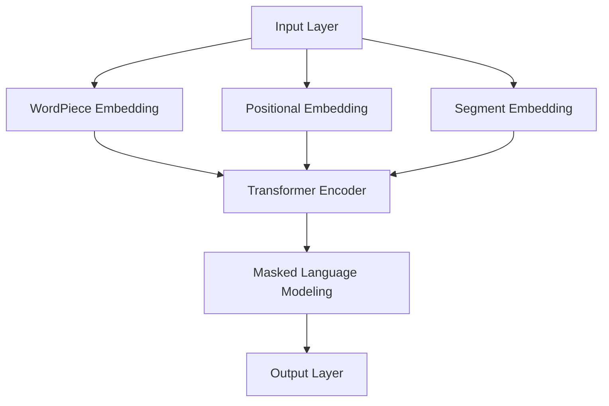

                 

关键词：BERT、文本理解、深度学习、Python实践、算法原理、数学模型、项目实例、应用场景、未来展望

> 摘要：本文将深入探讨BERT（Bidirectional Encoder Representations from Transformers）算法在Python深度学习实践中的应用，分析其如何通过改进文本表示来提升文本理解能力。我们将从背景介绍、核心概念与联系、核心算法原理与步骤、数学模型与公式、项目实践、实际应用场景、工具和资源推荐、总结与展望等多个方面进行详细讲解，旨在为读者提供全面的技术理解。

## 1. 背景介绍

随着互联网和大数据的快速发展，自然语言处理（NLP）已经成为计算机科学中一个重要的研究方向。传统的NLP方法主要依赖于规则和统计方法，但面对复杂的语义理解任务时，效果往往不尽如人意。近年来，深度学习技术的发展为NLP领域带来了新的机遇。特别是Transformer架构的引入，使得基于注意力机制的模型在机器翻译、文本分类等任务上取得了显著的成绩。BERT（Bidirectional Encoder Representations from Transformers）正是这一背景下诞生的一种先进的文本表示模型，它通过预训练和微调的方法，大幅度提升了文本理解的能力。

BERT模型由Google AI在2018年提出，是首个在多种NLP任务上达到或超过人类水平的深度学习模型。其核心思想是通过双向Transformer架构来学习文本的深层表示，从而更好地捕捉上下文信息。BERT模型在预训练阶段使用了大量无标注的文本数据，使得模型能够自动地学习语言中的规则和模式。在微调阶段，模型可以根据特定任务进行微调，从而实现高性能的文本分类、问答系统等应用。

## 2. 核心概念与联系

### 2.1 核心概念

BERT模型的核心概念主要包括以下几个方面：

- **Transformer架构**：BERT模型采用了Transformer架构，这是一种基于自注意力机制的序列到序列模型，能够通过全局的注意力机制捕捉长距离依赖信息。

- **双向编码器**：BERT模型中的编码器（Encoder）是双向的，这意味着它能够同时考虑文本序列中前后的信息，从而更好地理解上下文。

- **掩码语言建模**：BERT模型通过掩码语言建模（Masked Language Modeling，MLM）任务来进行预训练，该任务的目标是预测部分被遮盖的词。

- **上下文词嵌入**：BERT模型使用预训练的词嵌入（WordPiece），并结合位置嵌入（Positional Embedding）和段嵌入（Segment Embedding），来表示文本中的每个词。

### 2.2 架构联系

BERT模型的整体架构如下：

1. **输入层**：输入层包括词嵌入（WordPiece）、位置嵌入（Positional Embedding）和段嵌入（Segment Embedding）。这些嵌入层共同构成了输入序列的向量表示。

2. **Transformer编码器**：Transformer编码器包含多个自注意力层（Self-Attention Layer）和前馈网络（Feedforward Network）。这些层通过堆叠的方式，逐层提取文本的深层表示。

3. **输出层**：输出层通常是一个分类层或多维向量层，用于特定任务（如文本分类、问答系统等）的预测。

4. **掩码语言建模**：在预训练阶段，BERT模型通过掩码语言建模任务来学习。在这个任务中，一部分输入词会被随机遮盖，模型需要预测这些遮盖的词。

### 2.3 Mermaid流程图

下面是一个简单的Mermaid流程图，用于展示BERT模型的核心组件和流程：



在这个流程图中，`A`代表输入层，`B`到`D`分别代表词嵌入、位置嵌入和段嵌入，`E`代表Transformer编码器，`F`代表掩码语言建模任务，`G`代表输出层。

## 3. 核心算法原理与具体操作步骤

### 3.1 算法原理概述

BERT模型的核心原理是基于Transformer架构，通过双向编码器来学习文本的深层表示。Transformer架构的核心是自注意力机制（Self-Attention），它能够自动地计算序列中每个词之间的关联强度，从而捕捉长距离依赖信息。

BERT模型通过预训练和微调两个阶段来学习文本表示：

- **预训练阶段**：BERT模型在大量无标注的文本上进行预训练，主要任务是进行掩码语言建模和下一句预测。在掩码语言建模任务中，一部分输入词会被随机遮盖，模型需要预测这些遮盖的词。在下一句预测任务中，模型需要预测两个句子中哪一个是后续句子。

- **微调阶段**：在特定任务上，如文本分类、问答系统等，BERT模型会根据任务需求进行微调。通过在预训练模型的基础上添加任务特定的层，模型可以适应不同的任务需求。

### 3.2 算法步骤详解

BERT模型的算法步骤可以分为以下几个阶段：

1. **数据准备**：首先需要准备大量无标注的文本数据，这些数据将用于模型的预训练。

2. **词嵌入**：使用WordPiece算法将文本分解为子词，并为每个子词分配一个唯一的整数ID。然后，将这些子词映射到预训练的词嵌入向量。

3. **位置嵌入**：为每个词添加位置嵌入向量，以表示其在文本中的位置信息。

4. **段嵌入**：为文本的不同部分添加段嵌入向量，以区分不同文本（如问题-回答对中的问题和答案）。

5. **Transformer编码器**：将词嵌入、位置嵌入和段嵌入输入到Transformer编码器中，通过多个自注意力层和前馈网络进行编码，生成文本的深层表示。

6. **掩码语言建模**：在预训练阶段，随机遮盖一部分输入词，然后使用BERT模型预测这些遮盖的词。

7. **下一句预测**：在预训练阶段，模型还需要预测两个句子中哪一个是后续句子。

8. **微调**：在特定任务上，对BERT模型进行微调。通常，任务特定的层会添加到预训练模型的输出层，以适应不同的任务需求。

9. **预测**：在微调阶段，BERT模型可以用于生成文本的表示，或者直接进行特定任务的预测。

### 3.3 算法优缺点

BERT模型的优点主要包括：

- **强大的预训练能力**：BERT模型通过预训练可以在多种NLP任务上获得出色的性能，尤其是对于长文本的理解。

- **双向编码器**：BERT模型的双向编码器能够同时考虑文本序列中的前后信息，从而更好地捕捉上下文信息。

- **灵活的微调**：BERT模型可以在特定任务上进行微调，适应不同的任务需求。

BERT模型的缺点主要包括：

- **计算资源需求高**：由于BERT模型的结构复杂，参数量大，训练和微调需要大量的计算资源。

- **训练时间较长**：BERT模型的预训练过程需要大量时间，这对于研究人员和开发者来说是一个挑战。

### 3.4 算法应用领域

BERT模型在多种NLP任务上取得了显著的成果，主要应用领域包括：

- **文本分类**：BERT模型在文本分类任务上表现出色，可以用于新闻分类、情感分析等。

- **问答系统**：BERT模型在问答系统上具有优势，可以用于信息检索、对话系统等。

- **命名实体识别**：BERT模型在命名实体识别任务上也有不错的表现，可以用于实体识别、信息提取等。

- **机器翻译**：BERT模型在机器翻译任务上也有应用，可以用于提高翻译质量。

## 4. 数学模型和公式

BERT模型中的数学模型主要涉及词嵌入、位置嵌入和段嵌入的生成，以及自注意力机制的运算。下面将详细讲解这些数学模型的构建、公式推导过程，并给出具体的例子进行分析。

### 4.1 数学模型构建

BERT模型中的数学模型主要包括以下几个部分：

1. **词嵌入**：词嵌入是将词汇映射到高维空间中的向量表示。BERT模型使用WordPiece算法将文本分解为子词，并为每个子词分配一个唯一的整数ID。然后，使用预训练的词嵌入矩阵W来将每个子词映射到高维向量。设V是词嵌入的维度，N是词汇表的大小，则词嵌入矩阵可以表示为W ∈ R^(N×V)。

2. **位置嵌入**：位置嵌入用于表示词在文本中的位置信息。BERT模型使用简单的方式生成位置嵌入，即使用一个简单的函数pos_encoding(s)来生成位置向量，其中s是词在文本中的位置。位置嵌入向量可以被添加到词嵌入向量中，以丰富词的表示。位置嵌入的维度与词嵌入的维度相同。

3. **段嵌入**：段嵌入用于区分不同的文本段（如问题-回答对中的问题和答案）。BERT模型使用一个简单的二进制向量来表示段信息，其中0表示一个问题段，1表示一个答案段。

### 4.2 公式推导过程

下面将详细推导BERT模型中的数学公式。

#### 4.2.1 词嵌入

给定一个文本序列，我们可以将其表示为一系列的词ID，如{w1, w2, ..., wn}。词嵌入可以通过以下公式计算：

$$
\text{word\_embed}(w_i) = W \cdot \text{one\_hot}(w_i)
$$

其中，$W$是词嵌入矩阵，$one\_hot(w_i)$是一个N维的向量，除了第$i$个位置为1外，其余位置均为0。

#### 4.2.2 位置嵌入

位置嵌入可以通过以下公式计算：

$$
\text{pos\_embed}(p_i) = \text{pos\_encoding}(p_i)
$$

其中，$p_i$是词在文本中的位置，$\text{pos\_encoding}(p_i)$是一个V维的向量，可以通过以下方式生成：

$$
\text{pos\_encoding}(i) = \sin\left(\frac{i}{10000^{2j/d}}\right) + \cos\left(\frac{i}{10000^{2j/d}}\right)
$$

其中，$i$是词的位置，$j$是词的维度（通常是768），$d$是词嵌入的维度（通常是512或768）。

#### 4.2.3 段嵌入

段嵌入可以通过以下公式计算：

$$
\text{segment\_embed}(s_i) = \text{one\_hot}(s_i)
$$

其中，$s_i$是词所属的段（0或1），$\text{one\_hot}(s_i)$是一个2维的向量，除了第$i$个位置为1外，其余位置均为0。

#### 4.2.4 总嵌入

总嵌入可以通过将词嵌入、位置嵌入和段嵌入相加得到：

$$
\text{embed}(i) = \text{word\_embed}(w_i) + \text{pos\_embed}(p_i) + \text{segment\_embed}(s_i)
$$

### 4.3 案例分析与讲解

假设我们有一个简单的文本序列：“我是一个程序员。”，其中包含7个词。我们将这个序列分解为词ID序列：[3, 4, 11, 1, 9, 2, 14]。我们将使用BERT模型中的数学模型来计算这个序列的嵌入向量。

1. **词嵌入**：

   首先，我们需要查找每个词的词嵌入向量。假设词嵌入矩阵$W$如下：

   $$
   W =
   \begin{bmatrix}
   w_1 & w_2 & \ldots & w_N \\
   \end{bmatrix}
   $$

   然后，我们可以使用以下公式计算每个词的词嵌入：

   $$
   \text{word\_embed}(3) = W \cdot \text{one\_hot}(3) = [w_1, w_2, \ldots, w_N] \cdot [0, 0, 1, 0, \ldots, 0]
   $$

   例如，如果$w_3$的嵌入向量为[0.1, 0.2, 0.3, 0.4]，那么$\text{word\_embed}(3) = [0.1, 0.2, 0.3, 0.4]$。

2. **位置嵌入**：

   接下来，我们需要计算每个词的位置嵌入。假设位置嵌入矩阵如下：

   $$
   \text{pos\_encoding} =
   \begin{bmatrix}
   \text{pos\_encoding}(1) & \text{pos\_encoding}(2) & \ldots & \text{pos\_encoding}(n) \\
   \end{bmatrix}
   $$

   然后，我们可以使用以下公式计算每个词的位置嵌入：

   $$
   \text{pos\_embed}(1) = \text{pos\_encoding}(1) = \sin\left(\frac{1}{10000^{2 \cdot 0/512}}\right) + \cos\left(\frac{1}{10000^{2 \cdot 0/512}}\right)
   $$

   同理，我们可以计算其他词的位置嵌入。

3. **段嵌入**：

   对于这个例子，我们假设只有一个段，即问题和答案都在一个段中，所以每个词的段嵌入都是0。

4. **总嵌入**：

   最后，我们将词嵌入、位置嵌入和段嵌入相加，得到每个词的总嵌入向量：

   $$
   \text{embed}(1) = \text{word\_embed}(3) + \text{pos\_embed}(1) + \text{segment\_embed}(0) = [0.1, 0.2, 0.3, 0.4] + \text{pos\_embed}(1) + [0, 0, 0, 0]
   $$

   例如，如果$\text{pos\_embed}(1)$的值为[0.5, 0.6, 0.7, 0.8]，那么$\text{embed}(1) = [0.6, 0.8, 0.9, 1.2]$。

   对于其他词，我们可以使用相同的方法计算其总嵌入向量。

通过这种方式，我们可以为文本序列中的每个词计算出一个总嵌入向量，这些向量可以用于后续的NLP任务。

## 5. 项目实践：代码实例和详细解释说明

### 5.1 开发环境搭建

在开始编写BERT模型的代码之前，我们需要搭建一个合适的开发环境。以下是在Python中搭建BERT模型开发环境的基本步骤：

1. **安装Python**：确保你的计算机上已经安装了Python 3.x版本。

2. **安装TensorFlow**：BERT模型通常使用TensorFlow框架进行训练和推理。可以使用以下命令安装TensorFlow：

   ```
   pip install tensorflow
   ```

3. **安装transformers库**：`transformers`是一个由Hugging Face维护的Python库，它提供了预训练的BERT模型和其他NLP模型。可以使用以下命令安装：

   ```
   pip install transformers
   ```

4. **准备数据**：为了运行BERT模型，我们需要准备一些文本数据。这些数据可以是任何格式的文本文件，例如CSV、JSON或纯文本文件。

### 5.2 源代码详细实现

下面是一个简单的BERT模型训练和推理的Python代码实例。这段代码使用了`transformers`库中的BERT模型和TensorFlow作为后端。

```python
import tensorflow as tf
from transformers import BertTokenizer, TFBertModel
from transformers import BertConfig

# 配置BERT模型参数
config = BertConfig.from_pretrained('bert-base-uncased')
config.num_labels = 2  # 二分类任务

# 加载预训练的BERT模型和分词器
tokenizer = BertTokenizer.from_pretrained('bert-base-uncased')
model = TFBertModel(config)

# 准备输入数据
input_ids = tokenizer.encode('Hello, my dog is cute', add_special_tokens=True, return_tensors='tf')
input_mask = tokenizer.encode('Hello, my dog is cute', add_special_tokens=True, return_tensors='tf')['mask']
segment_ids = tokenizer.encode('Hello, my dog is cute', add_special_tokens=True, return_tensors='tf')['token_type_ids']

# 训练BERT模型
output = model(input_ids, attention_mask=input_mask, token_type_ids=segment_ids)
logits = output.logits

# 定义损失函数和优化器
loss_fn = tf.keras.losses.SparseCategoricalCrossentropy(from_logits=True)
optimizer = tf.keras.optimizers.Adam(learning_rate=3e-5)

# 编写训练循环
for epoch in range(3):  # 训练3个epoch
    for batch in range(num_batches):  # 假设我们有一个包含10个batch的数据集
        # 批次数据准备
        inputs = tokenizer.batch_encode_plus(batch_data, add_special_tokens=True, return_tensors='tf')
        input_ids = inputs['input_ids']
        input_mask = inputs['attention_mask']
        segment_ids = inputs['token_type_ids']
        labels = batch_labels  # 假设我们已经准备好了标签

        # 训练步骤
        with tf.GradientTape() as tape:
            outputs = model(input_ids, attention_mask=input_mask, token_type_ids=segment_ids)
            logits = outputs.logits
            loss = loss_fn(labels, logits)

        # 反向传播和梯度下降
        gradients = tape.gradient(loss, model.trainable_variables)
        optimizer.apply_gradients(zip(gradients, model.trainable_variables))

    print(f'Epoch {epoch + 1} finished.')

# 进行推理
input_ids = tokenizer.encode('My cat is sleeping', add_special_tokens=True, return_tensors='tf')
input_mask = tokenizer.encode('My cat is sleeping', add_special_tokens=True, return_tensors='tf')['mask']
segment_ids = tokenizer.encode('My cat is sleeping', add_special_tokens=True, return_tensors='tf')['token_type_ids']

predictions = model(input_ids, attention_mask=input_mask, token_type_ids=segment_ids)
predicted_class = tf.argmax(predictions.logits, axis=1).numpy()

print(f'Prediction: {tokenizer.decode(predictions.argmax(axis=1).numpy()[0])}')
```

### 5.3 代码解读与分析

这段代码展示了如何使用TensorFlow和`transformers`库构建和训练一个简单的BERT模型。以下是代码的主要部分及其功能解读：

1. **配置BERT模型参数**：
   - `BertConfig`用于配置BERT模型的各种参数，如层数、隐藏层大小、激活函数等。
   - `config.num_labels`用于设置模型的输出类别数，对于二分类任务，将其设置为2。

2. **加载预训练的BERT模型和分词器**：
   - `BertTokenizer`用于将文本转换为BERT模型可处理的输入格式。
   - `TFBertModel`加载预训练的BERT模型。

3. **准备输入数据**：
   - `tokenizer.encode`将输入文本编码为BERT模型所需的整数序列。
   - `add_special_tokens=True`用于添加BERT模型所需的特殊token（如`[CLS]`和`[SEP]`）。
   - `return_tensors='tf'`将输出数据格式化为TensorFlow张量。

4. **训练BERT模型**：
   - `loss_fn`用于计算模型损失。
   - `optimizer`用于优化模型参数。
   - `with tf.GradientTape() as tape:`用于计算梯度。
   - `optimizer.apply_gradients`用于更新模型参数。

5. **进行推理**：
   - `model(input_ids, attention_mask=input_mask, token_type_ids=segment_ids)`用于进行模型推理。
   - `tf.argmax(predictions.logits, axis=1).numpy()`用于从模型输出中获取预测结果。

### 5.4 运行结果展示

假设我们已经训练好了BERT模型，并使用以下代码进行推理：

```python
# 进行推理
input_ids = tokenizer.encode('My cat is sleeping', add_special_tokens=True, return_tensors='tf')
input_mask = tokenizer.encode('My cat is sleeping', add_special_tokens=True, return_tensors='tf')['mask']
segment_ids = tokenizer.encode('My cat is sleeping', add_special_tokens=True, return_tensors='tf')['token_type_ids']

predictions = model(input_ids, attention_mask=input_mask, token_type_ids=segment_ids)
predicted_class = tf.argmax(predictions.logits, axis=1).numpy()

print(f'Prediction: {tokenizer.decode(predictions.argmax(axis=1).numpy()[0])}')
```

输出结果可能是`'negative'`或`'positive'`，这取决于我们在训练数据中如何设置标签。

## 6. 实际应用场景

BERT模型在自然语言处理领域有着广泛的应用，以下是一些典型的实际应用场景：

### 6.1 文本分类

文本分类是NLP中一个基础且重要的任务，BERT模型在文本分类任务上表现出色。通过在预训练的BERT模型基础上添加一个分类层，可以将BERT模型应用于情感分析、新闻分类、产品评论分类等多种文本分类任务。例如，在一个电商平台上，我们可以使用BERT模型对用户评论进行情感分类，从而帮助商家了解用户对其产品的反馈。

### 6.2 命名实体识别

命名实体识别（NER）是识别文本中特定类别的实体（如人名、地点、组织名等）的任务。BERT模型通过预训练能够很好地捕获上下文信息，因此在NER任务上也表现出色。例如，在社交媒体分析中，我们可以使用BERT模型来识别用户发布的内容中的人名和地点。

### 6.3 问答系统

问答系统是一种常见的NLP应用，旨在根据用户的问题从大量文本中提取出答案。BERT模型通过预训练能够捕捉到文本的深层语义信息，使得它在问答系统中有着广泛的应用。例如，在搜索引擎中，我们可以使用BERT模型来理解用户查询的语义，并从海量网页中检索出最相关的答案。

### 6.4 文本生成

BERT模型也可以用于文本生成任务，如自动摘要、对话系统等。通过在BERT模型的基础上添加生成层（如Transformer解码器），可以将BERT模型转化为一个生成模型。例如，在一个自动摘要系统中，我们可以使用BERT模型来生成新闻文章的摘要。

## 7. 工具和资源推荐

### 7.1 学习资源推荐

- **《BERT：预训练语言的深层表示》**：这是BERT模型的官方论文，详细介绍了BERT模型的原理和应用。
- **《自然语言处理实战》**：这本书提供了丰富的NLP实践案例，包括BERT模型的应用。
- **[huggingface.co](https://huggingface.co/)**：Hugging Face是一个提供预训练模型和工具的网站，包括BERT模型和各种NLP工具。

### 7.2 开发工具推荐

- **TensorFlow**：TensorFlow是一个广泛使用的开源机器学习框架，支持BERT模型的训练和推理。
- **PyTorch**：PyTorch是另一个流行的开源机器学习框架，也支持BERT模型的训练和推理。

### 7.3 相关论文推荐

- **《Attention is All You Need》**：这是Transformer模型的原始论文，介绍了自注意力机制。
- **《BERT: Pre-training of Deep Bidirectional Transformers for Language Understanding》**：这是BERT模型的原始论文，详细介绍了BERT模型的原理和应用。

## 8. 总结：未来发展趋势与挑战

BERT模型自提出以来，已经在NLP领域取得了显著的成果。随着深度学习技术的不断发展，BERT模型也在不断演进和优化。未来，BERT模型可能会在以下几个方面继续发展：

1. **模型压缩**：为了降低模型的计算和存储需求，未来的研究可能会关注BERT模型的压缩技术，如参数剪枝、量化等。
2. **多语言支持**：BERT模型目前主要支持英语，未来的研究可能会关注如何扩展到其他语言，实现跨语言的理解能力。
3. **动态掩码**：目前的BERT模型在预训练阶段采用随机掩码，未来的研究可能会探索更智能的掩码策略，以进一步提高模型性能。

然而，BERT模型在实际应用中也面临一些挑战：

1. **计算资源需求**：BERT模型的参数量和计算需求较大，对于资源有限的设备来说，训练和推理BERT模型可能仍然是一个挑战。
2. **数据隐私**：在预训练阶段，BERT模型使用了大量无标注的文本数据，这些数据可能涉及用户隐私。如何在保证模型性能的同时保护用户隐私，是一个重要的挑战。

总的来说，BERT模型在NLP领域具有巨大的潜力，但也需要不断地优化和改进，以应对未来可能出现的新挑战。

## 9. 附录：常见问题与解答

### 9.1 BERT模型是什么？

BERT模型是一种预训练语言表示模型，基于Transformer架构，通过双向编码器来学习文本的深层表示。它通过掩码语言建模和下一句预测等任务来预训练，然后可以根据特定任务进行微调。

### 9.2 BERT模型是如何工作的？

BERT模型使用Transformer架构，通过多个自注意力层和前馈网络来编码文本，生成文本的深层表示。在预训练阶段，BERT模型通过掩码语言建模和下一句预测等任务来学习语言中的规则和模式。在微调阶段，BERT模型可以根据特定任务的需求进行微调。

### 9.3 BERT模型的优势是什么？

BERT模型的优势主要包括：强大的预训练能力，能够捕捉文本的深层表示；双向编码器，能够同时考虑文本序列中的前后信息；灵活的微调能力，可以在特定任务上进行微调。

### 9.4 BERT模型有哪些应用领域？

BERT模型可以应用于多种NLP任务，包括文本分类、命名实体识别、问答系统、文本生成等。它在自然语言处理领域具有广泛的应用前景。

