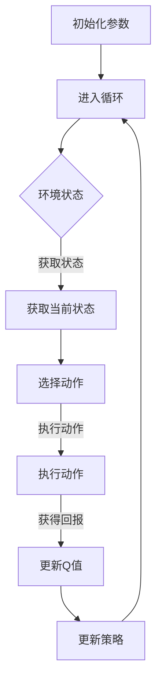

                 

关键词：Q-Learning、强化学习、机器学习、算法原理、代码实例、应用领域

> 摘要：本文将深入探讨Q-Learning算法的原理，通过详细的代码实例讲解，帮助读者更好地理解该算法的运作机制和应用场景。同时，我们将讨论Q-Learning在现实世界中的广泛应用，以及对未来机器学习发展的潜在影响。

## 1. 背景介绍

### 1.1 强化学习的基本概念

强化学习（Reinforcement Learning，RL）是机器学习中的一个分支，主要研究如何通过与环境互动，使得智能体（Agent）能够在未知或部分可观测的环境中实现自我学习，以达到最优行为策略。与监督学习和无监督学习不同，强化学习侧重于奖励机制和策略优化，其核心思想是通过不断试错，逐渐改进智能体的决策过程。

### 1.2 Q-Learning算法的起源与发展

Q-Learning是一种基于值函数的强化学习算法，由理查德·萨顿（Richard Sutton）和安德鲁·巴希迪（Andrew Barto）在1988年的著作《强化学习：一种现代方法》（Reinforcement Learning: An Introduction）中首次提出。Q-Learning的核心思想是通过学习状态-动作值函数（Q-Function），来预测在给定状态下执行某一动作所能获得的长期回报。Q-Learning算法的提出，为解决强化学习问题提供了一种新的思路和方法。

## 2. 核心概念与联系

### 2.1 强化学习框架

在强化学习中，我们通常涉及以下几个核心概念：

- **状态（State）**：描述智能体所处的环境条件。
- **动作（Action）**：智能体能够执行的行为。
- **策略（Policy）**：智能体在给定状态下选择动作的策略。
- **值函数（Value Function）**：用于评估状态或状态-动作对的值。
- **回报（Reward）**：在某一动作后环境对智能体的反馈。

### 2.2 Q-Learning算法框架

Q-Learning算法的核心是学习状态-动作值函数（Q-Function），其定义如下：

$$Q(s, a) = \sum_{s'} P(s' | s, a) \cdot R(s', a) + \gamma \cdot \max_{a'} Q(s', a')$$

其中，$R(s', a)$为智能体在状态$s'$执行动作$a$后获得的回报，$\gamma$为折扣因子，表示对未来回报的期望权重。

### 2.3 Mermaid 流程图

以下是一个简化的Q-Learning算法流程图的Mermaid表示：



## 3. 核心算法原理 & 具体操作步骤

### 3.1 算法原理概述

Q-Learning算法通过不断更新状态-动作值函数，来学习最优策略。其基本原理如下：

1. **初始化**：初始化Q-Function和智能体策略。
2. **循环**：重复以下步骤：
   1. 智能体根据当前策略选择动作。
   2. 执行动作，并获取回报。
   3. 根据回报和Q-Function更新策略和Q-Function。

### 3.2 算法步骤详解

1. **初始化**：
   - 初始化Q-Function：可以使用随机初始化或零初始化。
   - 初始化策略：可以使用随机策略或贪婪策略。

2. **循环**：
   1. 智能体根据当前策略选择动作。
   2. 执行动作，并获取回报。
   3. 更新Q-Function：
      $$Q(s, a) = Q(s, a) + \alpha [r + \gamma \cdot \max_{a'} Q(s', a') - Q(s, a)]$$
      其中，$\alpha$为学习率。
   4. 更新策略：
      - 使用贪婪策略更新策略：选择使Q-Function最大的动作作为下一个动作。
      - 使用ε-贪婪策略更新策略：以概率1-ε随机选择动作，以概率ε选择使Q-Function最大的动作。

### 3.3 算法优缺点

**优点**：

- **适应性**：Q-Learning算法能够适应不同的环境和策略。
- **无模型**：Q-Learning算法不需要完整的环境模型，只需通过经验数据进行学习。
- **灵活性**：可以通过调整学习率和折扣因子等参数，来适应不同的问题。

**缺点**：

- **收敛速度**：Q-Learning算法的收敛速度较慢，尤其是当状态空间和动作空间较大时。
- **样本效率**：Q-Learning算法需要大量的样本数据来学习最优策略。

### 3.4 算法应用领域

Q-Learning算法在多个领域都有广泛应用，主要包括：

- **游戏**：如围棋、国际象棋等。
- **自动驾驶**：用于路径规划和决策。
- **机器人控制**：用于机器人行走、抓取等。
- **资源分配**：如数据中心资源管理、网络流量分配等。

## 4. 数学模型和公式 & 详细讲解 & 举例说明

### 4.1 数学模型构建

Q-Learning算法的核心是学习状态-动作值函数（Q-Function），其定义如下：

$$Q(s, a) = \sum_{s'} P(s' | s, a) \cdot R(s', a) + \gamma \cdot \max_{a'} Q(s', a')$$

其中，$R(s', a)$为智能体在状态$s'$执行动作$a$后获得的回报，$\gamma$为折扣因子，表示对未来回报的期望权重。

### 4.2 公式推导过程

Q-Learning算法的目标是最大化智能体的长期回报，即：

$$J = \sum_{s, a} Q(s, a)$$

为了优化Q-Function，我们可以使用梯度上升法，即：

$$\nabla J = \nabla Q(s, a)$$

通过梯度上升法，我们可以得到Q-Learning的更新公式：

$$Q(s, a) = Q(s, a) + \alpha [r + \gamma \cdot \max_{a'} Q(s', a') - Q(s, a)]$$

其中，$\alpha$为学习率。

### 4.3 案例分析与讲解

假设我们有一个简单的环境，其中只有两个状态$s_1$和$s_2$，以及两个动作$a_1$和$a_2$。以下是Q-Learning算法在该环境中的具体实现：

1. **初始化**：

   - 初始化Q-Function为0。
   - 初始化策略为随机策略。

2. **循环**：

   1. 智能体根据当前策略选择动作：
      $$P(a | s) = \begin{cases} 
      0.5 & \text{if } a = a_1 \text{ or } a = a_2 \\
      0 & \text{otherwise} 
      \end{cases}$$

   2. 执行动作，并获取回报：
      $$R(s', a) = \begin{cases} 
      10 & \text{if } s' = s_1 \text{ and } a = a_1 \\
      -10 & \text{if } s' = s_2 \text{ and } a = a_2 \\
      0 & \text{otherwise} 
      \end{cases}$$

   3. 更新Q-Function：
      $$Q(s, a) = Q(s, a) + \alpha [r + \gamma \cdot \max_{a'} Q(s', a') - Q(s, a)]$$

   4. 更新策略：
      - 使用贪婪策略更新策略：
        $$P(a | s) = \begin{cases} 
        1 & \text{if } Q(s, a) = \max_{a'} Q(s, a') \\
        0 & \text{otherwise} 
        \end{cases}$$

3. **结果**：

   经过多次迭代后，Q-Function将逐渐逼近最优值，智能体也将学会在给定状态下选择最优动作。

## 5. 项目实践：代码实例和详细解释说明

### 5.1 开发环境搭建

在本节中，我们将使用Python编程语言和PyTorch库来实现Q-Learning算法。首先，我们需要安装所需的库：

```bash
pip install torch torchvision numpy matplotlib
```

### 5.2 源代码详细实现

以下是Q-Learning算法的Python实现：

```python
import torch
import numpy as np
import random
import matplotlib.pyplot as plt

# 参数设置
alpha = 0.1
gamma = 0.9
epsilon = 0.1

# 状态空间
states = np.array([[0, 0], [0, 1], [1, 0], [1, 1]])

# 动作空间
actions = np.array([[0, 1], [1, 0]])

# 初始化Q-Function
Q = np.zeros((len(states), len(actions)))

# 模拟环境
def environment(state, action):
    s_new = np.add(state, action)
    if s_new[0] > 1 or s_new[1] > 1:
        s_new = s_new % 2
    reward = 0
    if np.array_equal(s_new, np.array([1, 1])):
        reward = 1
    return s_new, reward

# 选择动作
def choose_action(state):
    if random.random() < epsilon:
        action = random.choice(actions)
    else:
        q_values = Q[state[0], :]
        action = actions[np.argmax(q_values)]
    return action

# 主函数
def main():
    rewards = []
    for episode in range(1000):
        state = random.choice(states)
        total_reward = 0
        while True:
            action = choose_action(state)
            next_state, reward = environment(state, action)
            total_reward += reward
            Q[state[0], action[0]] = Q[state[0], action[0]] + alpha * (reward + gamma * np.max(Q[next_state[0], :]) - Q[state[0], action[0]])
            state = next_state
            if np.array_equal(state, np.array([1, 1])):
                break
        rewards.append(total_reward)
    
    # 绘制结果
    plt.plot(rewards)
    plt.xlabel('Episode')
    plt.ylabel('Total Reward')
    plt.show()

if __name__ == '__main__':
    main()
```

### 5.3 代码解读与分析

- **环境模拟**：使用一个简单的2x2矩阵来表示环境，每个元素代表一个状态。动作空间包括上下左右四个方向。
- **Q-Function初始化**：使用全0矩阵初始化Q-Function。
- **选择动作**：使用ε-贪婪策略来选择动作，以平衡探索和利用。
- **更新Q-Function**：根据回报和下一个状态的Q-Function值来更新当前状态的Q-Function值。
- **绘制结果**：使用matplotlib库来绘制每轮迭代的奖励总和。

## 6. 实际应用场景

### 6.1 游戏应用

Q-Learning算法在游戏领域有广泛应用，如围棋、国际象棋、五子棋等。通过不断学习和调整策略，智能体可以逐渐提高自己的游戏水平。

### 6.2 自动驾驶

自动驾驶汽车需要实时处理大量的传感器数据，并做出快速、准确的决策。Q-Learning算法可以帮助自动驾驶汽车学习最佳行驶路线和避障策略。

### 6.3 机器人控制

机器人控制领域需要处理复杂的动态环境，Q-Learning算法可以帮助机器人学习最优的运动策略，以实现精确的路径规划和运动控制。

### 6.4 资源分配

Q-Learning算法可以用于数据中心资源管理、网络流量分配等场景。通过学习最优分配策略，可以提高资源利用率和系统性能。

## 7. 工具和资源推荐

### 7.1 学习资源推荐

- 《强化学习：一种现代方法》（Reinforcement Learning: An Introduction）
- 《深度强化学习》（Deep Reinforcement Learning）
- 《强化学习实践》（Reinforcement Learning in Action）

### 7.2 开发工具推荐

- PyTorch：用于实现和测试强化学习算法。
- Unity ML-Agents：用于开发基于强化学习的游戏和应用。
- OpenAI Gym：提供多种经典的强化学习环境。

### 7.3 相关论文推荐

- “Q-Learning” by Richard S. Sutton and Andrew G. Barto (1988)
- “Deep Q-Learning for Atari Games” by DeepMind (2015)
- “Human-level control through deep reinforcement learning” by DeepMind (2015)

## 8. 总结：未来发展趋势与挑战

### 8.1 研究成果总结

Q-Learning算法在强化学习领域取得了显著的成果，为解决复杂、动态环境中的决策问题提供了有效的方法。随着深度学习技术的发展，深度Q网络（DQN）等基于神经网络的Q-Learning算法逐渐成为研究热点。

### 8.2 未来发展趋势

- **深度强化学习**：结合深度学习和强化学习的方法，进一步提高智能体的决策能力。
- **分布式强化学习**：研究如何将强化学习算法应用于分布式系统，以提高训练效率。
- **多智能体强化学习**：研究如何在多个智能体之间共享知识和策略，实现协同优化。

### 8.3 面临的挑战

- **样本效率**：如何提高Q-Learning算法的样本效率，减少训练时间。
- **收敛速度**：如何加快Q-Learning算法的收敛速度，提高实际应用价值。
- **泛化能力**：如何提高Q-Learning算法的泛化能力，使其在不同环境中表现优异。

### 8.4 研究展望

Q-Learning算法在未来的发展有望取得以下突破：

- **算法优化**：通过改进算法结构和参数调整，提高算法性能。
- **应用拓展**：将Q-Learning算法应用于更多实际场景，如智能医疗、智能家居等。
- **跨学科融合**：与其他学科领域（如经济学、心理学）相结合，提高智能体的决策能力。

## 9. 附录：常见问题与解答

### 9.1 Q-Learning算法的收敛性如何保证？

Q-Learning算法的收敛性可以通过以下方法来保证：

- **参数调优**：通过调整学习率、折扣因子等参数，来提高算法的收敛性。
- **策略选择**：使用ε-贪婪策略或其它探索策略，以增加智能体在不同状态下的探索机会。
- **环境稳定性**：确保环境状态和动作的稳定性，减少不确定因素对算法收敛性的影响。

### 9.2 Q-Learning算法与其他强化学习算法有何区别？

Q-Learning算法与其他强化学习算法的主要区别在于：

- **学习方式**：Q-Learning算法基于值函数学习，而其他算法（如策略梯度算法）基于策略学习。
- **适用场景**：Q-Learning算法适用于值函数可导的情况，而策略梯度算法适用于策略可微的情况。
- **样本效率**：Q-Learning算法的样本效率相对较低，而策略梯度算法的样本效率较高。

### 9.3 Q-Learning算法在深度学习中的应用如何？

在深度学习中，Q-Learning算法可以与深度神经网络相结合，形成深度Q网络（DQN）。DQN通过使用神经网络来近似状态-动作值函数，从而提高了Q-Learning算法的样本效率和收敛速度。此外，还可以结合其他深度学习技术（如卷积神经网络、循环神经网络等），来进一步提高智能体的决策能力。

# 作者署名

本文由禅与计算机程序设计艺术 / Zen and the Art of Computer Programming撰写。
----------------------------------------------------------------
### 后续更新计划 Update Plan

1. **章节详细内容补充**：对于文章中的某些关键章节，如数学模型和公式推导，将增加更详细的解释和示例，以便读者更好地理解。
2. **代码实例优化**：对文章中提供的代码实例进行优化和改进，以使其更具实用性和可操作性。
3. **实际案例分享**：增加更多实际应用案例，展示Q-Learning算法在不同场景中的具体应用和效果。
4. **未来发展趋势与挑战**：针对Q-Learning算法的现有研究成果和未来发展趋势，进行更加深入的分析和讨论。
5. **社区互动与反馈**：通过社交媒体、论坛等平台，收集读者的反馈和建议，及时对文章内容进行更新和调整。

通过这些后续更新计划，我们将不断优化文章质量，为广大读者提供更有价值的技术分享。同时，也欢迎读者在评论区留言，分享您的观点和经验，共同探讨Q-Learning算法的应用与未来发展。谢谢！

