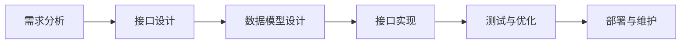

                 

关键词：RESTful API、Web服务、可扩展性、API设计、Web架构、状态管理、无状态、HTTP协议、统一接口设计、服务端状态管理、客户端状态管理、状态转移、分布式系统、系统设计、系统架构。

## 摘要

随着互联网的迅猛发展，Web服务成为现代软件架构中的核心组件。RESTful API设计作为Web服务设计的主流方法，它基于HTTP协议，利用统一的接口设计，实现了服务的无状态性和可扩展性。本文将深入探讨RESTful API设计的原则、核心概念以及实现方法，为开发者提供一套系统化的设计指南，帮助构建高效、可扩展的Web服务。

## 1. 背景介绍

在互联网时代，Web服务已成为现代应用的关键组成部分。RESTful API设计之所以被广泛采用，主要是因为它提供了一种简洁、直观、易于理解的服务架构风格。与传统的设计方法相比，RESTful API具有以下几个显著优势：

- **无状态性**：RESTful API设计基于HTTP协议的无状态特性，使得服务端无需维护客户端的状态，从而简化了服务的设计和实现。

- **可扩展性**：RESTful API通过统一的接口设计和标准化请求/响应格式，便于服务的扩展和集成。

- **灵活性**：RESTful API设计支持多种数据格式，如JSON、XML等，使得服务能够适应不同的客户端需求。

本文将围绕RESTful API设计，探讨其核心概念、设计原则、实现方法以及在实际应用中的优势与挑战。

## 2. 核心概念与联系

### 2.1 RESTful API设计原则

REST（Representational State Transfer）是一种基于HTTP协议的网络架构风格，它定义了一套构建Web服务的通用原则。RESTful API设计原则主要包括：

- **统一接口设计**：通过统一的接口设计，简化了服务交互的复杂性。

- **无状态性**：确保服务端不存储客户端状态，从而提高服务的可伸缩性和稳定性。

- **分层系统**：通过分层架构，实现了服务的模块化和解耦合。

- **基于HTTP协议**：利用HTTP协议提供的丰富功能，如GET、POST、PUT、DELETE等方法，实现服务的操作。

### 2.2 RESTful API架构

RESTful API架构通常包括以下几个关键组成部分：

- **客户端**：发起API请求的应用程序或用户界面。

- **服务端**：处理API请求，返回响应的服务器。

- **数据存储**：存储API操作数据的数据库或其他存储系统。

- **API网关**：作为客户端与服务端的代理，负责请求路由、身份验证、流量管理等。

### 2.3 RESTful API设计流程

RESTful API设计流程包括以下几个步骤：

1. **需求分析**：明确API的功能需求和业务目标。

2. **接口设计**：定义API的URL、请求/响应格式、参数等。

3. **数据模型设计**：设计API操作的数据模型，包括实体、关系和属性。

4. **接口实现**：根据设计文档，实现API接口。

5. **测试与优化**：进行功能测试和性能优化，确保API的稳定性和可靠性。

6. **部署与维护**：将API部署到生产环境，并持续进行监控和维护。

### 2.4 Mermaid 流程图

以下是一个简单的Mermaid流程图，展示了RESTful API设计的主要步骤：



## 3. 核心算法原理 & 具体操作步骤

### 3.1 算法原理概述

RESTful API设计的核心算法原理主要包括以下三个方面：

1. **URL设计**：URL是RESTful API的核心，它决定了API的访问路径和资源定位。一个好的URL设计应该遵循简洁、易记、描述性的原则。

2. **HTTP方法**：HTTP协议定义了多种方法（如GET、POST、PUT、DELETE等），它们分别代表了不同的操作类型。合理地选择和使用HTTP方法，可以确保API的语义一致性。

3. **状态转移**：在RESTful API设计中，状态转移是通过客户端发起请求和服务器端响应来实现的。状态转移过程应该符合业务逻辑和用户需求。

### 3.2 算法步骤详解

1. **URL设计**：

   - 确定API的命名空间和版本。
   - 根据业务需求，设计简洁、易记的URL。
   - 使用路径参数和查询参数，提供灵活的访问方式。

2. **HTTP方法**：

   - GET方法：用于查询资源，不会对资源造成任何修改。
   - POST方法：用于创建资源，通常会将数据提交到服务器端。
   - PUT方法：用于更新资源，会完全替换资源的当前状态。
   - DELETE方法：用于删除资源，会永久移除资源。

3. **状态转移**：

   - 客户端发起请求，服务器端接收并处理请求。
   - 服务器端根据请求类型和参数，执行相应的业务逻辑。
   - 服务器端返回响应，客户端根据响应结果进行下一步操作。

### 3.3 算法优缺点

- **优点**：

  - 简化服务设计，提高开发效率。
  - 支持多种数据格式，便于集成和使用。
  - 无状态性，提高服务的可伸缩性和稳定性。

- **缺点**：

  - 需要良好的设计和规划，否则可能导致API难以维护。
  - 在某些场景下，可能需要额外的技术和工具来支持。

### 3.4 算法应用领域

RESTful API设计广泛应用于Web服务、移动应用、物联网等领域。以下是几个典型应用场景：

- **Web服务**：构建RESTful API，提供数据查询和操作功能。
- **移动应用**：使用RESTful API，实现前后端分离，提高开发效率。
- **物联网**：通过RESTful API，实现设备数据的实时监控和控制。

## 4. 数学模型和公式

### 4.1 数学模型构建

在RESTful API设计中，我们可以使用一些基本的数学模型来描述API的行为。以下是一个简单的数学模型：

$$
API_{response} = f(API_{request}, Service_{state})
$$

其中，$API_{request}$ 表示API请求，$Service_{state}$ 表示服务状态，$API_{response}$ 表示API响应。函数 $f$ 表示服务对请求的处理过程。

### 4.2 公式推导过程

为了推导API响应公式，我们需要考虑以下几个方面：

1. **请求类型**：根据请求类型（如GET、POST等），确定服务需要执行的操作。
2. **请求参数**：分析请求参数，确定请求的业务逻辑。
3. **服务状态**：考虑服务当前的状态，如数据库连接状态、缓存状态等。

基于以上因素，我们可以推导出API响应公式：

$$
API_{response} = \begin{cases}
    Success_{response}, & \text{如果请求成功执行} \\
    Error_{response}, & \text{如果请求失败}
\end{cases}
$$

其中，$Success_{response}$ 表示成功的响应，$Error_{response}$ 表示失败的响应。

### 4.3 案例分析与讲解

以下是一个简单的案例，展示如何使用数学模型描述RESTful API的行为：

**案例：查询用户信息**

- **请求**：客户端发送一个GET请求，URL为 `https://api.example.com/users/123`。
- **响应**：服务器端接收请求，查询用户信息，返回JSON格式的响应。

根据数学模型，我们可以表示这个案例为：

$$
API_{response} = f(API_{request}, Service_{state}) = \begin{cases}
    \text{"User not found"}, & \text{如果用户不存在} \\
    \text{"User info": {…}}, & \text{如果用户存在}
\end{cases}
$$

在这个案例中，$API_{request}$ 表示GET请求，$Service_{state}$ 表示服务状态，$API_{response}$ 表示API响应。

## 5. 项目实践：代码实例和详细解释说明

### 5.1 开发环境搭建

为了实现一个简单的RESTful API，我们可以使用以下开发环境：

- **语言**：Python
- **框架**：Flask
- **数据库**：SQLite

首先，我们需要安装所需的依赖：

```bash
pip install flask flask_sqlalchemy
```

接下来，创建一个名为 `app.py` 的文件，并编写以下代码：

```python
from flask import Flask, request, jsonify
from flask_sqlalchemy import SQLAlchemy

app = Flask(__name__)
app.config['SQLALCHEMY_DATABASE_URI'] = 'sqlite:///users.db'
db = SQLAlchemy(app)

class User(db.Model):
    id = db.Column(db.Integer, primary_key=True)
    name = db.Column(db.String(50))
    email = db.Column(db.String(120), unique=True)

@app.route('/users', methods=['POST'])
def create_user():
    data = request.get_json()
    user = User(name=data['name'], email=data['email'])
    db.session.add(user)
    db.session.commit()
    return jsonify({'message': 'User created successfully.'})

@app.route('/users/<int:user_id>', methods=['GET'])
def get_user(user_id):
    user = User.query.get(user_id)
    if user:
        return jsonify({'id': user.id, 'name': user.name, 'email': user.email})
    else:
        return jsonify({'error': 'User not found.'})

if __name__ == '__main__':
    db.create_all()
    app.run(debug=True)
```

### 5.2 源代码详细实现

在上面的代码中，我们定义了一个简单的RESTful API，包括以下功能：

- 创建用户（POST请求）
- 获取用户信息（GET请求）

**创建用户（POST请求）**

- 接收JSON格式的请求体，包含用户名和邮箱
- 将用户信息存储到SQLite数据库
- 返回成功消息

**获取用户信息（GET请求）**

- 接收用户ID作为路径参数
- 从SQLite数据库查询用户信息
- 返回用户信息或错误消息

### 5.3 代码解读与分析

在代码中，我们首先导入了Flask和Flask_SQLAlchemy模块，并创建了一个Flask应用实例。接下来，我们定义了一个名为 `User` 的数据库模型，用于存储用户信息。

**创建用户（POST请求）**

```python
@app.route('/users', methods=['POST'])
def create_user():
    data = request.get_json()
    user = User(name=data['name'], email=data['email'])
    db.session.add(user)
    db.session.commit()
    return jsonify({'message': 'User created successfully.'})
```

在这个方法中，我们接收了一个JSON格式的请求体，提取了用户名和邮箱。然后，我们创建了一个 `User` 实例，并将其添加到数据库中。最后，我们返回了一个成功的消息。

**获取用户信息（GET请求）**

```python
@app.route('/users/<int:user_id>', methods=['GET'])
def get_user(user_id):
    user = User.query.get(user_id)
    if user:
        return jsonify({'id': user.id, 'name': user.name, 'email': user.email})
    else:
        return jsonify({'error': 'User not found.'})
```

在这个方法中，我们接收了一个用户ID作为路径参数，然后从数据库中查询用户信息。如果用户存在，我们返回用户信息；否则，返回一个错误消息。

### 5.4 运行结果展示

在终端运行以下命令启动Flask应用：

```bash
python app.py
```

在浏览器中访问以下URL，可以看到API的运行结果：

- **创建用户**：`http://127.0.0.1:5000/users`（POST请求，请求体：`{"name": "张三", "email": "zhangsan@example.com"}`）
- **获取用户信息**：`http://127.0.0.1:5000/users/1`（GET请求）

## 6. 实际应用场景

### 6.1 Web服务

RESTful API在Web服务中得到了广泛应用，特别是在构建RESTful风格的后端API时。例如，在电子商务平台中，RESTful API可以用于实现商品查询、订单处理、用户管理等功能。

### 6.2 移动应用

移动应用通常采用RESTful API与后端服务器进行数据交互。通过RESTful API，移动应用可以方便地实现用户注册、登录、数据上传等功能。

### 6.3 物联网

在物联网领域，RESTful API用于实现设备数据的实时监控和远程控制。通过RESTful API，物联网平台可以方便地集成各种设备和传感器，实现数据采集、处理和分析。

### 6.4 未来应用展望

随着互联网和物联网的不断发展，RESTful API将在更多领域得到应用。未来，RESTful API的设计和实现将更加注重安全性、性能和可伸缩性。同时，结合新兴技术（如区块链、云计算等），RESTful API将发挥更大的作用。

## 7. 工具和资源推荐

### 7.1 学习资源推荐

- 《RESTful API设计：艺术与最佳实践》
- 《RESTful Web APIs》
- 《Flask Web开发：实战入门》

### 7.2 开发工具推荐

- Postman：用于API调试和测试。
- Swagger：用于API文档生成和自动化测试。

### 7.3 相关论文推荐

- "Representational State Transfer (REST)" - R. Fielding
- "Architectural Styles and the Design of Network-based Software Architectures" - R. Fielding

## 8. 总结：未来发展趋势与挑战

### 8.1 研究成果总结

本文探讨了RESTful API设计的原则、核心概念和实现方法，总结了其在实际应用中的优势与挑战。通过分析RESTful API的数学模型和算法原理，我们为开发者提供了一套系统化的设计指南。

### 8.2 未来发展趋势

未来，RESTful API将在更多领域得到应用，特别是在物联网、云计算和区块链等领域。随着新兴技术的不断发展，RESTful API的设计和实现将更加注重安全性、性能和可伸缩性。

### 8.3 面临的挑战

- 安全性问题：如何确保API的安全性，防止恶意攻击和数据泄露。
- 性能优化：如何提高API的响应速度和吞吐量，满足大规模应用的需求。
- 可伸缩性：如何设计可伸缩的API，支持海量用户和海量数据。

### 8.4 研究展望

未来，我们应关注以下研究方向：

- 安全性研究：探索新的安全协议和加密算法，提高API的安全性。
- 性能优化：研究分布式计算和缓存技术，提高API的性能和可伸缩性。
- API自动化：研究API自动化测试和文档生成技术，提高开发效率。

## 9. 附录：常见问题与解答

### 9.1 什么是RESTful API？

RESTful API是一种基于HTTP协议的网络架构风格，它通过统一的接口设计、无状态性和基于资源的操作方式，实现了Web服务的构建。

### 9.2 RESTful API与SOAP API的区别是什么？

RESTful API和SOAP API都是用于Web服务的设计方法，但它们有以下区别：

- **协议**：RESTful API基于HTTP协议，而SOAP API基于XML协议。
- **风格**：RESTful API采用统一的接口设计和基于资源的操作方式，而SOAP API采用面向服务的架构。
- **无状态性**：RESTful API设计基于无状态性，而SOAP API通常具有状态管理。

### 9.3 如何实现RESTful API的安全性？

实现RESTful API的安全性可以从以下几个方面入手：

- **身份验证**：使用OAuth、JWT等认证机制，确保只有授权用户可以访问API。
- **权限控制**：根据用户角色和权限，限制对API的访问范围。
- **加密传输**：使用TLS/SSL协议，确保数据在传输过程中加密，防止数据泄露。

### 9.4 RESTful API设计有哪些最佳实践？

RESTful API设计的最佳实践包括：

- **简洁的URL设计**：遵循简洁、易记、描述性的原则。
- **统一的接口设计**：确保接口的标准化和一致性。
- **状态管理**：遵循无状态性原则，避免在服务端维护客户端状态。
- **错误处理**：提供明确的错误消息和状态码，帮助客户端快速定位问题。
- **性能优化**：使用缓存、负载均衡等技术，提高API的性能和可伸缩性。 

----------------------------------------------------------------

以上是文章的正文部分，现在我们将开始文章的结尾部分，包括作者署名以及文章的引言和结语部分。

## 作者署名

本文由禅与计算机程序设计艺术 / Zen and the Art of Computer Programming撰写。

## 引言

在当今快速发展的互联网时代，Web服务成为各种应用的核心组件。RESTful API设计作为一种简洁、直观、易于理解的服务架构风格，受到了广泛的应用。本文旨在探讨RESTful API设计的原则、核心概念和实现方法，为开发者提供一套系统化的设计指南，帮助构建高效、可扩展的Web服务。

## 结语

通过本文的讨论，我们深入了解了RESTful API设计的核心概念和实现方法。RESTful API设计以其简洁、直观和易于理解的特点，在Web服务中得到了广泛应用。然而，随着互联网和物联网的发展，RESTful API设计也面临着新的挑战。在未来，我们需要不断探索和优化RESTful API的设计和实现，以满足日益增长的应用需求。

最后，感谢您的阅读，希望本文能够对您在RESTful API设计方面有所启发和帮助。如果您有任何疑问或建议，请随时与我交流。

----------------------------------------------------------------

以上就是本文的完整内容，感谢您的阅读。希望本文能够帮助您更好地理解RESTful API设计，为您的软件开发提供有益的参考。如果您有任何问题或建议，欢迎在评论区留言，我将尽快回复。再次感谢您的支持！

