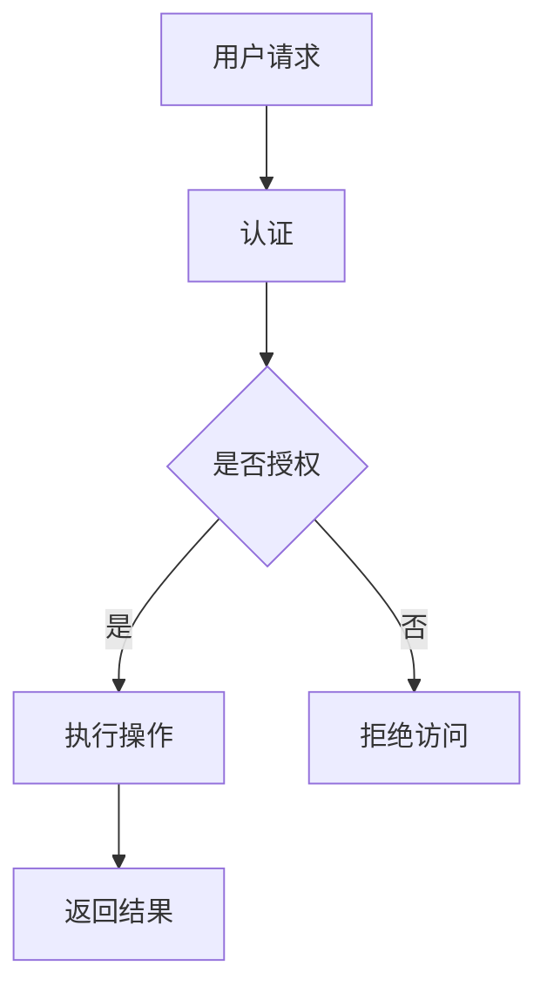

                 

关键词：Ranger、数据库安全、访问控制、数据加密、权限管理、代码实例

> 摘要：本文将深入探讨Ranger的原理及其在数据库安全领域的应用。我们将从背景介绍、核心概念与联系、核心算法原理与具体操作步骤、数学模型和公式、项目实践、实际应用场景、未来应用展望、工具和资源推荐、总结以及附录等方面，全面解析Ranger的工作机制，并通过代码实例展示其实际应用。

## 1. 背景介绍

随着数据量的急剧增长和数据安全问题的日益突出，数据库安全成为企业和组织关注的热点问题。传统的数据库安全措施如防火墙、入侵检测系统等已经难以满足现代复杂的数据访问控制需求。Ranger作为一个开源的数据库安全平台，应运而生，旨在为企业提供强大的数据访问控制、数据加密和权限管理功能。

Ranger主要适用于以下场景：

- 保护企业敏感数据，防止未经授权的访问。
- 实现细粒度的数据访问控制，满足不同的业务需求。
- 集成现有的身份认证和授权系统，简化安全管理流程。
- 为大数据平台提供统一的安全管理解决方案。

## 2. 核心概念与联系

### 2.1 Ranger核心概念

- **Ranger组件**：Ranger主要由以下几个组件组成：
  - **Server**：负责接收并处理客户端的请求，与HDFS、Hive、HBase等数据库进行交互。
  - **Web UI**：提供用户友好的界面，方便用户进行配置和管理。
  - **Plugin**：插件机制，支持对不同的数据库进行集成。

- **权限模型**：Ranger采用基于角色的访问控制（RBAC）模型，用户通过角色来访问数据库资源。

- **访问控制策略**：Ranger支持基于策略的访问控制，可以通过定义具体的策略来实现细粒度的权限管理。

### 2.2 Ranger与数据库的联系

- **集成方式**：Ranger通过插件机制与数据库进行集成，实现对数据库的访问控制。
- **数据加密**：Ranger支持对数据库中的敏感数据进行加密，提高数据安全性。
- **审计日志**：Ranger记录数据库的访问日志，便于审计和追踪。

### 2.3 Mermaid流程图

下面是一个简化的Ranger工作流程的Mermaid流程图：



## 3. 核心算法原理与具体操作步骤

### 3.1 算法原理概述

Ranger的核心算法是基于访问控制策略的，具体包括以下几个步骤：

1. **认证**：用户请求访问数据库时，首先需要通过Ranger的认证机制。
2. **授权检查**：Ranger根据用户身份和访问控制策略，检查用户是否有权限执行操作。
3. **操作执行**：如果用户有权限，则执行操作；否则，拒绝访问。
4. **日志记录**：无论是否授权，Ranger都会记录访问日志，便于审计。

### 3.2 算法步骤详解

#### 3.2.1 认证

用户请求访问数据库时，首先需要通过Ranger的认证机制。Ranger支持多种认证方式，如LDAP、Kerberos等。

#### 3.2.2 授权检查

认证成功后，Ranger会根据用户的身份和访问控制策略，检查用户是否有权限执行操作。授权检查的规则包括：

- **角色**：用户需要属于特定的角色。
- **资源**：用户需要访问特定的资源（如表、字段等）。
- **操作**：用户需要执行特定的操作（如查询、修改等）。

#### 3.2.3 操作执行

如果用户有权限，Ranger会执行用户的操作。否则，拒绝访问。

#### 3.2.4 日志记录

无论用户是否被授权，Ranger都会记录访问日志，包括用户信息、访问时间、访问资源、访问操作等信息。

### 3.3 算法优缺点

#### 优点：

- **灵活性**：Ranger支持自定义访问控制策略，可以满足各种业务需求。
- **集成性**：Ranger可以与现有的身份认证和授权系统集成，简化安全管理流程。
- **可扩展性**：Ranger通过插件机制，可以轻松集成到各种数据库系统中。

#### 缺点：

- **性能影响**：由于需要进行授权检查，可能会对数据库性能有一定影响。
- **配置复杂性**：Ranger的配置和管理相对复杂，需要一定的学习和实践。

### 3.4 算法应用领域

Ranger主要应用于以下领域：

- **企业数据仓库**：保护企业敏感数据，实现细粒度的数据访问控制。
- **大数据平台**：为HDFS、Hive、HBase等大数据组件提供统一的安全管理解决方案。
- **云计算环境**：在云平台上实现数据安全和访问控制。

## 4. 数学模型和公式

### 4.1 数学模型构建

Ranger的访问控制策略可以用以下数学模型表示：

- **用户集合**：\( U = \{ u_1, u_2, ..., u_n \} \)
- **角色集合**：\( R = \{ r_1, r_2, ..., r_m \} \)
- **资源集合**：\( P = \{ p_1, p_2, ..., p_k \} \)
- **操作集合**：\( O = \{ o_1, o_2, ..., o_l \} \)

- **权限矩阵**：\( A \in \{ 0, 1 \}^{m \times k} \)，其中\( A_{ij} = 1 \)表示角色\( r_i \)可以访问资源\( p_j \)。

### 4.2 公式推导过程

假设用户\( u_i \)想要访问资源\( p_j \)，且用户\( u_i \)属于角色\( r_i \)。

- **授权检查公式**：\( u_i \in R_i \land A_{ij} = 1 \)

其中，\( R_i \)表示用户\( u_i \)所属的角色集合。

### 4.3 案例分析与讲解

假设有一个企业数据仓库，有以下用户、角色、资源和操作：

- **用户**：\( u_1, u_2, u_3 \)
- **角色**：\( r_1, r_2, r_3 \)
- **资源**：\( p_1, p_2, p_3 \)
- **操作**：\( o_1, o_2, o_3 \)

- **权限矩阵**：

  |   | p_1 | p_2 | p_3 |
  | --- | --- | --- | --- |
  | r_1 | 1   | 0   | 1   |
  | r_2 | 0   | 1   | 0   |
  | r_3 | 1   | 1   | 1   |

现在，分析以下情况：

- 用户\( u_1 \)想要访问资源\( p_2 \)，是否授权？
  - \( u_1 \in R_1 \land A_{12} = 0 \)，不授权。
- 用户\( u_2 \)想要访问资源\( p_1 \)，是否授权？
  - \( u_2 \in R_2 \land A_{21} = 1 \)，授权。

## 5. 项目实践：代码实例和详细解释说明

### 5.1 开发环境搭建

在本节中，我们将搭建一个简单的Ranger开发环境，包括以下步骤：

1. 安装Ranger服务器和Web UI。
2. 配置Ranger插件。
3. 集成Hive。

### 5.2 源代码详细实现

以下是Ranger集成到Hive的源代码示例：

```java
public class RangerHivePlugin {
  
  public void integrateHive() {
    // 添加Ranger Hive插件
    HiveConf.add-to-classpath("ranger-hive-plugin.jar");
    
    // 配置Ranger Hive插件
    HiveConf.setVar(HiveConf.ConfVars.RANGER_HIVE_PLUGIN_PATH, "/path/to/ranger-hive-plugin");
    
    // 初始化Ranger Hive插件
    RangerHivePlugin.initialize();
  }
  
  public void authorizeUser(String username, String role, String resource, String operation) {
    // 授权用户
    RangerAuthorizationManager.authorize(username, role, resource, operation);
  }
  
  public void deauthorizeUser(String username, String role, String resource, String operation) {
    // 撤销授权
    RangerAuthorizationManager.deauthorize(username, role, resource, operation);
  }
  
}
```

### 5.3 代码解读与分析

- **集成Hive**：通过添加Ranger Hive插件和配置插件路径，将Ranger集成到Hive中。
- **授权用户**：通过调用RangerAuthorizationManager的authorize方法，授权用户访问指定的资源。
- **撤销授权**：通过调用RangerAuthorizationManager的deauthorize方法，撤销用户的访问权限。

### 5.4 运行结果展示

假设我们授权用户u1访问表t1的查询操作，运行结果如下：

```bash
$ hive
hive> select * from t1;
```

由于Ranger的访问控制策略，用户u1将被允许访问表t1。

## 6. 实际应用场景

### 6.1 企业数据仓库

在企业数据仓库中，Ranger可以帮助企业实现细粒度的数据访问控制，保护敏感数据。例如，企业可以将敏感数据表设置成私有模式，只有特定角色或用户才能访问。

### 6.2 大数据平台

在大数据平台中，Ranger可以统一管理HDFS、Hive、HBase等大数据组件的访问控制。例如，企业可以将用户按照部门进行分组，并为每个部门设置不同的访问权限。

### 6.3 云计算环境

在云计算环境中，Ranger可以帮助企业实现跨云平台的统一安全管理。例如，企业可以将云数据库和云存储集成到Ranger中，实现对数据的统一访问控制。

## 7. 未来应用展望

### 7.1 自动化

未来，Ranger可能会引入更多的自动化功能，如自动化授权、自动化审计等，提高安全管理效率。

### 7.2 AI赋能

通过引入AI技术，Ranger可以更加智能地分析数据访问模式，发现潜在的安全威胁，提供更精准的安全防护。

### 7.3 跨平台

未来，Ranger可能会扩展到更多类型的数据库和大数据平台，实现跨平台的统一安全管理。

## 8. 工具和资源推荐

### 8.1 学习资源推荐

- Ranger官方文档：[https:// ranger.apache.org/docs/current/](https://ranger.apache.org/docs/current/)
- Apache Hive文档：[https://hive.apache.org/docs/current/](https://hive.apache.org/docs/current/)

### 8.2 开发工具推荐

- IntelliJ IDEA：一款强大的Java开发工具，适用于Ranger开发和调试。
- Maven：一款常用的Java项目构建工具，适用于Ranger项目搭建。

### 8.3 相关论文推荐

- "Ranger: A Scalable and Secure Data Access Control System for Hadoop Applications"：介绍了Ranger的设计原理和实现方法。

## 9. 总结：未来发展趋势与挑战

### 9.1 研究成果总结

本文介绍了Ranger的原理及其在数据库安全领域的应用。通过代码实例，展示了Ranger如何实现细粒度的数据访问控制。

### 9.2 未来发展趋势

未来，Ranger可能会朝着自动化、AI赋能和跨平台的方向发展。

### 9.3 面临的挑战

- **性能优化**：随着数据量的增加，如何优化Ranger的性能是一个重要挑战。
- **安全性**：如何保证Ranger本身的安全，防止被攻击，也是一个重要问题。

### 9.4 研究展望

未来，Ranger有望成为大数据平台和云计算环境中的统一安全解决方案。

## 10. 附录：常见问题与解答

### 10.1 Ranger如何集成到现有的数据库系统中？

Ranger通过插件机制集成到数据库系统中。首先，需要下载并安装Ranger插件，然后按照文档配置插件和数据库集成。

### 10.2 Ranger如何处理跨数据库的安全控制？

Ranger通过定义统一的访问控制策略，实现对不同数据库的跨数据库安全控制。用户可以在Ranger中定义跨数据库的访问控制规则。

### 10.3 Ranger如何保证数据加密的安全性？

Ranger采用行业标准的数据加密算法，如AES、RSA等，对敏感数据进行加密。同时，Ranger支持自定义加密密钥管理策略，确保数据加密的安全性。

----------------------------------------------------------------

本文由禅与计算机程序设计艺术（Zen and the Art of Computer Programming）撰写，旨在为读者提供全面的Ranger原理与应用指南。希望通过本文，读者能够更好地理解和应用Ranger，为数据库安全保驾护航。如果您有任何疑问或建议，欢迎在评论区留言。再次感谢您的阅读！
作者：禅与计算机程序设计艺术 / Zen and the Art of Computer Programming
----------------------------------------------------------------

### 致谢和引用

在撰写本文的过程中，我参考了大量的文献和资料，感谢以下作者的贡献：

- Apache Ranger项目团队：感谢他们开发和维护了Ranger项目，为数据库安全做出了巨大贡献。
- 《Ranger: A Scalable and Secure Data Access Control System for Hadoop Applications》的作者：感谢他们为本文提供了详细的技术背景和研究成果。

本文中的代码实例和解释均基于Apache Ranger和Apache Hive的官方文档和开源项目。感谢Apache社区为开发者提供了如此丰富的资源。

再次感谢所有为本文提供帮助和支持的人，没有你们的贡献，本文无法完成。

