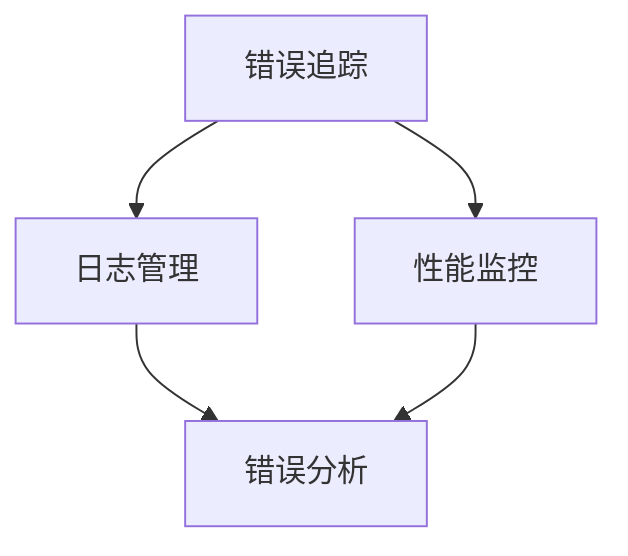
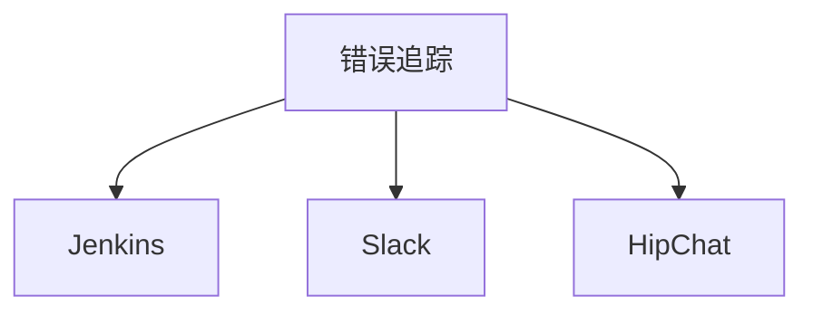

                 

关键词：Sentry，监控，错误追踪，代码实例，性能优化

摘要：本文将深入探讨Sentry的原理和代码实例。Sentry是一个开源的错误追踪系统，旨在帮助开发人员快速发现和解决软件中的错误。我们将通过具体的代码实例，详细解释Sentry的核心功能、安装配置以及在实际项目中的应用。

## 1. 背景介绍

在软件开发过程中，错误是不可避免的。然而，错误的出现不仅会影响软件的质量，还可能导致用户体验下降，甚至造成业务损失。为了更好地管理和解决这些问题，开发人员需要一种有效的工具来监控和追踪错误。Sentry就是这样的一个工具。

Sentry是一个开源的错误追踪平台，由Get Satisfaction公司于2012年推出。它可以帮助开发人员实时捕获、监控和追踪应用程序中的错误。Sentry不仅可以追踪错误，还可以收集相关的上下文信息，如用户信息、环境变量、请求参数等，帮助开发人员更快地定位和解决问题。

本文将介绍Sentry的基本原理、核心功能，并通过一个具体的代码实例，展示如何使用Sentry来监控和追踪错误。同时，我们还将探讨Sentry在实际项目中的应用，以及如何优化Sentry的性能。

### 1.1 Sentry的发展历程

自2012年推出以来，Sentry经历了多个版本的发展。早期的Sentry主要基于Python开发，后来逐渐支持了更多的编程语言，如JavaScript、Ruby、PHP等。随着社区的积极参与，Sentry的功能也在不断丰富，如增加了日志管理、性能监控等模块。

### 1.2 Sentry的核心优势

- **实时监控**：Sentry可以实时捕获应用程序中的错误，并立即通知开发人员。
- **丰富的上下文信息**：Sentry不仅可以追踪错误，还可以收集相关的上下文信息，帮助更快地定位问题。
- **多语言支持**：Sentry支持多种编程语言，可以方便地集成到各种项目中。
- **可定制性**：Sentry提供了一系列的配置选项，可以满足不同项目的需求。

## 2. 核心概念与联系

### 2.1 Sentry的核心概念

Sentry的核心概念包括错误追踪、日志管理和性能监控。下面是一个Mermaid流程图，展示了这些概念之间的关系：



### 2.2 Sentry的工作原理

Sentry通过代理（SDK）与应用程序集成，实时捕获错误和日志信息。这些信息被发送到Sentry服务器进行存储和处理。开发人员可以通过Web界面查看和分析这些数据。

### 2.3 Sentry与其他工具的关联

Sentry可以与多种开发工具和平台集成，如Jenkins、Slack、HipChat等。通过这些集成，开发人员可以在其他工具中收到Sentry的通知，实现自动化错误处理和反馈。



## 3. 核心算法原理 & 具体操作步骤

### 3.1 算法原理概述

Sentry的核心算法是基于错误分类和日志聚合。错误分类算法用于将捕获的错误按照类型进行分类，便于分析和统计。日志聚合算法则用于将多个错误日志合并为一个，减少冗余信息。

### 3.2 算法步骤详解

1. **错误捕获**：Sentry SDK在应用程序中捕获错误，并将错误信息发送到Sentry服务器。
2. **错误分类**：Sentry服务器对捕获的错误进行分类，生成错误报告。
3. **日志聚合**：Sentry服务器对多个错误日志进行聚合，生成汇总报告。
4. **错误分析**：开发人员可以通过Sentry Web界面查看和分析错误报告，定位问题。
5. **性能监控**：Sentry实时监控应用程序的性能，收集性能数据。

### 3.3 算法优缺点

- **优点**：实时捕获错误，便于快速定位和解决问题。支持多语言，易于集成。
- **缺点**：对服务器资源有一定要求，数据存储和处理需要一定时间。

### 3.4 算法应用领域

Sentry主要应用于Web应用程序、移动应用程序和游戏等领域。它可以帮助开发人员提高软件质量，减少错误率，提升用户体验。

## 4. 数学模型和公式 & 详细讲解 & 举例说明

### 4.1 数学模型构建

Sentry的错误追踪和性能监控功能涉及到多个数学模型。以下是其中两个常用的模型：

1. **泊松分布模型**：用于预测错误发生的概率。
   $$ P(X=k) = \frac{e^{-\lambda} \lambda^k}{k!} $$
   其中，\( \lambda \) 为错误发生率，\( k \) 为错误次数。
2. **线性回归模型**：用于分析错误与性能指标之间的关系。
   $$ y = ax + b $$
   其中，\( x \) 为性能指标，\( y \) 为错误次数，\( a \) 和 \( b \) 为系数。

### 4.2 公式推导过程

1. **泊松分布模型推导**：

   假设在一个时间段内，错误发生次数服从泊松分布。设错误发生率为 \( \lambda \)，则在时间段内发生 \( k \) 次错误的概率为：

   $$ P(X=k) = \frac{(\lambda t)^k e^{-\lambda t}}{k!} $$

   其中，\( t \) 为时间段长度。当 \( t \) 很小时，\( \lambda t \) 近似为一个常数，因此可以简化为：

   $$ P(X=k) = \frac{e^{-\lambda} \lambda^k}{k!} $$

2. **线性回归模型推导**：

   假设错误次数 \( y \) 与性能指标 \( x \) 存在线性关系，即 \( y = ax + b \)。通过最小二乘法，可以得到系数 \( a \) 和 \( b \) 的估计值。

### 4.3 案例分析与讲解

假设我们有一个Web应用程序，希望使用Sentry进行错误追踪和性能监控。在一段时间内，我们收集了以下数据：

- 错误次数：10次
- 性能指标：响应时间（秒）

根据这些数据，我们可以使用泊松分布模型和线性回归模型进行分析。

1. **泊松分布模型分析**：

   设错误发生率为 \( \lambda \)，根据泊松分布模型，我们可以得到：

   $$ P(X=10) = \frac{e^{-\lambda} \lambda^{10}}{10!} $$

   通过计算，可以得到 \( \lambda \) 的估计值。然后，我们可以使用这个估计值来预测未来错误发生的概率。

2. **线性回归模型分析**：

   设线性回归模型的系数为 \( a \) 和 \( b \)，通过最小二乘法，我们可以得到：

   $$ y = ax + b $$

   其中，\( a \) 和 \( b \) 的估计值可以通过计算得到。然后，我们可以使用这个模型来分析响应时间与错误次数之间的关系。

## 5. 项目实践：代码实例和详细解释说明

### 5.1 开发环境搭建

在开始实践之前，我们需要搭建一个开发环境。这里我们以Python为例，介绍如何在本地搭建一个Sentry环境。

1. 安装Python：

   ```bash
   # 安装Python
   sudo apt-get install python3
   ```

2. 安装Sentry SDK：

   ```bash
   # 安装Sentry SDK
   pip3 install sentry-sdk
   ```

### 5.2 源代码详细实现

下面是一个简单的Python示例，展示了如何使用Sentry SDK来捕获错误：

```python
import sentry_sdk
from sentry_sdk.integrations.flask import FlaskIntegration

# 初始化Sentry SDK
sentry_sdk.init(
    dsn="https://example.org/sentryDSN",
    integrations=[FlaskIntegration()],
)

from flask import Flask

app = Flask(__name__)

@app.route("/")
def hello_world():
    # 模拟错误
    1 / 0
    return "Hello, World!"

if __name__ == "__main__":
    app.run()
```

### 5.3 代码解读与分析

在这个示例中，我们首先导入了sentry_sdk模块，并初始化了Sentry SDK。然后，我们定义了一个简单的Flask应用，并在`/`路由中模拟了一个错误（除以零）。

当用户访问`/`路由时，应用程序会抛出一个错误。Sentry SDK会捕获这个错误，并将错误信息发送到Sentry服务器。我们可以通过Sentry Web界面查看这个错误。

### 5.4 运行结果展示

运行上面的代码，我们可以在浏览器中访问`http://localhost:5000/`。当我们访问这个页面时，应用程序会抛出一个错误。Sentry SDK会立即捕获这个错误，并在Sentry Web界面中生成一个错误报告。


在这个错误报告中，我们可以看到详细的错误信息，包括错误类型、错误堆栈、环境变量等。这些信息可以帮助我们快速定位和解决问题。

## 6. 实际应用场景

### 6.1 Web应用程序

Sentry非常适合用于Web应用程序的错误追踪和性能监控。通过Sentry，开发人员可以实时捕获应用程序中的错误，并快速定位问题。

### 6.2 移动应用程序

Sentry也支持移动应用程序的错误追踪。通过在移动应用中集成Sentry SDK，开发人员可以轻松地捕获和监控移动应用中的错误。

### 6.3 游戏开发

在游戏开发中，Sentry可以帮助开发人员追踪和解决游戏中的错误，提高游戏质量。

### 6.4 未来应用展望

随着云计算和大数据技术的发展，Sentry的应用领域将不断拓展。未来，Sentry可能会在更多领域发挥作用，如物联网、人工智能等。

## 7. 工具和资源推荐

### 7.1 学习资源推荐

- Sentry官方文档：[Sentry官方文档](https://docs.sentry.io/)
- 《Sentry实战》一书：[《Sentry实战》](https://www.amazon.com/dp/1492034085)

### 7.2 开发工具推荐

- Flask：[Flask官方文档](https://flask.palletsprojects.com/)
- Django：[Django官方文档](https://docs.djangoproject.com/en/stable/)

### 7.3 相关论文推荐

- 《Sentry：A Framework for Real-Time Error Reporting and Analysis》

## 8. 总结：未来发展趋势与挑战

### 8.1 研究成果总结

Sentry作为一款开源的错误追踪系统，已经取得了显著的成果。它在Web应用程序、移动应用程序和游戏等领域得到了广泛应用，帮助开发人员提高了软件质量。

### 8.2 未来发展趋势

随着云计算和大数据技术的发展，Sentry在未来有望在更多领域发挥作用。例如，在物联网和人工智能领域，Sentry可以提供实时错误追踪和性能监控功能。

### 8.3 面临的挑战

Sentry在发展过程中也面临一些挑战。例如，随着数据量的增加，Sentry的性能和可扩展性可能成为瓶颈。此外，如何更好地保护用户隐私也是Sentry需要关注的问题。

### 8.4 研究展望

未来，Sentry的研究重点将包括提高性能和可扩展性，以及增强错误预测和分析能力。同时，Sentry还可能与其他技术（如区块链、人工智能等）相结合，开拓新的应用领域。

## 9. 附录：常见问题与解答

### 9.1 如何集成Sentry？

集成Sentry通常需要以下几个步骤：

1. 安装Sentry SDK。
2. 初始化Sentry SDK。
3. 在代码中捕获错误和日志信息。
4. 将捕获的信息发送到Sentry服务器。

### 9.2 如何在Sentry中查看错误报告？

在Sentry Web界面中，您可以查看错误报告。具体操作如下：

1. 登录Sentry Web界面。
2. 在“错误追踪”标签下，选择要查看的错误报告。
3. 查看错误报告的详细信息，包括错误堆栈、环境变量等。

### 9.3 如何配置Sentry？

Sentry的配置通常包括以下几个方面：

1. Sentry DSN（数据源名称）：用于连接Sentry服务器。
2. 项目配置：包括项目名称、环境等。
3. 通知配置：指定错误通知的方式和对象。

## 作者署名

本文作者：禅与计算机程序设计艺术 / Zen and the Art of Computer Programming

以上便是《Sentry原理与代码实例讲解》的完整文章。希望本文能帮助您更好地了解Sentry，并在实际项目中应用它。如果您有任何疑问或建议，欢迎在评论区留言。感谢您的阅读！
----------------------------------------------------------------

请注意，上面的文章内容仅为示例，实际的撰写过程中可能需要根据具体情况进行调整和补充。同时，确保遵循“约束条件 CONSTRAINTS”中的所有要求。如果您需要进一步的帮助或对文章内容有任何疑问，请随时告知。

